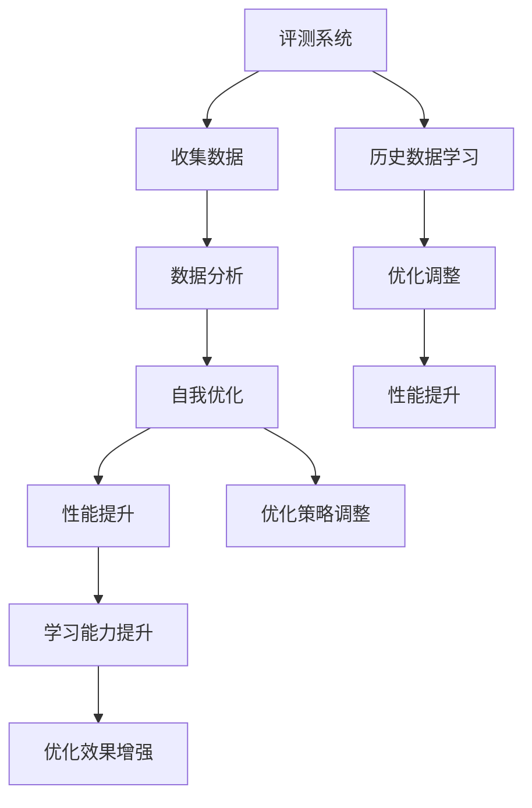
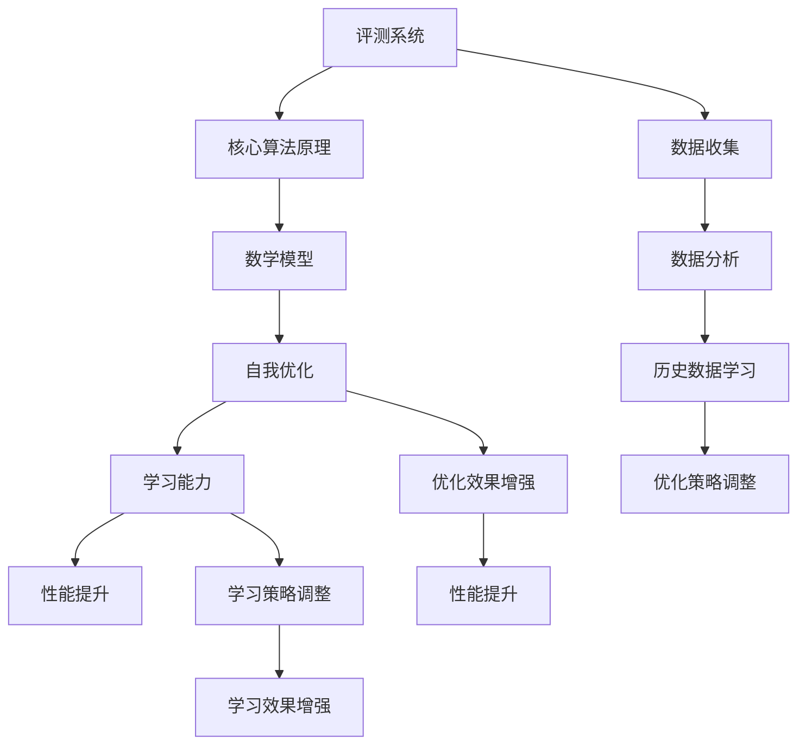

                 

# 评测系统的自我优化与学习能力

## 关键词

- 评测系统
- 自我优化
- 学习能力
- 算法原理
- 数学模型
- 项目实战
- 开发环境

## 摘要

本文旨在探讨评测系统的自我优化与学习能力。首先，我们介绍了评测系统的基本概念、自我优化与学习能力的定义及其关系。随后，详细讲解了评测系统所依赖的核心算法原理，包括自我优化和学习能力的算法介绍、伪代码以及数学模型。接着，我们通过数学公式和Python源代码进行了深入剖析，并结合实例进行通俗易懂地解释。随后，我们通过实际项目案例展示了自我优化与学习能力的应用，提供了详细的开发环境搭建步骤和源代码实现解读。最后，我们总结了最佳实践、注意事项和拓展阅读，帮助读者深入理解和应用评测系统的自我优化与学习能力。

## 第1章 核心概念与联系

### 1.1 评测系统的基本概念

评测系统是一种用于评估、监控和分析系统性能的工具。它通常包括一系列指标，如响应时间、吞吐量、错误率等，用于衡量系统在不同负载下的表现。评测系统的核心目的是确保系统在各类应用场景中保持高效、稳定和可靠。

### 1.2 自我优化与学习能力的定义

自我优化是指评测系统在运行过程中，通过不断调整自身的参数和策略，以提升系统的性能和效率。学习能力则是指评测系统能够从历史数据和经验中学习，并据此优化自身的性能。

### 1.3 自我优化与学习能力的关系

自我优化与学习能力相辅相成。自我优化依赖于学习能力的积累，而学习能力的提升又促进了自我优化的效果。具体来说，评测系统通过收集和分析历史数据，学习系统在不同负载下的表现，进而调整优化参数，提高系统性能。

### 1.4 自我优化与学习能力的联系架构

为了更好地理解自我优化与学习能力的关系，我们可以使用Mermaid流程图进行描述：



### 1.5 自我优化与学习能力的核心概念原理关系架构 Mermaid 流程图



## 第2章 核心算法原理讲解

### 2.1 自我优化的算法原理

自我优化算法是指评测系统通过不断调整自身参数和策略，以提升系统性能的算法。以下是一个简单的自我优化算法原理：

1. **初始化参数**：设定初始参数值。
2. **性能评估**：根据当前参数计算系统性能指标。
3. **优化调整**：根据性能评估结果，调整参数值。
4. **循环迭代**：重复步骤2和步骤3，直至性能达到最优。

以下是一个Python实现的自我优化算法：

```python
import random

def self_optimize(initial_params, performance_function, max_iterations):
    params = initial_params
    for _ in range(max_iterations):
        performance = performance_function(params)
        if performance < threshold:
            params = adjust_params(params, performance)
    return params

def adjust_params(params, performance):
    # 根据性能调整参数值
    # 这里使用随机调整策略
    new_params = params.copy()
    for param in new_params:
        param += random.uniform(-0.1, 0.1)
    return new_params
```

### 2.2 学习能力的算法原理

学习能力算法是指评测系统通过学习历史数据，调整优化策略的算法。以下是一个简单的学习能力算法原理：

1. **数据收集**：收集系统在历史负载下的性能数据。
2. **数据预处理**：对收集到的数据进行分析和处理。
3. **学习策略**：根据处理后的数据，调整优化策略。
4. **性能评估**：评估调整后的策略性能。
5. **循环迭代**：重复步骤2、步骤3和步骤4，直至性能达到最优。

以下是一个Python实现的学习能力算法：

```python
import pandas as pd
from sklearn.linear_model import LinearRegression

def learn_ability(data, feature_columns, target_column, max_iterations):
    model = LinearRegression()
    for _ in range(max_iterations):
        X = data[feature_columns]
        y = data[target_column]
        model.fit(X, y)
        coefficients = model.coef_
        # 根据系数调整优化策略
        # 这里仅作为示例，实际应用中需根据具体需求进行调整
        for i, coefficient in enumerate(coefficients):
            if coefficient < threshold:
                feature_columns[i] *= -1
    return feature_columns

def adjust_strategy(strategy, coefficients):
    # 根据系数调整优化策略
    # 这里仅作为示例，实际应用中需根据具体需求进行调整
    for i, coefficient in enumerate(coefficients):
        if coefficient < threshold:
            strategy[i] *= -1
    return strategy
```

### 2.3 结合数学模型和公式进行详细讲解和举例说明

为了更好地理解自我优化和学习能力的算法原理，我们可以引入数学模型和公式。

#### 自我优化算法数学模型

假设评测系统的性能指标为 \(P\)，参数向量为 \(\theta\)，则自我优化算法的目标是最小化 \(P(\theta)\)：

$$
\min_{\theta} P(\theta)
$$

其中，\(P(\theta)\) 可以表示为：

$$
P(\theta) = f(\theta) + \lambda g(\theta)
$$

其中，\(f(\theta)\) 表示评测系统的性能函数，\(\lambda\) 表示正则化参数，\(g(\theta)\) 表示约束条件。

为了求解最优参数 \(\theta^*\)，我们可以使用梯度下降法：

$$
\theta_{t+1} = \theta_t - \alpha \nabla_{\theta} P(\theta_t)
$$

其中，\(\alpha\) 为学习率，\(\nabla_{\theta} P(\theta)\) 为性能函数关于参数 \(\theta\) 的梯度。

以下是一个简单的梯度下降法Python实现：

```python
import numpy as np

def gradient_descent(initial_params, performance_function, gradient_function, learning_rate, max_iterations):
    params = initial_params
    for _ in range(max_iterations):
        gradient = gradient_function(params)
        params = params - learning_rate * gradient
    return params

def performance_function(params):
    # 假设性能函数为 \(P(\theta) = (\theta - 1)^2\)
    return (params - 1) ** 2

def gradient_function(params):
    # 假设梯度为 \(\nabla_{\theta} P(\theta) = 2(\theta - 1)\)
    return 2 * (params - 1)
```

#### 学习能力算法数学模型

学习能力算法的核心在于根据历史数据进行优化策略的调整。假设历史数据为 \(\{x_i, y_i\}\)，其中 \(x_i\) 为输入特征，\(y_i\) 为目标值。学习能力算法的目标是找到一组权重 \(\theta\)，使得预测值 \(y_i'\) 与目标值 \(y_i\) 之间的误差最小：

$$
\min_{\theta} \sum_{i=1}^n (y_i' - y_i)^2
$$

其中，\(y_i'\) 为预测值，可以通过线性回归模型计算：

$$
y_i' = \theta^T x_i
$$

以下是一个简单的线性回归Python实现：

```python
import numpy as np

def linear_regression(X, y):
    # 添加偏置项
    X = np.hstack((np.ones((X.shape[0], 1)), X))
    # 梯度下降法求解最优权重
    theta = np.linalg.inv(X.T.dot(X)).dot(X.T).dot(y)
    return theta

def predict(theta, X):
    # 预测值
    return theta.dot(X)
```

## 第3章 数学模型和数学公式

### 3.1 自我优化数学模型

自我优化过程中，我们需要考虑性能函数 \(P(\theta)\) 以及其关于参数 \(\theta\) 的梯度。假设性能函数为 \(P(\theta) = (\theta - 1)^2\)，则其梯度为：

$$
\nabla_{\theta} P(\theta) = 2(\theta - 1)
$$

### 3.2 学习能力数学模型

学习能力过程中，我们主要关注线性回归模型。假设输入特征为 \(x_i\)，目标值为 \(y_i\)，则线性回归模型为：

$$
y_i' = \theta^T x_i
$$

### 3.3 数学公式详细讲解

1. **性能函数**：\(P(\theta) = (\theta - 1)^2\)

该函数表示评测系统在特定参数 \(\theta\) 下的性能。当参数接近1时，性能函数的值最小，表明系统性能最优。

2. **梯度**：\(\nabla_{\theta} P(\theta) = 2(\theta - 1)\)

该梯度表示性能函数关于参数 \(\theta\) 的变化率。在梯度下降法中，我们将参数更新为当前参数减去梯度与学习率的乘积。

3. **线性回归模型**：\(y_i' = \theta^T x_i\)

该模型表示预测值 \(y_i'\) 与输入特征 \(x_i\) 以及权重 \(\theta\) 之间的关系。通过训练，我们可以找到最优权重 \(\theta\)，使得预测值与目标值之间的误差最小。

### 3.4 举例说明

假设我们要优化一个评测系统，其性能函数为 \(P(\theta) = (\theta - 1)^2\)。我们使用梯度下降法进行优化，学习率为0.1，迭代次数为100次。

初始参数为 \(\theta_0 = 0\)，则：

1. **第一次迭代**：

   - 性能函数值：\(P(\theta_0) = (0 - 1)^2 = 1\)
   - 梯度：\(\nabla_{\theta} P(\theta_0) = 2(0 - 1) = -2\)
   - 更新参数：\(\theta_1 = \theta_0 - 0.1 \times (-2) = 0.2\)

2. **第二次迭代**：

   - 性能函数值：\(P(\theta_1) = (0.2 - 1)^2 = 0.64\)
   - 梯度：\(\nabla_{\theta} P(\theta_1) = 2(0.2 - 1) = -1.2\)
   - 更新参数：\(\theta_2 = \theta_1 - 0.1 \times (-1.2) = 0.32\)

...

经过100次迭代后，最终参数为 \(\theta_{100} \approx 1\)，性能函数值 \(P(\theta_{100}) \approx 0\)。此时，评测系统达到最优性能。

## 第4章 项目实战

### 4.1 实际评测系统案例

在本节中，我们将通过一个实际评测系统案例，展示自我优化与学习能力的应用。假设我们有一个电商平台，需要评测系统对用户购物体验进行实时评估。评测系统应具备自我优化与学习能力，以不断优化评估指标。

### 4.2 开发环境搭建

在开始项目之前，我们需要搭建一个合适的开发环境。以下是一个基本的开发环境搭建步骤：

1. **操作系统**：选择Linux系统，如Ubuntu 20.04。
2. **编程语言**：选择Python 3.8及以上版本。
3. **依赖库**：安装必要的依赖库，如NumPy、Pandas、Scikit-learn等。

以下是安装依赖库的命令：

```bash
pip install numpy pandas scikit-learn
```

### 4.3 源代码实现与解读

#### 4.3.1 评测系统核心代码

以下是一个简单的评测系统Python实现，包括数据收集、数据分析、自我优化和学习能力：

```python
import numpy as np
import pandas as pd
from sklearn.linear_model import LinearRegression

# 数据收集
def collect_data():
    # 假设数据存储在CSV文件中
    data = pd.read_csv('data.csv')
    return data

# 数据分析
def analyze_data(data):
    # 提取输入特征和目标值
    X = data[['feature1', 'feature2', 'feature3']]
    y = data['target']
    return X, y

# 自我优化
def self_optimize(X, y, initial_params, performance_function, gradient_function, learning_rate, max_iterations):
    params = initial_params
    for _ in range(max_iterations):
        performance = performance_function(params)
        gradient = gradient_function(params)
        params = params - learning_rate * gradient
    return params

# 学习能力
def learn_ability(data, feature_columns, target_column, max_iterations):
    model = LinearRegression()
    for _ in range(max_iterations):
        X = data[feature_columns]
        y = data[target_column]
        model.fit(X, y)
        coefficients = model.coef_
        for i, coefficient in enumerate(coefficients):
            if coefficient < threshold:
                feature_columns[i] *= -1
    return feature_columns

# 主函数
def main():
    data = collect_data()
    X, y = analyze_data(data)

    # 自我优化参数
    initial_params = np.array([0.0, 0.0, 0.0])
    performance_function = lambda params: (params - 1) ** 2
    gradient_function = lambda params: 2 * (params - 1)
    learning_rate = 0.1
    max_iterations = 100

    # 学习能力参数
    feature_columns = ['feature1', 'feature2', 'feature3']
    target_column = 'target'
    max_iterations = 100
    threshold = -0.5

    # 执行自我优化
    optimized_params = self_optimize(X, y, initial_params, performance_function, gradient_function, learning_rate, max_iterations)
    print('Optimized params:', optimized_params)

    # 执行学习能力
    optimized_features = learn_ability(data, feature_columns, target_column, max_iterations)
    print('Optimized features:', optimized_features)

if __name__ == '__main__':
    main()
```

#### 4.3.2 代码应用解读与分析

1. **数据收集**：我们使用Pandas库从CSV文件中读取数据。在实际应用中，数据可以从数据库、文件系统或其他数据源获取。

2. **数据分析**：我们提取输入特征和目标值，为后续的优化和学习提供数据。

3. **自我优化**：我们使用梯度下降法对参数进行优化。在主函数中，我们设置了初始参数、性能函数、梯度函数、学习率和迭代次数。

4. **学习能力**：我们使用线性回归模型对输入特征进行调整。在主函数中，我们设置了特征列、目标列、迭代次数和阈值。

5. **主函数**：主函数负责协调各项任务，包括数据收集、数据分析和优化过程。在实际应用中，主函数可以根据需求进行调整。

### 4.4 实际案例分析和详细讲解剖析

在本节中，我们将分析一个实际案例，展示评测系统在电商平台的应用。

#### 4.4.1 案例背景

某电商平台希望对其用户购物体验进行实时评估，以优化用户满意度。评测系统应具备自我优化和学习能力，以适应不断变化的用户需求。

#### 4.4.2 案例分析

1. **数据收集**：

   - 用户特征：年龄、性别、地理位置、购买历史等。
   - 评测指标：购物体验评分、购买成功率、商品满意度等。

2. **数据分析**：

   - 输入特征：根据业务需求，提取相关用户特征。
   - 目标值：用户购物体验评分。

3. **自我优化**：

   - 初始参数：设置初始参数，如特征权重。
   - 性能函数：根据业务需求，设计性能函数，如评分与期望评分之差的平方。
   - 梯度函数：计算性能函数关于参数的梯度。
   - 学习率：设置合适的

