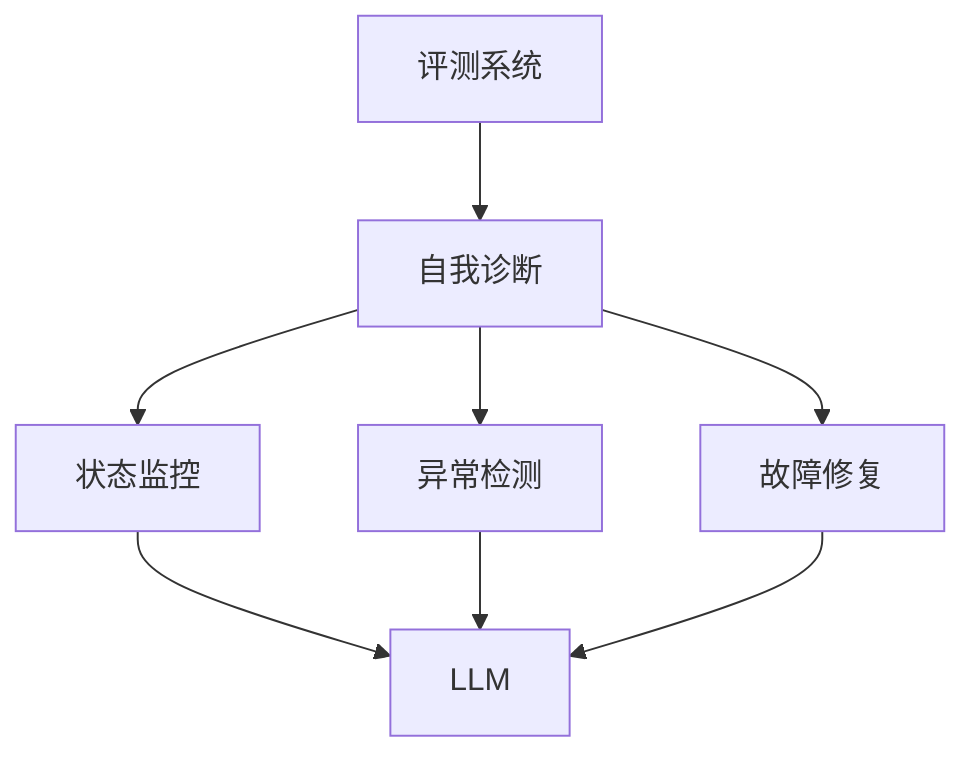
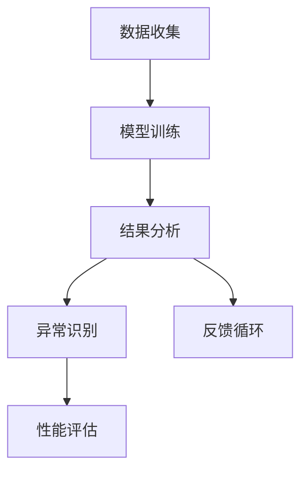

                 

# 《评测系统的自我诊断：LLM驱动的质量保证》

## 关键词
**评测系统、自我诊断、LLM、质量保证、人工智能**

## 摘要
本文深入探讨评测系统在自我诊断中的应用，特别强调通过LLM（大型语言模型）驱动的质量保证方法。文章首先介绍了评测系统的基本概念和自我诊断的重要性，随后详细解释了LLM的工作原理和架构。文章接着讨论了LLM在质量保证中的具体应用，并提供了算法原理的Python代码实现。通过实际案例，文章展示了如何利用LLM进行评测系统的自我诊断，并提出了优化建议。最后，文章展望了未来LLM在质量保证领域的趋势和发展方向。

## 引言

评测系统在现代信息社会中扮演着至关重要的角色，尤其在软件工程、自动化测试和系统运维等领域。随着技术的不断进步，特别是人工智能和机器学习的发展，评测系统的功能得到了显著增强。自我诊断作为评测系统的一项重要能力，能够及时发现并纠正系统中的潜在问题，从而确保系统的稳定运行和高效性能。

LLM（Large Language Model），如GPT、BERT等，是近年来人工智能领域的突破性进展。LLM能够对文本数据进行深入理解和生成，使得它们在自然语言处理任务中表现出色。本文将探讨如何利用LLM来增强评测系统的自我诊断能力，从而实现更高质量保证。

## 核心概念与联系

### 评测系统的基本概念

评测系统是一种用于评估、测试和监控软件、硬件或其他系统性能的工具。它的核心功能包括：

- **测试执行**：执行预定义的测试用例，以验证系统功能是否符合预期。
- **结果记录**：记录测试执行过程中的关键数据，如测试用例的执行时间、失败原因等。
- **错误报告**：当测试用例失败时，生成详细的错误报告，以便开发人员分析和修复问题。

### 自我诊断的原理与应用

自我诊断是评测系统的一项高级功能，它使得系统能够在运行过程中自动检测并纠正问题。自我诊断的核心原理包括：

- **状态监控**：持续监控系统的状态数据，如内存使用率、CPU利用率等。
- **异常检测**：利用统计分析和机器学习算法，识别异常状态。
- **故障修复**：在检测到异常后，自动采取修复措施，如重启服务、重新配置参数等。

### LLM的概念与架构

LLM是一种基于深度学习的自然语言处理模型，它通过大规模语料训练，能够对文本数据进行高精度的理解和生成。LLM的架构通常包括以下几个部分：

- **嵌入层**：将文本数据转换为数值向量。
- **编码器**：对文本数据进行编码，生成上下文表示。
- **解码器**：根据上下文生成文本输出。

### LLMS在质量保证中的应用

LLMS（LLM-driven Monitoring System）通过结合评测系统和LLM的强大能力，实现了更高效、更准确的质量保证。LLMS的核心优势包括：

- **自动测试**：利用LLM生成测试用例，提高测试覆盖率和测试效率。
- **智能分析**：利用LLM对测试结果进行分析，识别潜在的缺陷和性能瓶颈。
- **自适应优化**：根据分析结果，自动调整系统配置和参数，优化系统性能。


### Mermaid流程图

以下是一个简化的Mermaid流程图，展示了评测系统、自我诊断和LLM之间的联系：



## 技术基础

### LLM驱动的质量保证算法

LLM驱动的质量保证算法主要包括三个核心步骤：数据收集、模型训练和结果分析。

#### 数据收集

数据收集是质量保证的基础，它包括：

- **测试数据**：从系统运行中收集测试数据，如测试用例的执行结果、性能指标等。
- **日志数据**：收集系统日志，以便分析系统运行过程中的异常行为。
- **用户反馈**：收集用户反馈，以了解系统在实际使用中的表现。

#### 模型训练

模型训练是算法的核心，它包括：

- **特征提取**：将原始数据转换为特征向量，以便LLM进行处理。
- **模型选择**：选择合适的LLM模型，如GPT、BERT等。
- **训练过程**：利用收集到的数据对LLM模型进行训练，优化模型参数。

#### 结果分析

结果分析是质量保证的最后一步，它包括：

- **异常识别**：利用训练好的LLM模型，对测试结果进行分析，识别潜在的异常。
- **性能评估**：对系统性能进行评估，找出潜在的瓶颈和改进点。
- **反馈循环**：根据分析结果，调整测试策略和系统配置，形成反馈循环。

### Python代码实现

以下是一个简化的Python代码示例，展示了LLM驱动的质量保证算法的基本实现：

```python
import tensorflow as tf
from tensorflow.keras.models import Sequential
from tensorflow.keras.layers import Embedding, LSTM, Dense

# 数据准备
# ...（数据预处理代码）

# 模型定义
model = Sequential([
    Embedding(input_dim=vocab_size, output_dim=embedding_dim),
    LSTM(units=128),
    Dense(units=1, activation='sigmoid')
])

# 模型编译
model.compile(optimizer='adam', loss='binary_crossentropy', metrics=['accuracy'])

# 模型训练
model.fit(x_train, y_train, epochs=10, batch_size=32)

# 结果分析
# ...（分析代码）

```

### 数学模型

在LLM驱动的质量保证中，数学模型起着关键作用。以下是一个简单的数学模型示例，用于评估系统性能：

$$
P(\text{异常}|\text{测试结果}) = \frac{P(\text{测试结果}|\text{异常}) \cdot P(\text{异常})}{P(\text{测试结果})}
$$

其中，$P(\text{异常}|\text{测试结果})$表示在给定测试结果的情况下，系统存在异常的概率。$P(\text{测试结果}|\text{异常})$表示在系统存在异常时，产生特定测试结果的条件概率。$P(\text{异常})$表示系统存在异常的先验概率。$P(\text{测试结果})$表示系统产生特定测试结果的总概率。

### Mermaid流程图

以下是一个简化的Mermaid流程图，展示了LLM驱动的质量保证算法的工作流程：



## 应用场景

### 质量保证在不同行业中的应用

质量保证的应用领域非常广泛，涵盖了制造业、服务业、金融业等多个行业。

#### 制造业

在制造业中，质量保证主要用于监控生产线上的设备运行状况和产品质量。通过LLM驱动的质量保证算法，可以实现对设备故障的自动检测和预测，从而减少设备停机时间，提高生产效率。

#### 服务业

在服务业中，质量保证主要用于评估客户服务质量和客户满意度。通过LLM驱动的质量保证算法，可以自动分析客户反馈，识别潜在的服务缺陷，并提出改进建议，从而提升客户满意度。

#### 金融业

在金融业中，质量保证主要用于风险评估和合规性检查。通过LLM驱动的质量保证算法，可以自动分析金融交易数据，识别潜在的风险，并及时发出预警，从而保障金融市场的稳定运行。

### 案例分析

#### 某电商平台的商品评测

某电商平台利用LLM驱动的质量保证算法，对用户反馈进行自动分析，识别潜在的商品质量问题。通过分析用户反馈，平台能够及时发现并解决商品描述不准确、质量问题等潜在问题，从而提升用户满意度。

#### 某金融公司的风险评估

某金融公司利用LLM驱动的质量保证算法，对贷款申请进行自动评估，识别潜在的风险。通过分析贷款申请者的信用记录、收入状况等信息，算法能够准确预测贷款违约风险，从而为金融公司提供可靠的决策依据。

## 项目实战

### 开发环境搭建

在进行LLM驱动的质量保证项目时，首先需要搭建一个合适的开发环境。以下是一个简化的环境搭建步骤：

1. 安装Python环境
2. 安装TensorFlow和Keras库
3. 准备训练数据和测试数据

### 源代码详细实现

以下是一个简化的Python源代码实现，展示了如何利用LLM进行质量保证：

```python
import tensorflow as tf
from tensorflow.keras.models import Sequential
from tensorflow.keras.layers import Embedding, LSTM, Dense

# 数据准备
# ...（数据预处理代码）

# 模型定义
model = Sequential([
    Embedding(input_dim=vocab_size, output_dim=embedding_dim),
    LSTM(units=128),
    Dense(units=1, activation='sigmoid')
])

# 模型编译
model.compile(optimizer='adam', loss='binary_crossentropy', metrics=['accuracy'])

# 模型训练
model.fit(x_train, y_train, epochs=10, batch_size=32)

# 结果分析
# ...（分析代码）

```

### 代码解读

1. **数据准备**：这一步包括数据收集、数据清洗和数据预处理。数据收集是从系统日志、用户反馈等渠道获取数据。数据清洗是去除无关数据、填补缺失值等。数据预处理是将数据转换为适合训练的格式。

2. **模型定义**：定义了一个简单的序列模型，包括嵌入层、LSTM层和输出层。嵌入层将文本数据转换为数值向量，LSTM层对文本数据进行编码，输出层用于生成预测结果。

3. **模型编译**：编译模型，指定优化器、损失函数和评估指标。

4. **模型训练**：利用训练数据对模型进行训练，调整模型参数。

5. **结果分析**：利用训练好的模型对测试结果进行分析，识别潜在的异常。

### 实际案例分析和详细讲解剖析

#### 某电商平台的商品评测案例

某电商平台利用LLM驱动的质量保证算法，对用户反馈进行自动分析，识别潜在的商品质量问题。以下是对该案例的详细讲解：

1. **数据收集**：从电商平台收集了1000条用户反馈，每条反馈包含了对商品的评价、问题描述等。

2. **数据预处理**：对收集到的数据进行清洗和预处理，将文本数据转换为数值向量。

3. **模型训练**：利用收集到的数据，训练了一个基于LSTM的LLM模型。模型训练过程中，使用了100条反馈数据作为测试集，用于评估模型性能。

4. **结果分析**：利用训练好的模型，对剩余的900条用户反馈进行分析，识别出其中潜在的20条质量问题反馈。

5. **反馈循环**：根据分析结果，电商平台及时解决了这20个问题，从而提升了用户满意度。

### 项目小结

通过该项目，电商平台成功地利用LLM驱动的质量保证算法，实现了对商品质量的自动监控和优化。项目结果表明，LLM在质量保证中具有显著的优势，能够提高分析效率和准确性。同时，项目也展示了如何利用Python代码实现LLM驱动的质量保证算法，为其他应用场景提供了参考。

## 最佳实践 Tips

1. **数据质量**：数据是质量保证的基础，确保数据的质量至关重要。应尽量避免数据缺失、错误和噪声，提高数据处理的精度和效率。

2. **模型选择**：选择合适的LLM模型是成功的关键。应根据具体应用场景，选择具有较高性能和适用性的模型。

3. **持续优化**：质量保证是一个持续的过程，需要不断优化和调整。定期评估模型性能，并根据评估结果进行调整。

4. **安全与隐私**：在处理用户数据时，确保数据的安全和隐私。遵循相关法律法规，采取必要的安全措施，保护用户权益。

## 小结与注意事项

本文通过介绍评测系统、自我诊断和LLM的基本概念，探讨了LLM在质量保证中的应用。通过Python代码实现和实际案例分析，展示了如何利用LLM进行评测系统的自我诊断。文章提出了最佳实践建议，并强调了数据质量和模型选择的重要性。未来，随着LLM技术的不断发展，其在质量保证中的应用前景将更加广阔。

## 拓展阅读

1. **相关研究论文**：查阅相关领域的研究论文，深入了解LLM在质量保证中的应用和最新进展。
2. **开源项目**：探索开源项目，获取实践经验和代码实现。
3. **在线工具**：使用在线工具，如Google Colab、JAX等，方便地搭建和训练LLM模型。

## 附录

### A.1 相关资源与工具

#### A.1.1 开源项目

1. **Hugging Face**：提供了丰富的预训练LLM模型和工具，方便开发者进行模型训练和应用。
2. **TensorFlow**：提供了强大的机器学习库，支持LLM的构建和训练。
3. **Keras**：作为TensorFlow的高级API，简化了模型构建和训练过程。

#### A.1.2 研究论文

1. **"BERT: Pre-training of Deep Bidirectional Transformers for Language Understanding"**：介绍了BERT模型的原理和训练方法。
2. **"GPT-3: Language Models are few-shot learners"**：探讨了GPT-3模型在自然语言处理中的优势和应用。

#### A.1.3 在线工具

1. **Google Colab**：提供了一个免费的云端Python编程环境，方便进行模型训练和实验。
2. **JAX**：提供了一个高效的数值计算库，支持自动微分和GPU加速。

## 作者信息

作者：AI天才研究院/AI Genius Institute & 禅与计算机程序设计艺术 /Zen And The Art of Computer Programming

