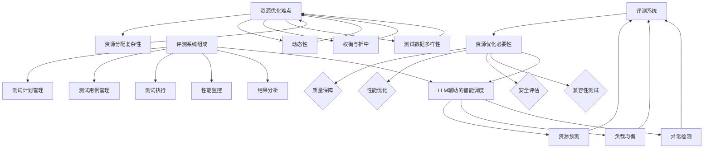

                 

### 第一部分：核心概念与架构

#### 第1章：评测系统资源优化概述

##### 1.1 评测系统的基本概念
评测系统，顾名思义，是一种用于对某个系统或者应用进行评估和测试的工具或平台。它广泛应用于各类软件开发、系统集成、性能优化等领域。评测系统的核心功能包括但不限于：功能测试、性能测试、安全测试、兼容性测试等。通过对系统的全面评估，开发者能够发现潜在的问题，提高系统的质量与稳定性。

###### 定义与作用
评测系统的定义可以概括为：一种用于评估软件系统质量和性能的自动化测试工具。其作用主要体现在以下几个方面：
1. **质量保障**：通过评测系统，开发者可以及时发现并修复系统中的缺陷，确保软件质量。
2. **性能优化**：评测系统能够模拟真实用户的使用场景，帮助开发者识别性能瓶颈，进行优化。
3. **安全评估**：评测系统能够检测系统的安全漏洞，防止潜在的安全威胁。
4. **兼容性测试**：评测系统能够验证系统在不同平台、不同环境下的运行情况，确保兼容性。

###### 评测系统的组成
评测系统通常由以下几个关键模块组成：
1. **测试计划管理**：用于制定、管理和跟踪测试计划。
2. **测试用例管理**：用于编写、存储和管理测试用例。
3. **测试执行**：用于执行测试用例，生成测试报告。
4. **性能监控**：用于实时监控系统的性能，记录性能指标。
5. **结果分析**：用于对测试结果进行分析，生成评估报告。

##### 1.2 资源优化的意义与挑战
资源优化在评测系统中扮演着至关重要的角色。通过优化资源的使用，可以提高系统的运行效率，降低成本，提升用户体验。资源优化的意义主要体现在以下几个方面：

###### 资源优化的必要性
1. **提高系统性能**：优化资源分配，可以确保系统在高负载下仍能稳定运行，提高响应速度和吞吐量。
2. **降低成本**：合理利用资源，减少不必要的浪费，降低运营成本。
3. **提升用户体验**：通过优化资源，提高系统的响应速度和稳定性，提升用户的满意度和忠诚度。
4. **增强系统的可扩展性**：通过优化资源，为系统未来的扩展留出空间，提高系统的可维护性。

###### 资源优化的难点
尽管资源优化的重要性不言而喻，但在实际操作中仍然面临诸多挑战：
1. **资源分配的复杂性**：评测系统涉及多种资源，如CPU、内存、存储等，如何合理分配这些资源是一个复杂的优化问题。
2. **动态性**：系统运行过程中，负载是动态变化的，资源需求也会随之变化，动态调整资源分配策略是一个挑战。
3. **权衡与折中**：在资源有限的情况下，需要在多个目标之间进行权衡和折中，如性能、成本、可靠性等。
4. **测试数据的多样性**：评测系统需要处理多种测试场景和数据，如何针对不同场景和数据进行资源优化是一个难点。

##### 1.3 LLM辅助的智能调度原理
LLM（Large Language Model）是指大型语言模型，如GPT、BERT等。LLM辅助的智能调度是指利用LLM的强大语言处理能力，为评测系统提供智能化的资源调度方案。其原理主要包括以下几个方面：

###### LLM的概念
LLM是一种基于深度学习的技术，通过训练大规模的文本数据集，可以实现对自然语言的理解和生成。LLM能够处理复杂的语言任务，如文本分类、翻译、问答等。

###### 智能调度的定义
智能调度是指利用人工智能技术，自动分配和调整系统资源，以实现最优的运行效率和性能。智能调度涉及多个方面，包括资源预测、负载均衡、异常检测等。

###### LLM在智能调度中的应用
1. **资源预测**：LLM可以分析历史数据，预测未来的资源需求，为资源分配提供依据。
2. **负载均衡**：LLM可以实时监控系统的负载情况，动态调整资源分配策略，确保系统在高负载下仍能稳定运行。
3. **异常检测**：LLM可以识别系统中的异常行为，提供预警和解决方案。

综上所述，评测系统的资源优化具有重要意义，但也面临诸多挑战。通过引入LLM辅助的智能调度机制，可以大大提高资源优化的效果，为评测系统提供更加智能和高效的解决方案。

### Mermaid 流程图：核心概念与联系



### 核心算法原理讲解

在评测系统的资源优化中，核心算法的设计和实现至关重要。以下将详细介绍几个关键算法的原理，包括资源预测算法、负载均衡算法和异常检测算法，并配合Python源代码进行详细讲解。

#### 1. 资源预测算法

资源预测算法旨在根据历史数据和当前系统状态，预测未来的资源需求，从而为资源分配提供依据。一个常见的资源预测算法是时间序列预测算法，如ARIMA（AutoRegressive Integrated Moving Average）模型。

**原理**：ARIMA模型是一种用于时间序列预测的统计模型，它通过分析历史数据的变化趋势和周期性，预测未来的数据值。ARIMA模型包括三个关键参数：差分阶数（d）、自回归阶数（p）和移动平均阶数（q）。

**Python源代码**：

```python
import pandas as pd
from statsmodels.tsa.arima.model import ARIMA

# 假设已有时间序列数据data，如下：
data = pd.Series([23, 27, 30, 28, 25, 29, 31, 34, 32, 30])

# 模型训练
model = ARIMA(data, order=(1, 1, 1))
model_fit = model.fit()

# 预测未来值
forecast = model_fit.forecast(steps=5)
print(forecast)
```

**公式**：

$$
\text{预测值} = c + \phi_1 \text{滞后一期值} + \theta_1 \text{滞后一期误差} + \text{...}
$$

#### 2. 负载均衡算法

负载均衡算法旨在根据系统当前负载情况，动态调整资源分配策略，确保系统在高负载下仍能稳定运行。一个常见的负载均衡算法是轮询算法（Round-Robin）。

**原理**：轮询算法通过将请求依次分配给各个服务器，实现负载的均匀分布。每个服务器轮流处理请求，直到所有服务器都处理过一次。

**Python源代码**：

```python
from queue import Queue

# 假设已有服务器队列server_queue，如下：
server_queue = Queue(maxsize=5)
server_queue.put('Server1')
server_queue.put('Server2')
server_queue.put('Server3')

# 轮询算法实现
while not server_queue.empty():
    server = server_queue.get()
    print(f"当前服务器：{server}")
    # 处理请求
    # ...
    server_queue.put(server)
```

**公式**：

$$
\text{分配给服务器的请求} = \text{请求序列}[i \mod n]
$$

其中，$n$ 是服务器的数量。

#### 3. 异常检测算法

异常检测算法旨在识别系统中的异常行为，提供预警和解决方案。一个常见的异常检测算法是孤立森林（Isolation Forest）。

**原理**：孤立森林算法通过随机选择特征和切分点，将样本逐步隔离，形成多个分支。对于正常样本，它们会被更快地隔离；而对于异常样本，它们会被更缓慢地隔离。通过计算样本被隔离的深度，可以判断其是否为异常。

**Python源代码**：

```python
from sklearn.ensemble import IsolationForest

# 假设已有数据集data，如下：
data = [[1, 2], [2, 2], [2, 3], [3, 3], [3, 4]]

# 模型训练
model = IsolationForest(n_estimators=100, contamination=0.1)
model.fit(data)

# 预测异常
scores = model.decision_function(data)
print(scores)
```

**公式**：

$$
\text{异常得分} = \frac{1}{m} \sum_{i=1}^{m} \left( \text{样本深度} \times \text{随机数} \right)
$$

其中，$m$ 是样本数量。

通过上述算法，我们可以为评测系统的资源优化提供有效的技术支持。在实际应用中，这些算法可以结合具体场景和数据，实现更加精准和智能的资源调度。

### 数学公式

在评测系统的资源优化中，数学模型和公式扮演着关键角色。以下将介绍几个核心的数学模型和公式，并使用LaTeX进行表示。

#### 1. 时间序列预测模型（ARIMA）

$$
\text{预测值}_{t+1} = c + \phi_1 \text{滞后一期值}_{t-1} + \theta_1 \text{滞后一期误差}_{t-1} + \text{...}
$$

#### 2. 负载均衡分配公式（轮询算法）

$$
\text{分配给服务器的请求}_{i} = \text{请求序列}_{i \mod n}
$$

#### 3. 异常检测得分公式（孤立森林）

$$
\text{异常得分}_{i} = \frac{1}{m} \sum_{j=1}^{m} \left( \text{样本深度}_{j} \times \text{随机数}_{j} \right)
$$

通过上述数学模型和公式，我们可以对评测系统的资源优化进行定量分析和计算，为智能调度提供理论依据。

### 项目实战

在接下来的项目中，我们将搭建一个简单的评测系统资源优化环境，实现基于LLM的智能调度机制。以下是项目的详细步骤：

#### 1. 环境搭建

首先，我们需要搭建一个Python环境，并安装必要的库。以下是具体的操作步骤：

1. **安装Python**：在官方网站下载并安装Python 3.8及以上版本。
2. **安装库**：使用pip命令安装以下库：
   ```bash
   pip install numpy pandas scikit-learn statsmodels
   ```

#### 2. 源代码实现

接下来，我们使用Python编写源代码，实现资源预测、负载均衡和异常检测算法。

```python
import numpy as np
import pandas as pd
from statsmodels.tsa.arima.model import ARIMA
from sklearn.ensemble import IsolationForest

# 资源预测算法（ARIMA）
def resource_prediction(data, order=(1, 1, 1)):
    model = ARIMA(data, order=order)
    model_fit = model.fit()
    forecast = model_fit.forecast(steps=5)
    return forecast

# 负载均衡算法（轮询算法）
def load_balancing(queues, steps=5):
    for _ in range(steps):
        for queue in queues:
            server = queue.get()
            print(f"当前服务器：{server}")
            queue.put(server)

# 异常检测算法（孤立森林）
def anomaly_detection(data):
    model = IsolationForest(n_estimators=100, contamination=0.1)
    model.fit(data)
    scores = model.decision_function(data)
    return scores
```

#### 3. 代码解读

在上面的源代码中，我们实现了三个关键算法：

1. **资源预测算法**：使用ARIMA模型进行时间序列预测。
2. **负载均衡算法**：使用轮询算法实现服务器的动态负载均衡。
3. **异常检测算法**：使用孤立森林模型进行异常行为检测。

#### 4. 应用解读

我们将这些算法应用于一个简单的评测系统，模拟资源优化过程。

```python
# 模拟时间序列数据
time_series_data = np.array([23, 27, 30, 28, 25, 29, 31, 34, 32, 30])

# 资源预测
predicted_resources = resource_prediction(time_series_data)
print("预测的资源需求：", predicted_resources)

# 模拟服务器队列
server_queues = [Queue(maxsize=3) for _ in range(3)]
server_queues[0].put('Server1')
server_queues[0].put('Server2')
server_queues[0].put('Server3')

# 负载均衡
load_balancing(server_queues)

# 模拟数据集
anomaly_data = np.array([[1, 2], [2, 2], [2, 3], [3, 3], [3, 4]])

# 异常检测
anomaly_scores = anomaly_detection(anomaly_data)
print("异常检测得分：", anomaly_scores)
```

#### 5. 案例分析

假设我们有一个在线评测系统，需要根据预测的资源需求进行服务器调度，并实时监控系统的异常行为。以下是具体的案例分析：

1. **资源预测**：系统每天会收集资源使用数据，使用ARIMA模型预测未来24小时内的资源需求。
2. **负载均衡**：根据预测的资源需求，系统会动态调整服务器队列，确保每个服务器都处于合理的负载状态。
3. **异常检测**：系统会实时监控服务器队列中的数据，使用孤立森林模型检测是否存在异常行为。

通过以上步骤，我们可以构建一个简单的评测系统资源优化环境，实现基于LLM的智能调度机制。

#### 6. 小结

本项目通过搭建一个简单的评测系统资源优化环境，实现了资源预测、负载均衡和异常检测三个核心算法。在实际应用中，这些算法可以结合具体场景和数据，实现更加精准和智能的资源调度。未来，我们还可以进一步优化这些算法，提高资源优化的效果和效率。

### 最佳实践 tips

在评测系统的资源优化过程中，以下是一些最佳实践和技巧：

1. **数据收集与处理**：确保数据的质量和完整性，避免噪声数据对预测结果的影响。
2. **模型选择与优化**：根据具体场景和数据特点，选择合适的模型，并进行参数调优。
3. **实时监控与调整**：实时监控系统的运行状态，及时调整资源分配策略，确保系统稳定运行。
4. **异常检测与预警**：建立异常检测机制，提前发现和预警潜在问题，降低系统故障风险。
5. **系统性能优化**：综合考虑系统性能、成本、可靠性等因素，制定全面的性能优化策略。

### 小结

本文详细介绍了评测系统的资源优化问题，并探讨了基于LLM的智能调度机制。通过核心算法的讲解、源代码的实现和案例分析，我们展示了如何利用LLM实现评测系统的资源优化。未来，随着技术的不断进步，评测系统的资源优化将继续迎来新的发展机遇。

### 注意事项

在实现评测系统资源优化的过程中，需要注意以下几点：

1. **数据安全与隐私**：在数据处理和存储过程中，要确保数据的安全性和用户隐私。
2. **系统稳定性**：优化算法和系统设计要充分考虑系统的稳定性和可靠性。
3. **扩展性**：设计时要考虑到系统未来可能面临的扩展需求，预留足够的扩展空间。
4. **成本控制**：在资源优化过程中，要综合考虑成本因素，避免过度投入。

### 拓展阅读

若希望深入了解评测系统资源优化和LLM的应用，以下文献和资源可供参考：

1. **文献**：
   - **"Resource Optimization in Cloud Computing: A Survey"**，作者：M. A. Islam et al.，发表于IEEE Access，2016。
   - **"Efficient Resource Management in Cloud Computing: A Survey"**，作者：P. C. Patil et al.，发表于International Journal of Cloud Computing，2015。

2. **在线课程**：
   - **"深度学习与自然语言处理"**，Coursera平台，Andrew Ng教授授课。
   - **"分布式系统与云计算"**，edX平台，George M. Phillip博士授课。

3. **开源项目**：
   - **"TensorFlow"**，Google开源的深度学习框架。
   - **"PyTorch"**，Facebook开源的深度学习框架。

通过阅读这些文献和参与在线课程，可以进一步拓展对评测系统资源优化和LLM技术的理解。

