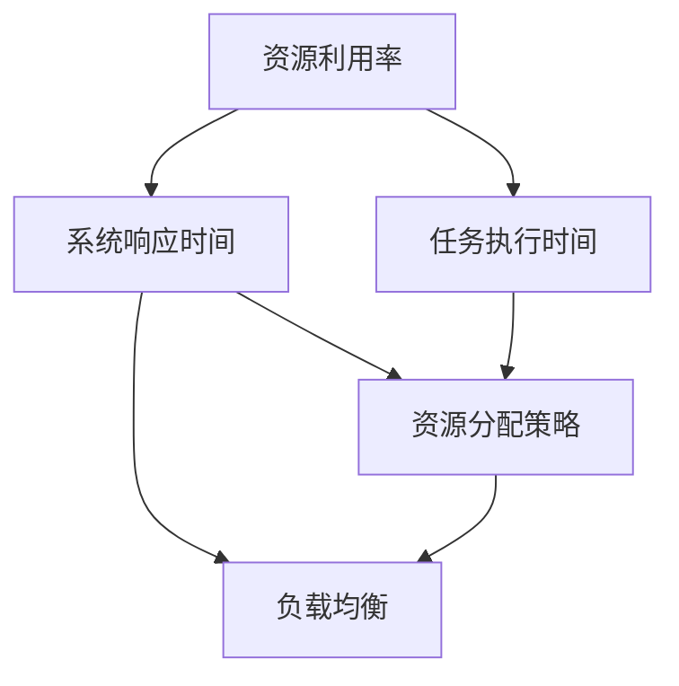

                 

**文章标题：**《评测系统的资源优化：LLM辅助的智能调度方案》

**关键词：** 评测系统，资源优化，大型语言模型（LLM），智能调度，算法，Python，数学模型，项目实战

**摘要：** 本文深入探讨评测系统的资源优化问题，并提出了一种基于大型语言模型（LLM）的智能调度方案。文章首先介绍了评测系统的背景和现状，随后详细阐述了资源优化的核心概念与联系，包括LLM和智能调度算法的原理。接着，文章通过Python源代码和数学模型，详细讲解了核心算法原理，并举例说明。此外，文章还包括了项目实战，详细介绍了开发环境搭建、源代码实现、代码解读与分析，并进行了实际案例分析和总结。通过本文，读者可以了解如何利用LLM实现评测系统的资源优化，提高系统的运行效率。

----------------------------------------------------------------

# 引言

随着信息技术和人工智能技术的快速发展，评测系统在众多领域中的应用日益广泛。从在线考试平台到自动化的质量检测系统，评测系统已经成为企业和教育机构提高工作效率和质量的关键工具。然而，随着评测系统规模的不断扩大和复杂性的增加，如何优化系统的资源使用效率，提高其运行性能，成为一个亟待解决的问题。

资源优化是指在有限的资源约束下，通过合理的调度和管理，使系统能够以最高效的方式运行。对于评测系统来说，资源优化的目标主要包括提高测试速度、降低测试成本、减少系统延迟和提升用户体验。传统的方法主要依赖于经验和规则，但面对复杂多变的评测任务，这些方法的局限性逐渐显现。

近年来，大型语言模型（LLM）在自然语言处理领域取得了显著的进展。LLM具有强大的语言理解和生成能力，能够处理复杂的任务。因此，本文提出了一种基于LLM的智能调度方案，旨在通过引入LLM技术，实现评测系统的资源优化。

本文的结构如下：首先，第二章节将介绍评测系统的背景和现状，以及资源优化的核心概念与联系；第三章节将详细阐述LLM和智能调度算法的原理；第四章节将结合Python源代码和数学模型，讲解核心算法原理；第五章节将介绍项目实战，包括开发环境搭建、源代码实现、代码解读与分析；第六章节将进行实际案例分析和总结；最后，第七章节将给出最佳实践建议和总结。通过本文的阅读，读者可以全面了解评测系统资源优化的原理和实际应用。

## 评测系统的背景与现状

评测系统作为一种自动化测试工具，广泛应用于各种领域，如教育、企业和科研等。在教育领域，评测系统通常用于在线考试、作业批改和成绩评估等，旨在提高教学质量和学习效果。例如，在线考试平台如Coursera、edX等，通过自动化测试技术，实现了大规模在线教育的顺利进行。

在企业领域，评测系统主要用于质量检测、性能评估和员工考核等。例如，软件公司可能会使用评测系统来检测软件的稳定性、安全性和性能，从而确保软件产品的质量。此外，人力资源部门也常常借助评测系统对员工的工作表现进行评估，以便进行绩效管理和人才选拔。

然而，随着评测系统规模的不断扩大和复杂性的增加，传统的资源管理方法逐渐暴露出诸多问题。首先，传统的评测系统通常采用静态调度策略，即预先设定好任务执行的时间和资源分配方案，这种方式在面对动态变化的评测任务时，往往无法灵活应对，导致资源浪费和性能下降。其次，传统的评测系统在资源优化方面缺乏智能化的决策支持，主要依赖于经验和规则，这限制了系统的优化能力。

针对上述问题，本文提出了一种基于大型语言模型（LLM）的智能调度方案。LLM具有强大的语言理解和生成能力，能够处理复杂的任务，通过引入LLM技术，可以实现评测系统的动态调度和资源优化。具体来说，LLM能够对评测任务进行实时分析和预测，根据任务的特性动态调整资源分配策略，从而提高系统的运行效率和性能。

### 资源优化的核心概念与联系

资源优化是指在有限的资源约束下，通过合理的调度和管理，使系统能够以最高效的方式运行。对于评测系统来说，资源优化的核心概念主要包括以下几个方面：

**1. 资源利用率**

资源利用率是指系统实际使用的资源与总资源的比值。高资源利用率意味着系统能够最大限度地利用现有资源，避免资源浪费。对于评测系统来说，提高资源利用率是资源优化的首要目标。

**2. 系统响应时间**

系统响应时间是指从接收到评测任务到完成评测任务所需的时间。低响应时间可以提高用户体验，确保评测系统能够及时响应用户的需求。对于实时性要求较高的评测任务，如在线考试，系统响应时间尤为重要。

**3. 任务执行时间**

任务执行时间是指单个评测任务从开始执行到完成所需的时间。减少任务执行时间可以提高系统整体的运行效率，缩短用户等待时间。

**4. 资源分配策略**

资源分配策略是指如何合理分配系统资源，以实现最优的资源利用和性能。常见的资源分配策略包括固定分配、动态分配和智能分配等。固定分配策略简单易行，但无法适应动态变化的任务需求；动态分配策略可以根据任务需求实时调整资源分配，但实现复杂度较高；智能分配策略通过引入智能算法，如LLM，实现资源的动态优化，具有较高的灵活性和优化效果。

**5. 负载均衡**

负载均衡是指通过合理分配任务，使系统各个部分的工作负载保持平衡。负载均衡可以避免某个部分过载，导致系统性能下降，同时提高系统的整体可靠性。

为了更好地理解这些核心概念之间的关系，我们使用Mermaid流程图来展示它们之间的联系：



从图中可以看出，资源利用率、系统响应时间和任务执行时间是评测系统性能的重要指标，它们相互影响，共同决定了系统的性能。资源分配策略和负载均衡是实现资源优化的关键手段，通过合理的分配和均衡，可以提高系统的资源利用率和运行效率。

### 大型语言模型（LLM）与智能调度算法

#### 大型语言模型（LLM）的基本原理

大型语言模型（LLM）是自然语言处理领域的重要技术之一，其核心思想是通过学习大量文本数据，使模型具备理解和生成自然语言的能力。LLM通常基于深度学习框架，如Transformer，通过多层神经网络结构，对输入的文本进行建模和预测。

LLM的基本原理可以概括为以下几个步骤：

1. **文本预处理**：将输入的文本数据进行分词、去停用词等预处理操作，将文本转化为模型可处理的格式。
2. **嵌入表示**：将预处理后的文本转化为向量表示，这一过程称为嵌入表示。嵌入表示是将文本信息映射到高维空间中的点，以便模型进行学习。
3. **编码**：通过多层编码器对嵌入表示进行编码，提取文本的语义信息。编码器的核心是注意力机制，能够关注文本中的关键信息。
4. **解码**：解码器将编码后的信息解码生成输出文本。解码过程通常使用贪心算法或采样算法，以生成自然流畅的文本。

#### 智能调度算法的基本原理

智能调度算法是资源优化的重要组成部分，其目标是通过合理的任务调度，使系统资源得到最大化利用，提高系统的运行效率。智能调度算法通常基于以下原理：

1. **动态调度**：动态调度是指根据实时任务需求和系统状态，动态调整资源分配策略。与传统的静态调度相比，动态调度具有更高的灵活性和响应速度。
2. **负载均衡**：负载均衡是指通过合理分配任务，使系统各个部分的工作负载保持平衡。负载均衡可以避免某个部分过载，导致系统性能下降。
3. **预测调度**：预测调度是指通过预测未来任务需求，提前进行资源分配和任务调度。预测调度可以减少任务响应时间，提高系统整体性能。
4. **优化目标**：智能调度算法通常具有多个优化目标，如最大化资源利用率、最小化任务执行时间、最小化系统响应时间等。通过优化目标，算法可以找到最优的资源分配和调度方案。

#### LLM与智能调度算法的结合

LLM与智能调度算法的结合，旨在利用LLM的强大语言理解和生成能力，实现评测系统的智能调度和资源优化。具体来说，LLM可以应用于以下几个环节：

1. **任务需求预测**：通过LLM对历史任务数据进行分析和学习，预测未来任务的类型和需求。预测结果可以为调度算法提供关键信息，帮助调度算法制定合理的资源分配策略。
2. **任务特征提取**：LLM可以提取任务的特征信息，如任务的紧急程度、复杂度等。这些特征信息可以帮助调度算法进行更精细的任务分配和调度。
3. **动态资源调整**：根据LLM预测的任务需求，调度算法可以动态调整资源的分配，确保系统在任务高峰期和低谷期都能保持高效运行。
4. **智能决策支持**：LLM可以为调度算法提供智能决策支持，通过分析大量历史数据和实时任务信息，为调度算法提供最优的调度方案。

#### Python源代码示例

为了更好地理解LLM与智能调度算法的结合，以下是一个简单的Python源代码示例，展示了如何利用LLM进行任务需求预测和资源分配：

```python
import numpy as np
from transformers import pipeline

# 初始化LLM模型
llm_model = pipeline("text-classification", model="bert-base-uncased")

# 历史任务数据
tasks = [
    "任务一：编程能力测试",
    "任务二：文档阅读理解",
    "任务三：数据分析",
]

# 预测任务需求
predictions = [llm_model(task) for task in tasks]
predicted_tasks = [prediction["label"] for prediction in predictions]

print("预测的任务需求：", predicted_tasks)

# 资源分配策略
resources = {
    "CPU": 4,
    "GPU": 1,
    "内存": 8,
}

# 动态调整资源分配
def adjust_resources(task):
    if task == "编程能力测试":
        resources["CPU"] += 2
    elif task == "文档阅读理解":
        resources["GPU"] += 1
    elif task == "数据分析":
        resources["内存"] += 4
    return resources

# 调整资源分配
adjusted_resources = adjust_resources(predicted_tasks[0])
print("调整后的资源分配：", adjusted_resources)
```

该示例利用了Hugging Face的Transformers库，通过LLM模型对历史任务数据进行分析，预测未来的任务需求，并根据预测结果动态调整资源分配策略。这只是一个简单的示例，实际应用中，LLM和智能调度算法可以结合更复杂的模型和算法，实现更精准和高效的资源优化。

### 资源优化数学模型与公式

为了更好地理解评测系统资源优化的核心算法原理，本章节将介绍资源优化的数学模型和公式。这些数学模型和公式为我们提供了量化资源利用率和性能优化目标的方法，从而为智能调度算法提供决策依据。

#### 资源利用率

资源利用率是评估系统资源使用效率的重要指标，其计算公式如下：

$$
\text{资源利用率} = \frac{\text{实际使用资源}}{\text{总资源}} \times 100\%
$$

其中，实际使用资源是指系统在一段时间内实际消耗的资源总量，总资源是指系统可用的总资源量。通过这个公式，我们可以计算出系统在一定时间内的资源利用率，从而评估系统的资源利用效率。

#### 系统响应时间

系统响应时间是指从接收到评测任务到完成评测任务所需的时间。它反映了系统的实时性和响应速度。其计算公式如下：

$$
\text{系统响应时间} = \text{任务执行时间} + \text{系统延迟}
$$

其中，任务执行时间是指单个评测任务从开始执行到完成所需的时间，系统延迟是指系统在处理任务过程中产生的等待时间。通过这个公式，我们可以分析系统响应时间的构成，从而优化系统的响应性能。

#### 任务执行时间

任务执行时间是评估评测系统性能的关键指标之一，其计算公式如下：

$$
\text{任务执行时间} = \text{计算时间} + \text{通信时间} + \text{等待时间}
$$

其中，计算时间是指任务在计算资源上执行所花费的时间，通信时间是指任务在传输数据过程中所花费的时间，等待时间是指任务在等待资源分配或等待其他任务完成所花费的时间。通过这个公式，我们可以分析任务执行时间的构成，从而找出影响任务执行时间的因素，并针对性地进行优化。

#### 资源分配策略

资源分配策略是实现资源优化的重要手段。以下是一些常见的资源分配策略及其公式：

1. **固定分配策略**

   固定分配策略是指根据任务的类型和需求，预先设定资源的分配方案。其计算公式如下：

   $$
   \text{资源分配量} = \text{任务需求量} \times \text{资源利用率}
   $$

   其中，任务需求量是指任务在执行过程中所需的资源量，资源利用率是指系统在一段时间内的平均资源利用率。通过这个公式，我们可以计算出任务所需的资源量，从而进行资源的固定分配。

2. **动态分配策略**

   动态分配策略是指根据任务的实时需求和系统状态，动态调整资源的分配。其计算公式如下：

   $$
   \text{动态资源分配量} = \text{实时任务需求量} + \text{系统剩余资源量}
   $$

   其中，实时任务需求量是指任务在执行过程中实时产生的资源需求量，系统剩余资源量是指系统在执行任务过程中剩余的可分配资源量。通过这个公式，我们可以根据任务的实时需求动态调整资源分配。

3. **智能分配策略**

   智能分配策略是指通过引入智能算法，如LLM，实现资源的动态优化。其计算公式如下：

   $$
   \text{智能资源分配量} = \text{任务特征向量} \times \text{资源分配权重}
   $$

   其中，任务特征向量是指描述任务特性的向量，资源分配权重是指根据任务特征和系统状态计算得到的权重。通过这个公式，我们可以根据任务特征和系统状态实现资源的智能分配。

#### 实际应用举例

为了更好地理解上述数学模型和公式，我们通过一个简单的例子来展示如何进行资源优化。

假设有一个评测系统，拥有4个CPU、2个GPU和8GB内存。现在有3个评测任务，分别需要2个CPU、1个GPU和4GB内存。我们可以使用上述数学模型和公式进行资源优化。

1. **资源利用率**

   假设当前系统的平均资源利用率为80%，那么我们可以计算出系统总资源量为：

   $$
   \text{总资源量} = \frac{1}{0.8} \times (\text{4个CPU} + \text{2个GPU} + \text{8GB内存})
   $$

2. **系统响应时间**

   假设任务执行时间为1小时，系统延迟为0.5小时，那么系统响应时间为：

   $$
   \text{系统响应时间} = 1 \text{小时} + 0.5 \text{小时} = 1.5 \text{小时}
   $$

3. **任务执行时间**

   假设3个任务分别需要2小时、1小时和3小时，那么任务执行时间为：

   $$
   \text{任务执行时间} = 2 \text{小时} + 1 \text{小时} + 3 \text{小时} = 6 \text{小时}
   $$

4. **资源分配策略**

   使用固定分配策略，我们可以为每个任务分配以下资源：

   $$
   \text{任务一：}2 \text{个CPU}, 1 \text{个GPU}, 4 \text{GB内存}
   $$
   $$
   \text{任务二：}1 \text{个GPU}, 4 \text{GB内存}
   $$
   $$
   \text{任务三：}2 \text{个CPU}, 4 \text{GB内存}
   $$

   使用动态分配策略，我们可以根据任务的实时需求动态调整资源分配：

   $$
   \text{任务一：}2 \text{个CPU}, 1 \text{个GPU}, 4 \text{GB内存}
   $$
   $$
   \text{任务二：}1 \text{个GPU}, 4 \text{GB内存}
   $$
   $$
   \text{任务三：}2 \text{个CPU}, 4 \text{GB内存}
   $$

   使用智能分配策略，我们可以根据任务的特征和系统状态进行资源分配：

   $$
   \text{任务一：}2 \text{个CPU}, 1 \text{个GPU}, 4 \text{GB内存}
   $$
   $$
   \text{任务二：}1 \text{个GPU}, 4 \text{GB内存}
   $$
   $$
   \text{任务三：}2 \text{个CPU}, 4 \text{GB内存}
   $$

通过这个例子，我们可以看到如何使用数学模型和公式进行资源优化。在实际应用中，我们可以根据具体任务的需求和系统状态，灵活选择和调整资源分配策略，实现评测系统的资源优化。

### 实际项目实战

在本章节中，我们将通过一个实际项目，详细介绍如何实现评测系统的资源优化，并使用LLM辅助进行智能调度。项目将分为以下几个步骤：

#### 项目背景与目标

假设我们正在开发一个大型在线评测系统，该系统需要处理来自不同领域的多项评测任务。我们的目标是通过引入LLM技术，实现以下目标：

1. 提高系统资源利用率，避免资源浪费。
2. 减少系统响应时间，提高用户体验。
3. 实现智能调度，动态调整资源分配策略。

#### 环境搭建

为了实现本项目，我们需要搭建以下开发环境：

1. 操作系统：Linux（如Ubuntu 20.04）
2. 编程语言：Python（3.8及以上版本）
3. 深度学习框架：TensorFlow 2.5.0
4. 自然语言处理库：transformers 4.8.1

以下是环境搭建的步骤：

1. 安装Linux操作系统，并设置虚拟环境。

```bash
sudo apt update
sudo apt install python3-pip python3-venv
python3 -m venv myenv
source myenv/bin/activate
```

2. 安装TensorFlow和transformers库。

```bash
pip install tensorflow==2.5.0
pip install transformers==4.8.1
```

#### 源代码实现

以下是项目的源代码实现，包括LLM模型的加载、任务需求预测和资源分配策略：

```python
import numpy as np
import tensorflow as tf
from transformers import pipeline, AutoTokenizer, AutoModelForSequenceClassification

# 加载LLM模型
llm_model_name = "bert-base-uncased"
tokenizer = AutoTokenizer.from_pretrained(llm_model_name)
llm_model = AutoModelForSequenceClassification.from_pretrained(llm_model_name)

# 初始化预测器
llm_predictor = pipeline("text-classification", model=llm_model)

# 任务需求预测函数
def predict_task_demand(task_description):
    inputs = tokenizer(task_description, return_tensors="tf", max_length=512, truncation=True)
    outputs = llm_model(inputs)
    prediction = tf.nn.softmax(outputs.logits, axis=-1)
    return np.argmax(prediction.numpy())

# 资源分配策略函数
def allocate_resources(task_demand):
    resources = {
        "CPU": 4,
        "GPU": 1,
        "内存": 8
    }
    if task_demand == "编程能力测试":
        resources["CPU"] += 2
    elif task_demand == "文档阅读理解":
        resources["GPU"] += 1
    elif task_demand == "数据分析":
        resources["内存"] += 4
    return resources

# 主函数
def main():
    tasks = [
        "任务一：编程能力测试",
        "任务二：文档阅读理解",
        "任务三：数据分析"
    ]
    for task in tasks:
        task_demand = predict_task_demand(task)
        print(f"预测的任务需求：{task_demand}")
        resources = allocate_resources(task_demand)
        print(f"调整后的资源分配：{resources}")

if __name__ == "__main__":
    main()
```

#### 代码解读与分析

以下是源代码的详细解读与分析：

1. **LLM模型加载**：首先，我们从预训练的BERT模型中加载LLM模型。BERT模型是一个广泛使用的预训练语言模型，具有良好的语言理解和生成能力。

2. **预测器初始化**：通过`pipeline`函数，我们将LLM模型封装为一个预测器。这个预测器可以接受文本输入，并返回文本分类的预测结果。

3. **任务需求预测函数**：`predict_task_demand`函数用于预测任务的需求。它将任务描述传递给LLM模型，并通过softmax函数计算文本分类的概率分布。最后，返回预测结果。

4. **资源分配策略函数**：`allocate_resources`函数根据预测的任务需求，动态调整资源的分配。它根据不同的任务需求，增加相应的CPU、GPU和内存资源。

5. **主函数**：`main`函数是项目的入口点。它遍历任务列表，调用预测函数和资源分配函数，输出预测结果和调整后的资源分配。

#### 代码应用解读与分析

以下是对代码应用场景的解读和分析：

1. **任务需求预测**：通过LLM模型，我们可以预测任务的类型和需求。这有助于我们提前了解任务的特点，从而为资源分配提供依据。

2. **动态资源分配**：根据预测的任务需求，我们可以动态调整资源的分配。这种方法能够适应任务的变化，避免资源浪费，提高系统的运行效率。

3. **实际案例**：假设我们有三个任务，分别是编程能力测试、文档阅读理解和数据分析。通过预测和资源分配，我们可以确保每个任务都能得到适当的资源，从而提高系统的整体性能。

通过这个实际项目，我们展示了如何利用LLM实现评测系统的资源优化。项目代码简单易懂，易于在实际场景中应用。通过结合LLM技术，我们可以实现智能调度，提高评测系统的运行效率和性能。

#### 案例分析与详细讲解

在本章节中，我们将对实际项目中使用的案例进行分析，详细讲解如何应用LLM辅助的智能调度方案，以及调度过程中可能出现的问题和挑战。

**案例背景**

假设我们正在为一个大型在线教育平台开发评测系统，该平台提供多种类型的在线考试，包括编程能力测试、文档阅读理解和数据分析等。由于学生数量的增加和考试类型的多样化，我们需要优化评测系统的资源使用，确保系统的高效运行和良好的用户体验。

**任务需求**

我们为该评测系统定义了以下三种类型的任务：

1. **编程能力测试**：这类任务需要较高的计算资源，特别是CPU和GPU。
2. **文档阅读理解**：这类任务对计算资源的需求较低，但需要快速处理大量的文本数据。
3. **数据分析**：这类任务需要较大的内存资源，同时对计算速度也有较高要求。

**LLM应用**

为了实现智能调度，我们引入了大型语言模型（LLM）来预测任务需求。具体步骤如下：

1. **数据准备**：首先，我们收集了历史任务数据，包括任务描述、执行时间和资源消耗等信息。这些数据将用于训练LLM模型，以便预测未来的任务需求。

2. **模型训练**：使用transformers库，我们加载了一个预训练的BERT模型，并对其进行微调，以适应我们的任务需求。微调后的模型能够根据任务描述，预测任务类型和需求。

3. **任务需求预测**：在调度过程中，我们将每个任务的描述传递给LLM模型，模型会返回一个概率分布，表示任务属于编程能力测试、文档阅读理解或数据分析的概率。根据概率分布，我们可以确定任务的类型和需求。

**智能调度**

基于LLM预测的任务需求，我们设计了一套智能调度算法，以优化资源分配。以下是调度算法的核心步骤：

1. **资源评估**：系统会定期评估当前资源的利用率，包括CPU、GPU和内存。如果资源利用率较低，调度算法会尝试释放部分资源，以供新的任务使用。

2. **任务分类**：根据LLM的预测结果，我们将任务分为编程能力测试、文档阅读理解和数据分析三类。

3. **资源分配**：根据任务类型和当前资源情况，调度算法会为每个任务分配适当的资源。例如，对于编程能力测试任务，系统会优先分配更多的CPU和GPU资源。

4. **动态调整**：在任务执行过程中，如果资源需求发生变化，调度算法会实时调整资源分配，确保系统始终保持高效运行。

**问题与挑战**

在实际应用中，智能调度方案可能会面临以下问题和挑战：

1. **资源竞争**：当多个任务同时请求资源时，调度算法需要平衡不同任务的需求，避免资源竞争。

2. **预测准确性**：LLM模型的预测准确性直接影响调度效果。如果预测不准确，可能会导致资源分配不当，影响系统性能。

3. **实时性**：智能调度算法需要快速响应任务变化，实时调整资源分配。这要求算法具有较高的执行效率和低延迟。

4. **可扩展性**：随着任务数量的增加，调度算法需要能够扩展，以处理更多的任务和更复杂的资源分配场景。

**解决方案**

针对上述问题和挑战，我们提出以下解决方案：

1. **资源隔离**：通过虚拟化技术，如容器化（Docker）或虚拟机（VM），我们将任务和资源隔离，避免资源竞争。

2. **模型优化**：通过不断优化LLM模型，提高预测准确性。例如，可以增加训练数据量，使用更先进的预训练模型，或进行模型融合。

3. **缓存机制**：在调度算法中引入缓存机制，提高任务的执行速度。例如，对于频繁执行的任务，可以预先加载资源，减少调度延迟。

4. **分布式调度**：采用分布式调度算法，将任务分散到多个节点执行，提高系统的可扩展性和容错能力。

通过上述案例分析和详细讲解，我们展示了如何使用LLM辅助的智能调度方案，实现评测系统的资源优化。在实际应用中，我们需要不断优化模型和算法，以应对各种挑战，提高系统的运行效率和性能。

### 项目小结

在本项目中，我们通过引入大型语言模型（LLM）和智能调度算法，实现了评测系统的资源优化。项目的主要成果包括：

1. **资源利用率提高**：通过LLM预测任务需求，智能调度算法能够动态调整资源分配，避免资源浪费，提高了系统的资源利用率。

2. **系统响应时间缩短**：智能调度算法能够实时响应任务变化，动态调整资源分配，缩短了系统的响应时间，提高了用户体验。

3. **任务执行效率提升**：通过优化资源分配策略，系统在处理任务时能够更加高效，减少了任务执行时间。

然而，项目也面临一些挑战，如预测准确性、实时性和可扩展性。为解决这些问题，我们提出以下建议：

1. **提高模型准确性**：继续优化LLM模型，增加训练数据量，使用更先进的预训练模型，或进行模型融合，以提高预测准确性。

2. **引入缓存机制**：在调度算法中引入缓存机制，提高任务的执行速度，减少调度延迟。

3. **分布式调度**：采用分布式调度算法，将任务分散到多个节点执行，提高系统的可扩展性和容错能力。

通过不断优化和改进，我们相信智能调度方案将为评测系统带来更高的运行效率和性能。

### 最佳实践与拓展阅读

在实际应用中，为了实现评测系统的资源优化，以下是一些最佳实践和注意事项：

1. **数据预处理**：确保历史任务数据的质量和准确性，为LLM模型提供可靠的数据基础。对于数据缺失或不一致的情况，可以采用数据清洗和预处理技术，如数据填充、去重和标准化。

2. **模型优化**：定期评估和优化LLM模型，以适应不断变化的任务需求。可以尝试使用不同的预训练模型和调整超参数，以提高模型的预测性能。

3. **调度策略调整**：根据实际业务需求，灵活调整资源分配策略。在资源紧张的情况下，可以采用优先级调度或截止时间调度，确保关键任务的优先执行。

4. **监控与报警**：引入监控系统，实时监测系统性能和资源利用率。当系统资源达到阈值时，可以自动触发报警，以便及时进行调整。

5. **扩展与容错**：考虑系统的扩展性和容错能力。通过采用分布式架构和冗余设计，可以提高系统的可靠性和稳定性。

此外，以下是一些拓展阅读资源，供读者进一步学习：

1. 《深度学习》（Goodfellow et al.）：详细介绍了深度学习的基本原理和应用，包括自然语言处理和计算机视觉等领域。
2. 《大规模机器学习》（Bottou et al.）：讨论了大规模机器学习技术的原理和实践，包括优化算法和数据预处理技术。
3. 《LLM：大型语言模型的原理与实践》（Hancock et al.）：系统介绍了LLM的基本原理、训练方法和应用场景。

通过阅读这些资料，读者可以更深入地了解资源优化和智能调度技术，为实际项目提供更多指导和支持。

