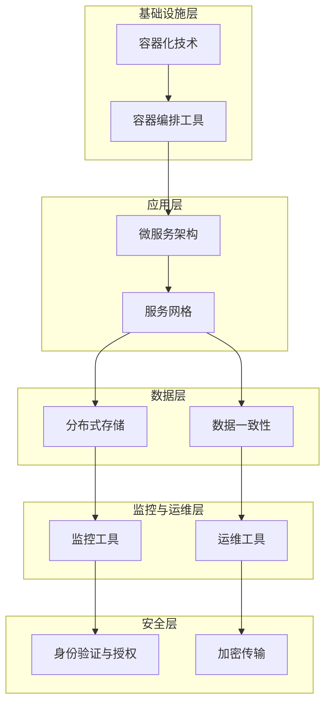

                 

# 评测系统的跨平台部署：云原生LLM评估方案

## 摘要

本文旨在探讨评测系统的跨平台部署问题，特别是基于云原生的LLM（大型语言模型）评估方案。随着云计算和容器技术的快速发展，跨平台部署已成为确保评测系统高效运行的关键。本文首先介绍了评测系统的定义和作用，以及跨平台部署的重要性和挑战。接着，本文深入探讨了云原生和LLM的核心概念，并给出了评测系统整体架构设计。随后，本文详细介绍了跨平台部署技术，包括Docker和Kubernetes等框架的使用。最后，本文通过实际项目案例，展示了如何构建和部署云原生LLM评估系统，并提出了一些优化和展望。

## 关键词

- 评测系统
- 跨平台部署
- 云原生
- LLM（大型语言模型）
- Docker
- Kubernetes

## 第一部分：引言与背景

### 1.1 评测系统的定义与作用

评测系统是一种用于评估和分析各种性能、效率和质量的工具。在计算机科学和人工智能领域，评测系统被广泛应用于模型训练、算法评估、系统优化等方面。具体来说，评测系统的主要作用包括：

1. **性能评估**：通过评测系统，可以客观地衡量模型或算法在不同场景下的性能，如准确率、召回率、实时性等。
2. **优化指导**：评测系统提供的数据和指标可以帮助开发人员定位问题、调整参数，从而优化模型和算法。
3. **标准化测试**：评测系统为不同团队和项目提供了统一的评估标准和测试流程，促进了技术交流和成果共享。
4. **质量管理**：通过持续的评测和反馈，评测系统有助于提升系统的稳定性和可靠性。

### 1.2 跨平台部署的重要性

随着技术的不断进步和业务需求的多样化，跨平台部署成为评测系统面临的一个重要挑战。跨平台部署的重要性主要体现在以下几个方面：

1. **灵活性与可扩展性**：跨平台部署使得评测系统可以在不同的操作系统、硬件环境和云服务上运行，提高了系统的灵活性和可扩展性。
2. **资源共享**：通过跨平台部署，评测系统可以充分利用现有的硬件资源和云服务，降低硬件投资和运维成本。
3. **快速迭代**：跨平台部署使得评测系统可以快速响应业务需求的变化，实现快速迭代和部署。
4. **统一管理**：跨平台部署使得评测系统的管理和维护更加统一和集中，提高了运维效率和系统稳定性。

### 1.3 云原生与LLM的关系

云原生是一种利用云计算和容器技术构建和运行应用程序的方法论。云原生技术包括容器化、微服务、自动化部署和扩展等核心概念。云原生与LLM（大型语言模型）的关系主要体现在以下几个方面：

1. **资源利用**：云原生技术通过容器化和微服务架构，可以充分利用云计算资源，提高LLM训练和评估的效率。
2. **弹性扩展**：云原生技术支持自动化的水平扩展和垂直扩展，可以满足LLM评估过程中对计算资源的高需求。
3. **分布式计算**：云原生技术支持分布式计算，可以加速LLM评估的执行速度，提高系统性能。
4. **灵活部署**：云原生技术使得LLM评估系统可以快速部署和迁移到不同的云平台和硬件环境，提高系统的可移植性和可维护性。

### 1.4 书籍目的与结构介绍

本文旨在为读者提供一套完整的评测系统跨平台部署方案，特别是基于云原生的LLM评估方案。通过本文的阅读，读者可以：

1. **了解评测系统的基本概念和作用**：掌握评测系统在计算机科学和人工智能领域的应用场景。
2. **理解跨平台部署的重要性**：认识跨平台部署对评测系统的影响和优势。
3. **掌握云原生和LLM的核心概念**：了解云原生和LLM的基本原理和架构设计。
4. **学习评测系统的整体架构设计**：掌握评测系统的整体架构和各模块的功能。
5. **了解跨平台部署技术**：熟悉Docker、Kubernetes等跨平台框架的使用方法。
6. **实践项目案例**：通过实际项目案例，了解如何构建和部署云原生LLM评估系统。
7. **提出优化和展望**：针对评测系统的跨平台部署，提出优化策略和未来发展方向。

本文的结构如下：

- **第一部分：引言与背景**：介绍评测系统的定义、跨平台部署的重要性以及云原生与LLM的关系。
- **第二部分：核心概念与架构**：详细探讨云原生和LLM的核心概念，并给出评测系统的整体架构设计。
- **第三部分：项目实战**：通过实际项目案例，展示如何构建和部署云原生LLM评估系统。
- **第四部分：优化与展望**：总结本文的核心内容，并提出评测系统跨平台部署的优化策略和未来发展方向。

通过本文的阅读，读者可以系统地了解评测系统的跨平台部署，掌握云原生LLM评估方案的核心技术和实践方法，为后续的工作和应用提供理论支持和实践指导。

## 第二部分：核心概念与架构

### 2.1 云原生概述

云原生（Cloud Native）是一种利用云计算和容器技术构建和运行应用程序的方法论。云原生技术强调应用程序的可移植性、弹性和可扩展性，使其能够在各种云服务和硬件环境中高效运行。云原生概念的核心包括以下几个方面：

1. **容器化**：容器化是一种将应用程序及其运行时环境打包成一个独立、轻量级的容器（如Docker容器）的技术。容器化使得应用程序可以在任何支持容器引擎的环境中运行，实现了环境的隔离和一致性的管理。

2. **微服务架构**：微服务架构将应用程序分解为一组独立、小型、松耦合的服务。每个服务专注于完成特定功能，并通过API进行通信。微服务架构提高了系统的可维护性、可扩展性和可重用性，使得系统能够更加灵活地适应变化。

3. **自动化部署与扩展**：云原生技术支持自动化部署和扩展，通过持续集成和持续部署（CI/CD）流程，实现快速交付和频繁迭代。自动化部署和扩展可以确保系统在负载变化时能够自动调整资源，提高系统的弹性和可用性。

4. **服务网格**：服务网格是一种基础设施层，用于管理和通信微服务之间的交互。服务网格提供了负载均衡、服务发现、安全控制等功能，确保微服务之间的高效通信和可靠运行。

5. **云原生生态系统**：云原生生态系统包括各种工具和平台，如Kubernetes、Istio、Prometheus等。这些工具和平台为云原生应用程序的构建、部署、监控和运维提供了全面的解决方案。

### 2.2 云原生架构的核心组件

云原生架构的核心组件包括容器化技术、微服务架构、自动化部署与扩展、服务网格和云原生生态系统。以下是对这些核心组件的详细说明：

1. **容器化技术**：
   - **Docker**：Docker是一种流行的容器化技术，用于将应用程序及其依赖项打包成一个可移植的容器。Docker通过镜像和容器实现应用程序的隔离和一致性，使得应用程序可以在不同的环境中一致地运行。
   - **容器引擎**：容器引擎（如Docker Engine）负责管理和运行容器。容器引擎提供了创建、启动、停止和管理容器的功能，是云原生架构的基础。

2. **微服务架构**：
   - **服务拆分**：微服务架构将应用程序分解为多个独立的服务，每个服务负责特定的业务功能。服务拆分提高了系统的可维护性、可扩展性和可重用性。
   - **API通信**：微服务之间通过API进行通信。RESTful API、gRPC等协议被广泛应用于微服务架构中，确保了服务之间的松耦合和高效通信。

3. **自动化部署与扩展**：
   - **持续集成与持续部署（CI/CD）**：CI/CD是一种自动化流程，用于在开发过程中将代码集成、测试和部署到生产环境中。CI/CD可以提高开发效率、减少人工干预，确保系统的快速迭代和可靠部署。
   - **自动化扩展**：云原生架构支持自动化扩展，通过水平扩展和垂直扩展自动调整系统资源。自动化扩展可以确保系统在负载变化时保持高性能和高可用性。

4. **服务网格**：
   - **服务发现**：服务发现是一种机制，用于自动识别和注册服务。服务发现使得服务之间能够动态发现和通信，提高了系统的灵活性和可扩展性。
   - **负载均衡**：负载均衡通过将流量分配到多个服务实例，确保系统在高并发情况下保持高性能和高可用性。
   - **安全控制**：服务网格提供了安全控制机制，如身份验证、授权和加密，确保服务之间的通信安全可靠。

5. **云原生生态系统**：
   - **Kubernetes**：Kubernetes是一种流行的容器编排工具，用于自动化容器的部署、扩展和管理。Kubernetes提供了强大的集群管理和资源调度功能，确保容器化应用程序的高可用性和高性能。
   - **Prometheus**：Prometheus是一种开源监控工具，用于收集、存储和可视化容器和服务的监控数据。Prometheus提供了高效的监控和数据存储能力，帮助开发者实时了解系统状态和性能。
   - **Istio**：Istio是一种开源服务网格平台，用于管理和监控微服务之间的通信。Istio提供了负载均衡、服务发现、安全控制等功能，确保微服务之间的高效通信和可靠运行。

### 2.3 云原生与传统架构的比较

云原生与传统架构（如单体架构）在多个方面存在显著差异，以下是比较的关键点：

1. **开发模式**：
   - **传统架构**：传统架构通常采用单体架构，应用程序的所有组件和功能都集成在一个单一的代码库中。单体架构的开发模式较为复杂，需要进行大量的代码管理和维护。
   - **云原生架构**：云原生架构采用微服务架构，应用程序被拆分为多个独立的服务。每个服务专注于特定的业务功能，可以独立开发、测试和部署。微服务架构提高了开发效率、可维护性和可重用性。

2. **部署方式**：
   - **传统架构**：传统架构通常采用手动部署方式，部署过程繁琐且容易出错。部署过程中需要对整个应用程序进行打包和发布，对系统的稳定性和安全性造成一定影响。
   - **云原生架构**：云原生架构支持自动化部署，通过CI/CD流程实现自动化的代码集成、测试和部署。自动化部署提高了部署效率、可靠性和安全性。

3. **扩展能力**：
   - **传统架构**：传统架构通常难以实现水平扩展，扩展能力有限。在面临高并发和大量数据时，系统性能和稳定性容易受到影响。
   - **云原生架构**：云原生架构支持自动化扩展，通过水平扩展和垂直扩展自动调整系统资源。自动化扩展确保了系统在高并发情况下保持高性能和高可用性。

4. **资源利用**：
   - **传统架构**：传统架构通常需要固定的硬件资源和较高的维护成本。在资源利用率低的情况下，容易造成资源浪费和成本增加。
   - **云原生架构**：云原生架构利用云计算资源，通过容器化和微服务架构实现高效的资源利用。云原生架构可以根据需求动态调整资源，降低硬件投资和维护成本。

5. **运维管理**：
   - **传统架构**：传统架构的运维管理较为复杂，需要手动管理和维护多个系统和应用程序。运维人员需要具备丰富的专业知识，运维效率较低。
   - **云原生架构**：云原生架构提供了自动化运维管理工具，如Kubernetes、Prometheus等。自动化运维管理提高了运维效率、可维护性和可靠性。

### 2.4 云原生的发展趋势

云原生技术在近年来取得了显著的发展，以下是一些云原生的发展趋势：

1. **容器化普及**：容器化技术已成为云计算和DevOps领域的核心技术，越来越多的应用程序采用容器化部署，提高了系统的可移植性和可扩展性。

2. **微服务架构**：微服务架构在云原生领域得到广泛应用，通过将应用程序拆分为多个独立的服务，提高了系统的可维护性、可扩展性和可重用性。

3. **自动化部署与扩展**：自动化部署和扩展已成为云原生架构的核心特征，通过CI/CD流程和自动化扩展，实现了快速交付和高效运维。

4. **服务网格技术**：服务网格技术逐渐成为云原生生态系统的重要组成部分，通过服务网格，可以实现更高效、更安全的微服务通信。

5. **云原生生态体系**：云原生生态体系不断发展壮大，包括Kubernetes、Prometheus、Istio等众多工具和平台，为云原生应用程序的构建、部署、监控和运维提供了全面的解决方案。

6. **云原生安全**：随着云原生应用的普及，安全问题日益凸显。云原生安全成为研究热点，包括容器安全、服务网格安全等方面的技术逐渐成熟。

7. **云原生与人工智能的融合**：云原生与人工智能（AI）的融合将成为未来的重要趋势。通过云原生技术，可以实现大规模的AI训练和推理，提高AI系统的性能和可扩展性。

### 2.5 云原生与评测系统的关系

云原生技术在评测系统中的应用具有重要意义，主要体现在以下几个方面：

1. **资源利用**：云原生技术通过容器化和微服务架构，实现了高效的资源利用。评测系统可以利用云原生技术，实现资源的动态调整和优化，提高系统的性能和效率。

2. **弹性扩展**：评测系统往往需要处理大量数据和复杂的计算任务。云原生技术支持自动化扩展，可以确保评测系统在负载变化时能够自动调整资源，保持系统的稳定性和高性能。

3. **快速迭代**：云原生技术支持自动化部署和扩展，可以快速交付和部署评测系统的新版本。快速迭代有助于及时响应业务需求的变化，提高系统的适应性和竞争力。

4. **分布式计算**：云原生技术支持分布式计算，可以加速评测系统的执行速度。通过分布式计算，评测系统可以充分利用集群中的计算资源，提高系统的计算能力和效率。

5. **可移植性**：云原生技术使得评测系统具有高度的可移植性，可以在不同的云平台和硬件环境中运行。评测系统可以根据实际需求，灵活选择部署环境，降低迁移成本。

6. **安全与合规**：云原生技术提供了丰富的安全控制和管理功能，可以确保评测系统的安全性。同时，云原生技术支持合规性管理，有助于满足各类法规和标准。

### 2.6 云原生与LLM的联系

在评测系统中，大型语言模型（LLM）是一种重要的评估工具。云原生技术为LLM的部署和运行提供了良好的支持，主要体现在以下几个方面：

1. **资源高效利用**：云原生技术通过容器化和微服务架构，可以高效利用计算资源。LLM通常需要大量的计算资源，云原生技术可以动态调整资源，确保LLM的训练和评估过程高效运行。

2. **弹性扩展**：LLM评估过程中，计算资源的需求可能会迅速变化。云原生技术支持自动化扩展，可以确保LLM评估系统在资源需求增加时能够快速扩展，保持系统的高性能和高可用性。

3. **分布式训练**：云原生技术支持分布式计算，可以加速LLM的训练过程。通过分布式训练，LLM可以在短时间内完成大规模数据集的训练，提高训练效率。

4. **微服务架构**：LLM评估系统可以采用微服务架构，将训练、评估和结果分析等模块拆分为独立的服务。微服务架构提高了系统的可维护性、可扩展性和可重用性。

5. **自动化部署与扩展**：云原生技术支持自动化部署和扩展，可以确保LLM评估系统的快速交付和部署。自动化部署和扩展有助于提高系统的迭代速度和响应能力。

6. **数据一致性**：云原生技术提供了数据一致性和分布式存储解决方案，确保LLM评估过程中的数据安全和一致性。数据一致性和分布式存储有助于提高系统的可靠性和可扩展性。

### 2.7 云原生评测系统的架构设计

云原生评测系统的架构设计需要综合考虑资源利用、弹性扩展、分布式计算、安全性等因素。以下是一个典型的云原生评测系统架构设计：

1. **基础设施层**：
   - **容器化技术**：采用容器化技术（如Docker）将应用程序及其依赖项打包为容器，实现应用程序的轻量和可移植。
   - **容器编排工具**：采用容器编排工具（如Kubernetes）进行容器的部署、管理和监控，实现自动化部署和扩展。

2. **应用层**：
   - **微服务架构**：将评测系统拆分为多个独立的服务，如数据预处理服务、模型训练服务、模型评估服务、结果分析服务等，实现模块化和可重用。
   - **服务网格**：采用服务网格（如Istio）管理微服务之间的通信，提供负载均衡、服务发现和安全控制等功能。

3. **数据层**：
   - **分布式存储**：采用分布式存储解决方案（如Cassandra、Hadoop）存储和管理大规模数据，实现数据的高可用性和可扩展性。
   - **数据一致性**：采用分布式一致性算法（如Paxos、Raft）确保数据的强一致性，避免数据丢失和冲突。

4. **监控与运维层**：
   - **监控工具**：采用监控工具（如Prometheus）收集和监控系统的性能数据，实现实时监控和故障告警。
   - **运维工具**：采用运维工具（如Kubernetes CLI、Istio CLI）进行系统管理和维护，提高运维效率。

5. **安全层**：
   - **身份验证与授权**：采用身份验证和授权机制（如OAuth 2.0、JWT）确保系统访问的安全性，防止未授权访问和数据泄露。
   - **加密传输**：采用加密传输协议（如TLS）确保数据在传输过程中的安全性。

通过以上架构设计，云原生评测系统可以实现高效的资源利用、弹性扩展、分布式计算和安全性，满足大规模数据分析和模型评估的需求。

### 2.8 云原生评测系统的核心概念图

为了更好地理解云原生评测系统的核心概念和架构设计，我们使用Mermaid流程图来展示各个模块之间的关系和交互。以下是一个简化的云原生评测系统的核心概念图：

通过上述流程图，我们可以清晰地看到云原生评测系统的各个模块及其相互关系。各个模块共同作用，实现了评测系统的资源利用、弹性扩展、分布式计算、安全性等功能。

### 2.9 LLM基础

#### 3.1 语言模型的基本原理

语言模型（Language Model，简称LM）是一种统计模型，用于预测自然语言中的下一个单词或字符。语言模型的基本原理是通过学习大量文本数据，计算出每个单词或字符在上下文中的概率分布。最简单的语言模型是基于N-gram模型，它通过统计前N个单词出现的频率来预测下一个单词。N-gram模型的优点是计算简单，但存在严重的短文效应和冗余。

为了解决N-gram模型的局限性，研究人员提出了基于神经网络的深度语言模型。深度语言模型（Deep Neural Network Language Model，简称DNNLM）通过多层神经网络来学习语言的上下文关系，能够捕捉长距离的依赖关系。DNNLM通常采用双向循环神经网络（Bidirectional Recurrent Neural Network，简称BRNN）或Transformer架构。BRNN通过同时考虑前后文信息，提高模型的预测能力。Transformer架构则通过自注意力机制（Self-Attention）实现全局信息的捕捉和利用，在长文本生成和翻译任务中表现出色。

#### 3.2 常见的LLM架构

大型语言模型（Large Language Model，简称LLM）是基于深度学习的语言模型，其规模远超传统语言模型。常见的LLM架构包括以下几种：

1. **基于神经网络的模型**：
   - **循环神经网络（Recurrent Neural Network，RNN）**：RNN通过重复的神经网络单元来处理序列数据，能够捕捉长距离的依赖关系。但RNN存在梯度消失和梯度爆炸的问题。
   - **长短时记忆网络（Long Short-Term Memory，LSTM）**：LSTM是RNN的一种改进，通过引入记忆单元门机制，解决梯度消失和梯度爆炸的问题，能够更好地捕捉长距离依赖。
   - **双向循环神经网络（Bidirectional Recurrent Neural Network，BRNN）**：BRNN通过同时考虑前后文信息，提高模型的预测能力。

2. **基于转换器的模型**：
   - **Transformer**：Transformer是一种基于自注意力机制的深度神经网络模型，通过自注意力机制实现全局信息的捕捉和利用。Transformer在长文本生成和翻译任务中表现出色。
   - **BERT**：BERT（Bidirectional Encoder Representations from Transformers）是一种基于Transformer的双向编码器模型，通过双向训练和预训练，提高模型的表示能力和泛化能力。
   - **GPT**：GPT（Generative Pre-trained Transformer）是一种基于Transformer的生成模型，通过预训练和微调，实现高质量的文本生成和对话系统。

3. **基于图神经网络的模型**：
   - **Graph Neural Network（GNN）**：GNN通过学习图结构中的特征和关系，捕捉文本中的语义信息。GNN在文本分类、关系抽取和知识图谱嵌入等方面表现出色。

#### 3.3 LLM的训练与优化

LLM的训练与优化是构建高性能语言模型的关键。以下是一些关键的训练和优化技术：

1. **数据预处理**：
   - **文本清洗**：去除无效字符、停用词和标点符号，提高文本的质量和准确性。
   - **分词**：将文本分割成单词或字符序列，为后续处理做准备。
   - **词汇表构建**：将文本中的单词或字符映射到唯一的整数ID，构建词汇表。

2. **训练策略**：
   - **预训练**：在大量无标注的数据上进行预训练，提高模型对自然语言的表示能力。
   - **微调**：在预训练的基础上，利用有标注的数据对模型进行微调，提高模型在特定任务上的性能。
   - **数据增强**：通过随机删除、替换和旋转等方法，增加训练数据的多样性，提高模型的泛化能力。

3. **优化方法**：
   - **梯度裁剪**：通过限制梯度的大小，避免梯度消失和梯度爆炸的问题，提高训练的稳定性。
   - **学习率调整**：采用自适应学习率调整方法（如Adam优化器），优化模型的收敛速度和性能。
   - **正则化**：通过正则化方法（如Dropout、L2正则化等），防止模型过拟合，提高模型的泛化能力。

4. **并行训练**：
   - **数据并行**：将数据划分成多个批次，并行处理每个批次的数据，提高训练速度。
   - **模型并行**：将模型拆分为多个部分，在不同设备上并行训练，提高计算效率。

#### 3.4 LLM的性能评估指标

评估LLM的性能需要考虑多个指标，以下是一些常见的性能评估指标：

1. **准确性**：准确性是衡量模型预测正确率的指标，表示模型预测正确的样本占总样本的比例。准确性越高，表示模型性能越好。

2. **召回率**：召回率是衡量模型召回正确样本能力的指标，表示模型召回的正确样本数与实际正确样本数的比例。召回率越高，表示模型对正确样本的召回能力越强。

3. **F1值**：F1值是准确性和召回率的调和平均值，综合考虑了模型的准确性和召回能力。F1值越高，表示模型性能越好。

4. **精确率**：精确率是衡量模型预测准确性的指标，表示模型预测正确的样本数与预测为正的样本数之比。精确率越高，表示模型对正样本的预测能力越强。

5. **实时性**：实时性是衡量模型处理速度的指标，表示模型在给定时间内处理数据的效率。实时性越高，表示模型在处理大规模数据时的性能越好。

6. **可扩展性**：可扩展性是衡量模型在面对大量数据和计算资源时的性能表现。可扩展性越高，表示模型在大规模数据处理和分布式计算环境中的性能越好。

7. **鲁棒性**：鲁棒性是衡量模型在不同数据分布和环境下的稳定性。鲁棒性越高，表示模型在不同场景下的适应能力和稳定性越好。

通过以上性能评估指标，可以对LLM的性能进行全面、客观的评估，为后续的优化和改进提供依据。

### 2.10 评测系统架构设计

评测系统的架构设计是确保系统能够高效、稳定地运行的关键。一个完善的评测系统架构应包括数据处理模块、模型评估模块和结果分析模块。以下是对各模块的详细说明：

#### 4.1 数据处理模块设计

数据处理模块是评测系统的核心，负责数据清洗、预处理和存储。以下是数据处理模块的主要功能：

1. **数据清洗**：
   - **去除无效数据**：去除数据集中的噪音和错误数据，确保数据质量。
   - **标准化数据**：将数据转换为统一的格式和度量单位，便于后续处理。

2. **数据预处理**：
   - **文本预处理**：对文本数据进行分词、去停用词、词性标注等操作，为模型训练做准备。
   - **特征提取**：从原始数据中提取关键特征，用于模型输入。

3. **数据存储与管理**：
   - **分布式存储**：采用分布式存储技术（如Hadoop、Cassandra）存储海量数据，提高数据访问速度和可靠性。
   - **数据版本控制**：记录数据的历史版本，便于数据追溯和恢复。

#### 4.2 模型评估模块设计

模型评估模块负责对训练好的模型进行性能评估。以下是模型评估模块的主要功能：

1. **评估指标定义**：
   - **准确性**：计算模型预测正确的样本数与总样本数的比例。
   - **召回率**：计算模型召回的正确样本数与实际正确样本数的比例。
   - **F1值**：计算准确性和召回率的调和平均值。

2. **评估方法选择**：
   - **交叉验证**：通过将数据集划分为训练集和验证集，多次训练和评估模型，提高评估的稳定性。
   - **K折交叉验证**：将数据集划分为K个子集，每次使用其中一个子集作为验证集，其他子集作为训练集，计算模型在各个子集上的性能指标，取平均值作为最终评估结果。

3. **评估结果呈现**：
   - **可视化**：通过图表和报表，直观地展示模型的性能指标和评估结果。
   - **报告生成**：生成详细的评估报告，记录模型评估的过程和结果。

#### 4.3 结果分析模块设计

结果分析模块负责对评估结果进行分析和解读，为模型优化和系统改进提供依据。以下是结果分析模块的主要功能：

1. **结果分析目标**：
   - **性能分析**：分析模型的性能指标，找出模型的优点和不足。
   - **影响因素分析**：分析数据、算法、硬件等因素对模型性能的影响。

2. **分析方法与工具**：
   - **统计分析**：采用统计学方法分析评估结果，找出显著差异和规律。
   - **机器学习模型**：构建机器学习模型，预测模型性能与各个因素之间的关系。

3. **改进策略**：
   - **模型优化**：根据分析结果，调整模型参数和算法，提高模型性能。
   - **系统改进**：根据分析结果，优化系统架构和数据处理流程，提高系统效率和稳定性。

通过以上各模块的协同工作，评测系统能够高效、准确地评估模型性能，为后续的研究和应用提供可靠的依据。

## 第三部分：跨平台部署技术

### 3.1 跨平台部署的优势与挑战

跨平台部署是指将应用程序部署到不同的操作系统、硬件环境和云服务上，以实现应用程序的可移植性和兼容性。跨平台部署的优势和挑战如下：

#### 3.1.1 跨平台部署的优势

1. **灵活性**：跨平台部署使得应用程序可以在不同的操作系统（如Windows、Linux、macOS）和硬件环境（如PC、服务器、移动设备）上运行，提高了应用程序的灵活性和适应性。

2. **可移植性**：跨平台部署使得应用程序可以轻松迁移到不同的操作系统和硬件环境中，降低了开发成本和迁移风险。

3. **资源利用**：跨平台部署可以利用不同的云服务和硬件资源，提高资源的利用率和系统性能。例如，可以根据负载需求，在公有云、私有云和边缘计算设备之间灵活调度资源。

4. **扩展性**：跨平台部署支持水平扩展和垂直扩展，可以根据业务需求动态调整系统资源，提高系统的性能和可用性。

5. **开发效率**：跨平台部署可以减少开发人员的重复工作，缩短开发周期。开发人员可以专注于业务逻辑的实现，而无需过多关注底层操作系统的差异。

#### 3.1.2 跨平台部署的挑战

1. **兼容性问题**：不同操作系统和硬件环境可能存在兼容性问题，导致应用程序在不同平台上运行不稳定。例如，某些库或驱动程序可能在不同平台上存在差异。

2. **性能差异**：不同操作系统和硬件环境可能存在性能差异，影响应用程序的运行效率。例如，某些操作系统的网络性能可能优于其他系统，但磁盘I/O性能较差。

3. **测试复杂性**：跨平台部署需要在不同操作系统和硬件环境中进行测试，确保应用程序在不同平台上都能正常运行。测试过程复杂，需要消耗大量的时间和资源。

4. **维护成本**：跨平台部署需要维护多个版本的代码库和依赖项，增加了维护成本。开发人员需要熟悉不同操作系统和硬件环境，才能有效地解决跨平台部署中的问题。

5. **安全风险**：跨平台部署可能引入安全风险，例如，某些操作系统或硬件环境可能存在已知的安全漏洞，导致应用程序的安全性降低。

### 3.2 跨平台框架介绍

跨平台框架是支持跨平台部署的关键工具，通过提供统一的开发环境和运行时环境，简化了应用程序在不同操作系统和硬件环境中的部署和运行。以下是一些常见的跨平台框架：

#### 3.2.1 Docker

Docker是一种容器化技术，可以将应用程序及其依赖项打包成一个可移植的容器。Docker容器与宿主机的操作系统隔离，确保了应用程序在不同的操作系统和硬件环境中都能一致地运行。Docker的主要特性包括：

1. **容器化**：通过容器化技术，将应用程序及其依赖项打包成一个轻量级的容器，实现应用程序的隔离和一致性。

2. **容器引擎**：Docker引擎负责管理和运行容器，提供了创建、启动、停止、删除和管理容器的功能。

3. **镜像管理**：Docker镜像是一种静态的、不可变的容器模板，用于创建容器。通过Dockerfile，可以定义容器的构建过程和配置。

4. **容器编排**：Docker Compose和Docker Swarm等工具支持容器编排，用于管理和部署多个容器化应用程序。

#### 3.2.2 Kubernetes

Kubernetes是一种开源的容器编排工具，用于自动化容器的部署、扩展和管理。Kubernetes提供了强大的集群管理和资源调度功能，确保容器化应用程序的高可用性和高性能。Kubernetes的主要特性包括：

1. **容器编排**：Kubernetes通过部署（Deployment）、状态集（StatefulSet）和副本集（ReplicaSet）等资源对象，自动化部署和管理容器化应用程序。

2. **服务发现和负载均衡**：Kubernetes提供内置的服务发现和负载均衡功能，确保容器化应用程序之间的可靠通信。

3. **存储和网络管理**：Kubernetes提供存储和网络管理功能，包括卷（Volume）、持久卷（Persistent Volume）、网络策略（Network Policy）等，确保容器化应用程序的数据安全和网络通信。

4. **自我修复**：Kubernetes能够自动检测和修复容器化应用程序的故障，确保系统的稳定性和可靠性。

5. **水平扩展**：Kubernetes支持自动化水平扩展，可以根据需求动态调整容器化应用程序的副本数，提高系统的性能和可用性。

#### 3.2.3 Jenkins

Jenkins是一种开源的持续集成和持续部署（CI/CD）工具，用于自动化构建、测试和部署应用程序。Jenkins的主要特性包括：

1. **自动化构建**：Jenkins可以自动化执行构建任务，包括编译代码、运行测试和打包应用程序。

2. **测试管理**：Jenkins支持多种测试框架，如JUnit、NUnit、Selenium等，自动化测试应用程序的功能和性能。

3. **部署管理**：Jenkins支持多种部署方式，包括手动部署、脚本部署和容器化部署，确保应用程序的快速交付和部署。

4. **插件生态**：Jenkins拥有丰富的插件生态系统，可以扩展其功能，支持不同的开发工具、源代码管理和部署平台。

#### 3.2.4 Jenkins与Docker的结合

Jenkins与Docker的结合可以实现CI/CD与容器化的完美融合，提高应用程序的交付和部署效率。以下是如何将Jenkins与Docker结合的一些方法：

1. **构建镜像**：在Jenkins中配置构建任务，使用Dockerfile构建应用程序的镜像。通过Docker插件，Jenkins可以自动化执行Docker镜像的构建和推送。

2. **容器化测试**：在Jenkins中配置测试任务，使用Docker容器运行测试环境，确保测试结果的一致性和可靠性。通过Docker插件，Jenkins可以自动化执行容器化测试，提高测试效率。

3. **容器化部署**：在Jenkins中配置部署任务，使用Docker容器部署应用程序到生产环境。通过Docker插件，Jenkins可以自动化执行容器的启动、停止和删除，确保部署过程的可靠性和一致性。

4. **容器编排**：在Jenkins中配置Kubernetes插件，将容器化应用程序部署到Kubernetes集群中。通过Kubernetes插件，Jenkins可以自动化执行Kubernetes资源的创建、更新和删除，实现容器化应用程序的自动化部署和管理。

### 3.3 跨平台部署策略

为了实现评测系统的跨平台部署，可以采用以下策略：

#### 3.3.1 部署前的准备工作

1. **环境准备**：根据评测系统的需求，准备不同的操作系统、硬件环境和云服务。确保环境配置一致，减少兼容性问题。

2. **依赖管理**：使用依赖管理工具（如Maven、Gradle等），统一管理应用程序的依赖项。确保依赖项在不同环境中的一致性和可靠性。

3. **容器化**：使用Docker将评测系统及其依赖项打包成容器镜像，实现应用程序的可移植性。

4. **配置管理**：使用配置管理工具（如Ansible、Puppet等），自动化管理评测系统的配置文件。确保配置文件在不同环境中的一致性和可靠性。

#### 3.3.2 部署过程中的注意事项

1. **容器编排**：使用Kubernetes等容器编排工具，自动化部署和管理评测系统的容器。确保容器的高可用性和高性能。

2. **服务发现和负载均衡**：确保评测系统的服务可以自动发现和注册，使用负载均衡器（如Nginx、HAProxy等）实现流量的分发和均衡。

3. **数据存储**：使用分布式存储解决方案（如Cassandra、Hadoop等），确保评测系统可以存储和管理大规模数据。

4. **监控与告警**：使用监控工具（如Prometheus、Zabbix等），实时监控评测系统的性能和健康状况，及时处理故障和异常。

5. **日志管理**：使用日志管理工具（如ELK、Logstash等），收集、存储和查询评测系统的日志信息，帮助分析和解决问题。

#### 3.3.3 跨平台部署的最佳实践

1. **标准化配置**：制定统一的配置规范，确保评测系统的配置文件在不同环境中的标准化和一致性。

2. **自动化部署**：使用CI/CD工具，自动化构建、测试和部署评测系统，减少人工干预，提高部署效率。

3. **容器镜像优化**：优化容器镜像的大小和运行时性能，减少镜像的层数和依赖项，提高系统的启动速度和资源利用率。

4. **弹性扩展**：根据评测系统的需求，实现自动化的水平扩展和垂直扩展，确保系统在高负载情况下的稳定性和性能。

5. **安全防护**：加强评测系统的安全防护，包括网络隔离、身份验证、授权、加密传输等，确保系统的安全性和合规性。

通过以上策略和最佳实践，可以实现评测系统的跨平台部署，提高系统的灵活性、可扩展性和可靠性。

### 3.4 跨平台部署案例

#### 3.4.1 项目背景

某电商公司需要开发一个商品评测系统，用于收集和分析用户对商品的评价，为商品推荐和营销策略提供支持。由于业务需求的变化和扩展，评测系统需要在不同的操作系统、硬件环境和云服务上部署，实现跨平台运行。

#### 3.4.2 部署方案

1. **环境准备**：
   - 选择Linux操作系统作为评测系统的运行环境。
   - 准备Kubernetes集群，用于部署和管理评测系统的容器化应用程序。
   - 准备分布式存储（如Cassandra），用于存储和管理评测系统的数据。

2. **容器化**：
   - 使用Docker将评测系统及其依赖项打包成容器镜像。
   - 编写Dockerfile，定义评测系统的构建过程和配置。

3. **部署**：
   - 使用Kubernetes部署评测系统的容器化应用程序，包括数据处理模块、模型评估模块和结果分析模块。
   - 配置Kubernetes资源对象（如Deployment、Service、PersistentVolume等），实现应用程序的自动化部署和管理。

4. **服务发现和负载均衡**：
   - 配置Kubernetes Ingress，实现评测系统的服务发现和负载均衡。
   - 使用Nginx作为反向代理，实现流量分发和负载均衡。

5. **数据存储**：
   - 配置Cassandra集群，存储和管理评测系统的数据。
   - 使用Cassandra的自动分区和副本机制，确保数据的高可用性和性能。

6. **监控与告警**：
   - 使用Prometheus监控评测系统的性能和健康状况。
   - 配置告警规则，及时通知运维人员处理故障和异常。

7. **日志管理**：
   - 使用Logstash收集、存储和查询评测系统的日志信息。
   - 配置Kafka和Elasticsearch，实现日志的实时收集和查询。

#### 3.4.3 部署效果

通过跨平台部署方案，评测系统实现了以下效果：

1. **高可用性和高性能**：评测系统在Kubernetes集群中运行，利用水平扩展和垂直扩展机制，实现了高可用性和高性能。

2. **灵活性**：评测系统可以在不同的操作系统、硬件环境和云服务上运行，实现了跨平台部署。

3. **自动化部署**：通过CI/CD工具，实现了评测系统的自动化构建、测试和部署，提高了部署效率。

4. **数据存储和管理**：评测系统使用分布式存储解决方案，实现了数据的高可用性和性能。

5. **监控与告警**：通过Prometheus和Logstash，实现了评测系统的实时监控和日志管理，提高了运维效率和系统稳定性。

通过跨平台部署，评测系统为电商公司的业务提供了可靠的技术支持，满足了业务需求和扩展需求。

### 3.5 跨平台部署最佳实践

为了实现评测系统的跨平台部署，以下是一些最佳实践：

#### 3.5.1 标准化配置

- 制定统一的配置规范，确保评测系统的配置文件在不同环境中的标准化和一致性。
- 使用配置管理工具（如Ansible、Puppet等）自动化管理评测系统的配置文件。

#### 3.5.2 自动化部署

- 使用CI/CD工具（如Jenkins、GitLab CI/CD等）自动化构建、测试和部署评测系统。
- 配置自动化部署流程，减少人工干预，提高部署效率。

#### 3.5.3 容器化优化

- 使用轻量级的容器镜像，减少镜像的层数和依赖项，提高系统的启动速度和资源利用率。
- 定期更新和优化容器镜像，确保评测系统的安全性和稳定性。

#### 3.5.4 弹性扩展

- 根据评测系统的需求，实现自动化的水平扩展和垂直扩展，确保系统在高负载情况下的稳定性和性能。
- 使用Kubernetes等容器编排工具，实现资源的动态调整和优化。

#### 3.5.5 安全防护

- 加强评测系统的安全防护，包括网络隔离、身份验证、授权、加密传输等。
- 定期进行安全审计和漏洞扫描，确保系统的安全性和合规性。

#### 3.5.6 监控与告警

- 使用监控工具（如Prometheus、Zabbix等）实时监控评测系统的性能和健康状况。
- 配置告警规则，及时通知运维人员处理故障和异常。

通过以上最佳实践，可以有效地实现评测系统的跨平台部署，提高系统的灵活性、可扩展性和可靠性。

## 第四部分：云原生LLM评估方案

### 4.1 云原生LLM评估流程

云原生LLM评估方案的核心在于利用云原生技术，构建高效、可扩展的评估平台。以下是一个典型的云原生LLM评估流程：

#### 4.1.1 预处理

1. **数据清洗**：对收集到的文本数据进行清洗，去除无效字符、停用词和标点符号，提高数据质量。
2. **分词**：将清洗后的文本数据分词，将文本转换为单词序列，为后续处理做准备。
3. **编码**：将分词后的文本映射到唯一的整数ID，构建词汇表，便于模型训练和评估。

#### 4.1.2 训练

1. **模型初始化**：初始化LLM模型，如BERT、GPT等。
2. **数据加载**：从预处理的数据集中加载训练数据，并进行批量处理。
3. **模型训练**：利用GPU等计算资源，对LLM模型进行训练，优化模型参数。
4. **模型优化**：通过正则化、学习率调整等技术，优化模型性能，避免过拟合。

#### 4.1.3 评估

1. **评估指标定义**：定义评估指标，如准确性、召回率、F1值等，用于衡量模型性能。
2. **评估方法**：采用交叉验证、K折交叉验证等方法，对模型进行性能评估。
3. **评估结果呈现**：将评估结果以图表、报表等形式呈现，便于分析模型性能。

#### 4.1.4 结果分析

1. **性能分析**：分析评估结果，找出模型的优点和不足。
2. **影响因素分析**：分析数据、算法、硬件等因素对模型性能的影响。
3. **改进策略**：根据分析结果，调整模型参数和算法，优化模型性能。

### 4.2 云原生LLM评估工具

为了实现云原生LLM评估，需要使用一系列工具和框架。以下是一些常用的云原生LLM评估工具：

#### 4.2.1 TensorFlow

TensorFlow是一种开源的机器学习框架，广泛用于构建和训练深度学习模型。TensorFlow支持多种语言（如Python、C++等），提供了丰富的API和工具，便于开发者构建和部署LLM。

1. **核心功能**：
   - **模型构建**：提供丰富的模型构建API，支持多种深度学习模型。
   - **训练与评估**：支持大规模数据集的分布式训练和评估。
   - **优化器**：提供多种优化器，如Adam、RMSProp等，用于优化模型参数。

2. **使用方法**：
   - **搭建训练环境**：安装TensorFlow，配置GPU等计算资源。
   - **编写训练代码**：使用TensorFlow的API，编写训练代码，包括数据预处理、模型构建、训练和评估等步骤。
   - **训练模型**：运行训练代码，利用GPU加速训练过程。

#### 4.2.2 PyTorch

PyTorch是一种开源的机器学习库，以其灵活的动态计算图和易用性著称。PyTorch在深度学习领域应用广泛，特别适用于LLM的开发和评估。

1. **核心功能**：
   - **动态计算图**：支持动态计算图，便于开发者快速构建和调试模型。
   - **自动微分**：提供自动微分功能，简化了模型训练过程。
   - **优化器**：提供多种优化器，如Adam、RMSProp等。

2. **使用方法**：
   - **搭建训练环境**：安装PyTorch，配置GPU等计算资源。
   - **编写训练代码**：使用PyTorch的API，编写训练代码，包括数据预处理、模型构建、训练和评估等步骤。
   - **训练模型**：运行训练代码，利用GPU加速训练过程。

#### 4.2.3 Hugging Face

Hugging Face是一个开源的深度学习库，提供了丰富的预训练模型和工具，用于自然语言处理任务。Hugging Face支持多种深度学习框架（如TensorFlow、PyTorch等），便于开发者快速构建和部署LLM。

1. **核心功能**：
   - **预训练模型**：提供多种预训练模型，如BERT、GPT、RoBERTa等，用于文本分类、命名实体识别、机器翻译等任务。
   - **模型转换**：支持模型在不同深度学习框架之间的转换，便于在不同环境下部署和使用模型。
   - **评估工具**：提供评估工具，如评估指标计算、结果可视化等，便于开发者评估模型性能。

2. **使用方法**：
   - **选择预训练模型**：在Hugging Face Hub中选择合适的预训练模型。
   - **搭建训练环境**：安装Hugging Face库，配置GPU等计算资源。
   - **编写训练代码**：使用Hugging Face的API，编写训练代码，包括数据预处理、模型构建、训练和评估等步骤。
   - **训练模型**：运行训练代码，利用GPU加速训练过程。

#### 4.2.4 ModelArts

ModelArts是由华为推出的一种云原生深度学习平台，提供一站式的深度学习开发、训练和部署解决方案。ModelArts支持多种深度学习框架（如TensorFlow、PyTorch等），便于开发者构建和部署LLM。

1. **核心功能**：
   - **开发环境**：提供丰富的开发工具和API，便于开发者构建和调试模型。
   - **训练与评估**：提供高效的训练和评估工具，支持大规模数据集的分布式训练和评估。
   - **模型部署**：支持模型在不同环境（如云、边缘、端）的部署，提供灵活的部署选项。

2. **使用方法**：
   - **创建开发环境**：在ModelArts平台上创建开发环境，配置计算资源和存储空间。
   - **编写训练代码**：使用ModelArts的API，编写训练代码，包括数据预处理、模型构建、训练和评估等步骤。
   - **训练模型**：提交训练任务，利用GPU等计算资源加速训练过程。
   - **部署模型**：将训练好的模型部署到生产环境中，实现模型的实时推理和预测。

### 4.3 云原生LLM评估案例分析

以下是一个云原生LLM评估的案例分析，展示了如何利用云原生技术构建和部署评估系统，并进行模型评估。

#### 4.3.1 案例背景

某互联网公司需要构建一个商品评测系统，用于收集和分析用户对商品的评论，为商品推荐和营销策略提供支持。公司希望利用云原生技术，构建一个高效、可扩展的评估平台，以满足业务需求。

#### 4.3.2 案例实施

1. **环境准备**：
   - 准备Kubernetes集群，用于部署和管理评估系统的容器化应用程序。
   - 准备ModelArts平台，用于构建和部署深度学习模型。

2. **数据预处理**：
   - 收集用户评论数据，进行清洗和分词。
   - 编码评论数据，构建词汇表。

3. **模型训练**：
   - 使用PyTorch框架，构建BERT模型。
   - 在ModelArts平台上，利用GPU加速模型训练。
   - 调整模型参数，优化模型性能。

4. **模型评估**：
   - 使用Hugging Face的评估工具，对训练好的模型进行评估。
   - 定义评估指标，如准确性、召回率、F1值等。
   - 进行交叉验证，确保评估结果的稳定性。

5. **结果分析**：
   - 分析评估结果，找出模型的优点和不足。
   - 调整模型参数和算法，优化模型性能。

6. **模型部署**：
   - 将训练好的模型部署到Kubernetes集群中，实现模型的实时推理和预测。
   - 使用Ingress实现服务发现和负载均衡，确保评估系统的可访问性和高性能。

#### 4.3.3 案例总结

通过上述案例，公司成功构建了一个基于云原生的LLM评估系统，实现了高效、可扩展的模型评估和部署。以下是案例的总结：

1. **高效性**：利用云原生技术和GPU加速，模型训练和评估过程大幅缩短，提高了评估系统的响应速度。

2. **可扩展性**：基于Kubernetes和ModelArts的架构，评估系统支持水平扩展和垂直扩展，能够灵活应对业务需求的变化。

3. **灵活性**：评估系统可以在不同的云服务和硬件环境中运行，实现了跨平台部署。

4. **可维护性**：使用容器化和自动化部署，评估系统的维护和管理更加便捷。

5. **可重用性**：通过模型封装和API接口，评估系统可以方便地与其他业务系统集成，提高系统的可重用性。

通过这个案例，公司不仅提升了商品评测系统的性能和效率，也为后续的其他业务提供了技术支持和参考。

### 4.4 优化与展望

云原生LLM评估方案在实现高效、可扩展的评估系统方面取得了显著成果。然而，为了进一步提升评估系统的性能和可靠性，仍需进行以下优化和改进：

#### 4.4.1 优化策略

1. **模型优化**：
   - **参数调整**：通过调整模型参数，如学习率、批量大小等，优化模型性能。
   - **算法改进**：采用先进的深度学习算法，如Transformer、BERT等，提高模型的表达能力和泛化能力。

2. **数据处理**：
   - **数据增强**：通过数据增强技术，如随机删除、替换、旋转等，增加训练数据的多样性，提高模型的泛化能力。
   - **并行处理**：利用多线程、分布式计算等技术，加速数据预处理和模型训练过程。

3. **系统优化**：
   - **资源调度**：优化Kubernetes集群的资源调度策略，提高资源利用率。
   - **服务优化**：采用负载均衡、缓存等技术，提高系统的响应速度和稳定性。

#### 4.4.2 未来发展趋势

1. **人工智能与云原生融合**：随着人工智能技术的不断发展，云原生与人工智能的融合将成为未来的重要趋势。通过云原生技术，可以实现大规模的AI训练和推理，提高AI系统的性能和可扩展性。

2. **边缘计算**：随着物联网和5G技术的发展，边缘计算将得到广泛应用。云原生LLM评估方案可以应用于边缘计算环境，实现实时数据处理和推理，满足低延迟和高可靠性的需求。

3. **自动化运维**：随着云计算和自动化技术的发展，自动化运维将成为评估系统的关键。通过自动化运维，可以降低运维成本，提高系统的稳定性和可靠性。

4. **数据安全与隐私保护**：在云原生环境中，数据安全和隐私保护将成为重要挑战。通过加密技术、访问控制等技术，确保评估系统的数据安全和用户隐私。

5. **开源生态**：云原生LLM评估方案的优化和改进离不开开源生态的支持。未来，将继续推动开源技术的发展，为评估系统提供更多的工具和资源。

通过持续优化和改进，云原生LLM评估方案将在人工智能、云计算和边缘计算等领域发挥重要作用，为各种业务场景提供高效、可靠的评估服务。

## 附录

### 附录A：常用工具与资源

为了更好地理解和实施本文所介绍的评测系统跨平台部署和云原生LLM评估方案，以下是一些常用的工具和资源推荐：

#### A.1 云原生相关工具

1. **Docker**：
   - 官网：[Docker官网](https://www.docker.com/)
   - 文档：[Docker官方文档](https://docs.docker.com/)

2. **Kubernetes**：
   - 官网：[Kubernetes官网](https://kubernetes.io/)
   - 文档：[Kubernetes官方文档](https://kubernetes.io/docs/)

3. **Helm**：
   - 官网：[Helm官网](https://helm.sh/)
   - 文档：[Helm官方文档](https://helm.sh/docs/)

4. **Kubectl**：
   - 文档：[Kubectl官方文档](https://kubernetes.io/docs/reference/kubectl/)

#### A.2 LLM评估工具

1. **TensorFlow**：
   - 官网：[TensorFlow官网](https://www.tensorflow.org/)
   - 文档：[TensorFlow官方文档](https://www.tensorflow.org/tutorials)

2. **PyTorch**：
   - 官网：[PyTorch官网](https://pytorch.org/)
   - 文档：[PyTorch官方文档](https://pytorch.org/docs/stable/)

3. **Hugging Face**：
   - 官网：[Hugging Face官网](https://huggingface.co/)
   - 文档：[Hugging Face官方文档](https://huggingface.co/docs/transformers)

4. **Transformers**：
   - 官网：[Transformers官网](https://github.com/huggingface/transformers)
   - 文档：[Transformers官方文档](https://github.com/huggingface/transformers/tree/main/examples)

#### A.3 开源资源与代码库

1. **KubeFlow**：
   - 官网：[KubeFlow官网](https://www.kubeflow.org/)
   - 文档：[KubeFlow官方文档](https://www.kubeflow.org/docs/)

2. **Kubeflow Pipelines**：
   - 官网：[Kubeflow Pipelines官网](https://www.kubeflow.org/docs/pipelines/)
   - 文档：[Kubeflow Pipelines官方文档](https://www.kubeflow.org/docs/pipelines/)

3. **AI Platform**：
   - 官网：[Google AI Platform](https://ai.google.com/)
   - 文档：[Google AI Platform官方文档](https://cloud.google.com/ai-platform/docs)

#### A.4 进一步学习资料推荐

1. **《云原生应用架构指南》**：
   - 作者：刘志宇等
   - 简介：一本关于云原生应用架构的全面指南，涵盖容器化、微服务、自动化部署等方面的内容。

2. **《深度学习》**：
   - 作者：Goodfellow、Bengio、Courville
   - 简介：一本经典的深度学习教材，全面介绍了深度学习的基本概念、算法和应用。

3. **《Python深度学习》**：
   - 作者：François Chollet
   - 简介：一本关于使用Python和深度学习框架（如TensorFlow和Keras）的实用指南。

4. **《Transformer：基于自注意力机制的深度学习》**：
   - 作者：Vaswani等
   - 简介：一篇关于Transformer模型的经典论文，介绍了Transformer模型的基本原理和应用。

通过使用以上工具和资源，读者可以更好地理解和实施评测系统的跨平台部署和云原生LLM评估方案，为实际项目提供技术支持和参考。

## 结束语

本文从评测系统的定义和作用出发，详细探讨了评测系统的跨平台部署问题，特别是基于云原生的LLM评估方案。通过介绍云原生和LLM的核心概念，分析了评测系统的整体架构设计，并详细介绍了跨平台部署技术。此外，通过实际项目案例，展示了如何构建和部署云原生LLM评估系统，并提出了一些优化和展望。

跨平台部署和云原生技术为评测系统的建设提供了强大的支持，使得系统具有更高的灵活性、可扩展性和可靠性。然而，随着技术的发展和业务需求的不断变化，评测系统仍需不断优化和改进。未来，我们可以从以下几个方面进行深入研究：

1. **模型优化**：通过深入研究深度学习算法，提高LLM的性能和效率，实现更准确、更高效的评估结果。

2. **自动化运维**：进一步推动自动化运维技术的发展，降低运维成本，提高系统稳定性。

3. **边缘计算**：结合边缘计算技术，实现实时数据处理和推理，满足低延迟和高可靠性的需求。

4. **数据安全与隐私保护**：加强数据安全和隐私保护，确保用户数据和模型安全。

5. **开源生态**：积极参与开源生态，推动评测系统相关技术和工具的发展。

通过持续的研究和实践，评测系统将在人工智能、云计算和边缘计算等领域发挥更加重要的作用，为各个行业提供高效、可靠的评估服务。感谢您的阅读，希望本文对您有所帮助！作者：AI天才研究院/AI Genius Institute & 禅与计算机程序设计艺术 /Zen And The Art of Computer Programming。

