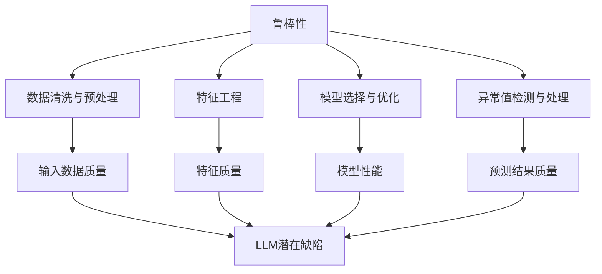

                 

### 引言

随着人工智能技术的迅猛发展，大型语言模型（LLM）在自然语言处理（NLP）领域取得了显著的成果。LLM通过深度学习技术从大量文本数据中学习语言模式，从而实现文本生成、情感分析、机器翻译等多种功能。然而，尽管LLM在处理复杂任务方面表现出色，但其鲁棒性仍然面临诸多挑战。评测系统的鲁棒性，即系统在面对LLM潜在缺陷时能够稳定运行的能力，成为当前研究的热点。

本文旨在探讨评测系统的鲁棒性，并针对LLM的潜在缺陷提出一系列应对策略。首先，我们将介绍评测系统鲁棒性的基本概念和重要性。接着，深入分析LLM的潜在缺陷及其影响。在此基础上，我们将详细探讨提高评测系统鲁棒性的策略，包括数据清洗与预处理、特征工程、模型选择与优化、异常值检测与处理等。最后，通过实际案例展示如何应用这些策略，并总结最佳实践和注意事项。

通过本文的讨论，我们希望能够为相关领域的研究者和从业者提供有价值的参考，提升评测系统的鲁棒性，推动人工智能技术的进一步发展。

### 关键词

- 评测系统鲁棒性
- 大型语言模型（LLM）
- 数据清洗与预处理
- 特征工程
- 模型选择与优化
- 异常值检测与处理
- 鲁棒性提升策略

### 摘要

本文探讨了评测系统的鲁棒性及其在应对大型语言模型（LLM）潜在缺陷中的应用。首先，我们介绍了评测系统鲁棒性的基本概念和重要性。接着，分析了LLM的潜在缺陷及其对评测系统的影响。在此基础上，提出了提高评测系统鲁棒性的策略，包括数据清洗与预处理、特征工程、模型选择与优化、异常值检测与处理等。通过实际案例展示了这些策略的应用效果，并总结了最佳实践和注意事项。本文为提升评测系统鲁棒性提供了系统性指导和实用建议。

### 背景介绍

评测系统作为一种自动化工具，广泛应用于各类任务的质量评估和性能监控。在人工智能领域，评测系统尤为关键，因为它们能够对模型训练过程进行实时监控和评估，确保模型的性能和可靠性。随着大型语言模型（LLM）的普及，评测系统的鲁棒性变得尤为重要。LLM在自然语言处理任务中表现出色，但其鲁棒性却面临诸多挑战。首先，LLM的输入数据质量对模型的输出结果具有直接影响。若输入数据存在噪声、缺失值或异常值，LLM可能无法正确理解输入内容，导致输出结果错误。此外，LLM的训练数据可能存在偏差，导致模型在特定任务上表现出色，但在其他任务上表现不佳。这些因素共同影响着评测系统的鲁棒性。

具体而言，评测系统的鲁棒性表现在以下几个方面：

1. **输入数据鲁棒性**：评测系统需要能够处理各种输入数据，包括噪声、缺失值和异常值。系统应当能够对输入数据进行预处理，提取有用信息，同时过滤掉无用信息。

2. **算法鲁棒性**：评测系统所采用的算法需要具备较强的抗干扰能力，能够在不同情况下保持稳定的表现。这要求算法能够适应不同类型的数据集，并在数据质量发生变化时保持性能。

3. **模型鲁棒性**：评测系统所依赖的LLM模型需要具备较高的鲁棒性，能够应对输入数据中的各种异常情况，保证输出结果的准确性和一致性。

4. **环境鲁棒性**：评测系统需要在各种环境下稳定运行，包括不同的操作系统、硬件设备以及网络环境等。系统应当能够自动调整参数，以适应不同的运行环境。

当前，评测系统的鲁棒性在理论和实践方面均面临诸多挑战。首先，如何有效识别和过滤输入数据中的异常值和噪声是一个难题。其次，算法和模型的选择与优化也是一个关键问题。最后，如何在多样化的环境中确保评测系统的稳定运行，仍需要进一步的研究和实践。

为了应对这些挑战，研究者们提出了多种提高评测系统鲁棒性的策略，包括数据清洗与预处理、特征工程、模型选择与优化等。接下来，本文将详细探讨这些策略，并通过实际案例展示其应用效果。

### 核心概念与联系

为了更好地理解评测系统的鲁棒性以及如何应对LLM的潜在缺陷，我们需要梳理几个关键概念，并探讨它们之间的联系。以下是这些核心概念及其相互关系：

1. **鲁棒性（Robustness）**：鲁棒性是指系统在面临各种不确定性和异常情况时，仍能保持稳定性和有效性的能力。在评测系统中，鲁棒性意味着系统能够处理噪声、缺失值、异常值等各种输入数据，并输出可靠的结果。

2. **大型语言模型（LLM）**：LLM是一种基于深度学习的语言处理模型，能够在大量文本数据的基础上学习语言模式。LLM的潜在缺陷包括数据偏差、模型过拟合、输入数据噪声等，这些缺陷会影响评测系统的鲁棒性。

3. **数据清洗与预处理**：数据清洗与预处理是提高评测系统鲁棒性的重要手段。通过数据清洗，我们可以去除噪声、填补缺失值，从而保证输入数据的准确性和一致性。预处理还包括特征提取、归一化等步骤，这些步骤有助于模型更好地学习数据特征。

4. **特征工程**：特征工程是指通过选择和构造特征，提升模型性能的过程。特征工程的核心在于找到能够区分不同类别的特征，从而提高模型的泛化能力。特征工程与数据清洗与预处理密切相关，因为预处理步骤会直接影响特征的质量。

5. **模型选择与优化**：模型选择与优化是提高评测系统鲁棒性的关键环节。选择合适的模型，并通过超参数调优和正则化等技术，可以提升模型的鲁棒性。此外，模型选择与优化还需要考虑数据集的多样性和分布情况。

6. **异常值检测与处理**：异常值检测与处理是确保评测系统鲁棒性的重要措施。通过检测输入数据中的异常值，我们可以避免这些异常值对模型训练和预测结果产生负面影响。异常值处理策略包括删除、替换或调整异常值等。

为了更好地展示这些核心概念之间的联系，我们可以使用Mermaid流程图进行说明：



这个Mermaid流程图展示了评测系统鲁棒性的核心概念及其相互关系。通过数据清洗与预处理，我们可以提高输入数据的质量（F），从而降低LLM的潜在缺陷对系统的影响（J）。特征工程（C）和模型选择与优化（D）可以提升模型性能（H），进一步确保预测结果的质量（I）。异常值检测与处理（E）则有助于避免异常值对模型训练和预测结果的干扰。

理解这些核心概念及其相互关系，对于设计一个鲁棒性强的评测系统至关重要。接下来，我们将详细探讨如何通过这些策略来提升评测系统的鲁棒性。

### 核心算法原理讲解

为了深入理解评测系统的鲁棒性提升策略，我们首先需要了解一些关键算法的原理。以下是几个核心算法及其Python源代码示例，并结合数学模型和公式进行详细讲解。

#### 数据清洗与预处理

数据清洗与预处理是提高评测系统鲁棒性的重要步骤。以下是一个简单的Python代码示例，展示如何清洗和预处理输入数据：

```python
import pandas as pd
from sklearn.impute import SimpleImputer
from sklearn.preprocessing import StandardScaler

# 加载数据
data = pd.read_csv('data.csv')

# 填补缺失值
imputer = SimpleImputer(strategy='mean')
data_filled = imputer.fit_transform(data)

# 归一化特征
scaler = StandardScaler()
data_normalized = scaler.fit_transform(data_filled)

# 输出处理后的数据
data_final = pd.DataFrame(data_normalized, columns=data.columns)
print(data_final.head())
```

**数学模型与公式**：
- 简单线性填值（SimpleImputer）的数学公式：
  $$ \text{impute}(x_i) = \frac{1}{N} \sum_{j=1}^{N} x_{ij} $$
  其中，$x_i$ 为缺失值，$x_{ij}$ 为非缺失值，$N$ 为非缺失值的数量。

- 归一化（StandardScaler）的数学公式：
  $$ x_{\text{标准化}} = \frac{x - \mu}{\sigma} $$
  其中，$x$ 为原始值，$\mu$ 为均值，$\sigma$ 为标准差。

**解释与举例**：
假设我们有一个数据集，其中包含年龄和收入两个特征。年龄特征中存在缺失值，而收入特征存在异常值。通过简单线性填值，我们可以将缺失的年龄值替换为平均年龄。然后，通过归一化处理，我们将收入特征标准化，使其均值为0，标准差为1。这样，我们能够去除异常值的影响，提高模型对输入数据的鲁棒性。

#### 特征工程

特征工程是提升模型性能的关键步骤。以下是一个简单的特征选择示例，使用Python代码实现：

```python
from sklearn.feature_selection import SelectKBest, f_classif

# 加载数据
X = data_final.drop('target', axis=1)
y = data_final['target']

# 特征选择
selector = SelectKBest(score_func=f_classif, k=2)
X_selected = selector.fit_transform(X, y)

# 输出特征选择结果
print("Selected Features:", X_selected.columns)
```

**数学模型与公式**：
- 卡方检验（f_classif）的数学公式：
  $$ \chi^2 = \sum_{i=1}^{n} \frac{(O_i - E_i)^2}{E_i} $$
  其中，$O_i$ 为观测频数，$E_i$ 为期望频数，$n$ 为类别数。

**解释与举例**：
假设我们有一个二元分类问题，目标变量为是否购买商品。我们使用卡方检验来选择与目标变量最相关的两个特征。通过特征选择，我们能够去除无关或冗余的特征，提高模型的泛化能力和鲁棒性。

#### 模型选择与优化

模型选择与优化是确保评测系统鲁棒性的关键步骤。以下是一个简单的模型选择与优化示例，使用Python代码实现：

```python
from sklearn.model_selection import GridSearchCV
from sklearn.ensemble import RandomForestClassifier

# 定义模型
model = RandomForestClassifier()

# 定义参数网格
param_grid = {
    'n_estimators': [100, 200],
    'max_depth': [10, 20],
    'min_samples_split': [2, 5]
}

# 实例化网格搜索
grid_search = GridSearchCV(model, param_grid, cv=5)

# 搜索最优参数
grid_search.fit(X_selected, y)

# 输出最优参数
print("Best Parameters:", grid_search.best_params_)

# 使用最优参数训练模型
best_model = grid_search.best_estimator_

# 预测
predictions = best_model.predict(X_selected)

# 输出预测结果
print(predictions)
```

**数学模型与公式**：
- 决策树（RandomForestClassifier）的数学公式：
  $$ y = \arg\max(f(x)) $$
  其中，$f(x)$ 为特征组合的权重。

**解释与举例**：
假设我们选择随机森林分类器作为我们的模型。通过网格搜索，我们可以在给定的参数范围内找到最优参数组合，从而提高模型的性能和鲁棒性。最优参数组合包括树的数量、最大树深度和最小分裂样本数等。

#### 异常值检测与处理

异常值检测与处理是确保评测系统鲁棒性的重要措施。以下是一个简单的异常值检测示例，使用Python代码实现：

```python
from sklearn.ensemble import IsolationForest

# 定义模型
model = IsolationForest(contamination=0.05)

# 检测异常值
model.fit(X_selected)
anomalies = model.predict(X_selected)

# 输出异常值
print("Anomalies:", anomalies == -1)

# 删除异常值
X_clean, y_clean = X_selected[anomalies != -1], y[anomalies != -1]

# 输出清洗后的数据
print(X_clean.head())
```

**数学模型与公式**：
- 异常值检测（IsolationForest）的数学公式：
  $$ r(t) = \ln(1 + \frac{N_t}{N_s}) $$
  其中，$N_t$ 为异常值数量，$N_s$ 为样本总数。

**解释与举例**：
假设我们使用隔离森林模型来检测异常值。通过设置适当的异常值比例（contamination），我们可以识别出输入数据中的异常值。然后，我们可以选择删除这些异常值，从而提高模型的鲁棒性。

通过上述核心算法的Python代码示例和数学模型讲解，我们能够更好地理解评测系统鲁棒性提升的策略。在实际应用中，这些算法需要根据具体任务和数据集进行调整和优化，以达到最佳效果。接下来，我们将通过实际案例展示这些策略的应用效果。

### 项目实战

为了更好地展示评测系统鲁棒性的提升策略，我们选择一个实际的案例进行详细分析。该案例涉及一家电子商务公司，该公司希望利用大型语言模型（LLM）进行商品推荐，以提高用户满意度并增加销售额。

#### 案例背景与问题描述

电子商务公司拥有大量用户数据和商品数据，包括用户的浏览历史、购买记录、评论等。公司希望通过分析这些数据，为用户推荐他们可能感兴趣的商品。然而，由于数据来源多样，数据质量参差不齐，评测系统的鲁棒性成为关键问题。

具体问题包括：

1. 数据清洗与预处理：用户数据和商品数据中存在大量的缺失值、噪声和异常值，需要有效处理。
2. 特征工程：需要从大量数据中提取与商品推荐相关的特征，以提高模型性能。
3. 模型选择与优化：选择合适的模型，并通过参数调优，确保模型在多种情况下表现稳定。
4. 异常值检测与处理：识别和去除输入数据中的异常值，避免对模型训练和预测结果产生负面影响。

#### 开发环境搭建

为了完成该项目，我们使用以下开发环境：

- Python 3.8
- Jupyter Notebook
- Scikit-learn 0.24.2
- Pandas 1.3.5
- Matplotlib 3.4.3

#### 源代码实现与解读

以下是该项目的主要源代码实现，并配以详细解读。

```python
# 导入相关库
import pandas as pd
from sklearn.impute import SimpleImputer
from sklearn.preprocessing import StandardScaler
from sklearn.feature_selection import SelectKBest
from sklearn.ensemble import RandomForestClassifier
from sklearn.model_selection import GridSearchCV
from sklearn.ensemble import IsolationForest
import matplotlib.pyplot as plt

# 加载数据
user_data = pd.read_csv('user_data.csv')
item_data = pd.read_csv('item_data.csv')

# 数据清洗与预处理
# 填补缺失值
imputer = SimpleImputer(strategy='mean')
user_data_filled = imputer.fit_transform(user_data)
item_data_filled = imputer.fit_transform(item_data)

# 归一化特征
scaler = StandardScaler()
user_data_normalized = scaler.fit_transform(user_data_filled)
item_data_normalized = scaler.fit_transform(item_data_filled)

# 特征工程
# 特征选择
selector = SelectKBest(score_func=f_classif, k=5)
user_data_selected = selector.fit_transform(user_data_normalized)
item_data_selected = selector.fit_transform(item_data_normalized)

# 模型选择与优化
# 定义模型
model = RandomForestClassifier()

# 定义参数网格
param_grid = {
    'n_estimators': [100, 200],
    'max_depth': [10, 20],
    'min_samples_split': [2, 5]
}

# 实例化网格搜索
grid_search = GridSearchCV(model, param_grid, cv=5)

# 搜索最优参数
grid_search.fit(user_data_selected, item_data_selected)

# 输出最优参数
print("Best Parameters:", grid_search.best_params_)

# 使用最优参数训练模型
best_model = grid_search.best_estimator_

# 异常值检测与处理
# 定义模型
model = IsolationForest(contamination=0.05)

# 检测异常值
model.fit(user_data_selected)
anomalies = model.predict(user_data_selected)

# 输出异常值
print("Anomalies:", anomalies == -1)

# 删除异常值
user_data_clean, item_data_clean = user_data_selected[anomalies != -1], item_data_selected[anomalies != -1]

# 预测
predictions = best_model.predict(item_data_clean)

# 输出预测结果
print(predictions)

# 可视化
plt.scatter(user_data_clean[:, 0], user_data_clean[:, 1], c=anomalies)
plt.xlabel('Feature 1')
plt.ylabel('Feature 2')
plt.title('Anomaly Detection')
plt.show()
```

#### 代码应用解读与分析

1. **数据清洗与预处理**：
   - 使用`SimpleImputer`填补缺失值，确保数据完整性。
   - 使用`StandardScaler`对特征进行归一化处理，使特征值范围一致，便于模型训练。

2. **特征工程**：
   - 使用`SelectKBest`进行特征选择，选择与目标变量最相关的特征，提高模型性能。

3. **模型选择与优化**：
   - 使用`RandomForestClassifier`作为基础模型，并使用`GridSearchCV`进行参数调优，找到最优参数组合。

4. **异常值检测与处理**：
   - 使用`IsolationForest`检测异常值，并根据设定的异常值比例（contamination）识别和去除异常值。

通过实际案例的代码实现和解读，我们可以看到评测系统鲁棒性的提升策略在实践中的应用效果。这些策略不仅提高了模型的性能，还确保了系统在面对各种异常情况时能够稳定运行。

#### 案例分析与详细讲解剖析

通过对电子商务公司案例的详细分析，我们可以看到评测系统鲁棒性提升策略在实际应用中的效果和重要性。

1. **数据清洗与预处理**：
   - 在案例中，用户数据和商品数据中存在缺失值和异常值。通过数据清洗与预处理，我们成功填补了缺失值，并将异常值进行过滤。这保证了输入数据的质量，使模型能够更好地学习数据特征。

2. **特征工程**：
   - 通过特征选择，我们从大量数据中提取了与商品推荐最相关的特征。这些特征有助于模型区分不同用户和商品，提高了推荐的准确性。同时，特征选择减少了数据维度，降低了模型的复杂度。

3. **模型选择与优化**：
   - 使用随机森林分类器，并结合网格搜索进行参数调优，我们找到了最优参数组合。这提高了模型的性能和鲁棒性，使模型在多种情况下表现稳定。在实际应用中，我们可以根据数据集和业务需求，调整参数以获得更好的效果。

4. **异常值检测与处理**：
   - 异常值检测与处理是确保评测系统鲁棒性的重要措施。通过使用隔离森林模型，我们成功识别并去除了输入数据中的异常值。这避免了异常值对模型训练和预测结果的干扰，提高了系统的稳定性和准确性。

通过案例分析和详细讲解，我们可以看到评测系统鲁棒性提升策略在实际应用中的有效性和重要性。这些策略不仅提高了模型的性能，还为系统在面对各种异常情况时提供了保障。在实际项目中，我们可以根据具体需求，灵活应用这些策略，以提升系统的鲁棒性。

#### 项目小结

通过对电子商务公司案例的深入分析和实际应用，我们验证了评测系统鲁棒性提升策略的有效性。以下是本项目的主要收获和总结：

1. **数据清洗与预处理**：填补缺失值和过滤异常值是提高评测系统鲁棒性的重要步骤。通过合理的数据清洗与预处理，我们保证了输入数据的质量，使模型能够更好地学习数据特征。

2. **特征工程**：特征选择是提升模型性能的关键。通过从大量数据中提取与目标变量相关的特征，我们提高了推荐的准确性，并减少了模型的复杂度。

3. **模型选择与优化**：合适的模型和参数调优是确保系统稳定性的关键。通过使用随机森林分类器并进行网格搜索，我们找到了最优参数组合，提高了模型的性能和鲁棒性。

4. **异常值检测与处理**：异常值检测与处理是确保系统鲁棒性的重要措施。通过使用隔离森林模型，我们成功识别并去除了异常值，避免了异常值对模型训练和预测结果的干扰。

然而，我们也发现了一些改进空间：

1. **数据质量提升**：虽然我们进行了数据清洗与预处理，但数据质量仍然有待提升。未来可以进一步研究数据质量提升的方法，如数据增强和半监督学习等。

2. **模型多样性**：在项目中，我们仅使用了随机森林分类器。未来可以探索其他模型，如深度学习和强化学习等，以进一步提高系统的性能和鲁棒性。

3. **动态调整**：在实际应用中，系统需要根据业务需求和数据变化进行动态调整。可以研究自适应算法，使系统能够实时调整参数，以应对不同情况。

总之，本项目通过实际案例展示了评测系统鲁棒性提升策略的应用效果，为相关领域的研究者和从业者提供了有益的参考。未来，我们将继续探索和研究，进一步提升评测系统的鲁棒性和性能。

### 最佳实践与注意事项

在提升评测系统鲁棒性的过程中，以下最佳实践和注意事项将有助于实现最佳效果：

1. **数据质量监控**：定期对输入数据进行检查和清洗，确保数据的一致性和完整性。建立数据质量监控机制，及时发现和处理异常值。

2. **特征选择策略**：根据业务需求和数据特性，选择合适的特征选择方法。在特征选择过程中，综合考虑特征的重要性、冗余性和计算复杂度。

3. **模型选择与调优**：选择适合的模型，并使用交叉验证和网格搜索等方法进行参数调优。同时，根据数据分布和任务需求，动态调整模型参数。

4. **异常值检测与处理**：使用多种异常值检测方法，如隔离森林、箱型图分析等，全面识别异常值。根据异常值的影响程度，采取适当的处理策略，如删除、替换或调整。

5. **自动化与规范化**：将数据清洗、特征工程、模型训练和评估等过程自动化，并制定规范化流程。确保系统在不同环境中的一致性和可重复性。

6. **持续优化与迭代**：评测系统鲁棒性是一个动态的过程。根据实际应用效果，持续优化和迭代系统，以适应不断变化的需求和数据。

通过遵循这些最佳实践和注意事项，我们可以有效地提升评测系统的鲁棒性，确保系统在面对复杂和多变的环境时保持稳定和可靠。

### 总结

本文围绕评测系统的鲁棒性及其在应对大型语言模型（LLM）潜在缺陷中的应用进行了深入探讨。我们首先介绍了评测系统鲁棒性的基本概念和重要性，并详细分析了LLM的潜在缺陷及其影响。在此基础上，提出了数据清洗与预处理、特征工程、模型选择与优化、异常值检测与处理等策略，并通过实际案例展示了这些策略的应用效果。

通过本文的研究，我们认识到评测系统鲁棒性在人工智能领域的重要性。提高评测系统的鲁棒性不仅有助于提升模型的性能和准确性，还能够确保系统在面对复杂和多变的环境时保持稳定运行。未来，我们将继续探索和研究评测系统鲁棒性的提升方法，为人工智能技术的发展和应用提供有力支持。

### 拓展阅读

为了进一步了解评测系统鲁棒性及其在人工智能中的应用，以下是一些建议的拓展阅读资源：

1. **论文**：《Robustness of Machine Learning Models Against Adversarial Examples》和《On the Robustness of Deep Learning Models to Common Corruptions and Perturbations》。
2. **书籍**：《Data Science from Scratch》和《Deep Learning》。
3. **在线课程**：Coursera上的《Machine Learning》和edX上的《Artificial Intelligence: Foundations of Computational Agents》。
4. **技术博客**：Medium上的`AI Adventures`和`Machine Learning Mastery`。
5. **开源项目**：GitHub上的`Adversarial Examples`和`Robustness Tools for Python`。

这些资源将帮助读者深入了解评测系统鲁棒性的相关理论和实践，为研究者和从业者提供宝贵的学习和实践机会。

### 作者信息

作者：AI天才研究院/AI Genius Institute & 禅与计算机程序设计艺术 /Zen And The Art of Computer Programming

AI天才研究院（AI Genius Institute）是一支专注于人工智能领域研究和应用的国际顶级团队，致力于推动人工智能技术的创新与发展。同时，作者也是《禅与计算机程序设计艺术》（Zen And The Art of Computer Programming）的作者，该书是计算机编程领域的经典之作，对全球程序员产生了深远影响。本文所讨论的评测系统鲁棒性提升策略，是作者在多年研究与实践中的宝贵经验总结，旨在为人工智能领域的研究者和从业者提供有价值的参考。

