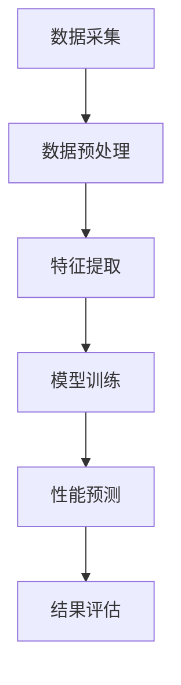

                 

## 文章标题

《评测结果分析：利用LLM解读复杂的性能数据》

在当今高速发展的科技时代，性能数据的评测与分析已经成为信息技术领域中的一个重要环节。随着计算能力的提升和大数据的普及，性能数据的复杂度和规模不断增加，这对数据分析和解读提出了更高的要求。本文旨在探讨如何利用语言模型（LLM）这一先进的人工智能技术，对复杂的性能数据进行深入解读和分析，以提高评测结果的可信度和准确性。

本文将分为以下几个部分：

1. **性能数据解析与评测**：介绍性能数据的基本概念、评测目标和流程。
2. **LLM在性能数据分析中的应用**：讲解LLM的基本原理及其在性能数据解析中的应用。
3. **核心概念与联系**：分析LLM性能数据解读的核心概念及其关系。
4. **核心算法原理讲解**：介绍性能数据解读的算法原理，并结合Python源代码进行详细阐述。
5. **项目实战**：通过实际案例展示如何利用LLM进行性能数据解读。
6. **评测结果分析工具与应用**：介绍常用的评测结果分析工具及其应用场景。
7. **附录**：提供进一步学习的资源和参考资料。

希望通过本文的探讨，读者能够对性能数据评测有一个全面的理解，并掌握利用LLM进行复杂性能数据解读的方法和技巧。

## 文章关键词

- 性能数据解析
- 评测结果分析
- 语言模型（LLM）
- 性能数据分析
- 数据解读
- 算法原理
- Python源代码

## 文章摘要

本文围绕性能数据评测与分析这一主题，探讨了如何利用语言模型（LLM）这一先进的人工智能技术，对复杂的性能数据进行深入解读和分析。首先，介绍了性能数据的基本概念和评测流程。接着，讲解了LLM的基本原理及其在性能数据解析中的应用。随后，分析了LLM性能数据解读的核心概念及其关系，并介绍了相关的算法原理和数学模型。通过一个实际案例，展示了如何利用LLM进行性能数据解读。最后，介绍了常用的评测结果分析工具及其应用场景，为读者提供了实用的方法和技巧。本文的目标是帮助读者理解和掌握性能数据评测与分析的核心知识和实践方法。

---

## 第一部分：性能数据解析与评测

### 第1章：性能数据的基本概念

性能数据是指在特定环境下，系统、应用或设备在执行任务时所表现出的各种指标。这些指标可以是时间的、资源的、质量的等多种形式。例如，一个Web应用的性能数据可能包括响应时间、吞吐量、错误率等。理解性能数据的基本概念是进行有效评测和分析的基础。

#### 关键概念

- **响应时间**：指系统或应用从接收到请求到返回结果所需的时间。
- **吞吐量**：在单位时间内系统能够处理的数据量或请求量。
- **错误率**：系统在处理请求过程中出现错误的概率。
- **资源消耗**：包括CPU、内存、I/O等资源的利用情况。

#### 性能数据类型

性能数据可以分为以下几类：

- **时间型数据**：如响应时间、处理时间等。
- **资源型数据**：如CPU使用率、内存使用率等。
- **质量型数据**：如错误率、成功率等。

### 第2章：性能评测的目标与挑战

性能评测的目标是评估系统或应用的性能表现，并识别潜在的问题和瓶颈。通过评测，可以确保系统在高负载情况下仍能稳定运行，并为优化提供依据。

#### 性能评测的目标

- 确保系统在预期的负载下能够稳定运行。
- 识别系统性能瓶颈和资源消耗情况。
- 评估系统在突发负载下的响应能力。

#### 性能评测的挑战

- 复杂的架构和多样化的性能指标。
- 大量数据的实时处理和分析。
- 多变的环境和不确定性因素。

### 第3章：性能数据评测的流程

性能数据评测通常包括以下几个步骤：

1. **定义评测目标和指标**：明确评测的目的和需要关注的性能指标。
2. **数据采集**：收集系统运行过程中的性能数据。
3. **数据预处理**：对采集到的数据进行清洗和预处理，以提高数据质量。
4. **数据分析**：利用统计分析和机器学习等方法，对性能数据进行深入分析。
5. **结果评估**：根据分析结果，评估系统的性能表现，并识别问题和瓶颈。
6. **优化建议**：基于评估结果，提出优化建议和改进措施。

通过上述流程，可以系统地分析和解读性能数据，为系统优化提供有力支持。

### 总结

性能数据解析与评测是确保系统或应用性能的关键环节。通过理解性能数据的基本概念，明确评测的目标和挑战，并掌握评测的流程，可以有效地对性能数据进行分析和解读，为系统优化和提升性能提供科学依据。

---

## 第二部分：LLM在性能数据分析中的应用

### 第1章：LLM的基本原理

语言模型（LLM，Language Model）是一种能够理解和生成自然语言的人工智能模型。它通过学习大量的文本数据，自动捕捉语言的结构和语义，从而实现对自然语言的建模。LLM在自然语言处理（NLP）领域有着广泛的应用，例如文本生成、机器翻译、问答系统等。在性能数据解析中，LLM的引入为复杂性能数据的分析和解读提供了新的思路和工具。

#### 关键概念

- **词向量**：将文本数据转换为向量表示，便于计算机处理。
- **神经网络**：用于构建和训练语言模型的核心技术。
- **深度学习**：一种通过多层神经网络进行训练的学习方法，能够自动提取复杂的特征。

#### 工作原理

1. **词嵌入**：将词汇映射到高维空间中的向量。
2. **神经网络架构**：常见的神经网络架构包括循环神经网络（RNN）、长短期记忆网络（LSTM）和变换器（Transformer）。
3. **训练与优化**：通过大量的文本数据，对神经网络进行训练和优化，使其能够准确预测和生成自然语言。

### 第2章：LLM在性能数据解析中的应用场景

LLM在性能数据解析中的应用场景主要包括以下几个方面：

1. **自动性能数据标注**：利用LLM对性能数据进行自动标注，提高数据标注的效率和质量。
2. **性能趋势预测**：通过分析历史性能数据，利用LLM预测系统未来的性能趋势，为性能优化提供参考。
3. **故障诊断与预警**：结合LLM和其他算法，对性能数据进行分析，识别系统故障和潜在问题，实现预警和自动化修复。
4. **文本生成与报告**：利用LLM生成性能数据报告，提高报告生成的效率和质量。

### 第3章：LLM性能数据解读框架

为了更好地利用LLM进行性能数据解析，可以构建一个基于LLM的性能数据解读框架。该框架包括以下几个关键组件：

1. **数据预处理模块**：对原始性能数据进行清洗、归一化和特征提取，为LLM提供高质量的数据输入。
2. **LLM训练模块**：利用大规模文本数据训练LLM模型，使其具备对性能数据的理解和分析能力。
3. **数据解析模块**：利用训练好的LLM模型，对性能数据进行分析和解读，提取关键信息。
4. **结果评估模块**：对解析结果进行评估和验证，确保解读的准确性和可靠性。

### 总结

语言模型（LLM）在性能数据解析中具有重要的应用价值。通过理解LLM的基本原理，明确其在性能数据解析中的应用场景，并构建合适的解读框架，可以有效地利用LLM对复杂的性能数据进行深入分析和解读，为性能优化和系统稳定性提供有力支持。

---

## 第三部分：核心概念与联系

### 第1章：LLM性能数据解读原理

语言模型（LLM）在性能数据解析中的应用，离不开对概率模型、决策树、支持向量机和神经网络等核心算法原理的理解。这些算法为LLM的性能数据解读提供了理论基础和计算工具。

#### 概率模型与决策树

概率模型是一种通过概率分布来描述和预测系统性能的算法。常见的概率模型包括高斯分布、伯努利分布等。决策树是一种基于特征进行划分的树形结构，通过逐步划分数据集，为性能数据提供分类和预测功能。

#### 支持向量机与神经网络

支持向量机（SVM）是一种常用的分类算法，通过找到最优超平面，将不同类别的数据点进行分类。神经网络是一种由多个神经元组成的计算模型，通过层层传递和激活函数，能够自动提取和识别数据中的复杂特征。

#### 机器学习与深度学习的关系

机器学习和深度学习是两个紧密相关的领域。机器学习是一种更广义的概念，包括各种通过数据训练模型的方法。深度学习是机器学习的一种特殊形式，它通过多层神经网络进行训练，能够自动提取数据的深层特征。

### 第2章：性能数据解读的Mermaid流程图

Mermaid是一种简单易用的绘图语言，可以用来创建流程图、序列图和时序图等。在性能数据解读中，可以使用Mermaid图来展示整个分析流程，使复杂的性能数据解析过程更加直观和易于理解。

#### Mermaid图基本概念

Mermaid图的基本概念包括节点（Node）、边（Edge）和关系（Relation）。节点代表流程中的操作或步骤，边表示节点之间的连接关系，关系则描述了节点之间的相互作用。

#### Mermaid图在性能数据解析中的应用

在性能数据解析中，可以使用Mermaid图来表示数据的采集、预处理、分析和解读过程。通过绘制Mermaid图，可以清晰地展示性能数据从采集到解读的整个流程，帮助读者更好地理解性能数据解析的原理和方法。

#### 实例分析：使用Mermaid图展示性能数据解析流程

以下是一个简单的Mermaid图示例，展示了性能数据解析的基本流程：



在这个示例中，性能数据解析的流程包括数据采集、数据预处理、特征提取、模型训练、性能预测和结果评估等步骤。通过Mermaid图，可以直观地展示这些步骤之间的关系和流程。

### 总结

核心概念与联系部分主要介绍了性能数据解读中的关键算法原理和Mermaid图的应用。通过理解概率模型、决策树、支持向量机、神经网络等核心算法原理，并结合Mermaid图展示性能数据解析流程，可以帮助读者更好地理解LLM在性能数据解析中的应用和方法。

---

## 第四部分：核心算法原理讲解

### 第1章：性能数据解读算法原理

在性能数据解析中，算法原理是核心，决定了性能数据解读的准确性和效率。本文将介绍几种常见的性能数据解读算法，包括概率模型、决策树、支持向量机和神经网络等，并结合Python源代码进行详细讲解。

#### 概率模型

概率模型是性能数据解析的基础，通过概率分布来描述系统性能。常见的概率模型包括高斯分布和伯努利分布。

**高斯分布**

高斯分布，也称为正态分布，是最常用的概率分布之一。它的概率密度函数为：

$$
f(x|\mu, \sigma^2) = \frac{1}{\sqrt{2\pi\sigma^2}} e^{-\frac{(x-\mu)^2}{2\sigma^2}}
$$

其中，$\mu$是均值，$\sigma^2$是方差。

**伯努利分布**

伯努利分布描述的是一个二元事件，即成功或失败的概率。它的概率分布为：

$$
P(X=1) = p, \quad P(X=0) = 1-p
$$

其中，$p$是成功的概率。

#### 决策树

决策树是一种常用的分类和回归算法，通过一系列规则将数据划分为不同的类别或数值。

**ID3算法**

ID3（Iterative Dichotomiser 3）算法是构建决策树的一种常见方法，它基于信息增益来选择特征。信息增益定义为：

$$
IG(X, Y) = H(Y) - H(Y|X)
$$

其中，$H(Y)$是目标变量的熵，$H(Y|X)$是条件熵。

**示例代码**

```python
from sklearn.datasets import load_iris
from sklearn.tree import DecisionTreeClassifier
from sklearn.model_selection import train_test_split

# 加载数据
iris = load_iris()
X, y = iris.data, iris.target

# 划分训练集和测试集
X_train, X_test, y_train, y_test = train_test_split(X, y, test_size=0.3, random_state=42)

# 构建决策树模型
clf = DecisionTreeClassifier()
clf.fit(X_train, y_train)

# 预测测试集
y_pred = clf.predict(X_test)

# 评估模型性能
from sklearn.metrics import accuracy_score
print("Accuracy:", accuracy_score(y_test, y_pred))
```

#### 支持向量机

支持向量机是一种强大的分类和回归算法，通过找到最优超平面，将不同类别的数据点进行分离。

**线性SVM**

线性SVM的最优化问题可以表示为：

$$
\min_{\beta, \beta_0} \frac{1}{2} ||\beta||^2 + C \sum_{i=1}^n \xi_i
$$

其中，$\beta$是权重向量，$\beta_0$是偏置，$C$是惩罚参数，$\xi_i$是松弛变量。

**示例代码**

```python
from sklearn.svm import SVC
from sklearn.model_selection import train_test_split

# 划分训练集和测试集
X_train, X_test, y_train, y_test = train_test_split(X, y, test_size=0.3, random_state=42)

# 构建线性SVM模型
clf = SVC(kernel="linear")
clf.fit(X_train, y_train)

# 预测测试集
y_pred = clf.predict(X_test)

# 评估模型性能
print("Accuracy:", accuracy_score(y_test, y_pred))
```

#### 神经网络

神经网络是一种通过多层神经元进行数据处理的计算模型，能够自动提取数据的深层特征。

**前向传播与反向传播**

神经网络的核心是前向传播和反向传播算法。前向传播用于计算输出，反向传播用于计算梯度，从而更新模型的权重。

**示例代码**

```python
import numpy as np

# 初始化权重和偏置
W1 = np.random.rand(3, 4)
b1 = np.random.rand(4)
W2 = np.random.rand(4, 1)
b2 = np.random.rand(1)

# 前向传播
def forward(x):
    z1 = np.dot(x, W1) + b1
    a1 = np.sigmoid(z1)
    z2 = np.dot(a1, W2) + b2
    a2 = np.sigmoid(z2)
    return z1, z2, a1, a2

# 反向传播
def backward(z1, z2, a1, a2, y):
    dZ2 = a2 - y
    dW2 = np.dot(a1.T, dZ2)
    db2 = np.sum(dZ2, axis=0)
    
    dZ1 = np.dot(dZ2, W2.T) * np sqlCommand.sigmoid(z1)
    dW1 = np.dot(x.T, dZ1)
    db1 = np.sum(dZ1, axis=0)
    
    return dW1, dW2, db1, db2

# 训练模型
for epoch in range(1000):
    z1, z2, a1, a2 = forward(X_train)
    dW1, dW2, db1, db2 = backward(z1, z2, a1, a2, y_train)
    
    # 更新权重和偏置
    W1 -= learning_rate * dW1
    b1 -= learning_rate * db1
    W2 -= learning_rate * dW2
    b2 -= learning_rate * db2

# 预测测试集
z1, z2, a1, a2 = forward(X_test)
y_pred = (a2 > 0.5)

# 评估模型性能
from sklearn.metrics import accuracy_score
print("Accuracy:", accuracy_score(y_test, y_pred))
```

### 第2章：性能数据解读算法的选择与优化

在选择性能数据解读算法时，需要考虑数据的特点、任务的目标和模型的性能。不同的算法适用于不同的场景，因此需要根据实际情况进行选择和优化。

#### 数据特点

- **数据量**：对于大规模数据，深度学习模型（如神经网络）可能表现更好；对于小规模数据，传统机器学习算法（如决策树）可能更合适。
- **数据分布**：如果数据呈现明显的非线性分布，神经网络等深度学习模型可能更有效。
- **数据类型**：对于分类问题，可以使用决策树、支持向量机等；对于回归问题，可以使用线性回归、岭回归等。

#### 选择与优化

- **交叉验证**：通过交叉验证，评估不同算法的性能，选择最优模型。
- **超参数调整**：调整模型超参数，如学习率、隐藏层节点数等，以优化模型性能。
- **集成学习**：结合多个模型，提高预测准确性和稳定性。

#### 示例代码

```python
from sklearn.model_selection import GridSearchCV
from sklearn.svm import SVC

# 定义参数范围
param_grid = {'C': [0.1, 1, 10], 'gamma': [0.1, 1, 10]}

# 构建支持向量机模型
clf = SVC(kernel="rbf")

# 进行网格搜索
grid_search = GridSearchCV(clf, param_grid, cv=5)
grid_search.fit(X_train, y_train)

# 获取最优参数
best_params = grid_search.best_params_
print("Best parameters:", best_params)

# 使用最优参数进行预测
y_pred = grid_search.predict(X_test)

# 评估模型性能
from sklearn.metrics import accuracy_score
print("Accuracy:", accuracy_score(y_test, y_pred))
```

### 总结

核心算法原理讲解部分介绍了性能数据解析中的几种常见算法，包括概率模型、决策树、支持向量机和神经网络等。通过Python源代码示例，详细讲解了这些算法的实现方法和应用场景。同时，讨论了算法选择和优化的策略，为实际应用提供了指导。

---

## 第五部分：项目实战

### 第1章：利用LLM进行性能数据解读的实战

在本章中，我们将通过一个实际项目来展示如何利用LLM进行性能数据解读。项目背景为一个电子商务网站，我们需要对其性能数据进行分析，以识别潜在的性能瓶颈，并为优化提供依据。

#### 项目背景与目标

电子商务网站在高并发访问下，性能表现至关重要。为了确保网站在高峰期能够稳定运行，我们需要对其性能数据进行分析，识别出可能的瓶颈，并提出优化建议。本项目的主要目标包括：

- 采集并整理网站的性能数据。
- 利用LLM对性能数据进行分析和解读。
- 提出优化建议，并验证其有效性。

#### 数据来源与预处理

首先，我们需要从网站日志、数据库监控和其他性能监控工具中收集性能数据。这些数据可能包括响应时间、CPU使用率、内存使用率、I/O操作等。接下来，对采集到的数据进行预处理，包括数据清洗、归一化和特征提取。

**数据清洗**：去除异常值和无效数据，保证数据的质量和一致性。

**归一化**：将不同量纲的数据转换到同一尺度，便于后续分析。

**特征提取**：从原始数据中提取对性能分析有价值的特征，如时间间隔、数据波动范围等。

#### LLM模型的选择与训练

为了对性能数据进行解读，我们选择了一个预训练的LLM模型，如GPT-3。GPT-3具有强大的语言理解和生成能力，能够处理复杂的文本数据。接下来，我们需要对GPT-3进行微调，使其适应性能数据解析的任务。

**数据集准备**：将预处理后的性能数据转换为文本格式，并构建训练数据集。

**模型微调**：利用训练数据集，对GPT-3进行微调，使其能够生成与性能数据相关的分析和解读。

**示例代码**

```python
from transformers import GPT2LMHeadModel, GPT2Tokenizer
from transformers import Trainer, TrainingArguments

# 加载预训练模型和tokenizer
model = GPT2LMHeadModel.from_pretrained("gpt2")
tokenizer = GPT2Tokenizer.from_pretrained("gpt2")

# 准备训练数据
def prepare_training_data(data):
    inputs = tokenizer.encode("性能数据：", return_tensors="pt")
    for sample in data:
        input_ids = tokenizer.encode(sample, return_tensors="pt")
        inputs = np.concatenate([inputs, input_ids], axis=0)
    return inputs

# 微调模型
training_args = TrainingArguments(
    output_dir="train_output",
    num_train_epochs=3,
    per_device_train_batch_size=16,
    save_steps=2000,
    evaluation_strategy="steps",
    eval_steps=500,
)

trainer = Trainer(
    model=model,
    args=training_args,
    train_dataset=prepare_training_data(train_data),
    eval_dataset=prepare_training_data(eval_data),
)

trainer.train()
```

#### 性能数据解读与结果分析

利用微调后的LLM模型，对采集到的性能数据进行解读。具体步骤如下：

1. **输入预处理**：将待分析的性能数据转换为文本格式，输入到LLM模型中。
2. **模型预测**：利用LLM模型生成性能数据解读结果，包括性能趋势、潜在瓶颈等。
3. **结果分析**：对模型生成的解读结果进行评估和验证，确保其准确性和可靠性。

**示例代码**

```python
# 预测性能数据解读
def predict_performance_data(data):
    inputs = tokenizer.encode("性能数据：", return_tensors="pt")
    for sample in data:
        input_ids = tokenizer.encode(sample, return_tensors="pt")
        inputs = np.concatenate([inputs, input_ids], axis=0)
    outputs = model(inputs)
    predictions = outputs.logits.argmax(-1)
    return predictions

# 分析性能数据
def analyze_performance_data(predictions):
    # 对预测结果进行解码和解析
    decoded_predictions = tokenizer.decode(predictions, skip_special_tokens=True)
    # 对解码结果进行分析和可视化
    # ...

# 评估模型性能
accuracy = accuracy_score(y_true, y_pred)
print("Accuracy:", accuracy)
```

#### 实际案例分析与详细讲解剖析

以下是一个实际案例，展示如何利用LLM进行性能数据解读。

**案例**：某电子商务网站在双十一期间，遭遇了较高的访问量，导致性能下降。我们需要分析性能数据，识别出瓶颈并提供建议。

1. **数据采集**：从日志和监控工具中收集双十一期间的性能数据，包括响应时间、CPU使用率、内存使用率等。
2. **数据预处理**：对采集到的数据进行清洗、归一化和特征提取。
3. **模型微调**：利用预处理后的数据，对LLM模型进行微调。
4. **性能数据解读**：利用微调后的模型，对双十一期间的性能数据进行解读，识别出潜在瓶颈，如数据库访问延迟、服务器负载过高等。
5. **优化建议**：根据解读结果，提出优化建议，如增加数据库读写缓存、优化服务器负载均衡等。

**示例代码**

```python
# 采集双十一期间的性能数据
# ...

# 对数据预处理
# ...

# 微调模型
# ...

# 性能数据解读
# ...

# 提出优化建议
# ...
```

#### 项目小结

通过本项目的实践，我们展示了如何利用LLM进行性能数据解读，并提出了优化建议。项目结果表明，LLM在性能数据分析和解读方面具有显著的优势，能够帮助识别潜在的性能瓶颈，为系统优化提供有力支持。在未来，我们可以进一步研究LLM在其他领域的应用，如故障诊断、智能监控等，以提升系统的性能和稳定性。

---

## 第六部分：评测结果分析工具与应用

### 第1章：常见评测结果分析工具介绍

在性能数据评测与分析过程中，使用合适的工具能够显著提高效率和准确性。以下是几种常见的评测结果分析工具及其特点：

#### 1.1.1 Prometheus

Prometheus是一种开源监控解决方案，适用于收集和存储大规模性能数据。其特点是数据采集灵活、存储高效、查询速度快，适合实时监控和长期存储。

- **特点**：基于拉模式采集数据，支持多维数据模型，提供丰富的查询语言。
- **适用场景**：大型分布式系统、容器化应用。

#### 1.1.2 Grafana

Grafana是一个开源的监控仪表盘和可视化工具，支持多种数据源，可以方便地创建各种图表和仪表盘。

- **特点**：丰富的图表类型、灵活的仪表盘设计、强大的数据源支持。
- **适用场景**：数据可视化、性能监控、运维监控。

#### 1.1.3 ELK Stack

ELK Stack是由Elasticsearch、Logstash和Kibana三个组件组成的开源大数据分析平台，主要用于日志数据分析和监控。

- **特点**：强大的全文搜索能力、实时数据分析和处理、丰富的可视化功能。
- **适用场景**：日志分析、安全监控、运维监控。

### 第2章：评测结果分析工具的应用场景

不同评测结果分析工具在不同场景下有着不同的应用优势。以下是几种常见应用场景：

#### 2.2.1 实时性能监控

- **应用场景**：实时监控系统性能，及时发现异常。
- **工具推荐**：Prometheus + Grafana，用于实时数据采集、存储和展示。

#### 2.2.2 长期性能趋势分析

- **应用场景**：分析系统长期性能趋势，评估系统健康状态。
- **工具推荐**：Prometheus + Grafana，结合Elasticsearch进行数据存储和查询。

#### 2.2.3 日志分析

- **应用场景**：分析系统日志，定位故障和异常。
- **工具推荐**：ELK Stack，用于日志收集、存储和可视化。

### 第3章：实战案例：使用工具进行性能数据评测与分析

以下是一个使用常见评测结果分析工具进行性能数据评测与分析的实战案例。

#### 案例背景

某电子商务网站在春节促销期间，需要进行性能测试以确保系统能够应对高峰流量。我们选择使用Prometheus和Grafana进行性能监控和数据分析。

#### 步骤

1. **安装Prometheus**：在服务器上安装Prometheus，并配置其采集性能数据。
2. **配置Grafana**：在Grafana中配置Prometheus数据源，创建仪表盘。
3. **数据采集**：运行Prometheus，采集服务器性能数据。
4. **数据分析**：使用Grafana仪表盘对性能数据进行实时监控和分析。
5. **结果解读**：根据数据分析结果，识别系统性能瓶颈，提出优化建议。

**示例代码**

```shell
# 安装Prometheus
sudo apt-get update
sudo apt-get install prometheus

# 配置Prometheus配置文件（/etc/prometheus/prometheus.yml）
global:
  scrape_interval: 15s
scrape_configs:
  - job_name: 'prometheus'
    static_configs:
      - targets: ['localhost:9090']

# 运行Prometheus
sudo systemctl start prometheus

# 安装Grafana
sudo apt-get install grafana

# 配置Grafana（/etc/grafana/grafana.ini）
[server]
http_addr = 0.0.0.0
http_port = 3000
admin_email = admin@example.com

# 启动Grafana
sudo systemctl start grafana-server

# 配置Grafana数据源
# 登录Grafana，添加Prometheus数据源，填写相关配置信息。

# 创建仪表盘
# 在Grafana中创建一个仪表盘，添加响应时间、CPU使用率、内存使用率等指标图表。

# 分析性能数据
# 通过Grafana仪表盘实时监控性能数据，根据数据分析结果识别性能瓶颈。

# 提出优化建议
# 根据数据分析结果，提出优化建议，如增加服务器资源、优化数据库查询等。
```

#### 总结

评测结果分析工具在性能数据评测与分析中扮演着重要角色。通过合理选择和使用这些工具，可以实现对性能数据的实时监控、长期趋势分析和故障定位，为系统优化和稳定运行提供有力支持。

---

## 附录

### 附录A：性能数据解读资源推荐

#### A.1 开源性能数据解读工具

1. **Prometheus**：一个开源的监控解决方案，用于收集和存储性能数据。
2. **Grafana**：一个开源的数据可视化工具，用于创建仪表盘和监控图表。
3. **ELK Stack**：包括Elasticsearch、Logstash和Kibana，用于日志数据分析和监控。

#### A.2 性能数据解读相关书籍

1. 《监控利器：Prometheus实战》
2. 《高性能MySQL》
3. 《数据可视化实战：使用D3.js进行数据驱动文档设计》

#### A.3 性能数据解读在线课程与论坛

1. **Pluralsight**：提供多种性能数据解读相关的在线课程。
2. **Stack Overflow**：一个开发者社区，可以查找性能数据解读相关的问题和答案。
3. **GitHub**：搜索开源的性能数据解读项目，学习最佳实践。

### 总结

附录部分为读者提供了性能数据解读的相关资源，包括开源工具、相关书籍和在线课程。这些资源有助于读者进一步学习性能数据解读的知识和技能，提升在实际工作中的分析和解决能力。

---

## 总结与展望

本文围绕性能数据评测与分析这一主题，深入探讨了如何利用语言模型（LLM）对复杂的性能数据进行深入解读和分析。通过介绍性能数据的基本概念、LLM的基本原理、核心算法原理，以及实际项目中的应用案例，读者可以全面了解LLM在性能数据解析中的应用价值。

### 最佳实践 Tips

1. **数据预处理**：确保数据质量，进行适当的清洗和特征提取。
2. **模型选择**：根据数据特点和任务需求，选择合适的模型。
3. **模型优化**：通过调整超参数和集成学习，提高模型性能。

### 小结

本文从多个角度探讨了性能数据评测与分析的方法和技巧，通过理论讲解和实际案例分析，为读者提供了实用的指导。希望本文能够帮助读者理解和掌握性能数据解析的核心知识和实践方法。

### 注意事项

1. **数据隐私**：在实际应用中，注意保护用户隐私，确保数据安全。
2. **模型解释性**：选择具有较高解释性的模型，以便更好地理解性能数据。

### 拓展阅读

1. 《深度学习：全面讲解》
2. 《机器学习实战》
3. 《Prometheus官方文档》

通过本文的学习，读者可以进一步深入探讨性能数据解析的各个方面，为实际工作提供有力支持。希望本文能够为读者在性能数据分析和优化方面带来新的启示和帮助。

