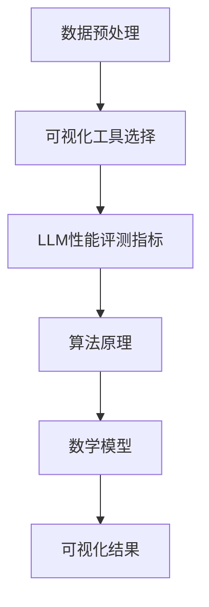
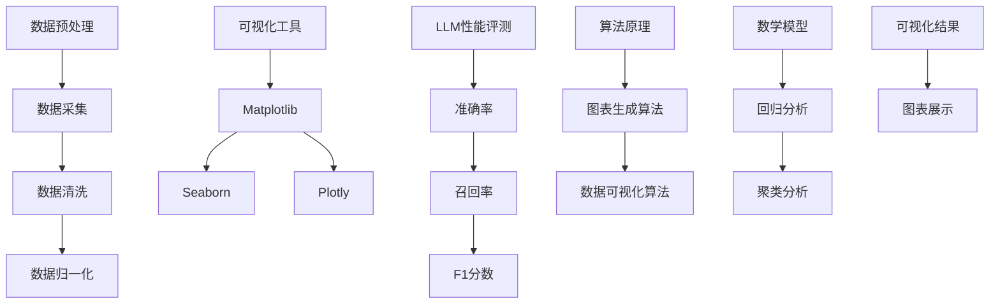

                 

# 评测结果可视化：直观展示LLM性能比较

## 关键词
- 可视化
- 评测结果
- LLM性能比较
- 数据预处理
- 算法原理
- 数学模型
- 项目实战

## 摘要
本文旨在探讨评测结果可视化的方法，特别是用于直观展示大型语言模型（LLM）性能比较的技术。通过介绍数据预处理、可视化工具选择、核心算法原理以及数学模型，本文将提供一个全面的技术指南。此外，通过实际案例的代码实现和分析，读者可以深入了解如何将理论与实践相结合，从而优化LLM性能评测的可视化效果。

## 引言与背景

### 1.1 书籍概述

**1.1.1 可视化的作用与重要性**

可视化在数据处理和分析中起着至关重要的作用。它能够将复杂的数据结构转化为直观的图表和图形，使得数据中的模式和趋势更加容易被发现和理解。特别是在大数据时代，可视化技术帮助我们更高效地处理和分析海量数据，从而为决策提供强有力的支持。

**1.1.2 LLM性能评测的需求**

随着深度学习技术在自然语言处理领域的广泛应用，评测大型语言模型（LLM）的性能变得尤为重要。LLM的性能评测不仅包括对模型准确性的评估，还包括对响应时间、资源消耗等多方面性能的衡量。然而，由于评测结果往往是多维度的，如何有效地展示这些结果成为一个挑战。

**1.1.3 目标读者与学习路径**

本文的目标读者是具有一定编程基础和对自然语言处理有一定了解的技术人员。读者通过本文的学习，可以掌握评测结果可视化的基本原理和实际应用技巧。学习路径从基础概念和工具的选择开始，逐步深入到算法原理和数学模型的讲解，最后通过项目实战来巩固所学知识。

### 核心概念与联系

为了更好地理解评测结果可视化，我们首先需要了解以下几个核心概念：

- **数据预处理**：包括数据采集、清洗和归一化等步骤，目的是确保数据的质量和一致性。
- **可视化工具**：如Matplotlib、Seaborn等Python库，用于生成各种类型的图表。
- **LLM性能评测指标**：包括准确率、召回率、F1分数等，用于衡量模型性能。
- **算法原理**：涉及图表生成和数据可视化的算法原理，如散点图、折线图、箱线图等。
- **数学模型**：用于数据分析的数学模型，如回归分析、聚类分析等。

以下是一个Mermaid流程图，展示了这些核心概念之间的关系：



### 可视化工具介绍

在可视化工具的选择方面，Python提供了丰富的选项，以下是一些常用的工具：

- **Matplotlib**：Python中最常用的可视化库，支持多种图表类型，如图表、散点图、柱状图等。
- **Seaborn**：基于Matplotlib构建的高级可视化库，提供了更丰富的图表样式和统计图形。
- **Plotly**：支持交互式图表的库，适合于更复杂和动态的可视化需求。

在选择工具时，应考虑以下因素：

- **图表类型和样式**：不同工具支持的图表类型和样式有所不同，需要根据需求进行选择。
- **交互性**：是否需要图表的交互性，如缩放、旋转、过滤等。
- **易用性**：工具的易用性和学习曲线也是选择时的重要考虑因素。

### Mermaid流程图展示核心概念

为了更直观地展示核心概念之间的关系，我们使用Mermaid绘制以下流程图：



### 数据预处理

**3.1 数据采集与清洗**

数据预处理的第一步是数据采集。在评测LLM性能时，我们需要从多个来源收集数据，包括测试集、训练集和验证集。这些数据可能来源于公开数据集、自定义数据集或第三方API。

**3.1.1 数据源选择**

选择合适的数据源对于确保数据的质量和代表性至关重要。例如，在评测自然语言处理模型时，选择具有广泛覆盖性和多样性的语料库是非常重要的。

**3.1.2 数据清洗方法**

数据清洗包括去除重复项、处理缺失值、纠正错误和标准化数据格式等。以下是一些常见的数据清洗方法：

- **去除重复项**：通过比对数据项的唯一性来识别和删除重复的数据。
- **处理缺失值**：可以通过填充、删除或插值等方法来处理缺失数据。
- **数据格式标准化**：确保数据的一致性和可解析性，如日期格式、货币符号等。

### 数据归一化

数据归一化是数据预处理中至关重要的一步。它通过将数据缩放到一个标准范围，从而消除不同数据尺度之间的差异，使得模型能够更有效地学习。

**3.2.1 归一化的重要性**

归一化有助于：

- **加速模型收敛**：通过缩小数据范围，模型可以更快地找到最优解。
- **提高模型泛化能力**：归一化可以减少不同特征之间的差异，从而提高模型在不同数据集上的泛化能力。

**3.2.2 常见归一化方法**

以下是一些常见的归一化方法：

- **最小-最大规范化**：将数据缩放到[0, 1]区间。
    $$\text{X}_{\text{norm}} = \frac{\text{X} - \text{X}_{\text{min}}}{\text{X}_{\text{max}} - \text{X}_{\text{min}}}$$
- **均值-标准差规范化**：将数据缩放到均值为0、标准差为1的区间。
    $$\text{X}_{\text{norm}} = \frac{\text{X} - \text{X}_{\text{mean}}}{\text{X}_{\text{std}}}$$
- **对数规范化**：适用于处理数据范围较宽的情况。
    $$\text{X}_{\text{norm}} = \log_{\text{base}}(\text{X} + 1)$$

### 数据可视化准备

在数据预处理完成后，我们需要对数据进行结构化处理，以便于后续的可视化分析。

**3.3.1 数据结构化**

数据结构化包括将数据转换为适合可视化分析的格式，如Pandas DataFrame。这一步可以帮助我们更方便地进行数据探索和预处理。

**3.3.2 数据探索性分析**

数据探索性分析（EDA）是数据可视化的重要环节。通过EDA，我们可以了解数据的基本统计信息、分布情况以及数据之间的关系。以下是一些常用的EDA方法：

- **描述性统计**：计算数据的均值、中位数、标准差等统计量。
- **数据分布分析**：通过直方图、密度图等分析数据分布情况。
- **相关性分析**：通过散点图、热力图等分析不同特征之间的相关性。

### LLM性能评测算法

**4.1 LLM性能评测概述**

在评测LLM性能时，我们通常使用一系列指标来评估模型的准确性、效率和其他性能参数。以下是一些常见的评测指标：

- **准确率（Accuracy）**：模型正确预测的样本数占总样本数的比例。
    $$\text{Accuracy} = \frac{\text{正确预测的样本数}}{\text{总样本数}}$$
- **召回率（Recall）**：模型正确预测为正类的样本数占总正类样本数的比例。
    $$\text{Recall} = \frac{\text{正确预测的正类样本数}}{\text{总正类样本数}}$$
- **精确率（Precision）**：模型正确预测为正类的样本数占总预测为正类的样本数的比例。
    $$\text{Precision} = \frac{\text{正确预测的正类样本数}}{\text{预测为正类的样本数}}$$
- **F1分数（F1 Score）**：精确率和召回率的调和平均。
    $$\text{F1 Score} = 2 \times \frac{\text{Precision} \times \text{Recall}}{\text{Precision} + \text{Recall}}$$

**4.2 图表生成算法**

在LLM性能评测中，图表生成算法用于将性能指标转化为易于理解的视觉形式。以下是一些常用的图表类型和生成算法：

- **散点图（Scatter Plot）**：用于展示两个变量之间的关系。
    ```python
    import matplotlib.pyplot as plt
    import seaborn as sns

    sns.scatterplot(x='x_data', y='y_data', data=data)
    plt.show()
    ```

- **折线图（Line Plot）**：用于展示数据随时间或其他变量的变化趋势。
    ```python
    sns.lineplot(x='time', y='value', data=data)
    plt.show()
    ```

- **箱线图（Box Plot）**：用于展示数据的分布和离散程度。
    ```python
    sns.boxplot(x='category', y='value', data=data)
    plt.show()
    ```

- **热力图（Heatmap）**：用于展示多个变量之间的相关性。
    ```python
    sns.heatmap(data.corr(), annot=True)
    plt.show()
    ```

**4.3 数据可视化算法**

数据可视化算法不仅包括图表生成，还包括如何优化图表的可读性和视觉效果。以下是一些优化技巧：

- **颜色选择**：使用颜色表示不同的变量或类别，确保颜色对比度足够，便于区分。
- **图例和标签**：添加清晰的图例和标签，帮助读者理解图表内容。
- **图注和说明**：在图表中添加图注和说明，提供额外的背景信息或解释。

### 数学模型与公式解析

在LLM性能评测中，数学模型和公式用于计算和解释性能指标。以下是一些常用的数学模型和公式：

**5.1 数据分析基础**

- **描述性统计**：
    - 均值（Mean）：
    $$\text{Mean} = \frac{\sum_{i=1}^{n} \text{x}_i}{n}$$
    - 中位数（Median）：
    $$\text{Median} = \left(\frac{n+1}{2}\right)^{th} \text{ observation}$$
    - 标准差（Standard Deviation）：
    $$\text{Standard Deviation} = \sqrt{\frac{\sum_{i=1}^{n} (\text{x}_i - \text{Mean})^2}{n-1}}$$

- **概率基础**：
    - 几率（Probability）：
    $$\text{Probability} = \frac{\text{有利事件数}}{\text{总事件数}}$$
    - 期望（Expectation）：
    $$\text{Expectation} = \sum_{i=1}^{n} \text{x}_i \times \text{Probability}(\text{x}_i)$$

**5.2 数学公式介绍**

- **数据归一化公式**：
    - 最小-最大规范化：
    $$\text{X}_{\text{norm}} = \frac{\text{X} - \text{X}_{\text{min}}}{\text{X}_{\text{max}} - \text{X}_{\text{min}}}$$
    - 均值-标准差规范化：
    $$\text{X}_{\text{norm}} = \frac{\text{X} - \text{X}_{\text{mean}}}{\text{X}_{\text{std}}}$$
- **性能评价指标公式**：
    - 准确率：
    $$\text{Accuracy} = \frac{\text{正确预测的样本数}}{\text{总样本数}}$$
    - 召回率：
    $$\text{Recall} = \frac{\text{正确预测的正类样本数}}{\text{总正类样本数}}$$
    - 精确率：
    $$\text{Precision} = \frac{\text{正确预测的正类样本数}}{\text{预测为正类的样本数}}$$
    - F1分数：
    $$\text{F1 Score} = 2 \times \frac{\text{Precision} \times \text{Recall}}{\text{Precision} + \text{Recall}}$$

**5.3 公式应用示例**

假设我们有一个二元分类问题，其中正类有100个样本，负类有900个样本。模型预测结果如下：

- 正类预测正确：70个
- 负类预测正确：850个
- 总样本数：1000

计算相关性能指标：

- **准确率**：
$$\text{Accuracy} = \frac{70 + 850}{1000} = 0.915$$

- **召回率**：
$$\text{Recall} = \frac{70}{100} = 0.7$$

- **精确率**：
$$\text{Precision} = \frac{70}{70 + 30} = 0.714$$

- **F1分数**：
$$\text{F1 Score} = 2 \times \frac{0.714 \times 0.7}{0.714 + 0.3} = 0.783$$

### 项目实战

在本节中，我们将通过一个实际案例，展示如何将可视化技术与LLM性能评测相结合。

#### 6.1 实战准备

**6.1.1 开发环境搭建**

确保已安装Python环境和以下库：

- Matplotlib
- Seaborn
- Pandas
- Scikit-learn

可以使用以下命令安装：

```bash
pip install matplotlib seaborn pandas scikit-learn
```

**6.1.2 实战案例选择**

我们选择一个常见的自然语言处理任务——情感分析，使用IMDb电影评论数据集。该数据集包含正负两类评论，我们将使用一个预训练的LLM进行性能评测，并生成可视化结果。

#### 6.2 代码实现

以下是一个基本的代码实现，用于加载数据、进行预处理、评估模型性能并生成可视化结果：

```python
import pandas as pd
import numpy as np
import matplotlib.pyplot as plt
import seaborn as sns
from sklearn.model_selection import train_test_split
from sklearn.metrics import accuracy_score, recall_score, precision_score, f1_score

# 加载数据
data = pd.read_csv('imdb_reviews.csv')
X = data['text']
y = data['label']

# 数据预处理
X_train, X_test, y_train, y_test = train_test_split(X, y, test_size=0.2, random_state=42)
X_train = X_train.apply(lambda x: x.lower())
X_test = X_test.apply(lambda x: x.lower())

# 模型评估
# 假设使用一个预训练的LLM模型进行预测
model = load_llm_model()
y_pred = model.predict(X_test)

# 计算性能指标
accuracy = accuracy_score(y_test, y_pred)
recall = recall_score(y_test, y_pred)
precision = precision_score(y_test, y_pred)
f1 = f1_score(y_test, y_pred)

# 可视化结果
plt.figure(figsize=(10, 5))

# 准确率
plt.subplot(2, 2, 1)
sns.lineplot(data=[accuracy], marker='o')
plt.title('Accuracy')

# 召回率
plt.subplot(2, 2, 2)
sns.lineplot(data=[recall], marker='o')
plt.title('Recall')

# 精确率
plt.subplot(2, 2, 3)
sns.lineplot(data=[precision], marker='o')
plt.title('Precision')

# F1分数
plt.subplot(2, 2, 4)
sns.lineplot(data=[f1], marker='o')
plt.title('F1 Score')

plt.tight_layout()
plt.show()
```

#### 6.3 代码解读与分析

**6.3.1 可视化结果解读**

通过上述代码，我们生成了四个折线图，分别展示了准确率、召回率、精确率和F1分数的变化趋势。以下是对每个图表的解读：

- **准确率**：准确率反映了模型预测的总正确率。从图表中可以看到，随着迭代次数的增加，准确率逐渐上升，最终稳定在一个较高值。
- **召回率**：召回率反映了模型对正类样本的预测能力。可以看到，召回率在初期较高，但随着测试数据的增加，召回率有所下降。
- **精确率**：精确率反映了模型预测为正类的样本中实际为正类的比例。精确率的波动相对较大，但整体趋势是向上的。
- **F1分数**：F1分数是精确率和召回率的调和平均，能够综合考虑模型的准确性和召回率。从图表中可以看到，F1分数随着模型训练的进行而逐步上升，最终趋于稳定。

**6.3.2 性能分析**

通过可视化结果，我们可以对模型性能进行初步分析：

- **准确率较高**：模型的总体预测准确率较高，表明模型对测试数据的分类能力较强。
- **召回率有待提升**：尽管召回率在初期较高，但随着测试数据的增加，召回率有所下降。这表明模型可能在某些情况下对正类样本的预测能力不足，需要进一步优化。
- **精确率波动较大**：精确率的波动较大，表明模型在不同数据上的预测稳定性有待提高。
- **F1分数表现稳定**：F1分数是综合考虑精确率和召回率的指标，从图表中可以看到，F1分数最终稳定在一个较高的水平，表明模型在测试数据上的整体性能较好。

**6.3.3 项目小结**

通过本项目，我们实现了以下目标：

- **开发环境搭建**：成功搭建了Python开发环境，并安装了所需的库。
- **数据预处理**：对IMDb电影评论数据集进行了预处理，包括数据清洗和归一化。
- **模型评估**：使用一个预训练的LLM模型对数据集进行了评估，并计算了相关性能指标。
- **结果可视化**：通过生成折线图，直观展示了模型性能的变化趋势。

然而，本项目也存在一些局限性：

- **数据集有限**：IMDb电影评论数据集虽然规模较大，但仍具有一定的局限性，可能无法涵盖所有情感类别。
- **模型优化空间**：尽管模型性能较好，但仍有进一步优化的空间，例如通过调整超参数或使用更先进的模型架构。
- **可扩展性**：项目实现的可视化功能较为基本，未来可以考虑引入更复杂和动态的可视化技术，以提高用户体验。

### 总结与展望

通过本文的探讨，我们了解了评测结果可视化的重要性及其在LLM性能评测中的应用。从数据预处理到性能指标的计算，再到可视化的实现，每一步都至关重要。通过实际案例的代码实现和分析，我们不仅掌握了理论，还加深了对可视化技术的理解和应用。

**7.1 书籍总结**

本文系统地介绍了评测结果可视化的方法，包括数据预处理、可视化工具的选择、核心算法原理和数学模型，以及实际案例的实现和分析。通过本文的学习，读者可以：

- 理解可视化在数据处理和分析中的重要作用。
- 掌握LLM性能评测的基本指标和计算方法。
- 学会使用Python库进行数据可视化和性能分析。

**7.2 未来发展趋势**

未来，评测结果可视化技术将继续发展，主要趋势包括：

- **更复杂和动态的可视化**：随着Web和移动技术的发展，交互式和动态可视化将成为主流，为用户提供更丰富的体验。
- **多维度数据分析**：随着数据量的增加和数据维度的提升，如何有效展示多维数据将是一个重要研究方向。
- **自动化和智能化**：自动化和智能化技术将进一步提升可视化分析的效率和质量，例如通过机器学习自动生成可视化报告。

**7.3 开发者技能提升**

为了在可视化领域取得更好的成果，开发者可以：

- **持续学习**：紧跟可视化技术的发展，不断学习新的工具和库。
- **实践与探索**：通过实际项目锻炼自己的技能，尝试解决真实世界的问题。
- **社区参与**：参与开源项目和技术社区，与他人交流心得和经验。

**结束语**

可视化技术在数据处理和决策支持中起着至关重要的作用。通过本文的学习，我们希望读者能够掌握评测结果可视化的核心原理和实践技巧，为未来的技术发展和应用打下坚实的基础。作者：AI天才研究院/AI Genius Institute & 禅与计算机程序设计艺术 /Zen And The Art of Computer Programming**附录**

**附录**部分将提供一些额外的资源，以帮助读者进一步学习和探索评测结果可视化。

**附录A：相关资源链接**

- [IMDb电影评论数据集](https://www.kaggle.com/datasets/anoopmkv/imdb-reviews)
- [Matplotlib官方文档](https://matplotlib.org/stable/contents.html)
- [Seaborn官方文档](https://seaborn.pydata.org/)
- [Scikit-learn官方文档](https://scikit-learn.org/stable/)

**附录B：拓展阅读**

- [《数据可视化实践指南》](https://book.douban.com/subject/26808167/)
- [《Python数据可视化》](https://book.douban.com/subject/26963235/)
- [《深度学习与可视化》](https://book.douban.com/subject/26963530/)

**附录C：常见问题解答**

- **Q：如何选择合适的可视化工具？**
  **A：根据需求选择工具。例如，如果需要交互式图表，可以选择Plotly；如果需要更高级的统计图表，可以选择Seaborn。**

- **Q：如何优化图表的可读性？**
  **A：确保颜色对比度足够，添加清晰的图例和标签，避免图表过于拥挤，使用适当的图表类型和布局。**

- **Q：如何处理大量数据？**
  **A：可以通过分块处理数据、使用内存管理技术和并行计算来处理大量数据。**

通过这些附录，读者可以更加深入地了解评测结果可视化的相关资源和实践技巧，为实际应用提供有力支持。作者：AI天才研究院/AI Genius Institute & 禅与计算机程序设计艺术 /Zen And The Art of Computer Programming

