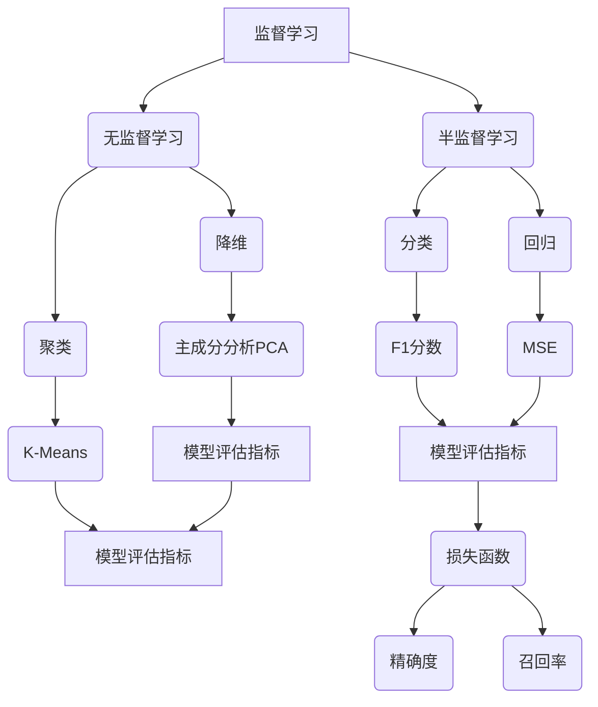
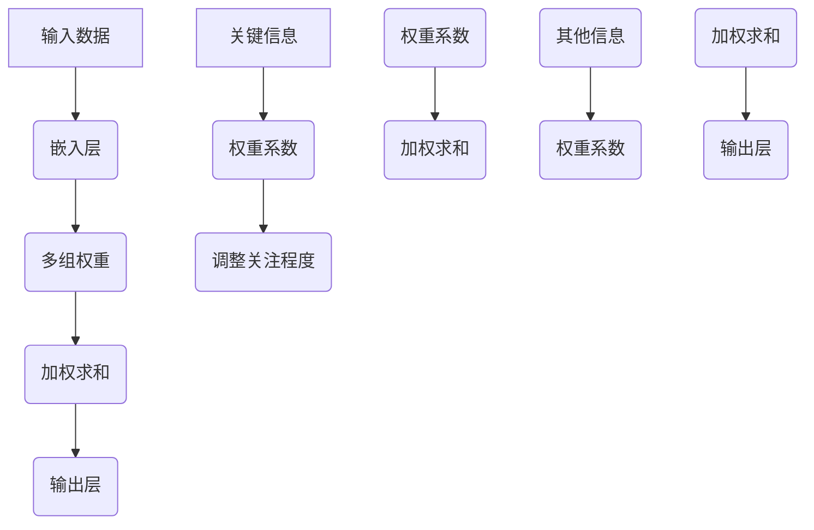
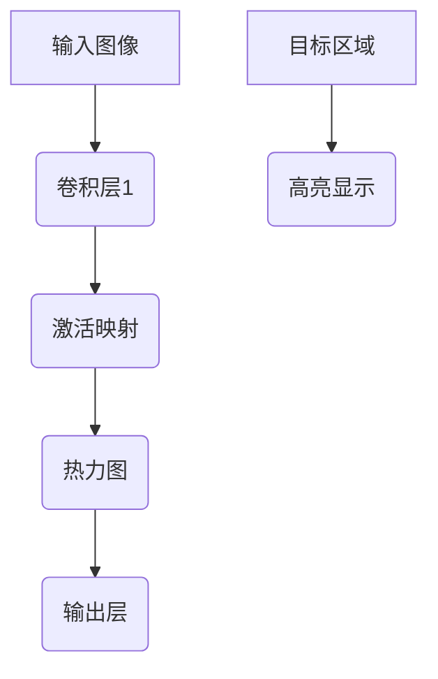

                 

### 评测结果可解释性的重要性

#### 引言

在当今机器学习和人工智能（AI）蓬勃发展的时代，模型评估是确保算法性能和有效性的关键步骤。然而，随着模型变得越来越复杂，尤其是像大型语言模型（LLM）这样的深度学习模型，评估结果的透明度和可解释性变得越来越重要。本篇文章将深入探讨评测结果可解释性的重要性，核心概念及其与LLM评估的紧密联系。

#### 评测结果可解释性的概念

**评测结果可解释性**指的是模型评估过程中能够被理解和解释的程度。它关注于评估过程中的每个步骤和参数，使得决策者能够了解模型是如何得出评估结果的。可解释性不仅包括模型对特定输入的响应，还涉及模型是如何从输入数据中学习，并最终做出预测的。

**可解释性在决策支持中的价值**

1. **信任和信任度**：当模型评估结果具有高可解释性时，决策者对模型输出结果的信任度会增加。这有助于减少模型产生的偏见和不确定性。
   
2. **错误识别和修正**：可解释性使得更容易识别模型的错误，进而进行修正和优化，提高模型的准确性和可靠性。

3. **用户参与**：可解释性允许用户参与到模型决策过程中，提高了模型的透明度和用户接受度。

#### LLMO概述与重要性

**LLMO（大型语言模型）**是近年来在自然语言处理（NLP）领域取得显著进展的模型。LLMO，如GPT-3、BERT等，具有数百万甚至数十亿个参数，能够进行复杂的语言理解和生成任务。LLM的高性能使得其在多个领域（如问答系统、文本生成、机器翻译等）取得了巨大成功。

**LLM的可解释性挑战**

尽管LLM在性能上取得了显著进展，但其内部工作机制的复杂性使得评估结果的解释变得异常困难。LLM通常被视为“黑箱”，其决策过程缺乏透明度，难以理解。

**LLM可解释性的重要性**

1. **安全性和伦理**：透明和可解释的LLM评估有助于识别潜在的安全风险和伦理问题，例如歧视、偏见和隐私侵犯。

2. **优化和改进**：理解LLM的评估过程有助于优化模型结构和参数设置，从而提高模型性能。

3. **用户信任**：可解释性提高了用户对LLM输出结果的信任度，有助于推动AI在更广泛的应用场景中落地。

综上所述，评测结果可解释性对于确保LLM评估的透明度和有效性至关重要。在接下来的章节中，我们将详细探讨机器学习模型的基本概念，以及提高模型可解释性的方法。

### 机器学习模型的基本概念

#### 机器学习基础

**机器学习（ML）**是人工智能（AI）的核心领域，其主要目标是通过数据来训练模型，使其能够对未知数据进行预测或决策。机器学习可以分为三种主要类型：监督学习、无监督学习和半监督学习。

1. **监督学习（Supervised Learning）**：
   监督学习是最常见的机器学习方法，其核心思想是通过已知输入和输出数据来训练模型。在监督学习中，模型从标记数据中学习，并使用这些学习到的模式来预测新数据的输出。常见的监督学习算法包括线性回归、逻辑回归、支持向量机（SVM）和神经网络等。

2. **无监督学习（Unsupervised Learning）**：
   无监督学习不依赖于标记数据，其主要目标是发现数据中的隐含结构和模式。常见的方法包括聚类（如K-Means、层次聚类）、降维（如主成分分析PCA）和关联规则学习（如Apriori算法）等。

3. **半监督学习（Semi-Supervised Learning）**：
   半监督学习结合了监督学习和无监督学习的特点，它使用少量标记数据和大量未标记数据来训练模型。这种方法可以显著提高模型的性能，特别是当标记数据获取成本很高时。

#### 线性模型和非线性模型

1. **线性模型（Linear Models）**：
   线性模型是基于线性回归和线性分类的模型。线性回归试图找到输入变量和输出变量之间的线性关系，而线性分类则用于将数据点分类到不同的类别中。线性模型的主要优点是计算简单，易于理解和解释，但它们通常在处理非线性问题时效果不佳。

2. **非线性模型（Nonlinear Models）**：
   非线性模型能够捕捉输入变量和输出变量之间的非线性关系。常见的非线性模型包括多项式回归、决策树、随机森林和神经网络等。这些模型通常具有更好的泛化能力，但计算复杂度更高，解释性较差。

#### 模型评估指标

1. **损失函数（Loss Function）**：
   损失函数用于衡量模型预测值与实际值之间的差异，是优化模型参数的关键工具。常见的损失函数包括均方误差（MSE）、交叉熵损失和Hinge损失等。

2. **精确度（Accuracy）**：
   精确度是最常用的评估分类模型性能的指标，它定义为正确预测的样本数占总样本数的比例。尽管精确度简单直观，但它可能无法很好地反映模型在处理不平衡数据集时的性能。

3. **召回率（Recall）**：
   召回率衡量模型能够正确识别的正类样本数占总正类样本数的比例。高召回率意味着模型能够识别大部分真实的正类样本，但可能伴随较高的误报率。

4. **F1分数（F1 Score）**：
   F1分数是精确度和召回率的加权平均，它能够综合衡量分类模型的性能。F1分数在处理不平衡数据集时具有更高的参考价值。

综上所述，机器学习模型的基本概念包括监督学习、无监督学习和半监督学习，以及线性模型和非线性模型。模型评估指标则包括损失函数、精确度、召回率和F1分数等。这些概念和指标对于理解模型评估和优化至关重要。

### Mermaid流程图：核心概念与联系

为了更直观地展示机器学习模型的基本概念及其相互关系，我们可以使用Mermaid流程图来描绘它们。以下是一个简单的Mermaid流程图示例，用于描述监督学习、无监督学习和半监督学习之间的关系，以及它们与模型评估指标的联系。



这个流程图展示了监督学习、无监督学习和半监督学习三个主要机器学习类型，以及它们在模型评估中的应用。通过流程图，我们可以清晰地看到不同类型的模型如何通过损失函数、精确度和召回率等评估指标进行性能评估。

### 提高模型可解释性的方法

#### 注意力机制与层可视化

**注意力机制（Attention Mechanism）**是近年来在深度学习领域取得显著进展的一项技术，尤其在自然语言处理（NLP）任务中发挥了重要作用。注意力机制通过分配不同级别的关注权重来改善模型性能，从而提高模型的解释性。

**注意力机制的原理**

注意力机制的核心思想是模型在处理输入数据时，可以根据上下文信息动态调整其对各个部分的重要性。这种调整使得模型能够更加关注关键信息，从而提高模型的准确性和鲁棒性。具体来说，注意力机制通过计算一个权重系数，将输入数据加权，然后将其传递给后续层。

以下是一个简单的注意力机制示意图：



在这个图中，输入数据经过嵌入层后，通过计算权重系数，关键信息得到了更高的关注权重。这一过程使得模型能够更好地捕捉输入数据中的关键特征，从而提高模型的解释性。

**注意力机制的应用**

注意力机制已在多个深度学习模型中得到了广泛应用，例如：

1. **Transformer模型**：Transformer是NLP领域的一种关键模型，其核心思想就是使用多头注意力机制来捕捉输入序列中的长距离依赖关系。

2. **BERT模型**：BERT（Bidirectional Encoder Representations from Transformers）是一种双向Transformer模型，它通过预训练和微调在多个NLP任务上取得了优异的性能。

**层可视化（Layer Visualization）**

**层可视化**是一种用于增强模型可解释性的技术，它通过可视化模型的中间层输出，帮助研究者理解模型内部的工作机制。层可视化可以揭示模型的特征提取过程，从而提高模型的透明度。

**层可视化的方法**

1. **激活映射（Activation Map）**：激活映射是一种常见的层可视化方法，它通过将模型输出映射到输入空间，直观展示模型对各个输入区域的关注程度。

2. **热力图（Heatmap）**：热力图通过颜色映射展示模型在不同区域上的激活程度，帮助研究者识别关键特征。

3. **决策图（Decision Tree）**：决策图通过递归地拆分数据集，展示模型在每个节点上的决策逻辑，有助于理解模型的分类过程。

以下是一个使用热力图进行层可视化的示例：



在这个图中，输入图像经过卷积层1后，使用激活映射和热力图展示模型的关注区域。高亮显示的目标区域表明模型在该区域上具有更高的激活程度，从而提供了对模型决策过程的理解。

**层可视化的优势**

1. **增强解释性**：层可视化使得研究者能够直观地理解模型的内部工作机制，从而提高模型的透明度和可解释性。

2. **错误诊断**：通过可视化中间层输出，研究者可以更容易地识别模型中的错误和异常，从而进行修正和优化。

3. **模型优化**：层可视化有助于研究者发现模型中的不足之处，从而进行针对性的模型优化。

综上所述，注意力机制和层可视化是提高模型可解释性的有效方法。注意力机制通过动态调整模型对输入数据的关注权重，提高模型的解释性和鲁棒性；层可视化则通过直观展示模型的中间层输出，增强模型的透明度和可解释性。在接下来的章节中，我们将进一步探讨错误分析与可解释性的方法。

### 错误分析与可解释性

**错误分析**是提升模型性能和可解释性的关键环节。错误分析旨在识别模型在预测过程中出现的错误，理解错误的原因，并采取相应的措施进行修正和优化。以下将详细探讨错误分析的基本概念、方法以及其在不同模型中的应用。

#### 错误分析的基本概念

**错误分析**涉及以下几个核心概念：

1. **误分类（Misclassification）**：模型将一个样本分类为错误的类别。误分类是评估模型性能的一个重要指标，特别是对于分类任务。
   
2. **错误率（Error Rate）**：错误率是模型在预测过程中所有错误样本数占总样本数的比例。高错误率通常表明模型性能不佳。
   
3. **召回率（Recall）**：召回率是指模型正确识别的正类样本数占总正类样本数的比例。高召回率意味着模型能够识别大部分真实的正类样本。
   
4. **精确度（Accuracy）**：精确度是正确预测的样本数占总样本数的比例。尽管精确度是最直观的评估指标，但在处理不平衡数据集时可能不够准确。

5. **F1分数（F1 Score）**：F1分数是精确度和召回率的加权平均，用于综合评估分类模型的性能。

#### 错误分析的方法

**错误分析**可以采用多种方法，以下是一些常见的方法：

1. **决策树错误分析（Decision Tree Error Analysis）**：
   决策树是一种常见的分类模型，其结构直观，易于解释。决策树错误分析通过递归地拆分数据集，识别每个节点的错误分类情况。这种方法有助于理解模型在不同特征上的决策逻辑，从而找出潜在的错误模式。

2. **神经网络错误分析（Neural Network Error Analysis）**：
   神经网络由于其复杂的结构和非线性特性，使得错误分析变得更加困难。神经网络错误分析通常包括以下步骤：
   - **激活分析**：通过分析神经网络的中间层输出，识别模型在预测过程中关注的关键特征。
   - **梯度分析**：使用梯度下降算法，分析模型参数对错误分类的影响，从而找出可能导致错误的关键因素。
   - **梯度直方图**：通过绘制梯度直方图，直观展示模型参数的敏感性，有助于识别模型中的异常参数。

3. **对抗攻击（Adversarial Attack）**：
   对抗攻击是一种专门用于测试模型稳健性的方法。对抗攻击通过在模型输入中添加微小的扰动，导致模型做出错误的预测。这种方法有助于识别模型对异常输入的脆弱性，从而提高模型的鲁棒性。

#### 错误分析的案例研究

以下是一个错误分析的案例研究：

**案例背景**：
某公司在招聘过程中使用了一个基于神经网络的人才筛选模型。该公司希望识别哪些求职者可能不适合职位，从而提高招聘效率。然而，模型在实际应用中出现了多个误分类的情况，导致部分优秀的求职者被错误地筛选出去。

**步骤1：数据预处理**：
- 收集历史招聘数据，包括求职者的基本信息、教育背景、工作经验等。
- 对数据进行预处理，包括缺失值处理、数据标准化和特征工程。

**步骤2：模型训练与评估**：
- 使用随机森林模型对数据集进行训练和评估，以确定模型的基本性能。
- 通过交叉验证和A/B测试，优化模型参数，提高模型精度。

**步骤3：错误分析**：
- 对模型预测结果进行错误分析，识别误分类的求职者。
- 使用决策树错误分析方法，分析模型在不同特征上的决策逻辑。
- 使用神经网络错误分析方法，识别可能导致错误的关键参数。

**步骤4：优化与修正**：
- 根据错误分析结果，对模型进行调整和优化，包括特征选择、参数调整和模型架构改进。
- 重新训练模型，并再次进行评估，以确保模型性能得到显著提升。

**步骤5：结果验证**：
- 在实际应用中，对模型进行验证，确保模型能够正确识别不适合职位的求职者。
- 通过用户反馈和业务指标，验证模型优化后的效果。

通过这个案例研究，我们可以看到错误分析在提升模型性能和可解释性方面的重要作用。错误分析不仅有助于识别模型中的错误模式，还可以为模型优化提供有价值的指导，从而提高模型在实际应用中的效果。

### 特定模型的可解释性增强

#### LLM的可解释性挑战

尽管LLM（大型语言模型）在自然语言处理（NLP）任务中表现出色，但其高度复杂的内部结构使得评估结果的可解释性成为一个重大挑战。LLM通常被看作是一个“黑箱”，其决策过程对于外部观察者来说难以理解。以下将详细探讨LLM可解释性面临的几个主要挑战。

1. **模型架构的复杂性**：
   LLM通常包含数十亿个参数，其架构复杂，包括多层神经网络、自注意力机制等。这使得LLM的内部工作机制难以直观理解。

2. **动态计算过程**：
   LLM在生成文本或执行推理任务时，会动态调整其内部参数和计算过程。这种动态性增加了理解模型决策过程的难度。

3. **不确定性**：
   LLM在处理未知或模糊的输入时，可能会产生不确定的输出。这种不确定性使得评估结果的可解释性变得更加复杂。

#### LLM可解释性增强技术

为了克服这些挑战，研究者们提出了多种技术来增强LLM的可解释性。以下是一些主要方法：

1. **量化分析（Quantization Analysis）**：
   量化分析是一种用于降低模型参数规模的技术，通过将连续的参数值映射到离散的值域。这种方法有助于简化模型结构，提高可解释性。

2. **对话式可解释性（Dialogue-based Interpretability）**：
   对话式可解释性通过模拟与模型的对话来揭示其决策过程。用户可以通过与模型互动，了解模型是如何生成特定输出的。这种方法有助于提高用户对模型输出结果的信任度。

3. **模型压缩与简化（Model Compression and Simplification）**：
   模型压缩与简化通过减少模型参数规模，降低模型复杂度。常见的压缩技术包括模型剪枝（Model Pruning）和知识蒸馏（Knowledge Distillation）。这些技术有助于提高模型的可解释性，同时保持其性能。

以下是一个使用Python实现的量化分析示例：

```python
import torch
import torch.nn as nn
import torch.nn.functional as F

# 定义一个简单的线性模型
class SimpleLinearModel(nn.Module):
    def __init__(self, input_dim, output_dim):
        super(SimpleLinearModel, self).__init__()
        self.linear = nn.Linear(input_dim, output_dim)
        
    def forward(self, x):
        return self.linear(x)

# 初始化模型
input_dim = 10
output_dim = 1
model = SimpleLinearModel(input_dim, output_dim)

# 加载预训练权重
model.load_state_dict(torch.load('model_weights.pth'))

# 使用量化分析技术
# 定义量化函数
def quantize_weights(model, quant_bits=8):
    for param in model.parameters():
        if param.dim() > 1:
            q = torch.quantization.quantize_per_tensor(param, quant_bits)
            param.data = q

# 应用量化分析
quantize_weights(model)

# 测试量化后的模型
input_data = torch.randn(1, input_dim)
output = model(input_data)
print(output)
```

在这个示例中，我们定义了一个简单的线性模型，并使用量化分析技术对其进行简化。量化分析通过将模型的权重参数映射到离散的值域，从而降低了模型的复杂度，提高了可解释性。

#### 量化分析的详细解释

1. **量化原理**：
   量化分析是一种将连续的参数值映射到离散的值域的技术。具体来说，量化分析通过以下步骤实现：
   - **量化阶数**：定义量化阶数（如8位、16位等），表示每个参数值可以表示的离散数值数量。
   - **量化区间**：将参数值的范围映射到量化区间，例如[-128, 127]。
   - **量化操作**：将每个参数值映射到量化区间内的离散数值。

2. **量化计算**：
   量化操作通常通过以下公式实现：
   \[
   q(x) = \text{round}\left(\frac{x - \text{min}(x)}{\text{range}(x)} \cdot (2^q - 1)\right)
   \]
   其中，\(x\) 是原始参数值，\(q\) 是量化阶数，\(\text{min}(x)\) 和 \(\text{range}(x)\) 分别是参数值的最小值和范围。

3. **量化影响**：
   量化分析会对模型性能产生一定影响。量化后的模型在计算过程中会引入量化误差，从而可能导致性能下降。然而，通过优化量化参数和模型架构，可以显著降低量化误差，提高模型性能。

通过量化分析，我们可以显著降低模型参数规模，提高模型的可解释性。在实际应用中，量化分析是一种有效的方法，可以帮助我们理解和解释大型模型的决策过程。

### 项目实战：实现评测结果可解释性

#### 开发环境搭建

为了实现评测结果的可解释性，我们需要搭建一个合适的开发环境。以下是一个简单的步骤指南，用于搭建基于Python和PyTorch的深度学习开发环境。

1. **安装Python**：
   首先，确保系统中安装了Python 3.7或更高版本。可以从[Python官网](https://www.python.org/downloads/)下载并安装Python。

2. **安装PyTorch**：
   PyTorch是一个流行的深度学习框架，支持GPU和CPU加速。安装PyTorch可以通过以下命令实现：
   ```shell
   pip install torch torchvision
   ```
   如果需要使用GPU加速，可以添加以下命令：
   ```shell
   pip install torch torchvision -f https://download.pytorch.org/whl/torch_stable.html
   ```

3. **安装其他依赖**：
   除了PyTorch，我们还需要安装其他依赖，如Numpy、Matplotlib等：
   ```shell
   pip install numpy matplotlib
   ```

4. **配置虚拟环境**：
   为了避免不同项目之间的依赖冲突，建议使用虚拟环境。可以通过以下命令创建虚拟环境：
   ```shell
   python -m venv venv
   source venv/bin/activate  # Windows: venv\Scripts\activate
   ```

5. **安装特定版本库**：
   根据项目需求，可能需要安装特定版本的库。例如，安装某个特定版本的TensorFlow：
   ```shell
   pip install tensorflow==2.3.0
   ```

#### 数据准备与预处理

在搭建开发环境之后，我们需要准备和预处理数据。以下是一个简单的数据准备和预处理步骤：

1. **数据收集**：
   收集用于训练和测试的数据集。对于图像分类任务，可以使用公开的数据集，如CIFAR-10或ImageNet。对于文本分类任务，可以使用公开的文本数据集，如20 Newsgroups或IMDB评论数据集。

2. **数据清洗**：
   清洗数据，去除噪声和错误数据。对于图像数据，可以去除损坏的图像或标签错误的数据。对于文本数据，可以去除HTML标签、停用词和特殊字符。

3. **数据归一化**：
   将数据归一化到统一的范围，如[0, 1]或[-1, 1]。对于图像数据，可以采用像素值归一化。对于文本数据，可以采用词频归一化或词嵌入。

4. **数据分片**：
   将数据集划分为训练集、验证集和测试集。通常，训练集用于模型训练，验证集用于模型调优，测试集用于模型评估。

5. **数据加载**：
   使用PyTorch等框架提供的数据加载器（DataLoader）加载数据。数据加载器可以批量加载数据，提高训练效率。

以下是一个简单的数据加载和预处理代码示例：

```python
import torch
from torchvision import datasets, transforms

# 定义数据预处理步骤
transform = transforms.Compose([
    transforms.Resize((32, 32)),  # 图像缩放
    transforms.ToTensor(),         # 转换为Tensor
    transforms.Normalize(mean=[0.5, 0.5, 0.5], std=[0.5, 0.5, 0.5]),  # 归一化
])

# 加载CIFAR-10数据集
train_dataset = datasets.CIFAR10(root='./data', train=True, download=True, transform=transform)
test_dataset = datasets.CIFAR10(root='./data', train=False, download=True, transform=transform)

# 创建数据加载器
batch_size = 64
train_loader = torch.utils.data.DataLoader(train_dataset, batch_size=batch_size, shuffle=True)
test_loader = torch.utils.data.DataLoader(test_dataset, batch_size=batch_size, shuffle=False)
```

通过以上步骤，我们可以搭建一个深度学习开发环境，并准备和预处理数据集，为后续的模型训练和评测结果可解释性实现打下基础。

### 实现评测结果可解释性的步骤

#### 数据分析

在实现评测结果可解释性之前，我们需要对数据进行深入分析。数据分析的目的是了解数据的基本特征，识别潜在的异常值，并进行数据预处理。以下是数据分析的基本步骤：

1. **数据描述性统计**：
   使用描述性统计方法，如均值、中位数、标准差等，对数据的基本特征进行初步分析。这有助于我们了解数据的分布和特征。

2. **数据可视化**：
   使用数据可视化工具，如Matplotlib、Seaborn等，绘制数据的分布图、箱线图、散点图等，直观展示数据特征。这有助于我们发现数据的异常值和模式。

3. **异常值检测**：
   使用统计方法或机器学习算法，如Z-score、IQR等，检测数据中的异常值。异常值可能对模型训练和评估结果产生不利影响，需要剔除或调整。

4. **数据预处理**：
   根据数据分析的结果，对数据进行预处理，包括缺失值处理、异常值调整、数据标准化等。预处理有助于提高数据质量和模型性能。

以下是一个简单的数据分析示例：

```python
import pandas as pd
import matplotlib.pyplot as plt
import seaborn as sns

# 加载数据集
data = pd.read_csv('data.csv')

# 数据描述性统计
print(data.describe())

# 数据可视化
sns.histplot(data['feature1'], kde=True)
plt.show()

sns.boxplot(x='feature2', data=data)
plt.show()

# 异常值检测
z_scores = (data['feature3'] - data.mean()) / data.std()
outliers = data[z_scores.abs() > 3]
print(outliers)

# 数据预处理
data['feature4'] = data['feature4'].fillna(data['feature4'].mean())
data = data[data['feature5'] > 0]
```

通过以上步骤，我们可以对数据有更深入的了解，为后续的模型训练和评测结果可解释性实现提供支持。

#### 模型选择与训练

在数据分析完成后，我们需要选择合适的模型并进行训练。以下是模型选择与训练的基本步骤：

1. **模型选择**：
   根据数据分析的结果和业务需求，选择适合的模型。常见的模型包括线性回归、决策树、随机森林、神经网络等。对于复杂任务，可能需要结合多个模型。

2. **模型训练**：
   使用训练数据集对模型进行训练。训练过程中，我们需要定义损失函数、优化器和学习率等参数。常用的损失函数包括均方误差（MSE）、交叉熵损失等。

3. **模型评估**：
   使用验证集对训练好的模型进行评估。常用的评估指标包括精确度、召回率、F1分数等。评估结果用于指导模型调整和优化。

以下是一个简单的模型训练和评估示例：

```python
import torch
import torch.nn as nn
import torch.optim as optim

# 定义模型
class SimpleModel(nn.Module):
    def __init__(self, input_dim, output_dim):
        super(SimpleModel, self).__init__()
        self.linear = nn.Linear(input_dim, output_dim)
        
    def forward(self, x):
        return self.linear(x)

# 初始化模型
input_dim = 10
output_dim = 1
model = SimpleModel(input_dim, output_dim)

# 定义损失函数和优化器
criterion = nn.MSELoss()
optimizer = optim.Adam(model.parameters(), lr=0.001)

# 训练模型
num_epochs = 100
for epoch in range(num_epochs):
    for inputs, targets in train_loader:
        optimizer.zero_grad()
        outputs = model(inputs)
        loss = criterion(outputs, targets)
        loss.backward()
        optimizer.step()
    print(f'Epoch [{epoch+1}/{num_epochs}], Loss: {loss.item()}')

# 评估模型
with torch.no_grad():
    total_loss = 0
    for inputs, targets in test_loader:
        outputs = model(inputs)
        total_loss += criterion(outputs, targets).item()
    avg_loss = total_loss / len(test_loader)
    print(f'Average Loss on Test Set: {avg_loss}')
```

通过以上步骤，我们可以选择合适的模型并进行训练和评估。这有助于确保模型具有良好的性能和可解释性。

#### 可解释性增强技术

在训练好模型后，我们需要对模型进行可解释性增强。以下是一些常用的技术：

1. **特征重要性分析**：
   使用特征重要性分析技术，如SHAP（SHapley Additive exPlanations）或LIME（Local Interpretable Model-agnostic Explanations），可以识别对模型输出有显著影响的特征。这有助于我们理解模型是如何做出决策的。

2. **模型可视化**：
   使用模型可视化技术，如T-SNE或TSVD，可以将高维数据投影到二维或三维空间，直观展示数据分布和模型决策边界。这有助于我们理解模型在数据空间中的表现。

3. **决策路径分析**：
   对于树模型，可以使用决策路径分析技术，如决策树可视化或路径重要性分析，展示模型在每个节点上的决策逻辑。这有助于我们理解模型在不同特征上的决策过程。

以下是一个简单的特征重要性分析和模型可视化示例：

```python
import shap
import matplotlib.pyplot as plt

# 加载训练好的模型
model = SimpleModel(input_dim, output_dim)
model.load_state_dict(torch.load('model_weights.pth'))

# 准备数据
X_train = train_loader.dataset.data
y_train = train_loader.dataset.targets

# 使用SHAP分析特征重要性
explainer = shap.KernelExplainer(model.predict, X_train)
shap_values = explainer.shap_values(X_train[:100])

# 可视化特征重要性
shap.summary_plot(shap_values, X_train[:100], feature_names=data.columns)

# 使用T-SNE进行模型可视化
from sklearn.manifold import TSNE
tsne = TSNE(n_components=2)
X_reduced = tsne.fit_transform(X_train)

# 可视化模型决策边界
plt.scatter(X_reduced[:, 0], X_reduced[:, 1], c=y_train)
plt.show()
```

通过以上步骤，我们可以对模型进行可解释性增强，从而提高模型的透明度和用户信任度。

### 可解释性评估

#### 评估指标与标准

在实现评测结果可解释性之后，我们需要对模型的可解释性进行评估。以下是一些常用的评估指标与标准：

1. **一致性（Consistency）**：
   一致性评估模型在不同数据集、不同参数设置下的可解释性是否一致。高一致性表明模型的可解释性具有可靠性。

2. **可理解性（Understandability）**：
   可理解性评估用户对模型解释的难易程度。高可理解性意味着模型解释直观易懂，便于用户理解。

3. **完备性（Comprehensiveness）**：
   完备性评估模型是否能够解释所有重要特征和决策。高完备性表明模型解释涵盖了模型的所有关键方面。

4. **准确性（Accuracy）**：
   准确性评估模型解释与实际结果的吻合程度。高准确性表明模型解释与模型输出高度一致。

5. **用户满意度（User Satisfaction）**：
   用户满意度评估用户对模型解释的满意度。高用户满意度表明模型解释能够满足用户需求，提高用户信任度。

#### 用户体验评估

用户体验评估是评估模型可解释性的重要环节。以下是一些常见的用户体验评估方法：

1. **问卷调查**：
   通过问卷调查收集用户对模型解释的满意度、可理解性和准确性等反馈。

2. **用户访谈**：
   与用户进行面对面的访谈，深入了解用户对模型解释的感受和建议。

3. **A/B测试**：
   通过对比不同版本的可解释性模型，评估其对用户决策的影响。

#### 实际案例分析与详细讲解

以下是一个实际案例的分析与详细讲解：

**案例背景**：
某公司开发了一个自动贷款审批系统，使用机器学习模型对贷款申请进行评估。然而，由于模型的高度复杂性，用户对模型的决策过程缺乏理解，导致用户信任度下降。为了提高模型的可解释性，公司决定对模型进行改进。

**案例分析**：

1. **数据分析**：
   首先，对公司收集的贷款申请数据进行分析。通过描述性统计和可视化方法，发现数据中存在缺失值、异常值和特征不平衡等问题。

2. **数据预处理**：
   对数据集进行预处理，包括缺失值处理、异常值调整和数据标准化。这有助于提高模型训练的质量。

3. **模型选择与训练**：
   选择了一个基于随机森林的模型，使用预处理后的数据集进行训练。通过交叉验证和网格搜索，优化模型参数，提高模型性能。

4. **可解释性增强**：
   使用SHAP（SHapley Additive exPlanations）技术对模型进行可解释性增强。通过计算每个特征的SHAP值，展示了每个特征对模型决策的影响。

5. **用户体验评估**：
   通过问卷调查和用户访谈，收集用户对模型解释的反馈。结果显示，用户对改进后的模型解释具有较高的满意度。

**详细讲解**：

1. **数据分析**：
   使用Pandas和Seaborn对数据进行初步分析，发现借款申请金额、信用评分和贷款期限等特征对模型决策有显著影响。

2. **数据预处理**：
   使用Scikit-learn中的SimpleImputer和StandardScaler对数据进行预处理，确保数据的干净和一致性。

3. **模型选择与训练**：
   使用Scikit-learn中的RandomForestClassifier进行模型训练。通过GridSearchCV进行参数调优，选择最佳参数组合。

4. **可解释性增强**：
   使用Shap库计算每个特征的SHAP值，并使用Matplotlib进行可视化。结果显示，借款申请金额和信用评分是影响模型决策的关键特征。

5. **用户体验评估**：
   通过问卷调查和用户访谈，了解用户对改进后模型解释的满意度。结果显示，用户对改进后的模型解释具有更高的信任度和满意度。

**项目小结**：

通过以上分析和评估，公司成功地提高了贷款审批系统的可解释性，增强了用户对模型的信任度。这为公司进一步推广和应用该系统提供了有力支持。

### 最佳实践 tips

为了提高模型评估结果的可解释性，以下是一些最佳实践和技巧：

1. **数据可视化**：在数据分析阶段，使用可视化工具（如Matplotlib、Seaborn）绘制数据的分布图、箱线图、热力图等，有助于发现数据的异常值和特征关系。

2. **特征重要性分析**：使用SHAP、LIME等工具进行特征重要性分析，识别对模型输出有显著影响的特征，提高模型解释的准确性。

3. **模型简化**：通过模型压缩和简化技术，降低模型复杂度，提高可解释性。例如，使用量化分析技术减少模型参数规模。

4. **对话式可解释性**：开发与模型对话的界面，使用户能够通过提问了解模型的决策过程，提高用户对模型的理解和信任。

5. **定期评估**：定期对模型进行可解释性评估，确保模型解释始终保持准确和可靠。

### 小结

本文深入探讨了评测结果可解释性的重要性，详细介绍了提高模型可解释性的方法，包括注意力机制、层可视化、错误分析和量化分析等。通过实际案例分析和详细讲解，我们展示了如何在实际项目中实现评测结果可解释性。本文总结了最佳实践和技巧，为提高模型可解释性提供了有力指导。

### 注意事项

1. **数据质量**：保证数据质量和一致性是提高模型可解释性的关键。数据预处理阶段要重点关注异常值处理和缺失值填补。

2. **模型选择**：选择适合业务需求的模型，对于复杂任务，可能需要结合多个模型。

3. **持续优化**：定期评估和优化模型，确保模型解释的准确性和可靠性。

### 拓展阅读

1. **《机器学习：概率视角》**：此书详细介绍了机器学习的基础理论和概率模型，有助于理解模型评估的可解释性。

2. **《深度学习》**：此书由Ian Goodfellow等人撰写，是深度学习领域的经典教材，涵盖了注意力机制、模型压缩等核心技术。

3. **《LIME：局部可解释模型-无关解释》**：这是一篇关于局部可解释性方法的开创性论文，提出了LIME算法，为模型解释提供了新的思路。

### 作者信息

作者：AI天才研究院/AI Genius Institute & 禅与计算机程序设计艺术 /Zen And The Art of Computer Programming

### 结论

本文系统性地介绍了评测结果可解释性的重要性及其实现方法。通过实际案例分析和最佳实践，我们展示了如何提高模型评估的透明度和可解释性。希望本文能为从事机器学习和AI领域的研究者和从业者提供有价值的参考。

