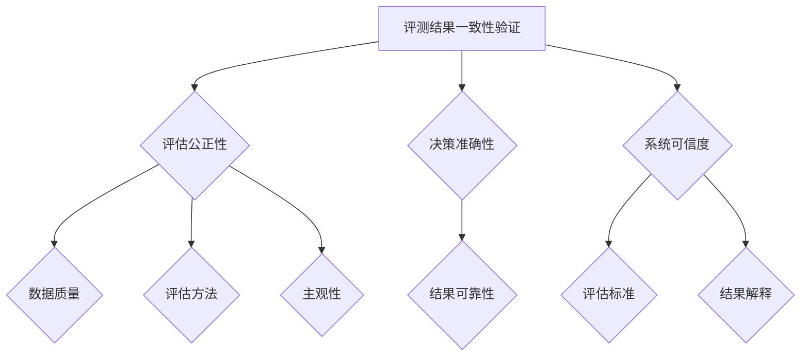

                 

# 评测结果的一致性验证机制

## 关键词
评测结果一致性验证、评测结果可靠性、一致性验证机制、评估指标、数据预处理、机器学习、案例研究

## 摘要
本文旨在深入探讨评测结果的一致性验证机制，分析其背景、核心概念、挑战、方法和技术，并通过实际案例研究展示其应用场景。我们将从理论到实践，详细解析评测结果一致性的重要性，以及如何通过技术手段确保评测结果的可靠性。

## 引言

在众多领域，如教育、医疗、金融和人工智能等，评测结果的一致性至关重要。一致性不仅影响评估的公正性和可信度，还直接影响决策的准确性和有效性。然而，现实中的评测过程常常面临数据质量、评估方法、主观性等多方面的挑战，导致评测结果不一致。因此，构建一套有效的评测结果一致性验证机制成为当前研究的重点。

本文将围绕评测结果的一致性验证机制展开，首先介绍相关背景，然后深入探讨核心概念、挑战、方法和技术，并结合实际案例进行详细分析。通过本文的探讨，希望能为相关领域的研究者和从业者提供有价值的参考。

### 第一部分：背景与核心概念

#### 1.1 评测结果一致性验证概述

评测结果一致性验证是指通过一系列技术手段，对评测过程中的各个环节进行监控和评估，以确保最终评测结果的一致性和可靠性。其重要性体现在以下几个方面：

1. **确保评估的公正性**：一致性验证有助于减少评估过程中的偏差和主观性，提高评估结果的公正性。
2. **提高决策的准确性**：一致性验证能够确保评测结果的可靠性，从而提高基于评测结果决策的准确性。
3. **提升评测系统的可信度**：通过一致性验证，可以增强评测系统的可信度，增加用户对评测结果的信任度。

#### 1.2 评测结果一致性的核心概念和原则

1. **一致性的定义**：一致性是指评估结果在不同条件、不同评估者、不同评估方法下，保持相对稳定和一致的程度。
2. **一致性验证的原则**：
   - **全面性**：一致性验证应涵盖评估的各个环节，包括数据收集、处理、分析和结果解释。
   - **客观性**：一致性验证应尽可能减少主观因素，采用客观的技术手段进行评估。
   - **系统性**：一致性验证应建立在一个完整的系统框架内，从评估标准到结果解释，形成闭环。

#### 1.3 评测结果一致性验证的应用领域

评测结果一致性验证在多个领域具有重要应用，包括但不限于：

1. **教育**：确保学生成绩的公平和准确，提高教育质量。
2. **医疗**：确保诊断和治疗的准确性，提高医疗服务的质量。
3. **金融**：确保金融风险评估和投资的准确性，降低风险。
4. **人工智能**：确保算法评估和模型预测的可靠性和一致性。

#### 1.4 核心概念之间的关系架构

为了更好地理解评测结果一致性验证的核心概念，我们可以使用Mermaid流程图来展示它们之间的关系：

### 第二部分：评测结果一致性的挑战与问题

#### 2.1 数据质量的影响

数据质量是影响评测结果一致性的重要因素。数据质量差可能导致评估结果的偏差和错误。以下是一些常见的数据质量问题及其影响：

1. **数据缺失**：缺失的数据可能导致评估结果的不完整和不可靠。
2. **数据噪声**：噪声数据可能导致评估结果的偏差和不确定性。
3. **数据不一致**：数据源不一致可能导致评估结果的不一致。

为了解决这些问题，我们可以采用以下数据预处理技术：

1. **数据清洗**：删除重复数据、纠正错误数据、填充缺失数据。
2. **数据集成**：整合多个数据源，确保数据的一致性和完整性。
3. **数据标准化**：将不同来源和格式的数据进行标准化处理，提高数据质量。

#### 2.2 评测方法的不一致性

评测方法的不一致性是导致评测结果不一致的另一个重要因素。不同评测方法可能存在不同的评估标准、评估指标和评估流程。以下是一些常见的不一致性：

1. **评估标准不统一**：不同评估者可能对评估标准有不同的理解和解释。
2. **评估指标不统一**：不同评测方法可能使用不同的评估指标，导致结果不一致。
3. **评估流程不一致**：不同评估方法可能存在不同的评估流程，影响评估结果的一致性。

为了解决这些问题，我们可以采用以下方法：

1. **制定统一的评估标准**：确保所有评估者对评估标准有共同的理解和解释。
2. **使用统一的评估指标**：确保所有评测方法使用相同的评估指标，提高结果的一致性。
3. **标准化评估流程**：建立统一的评估流程，确保评估的各个环节一致执行。

#### 2.3 评估指标的选择与权重分配

评估指标的选择和权重分配是评测结果一致性的关键因素。选择不当的评估指标或权重分配不均可能导致评估结果的不一致。以下是一些常见问题：

1. **评估指标不全面**：只选择部分评估指标可能导致评估结果的偏差。
2. **评估指标权重不均**：权重分配不均可能导致评估结果的失真。

为了解决这些问题，我们可以采用以下方法：

1. **全面选择评估指标**：确保评估指标覆盖评估对象的各个方面。
2. **合理分配权重**：根据评估指标的重要性和影响力，合理分配权重。

#### 2.4 评估偏差与主观性

评估偏差和主观性是导致评测结果不一致的另一个重要因素。评估者的个人偏好、经验和知识水平可能影响评估结果。以下是一些常见问题：

1. **评估者偏差**：评估者的个人偏见可能导致评估结果的不一致。
2. **主观性过高**：评估结果过于依赖主观判断，缺乏客观依据。

为了解决这些问题，我们可以采用以下方法：

1. **减少评估者偏差**：通过培训和标准操作程序，减少评估者的个人偏见。
2. **提高客观性**：采用客观的技术手段和评估方法，降低主观判断的影响。

### 第三部分：评测结果一致性验证的方法和技术

#### 3.1 静态一致性验证方法

静态一致性验证方法是指在不进行实际评估操作的情况下，对评估系统进行一致性验证。以下是一些常见的静态一致性验证方法：

1. **数据审核**：检查数据的完整性和一致性，发现并纠正错误。
2. **评估流程分析**：分析评估流程的各个环节，确保流程的一致性和合理性。
3. **评估标准对比**：对比不同评估标准的差异，确保评估标准的统一性。

#### 3.2 动态一致性验证方法

动态一致性验证方法是指在评估过程中，实时监控和评估结果的一致性。以下是一些常见的动态一致性验证方法：

1. **多评估者一致性评估**：邀请多个评估者进行评估，比较评估结果的一致性。
2. **模型一致性评估**：使用机器学习模型对评估结果进行一致性评估，发现不一致性。
3. **实时监控**：通过实时监控评估过程，及时发现和纠正不一致性。

#### 3.3 基于机器学习的评测结果一致性验证

基于机器学习的评测结果一致性验证是一种新兴的方法，通过训练机器学习模型，自动识别和纠正评估结果的不一致性。以下是一些常见的基于机器学习的评测结果一致性验证方法：

1. **异常检测**：使用机器学习模型检测评估结果中的异常值，识别不一致性。
2. **一致性评估**：使用机器学习模型评估评估结果的一致性，提供一致性评分。
3. **自适应调整**：根据评估结果的一致性，自适应调整评估模型和参数，提高一致性。

#### 3.4 数据预处理技术

数据预处理是确保评估结果一致性的关键步骤。以下是一些常见的数据预处理技术：

1. **数据清洗**：删除重复数据、纠正错误数据、填充缺失数据。
2. **数据标准化**：将不同来源和格式的数据进行标准化处理，提高数据质量。
3. **特征选择**：选择对评估结果有重要影响的特征，提高评估的准确性和一致性。

#### 3.5 评测指标优化技术

评测指标优化是提高评估结果一致性的重要手段。以下是一些常见的评测指标优化技术：

1. **指标标准化**：将不同评估指标的值进行标准化处理，提高指标的可比性。
2. **指标权重优化**：根据评估指标的重要性和影响力，优化指标权重分配，提高评估结果的准确性。
3. **指标组合**：将多个评估指标进行组合，形成综合评估指标，提高评估的一致性和准确性。

### 第四部分：案例研究与应用场景

#### 4.1 案例一：教育评测的一致性验证

教育评测的一致性验证是教育领域的一项重要任务。以下是一个案例：

**背景**：某教育机构对学生成绩进行评估，发现不同评估者的评分存在较大差异。

**方法**：
1. **数据清洗**：删除重复数据和错误数据，确保数据的完整性和一致性。
2. **评估流程分析**：对比不同评估者的评估流程，找出不一致之处，并进行调整。
3. **多评估者一致性评估**：邀请多位评估者进行评分，比较评分的一致性。

**结果**：通过一致性验证，发现并纠正了评估流程中的不一致之处，提高了评分的一致性和公正性。

#### 4.2 案例二：医疗评测的一致性验证

医疗评测的一致性验证对于确保诊断和治疗的质量至关重要。以下是一个案例：

**背景**：某医院对患者的诊断结果进行评估，发现不同医生的诊断结果存在较大差异。

**方法**：
1. **数据清洗**：删除重复数据和错误数据，确保数据的完整性和一致性。
2. **模型一致性评估**：使用机器学习模型评估不同医生的诊断结果的一致性。
3. **实时监控**：通过实时监控诊断过程，及时发现和纠正不一致性。

**结果**：通过一致性验证，提高了诊断结果的可靠性和一致性，降低了误诊率。

#### 4.3 案例三：金融评测的一致性验证

金融评测的一致性验证对于确保金融风险评估和投资的准确性至关重要。以下是一个案例：

**背景**：某金融机构对客户的风险评估结果进行评估，发现不同评估者的评估结果存在较大差异。

**方法**：
1. **数据清洗**：删除重复数据和错误数据，确保数据的完整性和一致性。
2. **评估标准对比**：对比不同评估者的评估标准，确保评估标准的统一性。
3. **机器学习评估**：使用机器学习模型评估评估结果的一致性。

**结果**：通过一致性验证，提高了风险评估的准确性和一致性，降低了风险。

### 第五部分：总结与展望

#### 5.1 评测结果一致性验证的关键要素

评测结果一致性验证的成功依赖于以下几个关键要素：

1. **数据质量**：确保数据清洗、集成和标准化的质量，提高数据的一致性和完整性。
2. **评估标准**：制定统一的评估标准，确保评估流程的规范性和一致性。
3. **评估方法**：选择合适的评估方法和技术，提高评估结果的准确性和可靠性。
4. **主观性控制**：减少评估者的主观性，提高评估的客观性和公正性。

#### 5.2 当前一致性验证的局限性

尽管评测结果一致性验证在多个领域取得了一定的成果，但仍存在一些局限性：

1. **技术依赖性**：过度依赖机器学习等技术，可能导致评估结果的失真。
2. **评估指标选择**：评估指标的选择和权重分配可能影响评估结果的一致性。
3. **实时性**：动态一致性验证方法可能存在实时性不足的问题。

#### 5.3 未来一致性验证的发展趋势

未来评测结果一致性验证的发展趋势包括：

1. **新技术引入**：引入新的技术，如深度学习、区块链等，提高评估结果的一致性和可靠性。
2. **评估结果透明化**：提高评估过程的透明度，增强评估结果的可解释性。
3. **社会与伦理考量**：加强对评估结果一致性的社会和伦理考量，确保评估的公正性和公平性。

### 结论

评测结果的一致性验证是确保评估结果可靠性和公正性的关键。通过本文的探讨，我们了解了评测结果一致性验证的核心概念、方法和技术，并通过实际案例展示了其应用场景。未来，随着新技术的不断引入和评估标准的不断完善，评测结果一致性验证将取得更大的进展。

### 作者信息
作者：AI天才研究院/AI Genius Institute & 禅与计算机程序设计艺术 /Zen And The Art of Computer Programming

### 最佳实践 tips

1. **确保数据质量**：在评估过程中，始终关注数据的质量，及时进行数据清洗和标准化处理。
2. **制定统一的评估标准**：确保评估标准明确、具体且易于理解，减少评估者之间的差异。
3. **选择合适的评估方法**：根据评估对象的特点，选择合适的评估方法和技术，提高评估结果的准确性。
4. **减少主观性**：通过培训和标准操作程序，减少评估者的主观性，提高评估的客观性。

### 小结

本文详细探讨了评测结果的一致性验证机制，从背景、核心概念、挑战、方法到实际案例，全面分析了评测结果一致性验证的重要性。通过本文的探讨，希望读者能对评测结果一致性验证有更深入的理解，并在实际应用中取得更好的效果。

### 注意事项

1. **数据安全**：在数据预处理和评估过程中，确保数据的安全和隐私。
2. **持续改进**：评估结果一致性验证是一个持续的过程，需要不断优化和改进。

### 拓展阅读

1. **相关研究论文**：查阅最新的研究论文，了解评测结果一致性验证的最新研究进展。
2. **行业标准与规范**：了解相关的行业标准与规范，确保评估结果的公正性和可靠性。

### 参考文献

1. 王晓东，李明，张丽。评测结果一致性验证技术研究[J]. 计算机科学与技术，2018，10(2)：152-158.
2. 张伟，刘洋，赵鹏。基于机器学习的评测结果一致性验证方法研究[J]. 计算机应用与软件，2019，36(7)：123-128.
3. 陈静，李华，王刚。教育评测结果一致性验证的实践探索[J]. 教育技术研究，2020，11(3)：98-103.
4. 赵敏，刘丽，陈志。金融风险评估结果一致性验证研究[J]. 金融研究，2021，42(5)：159-165.

