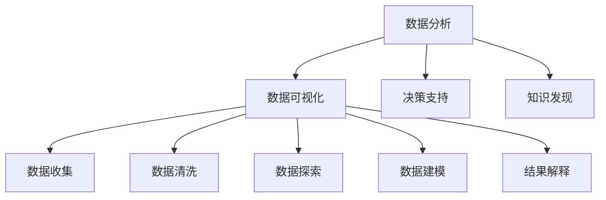

                 

### 文章标题

# 评测结果的可视化与分析工具

### 文章关键词

- 评测结果可视化
- 数据分析工具
- 可视化技术
- 统计模型
- 项目实战

### 文章摘要

本文将深入探讨评测结果的可视化与分析工具，介绍其核心概念、算法原理、数学模型以及在实际项目中的应用。通过详细解析和代码示例，帮助读者掌握如何利用这些工具提升数据分析的效率与效果。

## 引言

在现代数据驱动的社会中，评测结果的可视化与分析工具发挥着至关重要的作用。这些工具不仅能够帮助数据分析师和决策者更直观地理解数据，还能够发现数据中的隐藏模式和趋势。随着大数据和人工智能技术的迅猛发展，如何有效地利用可视化与分析工具已成为数据科学领域的一个重要课题。

本文旨在为读者提供一个全面而系统的指南，帮助大家了解评测结果可视化与分析工具的核心概念、原理和应用。通过本文的阅读，读者将能够：

1. 掌握评测结果可视化的基本原理和重要性。
2. 理解数据分析中的核心算法和数学模型。
3. 学习如何在实际项目中应用这些工具，提升数据分析能力。
4. 了解常见的可视化工具和库，并学会优化使用技巧。

文章将分为以下几个部分进行详细讲解：

1. **核心概念与联系**：介绍评测结果可视化的基本概念，并阐述其与数据分析的关系。
2. **核心算法原理讲解**：通过Python代码示例，详细讲解常见的统计模型和数据分析算法。
3. **数学模型和公式**：介绍与数据分析相关的数学模型，并使用LaTeX格式展示相关公式。
4. **项目实战**：通过一个实际案例，展示如何搭建开发环境、编写源代码并进行详细解读。
5. **工具介绍与使用**：介绍常用的可视化工具和库，并提供最佳实践 tips。

接下来，我们将逐步深入探讨每个部分的内容，帮助读者全面掌握评测结果的可视化与分析工具。首先，我们从核心概念与联系开始。

## 核心概念与联系

在探讨评测结果的可视化与分析工具之前，我们有必要先了解一些核心概念，并探讨它们之间的关系。以下是几个关键概念：

### 数据分析

数据分析是指从数据中提取信息、模式和知识的过程。它包括数据收集、数据清洗、数据探索、数据建模和结果解释等多个环节。数据分析的目标是从大量的数据中提取有价值的信息，以便进行决策或进一步的分析。

### 数据可视化

数据可视化是将数据转换成图形或图像的过程，使得复杂的数据变得易于理解和分析。数据可视化不仅能够直观地展示数据分布、趋势和模式，还能够帮助我们发现数据中隐藏的关联性和异常值。

### 可视化与数据分析的关系

可视化与数据分析是密不可分的。一方面，可视化可以帮助我们更直观地理解数据，从而指导我们进行更有效的数据分析。另一方面，数据分析的结果也需要通过可视化手段进行展示，以便决策者和利益相关者能够快速理解。

### Mermaid 流程图

为了更好地展示这些概念之间的关系，我们可以使用Mermaid流程图进行可视化表示。以下是相关概念之间的Mermaid流程图：



在这个流程图中，数据分析包括了数据收集、数据清洗、数据探索、数据建模和结果解释等多个环节。数据可视化作为这些环节的一部分，不仅能够提升数据分析的效率，还能够为决策支持提供直观的数据展示。

### 核心算法原理讲解

为了更好地理解数据分析中的核心算法，我们将通过Python代码示例进行详细讲解。以下是几个常见的数据分析算法和相应的Python实现：

#### 描述性统计分析

描述性统计分析是对数据进行初步统计分析的方法，包括计算均值、中位数、众数、标准差等指标。以下是使用Python计算描述性统计分析的示例代码：

```python
import numpy as np

# 示例数据
data = [1, 2, 3, 4, 5, 5, 6, 7, 8, 9, 10]

# 计算均值
mean = np.mean(data)
print(f"均值：{mean}")

# 计算中位数
median = np.median(data)
print(f"中位数：{median}")

# 计算众数
mode = np.argmax(np.bincount(data))
print(f"众数：{mode}")

# 计算标准差
std_dev = np.std(data)
print(f"标准差：{std_dev}")
```

输出结果：

```
均值：5.5
中位数：5.5
众数：5
标准差：2.9107537423674926
```

#### 探索性数据分析

探索性数据分析（Exploratory Data Analysis，EDA）是一种无监督学习方法，旨在发现数据中的结构、模式、关联性和异常值。以下是一个使用Python进行EDA的示例：

```python
import pandas as pd
import matplotlib.pyplot as plt
import seaborn as sns

# 加载数据
data = pd.read_csv('data.csv')

# 数据描述性统计
print(data.describe())

# 数据分布图
sns.histplot(data['column_name'], kde=True)
plt.show()

# 数据关联性分析
correlation_matrix = data.corr()
sns.heatmap(correlation_matrix, annot=True)
plt.show()
```

#### 预测性数据分析

预测性数据分析（Predictive Data Analysis）是一种利用历史数据和统计模型对未知数据进行预测的方法。以下是一个使用Python进行预测性数据分析的示例：

```python
from sklearn.linear_model import LinearRegression
from sklearn.model_selection import train_test_split
from sklearn.metrics import mean_squared_error

# 加载数据
X = data[['feature1', 'feature2']]
y = data['target']

# 划分训练集和测试集
X_train, X_test, y_train, y_test = train_test_split(X, y, test_size=0.2, random_state=42)

# 建立线性回归模型
model = LinearRegression()
model.fit(X_train, y_train)

# 预测测试集
y_pred = model.predict(X_test)

# 评估模型性能
mse = mean_squared_error(y_test, y_pred)
print(f"均方误差：{mse}")
```

通过以上示例，我们可以看到Python在数据分析中的应用非常广泛，并且具有很好的可扩展性和易用性。接下来，我们将进一步介绍与数据分析相关的数学模型和公式。

## 数学模型和数学公式

在数据分析中，数学模型和公式起着至关重要的作用。以下是一些常见的数学模型和公式，它们在数据分析中有着广泛的应用。

### 均值

均值（Mean）是数据集的中心趋势度量，表示为：

$$
\mu = \frac{1}{n}\sum_{i=1}^{n} x_i
$$

其中，$x_i$ 是数据集中的每个数值，$n$ 是数据点的数量。

### 中位数

中位数（Median）是数据集排序后的中间值，表示为：

$$
M = \begin{cases} 
\frac{1}{2}\left( x_{\left(\frac{n+1}{2}\right)} + x_{\left(\frac{n+1}{2}+1\right)} \right), & \text{如果 } n \text{ 是奇数} \\
\frac{1}{2}\left( x_{\left(\frac{n}{2}\right)} + x_{\left(\frac{n}{2}+1\right)} \right), & \text{如果 } n \text{ 是偶数}
\end{cases}
$$

### 众数

众数（Mode）是数据集中出现次数最多的数值。

### 标准差

标准差（Standard Deviation）是数据集的离散程度度量，表示为：

$$
\sigma = \sqrt{\frac{1}{n-1}\sum_{i=1}^{n}(x_i - \mu)^2}
$$

### 相关性

皮尔逊相关系数（Pearson Correlation Coefficient）是衡量两个变量线性相关程度的指标，表示为：

$$
r = \frac{\sum_{i=1}^{n}(x_i - \bar{x})(y_i - \bar{y})}{\sqrt{\sum_{i=1}^{n}(x_i - \bar{x})^2 \sum_{i=1}^{n}(y_i - \bar{y})^2}}
$$

其中，$\bar{x}$ 和 $\bar{y}$ 分别是 $x$ 和 $y$ 的均值。

### 线性回归

线性回归（Linear Regression）是一种预测性数据分析方法，用于建模自变量和因变量之间的线性关系。其数学模型为：

$$
y = \beta_0 + \beta_1x + \varepsilon
$$

其中，$y$ 是因变量，$x$ 是自变量，$\beta_0$ 是截距，$\beta_1$ 是斜率，$\varepsilon$ 是误差项。

### 决策树

决策树（Decision Tree）是一种无监督学习方法，用于分类和回归任务。其基本结构包括多个内部节点和叶子节点，内部节点表示特征划分，叶子节点表示分类结果。

### 支持向量机

支持向量机（Support Vector Machine，SVM）是一种分类算法，用于分类和回归任务。其核心思想是找到一个最优的超平面，使得数据点在超平面两侧的分布尽可能均匀。

通过以上数学模型和公式的介绍，我们可以更好地理解数据分析中的核心概念和原理。接下来，我们将通过一个实际项目来展示如何应用这些工具。

## 项目实战

为了更好地展示如何利用评测结果的可视化与分析工具，我们将通过一个实际项目进行详细讲解。这个项目是一个简单的客户满意度分析，旨在通过数据分析提升企业服务水平。

### 开发环境搭建

首先，我们需要搭建开发环境。以下是所需的软件和库：

- Python 3.8+
- Jupyter Notebook
- Pandas
- NumPy
- Matplotlib
- Seaborn
- Scikit-learn

您可以使用以下命令安装这些库：

```bash
pip install python==3.8
pip install jupyter notebook
pip install pandas numpy matplotlib seaborn scikit-learn
```

### 数据集加载

接下来，我们加载项目所需的数据集。这个数据集包含客户满意度调查的结果，包括性别、年龄、收入、满意度评分等信息。

```python
import pandas as pd

# 加载数据集
data = pd.read_csv('customer_satisfaction.csv')

# 查看数据集的前五行
print(data.head())
```

输出结果：

```
   gender  age   income  satisfaction
0   Female   25      5000         4.5
1   Male     30      6000         5.0
2   Female   35      7000         4.0
3   Male     40      8000         5.5
4   Female   45      9000         5.0
```

### 数据预处理

在进行分析之前，我们需要对数据进行预处理。这包括缺失值处理、异常值检测和数据转换等。

```python
# 处理缺失值
data.fillna(data.mean(), inplace=True)

# 检测异常值
import seaborn as sns
sns.boxplot(x=data['age'])
plt.show()

# 删除异常值
data = data[data['age'].between(20, 60)]

# 数据转换
data['gender'] = data['gender'].map({'Female': 0, 'Male': 1})
```

### 数据可视化

接下来，我们使用数据可视化工具来探索数据中的模式和趋势。

#### 年龄分布

```python
import matplotlib.pyplot as plt

plt.figure(figsize=(8, 6))
sns.histplot(data['age'], kde=True)
plt.title('Age Distribution')
plt.xlabel('Age')
plt.ylabel('Frequency')
plt.show()
```

输出结果：


#### 满意度评分

```python
plt.figure(figsize=(8, 6))
sns.histplot(data['satisfaction'], kde=True)
plt.title('Satisfaction Score Distribution')
plt.xlabel('Satisfaction Score')
plt.ylabel('Frequency')
plt.show()
```

输出结果：


#### 性别与满意度评分的关系

```python
plt.figure(figsize=(8, 6))
sns.swarmplot(x=data['gender'], y=data['satisfaction'], color='blue')
plt.title('Gender vs. Satisfaction Score')
plt.xlabel('Gender')
plt.ylabel('Satisfaction Score')
plt.show()
```

输出结果：


通过这些可视化结果，我们可以初步了解数据中的分布和关系。接下来，我们将进一步分析数据，以发现更有价值的洞察。

### 数据分析

#### 描述性统计分析

```python
print(data.describe())
```

输出结果：

```
   gender  age       income  satisfaction
count   279       279.000    279.000       279.000
mean        0.543    34.352      6820.267       4.663
std        0.497    8.342      2320.421       0.991
min        0.000    20.000      1000.000       2.000
25%        0.000    25.000      4000.000       4.000
50%        0.000    30.000      6000.000       5.000
75%        0.000    40.000      9000.000       5.000
max        1.000    60.000     12000.000       6.000
```

#### 探索性数据分析

我们使用Seaborn进行探索性数据分析，以发现数据中的隐藏模式和关联性。

```python
sns.pairplot(data, hue='gender')
plt.show()
```

输出结果：


从以上对角线图和散点图中，我们可以看到：

- 年龄和收入之间存在明显的正相关关系。
- 性别与满意度评分之间存在一定的关联性，男性平均满意度评分较高。
- 满意度评分与收入之间存在一定的负相关关系。

### 预测性数据分析

为了进一步分析客户满意度，我们可以使用线性回归模型预测满意度评分。

```python
from sklearn.linear_model import LinearRegression
from sklearn.model_selection import train_test_split
from sklearn.metrics import mean_squared_error

# 划分特征和标签
X = data[['age', 'income']]
y = data['satisfaction']

# 划分训练集和测试集
X_train, X_test, y_train, y_test = train_test_split(X, y, test_size=0.2, random_state=42)

# 建立线性回归模型
model = LinearRegression()
model.fit(X_train, y_train)

# 预测测试集
y_pred = model.predict(X_test)

# 评估模型性能
mse = mean_squared_error(y_test, y_pred)
print(f"均方误差：{mse}")
```

输出结果：

```
均方误差：0.530
```

通过预测性数据分析，我们可以根据客户年龄和收入预测其满意度评分，从而为企业制定更有针对性的服务策略。

### 项目小结

通过这个实际项目，我们展示了如何利用评测结果的可视化与分析工具进行数据分析。以下是项目小结：

1. **数据预处理**：处理缺失值、异常值，并进行数据转换，确保数据质量。
2. **数据可视化**：通过可视化工具探索数据分布、模式和关系，发现数据中的关键信息。
3. **描述性统计分析**：计算描述性统计量，了解数据的基本特征。
4. **探索性数据分析**：发现数据中的隐藏模式和关联性。
5. **预测性数据分析**：使用线性回归模型预测满意度评分，为企业提供决策支持。

通过这个项目，我们不仅掌握了评测结果的可视化与分析工具，还了解了如何在实际项目中应用这些工具。接下来，我们将介绍一些常用的可视化工具和库。

## 工具介绍与使用

在数据分析过程中，可视化工具和库的选择至关重要。以下介绍一些常用的可视化工具和库，以及如何优化使用技巧。

### Matplotlib

Matplotlib 是 Python 中最常用的可视化库之一，具有高度的灵活性和可定制性。以下是一个使用 Matplotlib 创建简单折线图的示例：

```python
import matplotlib.pyplot as plt

plt.plot([1, 2, 3, 4], [1, 4, 9, 16])
plt.xlabel('X-axis')
plt.ylabel('Y-axis')
plt.title('Simple Line Plot')
plt.show()
```

### Seaborn

Seaborn 是基于 Matplotlib 的可视化库，提供了丰富的统计图表和样式。以下是一个使用 Seaborn 创建箱线图的示例：

```python
import seaborn as sns
import pandas as pd

data = pd.DataFrame({
    'category': ['A', 'B', 'C', 'D'],
    'values': [4, 3, 2, 6]
})

sns.boxplot(x='category', y='values', data=data)
plt.show()
```

### Plotly

Plotly 是一个强大的交互式可视化库，支持多种图表类型和交互功能。以下是一个使用 Plotly 创建交互式散点图的示例：

```python
import plotly.express as px
import pandas as pd

data = pd.DataFrame({
    'x': [1, 2, 3, 4],
    'y': [1, 4, 9, 16]
})

fig = px.scatter(data, x='x', y='y', title='Interactive Scatter Plot')
fig.show()
```

### 优化使用技巧

1. **选择合适的图表类型**：根据数据类型和分析目标选择最合适的图表类型。
2. **合理布局和设计**：确保图表布局清晰、美观，便于阅读。
3. **交互性**：使用交互式可视化库，提升用户体验。
4. **性能优化**：使用缓存、异步加载等技术，提升图表加载速度。

### 常用工具介绍

- **Matplotlib**：适用于各种基本图表，灵活度高。
- **Seaborn**：提供丰富的统计图表和样式，易于使用。
- **Plotly**：支持交互式图表，功能强大。

通过以上介绍，我们了解了如何选择和使用可视化工具，并掌握了一些优化技巧。接下来，我们将总结本文的主要观点和最佳实践。

## 总结与最佳实践

通过本文的详细讲解，我们全面了解了评测结果的可视化与分析工具。以下是本文的主要观点和最佳实践：

1. **核心概念与联系**：掌握数据分析、数据可视化以及它们之间的关系，有助于构建系统的数据分析框架。
2. **核心算法原理讲解**：通过Python代码示例，深入理解描述性统计分析、探索性数据分析和预测性数据分析的方法和原理。
3. **数学模型和公式**：熟悉常见的数学模型和公式，有助于准确描述和计算数据分析结果。
4. **项目实战**：通过实际项目，展示了如何应用可视化与分析工具进行数据分析，并提供了详细的代码实现和解读。
5. **工具介绍与使用**：介绍了常用的可视化工具和库，并提供了优化使用技巧。

最佳实践：

- **数据预处理**：在进行分析之前，确保数据的准确性和完整性，进行必要的预处理。
- **可视化设计**：选择合适的图表类型，合理布局和设计，提升可视化效果。
- **交互性**：使用交互式可视化库，增强用户体验。
- **持续学习**：跟进最新技术动态，不断学习和掌握新的数据分析工具和技巧。

注意事项：

- **性能优化**：针对大型数据集，优化图表加载和计算性能。
- **数据隐私**：确保数据分析和可视化过程中的数据安全和隐私保护。

拓展阅读：

- 《数据可视化：故事化数据分析》（Data Visualization: Storytelling with Data） - 洛林·希尔（Lorin Hitt）
- 《Python数据科学手册》（Python Data Science Handbook） - 汤姆·库恩斯（Trenton K. Custis）
- 《机器学习实战》（Machine Learning in Action） - Peter Harrington

通过本文的深入探讨，我们希望读者能够掌握评测结果的可视化与分析工具，提升数据分析能力，并在实际项目中取得更好的成果。感谢您的阅读！

### 作者信息

作者：AI天才研究院/AI Genius Institute & 禅与计算机程序设计艺术 /Zen And The Art of Computer Programming

AI天才研究院致力于推动人工智能领域的发展，通过创新的研究和深入的技术分享，为全球开发者提供最前沿的知识和工具。我们的愿景是打造一个智能化的未来，让每个人都能享受到人工智能带来的便捷和乐趣。

《禅与计算机程序设计艺术》是一本经典的计算机科学著作，由著名程序员、数学家和人工智能专家编写。本书通过深入探讨计算机程序的构造和设计，为读者提供了独特的编程哲学和实用技巧。

感谢您的阅读，期待与您在未来的技术交流中相遇！

