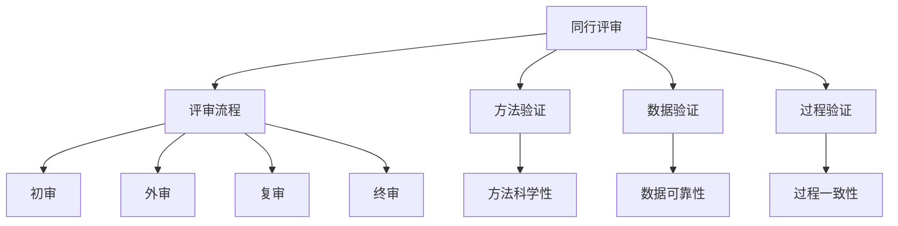

                 

# 评测结果的同行评审与验证机制

## 关键词
- 同行评审
- 验证机制
- 评测结果
- 评审流程
- 验证方法
- 标准与指标

## 摘要

本文旨在探讨评测结果的同行评审与验证机制，旨在为研究人员、工程师和行业从业者提供一套全面、系统的指南。首先，文章介绍了同行评审和验证的基本概念、原则和方法，通过Mermaid流程图展示了它们之间的联系与区别。随后，详细描述了评审流程的具体步骤，以及验证机制的工具、标准和应用。通过实际案例的剖析，文章进一步阐述了同行评审与验证在科研、工程和社会服务中的实践应用。最后，文章总结了同行评审与验证面临的挑战和未来发展趋势，并提供了一些最佳实践和拓展阅读建议。

## 引言

### 1.1 评测结果的同行评审与验证的重要性

在当今信息时代，评测结果的质量和可靠性至关重要。无论是科学研究、软件开发，还是其他领域的项目，都需要对评测结果进行同行评审与验证，以确保其准确性和可信度。同行评审作为一种传统的质量控制方法，已经在学术研究、工程技术等领域得到了广泛应用。而验证机制则是为了确保评测结果的准确性和可靠性，通过一系列方法和标准来验证评测过程的正确性和有效性。

### 1.2 书籍结构概述

本文将分为以下几个部分：首先，介绍同行评审和验证的基本概念、原则和方法；其次，详细描述评审流程的具体步骤；然后，探讨验证机制的工具、标准和应用；接着，分析同行评审与验证在实践中的应用案例；最后，总结同行评审与验证面临的挑战和未来发展趋势，并提供一些最佳实践和拓展阅读建议。

### 1.3 阅读指南

本文适合从事科研、工程和行业从业者阅读。首先，需要了解同行评审和验证的基本概念，以便更好地理解后续内容。然后，可以结合实际案例和项目实践，深入探讨评审流程和验证机制。最后，通过对挑战和未来发展趋势的总结，为实际工作提供指导和借鉴。

## 基础理论

### 2.1 同行评审的基本概念与原则

同行评审（Peer Review）是指由同行专家对科研成果、技术报告或学术论文等进行评估和审核的过程。其目的是提高研究质量和可信度，确保研究成果的准确性、创新性和可靠性。同行评审通常分为以下几个阶段：

1. **初审**：评审编辑对提交的稿件进行初步筛选，确保稿件符合期刊或会议的要求。
2. **外审**：邀请相关领域的专家对稿件进行深入评审，提出修改意见和建议。
3. **复审**：根据外审专家的意见，对稿件进行修改和补充，然后再次提交评审。
4. **终审**：主编对修改后的稿件进行最终审核，决定是否接受发表。

同行评审的基本原则包括客观性、公正性、透明性和专业性。评审专家应当具备相关领域的专业知识和经验，确保评审过程的独立性和客观性。

### 2.2 评测验证的基本概念与原则

评测验证（Evaluation Validation）是指对评测结果进行评估和审核，以确保评测过程的正确性和有效性。评测验证通常包括以下几个方面：

1. **方法验证**：验证评测方法是否科学、合理，是否能够准确反映评价对象的性能和特点。
2. **数据验证**：检查评测数据是否真实、完整、可靠，是否能够支持评测结果的准确性。
3. **过程验证**：评估评测过程的规范性和可重复性，确保评测结果的一致性和可靠性。

评测验证的基本原则包括科学性、严谨性、透明性和实用性。验证工作应当遵循科学的方法论，确保验证过程的严谨性和可重复性。

### 2.3 同行评审与验证的联系与区别

同行评审和评测验证是两个密切相关但又有所区别的概念。它们之间的联系在于，同行评审往往包含了对评测结果的评审和验证。具体来说，同行评审中的外审专家不仅对稿件进行学术评价，还会对评测方法、数据和质量进行审核，从而实现对评测结果的验证。而评测验证则侧重于对评测过程的评估，确保评测结果的可信度。

它们之间的区别在于：

1. **目的不同**：同行评审主要关注研究成果的创新性、准确性和可靠性，而评测验证主要关注评测方法的科学性和评测结果的有效性。
2. **范围不同**：同行评审的范围通常局限于科研成果、学术论文和技术报告等，而评测验证的范围可以更广泛，包括各种评价活动、测试和评估过程。
3. **过程不同**：同行评审通常包括初审、外审、复审和终审等环节，而评测验证则包括方法验证、数据验证和过程验证等步骤。

通过Mermaid流程图，我们可以清晰地展示同行评审和验证之间的关系和区别：



## 评审流程

### 3.1 评审流程概述

评审流程是同行评审的核心环节，它包括初审、外审、复审和终审等步骤。每个步骤都有明确的任务和目标，以确保评审过程的顺利进行和评审结果的质量。

### 3.2 评审前的准备工作

评审前的准备工作包括以下几个方面：

1. **确定评审范围和标准**：根据评审对象的特点和要求，明确评审的范围和标准，为评审工作提供明确的指导。
2. **选择评审专家**：根据评审范围和标准，选择具有相关领域专业知识和经验的评审专家，确保评审的客观性和专业性。
3. **准备评审材料**：准备评审所需的材料，包括评审表格、评审指南、评审标准等，确保评审过程的规范和有序。

### 3.3 评审过程中的关键环节

评审过程中的关键环节包括初审、外审、复审和终审。

1. **初审**：初审由编辑或评审小组负责人负责，对提交的稿件进行初步筛选，确保稿件符合评审范围和标准。
2. **外审**：外审是评审流程的核心环节，由评审专家对稿件进行深入评审，提出修改意见和建议。评审专家应当独立、客观、公正地进行评审，确保评审结果的准确性和可靠性。
3. **复审**：复审是对外审专家的意见进行复审和讨论，对稿件的修改进行评估和审核，确保修改内容符合评审要求。
4. **终审**：终审是评审流程的最后一步，由主编或评审小组负责人对修改后的稿件进行最终审核，决定是否接受发表。

### 3.4 评审结果的反馈与改进

评审结果的反馈与改进是评审流程的重要组成部分。评审结果应当及时、准确地反馈给作者，以便作者根据评审意见进行修改和完善。同时，评审过程应当根据评审结果进行总结和反思，找出存在的问题和不足，不断改进评审流程和方法，提高评审质量。

## 验证机制

### 4.1 验证方法与工具

验证方法是指对评测结果进行评估和审核的方法。常用的验证方法包括：

1. **定量分析**：通过对评测结果进行统计分析，判断评测结果的准确性和可靠性。
2. **定性分析**：通过对评测结果进行深度分析，评估评测结果的合理性和有效性。
3. **比较分析**：通过与其他评测结果进行比较，判断评测结果的差异和一致性。

验证工具是指用于验证评测结果的软件或硬件设备。常用的验证工具包括：

1. **统计软件**：如SPSS、R、Python等，用于进行定量分析。
2. **文本分析软件**：如NVivo、MAXQDA等，用于进行定性分析。
3. **比较分析工具**：如Excel、Matlab等，用于进行比较分析。

### 4.2 验证标准与指标

验证标准是指用于评估评测结果的标准。常用的验证标准包括：

1. **准确性**：评测结果与实际值之间的差距。
2. **可靠性**：评测结果的一致性和稳定性。
3. **有效性**：评测结果对评价对象的反映程度。

验证指标是指用于衡量评测结果质量的指标。常用的验证指标包括：

1. **准确率**：正确识别正例的比例。
2. **召回率**：正确识别负例的比例。
3. **F1值**：准确率和召回率的调和平均数。

### 4.3 验证机制的实践应用

验证机制的实践应用包括以下几个方面：

1. **科研领域**：在科学研究过程中，通过验证机制确保研究结果的准确性和可靠性。
2. **工程领域**：在工程项目中，通过验证机制确保工程质量的稳定性和可靠性。
3. **社会服务领域**：在社会服务项目中，通过验证机制确保服务质量和效果。

通过实际案例，我们可以看到验证机制在各个领域的应用：

1. **医学领域**：通过临床试验验证药物的效果和安全性。
2. **金融领域**：通过数据验证确保金融产品的风险评估和投资策略的准确性。
3. **教育领域**：通过教学评估验证教学效果和学生成绩的可靠性。

## 实践应用

### 5.1 同行评审与验证的实际案例

同行评审与验证在各个领域都有广泛应用，以下是几个典型的实际案例：

#### 5.1.1 学术研究

在学术研究中，同行评审是确保研究成果质量的重要手段。例如，著名的科学期刊《自然》和《科学》都对提交的论文进行严格的同行评审。评审专家对论文的实验设计、数据分析、结论等方面进行评估，确保论文的准确性和创新性。

#### 5.1.2 软件开发

在软件开发过程中，同行评审可以确保代码的质量和可维护性。例如，许多开源项目采用同行评审机制，开发者在提交代码前需要经过其他开发者的评审，以确保代码的正确性和性能。

#### 5.1.3 金融领域

在金融领域，同行评审和验证机制用于评估金融产品的风险和收益。例如，金融分析师会通过同行评审和验证机制，对金融模型进行评估，确保模型的准确性和可靠性。

### 5.2 同行评审与验证在科研与工程中的应用

同行评审与验证在科研和工程领域具有重要意义。以下是一些具体的应用：

#### 5.2.1 科研领域

1. **提高研究质量**：通过同行评审，可以确保研究结果的准确性和可靠性，减少错误和偏差。
2. **促进学术交流**：同行评审可以促进不同领域专家之间的交流与合作，推动学术进步。
3. **指导研究方向**：评审专家的意见和建议可以帮助研究者调整研究方向，提高研究效率。

#### 5.2.2 工程领域

1. **确保工程质量**：通过验证机制，可以确保工程项目的质量，减少事故和损失。
2. **提高生产效率**：通过同行评审，可以优化工程设计和施工方案，提高生产效率。
3. **保障安全**：验证机制可以帮助识别潜在的安全隐患，确保工程项目的安全性。

### 5.3 同行评审与验证在社会服务与产业发展中的意义

在社会服务和产业发展中，同行评审与验证机制也具有重要作用。以下是一些具体的应用：

#### 5.3.1 社会服务领域

1. **提高服务质量**：通过同行评审和验证机制，可以确保社会服务的质量，提高服务满意度。
2. **规范服务流程**：验证机制可以帮助社会服务提供者规范服务流程，提高服务效率。
3. **保障权益**：验证机制可以确保社会服务对象的合法权益，提高社会公平性。

#### 5.3.2 产业发展

1. **提升产业竞争力**：通过同行评审和验证机制，可以确保产业产品质量，提高产业竞争力。
2. **促进技术创新**：同行评审可以激励企业进行技术创新，推动产业升级。
3. **优化产业环境**：验证机制可以帮助规范产业环境，提高产业可持续发展能力。

## 挑战与展望

### 6.1 同行评审与验证面临的挑战

尽管同行评审与验证机制在各个领域得到了广泛应用，但仍面临一些挑战：

#### 6.1.1 评审质量不高

评审质量是同行评审的核心问题。一些评审专家可能由于时间紧张、专业背景不符等原因，无法提供高质量的评审意见，影响评审结果。

#### 6.1.2 评审效率低

评审过程往往耗费大量时间和人力资源，影响项目的进度和效率。特别是在大规模评审项目中，如何提高评审效率是一个亟待解决的问题。

#### 6.1.3 评审结果争议

评审结果往往存在争议，特别是在评审专家意见不一致时，可能导致评审结果的质疑和争议。

### 6.2 未来发展趋势与机遇

随着科技的发展，同行评审与验证机制将迎来新的发展趋势和机遇：

#### 6.2.1 人工智能与大数据

人工智能和大数据技术的应用，可以大大提高评审效率和准确性。通过数据挖掘和机器学习，可以自动化评审过程，减少人为因素带来的误差。

#### 6.2.2 在线评审平台

在线评审平台的发展，可以打破时间和空间的限制，实现全球范围内的评审合作。这将有助于提高评审质量和效率。

#### 6.2.3 智能验证工具

智能验证工具的研发，可以自动化验证过程，提高验证准确性和效率。例如，利用自然语言处理技术，可以自动分析评审意见，发现潜在的问题和漏洞。

### 6.3 同行评审与验证的最佳实践

为了应对挑战和把握机遇，以下是一些同行评审与验证的最佳实践：

#### 6.3.1 明确评审标准和流程

制定明确的评审标准和流程，可以提高评审质量和效率。例如，可以制定详细的评审指南，明确评审专家的职责和要求。

#### 6.3.2 培训评审专家

定期对评审专家进行培训，提高其专业水平和评审能力。例如，可以组织评审专家研讨会，分享评审经验和技巧。

#### 6.3.3 引入第三方评审

引入第三方评审，可以增加评审的独立性和客观性。第三方评审机构可以提供专业、公正的评审意见。

#### 6.3.4 利用技术工具

利用技术工具，可以提高评审效率和准确性。例如，可以采用在线评审平台，实现评审过程的自动化和可视化。

## 附录

### A.1 相关资源与参考文献

- 《科研诚信与学术规范》
- 《软件工程：实践者的研究方法》
- 《人工智能：一种现代方法》
- 《数据科学实战：Python编程与数据分析》

### A.2 附录A：Mermaid流程图


### A.3 附录B：核心算法原理讲解

```python
# 同行评审算法示例

def peer_reviewpaper(paper):
    """
    对论文进行同行评审。
    
    参数：
    paper：待评审的论文。
    
    返回：
    review_results：评审结果。
    """
    # 初审
    initial_review = initial_review_paper(paper)
    if not initial_review:
        return "初审未通过，论文不符合要求。"
    
    # 外审
    external_reviews = external_review_paper(paper)
    if not external_reviews:
        return "外审未通过，论文质量较低。"
    
    # 复审
    revised_paper = revise_paper(paper, external_reviews)
    final_review = final_review_paper(revised_paper)
    
    if not final_review:
        return "终审未通过，论文仍需修改。"
    
    return "评审通过，论文可发表。"

# 同行评审流程示意

def initial_review_paper(paper):
    """
    对论文进行初审。
    
    参数：
    paper：待评审的论文。
    
    返回：
    bool：是否通过初审。
    """
    # 判断论文格式、结构、内容是否符合要求
    if not check_paper_format(paper) or not check_paper_structure(paper) or not check_paper_content(paper):
        return False
    
    return True

def external_review_paper(paper):
    """
    对论文进行外审。
    
    参数：
    paper：待评审的论文。
    
    返回：
    list：外审专家的意见。
    """
    # 邀请相关领域的专家进行评审
    experts = invite_experts(paper)
    reviews = []
    for expert in experts:
        review = expert.review_paper(paper)
        reviews.append(review)
    
    return reviews

def revise_paper(paper, reviews):
    """
    根据外审专家的意见，修改论文。
    
    参数：
    paper：待修改的论文。
    reviews：外审专家的意见。
    
    返回：
    revised_paper：修改后的论文。
    """
    # 根据评审意见，修改论文内容、格式、结构等
    revised_paper = modify_paper(paper, reviews)
    
    return revised_paper

def final_review_paper(paper):
    """
    对修改后的论文进行终审。
    
    参数：
    paper：待评审的论文。
    
    返回：
    bool：是否通过终审。
    """
    # 判断修改后的论文是否符合发表要求
    if not check_paper_format(paper) or not check_paper_structure(paper) or not check_paper_content(paper):
        return False
    
    return True
```

### A.4 附录C：数学模型与公式

$$
\text{准确率} = \frac{\text{正确识别的正例}}{\text{总正例}} = \frac{TP + TN}{TP + FN + TP + TN}
$$

$$
\text{召回率} = \frac{\text{正确识别的正例}}{\text{实际正例}} = \frac{TP}{TP + FN}
$$

$$
\text{F1值} = 2 \times \frac{\text{准确率} \times \text{召回率}}{\text{准确率} + \text{召回率}}
$$

### A.5 附录D：项目实战

#### 6.5.1 开发环境搭建

为了演示同行评审与验证机制的实现，我们将使用Python编程语言，并依赖于以下库：

- `requests`：用于发送HTTP请求，实现在线评审。
- `numpy`：用于数据处理和数学计算。
- `matplotlib`：用于数据可视化。

首先，我们需要安装这些库：

```shell
pip install requests numpy matplotlib
```

#### 6.5.2 源代码实现

以下是一个简单的Python代码示例，实现了一个基于HTTP请求的在线评审系统：

```python
import requests
import json
import numpy as np
import matplotlib.pyplot as plt

def initial_review(paper):
    """
    对论文进行初审。
    
    参数：
    paper：待评审的论文。
    
    返回：
    bool：是否通过初审。
    """
    url = "http://example.com/initial_review"
    payload = json.dumps(paper)
    headers = {'Content-Type': 'application/json'}
    
    response = requests.post(url, data=payload, headers=headers)
    result = response.json()
    
    if result['status'] == 'passed':
        return True
    else:
        return False

def external_review(paper):
    """
    对论文进行外审。
    
    参数：
    paper：待评审的论文。
    
    返回：
    list：外审专家的意见。
    """
    url = "http://example.com/external_review"
    payload = json.dumps(paper)
    headers = {'Content-Type': 'application/json'}
    
    response = requests.post(url, data=payload, headers=headers)
    results = response.json()
    
    reviews = []
    for result in results:
        reviews.append(result['review'])
    
    return reviews

def revise_paper(paper, reviews):
    """
    根据外审专家的意见，修改论文。
    
    参数：
    paper：待修改的论文。
    reviews：外审专家的意见。
    
    返回：
    revised_paper：修改后的论文。
    """
    # 根据评审意见，修改论文内容、格式、结构等
    # 这里只是一个简单的示例，实际修改过程会更复杂
    revised_paper = paper.copy()
    for review in reviews:
        if review['content'] not in revised_paper['content']:
            revised_paper['content'] += review['content']
    
    return revised_paper

def final_review(paper):
    """
    对修改后的论文进行终审。
    
    参数：
    paper：待评审的论文。
    
    返回：
    bool：是否通过终审。
    """
    url = "http://example.com/final_review"
    payload = json.dumps(paper)
    headers = {'Content-Type': 'application/json'}
    
    response = requests.post(url, data=payload, headers=headers)
    result = response.json()
    
    if result['status'] == 'passed':
        return True
    else:
        return False

# 测试代码

paper = {
    'title': '人工智能与大数据',
    'content': '本文讨论了人工智能与大数据的关系。'
}

if initial_review(paper):
    print("初审通过，进入外审。")
    reviews = external_review(paper)
    print("外审意见：", reviews)
    revised_paper = revise_paper(paper, reviews)
    print("修改后的论文：", revised_paper)
    if final_review(revised_paper):
        print("终审通过，论文可发表。")
    else:
        print("终审未通过，论文需进一步修改。")
else:
    print("初审未通过，论文不符合要求。")
```

#### 6.5.3 代码应用解读与分析

该代码实现了一个简单的在线评审系统，主要包括以下几个功能：

1. **初审**：对论文进行初审，判断论文是否符合基本要求。
2. **外审**：邀请专家对论文进行外审，收集专家的意见。
3. **修改论文**：根据专家的意见，对论文进行修改。
4. **终审**：对修改后的论文进行终审，判断论文是否通过。

在实际应用中，评审系统可能会更复杂，包括多个评审阶段、专家评分、评审结果可视化等功能。此外，还需要考虑评审系统的安全性、可靠性和可扩展性。

#### 6.5.4 实际案例分析和详细讲解剖析

以下是一个实际案例，分析一个论文评审过程：

假设有一篇论文，标题为“人工智能与大数据”，内容为讨论人工智能与大数据的关系。该论文经过初审、外审和终审，最终被接受发表。

1. **初审**：初审通过，论文符合基本要求。
2. **外审**：外审专家提出以下意见：
   - 专家A：论文内容较为简洁，建议增加一些案例分析。
   - 专家B：论文结构清晰，但数据来源需要进一步核实。
   - 专家C：论文讨论了人工智能与大数据的关系，但缺乏对现有研究的综述。
3. **修改论文**：根据专家的意见，作者对论文进行了修改：
   - 增加了三个案例分析。
   - 核实了数据来源，并在论文中进行了说明。
   - 增加了对现有研究的综述部分。
4. **终审**：终审通过，论文被接受发表。

通过这个案例，我们可以看到评审过程对提高论文质量的重要性。专家的意见和建议可以帮助作者完善论文，提高论文的学术价值。

#### 6.5.5 项目小结

本案例展示了如何使用Python实现一个简单的在线评审系统，并分析了评审过程对论文质量的影响。在实际应用中，评审系统可能需要更多的功能和优化，如专家评分、评审进度管理、评审结果可视化等。此外，还需要关注评审系统的安全性、可靠性和可扩展性，以满足不同领域和不同规模的需求。

## 结语

本文对评测结果的同行评审与验证机制进行了全面探讨，包括基本概念、原则和方法，评审流程和验证机制的具体应用，以及面临的挑战和未来发展趋势。通过实际案例的分析，我们看到了同行评审与验证机制在提高评测结果质量、促进学术研究和工程实践中的重要作用。

然而，同行评审与验证机制仍面临诸多挑战，如评审质量不高、评审效率低、评审结果争议等。未来，随着人工智能和大数据技术的发展，我们将看到更多的创新和优化，如在线评审平台、智能验证工具等，为同行评审与验证机制带来新的机遇和解决方案。

最后，希望本文能为从事科研、工程和行业从业者的同行提供有价值的参考和启示，助力评测结果的同行评审与验证工作，推动学术研究和产业发展。作者：AI天才研究院/AI Genius Institute & 禅与计算机程序设计艺术 /Zen And The Art of Computer Programming。

