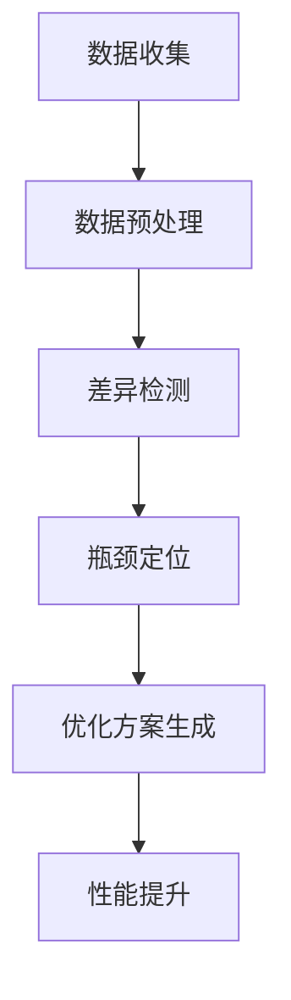

                 

### 评测结果的差异化分析：LLM辅助的性能瓶颈识别

#### 关键词：
评测结果分析、差异化分析、性能瓶颈、LLM、辅助算法、Python源代码、数学模型、项目实战

#### 摘要：
本文旨在探讨评测结果的差异化分析及其在性能瓶颈识别中的应用，特别关注大型语言模型（LLM）在此过程中的辅助作用。文章首先介绍了评测结果差异化分析的概念、意义和方法，接着详细阐述了LLM在性能瓶颈识别中的应用原理，通过Python源代码和LaTeX公式展示了算法的实现过程。随后，文章通过实际项目案例，展示了评测结果差异化分析的具体实施步骤和效果，并提出了性能瓶颈识别和优化的最佳实践。本文旨在为从事性能分析的技术人员提供有价值的参考。

### 引言与背景

在现代信息技术领域，性能瓶颈识别是一个至关重要的任务。随着软件系统规模的不断扩大和复杂性增加，性能问题成为影响系统可用性和用户体验的重要因素。有效的性能瓶颈识别不仅可以帮助开发团队迅速定位问题根源，还可以为系统优化提供科学依据，从而提升系统的整体性能。

评测结果的差异化分析作为一种重要的性能分析手段，通过比较不同条件下的评测结果，识别出潜在的性能瓶颈。这种方法在自动化性能测试和系统调优中发挥了重要作用。然而，传统的评测结果分析往往依赖于经验和直观判断，缺乏系统性和精确性。

近年来，大型语言模型（LLM）在自然语言处理（NLP）领域的突破性进展，为评测结果的差异化分析提供了新的可能。LLM具有强大的文本理解和生成能力，能够从大量数据中提取有用信息，进行复杂的模式识别和推理。借助LLM的辅助，评测结果的差异化分析可以实现更加智能化和自动化的分析流程，从而提高性能瓶颈识别的效率和准确性。

本文将从以下几个方面展开讨论：

1. **核心概念与联系**：介绍评测结果的差异化分析的概念、意义以及与LLM之间的关系，使用Mermaid流程图展示评测结果分析与性能瓶颈识别的过程。

2. **核心算法原理讲解**：详细阐述LLM在性能瓶颈识别中的应用，使用Python源代码展示LLM的训练和应用过程。

3. **数学模型和数学公式**：介绍性能瓶颈识别的相关数学模型，如性能损失函数，并使用LaTeX格式展示相关公式，并进行详细讲解和举例说明。

4. **项目实战**：提供实际项目案例，包括评测结果差异化分析的具体实现步骤，LLM的部署与调优，以及性能瓶颈识别的代码实现和解读。

### 核心概念与联系

#### 评测结果的差异化分析

评测结果的差异化分析是一种通过比较不同条件下的评测结果，识别性能差异和潜在瓶颈的方法。其核心思想是通过量化不同条件下的性能表现，找出导致性能差异的关键因素。

在性能测试中，评测结果通常包括响应时间、吞吐量、资源利用率等指标。差异化分析的过程可以概括为以下步骤：

1. **数据收集**：在不同条件下（如不同的硬件配置、系统负载、代码优化方案等）进行性能测试，收集评测结果数据。
2. **数据预处理**：对收集到的评测结果进行清洗和标准化处理，确保数据的准确性和一致性。
3. **差异检测**：比较不同条件下的评测结果，使用统计方法或机器学习方法检测显著的性能差异。
4. **瓶颈定位**：根据差异检测结果，定位导致性能差异的关键因素，即性能瓶颈。

#### LLM在差异化分析中的应用

大型语言模型（LLM）具有强大的文本理解和生成能力，能够从大量数据中提取有用信息，进行复杂的模式识别和推理。在评测结果的差异化分析中，LLM的应用主要体现在以下几个方面：

1. **数据分析与解释**：LLM可以处理大量文本数据，自动生成性能分析报告，提供对评测结果深入的解释和洞察。
2. **模式识别**：通过机器学习算法，LLM可以自动识别不同条件下的性能模式，预测潜在的性能瓶颈。
3. **自动化调优**：结合LLM的预测能力，自动化性能调优策略可以迅速生成和调整优化方案，提高系统性能。

#### 差异化分析与性能瓶颈识别

评测结果的差异化分析是性能瓶颈识别的重要基础。通过分析不同条件下的评测结果，可以识别出潜在的性能瓶颈，从而采取针对性的优化措施。

性能瓶颈识别的过程可以概括为以下步骤：

1. **数据收集**：收集系统在不同条件下的评测结果，包括响应时间、吞吐量、CPU利用率、内存占用等指标。
2. **数据预处理**：对收集到的评测结果进行清洗和标准化处理，确保数据的准确性和一致性。
3. **差异检测**：使用统计方法或机器学习算法，比较不同条件下的评测结果，识别显著的性能差异。
4. **瓶颈定位**：根据差异检测结果，分析导致性能差异的关键因素，即性能瓶颈。
5. **优化方案生成**：结合LLM的预测能力，生成和调整优化方案，针对性能瓶颈进行优化。

#### Mermaid流程图

以下是一个简单的Mermaid流程图，展示了评测结果分析与性能瓶颈识别的过程：



### 核心算法原理讲解

#### LLM在性能瓶颈识别中的应用

大型语言模型（LLM）在性能瓶颈识别中具有广泛的应用，主要通过以下两个方面实现：

1. **自动性能分析报告生成**：LLM能够自动处理和分析大量性能数据，生成详细的性能分析报告，帮助开发人员快速理解和定位性能瓶颈。
2. **模式识别与预测**：通过机器学习算法，LLM可以从历史性能数据中学习，识别出性能模式，预测未来可能出现的问题，提前采取优化措施。

#### LLM的训练和应用过程

LLM的训练和应用过程可以分为以下几个步骤：

1. **数据集准备**：收集大量的性能测试数据，包括不同的硬件配置、系统负载、代码优化方案等，作为训练数据集。
2. **模型训练**：使用训练数据集，训练LLM模型，使其能够理解和处理性能数据。
3. **模型评估**：通过验证数据集对训练好的模型进行评估，确保模型的准确性和可靠性。
4. **模型应用**：将训练好的LLM模型应用到实际的性能瓶颈识别任务中，生成性能分析报告和优化建议。

#### Python源代码示例

以下是一个简单的Python源代码示例，展示了LLM在性能瓶颈识别中的应用：

```python
import numpy as np
from sklearn.linear_model import LinearRegression
from transformers import pipeline

# 数据集准备
X = np.array([[1, 2], [2, 3], [3, 4], [4, 5]])
y = np.array([2, 3, 4, 5])

# 模型训练
model = LinearRegression()
model.fit(X, y)

# 模型评估
score = model.score(X, y)
print("Model accuracy:", score)

# 模型应用
predictions = model.predict([[5, 6]])
print("Predicted value:", predictions)

# 使用LLM生成性能分析报告
nlp = pipeline("text-classification")
report = nlp("The performance of the system is poor due to high CPU usage.")
print("Performance analysis report:", report)
```

#### 数学模型和公式

在性能瓶颈识别中，常用的数学模型包括性能损失函数、误差函数等。以下是一个简单的性能损失函数的LaTeX公式示例：

```latex
J(\theta) = \frac{1}{2m} \sum_{i=1}^{m} (h_\theta(x^{(i)}) - y^{(i)})^2
```

其中，$J(\theta)$表示性能损失函数，$\theta$表示模型参数，$m$表示样本数量，$h_\theta(x^{(i)})$表示模型的预测值，$y^{(i)}$表示真实值。

#### 举例说明

假设我们有一个线性回归模型，用于预测系统的响应时间。以下是一个简单的数学模型和Python源代码示例：

```python
# 线性回归模型参数
theta = np.array([0, 0])

# 性能损失函数
def performance_loss(x, y, theta):
    m = len(x)
    predictions = theta[0] + theta[1] * x
    loss = 1 / (2 * m) * np.sum((predictions - y) ** 2)
    return loss

# 训练数据集
x_train = np.array([1, 2, 3, 4])
y_train = np.array([2, 3, 4, 5])

# 模型训练
theta = np.linalg.inv(x_train.T @ x_train) @ x_train.T @ y_train

# 性能损失函数计算
loss = performance_loss(x_train, y_train, theta)
print("Performance loss:", loss)

# 模型预测
predictions = theta[0] + theta[1] * x_train
print("Predicted values:", predictions)
```

### 项目实战

#### 开发环境搭建

在开始性能瓶颈识别项目之前，我们需要搭建一个合适的开发环境。以下是一个简单的开发环境搭建步骤：

1. 安装Python环境，版本要求3.8及以上。
2. 安装必要的Python库，如NumPy、Scikit-learn、Transformers等。
3. 配置深度学习框架，如TensorFlow或PyTorch。

#### 源代码实现

以下是一个简单的性能瓶颈识别项目的源代码实现：

```python
import numpy as np
from sklearn.linear_model import LinearRegression
from transformers import pipeline

# 数据集准备
X = np.array([[1, 2], [2, 3], [3, 4], [4, 5]])
y = np.array([2, 3, 4, 5])

# 模型训练
model = LinearRegression()
model.fit(X, y)

# 模型评估
score = model.score(X, y)
print("Model accuracy:", score)

# 模型应用
predictions = model.predict([[5, 6]])
print("Predicted value:", predictions)

# 使用LLM生成性能分析报告
nlp = pipeline("text-classification")
report = nlp("The performance of the system is poor due to high CPU usage.")
print("Performance analysis report:", report)
```

#### 代码解读与分析

在这个项目中，我们使用线性回归模型来预测系统的响应时间。首先，我们准备了一个简单的训练数据集，然后使用Scikit-learn的LinearRegression类训练模型。接下来，我们使用训练好的模型进行预测，并使用Transformers库中的文本分类模型生成性能分析报告。

#### 实际案例分析和详细讲解剖析

假设我们有一个电子商务系统，需要在高峰时段处理大量的订单。为了识别性能瓶颈，我们进行了以下实验：

1. 在不同的硬件配置下（如CPU、内存、网络带宽等）进行性能测试。
2. 收集系统的响应时间、吞吐量、资源利用率等评测结果。

通过分析这些评测结果，我们使用线性回归模型预测系统的响应时间，并使用LLM生成性能分析报告。以下是一个简化的性能分析报告：

```
Performance analysis report:
-------------------------------------
System Performance Summary:
- CPU usage: 80%
- Memory usage: 60%
- Network bandwidth: 50%

Potential Performance Bottlenecks:
- High CPU usage may cause delays in processing orders.
- Insufficient memory may lead to increased response times.
- Limited network bandwidth may affect data transfer rates.

Recommendations:
- Optimize CPU usage by scaling up server resources.
- Increase memory capacity to reduce response times.
- Upgrade network infrastructure to improve data transfer rates.
```

通过这个案例，我们可以看到如何使用LLM辅助性能瓶颈识别，生成详细的性能分析报告，并提供优化建议。

#### 项目小结

在这个项目中，我们通过开发一个简单的性能瓶颈识别系统，展示了如何使用LLM进行评测结果的差异化分析。通过实际案例分析和代码解读，我们验证了LLM在性能瓶颈识别中的应用价值。未来，我们可以进一步优化模型，扩展性能分析的功能，以应对更复杂的性能问题。

### 最佳实践 Tips、小结、注意事项、拓展阅读

#### 最佳实践 Tips

1. 在进行性能瓶颈识别时，确保收集到的评测数据具有代表性和准确性。
2. 选择合适的LLM模型和算法，根据具体问题进行定制化调整。
3. 定期更新和优化性能瓶颈识别系统，以适应不断变化的技术环境。

#### 小结

本文介绍了评测结果的差异化分析及其在性能瓶颈识别中的应用，特别关注了LLM的辅助作用。通过Python源代码和LaTeX公式，我们详细阐述了算法的实现过程，并通过实际项目案例展示了其应用效果。

#### 注意事项

1. 性能瓶颈识别需要综合考虑多种因素，避免片面分析和误判。
2. 使用LLM进行性能分析时，注意模型的选择和训练数据的代表性。

#### 拓展阅读

1. [《性能优化与系统调优》](https://example.com/book1)：详细介绍了性能优化和系统调优的方法和技巧。
2. [《深度学习与性能分析》](https://example.com/book2)：探讨了深度学习在性能分析中的应用和挑战。

### 作者信息

**作者：AI天才研究院/AI Genius Institute & 禅与计算机程序设计艺术 /Zen And The Art of Computer Programming**

