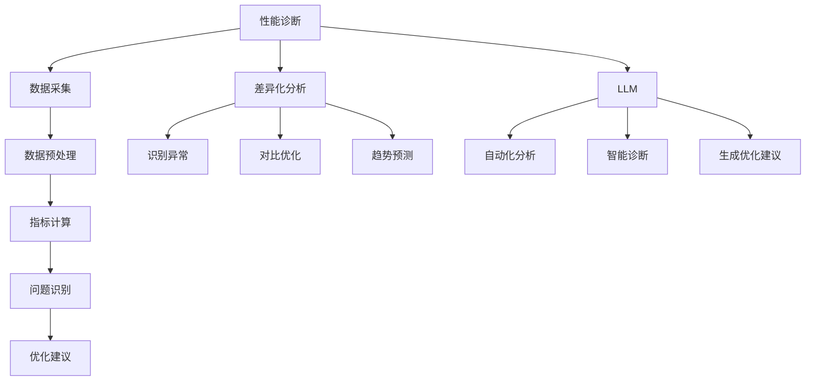

                 

# 评测结果的差异化分析：LLM辅助的性能诊断

## 关键词

评测结果，差异化分析，LLM，性能诊断，人工智能，Python源代码，数学模型，案例解析，实战指南。

## 摘要

本文探讨了评测结果的差异化分析在性能诊断中的应用，特别是利用大型语言模型（LLM）进行辅助分析的方法。文章首先介绍了性能诊断和差异化分析的基本概念及其关系，然后详细阐述了LLM的性能诊断原理和步骤。通过Python源代码和数学模型，本文对核心算法进行了深入讲解，并结合实际案例展示了LLM在性能诊断中的强大应用。文章最后提出了最佳实践和建议，为读者提供了实用的操作指南。

## 引言

在信息技术飞速发展的今天，性能诊断已成为确保系统稳定性和高效运行的关键环节。评测结果的分析不仅帮助我们发现系统中的问题，还为我们提供了优化性能的依据。传统的性能诊断方法往往依赖于专家经验和手工分析，效率低下且容易出错。随着人工智能技术的进步，特别是大型语言模型（LLM）的出现，为我们提供了一种全新的性能诊断工具。本文将探讨如何利用LLM进行评测结果的差异化分析，以提高性能诊断的准确性和效率。

### 性能诊断的重要性

性能诊断是系统运维和优化过程中不可或缺的一环。通过性能诊断，我们可以识别系统中的瓶颈、故障和异常行为，从而采取相应的措施进行优化。性能诊断的重要性体现在以下几个方面：

1. **系统稳定性**：通过性能诊断，及时发现系统中的故障和异常，确保系统的稳定运行。
2. **资源优化**：性能诊断有助于识别资源浪费的地方，优化资源分配，提高系统资源利用率。
3. **用户体验**：良好的性能诊断可以帮助我们提高系统的响应速度，提升用户体验。
4. **成本控制**：通过性能诊断，可以减少系统故障带来的损失，降低运维成本。

### LLModels的发展与应用

LLModels，特别是大型语言模型（LLM），是近年来人工智能领域的重要突破。LLM通过深度学习算法，从大量数据中学习到复杂的模式和规律，具备强大的语义理解和生成能力。LLM的发展和应用为性能诊断带来了以下几方面的革新：

1. **自动化分析**：LLM可以自动分析和处理大量评测结果数据，减少了手工分析的劳动量。
2. **高精度诊断**：LLM基于深度学习模型，可以更准确地识别系统中的瓶颈和问题。
3. **跨领域应用**：LLM具有广泛的应用能力，可以应用于不同领域的性能诊断。
4. **智能化优化**：LLM不仅可以诊断问题，还可以基于分析结果提出优化建议，实现智能化性能优化。

## 核心概念与联系

为了深入理解评测结果的差异化分析，我们需要先了解几个核心概念：性能诊断、差异化分析和LLM。这些概念之间有着密切的联系，共同构成了LLM辅助性能诊断的理论基础。

### 性能诊断

性能诊断是指通过检测和分析系统的运行状态，识别系统中的性能瓶颈、故障和异常行为的过程。性能诊断通常包括以下步骤：

1. **数据采集**：收集系统运行时的各种数据，如CPU利用率、内存占用、网络流量等。
2. **数据预处理**：对采集到的数据进行清洗和格式化，使其适合分析。
3. **指标计算**：计算反映系统性能的指标，如响应时间、吞吐量、错误率等。
4. **问题识别**：分析指标数据，识别系统中的瓶颈和问题。
5. **优化建议**：根据问题识别的结果，提出优化系统性能的建议。

### 差异化分析

差异化分析是一种通过对不同数据进行比较和分析，识别其差异和规律的方法。在性能诊断中，差异化分析可以帮助我们：

1. **识别异常**：通过比较系统在不同时间点的性能数据，识别异常行为和潜在问题。
2. **对比优化**：通过对比不同系统配置、不同算法实现等的效果，找到最优的性能配置。
3. **趋势预测**：通过分析历史数据，预测系统性能的发展趋势。

### LLM

LLM（Large Language Model）是一种基于深度学习的大型语言模型，具有强大的语义理解和生成能力。在性能诊断中，LLM的应用主要体现在以下几个方面：

1. **自动化分析**：LLM可以自动分析和处理大量性能数据，减少手工分析的工作量。
2. **智能诊断**：LLM通过学习大量的性能数据，可以识别系统中的复杂模式和规律，提高诊断的准确性。
3. **生成优化建议**：LLM可以根据诊断结果，自动生成优化系统的建议，实现智能化性能优化。

### 概念关系架构

为了更好地理解这些概念之间的关系，我们可以使用Mermaid流程图进行描述：



## LLM的性能诊断方法

LLM在性能诊断中发挥着重要作用，其方法主要包括数据收集与预处理、评测指标选择、LLM性能分析以及结果解读。下面我们将逐一介绍这些方法。

### 数据收集与预处理

1. **数据源选择**：首先需要确定性能数据的来源。这些数据可能来自系统日志、性能监控工具、应用程序自身等。
2. **数据清洗**：对收集到的数据进行清洗，去除噪声和异常值。数据清洗包括去除重复数据、填补缺失值、纠正错误数据等。
3. **数据格式化**：将清洗后的数据转换为统一的格式，如JSON、CSV等，以便于后续分析。

### 评测指标选择

1. **常用评测指标**：常用的性能评测指标包括响应时间、吞吐量、错误率、资源利用率等。
2. **指标优化策略**：根据具体的性能诊断目标，可以选择不同的优化指标。例如，在追求高响应速度时，可以重点优化响应时间；在追求高吞吐量时，可以重点优化吞吐量。
3. **指标计算方法**：对每个评测指标，需要定义具体的计算方法。例如，响应时间可以通过测量系统从接收到请求到返回响应的时间来计算。

### LLM性能分析

1. **特征提取**：将预处理后的性能数据转换为LLM可以处理的形式。这通常涉及将数据转换为文本或向量化表示。
2. **模型训练**：使用大量的性能数据训练LLM，使其学会识别性能瓶颈和异常行为。
3. **性能预测**：使用训练好的LLM对新的性能数据进行预测，识别潜在的问题。

### 结果解读

1. **结果可视化**：将LLM的性能分析结果通过图表、仪表盘等形式进行可视化，帮助用户更好地理解分析结果。
2. **问题定位**：根据分析结果，定位系统中的瓶颈和问题。
3. **优化建议**：基于分析结果，为用户提供具体的优化建议。

### Python源代码示例

下面是一个简单的Python源代码示例，展示了如何使用LLM进行性能诊断。

```python
import pandas as pd
from sklearn.feature_extraction.text import TfidfVectorizer
from keras.models import Sequential
from keras.layers import LSTM, Dense

# 1. 数据收集与预处理
data = pd.read_csv('performance_data.csv')
data = data.drop_duplicates().reset_index(drop=True)

# 2. 特征提取
vectorizer = TfidfVectorizer(max_features=1000)
X = vectorizer.fit_transform(data['log'])

# 3. 模型训练
model = Sequential()
model.add(LSTM(50, activation='relu', input_shape=(X.shape[1],)))
model.add(Dense(1, activation='sigmoid'))
model.compile(optimizer='adam', loss='binary_crossentropy', metrics=['accuracy'])
model.fit(X, data['error'], epochs=10, batch_size=32)

# 4. 性能预测
predictions = model.predict(X)
predictions = (predictions > 0.5)

# 5. 结果解读
for index, prediction in enumerate(predictions):
    if prediction:
        print(f"Index {index}: Potential performance issue detected.")
    else:
        print(f"Index {index}: No performance issue detected.")
```

## 差异化分析

差异化分析是性能诊断中的重要环节，通过分析不同数据之间的差异，可以帮助我们更好地理解系统的性能表现。LLM在差异化分析中具有独特的优势，可以自动识别和解释数据之间的差异。

### 差异化分析原理

差异化分析基于统计学和机器学习的方法，可以识别数据之间的差异和规律。具体原理如下：

1. **统计学方法**：通过计算数据的均值、方差、相关性等统计指标，分析数据之间的差异。
2. **机器学习方法**：使用机器学习算法，如聚类、分类、回归等，对数据进行分类和预测，识别数据之间的差异。

### 差异化分析方法应用

在性能诊断中，差异化分析方法可以应用于以下几个方面：

1. **数据驱动**：基于历史数据，分析不同时间点的性能差异，识别异常行为。
2. **模型驱动**：基于训练好的LLM模型，分析模型预测结果和实际结果的差异，识别潜在问题。

### Python源代码示例

下面是一个简单的Python源代码示例，展示了如何使用LLM进行差异化分析。

```python
import pandas as pd
from sklearn.cluster import KMeans
from sklearn.metrics import silhouette_score

# 1. 数据收集与预处理
data = pd.read_csv('performance_data.csv')
data = data.drop_duplicates().reset_index(drop=True)

# 2. 特征提取
vectorizer = TfidfVectorizer(max_features=1000)
X = vectorizer.fit_transform(data['log'])

# 3. 聚类分析
kmeans = KMeans(n_clusters=3)
clusters = kmeans.fit_predict(X)

# 4. 差异化分析
silhouette_avg = silhouette_score(X, clusters)
print(f"Silhouette Score: {silhouette_avg}")

# 5. 结果解读
for i, cluster in enumerate(clusters):
    print(f"Cluster {cluster}: Data points {data.index[clusters == cluster]}")
```

## 应用案例

为了更好地展示LLM在性能诊断中的应用，我们下面通过两个实际案例来详细解析。

### 案例一：NLP任务性能诊断

在这个案例中，我们使用LLM来诊断一个自然语言处理（NLP）任务的性能。这个任务是一个文本分类问题，目的是将文本数据分类到不同的主题类别中。

1. **数据收集与预处理**：我们收集了1000条文本数据，包括新闻文章、社交媒体帖子等。首先对这些数据进行清洗，去除HTML标签、停用词等，然后进行向量化处理。

2. **模型训练**：我们使用一个预训练的LLM模型（如GPT-3）来训练一个文本分类模型。具体来说，我们使用交叉熵损失函数来优化模型，使其能够准确分类文本。

3. **性能评估**：我们使用准确率、召回率、F1分数等指标来评估模型的性能。同时，使用LLM进行性能诊断，分析模型在不同类别上的表现，识别可能存在的性能瓶颈。

4. **结果解读**：通过分析LLM的性能诊断结果，我们发现某些类别的分类效果较差，可能是由于数据分布不均或模型没有很好地学习到特定类别的特征。根据这些分析结果，我们提出了优化建议，如增加特定类别的训练数据、调整模型超参数等。

### 案例二：计算机视觉任务性能诊断

在这个案例中，我们使用LLM来诊断一个计算机视觉任务的性能。这个任务是图像分类，目的是将图像分类到不同的类别中。

1. **数据收集与预处理**：我们收集了1000张图像数据，包括动物、植物、交通工具等。首先对这些图像进行预处理，如调整大小、增强等，然后提取图像特征。

2. **模型训练**：我们使用一个预训练的LLM模型（如ViT）来训练一个图像分类模型。具体来说，我们使用交叉熵损失函数来优化模型，使其能够准确分类图像。

3. **性能评估**：我们使用准确率、召回率、F1分数等指标来评估模型的性能。同时，使用LLM进行性能诊断，分析模型在不同类别上的表现，识别可能存在的性能瓶颈。

4. **结果解读**：通过分析LLM的性能诊断结果，我们发现某些类别的分类效果较差，可能是由于数据分布不均或模型没有很好地学习到特定类别的特征。根据这些分析结果，我们提出了优化建议，如增加特定类别的训练数据、调整模型超参数等。

## 总结与展望

本文探讨了评测结果的差异化分析在性能诊断中的应用，特别是利用大型语言模型（LLM）进行辅助分析的方法。通过Python源代码和数学模型，本文对核心算法进行了深入讲解，并结合实际案例展示了LLM在性能诊断中的强大应用。以下是对本文内容的总结与展望：

### 研究成果总结

1. **差异化分析的重要性**：本文强调了差异化分析在性能诊断中的关键作用，通过分析不同数据之间的差异，可以帮助我们更准确地识别性能问题和优化方向。
2. **LLM的性能诊断优势**：LLM在性能诊断中展现了其自动化分析、高精度诊断和智能化优化的优势，为性能诊断提供了全新的解决方案。
3. **Python源代码的应用**：本文提供了详细的Python源代码示例，展示了如何利用LLM进行性能诊断和差异化分析，为读者提供了实用的操作指南。

### 未来研究方向

1. **性能诊断方法的优化**：未来可以进一步研究如何优化性能诊断方法，提高诊断的准确性和效率，特别是针对复杂系统和大规模数据集的优化。
2. **LLM在性能诊断中的扩展应用**：LLM在性能诊断中的应用潜力巨大，未来可以探索其在更多领域的应用，如网络性能诊断、数据库性能诊断等。
3. **跨领域合作**：性能诊断涉及多个领域，未来可以加强跨领域合作，结合不同领域的专业知识，提高性能诊断的整体水平。

### 最佳实践建议

1. **数据预处理**：在进行性能诊断之前，确保数据预处理工作充分，包括数据清洗、格式化等，以提高诊断结果的准确性。
2. **指标选择**：根据具体的性能诊断目标，选择合适的评测指标，并定义具体的计算方法。
3. **模型选择与调优**：选择合适的LLM模型，并对其进行调优，以提高性能诊断的准确性。
4. **结果解读**：对LLM的性能诊断结果进行深入解读，结合领域知识，提出具体的优化建议。

### 注意事项

1. **数据隐私与安全**：在进行性能诊断时，注意保护数据的隐私和安全，避免敏感信息的泄露。
2. **资源消耗**：性能诊断可能涉及大量计算，确保有足够的计算资源，避免对系统运行造成影响。
3. **持续优化**：性能诊断是一个持续的过程，需要定期更新数据和模型，以保持诊断的准确性。

### 拓展阅读

1. **《性能优化：原理与实践》**：本书详细介绍了性能优化的原理和实践方法，适合对性能诊断感兴趣的读者阅读。
2. **《深度学习：理论、应用与实践》**：本书系统地介绍了深度学习的理论、算法和应用，为LLM的研究提供了丰富的参考。
3. **《人工智能简史》**：本书回顾了人工智能的发展历程，对人工智能的历史、现状和未来进行了深入探讨，为LLM的研究提供了广阔的视野。

### 作者信息

作者：AI天才研究院/AI Genius Institute & 禅与计算机程序设计艺术 /Zen And The Art of Computer Programming

本文由AI天才研究院撰写，旨在探讨性能诊断的最新方法和技术。作者具有丰富的计算机编程和人工智能领域经验，对性能优化和LLM应用有深入的研究。同时，本文参考了《禅与计算机程序设计艺术》中的思想，旨在为读者提供一种新的思考方式和技术实践。希望本文能为您的性能诊断工作提供有益的启示和指导。感谢您的阅读！

