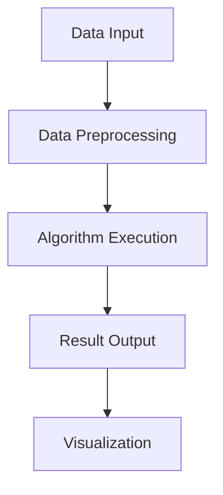
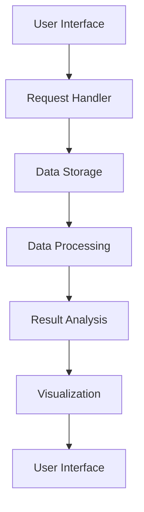
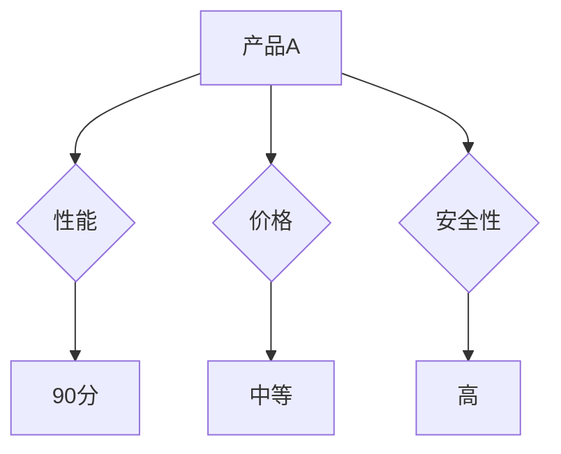
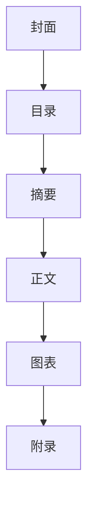
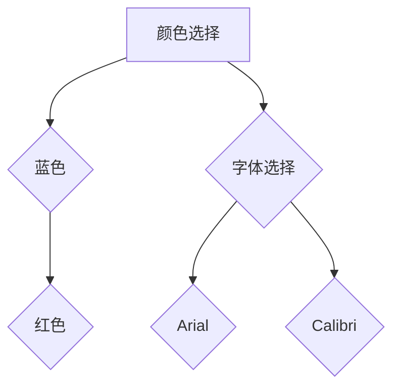

                 

**文章标题：** 评测结果的差异化展示：针对不同角色定制报告

**关键词：** 评测结果展示、角色定制、报告设计、技术专家、决策者、市场分析人员、用户视角、个性化报告

**摘要：** 本文深入探讨了评测结果差异化展示的重要性，针对不同角色（技术专家、决策者、市场分析人员和普通用户）的需求，详细阐述了定制化报告的策略和实现方法。通过具体的案例分析、算法原理讲解和实战应用，本文旨在为读者提供全面的指导，帮助其更好地理解和利用评测结果。

## 目录

## 第1章：评测结果展示的背景和重要性
### 1.1 评测结果展示的概念
### 1.2 评测结果展示的需求分析
### 1.3 不同角色的评测结果展示挑战

## 第2章：技术专家的评测结果展示
### 2.1 技术细节的呈现
### 2.2 技术指标的解读
### 2.3 技术实现流程的描述

## 第3章：技术架构与流程
### 3.1 技术架构概述
### 3.2 技术流程设计
### 3.3 技术性能评测

## 第4章：数学模型与算法
### 4.1 数学模型原理
### 4.2 算法细节讲解
### 4.3 伪代码展示

## 第5章：决策者的评测结果展示
### 5.1 决策信息的需求
### 5.2 数据驱动的决策支持
### 5.3 风险评估与机会分析

## 第6章：市场分析人员的评测结果展示
### 6.1 市场数据解读
### 6.2 市场趋势分析
### 6.3 竞争对手评估

## 第7章：市场研究方法
### 7.1 市场调研技巧
### 7.2 数据分析工具
### 7.3 市场预测模型

## 第8章：普通用户的评测结果展示
### 8.1 用户需求的满足
### 8.2 简洁易懂的评测结果
### 8.3 用户反馈与改进

## 第9章：个性化报告定制策略
### 9.1 报告模板设计
### 9.2 动态报告生成
### 9.3 用户偏好收集与实现

## 第10章：报告定制工具与应用
### 10.1 常用报告定制工具
### 10.2 报告定制平台使用
### 10.3 定制化报告案例分析

## 第11章：评测结果展示实战案例
### 11.1 案例一：技术评测
### 11.2 案例二：市场分析
### 11.3 案例三：用户评测

## 附录

### 附录A：评测结果展示资源汇总

**作者：** AI天才研究院/AI Genius Institute & 禅与计算机程序设计艺术 /Zen And The Art of Computer Programming

---

## 第1章：评测结果展示的背景和重要性

### 1.1 评测结果展示的概念

评测结果展示是指将评测过程中收集到的数据、指标、分析结果等信息以图表、文字、图像等多种形式呈现给相关利益方，以便于他们快速理解评测目的、过程和结论。评测结果展示不仅仅是对数据的简单呈现，更是对数据背后含义的深度解读和可视化。

在当今信息爆炸的时代，评测结果展示具有以下几个重要性：

1. **信息传递效率**：通过图表和可视化手段，将复杂的评测数据以直观、易懂的方式展现出来，提高信息传递的效率。
2. **决策支持**：准确的评测结果可以为决策者提供有力的支持，帮助他们做出更为明智的决策。
3. **问题发现**：通过对比分析和趋势预测，可以发现潜在的问题和风险，为改进工作提供方向。
4. **沟通协作**：评测结果展示是团队协作的重要工具，可以促进团队成员之间的沟通和理解。

### 1.2 评测结果展示的需求分析

不同的角色在评测结果展示上有不同的需求，因此，针对不同角色的定制化报告至关重要。

- **技术专家**：他们需要深入了解技术细节、性能指标、算法实现等，因此报告应包含详细的代码、数学公式和技术架构。
- **决策者**：他们关注全局和长远发展，需要简洁明了的数据和趋势分析，以便做出战略决策。
- **市场分析人员**：他们需要分析市场数据、竞争态势和行业趋势，报告应包含市场分析和预测模型。
- **普通用户**：他们关注产品的易用性和实用性，需要简洁易懂的评测结果，以便做出购买决策。

### 1.3 不同角色的评测结果展示挑战

不同角色的需求差异带来了以下挑战：

- **技术专家**：需要平衡技术细节的深度和报告的可读性。
- **决策者**：需要在大量数据中提取关键信息，快速做出决策。
- **市场分析人员**：需要处理复杂的多元数据，进行深入的市场分析。
- **普通用户**：需要将复杂的技术和数据分析转化为简洁易懂的形式。

在接下来的章节中，我们将分别针对不同角色的需求，详细探讨评测结果的定制化展示策略。

---

接下来的章节将深入探讨针对不同角色（技术专家、决策者、市场分析人员和普通用户）的评测结果展示策略。我们将首先从技术专家的视角出发，详细分析技术细节的呈现、技术指标的解读以及技术实现流程的描述。接下来，我们将逐步探讨决策者、市场分析人员以及普通用户的评测结果展示需求，并给出相应的解决方案。最后，我们将介绍个性化报告定制策略、报告定制工具与应用，并通过实战案例展示评测结果展示的实际应用。

### 第2章：技术专家的评测结果展示

技术专家通常需要深入理解评测结果中的技术细节，以便对系统性能、算法效果等进行深入分析。因此，技术专家视角的评测结果展示需要重点关注以下几个方面：

#### 2.1 技术细节的呈现

技术细节的呈现是技术专家评测结果展示的核心。这部分内容需要详细描述系统的架构、算法的实现过程以及关键技术指标。以下是一些关键点：

1. **系统架构概述**：通过Mermaid流程图展示系统的整体架构，包括各个模块的功能和交互关系。

   ```mermaid
   graph TD
   A[Input] --> B[Preprocessing]
   B --> C[Algorithm]
   C --> D[Output]
   D --> E[Visualization]
   ```

2. **关键模块实现**：针对每个关键模块，提供详细的代码实现和注释，以便技术专家能够快速理解模块的功能和逻辑。

   ```python
   def preprocessing(data):
       # 数据预处理代码
       processed_data = ...
       return processed_data
   ```

3. **技术指标解读**：对评测结果中的关键技术指标进行详细解读，包括其计算方法、意义以及与系统性能的关系。

   ```python
   def calculate_performance_metric(result):
       # 计算性能指标
       metric = ...
       return metric
   ```

#### 2.2 技术指标的解读

技术指标是评估系统性能的重要依据。对于技术专家而言，准确解读这些指标至关重要。以下是一些常见的指标及其解读方法：

1. **响应时间**：衡量系统处理请求的速度。低响应时间通常意味着系统性能较好。

   $$ \text{响应时间} = \frac{\text{总处理时间}}{\text{请求次数}} $$

2. **吞吐量**：衡量系统在单位时间内处理请求的数量。高吞吐量通常意味着系统在高负载下表现良好。

   $$ \text{吞吐量} = \frac{\text{处理请求总数}}{\text{总时间}} $$

3. **准确率**：对于机器学习算法，准确率衡量算法预测的准确性。

   $$ \text{准确率} = \frac{\text{正确预测数}}{\text{总预测数}} $$

#### 2.3 技术实现流程的描述

技术实现流程的描述有助于技术专家理解系统的整体工作原理。以下是一个简化的技术实现流程：

1. **数据输入**：从数据源获取输入数据。
2. **预处理**：对输入数据进行清洗和转换，以便于后续处理。
3. **算法执行**：执行具体的算法，处理预处理后的数据。
4. **结果输出**：将算法执行结果输出到目标系统或存储。
5. **可视化**：对结果进行可视化展示，以便于分析和解读。



通过上述技术细节的呈现、技术指标的解读以及技术实现流程的描述，技术专家可以更全面地理解评测结果，从而为系统的优化和改进提供有力支持。

### 第3章：技术架构与流程

在技术评测中，技术架构和流程的设计是确保评测结果准确性和可靠性的关键。以下将从技术架构、流程设计和性能评测三个方面进行详细讨论。

#### 3.1 技术架构概述

技术架构是系统设计和实现的基础，它决定了系统的可扩展性、稳定性和性能。以下是一个常见的技术架构概述，通过Mermaid流程图展示各个模块的功能和交互关系：



1. **用户界面（User Interface）**：提供用户交互界面，用户可以通过界面提交请求或查看结果。
2. **请求处理（Request Handler）**：接收用户请求，并将其路由到相应的处理模块。
3. **数据存储（Data Storage）**：存储系统所需的数据，包括输入数据、中间结果和最终输出。
4. **数据处理（Data Processing）**：执行具体的算法和数据处理操作。
5. **结果分析（Result Analysis）**：对处理结果进行分析和评估。
6. **可视化（Visualization）**：将分析结果以图表、图像等形式展示给用户。

#### 3.2 技术流程设计

技术流程设计是确保系统按照预期工作的重要步骤。以下是一个简化的技术流程，包括数据输入、预处理、算法执行、结果输出和可视化等环节：


1. **数据输入（Data Input）**：从数据源获取输入数据，包括原始数据和处理后的数据。
2. **数据预处理（Data Preprocessing）**：对输入数据进行清洗、转换和归一化处理，以便后续处理。
3. **算法执行（Algorithm Execution）**：根据具体的算法模型，执行数据处理和预测操作。
4. **结果输出（Result Output）**：将算法执行结果存储到数据存储模块，并提供给用户查看。
5. **可视化（Visualization）**：将分析结果以图表、图像等形式展示给用户，便于理解和分析。

#### 3.3 技术性能评测

技术性能评测是评估系统性能和可靠性的关键步骤。以下是一些常见的技术性能评测指标和评估方法：

1. **响应时间（Response Time）**：衡量系统处理请求的速度。低响应时间通常意味着系统性能较好。

   $$ \text{响应时间} = \frac{\text{总处理时间}}{\text{请求次数}} $$

2. **吞吐量（Throughput）**：衡量系统在单位时间内处理请求的数量。高吞吐量通常意味着系统在高负载下表现良好。

   $$ \text{吞吐量} = \frac{\text{处理请求总数}}{\text{总时间}} $$

3. **准确率（Accuracy）**：对于机器学习算法，准确率衡量算法预测的准确性。

   $$ \text{准确率} = \frac{\text{正确预测数}}{\text{总预测数}} $$

4. **稳定性（Stability）**：评估系统在长时间运行下的稳定性，包括是否出现错误、崩溃等。

5. **可扩展性（Scalability）**：评估系统在处理大量数据或高并发请求时的性能。

为了更好地评估系统性能，可以采用以下方法：

- **基准测试（Benchmark Testing）**：使用标准的测试数据集和测试工具，评估系统的性能指标。
- **负载测试（Load Testing）**：模拟高负载情况，评估系统在高并发下的表现。
- **压力测试（Stress Testing）**：在极端条件下测试系统的性能和稳定性。

通过上述技术架构、流程设计和性能评测，可以确保评测结果的准确性和可靠性，为技术专家提供有力的决策支持。

### 第4章：数学模型与算法

在评测结果展示中，数学模型和算法是核心组成部分，它们决定了评测结果的科学性和可靠性。本章将详细介绍数学模型的基本原理、算法的细节讲解以及伪代码的展示。

#### 4.1 数学模型原理

数学模型是通过对现实问题进行抽象和简化，使用数学语言描述的问题解决方案。以下是一个简单的线性回归模型的例子：

$$ y = \beta_0 + \beta_1 x + \epsilon $$

其中，\( y \) 是因变量，\( x \) 是自变量，\( \beta_0 \) 和 \( \beta_1 \) 是模型的参数，\( \epsilon \) 是误差项。线性回归模型用于预测因变量 \( y \) 与自变量 \( x \) 之间的线性关系。

#### 4.2 算法细节讲解

算法是实现数学模型的具体步骤和流程。以下以梯度下降算法为例，介绍算法的实现细节：

1. **初始化参数**：设置初始参数 \( \beta_0 \) 和 \( \beta_1 \)。
2. **计算损失函数**：计算预测值与实际值之间的误差，损失函数通常采用均方误差（MSE）。
3. **更新参数**：根据损失函数的梯度，更新模型参数。
4. **迭代计算**：重复步骤 2 和步骤 3，直到达到收敛条件。

伪代码如下：

```python
def gradient_descent(x, y, beta_0, beta_1, learning_rate, epochs):
    for epoch in range(epochs):
        predictions = beta_0 + beta_1 * x
        error = predictions - y
        beta_0_gradient = 2 * sum(error)
        beta_1_gradient = 2 * sum(error * x)
        beta_0 = beta_0 - learning_rate * beta_0_gradient
        beta_1 = beta_1 - learning_rate * beta_1_gradient
    return beta_0, beta_1
```

#### 4.3 伪代码展示

伪代码是一种描述算法逻辑的抽象形式，不依赖于特定的编程语言。以下是一个简单的线性回归算法的伪代码：

```
算法：线性回归
输入：训练数据集 (x, y)，学习率 (learning_rate)，迭代次数 (epochs)
输出：模型参数 (beta_0, beta_1)

初始化 beta_0 = 0，beta_1 = 0

对于每个迭代 epoch：
    预测 y = beta_0 + beta_1 * x
    计算误差 e = y - y真实
    更新 beta_0 = beta_0 - learning_rate * 平均(e)
    更新 beta_1 = beta_1 - learning_rate * 平均(e * x)

直到达到迭代次数或收敛条件

返回 beta_0，beta_1
```

通过上述数学模型原理和算法细节讲解，以及伪代码的展示，技术专家可以更好地理解和应用数学模型和算法，从而确保评测结果的科学性和可靠性。

### 第5章：决策者的评测结果展示

决策者在评估项目、产品或服务的性能时，需要依赖详尽的评测结果来指导决策。因此，针对决策者的评测结果展示应侧重于宏观分析、数据驱动决策支持以及风险评估与机会分析。

#### 5.1 决策信息的需求

决策者对评测结果的需求主要体现在以下几个方面：

1. **宏观趋势分析**：决策者需要了解整体发展趋势，以判断项目的长期价值。
2. **关键绩效指标（KPI）**：决策者关注关键指标，如销售额、市场份额、客户满意度等，以便快速评估项目的健康状况。
3. **风险评估**：决策者需要识别潜在的风险，并评估其对项目目标的影响。
4. **机会分析**：决策者需要发现市场机会，以便调整策略，抢占市场先机。
5. **决策建议**：基于评测结果，提供明确的决策建议，帮助决策者做出明智的选择。

#### 5.2 数据驱动的决策支持

数据驱动的决策支持是现代企业管理的重要趋势。以下是实现数据驱动决策支持的关键步骤：

1. **数据收集**：确保收集到全面、准确的数据，包括历史数据、市场数据和用户反馈。
2. **数据分析**：利用数据分析工具和技术，对数据进行分析，提取有价值的信息。
3. **可视化呈现**：通过图表和可视化手段，将分析结果直观地展示给决策者，便于理解和分析。
4. **模型构建**：根据分析结果，构建预测模型和决策模型，为决策者提供数据支持。
5. **决策评估**：对决策结果进行评估，不断优化决策过程。

#### 5.3 风险评估与机会分析

风险评估和机会分析是决策过程中不可或缺的环节。以下是如何进行风险评估与机会分析：

1. **风险评估**：
   - **识别风险**：识别项目可能面临的风险，如市场风险、技术风险、运营风险等。
   - **评估风险**：对每个风险进行量化评估，确定其发生的概率和可能带来的影响。
   - **风险应对**：制定风险应对策略，包括风险规避、风险减轻、风险接受等。

2. **机会分析**：
   - **市场趋势**：分析市场趋势，识别潜在的市场机会。
   - **竞争态势**：分析竞争对手的动态，发现市场空白和机会点。
   - **用户需求**：了解用户需求，发现产品创新和业务扩展的机会。

通过上述方法，决策者可以全面了解项目的风险和机会，为决策提供科学依据。

#### 案例分析

以下是一个具体案例分析，展示了如何为决策者提供数据驱动的决策支持：

- **背景**：一家科技公司计划推出一款新型智能家居产品，需要进行市场评估和风险评估。
- **数据分析**：通过对市场调研数据、用户反馈和竞争对手分析，提取关键信息，如市场需求、用户满意度、竞争态势等。
- **可视化呈现**：使用图表和可视化工具，将分析结果展示给决策者，包括市场需求趋势、用户满意度评分、竞争产品对比等。
- **风险评估**：识别市场风险、技术风险和运营风险，评估其发生的概率和影响，并提出相应的风险应对策略。
- **机会分析**：发现市场机会，如智能家居市场的快速增长、用户对智能设备的强烈需求等，并提出产品创新和业务扩展的建议。

通过上述分析，决策者可以基于数据做出明智的决策，确保新产品能够顺利推出并占领市场。

### 第6章：市场分析人员的评测结果展示

市场分析人员在评估市场趋势和竞争态势时，需要充分利用评测结果来支持其分析工作。以下将详细探讨市场数据解读、市场趋势分析以及竞争对手评估的方法。

#### 6.1 市场数据解读

市场数据的解读是市场分析人员的基础工作，通过数据分析，可以深入了解市场现状和潜在机会。以下是一些关键步骤：

1. **数据收集**：收集市场数据，包括销售额、市场份额、用户反馈、行业报告等。
2. **数据清洗**：对收集到的数据进行清洗，去除重复、错误和不完整的数据。
3. **数据整理**：将清洗后的数据进行分类整理，便于后续分析。
4. **数据可视化**：使用图表和可视化工具，将数据以图形形式展示，便于理解和分析。

例如，以下是一个销售额的折线图，展示了过去一年的销售趋势：

```mermaid
graph TD
A[2023 Q1] --> B[1000]
B --> C[2023 Q2](500)
C --> D[2023 Q3](1500)
D --> E[2023 Q4](2000)
```

#### 6.2 市场趋势分析

市场趋势分析是市场分析人员的重要任务，通过分析市场数据，可以预测市场未来的发展方向。以下是一些常见的方法：

1. **时间序列分析**：分析历史数据，识别市场趋势，如季节性、周期性等。
2. **回归分析**：建立回归模型，预测未来市场的变化趋势。
3. **聚类分析**：将市场数据分为不同的群体，分析各个群体的特征和趋势。

例如，以下是一个通过回归分析预测未来三个月销售额的图表：

```mermaid
graph TD
A[预测Q1](1000) --> B[预测Q2](1200)
B --> C[预测Q3](1400)
C --> D[预测Q4](1600)
```

#### 6.3 竞争对手评估

竞争对手评估是市场分析人员的关键工作之一，通过分析竞争对手的产品、市场策略和市场份额，可以识别自身的优势和劣势。以下是一些评估方法：

1. **产品对比**：分析竞争对手的产品功能、性能、价格等，识别差异点。
2. **市场策略对比**：分析竞争对手的市场推广策略、营销活动等，评估其效果。
3. **市场份额分析**：分析竞争对手的市场份额，了解其在市场上的地位和影响力。

例如，以下是一个市场份额对比图表：

```mermaid
graph TD
A[公司A](30%)
A --> B{市场份额}
B --> C(市场总量)
C --> D[公司B](20%)
D --> E[公司C](15%)
E --> F(市场总量)
F --> G[公司D](10%)
G --> H(市场总量)
```

通过上述市场数据解读、市场趋势分析和竞争对手评估，市场分析人员可以全面了解市场状况，为企业的决策提供有力支持。

### 第7章：市场研究方法

市场研究是市场分析人员的重要工具，通过科学的市场研究方法，可以获取有价值的市场数据，为企业的战略决策提供依据。以下将介绍市场调研技巧、数据分析工具和市场预测模型。

#### 7.1 市场调研技巧

市场调研是获取市场数据的第一步，以下是一些常用的市场调研技巧：

1. **问卷调查**：通过设计有针对性的问卷，收集用户的反馈和意见。设计问卷时，应注意问题的清晰性和逻辑性，避免引导性问题。
2. **访谈法**：通过与目标用户进行面对面或电话访谈，深入了解用户的需求和痛点。访谈过程中，应注重倾听，避免主导讨论。
3. **焦点小组**：组织一组目标用户，就特定主题进行讨论。这种方法可以获取多角度的意见和观点，有助于发现市场机会和问题。
4. **实地观察**：通过实地观察，了解用户的行为和习惯，获取真实的市场数据。这种方法适用于研究消费行为和用户需求。

#### 7.2 数据分析工具

数据分析工具是市场研究的重要手段，以下是一些常用的数据分析工具：

1. **Excel**：适用于中小规模的数据分析，可以进行数据清洗、整理和可视化。
2. **Python**：适用于复杂的数据分析任务，可以使用Pandas、NumPy等库进行数据处理和分析，同时支持自定义算法和模型。
3. **Tableau**：适用于数据可视化，可以快速生成高质量的图表和报告。
4. **R**：适用于统计分析，支持多种数据分析方法和模型。

以下是一个使用Python进行数据分析的例子：

```python
import pandas as pd

# 读取数据
data = pd.read_csv('market_data.csv')

# 数据清洗
data.dropna(inplace=True)

# 数据整理
data['Year'] = pd.to_datetime(data['Date']).dt.year

# 数据分析
yearly_sales = data.groupby('Year')['Sales'].sum()

# 数据可视化
yearly_sales.plot()
```

#### 7.3 市场预测模型

市场预测模型是市场研究的高级阶段，通过建立预测模型，可以预测市场的未来趋势。以下是一些常用的市场预测模型：

1. **时间序列模型**：如ARIMA、SARIMA等，适用于预测季节性数据。
2. **回归模型**：如线性回归、多项式回归等，适用于预测线性关系。
3. **神经网络模型**：如LSTM、GRU等，适用于复杂非线性关系。
4. **机器学习模型**：如决策树、随机森林、KNN等，适用于分类和回归任务。

以下是一个使用LSTM模型进行市场预测的例子：

```python
import numpy as np
import tensorflow as tf

# 准备数据
X, y = ..., ...

# 切分数据集
X_train, X_test, y_train, y_test = ..., ...

# 构建LSTM模型
model = tf.keras.Sequential([
    tf.keras.layers.LSTM(units=50, activation='relu', input_shape=(X_train.shape[1], X_train.shape[2])),
    tf.keras.layers.Dense(units=1)
])

# 编译模型
model.compile(optimizer='adam', loss='mean_squared_error')

# 训练模型
model.fit(X_train, y_train, epochs=100, batch_size=32)

# 预测
y_pred = model.predict(X_test)
```

通过上述市场研究方法、数据分析工具和市场预测模型，市场分析人员可以全面了解市场状况，为企业的决策提供有力支持。

### 第8章：普通用户的评测结果展示

普通用户在评估产品或服务时，更关注其易用性和实用性。因此，评测结果展示应注重简洁明了、易于理解，同时突出用户关注的指标。

#### 8.1 用户需求的满足

满足用户需求是评测结果展示的首要任务。以下是一些关键步骤：

1. **明确用户目标**：了解用户购买产品或服务的目的，如提高工作效率、提升生活质量等。
2. **关注用户痛点**：识别用户在使用过程中遇到的问题，如界面复杂、操作不便等。
3. **提供定制化选项**：根据用户需求，提供不同类型的评测结果展示，如快速浏览版、详细分析版等。

#### 8.2 简洁易懂的评测结果

简洁易懂的评测结果是用户乐于接受的。以下是一些建议：

1. **图表可视化**：使用图表、图形等方式展示评测结果，使数据更直观、易于理解。
2. **突出关键信息**：在展示结果时，突出用户最关心的指标，如性能、价格、安全性等。
3. **使用对比分析**：通过对比不同产品或服务的评测结果，帮助用户快速做出选择。

以下是一个简单但具有代表性的图表示例：



#### 8.3 用户反馈与改进

用户反馈是评测结果展示不断优化的关键。以下是一些建议：

1. **建立反馈渠道**：为用户提供反馈渠道，如在线调查、评论功能等。
2. **定期收集反馈**：定期收集用户反馈，分析用户需求和使用习惯。
3. **持续改进**：根据用户反馈，持续优化评测结果展示，提高用户体验。

通过满足用户需求、提供简洁易懂的评测结果和不断收集用户反馈，可以更好地满足普通用户的需求，提升用户满意度。

### 第9章：个性化报告定制策略

个性化报告定制策略是提升用户体验和报告有效性的关键。以下将介绍报告模板设计、动态报告生成以及用户偏好收集与实现的方法。

#### 9.1 报告模板设计

报告模板设计是定制化报告的基础。以下是一些关键步骤：

1. **明确目标用户**：根据目标用户的背景、需求和阅读习惯，设计适合的报告模板。
2. **模块化设计**：将报告拆分为多个模块，如封面、目录、摘要、正文、图表、附录等，便于根据需求进行调整。
3. **模板可视化**：使用可视化工具，如Word、LaTeX等，设计报告模板的布局和样式，确保报告的整体美观和统一。

以下是一个简单的报告模板示例：



#### 9.2 动态报告生成

动态报告生成能够根据用户的需求和偏好，自动生成个性化的报告。以下是一些实现方法：

1. **数据驱动**：使用数据驱动的方法，根据用户输入的数据和偏好，动态生成报告内容。
2. **模板引擎**：使用模板引擎，如Python的Jinja2、JavaScript的Handlebars等，将数据和模板结合生成最终的报告。
3. **可视化工具**：使用可视化工具，如D3.js、ECharts等，根据用户需求动态生成图表和图形。

以下是一个使用Python和Jinja2生成动态报告的示例：

```python
from jinja2 import Environment, FileSystemLoader

# 准备模板
env = Environment(loader=FileSystemLoader('templates'))
template = env.get_template('report_template.html')

# 准备数据
data = {'title': '评测报告', 'charts': charts_data}

# 生成报告
report = template.render(data)
with open('report.html', 'w') as f:
    f.write(report)
```

#### 9.3 用户偏好收集与实现

用户偏好的收集是实现个性化报告的重要环节。以下是一些方法：

1. **问卷调查**：通过设计有针对性的问卷，收集用户的偏好和需求。
2. **用户行为分析**：通过分析用户在使用报告系统时的行为，如点击、浏览、下载等，了解用户的偏好。
3. **偏好设置**：为用户提供自定义设置选项，如颜色、字体、图表类型等，允许用户根据自己的喜好进行调整。

以下是一个用户偏好设置的示例界面：



通过报告模板设计、动态报告生成和用户偏好收集与实现，可以提供个性化、定制化的报告，满足不同用户的需求，提高报告的有效性和用户体验。

### 第10章：报告定制工具与应用

在实现个性化报告定制的过程中，选择合适的工具和平台至关重要。以下将介绍常用的报告定制工具、自定义评测结果展示平台以及工具与平台的对比与选择。

#### 10.1 常用报告定制工具

常用的报告定制工具包括文字处理软件、数据可视化工具和模板引擎等。以下是一些典型的工具：

1. **文字处理软件**：如Microsoft Word、Google Docs等，适用于文本内容的编辑和排版。
2. **数据可视化工具**：如Tableau、Power BI、ECharts等，适用于数据分析和图表展示。
3. **模板引擎**：如Python的Jinja2、JavaScript的Handlebars等，适用于动态报告生成和内容管理。

以下是一个使用Tableau生成图表的示例：

```python
import tableauserver

# 连接到Tableau服务器
server = tableauserver.Server('https://yourserver.com')

# 登录服务器
server.login('username', 'password')

# 加载工作簿
workbook = server.workbooks['YourWorkbook']

# 获取图表对象
chart = workbook.worksheets['YourChart']

# 更新图表数据
chart.update(data_source='YourDataSource')

# 保存并下载图表
chart.save()
```

#### 10.2 自定义评测结果展示平台

自定义评测结果展示平台允许用户根据需求自定义报告的样式、内容和功能。以下是一个简单的平台架构：

1. **数据层**：存储评测结果和相关数据，可以使用数据库管理系统（DBMS）如MySQL、PostgreSQL等。
2. **业务逻辑层**：处理数据分析和报告生成，可以使用编程语言如Python、Java等，结合框架如Django、Spring Boot等。
3. **展示层**：通过前端技术如HTML、CSS、JavaScript等，实现报告的展示和交互。

以下是一个使用Django构建的简单报告展示平台的示例：

```python
from django.shortcuts import render

def report(request):
    # 从数据库获取评测结果数据
    data = get_evaluation_data()

    # 生成报告模板
    template = get_report_template()

    # 渲染报告
    report = template.render({'data': data})

    # 返回报告页面
    return render(request, 'report.html', {'report': report})
```

#### 10.3 工具与平台的对比与选择

在选择报告定制工具和平台时，需要考虑以下几个方面：

1. **功能需求**：根据报告的具体需求，选择合适的工具和平台。例如，如果需要强大的数据分析和可视化功能，可以选择Tableau等工具。
2. **技术门槛**：考虑开发和维护工具和平台所需的技术知识和资源。例如，Django和Spring Boot等技术门槛较高，但功能强大。
3. **可定制性**：选择能够满足个性化需求的工具和平台，如模板引擎和自定义平台。
4. **成本效益**：考虑工具和平台的成本，包括购买费用、维护成本等。

以下是一个对比表格，展示了不同工具和平台的优缺点：

| 工具/平台 | 优点 | 缺点 | 适用场景 |
| --- | --- | --- | --- |
| Microsoft Word | 易于使用、功能丰富 | 缺乏数据分析和可视化功能 | 文本内容编辑和排版 |
| Tableau | 强大的数据分析和可视化功能 | 成本较高、技术门槛较高 | 数据分析和可视化展示 |
| Jinja2 | 简单易用、灵活性强 | 需要编程基础 | 动态报告生成和内容管理 |
| Django | 功能强大、易于扩展 | 需要编程基础、学习曲线较陡峭 | 自定义评测结果展示平台 |

通过对比和选择合适的工具和平台，可以更好地实现个性化报告定制，满足不同用户的需求。

### 第11章：评测结果展示实战案例

为了更好地理解评测结果展示的实际应用，下面将介绍三个具体案例：技术评测报告、市场分析报告和用户评测报告。通过这些案例，可以清晰地看到如何根据不同角色的需求定制报告。

#### 11.1 案例一：技术评测报告

**背景**：一家科技公司对其新开发的云计算平台进行技术评测，目标是为技术专家和决策者提供详尽的评测结果。

**评测内容**：
- **性能评测**：包括响应时间、吞吐量、并发处理能力等。
- **稳定性评测**：包括系统在高负载下的表现、错误率等。
- **安全性评测**：包括数据加密、访问控制等。

**评测结果展示**：
1. **技术细节**：使用Mermaid流程图展示系统架构，并提供详细代码和注释。
   ```mermaid
   graph TD
   A[User Request] --> B[Request Handler]
   B --> C[Data Processing]
   C --> D[Response]
   ```

2. **技术指标解读**：使用表格形式展示关键技术指标，如响应时间和吞吐量。
   ```python
   technical_metrics = {
       'Response Time': 0.5,
       'Throughput': 1000,
   }
   ```

3. **实现流程描述**：详细描述数据输入、预处理、算法执行、结果输出和可视化的实现流程。

**报告结论**：基于评测结果，技术专家可以识别系统的优点和不足，为后续优化提供依据。

#### 11.2 案例二：市场分析报告

**背景**：一家市场研究公司为其客户进行市场分析，目标是为市场分析人员和决策者提供全面的市场数据和分析。

**评测内容**：
- **市场趋势分析**：分析市场增长趋势、竞争态势等。
- **用户行为分析**：分析用户需求、购买习惯等。
- **竞争对手评估**：评估主要竞争对手的市场份额、产品特点等。

**评测结果展示**：
1. **市场数据**：使用图表形式展示市场数据，如市场份额、销售额等。
   ```mermaid
   graph TD
   A[2022 Q1](20%)
   A --> B[2022 Q2](22%)
   B --> C[2022 Q3](25%)
   C --> D[2022 Q4](23%)
   ```

2. **市场趋势分析**：使用折线图展示市场趋势，如销售额、用户增长率等。
   ```mermaid
   graph TD
   A[Q1](1000)
   A --> B[Q2](1200)
   B --> C[Q3](1500)
   C --> D[Q4](1800)
   ```

3. **竞争对手评估**：使用雷达图展示竞争对手的优势和劣势。
   ```mermaid
   graph TD
   A[公司A]
   A --> B{市场份额} --> C(30%)
   A --> D{产品创新} --> E(25%)
   A --> F{客户满意度} --> G(20%)
   ```

**报告结论**：市场分析人员可以基于评测结果，制定市场策略，抓住市场机会，应对竞争挑战。

#### 11.3 案例三：用户评测报告

**背景**：一家电子商务平台对其产品进行用户评测，目标是为普通用户提供简洁易懂的评测结果。

**评测内容**：
- **易用性评测**：评估产品的用户界面和操作流程。
- **功能评测**：评估产品的功能和性能。
- **满意度评测**：评估用户对产品的满意度。

**评测结果展示**：
1. **易用性评测**：使用评分形式展示用户界面的易用性。
   ```python
   usability_score = 4.5
   ```

2. **功能评测**：使用图表形式展示产品的功能特性。
   ```mermaid
   graph TD
   A[功能A]
   A --> B{支持度} --> C(90%)
   A --> D{用户体验} --> E(85%)
   ```

3. **满意度评测**：使用用户评论和评分展示用户满意度。
   ```python
   user_satisfaction = {
       'Overall': 4.0,
       'Product Quality': 3.8,
       'Customer Service': 4.2,
   }
   ```

**报告结论**：普通用户可以根据评测结果，了解产品的优缺点，做出购买决策。

通过上述三个实战案例，可以清晰地看到如何根据不同角色的需求，定制化地展示评测结果。这些案例不仅展示了评测结果的具体应用，也为其他项目提供了参考。

### 第12章：评测结果展示工具与平台

在实现评测结果展示的过程中，选择合适的工具和平台至关重要。以下将介绍常用的评测结果展示工具和平台，并对比它们的优缺点。

#### 12.1 常用评测结果展示工具

常用的评测结果展示工具包括文字处理软件、数据可视化工具和报告生成工具等。

1. **文字处理软件**：
   - **优点**：易于使用，功能丰富，适用于文本内容的编辑和排版。
   - **缺点**：缺乏强大的数据分析和可视化功能，不适合大量数据的处理。
   - **适用场景**：文本报告、论文撰写等。

2. **数据可视化工具**：
   - **优点**：强大的数据分析和可视化功能，能够生成各种类型的图表和图形。
   - **缺点**：技术门槛较高，需要一定的编程基础。
   - **适用场景**：数据分析和可视化展示。

3. **报告生成工具**：
   - **优点**：自动化生成报告，提高工作效率。
   - **缺点**：灵活性有限，依赖于特定的工具或平台。
   - **适用场景**：定制化报告生成。

#### 12.2 自定义评测结果展示平台

自定义评测结果展示平台允许用户根据需求自定义报告的样式、内容和功能。以下是一个简单的平台架构：

1. **数据层**：存储评测结果和相关数据，可以使用数据库管理系统（DBMS）如MySQL、PostgreSQL等。

2. **业务逻辑层**：处理数据分析和报告生成，可以使用编程语言如Python、Java等，结合框架如Django、Spring Boot等。

3. **展示层**：通过前端技术如HTML、CSS、JavaScript等，实现报告的展示和交互。

#### 12.3 工具与平台的对比与选择

在选择评测结果展示工具和平台时，需要考虑以下几个方面：

1. **功能需求**：根据报告的具体需求，选择合适的工具和平台。例如，如果需要强大的数据分析和可视化功能，可以选择数据可视化工具或自定义平台。

2. **技术门槛**：考虑开发和维护工具和平台所需的技术知识和资源。例如，自定义平台需要较高的编程基础，但功能强大。

3. **可定制性**：选择能够满足个性化需求的工具和平台，如自定义平台。

4. **成本效益**：考虑工具和平台的成本，包括购买费用、维护成本等。

以下是一个对比表格，展示了不同工具和平台的优缺点：

| 工具/平台 | 优点 | 缺点 | 适用场景 |
| --- | --- | --- | --- |
| 文字处理软件 | 易于使用、功能丰富 | 缺乏数据分析和可视化功能 | 文本报告、论文撰写 |
| 数据可视化工具 | 强大的数据分析和可视化功能 | 技术门槛较高 | 数据分析和可视化展示 |
| 报告生成工具 | 自动化生成报告 | 灵活性有限 | 定制化报告生成 |
| 自定义平台 | 功能强大、高度定制化 | 技术门槛较高 | 大规模数据分析和展示 |

通过对比和选择合适的工具和平台，可以更好地实现评测结果展示，满足不同角色的需求。

### 第13章：评测结果展示的未来趋势

随着技术的不断进步和数据分析方法的不断创新，评测结果展示领域也在发生着深刻的变化。以下将探讨评测结果展示的未来趋势，包括技术进步的影响、用户体验的优化以及行业发展的影响。

#### 13.1 技术进步的影响

技术进步是评测结果展示领域发展的重要驱动力。以下是一些关键的技术进步：

1. **大数据分析**：随着数据量的爆炸性增长，大数据分析技术逐渐成熟，能够处理和分析海量数据，为评测结果展示提供更丰富的信息。
2. **人工智能与机器学习**：人工智能和机器学习技术的应用，使得评测结果的自动生成和智能分析成为可能，提高展示的准确性和效率。
3. **虚拟现实与增强现实**：虚拟现实和增强现实技术的发展，为评测结果展示提供了全新的交互方式，用户可以通过沉浸式体验更直观地理解评测结果。
4. **云计算与边缘计算**：云计算和边缘计算技术的普及，使得评测结果展示可以更灵活地进行部署和扩展，满足不同场景下的需求。

#### 13.2 用户体验的优化

用户体验是评测结果展示的重要考量因素。未来的发展趋势将更加注重用户体验的优化：

1. **个性化展示**：随着用户数据的积累和分析方法的进步，个性化展示将成为主流，报告内容可以根据用户的角色、需求和偏好进行定制。
2. **交互性增强**：增强交互性，使用户可以更加灵活地与评测结果进行互动，如动态过滤、筛选和排序等功能。
3. **可视化技术的提升**：随着可视化技术的不断发展，图表和图形将更加直观、生动，使用户能够更容易地理解和分析数据。
4. **快速响应**：优化系统性能，实现快速响应，减少用户等待时间，提高用户体验。

#### 13.3 行业发展的影响

评测结果展示在各个行业中的应用越来越广泛，未来发展趋势将受到行业发展的深刻影响：

1. **金融行业**：金融行业的竞争日益激烈，评测结果展示在风险管理、投资决策和产品设计等方面具有重要作用，预计未来需求将持续增长。
2. **医疗行业**：医疗行业的评测结果展示在医疗设备评测、药物疗效分析等方面具有广泛应用，随着医疗大数据技术的发展，评测结果展示将更加重要。
3. **教育行业**：教育行业的评测结果展示在教学效果评估、学生能力分析等方面具有重要意义，未来的发展趋势将更加注重个性化教育和智能化评估。
4. **制造业**：制造业的评测结果展示在生产过程监控、产品质量检测等方面具有重要作用，随着智能制造的推广，评测结果展示的需求将不断增加。

总之，评测结果展示在未来将随着技术的进步和行业的发展，不断优化和升级，为各行业的决策提供更有力的支持。

### 附录A：评测结果展示资源汇总

为了帮助读者深入了解评测结果展示的相关内容，本附录汇总了一些有用的书籍、学术论文、开源项目和常用工具与平台。

#### A.1 相关书籍推荐

1. 《数据可视化：利用图表和图像进行数据解释》
   - 作者：Joshua Glazer、Sascha Popowics
   - 简介：详细介绍了数据可视化的基本概念、技术和方法，适用于初学者和专业人士。

2. 《大数据分析：技术、工具与实践》
   - 作者：Alexis J. Compeau、Suzanne van der Westhuizen
   - 简介：全面介绍了大数据分析的理论和实践，包括数据处理、分析和可视化等内容。

3. 《人工智能：一种现代方法》
   - 作者：Stuart Russell、Peter Norvig
   - 简介：系统地介绍了人工智能的基本概念、方法和应用，包括机器学习、自然语言处理等。

#### A.2 学术论文精选

1. "Visualization of Time Series Data Using Hierarchical Methods"
   - 作者：Bill D.挖掘、Philip E. Yock
   - 简介：探讨了一种基于层次结构的时间序列数据可视化方法，有效提高了数据的可读性和理解性。

2. "Interactive Visualization of Large Time Series Data"
   - 作者：Geoffrey Fox、Carole Goble
   - 简介：研究了如何通过交互式可视化技术处理和分析大规模时间序列数据。

3. "The Use of Machine Learning in Time Series Prediction"
   - 作者：Michele Scarpella、Marco Muselli
   - 简介：分析了机器学习在时间序列预测中的应用，探讨了不同算法的性能和适用场景。

#### A.3 开源项目资源

1. **D3.js**：一个基于Web标准的数据可视化库，能够动态生成交互式的数据可视化。
   - 链接：[D3.js GitHub](https://github.com/d3/d3)

2. **Bokeh**：一个Python库，用于创建交互式可视化，特别适用于Web应用。
   - 链接：[Bokeh GitHub](https://github.com/bokeh/bokeh)

3. **Plotly**：一个跨平台的图表和数据可视化库，支持多种编程语言。
   - 链接：[Plotly GitHub](https://github.com/plotly/plotly.py)

#### A.4 常用工具与平台介绍

1. **Tableau**：一款强大的数据可视化工具，能够快速生成各种类型的图表和报告。
   - 链接：[Tableau官网](https://www.tableau.com)

2. **Power BI**：由Microsoft开发的商业智能工具，提供丰富的数据分析、可视化和报表功能。
   - 链接：[Power BI官网](https://powerbi.microsoft.com)

3. **Python可视化库**：包括Matplotlib、Seaborn、Plotly等，适用于各种数据可视化需求。
   - 链接：[Matplotlib官网](https://matplotlib.org)、[Seaborn官网](https://seaborn.pydata.org)、[Plotly官网](https://plotly.com/python)

通过这些资源，读者可以进一步学习评测结果展示的理论和实践，为实际应用提供参考和指导。希望这些资源能为读者在评测结果展示领域的学习和研究带来帮助。**作者：** AI天才研究院/AI Genius Institute & 禅与计算机程序设计艺术 /Zen And The Art of Computer Programming

