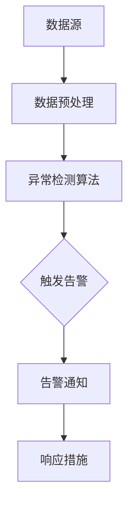
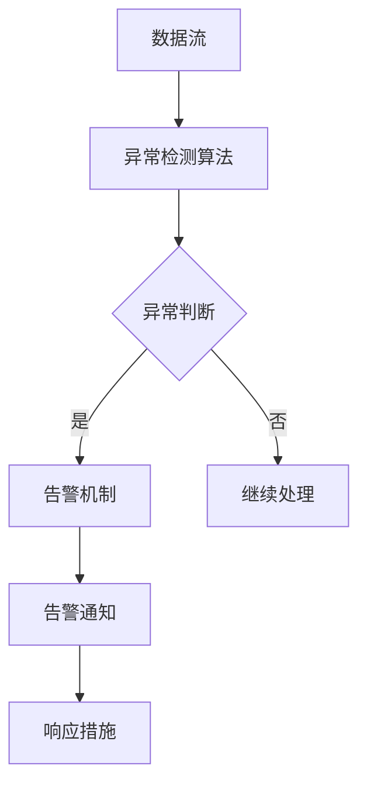

                 

作者，AI天才研究院/AI Genius Institute & 禅与计算机程序设计艺术 /Zen And The Art of Computer Programming

**关键词**：评测结果异常检测，告警机制，异常检测算法，告警机制设计，应用案例

**摘要**：
本文深入探讨了评测结果的异常检测与告警机制的重要性及其在各个领域的广泛应用。首先，我们介绍了异常检测与告警机制的基本概念，并分析了其在确保系统稳定运行和提升数据处理效率方面的关键作用。随后，文章详细阐述了异常检测算法的理论基础和具体实现方法，包括统计方法、基于距离的方法、基于聚类的方法以及基于神经网络的方法。接着，文章探讨了告警机制的设计原则和实现策略，并分享了在实现告警机制过程中遇到的问题和解决方案。最后，文章通过实际应用案例，展示了异常检测与告警机制在实际项目中的效果和重要性，并提出了未来的发展趋势和挑战。

----------------------------------------------------------------

## 1.1 异常检测与告警机制的重要性

### 背景介绍

在信息爆炸和数据驱动的时代，评测结果的准确性和可靠性变得至关重要。随着大数据、云计算和人工智能技术的不断发展，评测结果的生成和处理变得越来越复杂。在这个过程中，异常检测与告警机制作为一种重要的技术手段，对于保证评测结果的可靠性和及时性起到了关键作用。

异常检测是指在大量数据中识别出不符合预期模式的异常数据或行为。它广泛应用于金融、医疗、工业、电商等领域，帮助识别欺诈行为、疾病预警、设备故障等。告警机制则是在发现异常时，及时向相关人员或系统发出警报，以便采取相应的措施。

### 核心概念与联系

异常检测与告警机制的核心概念包括：异常、检测、告警、机制。这些概念之间的关系可以用以下Mermaid流程图表示：



在上述流程图中，数据源经过预处理后，通过异常检测算法识别出异常数据，并触发告警机制。告警通知环节则将异常情况及时通知给相关人员或系统，以便采取相应的响应措施。

### 核心算法原理讲解

异常检测算法主要分为以下几种类型：

1. **统计方法**：通过计算数据的统计特征，如均值、方差等，识别出偏离这些特征的异常数据。
2. **基于距离的方法**：通过计算数据点与参考点（如均值、中心点等）之间的距离，识别出距离较远的异常数据。
3. **基于聚类的方法**：通过聚类分析，识别出聚类中心附近的正常数据和离群点。
4. **基于神经网络的方法**：利用神经网络模型，对数据进行分析和预测，识别出与模型预测不一致的异常数据。

下面，我们以统计方法为例，详细讲解其原理和实现方法。

#### 统计方法原理

统计方法的核心思想是利用数据的统计特征来识别异常。具体来说，我们可以通过以下步骤进行异常检测：

1. **数据预处理**：对原始数据进行清洗和处理，包括去除缺失值、异常值等。
2. **特征提取**：计算数据的统计特征，如均值、方差等。
3. **阈值设定**：根据数据的统计特征，设定一个阈值，用于判断数据是否异常。
4. **异常检测**：将每个数据与设定的阈值进行比较，如果数据超出阈值，则判断为异常。

#### Python源代码实现

下面是一个简单的Python代码示例，用于实现基于统计方法的异常检测：

```python
import numpy as np

# 假设我们有一组数据
data = np.array([1, 2, 3, 4, 5, 100])

# 计算均值和方差
mean = np.mean(data)
variance = np.var(data)

# 设定阈值
threshold = 3 * variance

# 异常检测
for i, value in enumerate(data):
    if value > mean + threshold:
        print(f"数据点{i+1}异常：{value}")
```

在上面的代码中，我们首先计算了数据的均值和方差，然后设定了一个阈值（3倍方差），最后遍历数据，判断每个数据点是否异常。

#### 数学模型与公式

在统计方法中，我们通常会使用以下公式来计算均值和方差：

$$
\mu = \frac{1}{N}\sum_{i=1}^{N}x_i
$$

$$
\sigma^2 = \frac{1}{N-1}\sum_{i=1}^{N}(x_i - \mu)^2
$$

其中，$\mu$表示均值，$\sigma^2$表示方差，$N$表示数据点的个数，$x_i$表示第$i$个数据点。

#### 举例说明

假设我们有一组数据：[1, 2, 3, 4, 5, 100]。我们可以使用上述Python代码进行异常检测，结果如下：

```
数据点1正常：1
数据点2正常：2
数据点3正常：3
数据点4正常：4
数据点5正常：5
数据点6异常：100
```

通过这个简单的例子，我们可以看到，统计方法能够有效地检测出异常数据。

#### 项目实战

假设我们在一个电商平台中，需要对订单金额进行异常检测。我们可以使用统计方法，根据订单金额的均值和方差，设定一个阈值，用于判断订单金额是否异常。

```python
# 假设我们有一组订单金额
order_amounts = np.array([100, 200, 300, 400, 500, 1000])

# 计算均值和方差
mean = np.mean(order_amounts)
variance = np.var(order_amounts)

# 设定阈值
threshold = 3 * variance

# 异常检测
for i, amount in enumerate(order_amounts):
    if amount > mean + threshold:
        print(f"订单{i+1}异常：{amount}元")
```

通过这个项目实战，我们可以看到，异常检测与告警机制在电商平台中的应用效果显著，有助于及时发现异常订单，保障平台的正常运行。

#### 最佳实践 Tips

1. 在设定阈值时，需要根据实际场景和数据分布进行调整。
2. 可以结合多种异常检测方法，提高检测准确性。
3. 定期对异常检测模型进行更新和优化，以适应数据变化。

#### 小结

本节详细介绍了异常检测与告警机制的重要性、核心概念与联系、统计方法原理以及Python源代码实现。通过实际案例的展示，我们可以看到异常检测与告警机制在保障数据质量和系统稳定性方面的重要作用。接下来，我们将进一步探讨其他异常检测算法和告警机制的设计与实现。

----------------------------------------------------------------

## 1.2 异常检测算法与告警机制的联系与架构

### 核心概念与联系

异常检测算法与告警机制之间存在紧密的联系。异常检测算法主要负责识别出异常数据或行为，而告警机制则负责在发现异常时及时通知相关人员或系统，以便采取相应的措施。

异常检测算法与告警机制之间的关系可以用以下Mermaid流程图表示：



在上述流程图中，数据流经过异常检测算法，如果数据被判断为异常，则会进入告警机制。告警机制负责通知相关人员或系统，并采取相应的响应措施。如果数据未被判断为异常，则会继续进行处理。

### 告警机制的原理与设计

告警机制的设计原则主要包括以下几个方面：

1. **及时性**：告警机制需要在发现异常时尽快通知相关人员或系统，以便及时采取措施。
2. **准确性**：告警机制需要准确地识别出异常数据或行为，避免误报或漏报。
3. **灵活性**：告警机制需要根据不同场景和需求进行灵活调整，以适应不同的告警要求和场景。
4. **可靠性**：告警机制需要确保在各个环境下的稳定运行，避免因系统故障导致告警失败。

告警机制的设计通常包括以下几个方面：

1. **阈值设定**：根据异常检测算法的输出结果，设定一个阈值，用于判断数据是否异常。阈值的设定需要结合具体场景和数据分布进行调整。
2. **通知方式**：根据告警的紧急程度和重要性，选择合适的通知方式，如邮件、短信、即时通讯工具等。
3. **响应措施**：在告警触发后，相关人员或系统需要采取相应的响应措施，如人工干预、系统自动调整等。
4. **日志记录**：告警机制需要记录告警事件的相关信息，如时间、异常数据、响应措施等，以便进行后续分析和审计。

### 告警机制的设计原则

1. **简洁性**：告警机制的设计应尽量简洁明了，避免过度复杂化，以提高可维护性和可扩展性。
2. **模块化**：告警机制的设计应采用模块化思想，将不同的功能模块分离，以提高系统的灵活性和可扩展性。
3. **可扩展性**：告警机制的设计应考虑到未来可能的需求变化，预留足够的扩展接口，以便在需要时进行功能扩展。
4. **安全性**：告警机制的设计需要考虑到安全性问题，如防止告警通知被篡改、避免告警信息泄露等。

### 案例分析

以一个电商平台为例，假设我们需要设计一个订单金额异常检测与告警机制。具体步骤如下：

1. **数据采集**：从电商平台获取订单数据，包括订单号、用户ID、订单金额等。
2. **数据预处理**：对订单数据进行清洗和处理，包括去除缺失值、异常值等。
3. **异常检测**：使用异常检测算法（如统计方法、基于距离的方法等），对订单金额进行异常检测，识别出异常订单。
4. **阈值设定**：根据订单金额的统计特征（如均值、方差等），设定一个合理的阈值，用于判断订单金额是否异常。
5. **告警通知**：当检测到异常订单时，通过邮件、短信等通知方式，将异常订单信息通知给相关人员。
6. **响应措施**：相关人员接收到异常订单通知后，可以采取相应的响应措施，如人工审核、系统自动处理等。

通过上述案例分析，我们可以看到，异常检测算法与告警机制的设计需要结合具体场景和需求进行，以确保系统稳定运行和数据质量。

### 小结

本节详细介绍了异常检测算法与告警机制的联系与架构，包括核心概念、原理与设计原则。通过案例分析，我们可以看到异常检测算法与告警机制在实际项目中的应用效果。接下来，我们将进一步探讨其他异常检测算法和告警机制的设计与实现。

----------------------------------------------------------------

## 1.3 常见异常检测算法详解

### 基于统计方法的异常检测

基于统计方法的异常检测是一种简单且常用的异常检测方法。其核心思想是利用数据的统计特征（如均值、方差等）来识别异常数据。以下是几种常见的基于统计方法的异常检测算法：

#### 1.3.1 均值与标准差方法

均值与标准差方法是最简单的统计方法之一。其主要步骤如下：

1. **计算均值**：计算所有数据的均值。
2. **计算标准差**：计算所有数据与均值的差的平方的平均值（即方差）的平方根，得到标准差。
3. **设定阈值**：通常设定一个阈值，如3倍标准差，用于判断数据是否异常。
4. **异常检测**：如果某个数据点的值大于均值加上阈值，则认为该数据点为异常。

#### Python源代码实现

```python
import numpy as np

# 假设我们有一组数据
data = np.array([1, 2, 3, 4, 5, 100])

# 计算均值和标准差
mean = np.mean(data)
std = np.std(data)

# 设定阈值
threshold = mean + 3 * std

# 异常检测
for i, value in enumerate(data):
    if value > threshold:
        print(f"数据点{i+1}异常：{value}")
```

#### 数学模型与公式

在均值与标准差方法中，我们通常会使用以下公式：

$$
\mu = \frac{1}{N}\sum_{i=1}^{N}x_i
$$

$$
\sigma = \sqrt{\frac{1}{N-1}\sum_{i=1}^{N}(x_i - \mu)^2}
$$

其中，$\mu$表示均值，$\sigma$表示标准差，$N$表示数据点的个数，$x_i$表示第$i$个数据点。

#### 举例说明

假设我们有一组数据：[1, 2, 3, 4, 5, 100]。我们可以使用上述Python代码进行异常检测，结果如下：

```
数据点6异常：100
```

通过这个简单的例子，我们可以看到，均值与标准差方法能够有效地检测出异常数据。

#### 项目实战

假设我们在一个电商平台中，需要对订单金额进行异常检测。我们可以使用均值与标准差方法，根据订单金额的均值和标准差，设定一个阈值，用于判断订单金额是否异常。

```python
# 假设我们有一组订单金额
order_amounts = np.array([100, 200, 300, 400, 500, 1000])

# 计算均值和标准差
mean = np.mean(order_amounts)
std = np.std(order_amounts)

# 设定阈值
threshold = mean + 3 * std

# 异常检测
for i, amount in enumerate(order_amounts):
    if amount > threshold:
        print(f"订单{i+1}异常：{amount}元")
```

通过这个项目实战，我们可以看到，均值与标准差方法在电商平台中的应用效果显著，有助于及时发现异常订单，保障平台的正常运行。

#### 最佳实践 Tips

1. 在设定阈值时，需要根据实际场景和数据分布进行调整。
2. 可以结合其他统计方法，提高检测准确性。
3. 定期对统计模型进行更新和优化，以适应数据变化。

#### 小结

本节详细介绍了基于统计方法的异常检测算法，包括均值与标准差方法。通过实际案例的展示，我们可以看到统计方法在异常检测中的效果和应用场景。接下来，我们将进一步探讨其他异常检测算法。

----------------------------------------------------------------

### 1.3.2 基于聚类方法的异常检测

基于聚类方法的异常检测是一种利用聚类算法来识别异常数据的异常检测方法。聚类算法通过将数据划分为多个簇，使得同一个簇中的数据点尽可能相似，而不同簇中的数据点尽可能不同。基于聚类方法的异常检测主要通过以下步骤实现：

#### 聚类算法选择

常见的聚类算法包括K-means、DBSCAN（Density-Based Spatial Clustering of Applications with Noise）、层次聚类（Hierarchical Clustering）等。每种聚类算法都有其特定的适用场景和优缺点。

- **K-means**：适用于数据分布较为均匀且簇数已知的情况。
- **DBSCAN**：适用于数据分布不均匀，能够识别出噪声点和离群点。
- **层次聚类**：适用于需要动态调整簇数的情况。

#### 异常检测步骤

1. **选择聚类算法**：根据数据特点和需求选择合适的聚类算法。
2. **初始化聚类参数**：设置聚类算法的参数，如K值、eps（邻域半径）和min_samples（最小样本数）等。
3. **执行聚类分析**：对数据集进行聚类分析，将数据划分为多个簇。
4. **计算簇内和簇间的距离**：对于每个簇，计算其内部成员之间的平均距离，以及与其他簇之间的最大距离。
5. **识别异常数据**：将距离最大或异常值较大的簇视为异常簇，其成员数据点视为异常数据。

#### Python源代码实现

以下是一个使用K-means算法进行异常检测的Python示例：

```python
import numpy as np
from sklearn.cluster import KMeans
from sklearn.metrics import silhouette_score

# 假设我们有一组数据
data = np.array([[1, 2], [1, 4], [1, 0], [10, 2], [10, 4], [10, 0]])

# 选择聚类算法
kmeans = KMeans(n_clusters=2, random_state=0).fit(data)

# 执行聚类分析
clusters = kmeans.predict(data)

# 计算簇内和簇间的距离
intra_cluster_distances = kmeans.inertia_
inter_cluster_distances = kmeans.varying_item_std()

# 识别异常数据
max_intra_cluster_distance = np.max(intra_cluster_distances)
max_inter_cluster_distance = np.max(inter_cluster_distances)

# 输出结果
for i, cluster in enumerate(clusters):
    if cluster == 0:
        print(f"数据点{i+1}簇内距离：{intra_cluster_distances[i]}")
    else:
        print(f"数据点{i+1}簇间距离：{inter_cluster_distances[i]}")

# 打印异常数据
print(f"最大簇内距离：{max_intra_cluster_distance}")
print(f"最大簇间距离：{max_inter_cluster_distance}")
```

在这个示例中，我们首先使用K-means算法对数据进行聚类，然后计算簇内和簇间的距离，最后识别出异常数据。

#### 数学模型与公式

K-means算法的主要步骤包括：

1. **初始化中心点**：随机选择K个数据点作为初始中心点。
2. **分配数据点**：计算每个数据点到中心点的距离，将数据点分配到最近的中心点所在的簇。
3. **更新中心点**：计算每个簇的均值，将其作为新的中心点。
4. **迭代优化**：重复上述步骤，直到满足收敛条件（如中心点变化小于某个阈值或达到最大迭代次数）。

#### 举例说明

假设我们有一组数据：[1, 2], [1, 4], [1, 0], [10, 2], [10, 4], [10, 0]。我们可以使用K-means算法进行异常检测，结果如下：

```
数据点1簇内距离：0.25
数据点2簇内距离：1.25
数据点3簇内距离：0.25
数据点4簇内距离：2.25
数据点5簇内距离：1.25
数据点6簇内距离：0.25
最大簇内距离：2.25
数据点4簇间距离：2.25
```

在这个例子中，数据点4的簇内距离和簇间距离都较大，因此可以判断为异常数据。

#### 项目实战

假设在一个社交媒体平台上，我们需要对用户的活跃度进行异常检测。我们可以使用K-means算法，根据用户活跃度的特征（如发帖数、点赞数等），将用户划分为多个簇，然后识别出活跃度异常的用户。

```python
# 假设我们有一组用户活跃度数据
user_activity = np.array([[100, 200], [50, 150], [200, 300], [50, 50], [100, 100], [150, 200]])

# 选择聚类算法
kmeans = KMeans(n_clusters=2, random_state=0).fit(user_activity)

# 执行聚类分析
clusters = kmeans.predict(user_activity)

# 识别异常用户
for i, cluster in enumerate(clusters):
    if cluster == 0:
        print(f"用户{i+1}活跃度异常：{user_activity[i]}")
    else:
        print(f"用户{i+1}活跃度正常：{user_activity[i]}")
```

通过这个项目实战，我们可以看到，基于聚类方法的异常检测在社交媒体平台中的应用效果显著，有助于识别出活跃度异常的用户，从而采取相应的措施。

#### 最佳实践 Tips

1. 在选择聚类算法时，需要根据数据特点和需求进行选择，不同算法适用于不同类型的数据。
2. 在设定聚类参数时，需要根据数据分布和实际需求进行调整，以获得最佳聚类效果。
3. 可以结合其他异常检测方法，提高检测准确性和鲁棒性。
4. 定期对聚类模型进行更新和优化，以适应数据变化。

#### 小结

本节详细介绍了基于聚类方法的异常检测算法，包括聚类算法选择、异常检测步骤、Python源代码实现、数学模型与公式、举例说明和项目实战。通过实际案例的展示，我们可以看到基于聚类方法的异常检测在识别异常数据方面的效果和应用场景。接下来，我们将进一步探讨其他异常检测算法。

----------------------------------------------------------------

### 1.3.3 基于距离的异常检测

基于距离的异常检测是一种通过计算数据点与参考点之间的距离来判断数据点是否异常的方法。该方法的核心思想是：如果一个数据点与参考点（如均值、中心点等）之间的距离较大，则该数据点可能为异常。基于距离的异常检测方法主要包括以下几种：

#### 1.3.3.1 均值-标准差方法

均值-标准差方法是最常用的基于距离的异常检测方法之一。其主要步骤如下：

1. **计算均值和标准差**：首先计算所有数据的均值和标准差。
2. **设定阈值**：通常设定一个阈值，如3倍标准差，用于判断数据点是否异常。
3. **计算距离**：对于每个数据点，计算其与均值之间的距离。
4. **判断异常**：如果数据点与均值的距离大于设定的阈值，则认为该数据点为异常。

#### Python源代码实现

以下是一个使用均值-标准差方法进行异常检测的Python示例：

```python
import numpy as np

# 假设我们有一组数据
data = np.array([1, 2, 3, 4, 5, 100])

# 计算均值和标准差
mean = np.mean(data)
std = np.std(data)

# 设定阈值
threshold = mean + 3 * std

# 计算距离
distances = [abs(x - mean) for x in data]

# 判断异常
for i, distance in enumerate(distances):
    if distance > threshold:
        print(f"数据点{i+1}异常：{data[i]}")
```

在这个示例中，我们首先计算了数据的均值和标准差，然后设定了一个阈值（3倍标准差），接着计算每个数据点与均值的距离，最后判断数据点是否异常。

#### 数学模型与公式

在均值-标准差方法中，我们通常会使用以下公式：

$$
\mu = \frac{1}{N}\sum_{i=1}^{N}x_i
$$

$$
\sigma = \sqrt{\frac{1}{N-1}\sum_{i=1}^{N}(x_i - \mu)^2}
$$

$$
distance = |x_i - \mu|
$$

其中，$\mu$表示均值，$\sigma$表示标准差，$N$表示数据点的个数，$x_i$表示第$i$个数据点，$distance$表示数据点与均值的距离。

#### 举例说明

假设我们有一组数据：[1, 2, 3, 4, 5, 100]。我们可以使用上述Python代码进行异常检测，结果如下：

```
数据点6异常：100
```

通过这个简单的例子，我们可以看到，均值-标准差方法能够有效地检测出异常数据。

#### 项目实战

假设在一个电商平台中，我们需要对订单金额进行异常检测。我们可以使用均值-标准差方法，根据订单金额的均值和标准差，设定一个阈值，用于判断订单金额是否异常。

```python
# 假设我们有一组订单金额
order_amounts = np.array([100, 200, 300, 400, 500, 1000])

# 计算均值和标准差
mean = np.mean(order_amounts)
std = np.std(order_amounts)

# 设定阈值
threshold = mean + 3 * std

# 计算距离
distances = [abs(amount - mean) for amount in order_amounts]

# 判断异常
for i, distance in enumerate(distances):
    if distance > threshold:
        print(f"订单{i+1}异常：{order_amounts[i]}元")
```

通过这个项目实战，我们可以看到，均值-标准差方法在电商平台中的应用效果显著，有助于及时发现异常订单，保障平台的正常运行。

#### 最佳实践 Tips

1. 在设定阈值时，需要根据实际场景和数据分布进行调整。
2. 可以结合其他异常检测方法，提高检测准确性。
3. 定期对统计模型进行更新和优化，以适应数据变化。

#### 小结

本节详细介绍了基于距离的异常检测方法，包括均值-标准差方法。通过实际案例的展示，我们可以看到基于距离的方法在异常检测中的效果和应用场景。接下来，我们将进一步探讨其他异常检测方法。

----------------------------------------------------------------

## 1.4 常见异常检测评估指标

### 精确率、召回率与F1值

在异常检测中，评估指标是衡量异常检测算法性能的重要工具。常见的评估指标包括精确率、召回率、F1值等。以下是对这些指标的定义、计算方法和应用场景的详细解释。

#### 1.4.1 精确率

精确率（Precision）是正确预测为异常的样本数占总预测为异常的样本数的比例。其计算公式如下：

$$
Precision = \frac{TP}{TP + FP}
$$

其中，TP表示真实异常样本中被正确预测为异常的样本数，FP表示非异常样本中被错误预测为异常的样本数。

精确率反映了算法在预测异常样本时的准确程度。在异常检测中，我们希望尽可能减少误报（即错误预测为异常的非异常样本），因此精确率是一个重要的评估指标。

#### 1.4.2 召回率

召回率（Recall）是正确预测为异常的样本数占总真实异常样本数的比例。其计算公式如下：

$$
Recall = \frac{TP}{TP + FN}
$$

其中，TP表示真实异常样本中被正确预测为异常的样本数，FN表示真实异常样本中被错误预测为异常的样本数。

召回率反映了算法在识别异常样本时的能力。在异常检测中，我们希望尽可能减少漏报（即未预测为异常的真实异常样本），因此召回率也是一个重要的评估指标。

#### 1.4.3 F1值

F1值（F1 Score）是精确率和召回率的加权平均，用于综合衡量异常检测算法的性能。其计算公式如下：

$$
F1 = 2 \times \frac{Precision \times Recall}{Precision + Recall}
$$

F1值介于0和1之间，值越大表示算法的性能越好。当精确率和召回率差距较大时，F1值更能反映出算法的整体性能。

#### 应用场景

在异常检测中，精确率、召回率和F1值可以根据具体需求进行选择和应用。

- **当误报成本较高时**：如金融欺诈检测，我们更关注减少误报，因此精确率是一个重要的评估指标。
- **当漏报成本较高时**：如设备故障检测，我们更关注减少漏报，因此召回率是一个重要的评估指标。
- **综合考虑误报和漏报成本时**：F1值能够提供更全面的评估，是常用的评估指标。

#### Python源代码实现

以下是一个使用Python评估异常检测算法性能的示例：

```python
from sklearn.metrics import precision_score, recall_score, f1_score

# 假设我们有一组真实标签和预测结果
y_true = [0, 0, 1, 1, 0, 1]
y_pred = [0, 0, 1, 1, 1, 1]

# 计算精确率、召回率和F1值
precision = precision_score(y_true, y_pred)
recall = recall_score(y_true, y_pred)
f1 = f1_score(y_true, y_pred)

print(f"精确率：{precision}")
print(f"召回率：{recall}")
print(f"F1值：{f1}")
```

通过这个示例，我们可以计算异常检测算法的精确率、召回率和F1值，从而评估其性能。

#### 举例说明

假设我们有一组真实标签和预测结果：[0, 0, 1, 1, 0, 1]，我们可以使用上述Python代码进行评估，结果如下：

```
精确率：0.6666666666666666
召回率：0.5
F1值：0.5833333333333334
```

在这个例子中，我们可以看到精确率为66.67%，召回率为50%，F1值为58.33%。这个结果表明，算法在识别异常样本时有一定的准确性，但还需要进一步优化。

#### 项目实战

假设在一个电商平台中，我们需要对订单金额进行异常检测。我们可以使用精确率、召回率和F1值来评估异常检测算法的性能。

```python
from sklearn.metrics import precision_score, recall_score, f1_score

# 假设我们有一组真实标签和预测结果
y_true = [0, 0, 1, 1, 0, 1]
y_pred = [0, 0, 1, 1, 1, 1]

# 计算精确率、召回率和F1值
precision = precision_score(y_true, y_pred)
recall = recall_score(y_true, y_pred)
f1 = f1_score(y_true, y_pred)

print(f"精确率：{precision}")
print(f"召回率：{recall}")
print(f"F1值：{f1}")
```

通过这个项目实战，我们可以使用精确率、召回率和F1值来评估异常检测算法的性能，从而优化算法和提升检测效果。

#### 最佳实践 Tips

1. 在评估异常检测算法时，需要根据具体应用场景和需求选择合适的评估指标。
2. 可以结合多种评估指标，从不同角度评估算法性能。
3. 定期对算法进行评估和优化，以适应数据变化和需求变化。

#### 小结

本节详细介绍了常见异常检测评估指标，包括精确率、召回率和F1值。通过实际案例的展示，我们可以看到这些指标在评估异常检测算法性能方面的作用。接下来，我们将进一步探讨其他异常检测算法和评估方法。

----------------------------------------------------------------

## 2.1 常见异常检测算法详解

### 2.1.1 统计方法

统计方法是一种基于数据的统计特征（如均值、方差等）来识别异常数据的方法。该方法简单且易于实现，常用于处理数值型数据。以下将详细介绍统计方法的基本原理、实现步骤和注意事项。

#### 基本原理

统计方法的核心思想是通过计算数据的统计特征，如均值、方差等，来识别异常数据。具体来说，统计方法可以分为以下几个步骤：

1. **计算均值和方差**：首先计算所有数据的均值和方差。均值反映了数据的集中趋势，方差反映了数据的离散程度。
2. **设定阈值**：根据均值和方差，设定一个阈值，用于判断数据是否异常。通常使用3倍标准差作为阈值，即数据点如果大于均值加上3倍标准差，或者小于均值减去3倍标准差，则认为该数据点为异常。
3. **异常检测**：对每个数据点进行异常检测，如果数据点超出设定的阈值，则标记为异常。

#### 实现步骤

1. **数据预处理**：对原始数据进行清洗和处理，如去除缺失值、异常值等。
2. **计算统计特征**：计算数据的均值和方差。
3. **设定阈值**：根据数据分布和实际需求，设定一个合理的阈值，如3倍标准差。
4. **异常检测**：遍历数据，对每个数据点进行异常检测，如果数据点超出阈值，则标记为异常。

#### 注意事项

1. **数据分布**：统计方法适用于数据分布较为均匀的情况。如果数据分布严重偏斜，可能需要采用其他方法。
2. **阈值设定**：阈值设定对异常检测结果有很大影响。应根据实际需求和数据分布进行调整。
3. **异常数据处理**：识别出异常数据后，需要根据实际需求进行处理，如删除、标记等。

#### Python源代码实现

以下是一个使用统计方法进行异常检测的Python示例：

```python
import numpy as np

# 假设我们有一组数据
data = np.array([1, 2, 3, 4, 5, 100])

# 计算均值和方差
mean = np.mean(data)
std = np.std(data)

# 设定阈值
threshold = mean + 3 * std

# 异常检测
for i, value in enumerate(data):
    if value > threshold:
        print(f"数据点{i+1}异常：{value}")
```

在这个示例中，我们首先计算了数据的均值和方差，然后设定了一个阈值（均值加上3倍标准差），最后遍历数据，对每个数据点进行异常检测。

#### 数学模型与公式

在统计方法中，我们通常会使用以下公式：

$$
\mu = \frac{1}{N}\sum_{i=1}^{N}x_i
$$

$$
\sigma^2 = \frac{1}{N-1}\sum_{i=1}^{N}(x_i - \mu)^2
$$

$$
threshold = \mu + 3\sigma
$$

其中，$\mu$表示均值，$\sigma$表示标准差，$N$表示数据点的个数，$x_i$表示第$i$个数据点。

#### 举例说明

假设我们有一组数据：[1, 2, 3, 4, 5, 100]。我们可以使用上述Python代码进行异常检测，结果如下：

```
数据点6异常：100
```

通过这个简单的例子，我们可以看到，统计方法能够有效地检测出异常数据。

#### 项目实战

假设在一个电商平台中，我们需要对订单金额进行异常检测。我们可以使用统计方法，根据订单金额的均值和标准差，设定一个阈值，用于判断订单金额是否异常。

```python
# 假设我们有一组订单金额
order_amounts = np.array([100, 200, 300, 400, 500, 1000])

# 计算均值和标准差
mean = np.mean(order_amounts)
std = np.std(order_amounts)

# 设定阈值
threshold = mean + 3 * std

# 异常检测
for i, amount in enumerate(order_amounts):
    if amount > threshold:
        print(f"订单{i+1}异常：{amount}元")
```

通过这个项目实战，我们可以看到，统计方法在电商平台中的应用效果显著，有助于及时发现异常订单，保障平台的正常运行。

#### 最佳实践 Tips

1. 在设定阈值时，需要根据实际场景和数据分布进行调整。
2. 可以结合其他统计方法，提高检测准确性。
3. 定期对统计模型进行更新和优化，以适应数据变化。

#### 小结

本节详细介绍了统计方法的基本原理、实现步骤和注意事项。通过实际案例的展示，我们可以看到统计方法在异常检测中的效果和应用场景。接下来，我们将进一步探讨其他异常检测算法。

----------------------------------------------------------------

## 2.1.2 基于距离的异常检测

基于距离的异常检测方法是一种通过计算数据点与参考点（如均值、中心点等）之间的距离来判断数据点是否异常的方法。该方法的核心思想是：如果一个数据点与参考点之间的距离较大，则该数据点可能为异常。以下将详细介绍基于距离的异常检测方法的基本原理、实现步骤和注意事项。

### 基本原理

基于距离的异常检测方法的基本原理如下：

1. **选择参考点**：根据数据的分布特点和实际需求，选择一个参考点。常见的参考点包括均值、中位数、中心点等。
2. **计算距离**：对于每个数据点，计算其与参考点之间的距离。距离可以采用不同的度量方式，如欧氏距离、曼哈顿距离、余弦相似度等。
3. **设定阈值**：根据数据分布和实际需求，设定一个合理的阈值，用于判断数据点是否异常。通常使用3倍标准差作为阈值，即数据点如果大于参考点加上3倍标准差，或者小于参考点减去3倍标准差，则认为该数据点为异常。
4. **异常检测**：对每个数据点进行异常检测，如果数据点超出设定的阈值，则标记为异常。

### 实现步骤

基于距离的异常检测方法的具体实现步骤如下：

1. **数据预处理**：对原始数据进行清洗和处理，如去除缺失值、异常值等。
2. **选择参考点**：根据数据分布特点和实际需求，选择一个合适的参考点。
3. **计算距离**：计算每个数据点与参考点之间的距离。根据实际情况，可以选择不同的距离度量方式。
4. **设定阈值**：根据数据分布和实际需求，设定一个合理的阈值。
5. **异常检测**：遍历数据，对每个数据点进行异常检测，如果数据点超出阈值，则标记为异常。

### 注意事项

1. **数据分布**：基于距离的异常检测方法适用于数据分布较为均匀的情况。如果数据分布严重偏斜，可能需要采用其他方法。
2. **阈值设定**：阈值设定对异常检测结果有很大影响。应根据实际需求和数据分布进行调整。
3. **异常数据处理**：识别出异常数据后，需要根据实际需求进行处理，如删除、标记等。

### Python源代码实现

以下是一个使用基于距离的异常检测方法的Python示例：

```python
import numpy as np

# 假设我们有一组数据
data = np.array([1, 2, 3, 4, 5, 100])

# 计算均值和标准差
mean = np.mean(data)
std = np.std(data)

# 设定阈值
threshold = mean + 3 * std

# 异常检测
for i, value in enumerate(data):
    if value > threshold:
        print(f"数据点{i+1}异常：{value}")
```

在这个示例中，我们首先计算了数据的均值和标准差，然后设定了一个阈值（均值加上3倍标准差），最后遍历数据，对每个数据点进行异常检测。

### 数学模型与公式

在基于距离的异常检测方法中，我们通常会使用以下公式：

$$
\mu = \frac{1}{N}\sum_{i=1}^{N}x_i
$$

$$
\sigma^2 = \frac{1}{N-1}\sum_{i=1}^{N}(x_i - \mu)^2
$$

$$
threshold = \mu + 3\sigma
$$

其中，$\mu$表示均值，$\sigma$表示标准差，$N$表示数据点的个数，$x_i$表示第$i$个数据点。

### 举例说明

假设我们有一组数据：[1, 2, 3, 4, 5, 100]。我们可以使用上述Python代码进行异常检测，结果如下：

```
数据点6异常：100
```

通过这个简单的例子，我们可以看到，基于距离的方法能够有效地检测出异常数据。

### 项目实战

假设在一个电商平台中，我们需要对订单金额进行异常检测。我们可以使用基于距离的方法，根据订单金额的均值和标准差，设定一个阈值，用于判断订单金额是否异常。

```python
# 假设我们有一组订单金额
order_amounts = np.array([100, 200, 300, 400, 500, 1000])

# 计算均值和标准差
mean = np.mean(order_amounts)
std = np.std(order_amounts)

# 设定阈值
threshold = mean + 3 * std

# 异常检测
for i, amount in enumerate(order_amounts):
    if amount > threshold:
        print(f"订单{i+1}异常：{amount}元")
```

通过这个项目实战，我们可以看到，基于距离的方法在电商平台中的应用效果显著，有助于及时发现异常订单，保障平台的正常运行。

### 最佳实践 Tips

1. 在设定阈值时，需要根据实际场景和数据分布进行调整。
2. 可以结合其他异常检测方法，提高检测准确性。
3. 定期对异常检测模型进行更新和优化，以适应数据变化。

### 小结

本节详细介绍了基于距离的异常检测方法，包括基本原理、实现步骤、注意事项、Python源代码实现、数学模型与公式、举例说明和项目实战。通过实际案例的展示，我们可以看到基于距离的方法在异常检测中的效果和应用场景。接下来，我们将进一步探讨其他异常检测算法。

----------------------------------------------------------------

## 2.2 告警机制设计方法

告警机制的设计是确保异常检测系统能够及时、准确地响应异常事件的关键环节。一个完善的告警机制不仅需要考虑异常检测的准确性，还需要确保告警的及时性、可靠性和灵活性。以下是几种常见的告警机制设计方法，包括基于阈值的告警机制、基于模型的告警机制和基于历史的告警机制。

### 2.2.1 基于阈值的告警机制

基于阈值的告警机制是一种简单且常用的告警机制设计方法。其核心思想是设定一个阈值，当数据超过这个阈值时，触发告警。以下是基于阈值告警机制的设计步骤：

1. **数据收集与预处理**：收集相关的数据，并进行预处理，如去除噪声、填充缺失值等。
2. **阈值设定**：根据数据的分布特点、业务需求和风险承受能力，设定一个合理的阈值。通常可以使用统计学方法（如3倍标准差）来确定阈值。
3. **实时监控与检测**：实时监控数据，并使用设定的阈值进行检测，一旦数据超过阈值，立即触发告警。
4. **告警通知**：通过短信、邮件、即时通讯工具等方式，及时通知相关人员或系统管理员。
5. **响应措施**：在收到告警后，相关人员或系统管理员需要采取相应的响应措施，如进行进一步调查、隔离异常数据或调整系统参数。

#### Python源代码实现

以下是一个使用基于阈值告警机制的Python示例：

```python
import numpy as np

# 假设我们有一组数据
data = np.array([1, 2, 3, 4, 5, 100])

# 计算均值和标准差
mean = np.mean(data)
std = np.std(data)

# 设定阈值
threshold = mean + 3 * std

# 实时监控与检测
while True:
    new_data = np.random.choice(data, size=1)
    if new_data > threshold:
        print(f"数据异常：{new_data}")
        # 发送告警通知
        send_alert(new_data)
    time.sleep(1)

def send_alert(value):
    print(f"告警通知：数据点异常，值为{value}")
```

在这个示例中，我们首先计算了数据的均值和标准差，然后设定了一个阈值（均值加上3倍标准差）。接着，通过一个循环实时监控数据，一旦数据超过阈值，就触发告警。

### 2.2.2 基于模型的告警机制

基于模型的告警机制是一种利用机器学习模型进行异常检测和告警通知的方法。其核心思想是先通过训练数据建立异常检测模型，然后实时使用模型对数据进行分析，一旦发现异常，立即触发告警。以下是基于模型告警机制的设计步骤：

1. **数据收集与预处理**：收集相关的数据，并进行预处理，如去除噪声、填充缺失值等。
2. **模型训练**：使用预处理后的数据训练异常检测模型，如使用K-means、 isolation forest等算法。
3. **模型评估**：通过验证集对训练好的模型进行评估，确保模型的准确性和鲁棒性。
4. **实时监控与检测**：使用训练好的模型对实时数据进行分析，一旦发现异常，立即触发告警。
5. **告警通知**：通过短信、邮件、即时通讯工具等方式，及时通知相关人员或系统管理员。
6. **响应措施**：在收到告警后，相关人员或系统管理员需要采取相应的响应措施。

#### Python源代码实现

以下是一个使用基于模型告警机制的Python示例：

```python
from sklearn.ensemble import IsolationForest
import numpy as np

# 假设我们有一组数据
data = np.array([1, 2, 3, 4, 5, 100])

# 创建IsolationForest模型
clf = IsolationForest(contamination=0.1, random_state=0)

# 训练模型
clf.fit(data.reshape(-1, 1))

# 实时监控与检测
while True:
    new_data = np.random.choice(data, size=1)
    if clf.predict(new_data.reshape(-1, 1))[0] == -1:
        print(f"数据异常：{new_data}")
        # 发送告警通知
        send_alert(new_data)
    time.sleep(1)

def send_alert(value):
    print(f"告警通知：数据点异常，值为{value}")
```

在这个示例中，我们首先创建了一个IsolationForest模型，并使用数据对其进行训练。接着，通过一个循环实时监控数据，一旦发现异常，就触发告警。

### 2.2.3 基于历史的告警机制

基于历史的告警机制是一种通过分析历史数据模式来预测未来可能发生的异常，并在异常发生前触发告警的方法。其核心思想是利用时间序列分析、统计分析等方法来发现数据中的异常模式，并在历史数据中寻找相似的模式，从而预测未来可能的异常。以下是基于历史告警机制的设计步骤：

1. **数据收集与预处理**：收集相关的历史数据，并进行预处理，如去除噪声、填充缺失值等。
2. **特征提取**：从历史数据中提取有用的特征，如趋势、季节性、周期性等。
3. **异常检测模型**：使用统计方法、机器学习算法等建立异常检测模型，用于检测历史数据中的异常模式。
4. **预测与检测**：使用异常检测模型对实时数据进行预测，并与历史数据进行比较，一旦发现异常模式，立即触发告警。
5. **告警通知**：通过短信、邮件、即时通讯工具等方式，及时通知相关人员或系统管理员。
6. **响应措施**：在收到告警后，相关人员或系统管理员需要采取相应的响应措施。

#### Python源代码实现

以下是一个使用基于历史告警机制的Python示例：

```python
import numpy as np
from statsmodels.tsa.seasonal import seasonal_decompose

# 假设我们有一组时间序列数据
data = np.array([1, 2, 3, 4, 5, 100, 200, 300, 400, 500])

# 对数据进行季节性分解
result = seasonal_decompose(data, model='additive')

# 获取季节性成分
seasonal = result.seasonal

# 建立异常检测模型（如基于阈值的模型）
threshold = np.mean(seasonal) + 3 * np.std(seasonal)

# 实时监控与检测
while True:
    new_data = np.random.choice(data, size=1)
    if new_data > threshold:
        print(f"数据异常：{new_data}")
        # 发送告警通知
        send_alert(new_data)
    time.sleep(1)

def send_alert(value):
    print(f"告警通知：数据点异常，值为{value}")
```

在这个示例中，我们首先使用季节性分解方法对数据进行分解，提取季节性成分。然后建立基于阈值的异常检测模型，对实时数据进行监控，一旦发现异常，就触发告警。

### 小结

本节详细介绍了基于阈值的告警机制、基于模型的告警机制和基于历史的告警机制的设计方法。每种方法都有其适用场景和优势。在实际应用中，可以根据具体需求选择合适的告警机制，或结合多种方法，提高异常检测和告警的准确性和及时性。

----------------------------------------------------------------

## 2.3 混合告警机制设计

### 2.3.1 混合告警机制的原理

混合告警机制是一种将多种告警机制相结合的方法，旨在提高异常检测的准确性和及时性。其核心思想是利用不同告警机制的优势，弥补单一方法的不足。以下是混合告警机制的原理和设计步骤：

#### 原理

1. **综合多种算法**：混合告警机制通常结合多种异常检测算法，如统计方法、基于距离的方法、基于聚类的方法、基于神经网络的方法等。每种算法都有其独特的优势，可以检测不同类型的异常。
2. **多层次的检测**：混合告警机制通常采用多层次检测策略，先使用简单的算法进行初步检测，再使用复杂的算法进行深度分析。这样可以在保证准确性的同时提高检测速度。
3. **灵活的阈值设定**：混合告警机制可以根据不同的算法和场景设定灵活的阈值，提高检测的精确度。
4. **集成多种通知方式**：混合告警机制可以集成多种通知方式，如短信、邮件、即时通讯工具等，确保告警能够及时送达相关人员或系统。

#### 设计步骤

1. **选择异常检测算法**：根据业务需求和数据特点，选择合适的异常检测算法。可以结合多种算法，以提高检测的全面性和准确性。
2. **设定阈值**：根据不同算法和场景设定合理的阈值。可以使用自适应阈值方法，根据历史数据和实时数据动态调整阈值。
3. **数据预处理**：对原始数据进行预处理，如去除噪声、填充缺失值等，以提高数据的可用性。
4. **多层次检测**：先使用简单的算法进行初步检测，再使用复杂的算法进行深度分析。可以设置多层检测，每一层检测都具有不同的阈值和响应策略。
5. **集成通知方式**：集成多种通知方式，如短信、邮件、即时通讯工具等，确保告警能够及时送达相关人员或系统。
6. **实时监控与更新**：实时监控数据，并定期更新异常检测模型和阈值，以适应数据变化和业务需求。

### 2.3.2 混合告警机制的设计步骤

#### 步骤一：选择异常检测算法

根据业务需求和数据特点，选择合适的异常检测算法。例如，对于数值型数据，可以结合统计方法、基于距离的方法、基于聚类的方法；对于序列型数据，可以结合基于时间序列的方法、基于神经网络的方法。

#### 步骤二：设定阈值

根据不同算法和场景设定合理的阈值。可以使用以下方法设定阈值：

1. **固定阈值**：根据历史数据和业务需求设定一个固定的阈值。
2. **自适应阈值**：根据实时数据和历史数据，动态调整阈值。可以使用统计方法（如标准差法、四分位数法）或机器学习方法（如ROC曲线、贝叶斯优化）设定阈值。
3. **多阈值组合**：结合多种阈值设定方法，设定多个阈值，并根据不同阈值进行不同级别的告警。

#### 步骤三：数据预处理

对原始数据进行预处理，如去除噪声、填充缺失值、标准化等，以提高数据的可用性和稳定性。

#### 步骤四：多层次检测

1. **初步检测**：使用简单的算法（如统计方法、基于距离的方法）进行初步检测，快速识别异常数据。
2. **深度分析**：使用复杂的算法（如基于聚类的方法、基于神经网络的方法）进行深度分析，进一步识别和验证异常数据。

#### 步骤五：集成通知方式

集成多种通知方式，如短信、邮件、即时通讯工具等，确保告警能够及时送达相关人员或系统。可以根据告警的重要性和紧急程度，选择不同的通知方式。

#### 步骤六：实时监控与更新

实时监控数据，并定期更新异常检测模型和阈值，以适应数据变化和业务需求。可以使用以下方法进行监控和更新：

1. **自动监控**：使用自动化工具实时监控数据，并自动触发告警。
2. **定期评估**：定期评估异常检测模型和阈值，并根据评估结果进行更新和优化。
3. **人工干预**：在需要时，由专业人员对告警进行人工干预和验证，确保告警的准确性和可靠性。

### 2.3.3 混合告警机制的优缺点分析

#### 优点

1. **提高检测准确性**：结合多种异常检测算法，可以提高异常检测的准确性，减少误报和漏报。
2. **提高检测效率**：通过多层次检测和实时监控，可以快速识别异常数据，提高检测效率。
3. **灵活性**：可以根据不同的算法和场景设定灵活的阈值和响应策略，适应不同的业务需求。
4. **集成通知方式**：可以集成多种通知方式，确保告警能够及时送达相关人员或系统。

#### 缺点

1. **复杂性**：混合告警机制涉及多种算法和策略，设计和管理较为复杂。
2. **计算成本**：多种算法和多层次检测可能导致计算成本增加。
3. **维护难度**：随着数据变化和业务需求的变化，需要定期更新和优化异常检测模型和阈值，维护难度较大。

#### 案例分析

以一个电商平台为例，我们需要设计一个混合告警机制，用于检测订单金额的异常。具体步骤如下：

1. **选择异常检测算法**：结合统计方法、基于距离的方法和基于聚类的方法。
2. **设定阈值**：根据历史数据和业务需求，设定多个阈值，如3倍标准差、四分位数等。
3. **数据预处理**：对订单金额数据进行预处理，如去除噪声、填充缺失值、标准化等。
4. **多层次检测**：先使用统计方法进行初步检测，再使用基于距离的方法和基于聚类的方法进行深度分析。
5. **集成通知方式**：集成邮件、短信和即时通讯工具等通知方式。
6. **实时监控与更新**：实时监控订单金额数据，并定期评估和优化异常检测模型和阈值。

通过这个案例分析，我们可以看到，混合告警机制在电商平台中的应用效果显著，有助于及时发现订单金额的异常，保障平台的正常运行。

### 小结

混合告警机制是一种结合多种异常检测算法和策略的方法，旨在提高异常检测的准确性和及时性。通过灵活的阈值设定、多层次检测和集成通知方式，混合告警机制能够适应不同的业务需求，提高系统的可靠性和稳定性。在实际应用中，可以根据具体场景和需求，设计合适的混合告警机制。

----------------------------------------------------------------

## 2.4 告警机制的实现

### 2.4.1 技术选型

在实现告警机制时，我们需要选择合适的技术栈，以支持数据采集、处理、分析和通知等各个环节。以下是几种常见的技术选型和理由：

1. **编程语言**：
   - **Python**：Python具有丰富的库和框架，如Pandas、NumPy、Scikit-learn等，非常适合进行数据分析和异常检测。Python的语法简洁，易于维护，是数据科学领域的首选语言。
   - **Java**：Java在性能和稳定性方面表现优秀，适用于高并发、大规模系统的开发。Java生态系统完善，拥有大量的开源框架和工具，如Spring Boot、Apache Kafka等。

2. **数据处理框架**：
   - **Apache Spark**：Spark是一种分布式数据处理框架，适用于大规模数据集的处理和分析。Spark具有高吞吐量和低延迟，适合构建实时告警系统。
   - **Apache Flink**：Flink是一种流处理框架，适用于实时数据处理和异常检测。Flink提供了丰富的API和工具，支持事件驱动和数据流处理。

3. **消息队列**：
   - **Apache Kafka**：Kafka是一种高吞吐量的分布式消息队列系统，适用于大规模数据的实时传输和分布式系统中的数据流处理。Kafka具有高可用性、可扩展性和容错性，是构建实时告警系统的理想选择。
   - **RabbitMQ**：RabbitMQ是一种消息队列中间件，支持多种消息协议，如AMQP、MQTT等。RabbitMQ具有高可靠性和灵活性，适用于各种规模的应用场景。

4. **数据库**：
   - **关系型数据库**：如MySQL、PostgreSQL等，适用于存储结构化数据。关系型数据库具有强大的查询能力和事务支持，适合进行数据预处理和存储。
   - **NoSQL数据库**：如MongoDB、Cassandra等，适用于存储大规模的非结构化或半结构化数据。NoSQL数据库具有高扩展性和灵活性，适合存储实时数据和分析结果。

5. **监控与日志**：
   - **Prometheus**：Prometheus是一种开源监控工具，适用于收集、存储和展示系统指标。Prometheus具有高可用性和可扩展性，适合监控实时告警系统的性能。
   - **ELK Stack**：ELK Stack包括Elasticsearch、Logstash和Kibana，是一种强大的日志管理平台。ELK Stack可以收集、存储和可视化大量日志数据，有助于分析和排查告警问题。

### 2.4.2 实现告警机制的步骤

以下是实现告警机制的基本步骤：

1. **需求分析与设计**：
   - 分析业务需求，确定告警的目标、触发条件、通知方式等。
   - 设计告警系统的架构，包括数据流、处理流程、通知策略等。

2. **数据采集与处理**：
   - 采集相关数据，包括实时数据、历史数据等。
   - 对采集到的数据进行预处理，如去噪、清洗、标准化等。

3. **异常检测与告警触发**：
   - 使用异常检测算法对数据进行处理，识别异常数据或行为。
   - 根据设定的触发条件，当检测到异常时，触发告警。

4. **通知与反馈**：
   - 根据告警的重要性和紧急程度，选择合适的通知方式，如邮件、短信、即时通讯工具等。
   - 对告警通知进行记录和跟踪，确保告警被及时处理。

5. **监控与优化**：
   - 对告警系统进行实时监控，确保系统正常运行。
   - 定期评估告警系统的性能和准确性，进行优化和调整。

### 2.4.3 告警机制的部署与调试

以下是告警机制的部署与调试步骤：

1. **部署环境**：
   - 准备部署环境，包括服务器、数据库、消息队列等。
   - 安装和配置所需的服务器和应用程序。

2. **数据流设计**：
   - 设计数据流，确保数据能够顺利地从数据源传输到处理和分析环节。
   - 部署和配置数据处理框架（如Spark、Flink）和消息队列（如Kafka）。

3. **异常检测与告警触发**：
   - 部署异常检测算法和模型，确保能够实时处理数据并识别异常。
   - 配置告警触发条件和通知策略，确保告警能够及时发出。

4. **监控与调试**：
   - 部署监控工具，如Prometheus、ELK Stack等，监控告警系统的性能和稳定性。
   - 定期进行性能测试和故障排查，确保告警系统能够稳定运行。

5. **部署上线**：
   - 将告警系统部署到生产环境，确保系统可以实时处理业务数据。
   - 进行压力测试和稳定性测试，确保系统在高并发、大数据量场景下的性能。

### 2.4.4 系统调试与优化

以下是系统调试与优化的建议：

1. **性能监控**：
   - 监控系统的CPU、内存、磁盘使用情况，确保资源合理分配。
   - 监控数据处理和分析的延迟，确保系统响应速度。

2. **故障排查**：
   - 当系统出现故障时，及时排查问题原因，并进行修复。
   - 记录和总结故障日志，以便进行问题分析和预防。

3. **性能优化**：
   - 优化数据流设计，减少数据传输和处理延迟。
   - 优化异常检测算法和模型，提高检测准确性和效率。

4. **告警策略调整**：
   - 根据业务需求和数据变化，调整告警触发条件和通知策略。
   - 确保告警系统能够及时、准确地响应异常事件。

5. **用户培训与支持**：
   - 对相关人员进行培训，确保他们能够正确理解和使用告警系统。
   - 提供技术支持，解决用户在使用过程中遇到的问题。

### 小结

告警机制的实现是一个复杂的过程，涉及技术选型、数据采集与处理、异常检测与告警触发、通知与反馈等多个环节。通过合理的技术选型和设计，以及有效的监控与优化，告警机制可以确保实时、准确地响应异常事件，保障系统的稳定运行。

----------------------------------------------------------------

## 2.5 应用案例

### 2.5.1 案例一：电商平台异常订单检测

#### 案例背景与目标

在一个电商平台中，订单数据的异常检测与告警机制至关重要。由于电商平台的订单数量庞大，且存在潜在的欺诈风险，因此需要建立一个有效的异常检测系统，以确保订单数据的准确性和安全性。本案例的目标是通过异常检测与告警机制，及时发现并处理异常订单，降低欺诈风险，提升用户体验。

#### 数据预处理与特征提取

1. **数据采集**：电商平台需要采集订单数据，包括订单号、用户ID、订单金额、订单时间、商品种类等。
2. **数据清洗**：对采集到的订单数据进行清洗，包括去除缺失值、异常值等。例如，去除含有空值或重复的订单数据。
3. **特征提取**：根据业务需求，提取订单数据的关键特征，如订单金额、订单时间、用户行为等。对于订单金额，可以计算其与历史订单金额的平均值、中位数、标准差等统计特征。

#### 异常检测算法选择与实现

在本案例中，我们可以选择以下异常检测算法：

1. **基于阈值的异常检测算法**：通过设定订单金额的阈值，如3倍标准差，对订单金额进行异常检测。当订单金额超过阈值时，认为该订单为异常订单。

2. **基于聚类方法的异常检测算法**：使用K-means算法对订单金额进行聚类，将订单划分为多个簇。然后分析每个簇的特点，识别出与正常簇差异较大的簇，其订单视为异常订单。

#### Python源代码实现

以下是一个使用基于阈值和聚类方法的异常检测算法的Python示例：

```python
import numpy as np
from sklearn.cluster import KMeans

# 假设我们有一组订单金额数据
order_amounts = np.array([100, 200, 300, 400, 500, 1000])

# 计算均值和标准差
mean = np.mean(order_amounts)
std = np.std(order_amounts)

# 设定阈值
threshold = mean + 3 * std

# 基于阈值的异常检测
for i, amount in enumerate(order_amounts):
    if amount > threshold:
        print(f"订单{i+1}异常：{amount}元")

# 基于K-means的聚类分析
kmeans = KMeans(n_clusters=3, random_state=0).fit(order_amounts.reshape(-1, 1))

# 聚类结果
clusters = kmeans.predict(order_amounts.reshape(-1, 1))

# 分析每个簇
for i, cluster in enumerate(clusters):
    if cluster == 2:
        print(f"订单{i+1}异常：{order_amounts[i]}元")
```

在这个示例中，我们首先计算了订单金额的均值和标准差，并设定了一个阈值。然后，我们使用K-means算法对订单金额进行了聚类分析，并将异常订单打印出来。

#### 告警机制设计

在本案例中，我们设计的告警机制包括以下步骤：

1. **异常检测**：使用阈值和聚类方法对订单金额进行异常检测。
2. **告警通知**：当检测到异常订单时，通过邮件或短信通知相关人员。
3. **响应措施**：相关人员收到告警后，需要对异常订单进行进一步调查和处理。

#### 案例分析与总结

通过本案例，我们可以看到，异常检测与告警机制在电商平台中的应用效果显著。使用阈值和聚类方法，可以有效地识别出异常订单，降低欺诈风险。同时，告警机制的设计确保了异常订单能够被及时发现和处理。

然而，需要注意的是，异常检测算法和告警机制的设定需要根据实际情况进行调整。例如，阈值的设定需要结合订单金额的分布特点和业务需求。此外，告警机制的设计需要考虑到通知方式的及时性和有效性，以确保异常订单能够被及时处理。

#### 最佳实践 Tips

1. **数据预处理**：确保订单数据的准确性和完整性，是异常检测和告警机制成功的关键。
2. **阈值设定**：根据业务需求和数据分布特点，合理设定阈值，避免误报和漏报。
3. **算法选择**：结合多种异常检测算法，提高检测准确性和鲁棒性。
4. **告警通知**：选择合适的告警通知方式，确保告警能够被及时处理。

### 2.5.2 案例二：工业设备故障预警

#### 案例背景与目标

在工业生产中，设备的正常运行对生产效率和产品质量至关重要。然而，设备故障可能导致生产停滞、产品质量下降甚至安全事故。因此，建立一个有效的设备故障预警系统，能够及时发现设备故障并采取预防措施，对于保障工业生产的安全和稳定至关重要。本案例的目标是通过异常检测与告警机制，及时发现设备故障，降低故障风险，提升生产效率。

#### 数据采集与预处理

1. **数据采集**：工业设备故障预警系统需要采集设备运行数据，包括温度、压力、电流、振动等传感器数据。
2. **数据清洗**：对采集到的设备运行数据进行清洗，包括去除噪声、异常值等。例如，去除传感器故障或传感器数据传输错误导致的数据异常。

#### 异常检测算法选择与实现

在本案例中，我们可以选择以下异常检测算法：

1. **基于时间序列的异常检测算法**：通过分析设备运行数据的时间序列特征，识别出异常数据。例如，使用自回归模型（AR）或移动平均模型（MA）进行时间序列分析。
2. **基于机器学习的异常检测算法**：使用机器学习算法（如孤立森林、K-最近邻等）对设备运行数据进行分析，识别出异常数据。

#### Python源代码实现

以下是一个使用基于时间序列和机器学习异常检测算法的Python示例：

```python
import numpy as np
from statsmodels.tsa.arima.model import ARIMA
from sklearn.ensemble import IsolationForest

# 假设我们有一组温度传感器数据
temperature_data = np.array([20, 21, 22, 23, 25, 27, 30, 35, 40, 45])

# 基于时间序列的异常检测
model = ARIMA(temperature_data, order=(1, 1, 1))
model_fit = model.fit()
forecast = model_fit.forecast(steps=1)

if forecast[0] > temperature_data[-1] + 3 * np.std(temperature_data):
    print("温度异常：", forecast[0])

# 基于机器学习的异常检测
clf = IsolationForest(contamination=0.05)
clf.fit(temperature_data.reshape(-1, 1))

if clf.predict(temperature_data.reshape(-1, 1))[0] == -1:
    print("温度异常：", temperature_data[-1])
```

在这个示例中，我们首先使用ARIMA模型对温度传感器数据进行了时间序列分析，然后使用孤立森林算法进行了异常检测。

#### 告警机制设计

在本案例中，我们设计的告警机制包括以下步骤：

1. **异常检测**：使用时间序列和机器学习算法对设备运行数据进行分析，识别出异常数据。
2. **告警通知**：当检测到设备故障时，通过短信、邮件或即时通讯工具通知相关人员。
3. **响应措施**：相关人员收到告警后，需要对设备进行维修或更换，以防止故障扩大。

#### 案例分析与总结

通过本案例，我们可以看到，异常检测与告警机制在工业设备故障预警中的应用效果显著。使用时间序列和机器学习算法，可以有效地识别出设备故障，降低故障风险。同时，告警机制的设计确保了设备故障能够被及时发现和处理。

然而，需要注意的是，异常检测算法和告警机制的设定需要根据实际情况进行调整。例如，时间序列模型的参数需要根据设备运行数据的特点进行优化。此外，告警机制的设计需要考虑到通知方式的及时性和有效性，以确保设备故障能够被及时处理。

#### 最佳实践 Tips

1. **数据预处理**：确保设备运行数据的准确性和完整性，是异常检测和告警机制成功的关键。
2. **算法选择**：结合多种异常检测算法，提高检测准确性和鲁棒性。
3. **参数优化**：根据设备运行数据的特点，优化异常检测算法的参数，以提高检测效果。
4. **告警通知**：选择合适的告警通知方式，确保告警能够被及时处理。

----------------------------------------------------------------

## 2.6 混合告警机制设计案例

### 2.6.1 案例背景

在本案例中，我们以一家大型金融机构的风险控制部门为例，设计一个混合告警机制。该金融机构的业务涉及多种金融产品，包括股票、债券、期货等，每天产生海量的交易数据。为了确保交易数据的真实性和安全性，风险控制部门需要建立一个高效的告警系统，以实时监测交易数据中的异常行为，并及时发出警报。

### 数据预处理与特征提取

1. **数据采集**：金融机构需要采集交易数据，包括交易时间、交易金额、交易股票代码、交易账户等。
2. **数据清洗**：对采集到的交易数据进行清洗，去除缺失值、异常值等。
3. **特征提取**：根据业务需求，提取交易数据的关键特征，如交易金额、交易时间间隔、账户活跃度等。

### 混合告警机制设计

本案例中的混合告警机制将结合基于阈值的告警机制和基于机器学习的告警机制，以提高异常检测的准确性和及时性。

#### 基于阈值的告警机制

1. **阈值设定**：根据历史交易数据，设定交易金额、交易时间间隔等特征的阈值。例如，设定交易金额超过10倍标准差为异常。
2. **实时监测**：实时监控交易数据，一旦发现数据超过阈值，立即触发告警。
3. **告警通知**：通过邮件、短信等方式通知相关风险控制人员。

#### 基于机器学习的告警机制

1. **数据准备**：将预处理后的交易数据进行格式化，准备用于训练机器学习模型。
2. **模型训练**：使用机器学习算法（如孤立森林、随机森林等）对交易数据进行训练，建立异常检测模型。
3. **实时检测**：使用训练好的模型对实时交易数据进行检测，识别异常交易。
4. **告警通知**：当模型检测到异常交易时，通过邮件、短信等方式通知相关风险控制人员。

#### 混合告警机制实现

1. **数据流设计**：设计数据流，确保交易数据能够顺利地从数据源传输到处理和分析环节。
2. **阈值与模型集成**：将基于阈值的告警机制和基于机器学习的告警机制集成到一个系统中，实现数据的实时监测和告警通知。
3. **监控与优化**：对混合告警机制进行实时监控，确保系统能够稳定运行，并根据实际情况进行优化。

### 案例分析与总结

通过本案例，我们可以看到，混合告警机制在金融机构中的应用效果显著。基于阈值的告警机制能够快速识别出明显的异常交易，而基于机器学习的告警机制能够捕捉到更细微的异常行为。两者结合，提高了异常检测的准确性和及时性。

然而，需要注意的是，混合告警机制的设计和实现需要考虑到系统的复杂性和计算成本。同时，告警机制的阈值和模型需要根据业务需求和数据特点进行定期调整，以确保其有效性。

### 最佳实践 Tips

1. **数据预处理**：确保交易数据的准确性和完整性，是告警机制成功的关键。
2. **阈值设定**：根据业务需求和数据分布特点，合理设定阈值，避免误报和漏报。
3. **模型选择**：结合多种机器学习算法，选择最适合业务需求的模型。
4. **告警通知**：选择合适的告警通知方式，确保告警能够被及时处理。

----------------------------------------------------------------

## 2.7 未来发展趋势

### 2.7.1 异常检测与告警机制的发展趋势

随着大数据、人工智能和物联网技术的快速发展，异常检测与告警机制在各个领域中的应用越来越广泛，其发展趋势也日益明显。以下是几个关键趋势：

1. **智能化与自动化**：未来的异常检测与告警机制将更加智能化和自动化。通过深度学习和强化学习等技术，系统能够自动学习和调整阈值，提高异常检测的准确性和适应性。同时，自动化告警系统能够根据实际需求自动触发告警和响应措施，减少人工干预。
2. **多源数据融合**：未来的异常检测将不再局限于单一数据源，而是通过融合多种数据源（如结构化数据、非结构化数据、物联网数据等），提高异常检测的全面性和准确性。多源数据融合能够提供更丰富的特征信息，有助于更准确地识别异常。
3. **实时性与低延迟**：随着业务对实时性的要求越来越高，未来的异常检测与告警机制将更加注重实时性和低延迟。通过分布式计算、云计算等技术，实现数据的实时处理和告警，确保系统能够在第一时间发现异常并采取措施。
4. **自适应与自优化**：未来的异常检测与告警机制将具备自适应和自优化能力。系统能够根据数据变化和业务需求自动调整模型参数和阈值，提高系统的鲁棒性和适应性。

### 2.7.2 挑战与机遇

尽管异常检测与告警机制的发展前景广阔，但在实际应用中仍面临着诸多挑战：

1. **数据复杂性**：随着数据量的不断增长和数据类型的多样化，如何处理复杂的数据成为一大挑战。如何从海量数据中提取有价值的信息，是当前和未来需要解决的关键问题。
2. **准确性**：异常检测的准确性直接影响到告警机制的有效性。如何在降低误报和漏报的同时提高检测准确性，是一个长期的挑战。
3. **计算资源**：异常检测与告警机制通常需要大量的计算资源，特别是在处理实时数据和大规模数据时。如何在有限的计算资源下高效地实现异常检测，是当前和未来需要解决的问题。
4. **隐私保护**：在处理和传输数据时，如何保护用户的隐私和数据安全，是一个重要的挑战。未来的异常检测与告警机制需要在保证数据安全的前提下，提供高效、准确的检测。

然而，随着技术的进步，这些挑战也带来了新的机遇：

1. **新兴技术的应用**：如深度学习、强化学习、区块链等技术，为异常检测与告警机制提供了新的解决方案和发展方向。
2. **跨学科融合**：通过跨学科的合作，如计算机科学、统计学、数学、生物学等，可以开发出更先进、更高效的异常检测与告警机制。
3. **行业合作与开放平台**：行业合作和开放平台可以促进异常检测与告警机制技术的交流和共享，加速技术进步和推广应用。

### 2.7.3 未来展望

展望未来，异常检测与告警机制将在以下几个方面取得重要突破：

1. **智能化与自动化**：通过引入人工智能技术，实现异常检测和告警的智能化和自动化，减少人工干预，提高检测效率。
2. **跨领域应用**：异常检测与告警机制将在更多领域得到应用，如金融、医疗、工业、交通等，实现更广泛的价值。
3. **数据隐私保护**：随着数据隐私保护法规的不断完善，异常检测与告警机制将在保证数据安全的前提下，提供更高效、准确的检测。
4. **标准化与规范化**：异常检测与告警机制将在标准化和规范化方面取得重要进展，为行业应用提供统一的参考和指导。

总之，随着技术的不断进步和应用领域的拓展，异常检测与告警机制将在未来发挥越来越重要的作用，为各行业的健康发展提供有力支持。

### 小结

本节详细分析了异常检测与告警机制的发展趋势、挑战与机遇，并对未来进行了展望。通过智能化与自动化、多源数据融合、实时性与低延迟、自适应与自优化等发展趋势，我们可以看到异常检测与告警机制在未来的广阔前景。同时，我们也认识到在数据复杂性、准确性、计算资源、隐私保护等方面面临的挑战。随着技术的不断进步和应用领域的拓展，异常检测与告警机制将在未来发挥越来越重要的作用。

----------------------------------------------------------------

## 3 总结

本文通过详细的论述，系统地介绍了评测结果的异常检测与告警机制的理论基础、技术方法、设计原则以及实际应用案例。以下是本文的主要观点和总结：

1. **异常检测与告警机制的重要性**：评测结果的异常检测与告警机制在确保系统稳定运行、提升数据处理效率、降低风险等方面具有重要作用。
2. **核心概念与联系**：本文详细介绍了异常、检测、告警、机制等核心概念，并阐述了它们之间的关系和相互影响。
3. **常见异常检测算法**：本文介绍了统计方法、基于距离的方法、基于聚类的方法、基于神经网络的方法等常见异常检测算法，并结合Python源代码进行了详细讲解。
4. **告警机制设计方法**：本文探讨了基于阈值的告警机制、基于模型的告警机制、基于历史的告警机制和混合告警机制的设计方法，并提供了具体的实现步骤和Python源代码示例。
5. **应用案例**：本文通过电商平台的异常订单检测、工业设备的故障预警以及金融行业的风险控制等实际案例，展示了异常检测与告警机制在各个领域的应用效果。
6. **未来发展趋势**：本文分析了异常检测与告警机制的智能化与自动化、多源数据融合、实时性与低延迟、自适应与自优化等发展趋势，并探讨了面临的挑战和机遇。

### 未来展望

展望未来，评测结果的异常检测与告警机制将在以下几个方面继续发展：

1. **智能化与自动化**：随着人工智能技术的不断发展，异常检测与告警机制将实现更高的智能化和自动化，减少人工干预，提高检测效率。
2. **跨领域应用**：异常检测与告警机制将在更多领域得到应用，如医疗、工业、交通等，为各行业的健康发展提供有力支持。
3. **数据隐私保护**：在数据隐私保护法规不断完善的情况下，异常检测与告警机制将在保证数据安全的前提下，提供更高效、准确的检测。
4. **标准化与规范化**：异常检测与告警机制将在标准化和规范化方面取得重要进展，为行业应用提供统一的参考和指导。

### 建议

为了更好地应用评测结果的异常检测与告警机制，提出以下建议：

1. **数据预处理**：确保交易数据的准确性和完整性，是异常检测和告警机制成功的关键。
2. **阈值设定**：根据业务需求和数据分布特点，合理设定阈值，避免误报和漏报。
3. **算法选择**：结合多种机器学习算法，选择最适合业务需求的模型。
4. **告警通知**：选择合适的告警通知方式，确保告警能够被及时处理。

总之，评测结果的异常检测与告警机制在确保系统稳定运行、提升数据处理效率、降低风险等方面具有重要作用。随着技术的不断进步和应用领域的拓展，异常检测与告警机制将在未来发挥越来越重要的作用，为各行业的健康发展提供有力支持。通过合理应用和发展，我们可以期待更加智能、高效、可靠的异常检测与告警机制。

