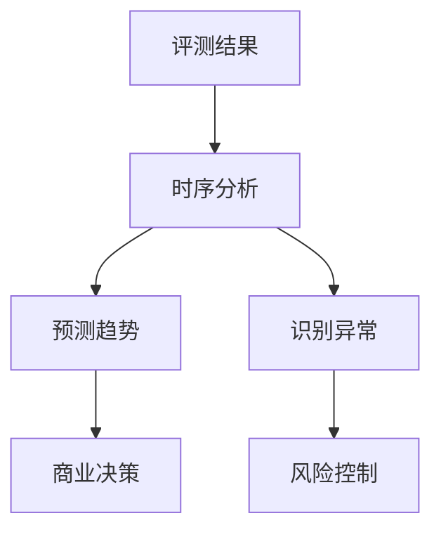

                 

### 第1章 引言

#### 1.1 评测结果时序分析的重要性

评测结果的时序分析在众多领域都扮演着至关重要的角色。无论是商业决策、市场预测，还是产品优化、风险控制，时序分析都能够提供宝贵的洞察和指导。时序分析的基本目标是对时间序列数据进行建模和分析，从而预测未来的趋势和潜在的变化。这不仅仅是一个数据分析的问题，更是决策制定的重要依据。

在商业领域，时序分析可以帮助企业预测销售趋势、库存需求，从而优化供应链管理。例如，电商平台的订单量、退货率等数据都可以通过时序分析来进行预测，以便制定库存策略、营销计划和客户服务改进。这种分析能够提高企业的运营效率，减少成本，增加利润。

在金融市场，时序分析同样不可或缺。通过分析股票价格、交易量等时间序列数据，投资者可以识别市场的波动趋势，做出更明智的投资决策。金融风险管理者可以利用时序分析来预测潜在的市场风险，提前采取措施进行风险控制和规避。

此外，在公共卫生领域，时序分析可以用于传染病流行趋势的预测，为公共卫生决策提供科学依据。例如，通过对疫情数据的时间序列分析，可以预测病毒的传播速度和感染人数，从而指导疫情应对措施的制定。

#### 1.2 LLM在时序分析中的应用

近年来，大型语言模型（LLM）的迅猛发展为其在时序分析中的应用提供了可能。LLM是一类基于深度学习技术的语言模型，通过对大量文本数据进行训练，能够捕捉到语言和数据的复杂模式和结构。这种能力使得LLM在处理非结构化数据和时间序列数据时表现出色。

在时序分析中，LLM的应用主要体现在以下几个方面：

1. **时间序列预测**：LLM可以用于预测时间序列数据未来的值。例如，通过训练LLM模型，可以预测未来的股票价格、气温变化等。LLM在处理高维度、非线性时间序列数据时，通常能够比传统方法获得更高的预测准确性。

2. **趋势识别**：LLM可以帮助识别时间序列数据中的趋势和周期性模式。在金融市场，通过LLM分析历史交易数据，可以识别出市场的长期趋势和短期波动，从而指导投资策略。

3. **异常检测**：LLM还可以用于检测时间序列数据中的异常值。例如，在监控系统数据时，LLM可以通过学习正常的数据模式，识别出异常的流量或行为，从而帮助系统管理员及时发现和解决问题。

#### 1.3 本书结构

本书旨在系统地介绍评测结果的时序分析，并探讨如何利用LLM进行辅助分析。全书分为以下几个部分：

- **第1章 引言**：介绍评测结果时序分析的重要性和LLM在时序分析中的应用。

- **第2章 基础概念**：介绍评测结果时序分析、LLM基础和时序数据分析的基础知识。

- **第3章 LLM在时序分析中的应用**：探讨LLM在时间序列预测、趋势识别和异常检测中的应用。

- **第4章 时序数据分析方法**：介绍传统的时序数据分析方法和基于LLM的时序分析方法。

- **第5章 实战案例**：通过实际案例展示LLM在时序分析中的应用。

- **第6章 LLM优化策略**：讨论LLM模型的调优、训练和评估策略。

- **第7章 未来展望**：展望LLM在时序分析中的未来发展趋势。

通过本书的阅读，读者可以系统地了解评测结果时序分析的基本概念和方法，掌握LLM在时序分析中的应用，并能够将其应用于实际问题中，为决策提供有力支持。

---

**Mermaid 流程图示例**：

---

在接下来的章节中，我们将详细探讨评测结果时序分析的基本概念和方法，以及LLM在时序分析中的应用。通过理论和实践的深入探讨，我们将帮助读者更好地理解这一领域的核心知识和应用技巧。

---

**关键词**：
- 时序分析
- 评测结果
- 大型语言模型（LLM）
- 时间序列预测
- 趋势识别
- 异常检测

**摘要**：
本文系统地介绍了评测结果的时序分析，探讨了大型语言模型（LLM）在这一领域中的应用。通过分析评测结果时序分析的重要性，以及LLM的基础知识和应用，本文为读者提供了全面的时序分析理论和实践指导。本文旨在帮助读者深入理解评测结果时序分析的基本概念和方法，掌握LLM在时序分析中的应用技巧，并能够将其应用于实际问题中，为决策提供有力支持。

