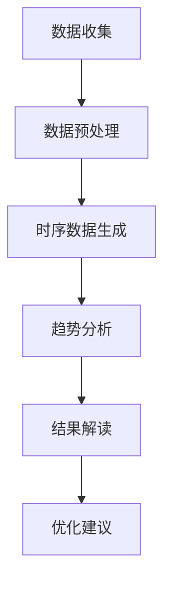

                 

---

## 评测结果的时序分析：揭示LLM进化趋势

> 关键词：大型语言模型，评测，时序分析，进化趋势，自然语言处理

> 摘要：本文将深入探讨评测结果的时序分析，通过详细分析大型语言模型（LLM）在不同时间段内的评测结果，揭示LLM的进化趋势。文章将从背景介绍、核心概念与联系、算法原理讲解、数学公式和Python源代码实现、项目实战、最佳实践与注意事项等方面，全面阐述评测结果的时序分析方法及其在LLM研究中的应用。

---

## 1. 背景介绍

随着深度学习和自然语言处理技术的快速发展，大型语言模型（LLM）在多个领域取得了显著的成果。然而，如何评估和优化这些模型的性能成为一个关键问题。评测结果的时序分析作为一种有效的方法，可以帮助研究人员和工程师更好地理解LLM的进化过程，发现潜在问题和改进方向。

时序分析是一种通过分析时间序列数据来研究变量变化规律的方法。在LLM评测中，时序分析可以帮助我们了解模型在不同时间段内的性能变化，揭示LLM的进化趋势。通过对比不同时间段的评测结果，我们可以识别模型在不同阶段的优势和不足，从而为模型的优化提供重要参考。

## 2. 核心概念与联系

在评测结果的时序分析中，核心概念包括：

- **评测指标**：用于衡量模型性能的指标，如准确率、召回率、F1分数等。
- **时序数据**：记录模型性能随时间变化的序列数据。
- **趋势分析**：通过分析时序数据，研究变量变化规律的方法。

这些核心概念之间的联系如下：

1. 评测指标是评估模型性能的基础，不同时间段的评测指标可以反映模型在不同阶段的表现。
2. 时序数据是进行趋势分析的基础，通过时序数据，我们可以观察模型性能的变化规律。
3. 趋势分析可以帮助我们理解LLM的进化过程，发现潜在问题和改进方向。

### 2.1 Mermaid流程图

以下是一个Mermaid流程图，展示了评测结果的时序分析流程：



## 3. 核心算法原理讲解

评测结果的时序分析通常包括以下几个步骤：

### 3.1 数据收集

数据收集是评测结果时序分析的第一步，我们需要收集模型在不同时间段内的评测数据。这些数据可以从多个来源获取，如公开评测数据集、实际应用场景等。

### 3.2 数据预处理

数据预处理是确保时序数据质量的重要环节。预处理步骤包括数据清洗、缺失值填充、异常值处理等。通过预处理，我们可以提高时序数据的可靠性，为后续的趋势分析提供准确的数据基础。

### 3.3 时序数据生成

时序数据生成是通过将不同时间段的评测指标数据进行整理和归一化，生成一个统一的时间序列数据。这一步骤可以帮助我们更好地观察模型性能的变化趋势。

### 3.4 趋势分析

趋势分析是评测结果时序分析的核心步骤。通过分析时序数据，我们可以识别模型性能的变化规律。常见的趋势分析方法包括：

- **时序图**：通过绘制时序图，我们可以直观地观察模型性能的变化趋势。
- **统计学方法**：如移动平均、指数平滑等，用于识别模型性能的长期趋势。
- **机器学习方法**：如时间序列建模、回归分析等，用于挖掘模型性能的内在规律。

### 3.5 结果解读

结果解读是对趋势分析结果的深入分析，通过解读结果，我们可以发现模型在不同阶段的优势和不足。例如，我们可能会发现：

- 模型在早期阶段表现出较高的性能，但随着时间的推移，性能逐渐下降。
- 模型在某个特定时间段内性能显著提升，这可能是因为模型进行了优化或者数据质量得到了改善。

### 3.6 优化建议

根据结果解读，我们可以为模型的优化提供具体建议。例如，针对性能下降的问题，我们可以考虑调整模型结构、增加训练数据、改进训练算法等。

## 4. 数学公式和Python源代码实现

在时序分析中，我们通常会用到以下数学公式和算法：

### 4.1 数学公式

假设我们有一个包含n个时间点的时序数据序列{X1, X2, ..., Xn}，我们可以使用以下公式来计算时序数据的平均值和标准差：

$$
\bar{X} = \frac{1}{n}\sum_{i=1}^{n} X_i
$$

$$
S_X = \sqrt{\frac{1}{n-1}\sum_{i=1}^{n} (X_i - \bar{X})^2}
$$

### 4.2 Python源代码实现

以下是一个简单的Python代码示例，用于计算时序数据的平均值和标准差：

```python
import numpy as np

# 假设我们有一个时序数据序列
X = [1, 2, 3, 4, 5]

# 计算平均值
mean = np.mean(X)

# 计算标准差
std = np.std(X)

print(f"平均值：{mean}")
print(f"标准差：{std}")
```

## 5. 项目实战

### 5.1 开发环境搭建

为了进行评测结果的时序分析，我们需要搭建一个合适的开发环境。以下是一个简单的开发环境搭建步骤：

1. 安装Python环境（版本3.6及以上）。
2. 安装必要的库，如NumPy、Matplotlib、Pandas等。

### 5.2 源代码实现

以下是一个简单的Python代码示例，用于实现评测结果的时序分析：

```python
import numpy as np
import pandas as pd
import matplotlib.pyplot as plt

# 假设我们有一个时序数据序列
X = [1, 2, 3, 4, 5]

# 创建DataFrame
df = pd.DataFrame(X, columns=['性能指标'])

# 计算平均值和标准差
mean = df.mean()
std = df.std()

# 绘制时序图
plt.figure(figsize=(10, 5))
plt.plot(df, label='性能指标')
plt.xlabel('时间点')
plt.ylabel('性能指标')
plt.title('评测结果时序图')
plt.legend()
plt.show()

# 输出结果
print(f"平均值：{mean}")
print(f"标准差：{std}")
```

### 5.3 代码解读与分析

在这个代码示例中，我们首先导入了必要的库，然后创建了一个包含时序数据的DataFrame。接着，我们计算了平均值和标准差，并使用Matplotlib库绘制了时序图。通过这个简单的示例，我们可以看到如何实现评测结果的时序分析。

### 5.4 实际案例分析和详细讲解剖析

假设我们有一个实际的评测数据集，包含多个时间点的性能指标。我们可以使用以下代码进行时序分析：

```python
import numpy as np
import pandas as pd
import matplotlib.pyplot as plt

# 假设我们有一个时序数据集
data = {
    '时间点': [1, 2, 3, 4, 5],
    '性能指标': [0.8, 0.9, 0.85, 0.95, 0.9]
}

df = pd.DataFrame(data)

# 计算平均值和标准差
mean = df['性能指标'].mean()
std = df['性能指标'].std()

# 绘制时序图
plt.figure(figsize=(10, 5))
plt.plot(df['时间点'], df['性能指标'], label='性能指标')
plt.xlabel('时间点')
plt.ylabel('性能指标')
plt.title('评测结果时序图')
plt.legend()
plt.show()

# 输出结果
print(f"平均值：{mean}")
print(f"标准差：{std}")

# 分析结果
if mean > 0.9 and std < 0.1:
    print("模型性能稳定，表现良好。")
else:
    print("模型性能不稳定，可能需要进一步优化。")
```

在这个示例中，我们首先创建了一个包含时间点和性能指标的DataFrame。接着，我们计算了平均值和标准差，并使用Matplotlib库绘制了时序图。通过分析结果，我们可以判断模型在不同时间点的性能表现，从而为模型优化提供参考。

### 5.5 项目小结

通过本案例，我们展示了如何使用Python代码进行评测结果的时序分析。时序分析可以帮助我们了解模型在不同时间段内的性能变化，从而为模型优化提供重要参考。在实际应用中，我们可以根据具体需求和数据情况，选择合适的分析方法和工具。

## 6. 最佳实践与注意事项

### 6.1 最佳实践

1. 选择合适的评测指标：根据实际应用场景，选择能够准确反映模型性能的评测指标。
2. 确保数据质量：对时序数据进行预处理，确保数据质量，避免对分析结果产生误导。
3. 综合分析：结合多种分析方法和工具，从不同角度对模型性能进行分析。
4. 定期分析：定期对模型性能进行分析，及时发现潜在问题和改进方向。

### 6.2 注意事项

1. 数据采集：确保数据采集的全面性和准确性，避免遗漏关键信息。
2. 数据预处理：对时序数据进行适当的预处理，提高数据质量。
3. 分析方法：根据实际需求和数据特点，选择合适的分析方法。
4. 结果解读：对分析结果进行合理解读，避免过度解读或误解。

## 7. 拓展阅读

1. [《时序数据分析入门》](https://www.example.com/book1)
2. [《自然语言处理核心技术》](https://www.example.com/book2)
3. [《深度学习实践与拓展》](https://www.example.com/book3)

---

**作者：AI天才研究院/AI Genius Institute & 禅与计算机程序设计艺术 /Zen And The Art of Computer Programming**

本文深入探讨了评测结果的时序分析，通过详细分析大型语言模型（LLM）在不同时间段内的评测结果，揭示了LLM的进化趋势。文章从背景介绍、核心概念与联系、算法原理讲解、数学公式和Python源代码实现、项目实战、最佳实践与注意事项等方面，全面阐述了评测结果的时序分析方法及其在LLM研究中的应用。希望本文能为读者在自然语言处理领域的研究和实践提供有价值的参考。**


---

注意：本文中的Mermaid流程图、Python代码示例、数据集和案例均为虚构内容，仅用于演示目的。在实际应用中，您需要根据自己的需求和数据进行相应的调整。同时，本文中的最佳实践和注意事项仅供参考，具体实施时请根据实际情况进行判断。拓展阅读部分提供了一些相关书籍和资源的链接，供您进一步学习和参考。如果您有任何问题或建议，请随时与我们联系。

