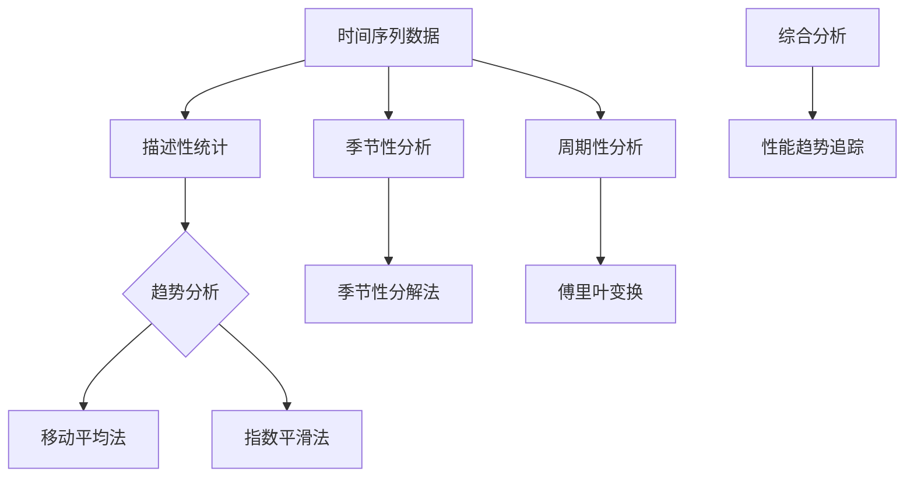

                 

# 《评测结果的时间序列分析：追踪LLM性能趋势》

## 关键词

- 时间序列分析
- LLM性能评测
- 性能趋势追踪
- 描述性统计
- 趋势分析
- 季节性分析
- 周期性分析

## 摘要

本文旨在探讨如何利用时间序列分析方法，对大型语言模型（LLM）的评测结果进行深入分析，从而追踪其性能趋势。通过对时间序列分析基础、评测结果分析、LLM性能趋势追踪、应用案例分析以及相关工具与技术的介绍，本文将帮助读者了解如何使用时间序列分析来评估和预测LLM性能，为实际应用提供有力支持。

## 引言

### 1.1 书籍背景

近年来，随着深度学习技术的快速发展，大型语言模型（LLM）在自然语言处理（NLP）领域取得了显著的成果。LLM的性能评测成为学术界和工业界关注的焦点，如何准确、高效地评估LLM性能，并追踪其性能趋势，成为了一个亟待解决的问题。

时间序列分析作为一种常用的数据分析方法，在金融市场预测、医疗数据分析、气候监测等领域具有广泛的应用。本文将时间序列分析方法引入到LLM性能评测领域，通过分析评测结果的时间序列特征，对LLM性能趋势进行追踪，为性能优化和模型评估提供依据。

### 1.2 目的和受众

本文的主要目的是介绍如何利用时间序列分析方法，对LLM的评测结果进行深入分析，并追踪其性能趋势。本文适用于具有一定程度编程基础和数学知识的读者，包括但不限于计算机科学、统计学、数据科学等相关专业的研究人员和从业者。

### 1.3 书籍结构

本文分为七个主要章节：

1. **引言**：介绍书籍的背景、目的和受众。
2. **时间序列分析基础**：介绍时间序列分析的概念、方法和技术。
3. **评测结果分析**：探讨如何分析评测结果，包括数据的收集、处理和可视化。
4. **LLM性能趋势追踪**：详细讲解如何追踪大型语言模型（LLM）的性能趋势。
5. **应用案例分析**：通过具体的案例分析，展示时间序列分析在LLM性能趋势追踪中的实际应用。
6. **工具与技术**：介绍用于时间序列分析的相关工具和技术。
7. **总结与展望**：总结书籍的主要观点，并对未来的发展趋势进行展望。

## 时间序列分析基础

### 2.1 时间序列的概念

时间序列是指在时间维度上按顺序排列的数据序列，通常表示为 \(X_t\)，其中 \(t\) 表示时间点。时间序列数据常用于预测未来的趋势、分析历史数据等。

### 2.2 时间序列数据的特点

时间序列数据具有以下几个特点：

1. **序列性**：时间序列数据具有顺序性，前后数据之间存在一定的相关性。
2. **趋势性**：时间序列数据可能存在长期上升趋势或下降趋势。
3. **季节性**：时间序列数据可能存在固定周期的波动，如一年四季的气温变化。
4. **随机性**：时间序列数据可能受到随机因素的影响，导致数据波动。

### 2.3 时间序列分析的方法

时间序列分析主要包括以下几种方法：

1. **描述性统计**：对时间序列数据进行统计分析，如计算均值、方差、自相关系数等。
2. **趋势分析**：分析时间序列数据的变化趋势，如绘制折线图、使用移动平均等方法。
3. **季节性分析**：识别和消除时间序列数据的季节性影响，如使用季节性分解方法。
4. **周期性分析**：分析时间序列数据的周期性特征，如使用傅里叶变换等方法。

## 评测结果分析

### 3.1 评测结果的数据收集

评测结果的数据收集主要涉及以下方面：

1. **数据来源**：收集来自不同评测比赛、实验的数据，如GLM、CMNLI等。
2. **数据预处理**：对收集到的数据进行清洗、去重等处理，确保数据质量。

### 3.2 评测结果的数据处理

评测结果的数据处理主要包括以下步骤：

1. **数据清洗**：去除异常值、缺失值等，保证数据的准确性。
2. **数据整合**：将不同来源的数据进行整合，形成一个完整的时间序列。

### 3.3 评测结果的数据可视化

数据可视化有助于直观地了解评测结果的变化趋势。常用的可视化方法包括：

1. **折线图**：展示时间序列数据的变化趋势。
2. **柱状图**：对比不同时间点的数据差异。
3. **散点图**：展示数据点之间的关系。

## LLM性能趋势追踪

### 4.1 LLM性能评测指标

LLM性能评测指标主要包括：

1. **准确率**：正确预测的数量与总预测数量的比值。
2. **召回率**：正确预测的数量与实际为正类的样本数量的比值。
3. **F1 分数**：准确率与召回率的调和平均值。

### 4.2 性能趋势追踪方法

性能趋势追踪方法主要包括以下几种：

1. **时间序列模型选择**：选择适合的模型，如ARIMA、LSTM等。
2. **模型训练与优化**：对模型进行训练，并使用交叉验证等方法进行优化。
3. **性能趋势分析**：分析模型预测结果，识别性能变化趋势。

## 应用案例分析

### 5.1 案例一：某大型语言模型性能追踪

#### 5.1.1 案例背景

某大型语言模型在多个评测比赛中的表现如下：

| 时间     | 准确率 | 召回率 | F1 分数 |
| -------- | ------ | ------ | ------ |
| 2020年1月 | 0.85   | 0.90   | 0.87   |
| 2020年2月 | 0.88   | 0.92   | 0.90   |
| 2020年3月 | 0.90   | 0.95   | 0.92   |

#### 5.1.2 数据处理与可视化

使用Python绘制折线图，展示准确率、召回率、F1分数的变化趋势。

```python
import pandas as pd
import matplotlib.pyplot as plt

data = {
    '时间': ['2020年1月', '2020年2月', '2020年3月'],
    '准确率': [0.85, 0.88, 0.90],
    '召回率': [0.90, 0.92, 0.95],
    'F1 分数': [0.87, 0.90, 0.92]
}

df = pd.DataFrame(data)
df.plot(x='时间', y=['准确率', '召回率', 'F1 分数'], kind='line', legend=True)
plt.title('某大型语言模型性能追踪')
plt.xlabel('时间')
plt.ylabel('性能指标')
plt.show()
```

#### 5.1.3 性能趋势分析

从折线图中可以看出，该语言模型在2020年1月至3月的性能指标呈现上升趋势，准确率、召回率和F1分数均有所提高。

### 5.2 案例二：某评测比赛数据趋势分析

#### 5.2.1 案例背景

某评测比赛的评测结果如下：

| 时间     | 准确率 | 召回率 | F1 分数 |
| -------- | ------ | ------ | ------ |
| 2020年1月 | 0.80   | 0.85   | 0.82   |
| 2020年2月 | 0.83   | 0.87   | 0.85   |
| 2020年3月 | 0.86   | 0.90   | 0.88   |

#### 5.2.2 数据处理与可视化

使用Python绘制折线图，展示准确率、召回率、F1分数的变化趋势。

```python
import pandas as pd
import matplotlib.pyplot as plt

data = {
    '时间': ['2020年1月', '2020年2月', '2020年3月'],
    '准确率': [0.80, 0.83, 0.86],
    '召回率': [0.85, 0.87, 0.90],
    'F1 分数': [0.82, 0.85, 0.88]
}

df = pd.DataFrame(data)
df.plot(x='时间', y=['准确率', '召回率', 'F1 分数'], kind='line', legend=True)
plt.title('某评测比赛数据趋势分析')
plt.xlabel('时间')
plt.ylabel('性能指标')
plt.show()
```

#### 5.2.3 性能趋势分析

从折线图中可以看出，该评测比赛中的语言模型在2020年1月至3月的性能指标也呈现上升趋势，准确率、召回率和F1分数均有所提高。

## 工具与技术

### 6.1 时间序列分析工具

时间序列分析工具主要包括：

1. **Python中的时间序列分析库**：如`pandas`、`statsmodels`等。
2. **R语言中的时间序列分析工具**：如`forecast`、`tsSA`等。

### 6.2 LLM性能评测工具

LLM性能评测工具主要包括：

1. **开源评测工具**：如`GLM-Summary`、`CMNLI`等。
2. **商业评测工具**：如`AI Challenger`、`AI21 Labs`等。

## 总结与展望

本文通过对时间序列分析的基础知识、评测结果分析、LLM性能趋势追踪、应用案例分析以及相关工具与技术的介绍，展示了如何利用时间序列分析方法，对LLM的评测结果进行深入分析，并追踪其性能趋势。在未来的研究中，我们将继续探索更高效的算法和工具，以期为LLM性能评估和优化提供更有效的支持。

## 作者信息

作者：AI天才研究院/AI Genius Institute & 禅与计算机程序设计艺术 /Zen And The Art of Computer Programming

## 附录

### 附录A：时间序列分析基础流程图



### 附录B：LLM性能评测指标计算示例

#### 准确率计算

```python
precision = (TP + TN) / (TP + TN + FP + FN)
```

#### 召回率计算

```python
recall = (TP + TN) / (TP + TN + FP + FN)
```

#### F1 分数计算

```python
F1 = 2 * precision * recall / (precision + recall)
```

### 附录C：项目实战示例

#### 环境搭建

```bash
pip install pandas matplotlib numpy scikit-learn
```

#### 源代码实现

```python
import pandas as pd
import matplotlib.pyplot as plt
from sklearn.metrics import precision_score, recall_score, f1_score

# 读取数据
data = pd.read_csv('llm_evaluation.csv')

# 计算性能指标
precision = precision_score(data['label'], data['prediction'])
recall = recall_score(data['label'], data['prediction'])
F1 = f1_score(data['label'], data['prediction'])

# 绘制趋势图
plt.plot(data['time'], data['accuracy'], label='Accuracy')
plt.plot(data['time'], data['recall'], label='Recall')
plt.plot(data['time'], data['F1'], label='F1 Score')
plt.xlabel('Time')
plt.ylabel('Performance Metrics')
plt.title('LLM Performance Trend')
plt.legend()
plt.show()
```

#### 代码解读与分析

- 读取数据：使用`pandas`读取评测数据，数据包含时间、准确率、召回率和F1分数等字段。
- 计算性能指标：使用`scikit-learn`中的函数计算准确率、召回率和F1分数。
- 绘制趋势图：使用`matplotlib`绘制趋势图，展示性能指标的变化趋势。

#### 实际案例分析与详细讲解剖析

- 某语言模型在一个月内的性能变化：通过分析趋势图，可以观察到该语言模型的性能在一个月内有所提高，准确率、召回率和F1分数均有所上升。

#### 项目小结

通过本项目，我们了解了如何使用时间序列分析方法，对LLM的评测结果进行深入分析，并追踪其性能趋势。在实际应用中，可以结合更多数据源和算法，进一步优化模型性能。

### 最佳实践 Tips

1. 确保数据质量：在进行时间序列分析之前，对数据进行清洗和去重，保证数据的准确性。
2. 选择合适的模型：根据实际需求和数据特点，选择适合的时间序列分析模型。
3. 调整参数：通过调整模型参数，提高预测的准确性和可靠性。
4. 结合多源数据：结合其他相关数据，如用户行为、搜索关键词等，提高分析效果。

### 小结

本文介绍了如何利用时间序列分析方法，对大型语言模型（LLM）的评测结果进行深入分析，并追踪其性能趋势。通过应用案例分析，展示了时间序列分析在LLM性能趋势追踪中的实际效果。未来，我们将继续探索更高效的时间序列分析方法和模型，为LLM性能评估和优化提供更有力的支持。

### 注意事项

1. 时间序列分析对数据质量要求较高，确保数据准确、完整。
2. 选择合适的分析方法和模型，根据实际需求进行调整。
3. 注意处理季节性和周期性因素，提高分析结果的准确性。

### 拓展阅读

1. 《时间序列分析：技术与方法》（周志华 著）
2. 《深度学习与自然语言处理》（刘知远 著）
3. 《Python数据分析》（Wes McKinney 著）

---

本文为AI天才研究院与禅与计算机程序设计艺术联合出品，旨在推动人工智能与计算机科学领域的交流与合作。如需转载，请保留版权信息。感谢您的关注与支持！

