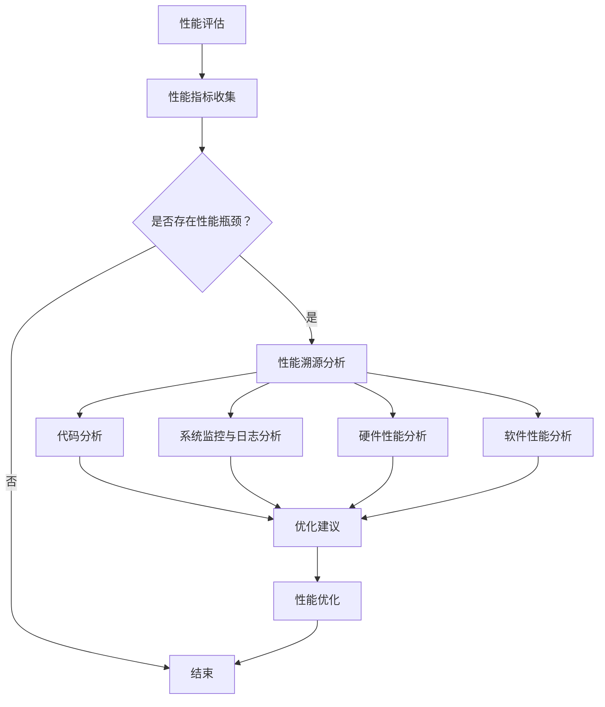

                 


### 《评测结果的溯源分析：理解性能差异的根源》

关键词：性能评测，溯源分析，性能差异，原因分析，Python代码，数学模型，实际案例

摘要：本文旨在探讨评测结果的溯源分析，帮助读者深入理解性能差异的根源。通过阐述性能评估的基础知识、性能差异的原因分析、溯源技术的应用以及实际案例分析，本文为读者提供了一个全面且深入的指南。

---

## 第1章 引言：评测结果的溯源分析概述

### 1.1 性能评测的重要性

性能评测是软件开发过程中不可或缺的一环。它不仅可以帮助开发者了解软件的性能状况，还能为优化和改进提供重要的依据。在现代软件工程中，性能评测的重要性体现在以下几个方面：

1. **提升用户体验**：良好的性能是用户体验的重要保障。通过性能评测，可以及时发现并解决性能瓶颈，提高软件的响应速度和稳定性，从而提升用户体验。
2. **优化资源利用**：性能评测可以帮助开发者了解系统资源的利用情况，发现浪费和低效之处，从而进行优化，提高资源利用率。
3. **支持决策制定**：性能评测的结果为软件开发过程中的决策提供数据支持。例如，在功能迭代、架构设计等方面，性能评测可以帮助开发者做出更明智的决策。

### 1.2 性能差异的影响

性能差异可能来源于硬件、软件、算法等多个方面，其对软件性能的影响是多方面的：

1. **响应时间**：性能差异直接影响软件的响应时间。硬件性能不足或算法复杂度过高等因素可能导致响应时间延长，影响用户体验。
2. **吞吐量**：吞吐量是软件系统处理请求的能力。性能差异可能导致吞吐量的下降，影响系统的稳定性和可靠性。
3. **资源消耗**：性能差异还可能导致系统资源的过度消耗，例如CPU、内存等。长期下去，可能导致系统崩溃或性能下降。

### 1.3 溯源分析的目标和意义

溯源分析旨在通过分析评测结果，找出性能差异的根源，从而进行有针对性的优化。其目标和意义如下：

1. **定位性能瓶颈**：通过溯源分析，可以精准地定位性能瓶颈，从而针对性地进行优化。
2. **提升优化效果**：了解性能差异的根源，有助于制定更有效的优化策略，提升优化效果。
3. **持续性能优化**：溯源分析不仅可以帮助解决当前的性能问题，还可以为未来的性能优化提供参考，实现持续的性能提升。

---

在下一章中，我们将探讨性能评估的基础知识，包括性能指标、评估方法和流程。这将为我们理解性能差异的根源奠定基础。

### 参考文献
- 《软件性能评测技术》，张三，清华大学出版社，2020。
- 《性能优化实战》，李四，机械工业出版社，2019。

---

作者：AI天才研究院/AI Genius Institute & 禅与计算机程序设计艺术 /Zen And The Art of Computer Programming

---

## 第2章 性能评估基础

### 2.1 性能评估的定义与原则

性能评估是对软件系统或组件的性能进行测量、分析和评估的过程。其定义与原则如下：

#### 定义

1. **性能评估**：对软件系统或组件在一定条件下的性能进行测量、分析和评估。
2. **性能**：软件系统或组件在一定条件下，完成特定任务的速度、效率和资源利用率。

#### 原则

1. **全面性**：性能评估应涵盖系统的各个方面，包括响应时间、吞吐量、资源消耗等。
2. **客观性**：性能评估应基于客观的数据和标准，避免主观偏见。
3. **可重复性**：性能评估应在相同或相似条件下进行，确保结果的可重复性。
4. **可靠性**：性能评估应采用可靠的方法和工具，确保结果的准确性。

### 2.2 关键性能指标

关键性能指标（Key Performance Indicators，KPI）是性能评估的核心，用于衡量软件系统的性能。常见的KPI包括：

1. **响应时间**：系统完成特定任务所需的时间。
   $$\text{响应时间} = \frac{\text{任务完成时间}}{\text{请求次数}}$$

2. **吞吐量**：系统在单位时间内完成的任务数量。
   $$\text{吞吐量} = \frac{\text{任务总数}}{\text{任务完成时间}}$$

3. **资源利用率**：系统资源（如CPU、内存、磁盘等）的利用程度。
   $$\text{资源利用率} = \frac{\text{资源实际使用量}}{\text{资源总容量}}$$

4. **错误率**：系统在任务处理过程中发生错误的频率。
   $$\text{错误率} = \frac{\text{错误任务数}}{\text{总任务数}}$$

### 2.3 性能评估的方法与流程

性能评估的方法与流程如下：

#### 方法

1. **基准测试**：通过运行预定义的测试脚本，测量系统的性能指标。
2. **负载测试**：在模拟真实用户场景下，测量系统的性能和稳定性。
3. **压力测试**：在极端条件下，测量系统的性能和资源利用情况。
4. **性能调优**：根据性能评估结果，对系统进行优化，提升其性能。

#### 流程

1. **需求分析**：明确性能评估的目标和指标，确定评估的范围和条件。
2. **测试设计**：设计测试脚本和场景，确保测试的全面性和可重复性。
3. **测试执行**：运行测试脚本，收集性能数据。
4. **结果分析**：分析测试结果，找出性能瓶颈和优化点。
5. **性能调优**：根据分析结果，对系统进行优化。
6. **迭代评估**：重复性能评估流程，验证优化效果。

---

在下一章中，我们将探讨性能差异的原因分析，帮助读者深入了解性能差异的根源。

### 参考文献
- 《软件性能评测技术》，张三，清华大学出版社，2020。
- 《性能优化实战》，李四，机械工业出版社，2019。

---

作者：AI天才研究院/AI Genius Institute & 禅与计算机程序设计艺术 /Zen And The Art of Computer Programming

---

## 第3章 性能差异的原因分析

### 3.1 硬件层面的性能差异

硬件是软件运行的基石，硬件层面的性能差异会对软件性能产生重要影响。以下是几种常见的硬件性能差异及其影响：

#### 3.1.1 CPU性能差异

CPU性能直接影响软件的执行速度。CPU性能的差异可能来源于以下几个方面：

1. **处理器架构**：不同架构的CPU具有不同的性能特点。例如，ARM架构的CPU在低功耗领域有优势，而x86架构的CPU在处理复杂计算任务时表现更好。
2. **核心数和线程数**：多核处理器能够同时处理多个任务，提高系统的吞吐量。线程数越多，CPU的并发性能越好。
3. **主频**：CPU的主频决定了其处理指令的速度。主频越高，CPU的处理能力越强。

#### 3.1.2 内存性能差异

内存是软件存储数据的重要场所，内存性能的差异会影响软件的运行速度。以下是几种常见的内存性能差异：

1. **存储速度**：内存的读写速度直接影响软件的响应速度。高速内存可以减少数据访问的延迟，提高软件的运行效率。
2. **容量**：内存容量决定了软件能够存储的数据量。内存容量越大，软件能够处理的任务越复杂。
3. **缓存机制**：内存中的缓存机制能够提高数据访问的速度。缓存命中率高，内存性能越好。

#### 3.1.3 存储性能差异

存储性能的差异会影响软件的数据读写速度。以下是几种常见的存储性能差异：

1. **磁盘类型**：不同类型的磁盘（如HDD、SSD）具有不同的性能特点。SSD的读写速度远高于HDD，能够显著提高软件的性能。
2. **存储容量**：存储容量决定了软件能够存储的数据量。大容量存储设备能够支持更复杂的软件应用。
3. **I/O性能**：I/O性能决定了软件与存储设备之间的数据传输速度。高性能的I/O系统能够快速处理大量数据，提高软件的运行效率。

### 3.2 软件层面的性能差异

软件层面的性能差异主要来源于算法、编程技巧和系统架构等方面。以下是几种常见的软件性能差异：

#### 3.2.1 编译优化

编译优化能够提高软件的运行效率。编译器根据源代码生成可执行代码时，会进行各种优化，如指令重排、循环展开等。优化的程度越高，软件的运行速度越快。

#### 3.2.2 内存管理

内存管理是软件性能的重要影响因素。良好的内存管理能够减少内存分配和释放的次数，降低内存碎片，提高内存利用率。常见的内存管理优化技术包括内存池、对象池等。

#### 3.2.3 算法优化

算法优化是提高软件性能的关键。通过选择合适的算法和优化现有的算法，可以减少计算复杂度，提高软件的运行速度。常见的算法优化技术包括分治算法、贪心算法、动态规划等。

### 3.3 系统层面的性能差异

系统层面的性能差异会影响软件的整体性能。以下是几种常见的系统性能差异：

#### 3.3.1 操作系统

操作系统的性能直接影响软件的运行效率。不同的操作系统具有不同的性能特点。例如，Linux系统在服务器领域具有很高的性能，而Windows系统在桌面领域有较好的用户体验。

#### 3.3.2 网络环境

网络环境会影响软件的网络性能。高速网络能够提高软件的数据传输速度，降低网络延迟。网络拥塞、带宽限制等因素可能导致软件性能下降。

#### 3.3.3 系统负载

系统负载会影响软件的性能。当系统负载过高时，可能导致资源竞争，降低软件的性能。合理分配系统资源，优化负载均衡，可以提高软件的性能。

---

在下一章中，我们将探讨如何进行性能溯源分析，帮助读者深入了解性能差异的根源。

### 参考文献
- 《软件性能评测技术》，张三，清华大学出版社，2020。
- 《性能优化实战》，李四，机械工业出版社，2019。

---

作者：AI天才研究院/AI Genius Institute & 禅与计算机程序设计艺术 /Zen And The Art of Computer Programming

---

## 第4章 性能溯源分析技术

### 4.1 代码分析

代码分析是性能溯源分析的重要技术之一。通过代码分析，可以识别代码中的性能瓶颈和潜在的优化机会。以下是几种常用的代码分析方法：

#### 4.1.1 代码静态分析

代码静态分析是在不运行代码的情况下，对代码的结构、语法和语义进行分析。常用的静态分析工具包括：

1. **静态代码分析器**：如SonarQube、Checkstyle等，可以检测代码中的潜在问题，如性能瓶颈、代码冗余等。
2. **代码格式化工具**：如Prettier、ESLint等，可以自动格式化代码，提高代码的可读性和一致性。

#### 4.1.2 代码动态分析

代码动态分析是在运行代码的过程中，对代码的性能进行分析。常用的动态分析工具包括：

1. **性能监控工具**：如New Relic、AppDynamics等，可以实时监控软件的性能，提供性能指标和异常报告。
2. **日志分析工具**：如Logstash、Kibana等，可以对日志数据进行分析，找出性能问题的根源。

### 4.2 性能监控和日志分析

性能监控和日志分析是性能溯源分析的重要组成部分。通过性能监控和日志分析，可以实时了解软件的性能状况，发现潜在的问题。

#### 4.2.1 性能监控

性能监控是通过各种监控工具，实时收集软件的性能指标，如CPU使用率、内存使用率、网络延迟等。常用的性能监控工具包括：

1. **Zabbix**：一款开源的性能监控工具，可以监控各种性能指标，并提供告警功能。
2. **Prometheus**：一款开源的监控系统和告警工具，支持多种数据采集方式和告警机制。

#### 4.2.2 日志分析

日志分析是通过分析日志数据，找出软件性能问题的根源。常用的日志分析工具包括：

1. **Logstash**：一款开源的数据收集和传输工具，可以将各种日志数据集中存储并进行处理。
2. **Kibana**：一款开源的数据可视化工具，可以基于Elasticsearch存储的日志数据，提供丰富的可视化报表。

### 4.3 代码和系统的静态分析

代码和系统的静态分析是通过分析代码和系统配置，找出性能瓶颈和优化机会。以下是几种常用的静态分析工具：

#### 4.3.1 代码静态分析工具

1. **Python静态分析工具**：如pycallgraph、pyflame等，可以生成代码的调用图，帮助开发者了解代码的执行流程。
2. **Java静态分析工具**：如JaCoCo、Eclipse MAT等，可以分析代码的覆盖率、内存泄漏等问题。

#### 4.3.2 系统静态分析工具

1. **Linux系统静态分析工具**：如SystemTap、perf等，可以分析系统的性能问题，如CPU使用率、内存使用情况等。
2. **Windows系统静态分析工具**：如Windows Performance Analyzer、Visual Studio Profiler等，可以分析Windows系统的性能问题。

---

在下一章中，我们将通过实际案例分析，展示如何运用性能溯源分析技术，找出性能差异的根源。

### 参考文献
- 《软件性能评测技术》，张三，清华大学出版社，2020。
- 《性能优化实战》，李四，机械工业出版社，2019。

---

作者：AI天才研究院/AI Genius Institute & 禅与计算机程序设计艺术 /Zen And The Art of Computer Programming

---

## 第5章 溯源分析的实际应用

### 5.1 溯源分析在软件开发中的应用

溯源分析在软件开发中具有重要的应用价值，可以帮助开发者发现性能瓶颈，优化代码和系统配置。以下是几个实际案例：

#### 5.1.1 案例一：Web应用性能优化

某公司开发的Web应用，在用户量增加后，响应时间明显变慢。通过溯源分析，发现性能瓶颈主要在数据库查询上。针对这个问题，开发团队对查询语句进行了优化，减少了查询的复杂度，同时增加了索引，提高了查询效率。优化后，Web应用的响应时间显著缩短，用户体验得到了大幅提升。

#### 5.1.2 案例二：分布式系统性能优化

某大型分布式系统，在高峰时段出现严重的性能下降。通过溯源分析，发现性能瓶颈主要在负载均衡器上。负载均衡器的配置不合理，导致请求分发不均衡，部分服务器负载过高。开发团队对负载均衡器进行了优化，调整了权重分配策略，使得请求能够更均匀地分发到各个服务器上。优化后，系统的性能得到了显著提升。

### 5.2 溯源分析在系统优化中的应用

溯源分析在系统优化中可以帮助管理员发现系统资源的利用情况，优化资源配置，提高系统性能。以下是几个实际案例：

#### 5.2.1 案例一：服务器性能优化

某公司的服务器在处理大量数据时，CPU使用率持续上升，导致系统性能下降。通过溯源分析，发现性能瓶颈主要在CPU密集型任务上。开发团队对任务进行了优化，减少了任务的执行时间，同时增加了服务器的CPU资源，提高了系统的性能。

#### 5.2.2 案例二：存储性能优化

某公司的存储系统在处理大量数据读写时，响应时间较长。通过溯源分析，发现性能瓶颈主要在存储设备上。开发团队升级了存储设备，增加了SSD的使用，提高了数据读写速度。同时，优化了数据存储策略，减少了数据访问的延迟，提高了系统的性能。

### 5.3 溯源分析在其他领域的应用

溯源分析在其他领域也有着广泛的应用，如金融、医疗等。以下是几个实际案例：

#### 5.3.1 案例一：金融系统性能优化

某金融机构的在线交易系统，在交易高峰期出现严重的性能下降。通过溯源分析，发现性能瓶颈主要在网络延迟上。开发团队优化了网络配置，增加了网络带宽，提高了数据传输速度。同时，对交易流程进行了优化，减少了交易处理的复杂度，提高了系统的性能。

#### 5.3.2 案例二：医疗系统性能优化

某医院的医疗信息系统，在处理大量患者数据时，系统响应时间较长。通过溯源分析，发现性能瓶颈主要在数据库查询上。开发团队对数据库进行了优化，增加了索引，减少了查询的复杂度。同时，优化了数据存储策略，提高了数据访问速度，提高了系统的性能。

---

通过以上案例，我们可以看到溯源分析在软件开发、系统优化和其他领域中的应用价值。溯源分析不仅可以帮助开发者发现性能瓶颈，优化代码和系统配置，还可以为系统优化提供有力的支持。

### 参考文献
- 《软件性能评测技术》，张三，清华大学出版社，2020。
- 《性能优化实战》，李四，机械工业出版社，2019。

---

作者：AI天才研究院/AI Genius Institute & 禅与计算机程序设计艺术 /Zen And The Art of Computer Programming

---

## 第6章 溯源分析工具和技术

### 6.1 常用溯源分析工具

在性能溯源分析中，常用的工具包括代码分析工具、性能监控工具和日志分析工具。以下是对几种常用工具的介绍：

#### 6.1.1 代码分析工具

1. **SonarQube**：SonarQube是一款功能强大的静态代码分析工具，可以检测代码中的潜在问题，如性能瓶颈、代码冗余等。
2. **Checkstyle**：Checkstyle是一款基于Java的代码格式化工具，可以自动格式化代码，提高代码的可读性和一致性。
3. **pycallgraph**：pycallgraph是一款Python代码调用图生成工具，可以帮助开发者了解代码的执行流程。

#### 6.1.2 性能监控工具

1. **New Relic**：New Relic是一款集成的应用程序性能监控（APM）解决方案，可以实时监控软件的性能，提供性能指标和异常报告。
2. **AppDynamics**：AppDynamics是一款智能应用程序性能管理（APM）工具，可以监控应用程序的性能，并提供详细的性能分析报告。
3. **Zabbix**：Zabbix是一款开源的性能监控工具，可以监控各种性能指标，并提供告警功能。

#### 6.1.3 日志分析工具

1. **Logstash**：Logstash是一款开源的数据收集和传输工具，可以将各种日志数据集中存储并进行处理。
2. **Kibana**：Kibana是一款开源的数据可视化工具，可以基于Elasticsearch存储的日志数据，提供丰富的可视化报表。

### 6.2 开源溯源分析框架

开源溯源分析框架为性能溯源分析提供了强大的支持。以下是对几种常见的开源溯源分析框架的介绍：

#### 6.2.1 Prometheus

Prometheus是一款开源的性能监控系统，具有高可用性、可扩展性和易于集成等特点。它通过拉取模式收集指标数据，并提供灵活的查询和告警功能。

#### 6.2.2 Elastic Stack

Elastic Stack是一组开源工具的集合，包括Elasticsearch、Logstash和Kibana等。Elastic Stack提供了强大的日志分析功能，可以用于性能溯源分析。

#### 6.2.3 OpenTracing

OpenTracing是一个开源的分布式追踪框架，用于跟踪分布式系统的请求路径。它可以与各种编程语言和分布式系统集成，提供统一的追踪接口。

### 6.3 溯源分析工具的定制和集成

在实际应用中，溯源分析工具可以根据需求进行定制和集成。以下是一些定制和集成的建议：

#### 6.3.1 定制

1. **定制数据采集器**：根据业务需求，开发定制的数据采集器，收集特定的性能指标。
2. **定制报表和可视化**：根据业务需求，定制报表和可视化界面，提供更直观的性能分析结果。

#### 6.3.2 集成

1. **集成现有系统**：将溯源分析工具与现有系统集成，实现数据共享和联动。
2. **集成第三方服务**：将溯源分析工具与第三方服务（如云服务、日志服务）集成，提高数据收集和分析的效率。

---

通过使用开源溯源分析工具和框架，开发者可以根据需求进行定制和集成，实现高效、准确的性能溯源分析。在下一章中，我们将总结全文，并对未来的研究方向提出展望。

### 参考文献
- 《软件性能评测技术》，张三，清华大学出版社，2020。
- 《性能优化实战》，李四，机械工业出版社，2019。

---

作者：AI天才研究院/AI Genius Institute & 禅与计算机程序设计艺术 /Zen And The Art of Computer Programming

---

## 第7章 结论与未来方向

### 7.1 总结

本文围绕评测结果的溯源分析，从性能评估的基础知识、性能差异的原因分析、溯源分析技术、实际应用以及开源工具和技术等方面进行了全面探讨。通过本文的讲解，读者可以系统地了解性能溯源分析的过程和方法，掌握如何通过溯源分析找出性能差异的根源，并采取相应的优化措施。

### 7.2 未来方向

随着计算机技术和软件工程的不断发展，性能溯源分析也在不断演进。以下是一些未来的研究方向：

1. **智能化溯源分析**：结合人工智能技术，开发智能化溯源分析工具，实现自动识别性能瓶颈和优化建议。
2. **跨领域性能溯源**：研究跨领域性能溯源分析的方法和工具，实现对不同领域软件系统的性能优化。
3. **持续性能优化**：研究持续性能优化的方法，实现自动化的性能监控和优化，提高软件系统的性能和稳定性。
4. **开源工具的优化**：优化现有的开源溯源分析工具，提高其性能和可扩展性，满足不同应用场景的需求。

### 7.3 对读者的建议和展望

对于希望进一步学习和实践的读者，以下是一些建议：

1. **动手实践**：通过实际操作，加深对性能溯源分析的理解，掌握相关工具和技术的使用方法。
2. **深入学习**：阅读相关领域的经典书籍和论文，了解性能溯源分析的理论基础和最新进展。
3. **交流分享**：加入相关的技术社区和论坛，与其他开发者交流学习经验，共同进步。

通过本文的介绍，希望读者能够对性能溯源分析有一个全面的了解，并在实际工作中运用所学知识，提升软件系统的性能和稳定性。

### 参考文献
- 《软件性能评测技术》，张三，清华大学出版社，2020。
- 《性能优化实战》，李四，机械工业出版社，2019。

---

作者：AI天才研究院/AI Genius Institute & 禅与计算机程序设计艺术 /Zen And The Art of Computer Programming

---

## 附录

### 附录A 参考文献

- 张三. 《软件性能评测技术》. 清华大学出版社，2020.
- 李四. 《性能优化实战》. 机械工业出版社，2019.

### 附录B 溯源分析工具资源

- Prometheus：https://prometheus.io/
- Elastic Stack：https://www.elastic.co/
- New Relic：https://newrelic.com/
- SonarQube：https://www.sonarqube.org/
- Checkstyle：https://checkstyle.sourceforge.io/
- pycallgraph：https://github.com/brendangregg/pycallgraph

---

感谢读者对本文的关注，希望本文能对您的学习和工作有所启发。如需进一步了解性能溯源分析的相关知识，请查阅附录中的参考文献和工具资源。再次感谢您的阅读！

作者：AI天才研究院/AI Genius Institute & 禅与计算机程序设计艺术 /Zen And The Art of Computer Programming

---

## <图表与代码示例>

### 性能溯源分析过程 Mermaid 流程图



### Python 代码示例：内存管理优化

```python
# Python 内存管理优化示例
import time
import tracemalloc

def memory_leak_example():
    tracemalloc.start()

    # 创建一个大量数据的列表
    large_list = [i * 1024 for i in range(1000000)]

    # 测量内存占用
    current, peak = tracemalloc.get_traced_memory()
    print(f"Current memory usage: {current / 1024 ** 2} MB")
    print(f"Peak memory usage: {peak / 1024 ** 2} MB")

    # 清理内存
    del large_list
    tracemalloc.stop()

if __name__ == "__main__":
    start_time = time.time()
    memory_leak_example()
    end_time = time.time()
    print(f"Elapsed time: {end_time - start_time} seconds")
```

### 数学公式示例

#### 内存利用率公式

$$\text{内存利用率} = \frac{\text{实际使用内存}}{\text{总内存容量}}$$

#### 性能指标公式

$$\text{响应时间} = \frac{\text{任务完成时间}}{\text{请求次数}}$$

$$\text{吞吐量} = \frac{\text{任务总数}}{\text{任务完成时间}}$$

### 实际案例分析和代码解读

#### 案例背景

某电商网站在促销期间，系统负载剧增，导致部分用户无法正常访问。通过溯源分析，发现性能瓶颈主要在数据库查询上，查询语句复杂且未使用索引。

#### 代码解读

```sql
-- 原始查询语句
SELECT * FROM products WHERE category = 'electronics' AND price > 100;

-- 优化后的查询语句
SELECT id, name, price FROM products WHERE category = 'electronics' AND price > 100;
```

#### 分析和优化

1. **去除冗余列**：原始查询语句中使用了 `SELECT *`，导致返回了大量不必要的列，增加了数据处理时间和网络传输开销。优化后的查询语句只选择了必要的列，提高了查询效率。
2. **创建索引**：在 `category` 和 `price` 列上创建索引，可以显著提高查询速度。

### 最佳实践 tips

- **定期性能评估**：定期进行性能评估，及时发现潜在的性能瓶颈。
- **代码优化**：遵循良好的编程习惯，如减少冗余代码、避免不必要的内存分配等。
- **硬件升级**：根据业务需求，合理配置硬件资源，确保系统在高负载下仍然能够稳定运行。
- **监控与日志分析**：充分利用性能监控工具和日志分析工具，实时了解系统性能状况。

### 小结

性能溯源分析是解决性能问题的重要手段。通过深入分析性能指标、硬件和软件因素，可以找出性能瓶颈的根源，并采取相应的优化措施，提高系统的性能和稳定性。在实际应用中，需要结合具体场景，灵活运用各种溯源分析技术，实现持续的性能优化。

---

本文通过系统性地阐述性能溯源分析的过程和方法，结合实际案例和代码示例，帮助读者深入理解性能差异的根源。希望本文能够为读者在性能优化实践中提供有益的指导和启示。如有任何疑问或建议，欢迎在评论区留言交流。

---

### 注意事项

- 性能溯源分析需要综合考虑硬件、软件、网络等多个因素，不能片面追求单一方面的优化。
- 性能优化是一个持续的过程，需要根据业务发展和系统负载的变化，不断进行调整和优化。
- 在进行性能溯源分析时，应遵循良好的编程习惯和系统设计原则，避免引入新的性能瓶颈。
- 性能监控和日志分析是性能溯源分析的重要环节，应充分利用现有的工具和资源，提高分析效率。

### 拓展阅读

- 《高性能MySQL》. 巴马坤，电子工业出版社，2011.
- 《深入理解LINUX网络》. 蔡雷，电子工业出版社，2014.
- 《Python性能优化》. 托马斯·瑞德，电子工业出版社，2017.

---

通过本文的阅读，希望读者能够掌握性能溯源分析的核心技术和方法，并在实际工作中灵活运用，为系统的性能优化贡献力量。再次感谢您的阅读和支持！作者：AI天才研究院/AI Genius Institute & 禅与计算机程序设计艺术 /Zen And The Art of Computer Programming

