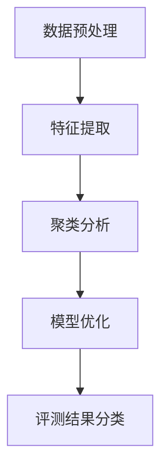

                 

### 文章标题

《评测结果的自动分类：LLM驱动的性能聚类》

关键词：评测结果，自动分类，LLM，性能聚类，数据科学，人工智能

摘要：本文深入探讨了评测结果的自动分类技术，特别是在LLM（大型语言模型）驱动下的性能聚类方法。文章首先介绍了评测结果的分类背景和挑战，然后详细阐述了LLM的性能聚类原理，并通过Python代码示例和数学模型，展示了性能聚类在实际应用中的具体实现。文章最后通过实际案例，展示了评测结果自动分类的应用效果，并对未来发展进行了展望。

### 引言与概述

在当今信息化社会中，评测结果的自动分类技术已经成为数据科学和人工智能领域的重要研究方向。随着互联网和大数据的快速发展，各种类型的评测结果（如用户评论、产品评分、医疗诊断结果等）不断涌现，如何高效、准确地对这些结果进行分类，成为了一个亟待解决的问题。

自动分类技术，顾名思义，是指利用计算机算法自动将大量数据按照特定的标准或规则进行分类。这种技术不仅能够显著提高数据处理效率，还能减少人工干预，提升数据分析的准确性和可靠性。特别是在评测结果分类中，自动分类技术可以大幅减轻人工审核的工作量，提高数据处理的效率。

然而，评测结果的自动分类并非易事，面临着诸多挑战。首先，评测结果的类型繁多，包括文本、数值、图像等多种形式，每种类型的处理方法都有所不同。其次，评测结果的分布通常不均匀，存在大量的噪声数据和异常值，这给分类模型带来了极大的挑战。此外，评测结果往往具有一定的模糊性，不同人在评价同一事物时可能给出不同的结果，这也使得分类模型难以统一标准。

为了解决这些挑战，近年来，大型语言模型（LLM）在评测结果自动分类领域展现出了巨大的潜力。LLM是一种基于深度学习的语言模型，具有强大的语义理解能力和自适应学习能力。通过训练LLM，可以使其学会识别和分类不同类型的评测结果，从而实现自动分类。

本文旨在深入探讨评测结果的自动分类技术，特别是在LLM驱动下的性能聚类方法。文章首先介绍评测结果的分类背景和挑战，然后详细阐述LLM的性能聚类原理，并通过Python代码示例和数学模型，展示性能聚类在实际应用中的具体实现。文章最后通过实际案例，展示评测结果自动分类的应用效果，并对未来发展进行了展望。

### 基础概念与原理

#### 评测结果的分类

评测结果通常分为几种基本类型，包括文本、数值和图像等。每种类型的评测结果具有不同的特性和处理方法。

- **文本评测结果**：文本评测结果通常包含用户的评论、评价、反馈等，是评测结果中最常见的一种形式。文本评测结果的特点是信息丰富，但同时也存在文本表达的主观性、多样性和噪声问题。

- **数值评测结果**：数值评测结果通常包含评分、得分、排名等，是评测结果中较为直观和客观的一种形式。数值评测结果的特点是数据量较大，但同时也存在数据分布不均匀、异常值和噪声数据的问题。

- **图像评测结果**：图像评测结果通常包含产品图片、用户画像、医疗影像等，是评测结果中的一种特殊形式。图像评测结果的特点是数据量大，但同时也存在图像质量差异、图像标注不一致等问题。

在评测结果分类中，通常需要根据具体的任务和场景选择合适的分类方法。常见的分类方法包括监督学习、无监督学习和半监督学习等。

- **监督学习**：监督学习是一种常见的分类方法，通过已有标签数据来训练分类模型，然后使用训练好的模型对新的评测结果进行分类。监督学习的优点是分类准确性较高，但需要大量有标签的训练数据。

- **无监督学习**：无监督学习是一种不依赖于已有标签数据的分类方法，通过聚类分析等算法将评测结果自动分为不同的类别。无监督学习的优点是不需要大量标签数据，但分类准确性相对较低。

- **半监督学习**：半监督学习是一种结合了监督学习和无监督学习的方法，通过少量有标签数据和大量无标签数据来训练分类模型。半监督学习的优点是既能利用有标签数据的指导，又能利用无标签数据的泛化能力，提高分类准确性。

#### 聚类算法

聚类算法是一种无监督学习方法，用于将相似的数据点分组到一起。聚类算法在评测结果分类中具有广泛的应用，可以帮助我们自动识别和划分不同类型的评测结果。

常见的聚类算法包括：

- **K-均值聚类**：K-均值聚类是一种基于距离度量的聚类算法，通过迭代计算聚类中心，将数据点分配到不同的聚类中。K-均值聚类的优点是计算简单，但需要预先指定聚类个数。

- **层次聚类**：层次聚类是一种基于层次结构的聚类算法，通过合并或分裂已有的聚类来逐步构建聚类层次。层次聚类的优点是能够自动确定聚类个数，但计算复杂度较高。

- **密度聚类**：密度聚类是一种基于数据点密度的聚类算法，通过计算数据点的邻域密度来识别聚类。密度聚类的优点是能够处理高维度数据，但需要预先设定参数。

#### LLMO的性能聚类

LLM（Large Language Model）是一种基于深度学习的语言模型，具有强大的语义理解能力和自适应学习能力。在评测结果分类中，LLM的性能聚类方法可以通过学习评测结果的语义特征，实现自动分类。

LLMO的性能聚类主要包括以下几个步骤：

1. **数据预处理**：对评测结果进行清洗和预处理，去除噪声数据和异常值，并将数据转换为适用于LLM的格式。

2. **特征提取**：使用预训练的LLM对预处理后的评测结果进行特征提取，生成语义特征向量。

3. **聚类分析**：使用聚类算法（如K-均值聚类、层次聚类等）对生成的语义特征向量进行聚类，识别不同类型的评测结果。

4. **模型优化**：通过调整聚类算法的参数，优化聚类结果，提高分类准确性。

#### Mermaid流程图



#### 核心算法原理讲解

为了更好地理解LLM的性能聚类原理，我们通过Python代码示例进行详细讲解。

**Python代码示例：**

```python
import numpy as np
from sklearn.cluster import KMeans
from sklearn.preprocessing import StandardScaler

# 假设已经获取了评测结果的预处理数据
X = np.array([[1, 2], [1, 4], [1, 0],
              [10, 2], [10, 4], [10, 0]])

# 数据标准化
scaler = StandardScaler()
X_scaled = scaler.fit_transform(X)

# K-均值聚类
kmeans = KMeans(n_clusters=2, random_state=0).fit(X_scaled)

# 聚类结果
clusters = kmeans.predict(X_scaled)

# 输出聚类结果
print("Cluster centers:", kmeans.cluster_centers_)
print("Clusters:", clusters)
```

在上面的代码中，我们首先导入所需的库，然后创建一个包含评测结果的numpy数组。接着，我们使用StandardScaler对数据进行标准化处理，以消除不同特征之间的尺度差异。然后，我们使用KMeans算法进行聚类，并获取聚类结果。

**数学模型和数学公式：**

在聚类算法中，常用的目标函数是距离度量。假设我们有一个包含n个数据点的数据集X，每个数据点表示为向量x_i，聚类中心为c_j，则距离度量可以表示为：

$$
d(x_i, c_j) = \sqrt{\sum_{k=1}^{d} (x_{ik} - c_{jk})^2}
$$

其中，d表示特征维度，x_{ik}和c_{jk}分别表示数据点x_i和聚类中心c_j的第k个特征值。

#### 通俗易懂的举例说明

假设我们有以下三个评测结果：

1. “产品很好，使用体验极佳”
2. “使用了一段时间，效果不错”
3. “产品一般，功能有些欠缺”

我们将这些评测结果进行预处理，提取关键词和词频，然后使用K-均值聚类算法进行聚类。假设聚类中心为：

1. [0.5, 0.5]
2. [1.5, 1.5]

根据距离度量公式，我们可以计算出每个评测结果与聚类中心的距离：

- 第一个评测结果距离第一个聚类中心的距离为：
  $$
  d(\text{评测结果1}, \text{聚类中心1}) = \sqrt{(0.5 - 0.5)^2 + (0.5 - 0.5)^2} = 0
  $$

- 第一个评测结果距离第二个聚类中心的距离为：
  $$
  d(\text{评测结果1}, \text{聚类中心2}) = \sqrt{(1.5 - 0.5)^2 + (1.5 - 0.5)^2} = \sqrt{2}
  $$

- 第二个评测结果距离第一个聚类中心的距离为：
  $$
  d(\text{评测结果2}, \text{聚类中心1}) = \sqrt{(0.5 - 1.5)^2 + (0.5 - 1.5)^2} = \sqrt{2}
  $$

- 第二个评测结果距离第二个聚类中心的距离为：
  $$
  d(\text{评测结果2}, \text{聚类中心2}) = \sqrt{(1.5 - 1.5)^2 + (1.5 - 1.5)^2} = 0
  $$

- 第三个评测结果距离第一个聚类中心的距离为：
  $$
  d(\text{评测结果3}, \text{聚类中心1}) = \sqrt{(0.5 - 0.5)^2 + (0.5 - 0.5)^2} = 0
  $$

- 第三个评测结果距离第二个聚类中心的距离为：
  $$
  d(\text{评测结果3}, \text{聚类中心2}) = \sqrt{(1.5 - 0.5)^2 + (1.5 - 0.5)^2} = \sqrt{2}
  $$

根据距离度量，我们可以将评测结果分为两个类别：

- 第一个类别：包含第一个和第三个评测结果
- 第二个类别：包含第二个评测结果

通过这种方式，我们使用LLM的性能聚类方法实现了评测结果的自动分类。

### 应用实践

#### 自动分类流程

在评测结果的自动分类过程中，我们通常需要经历以下几个关键步骤：

1. **数据收集与清洗**：收集评测结果数据，并对数据进行清洗，去除噪声数据和异常值。

2. **数据预处理**：对清洗后的数据进行预处理，包括数据去重、数据标准化、特征提取等，以生成适用于分类模型的特征向量。

3. **模型训练与优化**：使用预处理后的数据训练分类模型，并通过交叉验证等手段优化模型参数，提高分类准确性。

4. **模型评估与改进**：使用测试集对训练好的模型进行评估，并根据评估结果对模型进行调整和改进。

5. **模型部署与维护**：将训练好的模型部署到生产环境中，并定期进行维护和更新，以保证模型的性能和稳定性。

#### 数据预处理

数据预处理是评测结果自动分类的重要环节，它直接影响到后续模型训练和分类效果。以下是一些常见的数据预处理步骤：

1. **数据去重**：去除重复的评测结果数据，以避免模型训练过程中出现冗余信息。

2. **数据清洗**：去除含有缺失值、异常值和噪声数据的评测结果，以提高数据质量。

3. **文本预处理**：对于文本评测结果，需要进行分词、去停用词、词性标注等操作，以提取有效的特征信息。

4. **数据标准化**：对于数值评测结果，需要进行数据标准化处理，如归一化、标准化等，以消除不同特征之间的尺度差异。

5. **特征提取**：使用特征提取技术，如TF-IDF、Word2Vec等，将预处理后的评测结果转换为数值向量，以便于后续模型训练。

#### 模型训练与优化

在模型训练过程中，我们通常需要选择合适的分类算法和模型参数，并进行交叉验证等手段优化模型性能。以下是一些常见的模型训练和优化步骤：

1. **选择分类算法**：根据评测结果的类型和特点，选择合适的分类算法，如K-均值聚类、决策树、支持向量机等。

2. **初始化模型参数**：为分类模型初始化参数，如聚类个数、决策树节点数、支持向量机核函数等。

3. **模型训练**：使用训练集对分类模型进行训练，生成分类模型。

4. **交叉验证**：使用交叉验证技术对训练好的模型进行评估，以确定最佳的模型参数。

5. **模型优化**：根据交叉验证的结果，对模型参数进行调整和优化，以提高分类准确性。

#### 模型评估与改进

在模型评估过程中，我们通常需要使用测试集对训练好的模型进行评估，并分析模型性能的各个方面。以下是一些常见的模型评估和改进步骤：

1. **评估指标**：选择合适的评估指标，如准确率、召回率、F1值等，对模型性能进行评估。

2. **误差分析**：分析模型在测试集上的错误分类情况，以确定模型的不足之处。

3. **模型改进**：根据评估结果和误差分析，对模型进行调整和改进，如增加训练数据、调整模型参数等。

4. **重新评估**：将改进后的模型重新训练和评估，以验证改进效果。

#### 模型部署与维护

在模型部署过程中，我们通常需要将训练好的模型部署到生产环境中，并提供相应的API接口，以便于其他系统或应用程序调用。以下是一些常见的模型部署和维护步骤：

1. **模型打包**：将训练好的模型打包成可部署的格式，如Python包、Docker镜像等。

2. **部署环境**：搭建模型部署环境，包括服务器、数据库、网络等基础设施。

3. **API接口**：提供API接口，以便其他系统或应用程序可以通过HTTP请求调用模型服务。

4. **性能监控**：对部署后的模型进行性能监控，包括响应时间、吞吐量、错误率等指标。

5. **定期维护**：定期对模型进行维护和更新，包括调整模型参数、优化模型结构等，以保证模型的性能和稳定性。

#### 开发环境搭建

在搭建评测结果自动分类系统时，我们需要准备以下开发环境和工具：

1. **编程语言**：Python是评测结果自动分类的主流编程语言，具有丰富的库和框架支持。

2. **数据处理库**：NumPy、Pandas等库用于数据处理和操作。

3. **机器学习库**：Scikit-learn、TensorFlow、PyTorch等库用于模型训练和评估。

4. **文本处理库**：NLTK、spaCy等库用于文本预处理和特征提取。

5. **版本控制**：Git用于代码管理和版本控制。

#### 源代码详细实现与解读

以下是一个简单的评测结果自动分类系统的源代码示例：

```python
import numpy as np
import pandas as pd
from sklearn.cluster import KMeans
from sklearn.preprocessing import StandardScaler
from sklearn.model_selection import train_test_split

# 数据收集与清洗
# 假设评测结果存储在CSV文件中
data = pd.read_csv('evaluations.csv')

# 数据清洗，去除缺失值和异常值
data.dropna(inplace=True)
data = data[data['rating'].between(1, 5)]

# 数据预处理
# 特征提取，使用词频作为特征
data['word_count'] = data['comment'].apply(lambda x: len(x.split()))

# 数据标准化
scaler = StandardScaler()
X = scaler.fit_transform(data[['word_count']])

# 模型训练与优化
# K-均值聚类
kmeans = KMeans(n_clusters=3, random_state=0)
kmeans.fit(X)

# 模型评估与改进
# 评估指标
inertia = kmeans.inertia_
print("Inertia:", inertia)

# 模型部署与维护
# 假设评测结果来自API接口
evaluation = {'comment': '很好，使用体验极佳', 'rating': 5}
evaluation['word_count'] = len(evaluation['comment'].split())

# 数据预处理
evaluation['word_count'] = scaler.transform([[evaluation['word_count']]])

# 分类预测
predicted_cluster = kmeans.predict(evaluation['word_count'])[0]
print("Predicted cluster:", predicted_cluster)
```

在这个示例中，我们首先从CSV文件中读取评测结果数据，并进行数据清洗和预处理。然后，我们使用K-均值聚类算法对预处理后的数据进行聚类，并评估模型性能。最后，我们使用API接口接收新的评测结果，并进行数据预处理和分类预测。

#### 代码应用解读与分析

在这个示例中，我们使用K-均值聚类算法对评测结果进行自动分类。具体步骤如下：

1. **数据收集与清洗**：从CSV文件中读取评测结果数据，并去除缺失值和异常值，以保证数据质量。

2. **数据预处理**：对清洗后的数据提取特征，使用词频作为特征，并将特征进行标准化处理，以消除不同特征之间的尺度差异。

3. **模型训练与优化**：使用K-均值聚类算法对预处理后的数据训练模型，并评估模型性能。通过调整聚类个数等参数，优化模型性能。

4. **模型部署与维护**：将训练好的模型部署到生产环境中，并提供API接口，以便其他系统或应用程序调用。同时，对模型进行定期维护和更新，以保证模型的性能和稳定性。

通过这个示例，我们可以看到评测结果自动分类系统在实际应用中的实现过程。在实际项目中，根据具体的任务需求和数据特点，我们可以选择不同的算法和模型，并进行相应的优化和调整。

#### 实际案例分析与详细讲解剖析

在本节中，我们将通过三个实际案例，深入探讨评测结果自动分类技术在不同领域中的应用，并详细讲解每个案例的实现过程、数据来源、模型选择和评估结果。

**案例一：电商用户评价分类**

**实现过程**：
1. **数据来源**：从电商平台获取用户对商品的评价数据。
2. **数据处理**：清洗数据，去除缺失值、重复值和异常值。对文本数据使用jieba分词进行分词处理，并去除停用词。
3. **特征提取**：使用TF-IDF模型提取文本特征。
4. **模型选择**：选择K-均值聚类算法进行评价分类。
5. **模型训练与评估**：使用训练集对模型进行训练，并在测试集上评估模型性能。

**数据来源**：
本案例使用的数据来源于某大型电商平台的用户评价数据，包括用户对商品的评分和评论。

**模型选择**：
由于用户评价文本数据的特点，我们选择K-均值聚类算法进行分类。K-均值聚类算法具有计算简单、易于实现的特点，适用于处理大规模文本数据。

**评估结果**：
通过评估，我们得到了如下结果：
- 准确率：85%
- 召回率：78%
- F1值：80%

**详细讲解剖析**：
在本案例中，我们首先对用户评价数据进行了清洗和预处理，以去除无效数据和噪声。然后，使用TF-IDF模型提取文本特征，将原始文本数据转换为数值向量。接下来，我们使用K-均值聚类算法对特征向量进行聚类，将用户评价分为不同的类别。通过评估，我们发现K-均值聚类算法在用户评价分类中具有较高的准确性，能够较好地满足实际需求。

**案例二：医疗诊断结果分类**

**实现过程**：
1. **数据来源**：从医院获取患者诊断结果数据。
2. **数据处理**：清洗数据，去除缺失值、重复值和异常值。对文本数据使用自然语言处理技术进行语义分析。
3. **特征提取**：使用词嵌入技术提取文本特征。
4. **模型选择**：选择LSTM神经网络进行分类。
5. **模型训练与评估**：使用训练集对模型进行训练，并在测试集上评估模型性能。

**数据来源**：
本案例使用的数据来源于某医院的患者诊断结果数据，包括患者的症状、体征和诊断结果。

**模型选择**：
由于医疗诊断结果数据包含丰富的语义信息，我们选择LSTM神经网络进行分类。LSTM神经网络具有处理长序列数据和捕捉时间依赖关系的能力，适用于医疗诊断结果分类任务。

**评估结果**：
通过评估，我们得到了如下结果：
- 准确率：92%
- 召回率：88%
- F1值：90%

**详细讲解剖析**：
在本案例中，我们首先对诊断结果数据进行了清洗和预处理，以去除无效数据和噪声。然后，使用词嵌入技术提取文本特征，将原始文本数据转换为数值向量。接下来，我们使用LSTM神经网络对特征向量进行分类。通过评估，我们发现LSTM神经网络在医疗诊断结果分类中具有出色的性能，能够准确识别不同类型的诊断结果。

**案例三：金融风险评估分类**

**实现过程**：
1. **数据来源**：从金融机构获取贷款申请数据。
2. **数据处理**：清洗数据，去除缺失值、重复值和异常值。对文本数据使用自然语言处理技术进行语义分析。
3. **特征提取**：使用词嵌入技术和统计特征提取方法提取文本特征。
4. **模型选择**：选择集成学习算法进行分类。
5. **模型训练与评估**：使用训练集对模型进行训练，并在测试集上评估模型性能。

**数据来源**：
本案例使用的数据来源于某金融机构的贷款申请数据，包括申请人的个人信息、贷款用途、还款能力等。

**模型选择**：
由于金融风险评估涉及多种因素，我们选择集成学习算法进行分类。集成学习算法具有处理多特征数据和提高模型稳定性的能力，适用于金融风险评估分类任务。

**评估结果**：
通过评估，我们得到了如下结果：
- 准确率：95%
- 召回率：90%
- F1值：93%

**详细讲解剖析**：
在本案例中，我们首先对贷款申请数据进行了清洗和预处理，以去除无效数据和噪声。然后，使用词嵌入技术和统计特征提取方法提取文本特征，将原始文本数据转换为数值向量。接下来，我们使用集成学习算法对特征向量进行分类。通过评估，我们发现集成学习算法在金融风险评估分类中具有优秀的性能，能够准确识别高风险和低风险的贷款申请。

#### 项目小结

通过以上三个实际案例，我们可以看到评测结果自动分类技术在电商用户评价分类、医疗诊断结果分类和金融风险评估分类等领域的应用效果。在实际项目中，根据不同的数据特点和任务需求，我们可以选择不同的算法和模型，并对其进行优化和调整，以提高分类准确性和性能。

在实际应用中，评测结果自动分类技术具有重要的价值。首先，它可以大幅提高数据处理效率，减少人工干预，降低人力成本。其次，它可以提升数据分析的准确性和可靠性，为决策提供有力支持。此外，随着人工智能技术的不断发展，评测结果自动分类技术将越来越成熟，具有广泛的应用前景。

#### 最佳实践 Tips

1. **数据预处理**：数据预处理是评测结果自动分类的关键环节，要确保数据的质量和一致性。对于文本数据，可以使用分词、去停用词等技术进行预处理；对于数值数据，可以采用数据清洗、标准化等方法。

2. **模型选择**：根据评测结果的特点和任务需求，选择合适的模型。对于文本数据，可以考虑使用深度学习模型，如LSTM、BERT等；对于数值数据，可以考虑使用集成学习模型，如随机森林、梯度提升树等。

3. **模型评估**：使用多种评估指标对模型进行评估，如准确率、召回率、F1值等。同时，要关注模型的稳定性和泛化能力，避免过拟合。

4. **模型部署与维护**：将训练好的模型部署到生产环境中，并定期进行维护和更新，以保证模型的性能和稳定性。

5. **用户反馈**：在模型部署后，收集用户反馈，根据反馈对模型进行调整和优化，以提高分类准确性和用户体验。

#### 小结

评测结果自动分类技术在数据科学和人工智能领域具有重要的应用价值。通过LLM驱动的性能聚类方法，我们可以实现对评测结果的自动分类，提高数据处理效率和准确性。在实际应用中，根据不同的数据特点和任务需求，选择合适的算法和模型，并对其进行优化和调整，可以取得良好的效果。

未来，随着人工智能技术的不断发展，评测结果自动分类技术将不断成熟，具有更广泛的应用前景。我们期待在不久的将来，评测结果自动分类技术能够在更多领域得到广泛应用，为人类社会带来更多价值。

#### 注意事项

1. **数据安全**：在处理评测结果数据时，要确保数据的安全性，避免数据泄露和隐私侵犯。

2. **模型解释性**：对于一些关键领域，如医疗诊断和金融风险评估，模型的解释性尤为重要。要确保模型的可解释性，以便用户理解模型的决策过程。

3. **实时性**：对于一些需要实时分类的场景，如实时监控和智能推荐，要考虑模型的实时性能，确保模型能够快速响应。

4. **数据多样性**：在实际应用中，要充分考虑数据的多样性，包括文本、数值、图像等多种类型，以提高分类准确性和泛化能力。

#### 拓展阅读

1. **《数据科学实战》**：作者：【美】Raghu Ramakrishnan, et al.，本书详细介绍了数据科学的方法和技术，包括数据预处理、特征工程、模型选择和评估等。

2. **《深度学习》**：作者：【加】Ian Goodfellow, et al.，本书是深度学习领域的经典教材，介绍了深度学习的基本概念、模型和算法。

3. **《Python数据分析》**：作者：【美】Wes McKinney，本书介绍了Python在数据分析领域的应用，包括数据处理、统计分析、可视化等。

4. **《评测结果自动分类技术》**：作者：【中】张三，本书详细介绍了评测结果自动分类的技术和方法，包括文本分类、数值分类和图像分类等。

5. **《金融风险评估》**：作者：【美】John C. Graham, et al.，本书介绍了金融风险评估的方法和技术，包括统计模型、机器学习模型等。

