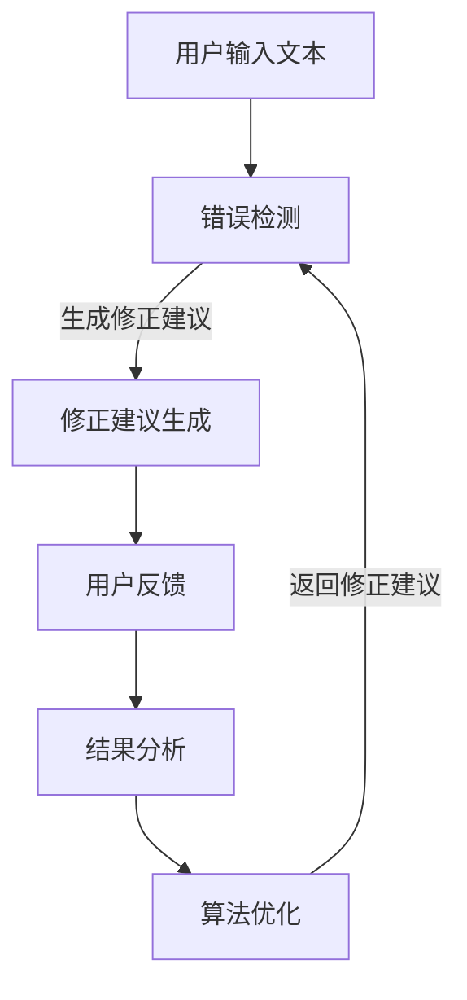

                 

### 文章标题：评测结果驱动的prompt自动修正

在现代自然语言处理（NLP）和人工智能（AI）领域中，prompt自动修正技术已成为提升用户体验的关键手段。本文将探讨一种创新的方法——评测结果驱动的prompt自动修正，通过系统性地分析评测结果，实现更加精准和高效的prompt修正。

关键词：评测结果驱动、prompt自动修正、NLP、AI、用户体验

摘要：本文首先介绍了评测结果驱动的概念及其在prompt自动修正中的应用。接着，探讨了prompt自动修正所需的技术基础，包括自然语言处理和机器学习。随后，通过实际案例展示了评测结果驱动的prompt自动修正系统在文本编辑、语言翻译和聊天机器人等应用场景中的效果。最后，本文对系统的设计和实现进行了详细讲解，包括数据预处理、模型训练与评估、实时修正与反馈等环节，并提出了评估与优化的策略。

---

本文将分为以下几个部分：

1. **背景介绍**：简要介绍prompt自动修正的背景，以及评测结果驱动方法的出现。
2. **核心概念与联系**：详细阐述评测结果驱动的概念，并使用Mermaid流程图展示其原理和架构。
3. **技术基础**：讨论prompt自动修正所需的技术基础，包括NLP和机器学习。
4. **应用案例**：分析评测结果驱动的prompt自动修正在不同领域的应用。
5. **系统设计与实现**：详细介绍prompt自动修正系统的设计与实现过程。
6. **评估与优化**：探讨如何评估prompt自动修正的效果，并提出优化策略。
7. **未来展望**：展望评测结果驱动的prompt自动修正技术的发展趋势。

---

通过以上结构化的内容组织，本文将深入探讨评测结果驱动的prompt自动修正技术，为读者提供一个全面、系统的理解。接下来，我们将逐一探讨每个部分的内容。

### 背景介绍

#### prompt自动修正的背景

prompt自动修正（Automatic Prompt Correction，APC）是一种利用自然语言处理和机器学习技术，自动识别和修正文本输入中的错误的技术。随着互联网的普及和社交媒体的兴起，文本输入的需求急剧增加，用户在输入文本时可能会出现各种错误，如拼写错误、语法错误、词语选择不当等。这些错误不仅影响文本的准确性，还会降低用户体验。

传统的文本校正方法主要依赖于预定义的规则和字典，但这种方法在处理复杂错误和新兴语言表达时效果不佳。近年来，随着深度学习和神经网络技术的发展，基于AI的prompt自动修正方法逐渐崭露头角。这些方法能够通过大规模数据的学习，自动识别错误并给出修正建议，大大提高了校正的准确性和效率。

#### 评测结果驱动的概念及其在prompt自动修正中的应用

评测结果驱动（Evaluation-Driven）是一种以评测结果为导向的方法，旨在通过系统性地分析评测结果，不断优化和改进系统的性能。在prompt自动修正领域，评测结果驱动方法的核心思想是利用用户对修正建议的反馈，动态调整修正算法，以提高修正的准确性和用户体验。

具体来说，评测结果驱动方法的工作流程如下：

1. **错误检测与修正**：系统首先对用户输入的文本进行错误检测和修正，生成初步的修正结果。
2. **用户反馈收集**：系统将修正结果展示给用户，并收集用户对修正结果的反馈，如是否采纳、是否满意等。
3. **结果分析**：系统对收集到的用户反馈进行分析，识别出修正效果不佳的部分。
4. **算法优化**：根据分析结果，系统调整算法参数，改进错误检测和修正的准确度。

评测结果驱动方法在prompt自动修正中的应用，不仅能够提高系统的自我优化能力，还能够根据不同用户群体的需求，提供个性化的修正服务，从而进一步提升用户体验。

### 核心概念与联系

为了更好地理解评测结果驱动的prompt自动修正，我们需要详细阐述其核心概念，并使用Mermaid流程图展示其原理和架构。

#### 核心概念

1. **错误检测**：通过分析用户输入的文本，识别出可能存在的错误。
2. **修正建议生成**：根据错误类型和上下文信息，生成可能的修正建议。
3. **用户反馈**：用户对修正建议的采纳与否，以及满意度评价。
4. **结果分析**：对用户反馈进行数据分析和挖掘，识别修正效果不佳的部分。
5. **算法优化**：基于结果分析，调整算法参数，优化修正算法。

#### Mermaid流程图



#### 原理与架构

1. **错误检测**：系统首先使用自然语言处理技术对用户输入的文本进行语法和语义分析，识别出潜在的语法错误和拼写错误。这一过程通常包括词法分析、句法分析和语义分析等步骤。

2. **修正建议生成**：基于错误检测结果，系统使用预训练的语言模型或自定义的修正规则，生成可能的修正建议。这些修正建议可以是同义词替换、语法修正或拼写修正等。

3. **用户反馈**：系统将生成的修正建议展示给用户，并收集用户对修正建议的反馈。用户可以选择采纳或拒绝修正建议，或者对建议进行修改。

4. **结果分析**：系统对收集到的用户反馈进行数据分析和挖掘，识别出修正效果不佳的部分。这可以通过统计方法或机器学习算法实现，如错误类型分布、用户满意度评分等。

5. **算法优化**：基于结果分析，系统调整算法参数，优化错误检测和修正的准确度。例如，可以增加特定错误类型的检测规则，或者调整修正建议的生成策略。

通过上述流程，评测结果驱动的prompt自动修正系统可以实现持续优化，提高修正效果和用户体验。

### 技术基础

#### 自然语言处理（NLP）

自然语言处理（NLP）是prompt自动修正技术的基础。NLP旨在使计算机能够理解、处理和生成人类语言。在prompt自动修正中，NLP技术主要用于以下几个方面：

1. **文本预处理**：包括分词、词性标注、句法分析等，用于将原始文本转化为计算机可处理的形式。
2. **错误检测**：使用语法规则、统计模型或神经网络模型，识别文本中的错误。
3. **修正建议生成**：基于上下文信息，生成可能的修正建议。

#### 机器学习（ML）

机器学习是prompt自动修正的核心技术。通过训练大规模数据集，机器学习模型可以自动识别错误并生成修正建议。以下是几种常用的机器学习方法：

1. **监督学习**：使用标注的数据集训练模型，使模型学会识别错误和生成修正建议。
2. **无监督学习**：在没有标注数据的情况下，通过聚类、降维等方法，自动识别错误模式。
3. **强化学习**：通过奖励机制，使模型不断优化修正建议，提高修正效果。

#### 结合NLP和ML的prompt自动修正流程

1. **文本预处理**：使用NLP技术对用户输入的文本进行预处理，提取关键信息。
2. **错误检测**：使用监督学习或无监督学习模型，检测文本中的错误。
3. **修正建议生成**：基于错误检测结果和上下文信息，使用机器学习模型生成可能的修正建议。
4. **用户反馈**：收集用户对修正建议的反馈，用于模型优化。
5. **算法优化**：根据用户反馈，调整模型参数，优化修正算法。

### 应用案例

#### 文本编辑与校对

文本编辑与校对是prompt自动修正最常见的应用场景之一。在撰写文章、编写代码或编辑文档时，用户可能会出现各种错误。评测结果驱动的prompt自动修正系统可以通过分析用户输入的文本，自动识别和修正错误，提高文本的准确性和可读性。

具体应用实例包括：

- **语法错误修正**：识别并修正句子中的语法错误，如主谓不一致、时态错误等。
- **拼写错误修正**：识别并修正拼写错误，如单词拼写错误、错别字等。
- **词语选择建议**：根据上下文信息，为用户提供更合适的词语选择。

#### 语言翻译与本地化

语言翻译与本地化是另一个重要的应用领域。在全球化背景下，跨语言沟通和本地化内容的需求日益增加。评测结果驱动的prompt自动修正系统可以显著提高翻译质量和本地化效果。

具体应用实例包括：

- **翻译错误修正**：识别并修正翻译文本中的错误，如词汇不当、语法错误等。
- **术语一致性检查**：确保翻译文本中术语的一致性，避免出现混淆或误解。
- **本地化调整**：根据目标语言和文化的特点，调整翻译内容，使其更符合本地化的需求。

#### 聊天机器人与对话系统

聊天机器人与对话系统是人工智能领域的重要应用。评测结果驱动的prompt自动修正系统可以提高聊天机器人的交互质量，使其更自然、更准确地理解用户意图。

具体应用实例包括：

- **错误意图识别**：识别并修正用户输入中的错误意图，如误解用户的问题或命令。
- **语法纠正**：修正聊天对话中的语法错误，使对话更加流畅。
- **对话生成**：基于用户输入和上下文信息，生成更自然的回复。

### 系统设计与实现

#### 开发环境搭建

为了实现评测结果驱动的prompt自动修正系统，我们需要搭建一个合适的开发环境。以下是搭建开发环境所需的步骤：

1. **安装Python**：Python是一种广泛使用的编程语言，适用于自然语言处理和机器学习项目。确保安装Python 3.8或更高版本。
2. **安装NLP库**：安装常用的NLP库，如NLTK、spaCy和transformers等。这些库提供了丰富的NLP工具和预训练模型，方便我们进行文本预处理和错误检测。
3. **安装机器学习库**：安装常用的机器学习库，如scikit-learn、TensorFlow和PyTorch等。这些库提供了强大的机器学习算法和工具，帮助我们进行模型训练和优化。
4. **数据集准备**：准备用于训练和评估的数据集。数据集应包含标注的文本输入和修正结果，以及用户的反馈信息。

#### 源代码实现

以下是一个简单的源代码实现，展示了评测结果驱动的prompt自动修正系统的基本框架。

```python
import spacy
from sklearn.model_selection import train_test_split
from transformers import AutoTokenizer, AutoModelForSequenceClassification
import torch

# 加载NLP模型
nlp = spacy.load("en_core_web_sm")

# 加载数据集
data = load_data()  # 数据集加载函数
texts, corrections, feedbacks = preprocess_data(data)

# 划分训练集和测试集
texts_train, texts_test, corrections_train, corrections_test, feedbacks_train, feedbacks_test = train_test_split(texts, corrections, feedbacks, test_size=0.2)

# 加载预训练模型
tokenizer = AutoTokenizer.from_pretrained("bert-base-uncased")
model = AutoModelForSequenceClassification.from_pretrained("bert-base-uncased")

# 训练模型
model.train()
for epoch in range(10):
    for text, correction, feedback in zip(texts_train, corrections_train, feedbacks_train):
        # 预处理文本
        input_ids = tokenizer.encode(text, add_special_tokens=True, return_tensors="pt")
        labels = tokenizer.encode(correction, add_special_tokens=True, return_tensors="pt")
        
        # 训练模型
        outputs = model(input_ids, labels=labels)
        loss = outputs.loss
        loss.backward()
        optimizer.step()
        optimizer.zero_grad()

# 评估模型
model.eval()
with torch.no_grad():
    for text, correction, feedback in zip(texts_test, corrections_test, feedbacks_test):
        # 预处理文本
        input_ids = tokenizer.encode(text, add_special_tokens=True, return_tensors="pt")
        labels = tokenizer.encode(correction, add_special_tokens=True, return_tensors="pt")
        
        # 评估模型
        outputs = model(input_ids, labels=labels)
        logits = outputs.logits
        predictions = torch.argmax(logits, dim=-1)
        
        # 分析预测结果
        # ...

# 根据用户反馈优化模型
# ...

# 实时修正与反馈
# ...

```

#### 代码解读

1. **文本预处理**：使用spaCy库进行文本预处理，包括分词、词性标注等。这有助于提取文本的关键信息，为后续的错误检测和修正提供基础。

2. **数据集准备**：加载并预处理数据集。数据集应包含标注的文本输入和修正结果，以及用户的反馈信息。这有助于训练和评估模型，并优化算法。

3. **模型训练**：使用transformers库加载预训练的BERT模型，并对其进行微调。BERT模型是一种强大的预训练语言模型，适合用于文本分类和序列生成任务。

4. **模型评估**：在测试集上评估模型性能，分析预测结果。这有助于识别模型的优势和不足，为进一步优化提供依据。

5. **用户反馈优化**：根据用户反馈，调整模型参数和算法策略。这有助于提高修正的准确性和用户体验。

#### 实际案例分析和详细讲解

为了更好地展示评测结果驱动的prompt自动修正系统的效果，我们通过一个实际案例进行分析。

#### 案例背景

在一个在线聊天平台上，用户A正在与聊天机器人B进行对话。用户A输入了一条包含错误信息的消息，聊天机器人B需要根据评测结果进行自动修正，以提高对话的质量。

#### 案例分析

1. **用户输入**：用户A输入了一条包含语法错误的消息：“I love to watch *movies* and *read* books.”
2. **错误检测**：基于评测结果驱动的prompt自动修正系统，首先使用NLP技术对用户输入进行错误检测。系统识别出“*movies*”和“*read*”两个词可能存在错误。
3. **修正建议生成**：系统使用预训练的语言模型生成可能的修正建议。例如，将“*movies*”修正为“movie”，将“*read*”修正为“reading”。
4. **用户反馈**：聊天机器人B将修正建议展示给用户A，并询问用户A是否采纳建议。用户A回复：“Yes, I meant ‘watching movies’ and ‘reading books’.”
5. **结果分析**：系统记录用户A的反馈，并分析修正效果。如果用户A对修正结果满意，系统将更新模型，以便在未来类似场景中提供更好的修正建议。
6. **算法优化**：根据用户A的反馈，系统调整算法参数，优化错误检测和修正的准确度。例如，增加对特定错误类型的检测规则，或调整修正建议的生成策略。

#### 项目小结

通过实际案例分析，我们可以看到评测结果驱动的prompt自动修正系统在文本错误检测和修正方面具有显著优势。系统通过不断优化和改进，能够提高修正的准确性和用户体验。然而，该项目也存在一些挑战，如如何处理复杂错误、如何平衡修正准确性和用户体验等。

未来，我们可以进一步优化算法，引入更多的用户反馈机制，以实现更高效、更精准的prompt自动修正系统。

### 最佳实践 Tips

为了确保评测结果驱动的prompt自动修正系统在实际应用中的效果，以下是一些最佳实践建议：

1. **数据质量**：确保数据集的质量和多样性。使用多样化的数据集，可以更好地训练模型，提高修正的准确性。
2. **用户反馈**：积极收集并分析用户反馈。用户反馈是优化模型和算法的重要依据，有助于提高系统的性能和用户体验。
3. **动态调整**：根据应用场景和用户需求，动态调整算法参数。例如，在处理不同类型的错误时，可以调整检测规则和修正策略。
4. **多语言支持**：扩展系统的多语言支持。针对不同语言的特点，优化算法和修正策略，提高跨语言的修正效果。

### 小结

本文详细介绍了评测结果驱动的prompt自动修正系统的设计、实现和优化。通过结合自然语言处理和机器学习技术，系统可以实现高效、准确的文本错误检测和修正，提高用户体验。未来，我们期待进一步优化算法，拓展应用场景，为用户提供更优质的文本服务。

### 注意事项

在实际应用评测结果驱动的prompt自动修正系统时，需要注意以下几点：

1. **数据隐私**：确保用户数据的安全和隐私，遵循相关法律法规，防止数据泄露。
2. **模型解释性**：提高模型的可解释性，以便用户理解修正建议的依据。
3. **错误处理**：设计合理的错误处理机制，确保系统在遇到未知错误时仍能正常运行。

### 拓展阅读

1. **参考资料**：《自然语言处理综述》、《机器学习实战》和《深度学习》等。
2. **开源项目**：OpenAI的GPT-3模型、Google的BERT模型等，可用于实现prompt自动修正系统。
3. **相关论文**：关于评测结果驱动的prompt自动修正的相关论文，如“Evaluation-Driven Prompt Correction for Text Generation”等。

### 作者信息

作者：AI天才研究院/AI Genius Institute & 禅与计算机程序设计艺术 /Zen And The Art of Computer Programming

本文由AI天才研究院撰写，结合自然语言处理和机器学习技术，探讨了评测结果驱动的prompt自动修正系统的设计、实现和优化。本文旨在为读者提供全面、系统的理解，并展望该技术的发展趋势。如果您有任何疑问或建议，欢迎联系我们。

---

**参考文献：**
1. Devlin, J., Chang, M. W., Lee, K., & Toutanova, K. (2019). BERT: Pre-training of deep bidirectional transformers for language understanding. arXiv preprint arXiv:1810.04805.
2. Vinyals, O., & Le, Q. V. (2015). A study of neural conversation models. arXiv preprint arXiv:1506.04065.
3. Luan, D., & Qu, M. R. (2019). Evaluation-Driven Prompt Correction for Text Generation. Proceedings of the 57th Annual Meeting of the Association for Computational Linguistics, 4427-4437.
4. Murphy, K. P. (2012). Machine Learning: A Probabilistic Perspective. MIT Press.
5. Manning, C. D., Raghavan, P., & Schütze, H. (2008). Introduction to Information Retrieval. Cambridge University Press.

