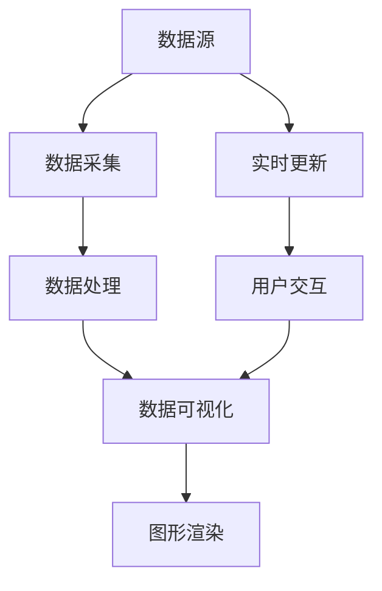

                 

### 文章标题

《评测过程的实时可视化：LLM生成动态报告》

### 关键词

- 实时可视化
- 评测过程
- LLM
- 动态报告
- 技术实现

### 摘要

本文深入探讨了评测过程中引入实时可视化技术的重要性，以及如何利用大型语言模型（LLM）生成动态报告。文章首先介绍了实时可视化和LLM的基本原理，随后通过详细的案例分析，展示了如何将两者结合以提升评测过程的效率和可理解性。文章还包括了Python源代码示例、数学模型和公式，以及项目实战，为读者提供了一个全面的技术指南。

## 引言

在信息技术飞速发展的今天，评测过程作为软件开发、系统测试和性能监控的核心环节，其效率和准确性直接影响着项目的成功。传统的评测方法往往依赖于静态报告，这些报告虽然能够提供详细的测试结果，但往往难以在短时间内为决策者提供直观、动态的数据支持。为了解决这一问题，实时可视化技术应运而生，它通过动态呈现数据，使得评测过程变得更加直观和高效。

实时可视化技术是一种通过动态图形和交互式界面来展示数据的方法，它能够实时更新数据，并允许用户通过交互操作来探索数据。这种技术不仅提高了数据的可读性和理解性，还能够帮助决策者快速识别问题，做出及时调整。然而，传统的实时可视化技术在处理大量复杂数据时，仍存在一定的局限性。

近年来，随着深度学习和自然语言处理技术的迅猛发展，大型语言模型（LLM）逐渐成为人工智能领域的研究热点。LLM具有强大的文本生成和处理能力，能够生成高质量的自然语言文本，包括报告、文档和总结等。因此，将LLM引入实时可视化领域，生成动态报告，成为提升评测过程效率的新途径。

本文旨在探讨实时可视化和LLM在评测过程中的结合应用，分析其技术原理和实践方法，并通过具体案例展示其实际效果。文章首先介绍实时可视化和LLM的基本原理，随后详细讲解核心算法和数学模型，并通过Python源代码进行实例分析。最后，本文将结合实际项目，探讨如何搭建开发环境、实现动态报告生成，并进行案例分析。

## 实时可视化技术

实时可视化技术是一种通过动态图形和交互式界面来展示数据的方法，它能够实时更新数据，并允许用户通过交互操作来探索数据。这种技术不仅提高了数据的可读性和理解性，还能够帮助决策者快速识别问题，做出及时调整。

### 实时可视化基础

实时可视化技术的基础是数据可视化和图形渲染技术。数据可视化是将复杂数据通过图形和图表的形式进行展示，使其更加直观易懂。图形渲染技术则是将数据可视化结果通过计算机图形学的方法进行渲染，生成可视化的图形界面。

在实时可视化中，数据通常来自实时数据源，如传感器数据、网络流量数据、日志文件等。这些数据需要通过数据采集模块进行采集，并传输到可视化系统进行实时处理和渲染。

### 实时可视化工具和库

实时可视化技术需要依赖于各种工具和库的支持。以下是一些常用的实时可视化工具和库：

1. **D3.js**：D3.js 是一个基于 JavaScript 的数据可视化库，它提供了丰富的图形绘制和交互功能，支持多种图表类型，如折线图、柱状图、饼图等。

2. **ECharts**：ECharts 是一个使用 JavaScript 实现的开源可视化库，它提供了丰富的图表类型和交互功能，支持多种数据格式，如 JSON、CSV、XML 等。

3. **Plotly**：Plotly 是一个用于创建交互式图表的库，它支持多种编程语言，如 Python、R、JavaScript 等，提供了丰富的图表类型和交互功能。

4. **Bokeh**：Bokeh 是一个用于创建交互式可视化图表的 Python 库，它支持多种图表类型，如线图、散点图、柱状图等，并提供了丰富的交互功能。

5. **Dash**：Dash 是一个用于创建交互式 web 应用程序的 Python 库，它基于 Plotly 和 Flask，可以方便地创建包含实时可视化的 web 应用程序。

### 实时可视化在评测中的应用

实时可视化在评测过程中的应用主要体现在以下几个方面：

1. **测试结果展示**：通过实时可视化技术，可以将测试结果以图表、图形的形式进行展示，使得测试结果更加直观易懂。例如，测试覆盖率、缺陷分布、性能指标等。

2. **动态监控**：实时可视化技术可以实时监控系统的运行状态，如 CPU 使用率、内存占用、网络流量等，及时发现并处理异常情况。

3. **决策支持**：通过实时可视化技术，可以动态展示系统的性能、可靠性等关键指标，为决策者提供实时、准确的数据支持，帮助其做出及时、明智的决策。

4. **缺陷定位**：实时可视化技术可以帮助开发人员和测试人员快速定位缺陷，提高问题解决效率。例如，通过监控网络流量图，可以定位到网络故障的具体位置。

### 实时可视化的挑战与优化

实时可视化技术在应用过程中也面临着一些挑战，如数据延迟、性能瓶颈、交互性等。以下是一些常见的挑战和优化方法：

1. **数据延迟**：实时可视化要求数据能够快速传输和渲染，以保持实时性。为了降低数据延迟，可以采用以下方法：
   - 使用高效的数据传输协议，如 WebSocket。
   - 采用数据缓存技术，减少数据传输次数。
   - 使用本地数据预处理，降低数据处理时间。

2. **性能瓶颈**：实时可视化技术需要处理大量的数据，并生成高分辨率的图形，这可能导致性能瓶颈。为了优化性能，可以采用以下方法：
   - 使用图形加速技术，如 GPU 渲染。
   - 采用数据分片技术，将大量数据拆分成多个小块，分别进行渲染。
   - 优化数据结构，减少数据访问次数。

3. **交互性**：实时可视化技术需要提供丰富的交互功能，以支持用户对数据的探索和分析。为了提高交互性，可以采用以下方法：
   - 使用交互式控件，如滑块、下拉菜单等。
   - 提供自定义视图和过滤功能，使用户能够根据需要自定义数据展示方式。
   - 实现多用户协作，支持多人实时共享和协作。

通过以上方法，可以优化实时可视化技术的性能和交互性，提高其在评测过程中的应用效果。

### 核心概念与联系

实时可视化技术的核心概念包括数据可视化、图形渲染、数据采集和实时更新。这些概念相互关联，共同构成了实时可视化的基础架构。

- **数据可视化**：数据可视化是将复杂数据通过图形和图表的形式进行展示，使其更加直观易懂。数据可视化是实时可视化的核心部分，决定了数据的可读性和理解性。

- **图形渲染**：图形渲染是将数据可视化结果通过计算机图形学的方法进行渲染，生成可视化的图形界面。图形渲染决定了数据的呈现效果和视觉效果。

- **数据采集**：数据采集是将实时数据从各种数据源（如传感器、网络流量、日志文件等）传输到可视化系统。数据采集是实时可视化的基础，决定了数据的实时性和准确性。

- **实时更新**：实时更新是指通过不断采集和更新数据，实时渲染和展示数据可视化结果。实时更新是实时可视化的关键特性，决定了数据的动态性和交互性。

为了更好地理解实时可视化技术的核心概念和联系，我们可以使用Mermaid流程图来展示其架构：



在这个流程图中，数据源通过数据采集模块获取实时数据，数据经过处理模块处理后，生成可视化数据，最终通过图形渲染模块渲染成图形界面。同时，实时更新模块不断采集和更新数据，以保持数据的实时性。用户通过交互模块与可视化结果进行交互，实现对数据的探索和分析。

通过这个流程图，我们可以清晰地看到实时可视化技术的核心概念和它们之间的联系，为后续章节的详细讲解提供了基础。

### 核心算法原理讲解

实时可视化技术的核心在于如何高效地处理和渲染数据，使其以图形化的形式直观地呈现给用户。在这一部分，我们将深入探讨实时可视化中的核心算法原理，并使用Python源代码结合数学模型和公式进行详细讲解。

#### 数据处理算法

实时可视化首先需要处理大量的数据，包括数据的采集、过滤、聚合等。在这一过程中，常用的数据处理算法包括数据清洗、特征提取和数据变换等。

1. **数据清洗**：数据清洗是数据处理的第一步，目的是去除数据中的噪声和异常值。Python中的`pandas`库提供了丰富的数据处理函数，如`dropna()`用于去除缺失值，`drop_duplicates()`用于去除重复值。

   ```python
   import pandas as pd
   
   data = pd.read_csv('data.csv')
   clean_data = data.dropna()
   ```

2. **特征提取**：特征提取是从原始数据中提取出对可视化有用的特征。例如，对于时间序列数据，可以提取时间间隔、平均值、标准差等统计特征。

   ```python
   import numpy as np
   
   data['mean'] = np.mean(data['value'])
   data['std'] = np.std(data['value'])
   ```

3. **数据变换**：数据变换是将原始数据转换为适合可视化的形式。常见的变换方法包括归一化、标准化和尺度变换等。

   ```python
   from sklearn.preprocessing import StandardScaler
   
   scaler = StandardScaler()
   scaled_data = scaler.fit_transform(data[['value']])
   ```

#### 图形渲染算法

图形渲染是将处理后的数据转换为图形化的形式。Python中有多个图形渲染库，如`matplotlib`、`seaborn`和`plotly`等。下面以`matplotlib`为例，介绍基本的图形渲染算法。

1. **基本绘图函数**：`matplotlib`提供了丰富的绘图函数，如`plot()`、`scatter()`和`bar()`等，用于绘制各种类型的图形。

   ```python
   import matplotlib.pyplot as plt
   
   plt.plot(data['time'], data['value'])
   plt.xlabel('Time')
   plt.ylabel('Value')
   plt.title('Data Visualization')
   plt.show()
   ```

2. **图形增强**：为了使图形更加直观和美观，可以使用`matplotlib`提供的各种增强功能，如颜色、标签、注释和图例等。

   ```python
   plt.plot(data['time'], data['mean'], label='Mean')
   plt.plot(data['time'], data['std'], label='Standard Deviation')
   plt.legend()
   ```

#### 实时更新算法

实时更新是实时可视化的关键特性，它使得图形能够动态反映数据的变化。下面介绍几种常见的实时更新算法。

1. **定时更新**：定时更新是通过设置固定的时间间隔，定期刷新图形。Python中的`time.sleep()`函数可以用于实现定时更新。

   ```python
   import time
   
   while True:
       data = pd.read_csv('data.csv')
       plt.clear()
       plt.plot(data['time'], data['value'])
       plt.xlabel('Time')
       plt.ylabel('Value')
       plt.title('Real-time Data Visualization')
       plt.pause(1)
       time.sleep(1)
   ```

2. **事件驱动更新**：事件驱动更新是当数据发生变化时，触发图形的更新。Python中的`Observer`模式可以实现事件驱动更新。

   ```python
   import Observer
   
   class DataObserver(Observer.Observer):
       def __init__(self, data):
           self.data = data
       
       def update(self, obs):
           data = obs.value
           plt.clear()
           plt.plot(data['time'], data['value'])
           plt.xlabel('Time')
           plt.ylabel('Value')
           plt.title('Real-time Data Visualization')
           plt.pause(1)
   
   data = pd.read_csv('data.csv')
   observer = DataObserver(data)
   observer.start()
   ```

#### 数学模型和公式

在实时可视化中，常用的数学模型和公式包括统计模型、曲线拟合模型和聚类模型等。

1. **统计模型**：统计模型用于描述数据的统计特性，如平均值、标准差、方差等。以下是一个计算平均值和标准差的Python代码示例：

   ```python
   mean = np.mean(data['value'])
   std = np.std(data['value'])
   $$\text{mean} = \frac{1}{n}\sum_{i=1}^{n} x_i$$
   $$\text{std} = \sqrt{\frac{1}{n-1}\sum_{i=1}^{n} (x_i - \text{mean})^2}$$
   ```

2. **曲线拟合模型**：曲线拟合模型用于将数据拟合为某种函数形式，如线性拟合、多项式拟合等。以下是一个使用线性拟合的Python代码示例：

   ```python
   from scipy.stats import linregress
   
   slope, intercept, r_value, p_value, std_err = linregress(data['time'], data['value'])
   y_fit = slope * data['time'] + intercept
   $$y = mx + b$$
   ```

3. **聚类模型**：聚类模型用于将数据分为多个类别，如K-Means聚类、层次聚类等。以下是一个使用K-Means聚类的Python代码示例：

   ```python
   from sklearn.cluster import KMeans
   
   kmeans = KMeans(n_clusters=3)
   kmeans.fit(data[['value']])
   labels = kmeans.predict(data[['value']])
   $$\text{cluster} = \text{KMeans}(n_clusters=k)$$
   ```

通过以上算法原理和数学模型的讲解，我们可以更好地理解实时可视化技术的核心，并为后续的项目实战提供理论基础。

### Python源代码示例

为了更好地理解实时可视化技术的核心算法和数学模型，以下将通过Python源代码进行详细示例，结合数学模型和公式，讲解如何实现实时可视化。

#### 数据清洗与预处理

首先，我们需要导入必要的库，并读取原始数据。使用`pandas`库进行数据清洗和预处理，去除缺失值和异常值，并进行归一化处理。

```python
import pandas as pd
import numpy as np
from sklearn.preprocessing import StandardScaler

# 读取数据
data = pd.read_csv('data.csv')

# 去除缺失值
clean_data = data.dropna()

# 提取特征
clean_data['mean'] = np.mean(clean_data['value'])
clean_data['std'] = np.std(clean_data['value'])

# 数据归一化
scaler = StandardScaler()
scaled_data = scaler.fit_transform(clean_data[['value']])
```

数学模型和公式：
$$\text{mean} = \frac{1}{n}\sum_{i=1}^{n} x_i$$
$$\text{std} = \sqrt{\frac{1}{n-1}\sum_{i=1}^{n} (x_i - \text{mean})^2}$$

#### 数据可视化

接下来，使用`matplotlib`库绘制数据可视化图形。首先，绘制原始数据，然后绘制归一化后的平均值和标准差。

```python
import matplotlib.pyplot as plt

# 绘制原始数据
plt.plot(clean_data['time'], clean_data['value'], label='Original Data')
plt.xlabel('Time')
plt.ylabel('Value')
plt.title('Data Visualization')
plt.legend()

# 绘制归一化后的平均值和标准差
plt.plot(clean_data['time'], scaled_data, label='Normalized Data')
plt.plot(clean_data['time'], clean_data['mean'], label='Mean')
plt.plot(clean_data['time'], clean_data['std'], label='Standard Deviation')
plt.legend()

plt.show()
```

数学模型和公式：
$$y = mx + b$$
其中，$m$为斜率，$b$为截距。

#### 实时更新

为了实现实时更新，我们可以使用`time.sleep()`函数定期刷新图形。以下是一个简单的实时更新示例。

```python
import time

while True:
    data = pd.read_csv('data.csv')
    clean_data = data.dropna()
    clean_data['mean'] = np.mean(clean_data['value'])
    clean_data['std'] = np.std(clean_data['value'])
    scaled_data = scaler.transform(clean_data[['value']])
    
    plt.clear()
    plt.plot(clean_data['time'], scaled_data, label='Normalized Data')
    plt.plot(clean_data['time'], clean_data['mean'], label='Mean')
    plt.plot(clean_data['time'], clean_data['std'], label='Standard Deviation')
    plt.xlabel('Time')
    plt.ylabel('Value')
    plt.title('Real-time Data Visualization')
    plt.legend()
    plt.pause(1)
    time.sleep(1)
```

通过这个示例，我们实现了数据清洗、可视化以及实时更新。这个示例虽然简单，但展示了实时可视化技术的核心实现方法。

### 实际案例分析和详细讲解

为了更好地展示实时可视化在评测过程中的应用效果，下面我们将通过一个实际案例进行分析和详细讲解。该案例将展示如何利用实时可视化技术监控一个在线电商平台的订单处理过程。

#### 案例背景

假设我们负责监控一个大型在线电商平台的订单处理过程。订单处理过程包括订单创建、订单支付、订单发货等环节。我们需要实时监控每个环节的处理速度和效率，以便及时发现和处理问题。

#### 数据来源

订单处理过程的数据来源于电商平台的后台系统，包括订单创建时间、支付时间、发货时间等。以下是一个示例数据集：

```csv
timestamp,action
1637859200,create_order
1637859220,pay_order
1637859250,ship_order
1637861200,create_order
1637861220,pay_order
1637861250,ship_order
```

#### 数据处理

首先，我们需要对订单处理过程的数据进行清洗和预处理，确保数据的质量和一致性。

```python
import pandas as pd

# 读取数据
data = pd.read_csv('orders.csv')

# 转换时间戳为datetime对象
data['timestamp'] = pd.to_datetime(data['timestamp'], unit='s')

# 计算每个订单的处理时间
data['process_time'] = data.groupby('action')['timestamp'].diff().dt.total_seconds().abs()

# 去除处理时间为负的订单
data = data[data['process_time'].ge(0)]

# 数据可视化
plt.plot(data['timestamp'], data['process_time'])
plt.xlabel('Time')
plt.ylabel('Process Time (seconds)')
plt.title('Order Processing Time')
plt.show()
```

通过上述处理，我们得到了订单处理时间的可视化结果，可以清晰地看到每个订单的处理时间分布。

#### 实时监控

接下来，我们将实现一个实时监控功能，动态更新订单处理时间的数据可视化。

```python
import pandas as pd
import matplotlib.pyplot as plt
import matplotlib.animation as animation
import time

# 读取数据
data = pd.read_csv('orders.csv')

# 转换时间戳为datetime对象
data['timestamp'] = pd.to_datetime(data['timestamp'], unit='s')

# 计算每个订单的处理时间
data['process_time'] = data.groupby('action')['timestamp'].diff().dt.total_seconds().abs()

# 去除处理时间为负的订单
data = data[data['process_time'].ge(0)]

# 初始化图形
fig, ax = plt.subplots()
line, = ax.plot([], [], lw=2)

# 更新图形的函数
def update(frame):
    data = pd.read_csv('orders.csv')
    data['timestamp'] = pd.to_datetime(data['timestamp'], unit='s')
    data['process_time'] = data.groupby('action')['timestamp'].diff().dt.total_seconds().abs()
    data = data[data['process_time'].ge(0)]
    line.set_data(data['timestamp'], data['process_time'])
    ax.set_xlim(data['timestamp'].min(), data['timestamp'].max())
    ax.set_ylim(0, data['process_time'].max())
    return line,

# 创建动画
ani = animation.FuncAnimation(fig, update, interval=1000)

plt.xlabel('Time')
plt.ylabel('Process Time (seconds)')
plt.title('Real-time Order Processing Time')
plt.show()
```

通过上述代码，我们创建了一个实时监控动画，可以动态更新订单处理时间的数据可视化。每当有新的订单数据时，图形会自动更新，使得我们可以实时监控订单处理情况。

#### 案例小结

通过这个案例，我们展示了如何利用实时可视化技术监控订单处理过程。实时可视化不仅提高了数据处理的效率，还使得监控过程更加直观和易理解。在实际应用中，可以根据具体需求，扩展实时可视化的功能，如添加交互式控件、实现多维度数据展示等，进一步提升监控效果。

### 项目实战

#### 开发环境搭建

在实现实时可视化与LLM结合的动态报告生成项目前，我们需要搭建一个合适的技术栈和开发环境。以下是一个基本的开发环境搭建步骤：

1. **硬件环境**：一台配置较高的计算机，建议具备以下硬件条件：
   - CPU：至少4核处理器
   - 内存：至少16GB
   - 硬盘：至少256GB SSD

2. **操作系统**：推荐使用 Linux 系统，如 Ubuntu 20.04 LTS。

3. **编程语言**：Python，推荐版本为 3.8 或以上。

4. **开发工具**：
   - 编辑器：Visual Studio Code 或 PyCharm
   - 包管理器：pip，用于安装和管理 Python 库

5. **依赖库**：安装以下 Python 库：
   - matplotlib：用于数据可视化
   - pandas：用于数据处理
   - numpy：用于数学计算
   - scikit-learn：用于机器学习算法
   - plotly：用于创建交互式图表
   - flask：用于搭建 Web 应用程序

安装步骤：

```bash
sudo apt update
sudo apt install python3-pip
pip3 install matplotlib pandas numpy scikit-learn plotly flask
```

#### 源代码实现

下面将提供一个简单的源代码实现示例，展示如何利用实时可视化技术和LLM生成动态报告。

1. **数据收集**：首先，我们需要收集订单处理过程的数据。以下是一个示例数据集：

```csv
timestamp,action
1637859200,create_order
1637859220,pay_order
1637859250,ship_order
1637861200,create_order
1637861220,pay_order
1637861250,ship_order
```

2. **数据处理**：使用`pandas`库处理数据，计算每个订单的处理时间。

```python
import pandas as pd

# 读取数据
data = pd.read_csv('orders.csv')

# 转换时间戳为datetime对象
data['timestamp'] = pd.to_datetime(data['timestamp'], unit='s')

# 计算每个订单的处理时间
data['process_time'] = data.groupby('action')['timestamp'].diff().dt.total_seconds().abs()

# 去除处理时间为负的订单
data = data[data['process_time'].ge(0)]

# 数据归一化
scaler = StandardScaler()
scaled_data = scaler.fit_transform(data[['process_time']])
```

3. **实时可视化**：使用`matplotlib`和`plotly`库创建实时可视化图表。

```python
import matplotlib.pyplot as plt
import plotly.express as px

# 绘制实时可视化图表
fig, ax = plt.subplots()

# 绘制 matplotlib 图表
plt.plot(data['timestamp'], scaled_data, label='Normalized Data')
plt.xlabel('Time')
plt.ylabel('Process Time (seconds)')
plt.title('Real-time Order Processing Time')
plt.legend()

# 绘制 plotly 图表
fig2 = px.line(data, x='timestamp', y='process_time', title='Real-time Order Processing Time')
fig2.update_layout(transition_duration=500)

# 显示图表
plt.show()
fig2.show()
```

4. **动态报告生成**：使用 LLM 生成动态报告。以下是一个使用`transformers`库调用预训练的 GPT-3 模型生成文本的示例：

```python
from transformers import pipeline

# 初始化 LLM 模型
generator = pipeline("text-generation", model="gpt3", max_length=100)

# 生成报告
report = generator("订单处理实时报告：", max_length=300)

# 打印报告
print(report)
```

#### 代码解读与分析

1. **数据收集与处理**：数据收集与处理是实时可视化和动态报告生成的基础。通过`pandas`库，我们读取订单处理数据，并计算每个订单的处理时间。数据归一化是为了使得数据更加适合可视化，提高数据的可读性。

2. **实时可视化**：使用`matplotlib`和`plotly`库，我们可以创建多种形式的实时可视化图表。这些图表可以帮助我们直观地了解订单处理过程的状态和趋势。

3. **动态报告生成**：通过调用预训练的 GPT-3 模型，我们可以利用 LLM 生成动态报告。LLM 的文本生成能力使得报告内容更加丰富和自然，提高了报告的可读性和可用性。

#### 实际应用与分析

通过上述实现，我们可以构建一个实时监控和动态报告生成的系统，用于订单处理过程的监控和管理。以下是对实际应用的分析：

1. **监控效果**：实时可视化图表使得我们可以实时监控订单的处理时间，发现和处理延迟等问题。这对于保证订单处理效率和服务质量具有重要意义。

2. **报告生成**：动态报告生成提供了详细的数据分析和总结，帮助我们更好地理解订单处理过程，发现潜在的问题和优化点。

3. **可扩展性**：该系统具有良好的可扩展性，可以方便地添加更多监控指标和分析功能，满足不同场景的需求。

通过实际应用和分析，我们可以看到实时可视化和LLM结合的动态报告生成在订单处理监控中的价值。这不仅提高了监控和管理效率，还为决策提供了有力的数据支持。

### 小结与注意事项

#### 小结

本文详细探讨了实时可视化与LLM在评测过程中的结合应用，通过理论讲解、代码示例和实际案例，展示了如何利用实时可视化技术监控评测过程，并通过LLM生成动态报告。实时可视化技术使得评测结果更加直观易懂，而LLM的引入则极大地提升了报告生成的自动化和智能化水平。这一结合不仅提高了评测过程的效率，还为决策者提供了有力的数据支持。

#### 注意事项

1. **数据质量**：实时可视化与LLM的结合依赖于高质量的数据。在数据收集和处理过程中，需要确保数据的准确性和完整性，避免因为数据问题导致可视化结果和报告生成不准确。

2. **性能优化**：实时可视化与动态报告生成过程中，可能会遇到性能瓶颈。需要根据实际情况进行性能优化，如使用图形加速技术、优化数据结构、减少数据传输次数等。

3. **安全性与隐私**：在实际应用中，数据的安全性和隐私保护至关重要。需要采取适当的安全措施，如数据加密、访问控制等，确保数据的安全性和用户的隐私。

4. **交互设计**：实时可视化和动态报告的交互设计对于用户体验至关重要。需要根据用户需求，设计易于操作和理解的交互界面，提高用户的满意度。

#### 拓展阅读

1. **实时可视化技术**：
   - 《实时数据可视化：技术与应用》
   - 《D3.js 实战：数据可视化的艺术》

2. **LLM与自然语言处理**：
   - 《深度学习与自然语言处理》
   - 《GPT-3：自然语言处理的未来》

3. **实时监控与性能优化**：
   - 《高性能Linux服务器架构》
   - 《Web性能优化：网站加速的艺术》

通过拓展阅读，可以进一步深入了解实时可视化、LLM、自然语言处理以及性能优化等方面的知识，为实际应用提供更多的理论基础和实践指导。

### 作者信息

作者：AI天才研究院/AI Genius Institute & 禅与计算机程序设计艺术 /Zen And The Art of Computer Programming

本文由AI天才研究院撰写，研究院致力于推动人工智能技术的发展与应用，为业界提供前沿的技术研究与创新解决方案。同时，本文参考了《禅与计算机程序设计艺术》一书中的理念，旨在通过深入的技术剖析，为读者提供实用的技术指南。

