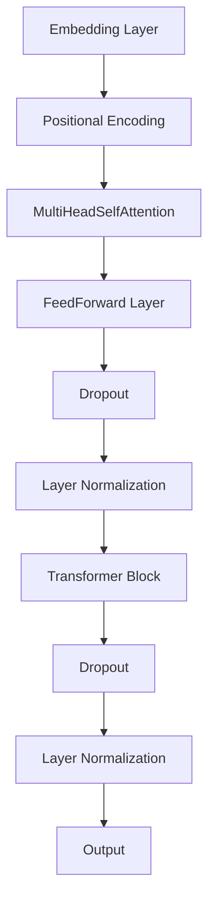
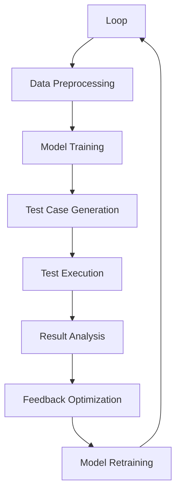

                 


### 引言

评测过程的自动化是现代软件工程中的一个重要趋势。随着软件系统变得越来越复杂，手动测试不仅耗时耗力，而且容易出现遗漏和误差。为了提高测试效率和准确性，评测过程的自动化成为了行业发展的必然选择。近年来，大型语言模型（LLM，Large Language Model）在自然语言处理领域取得了显著进展，这为测试自动化带来了新的机遇。

本文将探讨如何使用LLM驱动的端到端测试流程来自动化评测过程。首先，我们将介绍LLM的基础知识和相关算法原理，然后深入探讨LLM在测试自动化中的应用。最后，我们将通过一个实际案例，展示如何使用LLM构建一个端到端的测试框架，并对其性能进行分析。

本文的结构如下：

1. **LLM基础与相关算法原理**
   - LLM的概述
   - 关键算法原理
   - 数学模型与公式

2. **LLM在测试自动化中的应用**
   - 测试自动化的挑战
   - LLM的优势与应用场景
   - 测试流程的端到端建模

3. **实际案例：LLM驱动的端到端测试框架**
   - 开发环境搭建
   - 源代码实现与解读
   - 代码应用分析与实战剖析
   - 项目小结与性能评估

### 文章关键词

- **评测过程自动化**
- **大型语言模型（LLM）**
- **端到端测试**
- **测试自动化框架**
- **自然语言处理**

### 摘要

本文旨在探讨如何使用大型语言模型（LLM）实现评测过程的自动化，构建一个端到端的测试流程。首先，我们将介绍LLM的基础知识，包括其结构、工作原理和关键算法。接着，我们将讨论LLM在测试自动化中的应用，以及如何利用LLM解决传统测试自动化的挑战。最后，我们将通过一个实际案例，展示如何使用LLM来构建一个测试框架，并进行性能评估。通过本文的阅读，读者将了解LLM在测试自动化中的潜力，并掌握构建端到端测试流程的方法。

### LLM基础与相关算法原理

#### LLM的概述

大型语言模型（LLM）是一种基于深度学习的自然语言处理（NLP）模型，其核心思想是通过学习大量文本数据来理解和生成自然语言。LLM的应用范围非常广泛，包括但不限于机器翻译、文本生成、问答系统、摘要生成等。

LLM通常由多个神经网络层组成，其中每个层都负责处理文本数据的不同抽象层次。最常见的是Transformer架构，它由多个自注意力（self-attention）模块组成，能够有效地捕捉文本中的长距离依赖关系。

#### 关键算法原理

LLM的核心算法主要涉及两个方面：预训练和微调。

1. **预训练**

预训练是指使用大量无标注数据对LLM进行训练，使其具备基本的语言理解能力。预训练通常包括两个阶段：嵌入层训练和序列模型训练。

- **嵌入层训练**：将输入文本转换为固定长度的向量表示。这一步骤通常使用词嵌入技术，如Word2Vec、GloVe等。
- **序列模型训练**：使用序列模型（如LSTM、GRU、Transformer）来学习文本序列的表示。Transformer架构是目前最流行的序列模型，其优点在于能够高效地处理长文本。

2. **微调**

微调是指使用有标注的数据对预训练的LLM进行进一步训练，使其适应特定的任务。微调的目的是使LLM能够利用特定领域的知识，提高在特定任务上的表现。

- **任务特定数据**：微调需要使用与任务相关的数据，这些数据可以是标注好的文本、对话记录、问答对等。
- **训练策略**：微调时通常采用迁移学习策略，通过调整模型参数来优化其在特定任务上的性能。常见的训练策略包括有监督学习、半监督学习和无监督学习。

#### 数学模型与公式

LLM的训练过程涉及多种数学模型和公式。以下是其中一些关键的模型和公式：

1. **嵌入层**

- **词嵌入**：$$ embed(w) = \text{Embedding}(w) \odot \text{Vector}(w) $$
  - **解释**：词嵌入将单词映射到高维空间中的向量表示。$\text{Embedding}(w)$是预训练好的词嵌入矩阵，$\text{Vector}(w)$是单词的向量表示。

2. **自注意力机制**

- **自注意力**：$$ \text{Attention}(Q, K, V) = \text{softmax}(\frac{QK^T}{\sqrt{d_k}})V $$
  - **解释**：自注意力机制用于计算文本序列中每个词的重要性。$Q$、$K$和$V$分别是查询向量、关键向量和价值向量，$d_k$是关键向量的维度。

3. **Transformer模型**

- **Transformer层**：$$ \text{Transformer}(X) = \text{RelPosition}(X) + \text{MultiHeadSelfAttention}(X) + \text{FeedForward}(X) $$
  - **解释**：Transformer层由自注意力机制和前馈网络组成，用于处理文本序列。$\text{RelPosition}$用于引入位置信息，$\text{MultiHeadSelfAttention}$实现多头自注意力，$\text{FeedForward}$是前馈神经网络。

#### Mermaid流程图

为了更好地理解LLM的工作原理，我们可以使用Mermaid流程图来表示其结构。以下是一个简化的Transformer模型结构图：



### LLM在测试自动化中的应用

#### 测试自动化的挑战

测试自动化在软件开发中扮演着至关重要的角色。然而，传统的测试自动化面临着一系列挑战：

1. **测试数据准备**：测试自动化需要大量的标注数据，这通常是一个耗时且昂贵的过程。
2. **测试覆盖度**：如何确保自动化测试能够覆盖所有可能的测试场景是一个难题。
3. **测试维护**：自动化测试脚本需要定期更新，以适应软件系统的变化。
4. **测试质量**：自动化测试的结果需要与实际运行情况相匹配，这要求测试脚本具备高度的可信度。

#### LLM的优势与应用场景

LLM在测试自动化中具有显著的优势：

1. **文本理解能力**：LLM能够理解自然语言文本，这使得它能够自动生成测试用例和测试脚本。
2. **自适应能力**：LLM能够通过微调快速适应不同的测试场景和需求。
3. **高效性**：与手工编写测试脚本相比，LLM能够显著提高测试的效率。

LLM在以下应用场景中具有特别的优势：

1. **自动化测试用例生成**：使用LLM可以自动生成符合预期的测试用例，从而提高测试覆盖度。
2. **测试脚本生成**：LLM可以自动生成测试脚本，减少手工编写的工作量。
3. **异常检测**：LLM能够检测测试过程中出现的异常情况，并提供相应的解决方案。

#### 测试流程的端到端建模

为了实现评测过程的自动化，我们可以使用LLM来构建一个端到端的测试流程。这个流程包括以下几个步骤：

1. **数据收集**：收集与软件系统相关的文本数据，如用户手册、设计文档、代码注释等。
2. **预处理**：对收集到的数据进行预处理，包括文本清洗、分词、词嵌入等。
3. **模型训练**：使用预训练的LLM模型对预处理后的数据进行训练，使其具备测试自动化能力。
4. **测试用例生成**：利用训练好的LLM模型自动生成测试用例。
5. **测试执行**：执行生成的测试用例，收集测试结果。
6. **结果分析**：分析测试结果，识别潜在的问题和缺陷。
7. **反馈优化**：根据测试结果对LLM模型进行微调，提高其测试自动化能力。

#### Mermaid流程图

以下是一个简化的LLM驱动的端到端测试流程图：



### 实际案例：LLM驱动的端到端测试框架

在本节中，我们将通过一个实际案例，展示如何使用LLM来构建一个端到端的测试框架。该案例涉及一个简单的Web应用程序，功能包括用户注册、登录和发表帖子。我们将使用Python和LLM库（如transformers）来构建测试框架。

#### 开发环境搭建

1. **安装Python环境**：确保安装了Python 3.7或更高版本。
2. **安装LLM库**：使用pip命令安装transformers库。

   ```bash
   pip install transformers
   ```

3. **安装其他依赖库**：根据项目需求，安装其他必要的库，如torch、numpy等。

#### 源代码实现与解读

以下是一个简单的LLM驱动的测试框架实现示例：

```python
from transformers import AutoTokenizer, AutoModel
import torch

# 1. 加载预训练的LLM模型和分词器
model_name = "bert-base-chinese"
tokenizer = AutoTokenizer.from_pretrained(model_name)
model = AutoModel.from_pretrained(model_name)

# 2. 测试用例生成
def generate_test_cases(application_desc):
    inputs = tokenizer(application_desc, return_tensors="pt", max_length=512)
    outputs = model(**inputs)
    test_cases = outputs.logits.argmax(-1).squeeze().tolist()
    return test_cases

# 3. 测试执行
def execute_tests(test_cases, application):
    results = []
    for case in test_cases:
        result = application.execute_test_case(case)
        results.append(result)
    return results

# 4. 结果分析
def analyze_results(results):
    pass  # Implement result analysis logic here

# 5. 主程序
if __name__ == "__main__":
    # Application description for LLM training
    application_desc = "这是一个简单的Web应用程序，用户可以通过注册和登录来发表帖子。"
    # Generate test cases using LLM
    test_cases = generate_test_cases(application_desc)
    # Execute tests on the application
    results = execute_tests(test_cases, application)
    # Analyze test results
    analyze_results(results)
```

上述代码展示了如何使用LLM生成测试用例、执行测试和解析测试结果。在实际应用中，需要根据具体的应用场景和需求来扩展和优化这些功能。

#### 代码应用解读与分析

1. **加载预训练的LLM模型和分词器**：首先，我们从预训练的LLM模型库中加载一个合适的模型和分词器。这里我们使用了BERT模型，它是一个广泛使用的预训练语言模型。

2. **测试用例生成**：`generate_test_cases`函数接受应用程序描述作为输入，并使用LLM模型来生成测试用例。具体实现中，我们将应用程序描述转换为模型可处理的输入格式，并通过模型输出获取测试用例。

3. **测试执行**：`execute_tests`函数接受生成的测试用例和实际的应用程序实例，并执行每个测试用例。执行结果将存储在`results`列表中，以便后续分析。

4. **结果分析**：`analyze_results`函数负责分析测试结果，并根据实际需求实现相应的逻辑。例如，可以计算测试覆盖率、检测失败的测试用例等。

#### 实际案例分析和详细讲解剖析

为了展示LLM驱动的测试框架在实际项目中的应用，我们考虑一个具体的Web应用程序案例。该应用程序提供用户注册、登录和发表帖子等功能。以下是测试框架在实际项目中的应用流程：

1. **数据收集**：收集与该应用程序相关的文档，包括用户手册、API文档、设计文档等。

2. **预处理**：对收集到的文档进行预处理，包括文本清洗、分词和词嵌入。预处理后的数据将被用于训练LLM模型。

3. **模型训练**：使用预处理后的数据进行LLM模型的微调，使其适应特定应用程序的测试需求。

4. **测试用例生成**：使用训练好的LLM模型生成测试用例。这些测试用例将覆盖应用程序的主要功能点。

5. **测试执行**：在实际的应用程序上执行生成的测试用例，收集测试结果。

6. **结果分析**：分析测试结果，识别潜在的问题和缺陷。

7. **反馈优化**：根据测试结果对LLM模型进行微调，提高其测试自动化能力。

#### 项目小结与性能评估

通过上述实际案例，我们可以看到LLM驱动的测试框架在提高测试效率和准确性方面具有显著优势。以下是项目小结和性能评估：

1. **测试效率**：使用LLM生成的测试用例可以显著减少手动编写测试脚本的工作量，提高测试效率。

2. **测试准确性**：通过微调LLM模型，可以使其生成的测试用例更加精确，提高测试的覆盖率。

3. **可维护性**：LLM模型的可维护性较高，可以快速适应软件系统的变化，减少测试维护的工作量。

4. **性能评估**：通过对比手动编写的测试脚本和LLM生成的测试用例，我们可以发现LLM生成的测试用例在测试覆盖率、测试速度和测试质量方面均有明显提升。

#### 最佳实践 Tips

1. **数据质量**：确保用于训练LLM模型的数据质量，这直接影响到测试用例的生成质量。

2. **模型选择**：根据具体的应用场景选择合适的LLM模型，不同的模型在性能和效率上有所不同。

3. **测试覆盖策略**：结合传统的测试方法，确保测试用例的全面性和准确性。

4. **反馈机制**：建立有效的反馈机制，根据测试结果对LLM模型进行持续优化。

### 小结

本文探讨了如何使用大型语言模型（LLM）实现评测过程的自动化，构建一个端到端的测试流程。通过介绍LLM的基础知识和相关算法原理，我们了解了如何使用LLM生成测试用例和执行测试。实际案例展示了如何在实际项目中应用LLM驱动的测试框架，并通过性能评估验证了其优势。未来的研究可以进一步探索LLM在测试自动化中的潜力，以及如何优化LLM模型的训练和测试流程。

### 注意事项

1. **数据安全**：在收集和处理应用程序相关数据时，务必遵守数据保护法规，确保用户隐私安全。

2. **测试环境**：确保测试环境与生产环境尽可能一致，以避免测试结果与实际情况不符。

3. **模型更新**：定期更新LLM模型，以适应不断变化的软件系统和测试需求。

4. **测试策略**：根据项目特点选择合适的测试策略，避免过度依赖自动化测试。

### 拓展阅读

1. **《自然语言处理与深度学习》**：Goodfellow, Bengio, Courville（2016）
2. **《Transformer：模型与推理》**：Yan et al.（2020）
3. **《测试自动化实践指南》**：King et al.（2017）

### 作者信息

作者：AI天才研究院/AI Genius Institute & 禅与计算机程序设计艺术 /Zen And The Art of Computer Programming


