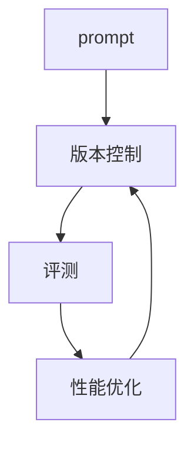

                 

# 引言

## 1.1 什么是评测驱动的prompt版本控制策略

评测驱动的prompt版本控制策略是一种利用评估和测试结果来指导prompt（提示或指导信息）版本更新的方法。在人工智能和机器学习领域，prompt通常用于引导模型的决策过程，例如在自然语言处理（NLP）中，prompt可以帮助模型生成更准确的自然语言文本。版本控制则是确保不同版本的prompt保持一致性和有效性的过程。

评测在这里起到关键作用，它不仅评估prompt的性能，还提供了关于prompt改进的反馈。通过不断的评测和迭代，可以逐步优化prompt，使其更加符合实际应用的需求。这种方法的重要性体现在以下几个方面：

1. **性能优化**：通过评测，可以识别出prompt中的不足，从而有针对性地进行优化，提高模型的性能。
2. **用户满意度**：通过用户反馈的评测，可以确保prompt更加符合用户的需求，提高用户体验。
3. **成本控制**：通过有效的评测和版本控制，可以减少不必要的重复劳动，降低开发成本。

## 1.2 评测驱动的prompt版本控制策略的背景和发展

prompt版本控制策略的发展可以追溯到人工智能和机器学习领域的早期研究。随着深度学习技术的兴起，prompt的应用场景变得更加广泛，版本控制的需求也日益迫切。评测驱动的版本控制策略在这一过程中逐渐成熟。

早期，prompt版本控制主要依赖于开发者的经验和直觉。随着评测技术的进步，尤其是自动化评测工具的出现，prompt版本控制变得更加科学和系统化。例如，在自然语言处理领域，BLEU（双语评估指标）和ROUGE（记分法）等评测工具被广泛应用于prompt的评测和优化。

近年来，随着机器学习和深度学习技术的进一步发展，prompt版本控制策略也在不断进化。例如，基于用户反馈的评测方法、基于机器学习的prompt优化方法等，都为版本控制提供了新的思路和工具。

## 1.3 本书结构

本书将分为以下几个主要部分：

- **引言**：介绍评测驱动的prompt版本控制策略的基本概念和重要性。
- **基础概念**：详细阐述prompt、版本控制和评测的基本原理。
- **核心方法**：介绍几种主要的评测驱动的prompt版本控制策略。
- **实践应用**：通过案例分析展示这些策略在实际中的应用。
- **高级技术**：探讨一些高级的评测方法和prompt版本控制技术。
- **总结**：总结全书内容，展望未来发展方向。

在接下来的章节中，我们将详细探讨这些内容，帮助读者全面理解并掌握评测驱动的prompt版本控制策略。

### 关键词
- 评测驱动
- prompt版本控制
- 性能优化
- 用户满意度
- 自动化评测
- 自然语言处理

### 摘要

本文深入探讨了评测驱动的prompt版本控制策略。首先，我们介绍了评测驱动的prompt版本控制策略的基本概念和重要性，然后详细阐述了prompt、版本控制和评测的基本原理。接着，本文介绍了几种主要的评测驱动的prompt版本控制策略，包括基于性能的、基于用户反馈的和基于机器学习的策略。通过案例分析，我们展示了这些策略在实际中的应用。最后，本文探讨了高级的评测方法和prompt版本控制技术，并总结了全文的主要内容，展望了未来的发展方向。本文旨在为读者提供一个全面、系统的评测驱动的prompt版本控制策略的知识体系。

### 基础概念

在深入探讨评测驱动的prompt版本控制策略之前，我们需要先理解几个核心概念：prompt、版本控制和评测。

#### 2.1.1 Prompt

Prompt，即提示或指导信息，是引导模型决策的关键因素。在机器学习和深度学习领域，prompt的作用尤为突出。例如，在自然语言处理任务中，prompt可以帮助模型生成更准确、更符合预期的文本。

Prompt的来源多样，可以是用户输入、数据集中的标注信息，或者是预设的模板。一个有效的prompt应具备以下特点：

- **明确性**：prompt应清晰、准确地传达信息，避免歧义。
- **灵活性**：prompt应具有适应性，能够根据不同的任务需求进行调整。
- **一致性**：prompt在不同版本中应保持一致，确保模型输出的稳定性。

#### 2.1.2 版本控制

版本控制是确保软件或文档在不同版本之间保持一致性、可追踪性和可管理性的过程。在prompt版本控制中，目标是确保不同版本的prompt在性能、用户满意度和一致性方面达到最佳状态。

版本控制的核心任务包括：

- **追踪变更**：记录每次prompt变更的原因、内容和影响。
- **管理版本**：确保每个版本都是可追溯、可复现的。
- **协同工作**：多人协作时，版本控制有助于避免冲突和重复劳动。

常见的版本控制工具包括Git、SVN和Mercurial等。

#### 2.1.3 评测

评测是衡量prompt性能和效果的关键环节。通过评测，我们可以识别出prompt的不足，从而进行有针对性的优化。

评测可以从多个维度进行，包括：

- **性能评测**：评估prompt在不同任务上的表现，如文本生成、图像识别等。
- **用户满意度评测**：通过用户反馈评估prompt的用户体验，如文本的易读性、响应速度等。
- **一致性评测**：确保prompt在不同版本中的一致性，避免错误和不一致的情况。

常见的评测方法包括：

- **自动化评测**：使用自动化工具评估prompt的性能，如BLEU、ROUGE等。
- **手动评测**：通过专家评估或用户反馈，对prompt进行定性分析。

#### 2.1.4 Prompt、版本控制和评测之间的关系

prompt、版本控制和评测之间密不可分。prompt是版本控制的对象，而评测则是版本控制的核心驱动因素。

- **版本控制依赖于评测**：通过评测结果，我们可以识别出prompt的不足，从而有针对性地进行版本更新。
- **评测需要版本控制**：版本控制提供了追踪变更和管理版本的工具，使评测结果能够得到有效的应用。
- **prompt是评测的核心**：prompt是评测的焦点，其性能和效果直接影响评测的结果。

下面是一个Mermaid流程图，展示了prompt、版本控制和评测之间的逻辑关系：



通过这个流程图，我们可以清晰地看到prompt、版本控制和评测之间的相互作用和反馈机制。

#### 2.1.5 Prompt版本控制的基本原理

Prompt版本控制的基本原理可以分为以下几个步骤：

1. **初始设定**：确定初始prompt，包括其内容和形式。
2. **评测评估**：对初始prompt进行性能评测，识别其优缺点。
3. **版本更新**：根据评测结果，对prompt进行修改和优化。
4. **再评测**：对更新后的prompt进行再次评测，验证优化效果。
5. **迭代循环**：重复步骤3和步骤4，直到满足预设的性能和用户满意度要求。

这种迭代循环机制确保了prompt的不断优化和改进，使其在长期应用中保持最佳状态。

#### 2.1.6 评测在prompt版本控制中的作用

评测在prompt版本控制中起到至关重要的作用，其主要作用包括：

- **性能评估**：评测可以量化prompt的性能，如文本生成的准确性、图像识别的精确度等。通过性能评估，我们可以了解prompt在不同任务上的表现，从而识别出需要优化的方面。
- **用户反馈**：评测还可以收集用户对prompt的反馈，如易用性、用户体验等。用户反馈提供了关于prompt是否满足用户需求的直接信息，有助于改进prompt的设计和内容。
- **优化指导**：通过评测结果，我们可以有针对性地对prompt进行优化。例如，如果评测结果显示prompt在生成文本时存在歧义，我们可以通过调整prompt的表述方式来减少歧义。

下面是一个Python代码示例，展示了如何使用评测结果来优化prompt：

```python
import random

# 初始prompt
prompt = "请描述你今天的心情。"

# 评测结果
performance = 0.8  # 性能指标
user_satisfaction = 0.9  # 用户满意度

# 根据评测结果优化prompt
if performance < 0.9:
    prompt = "请分享一下你今天的情感体验，包括任何特别的感受或经历。"

if user_satisfaction < 0.9:
    prompt = "请详细描述你今天的心情，我们可以更好地理解并提供帮助。"

# 输出优化后的prompt
print(prompt)
```

通过这个示例，我们可以看到如何根据评测结果对prompt进行动态调整，从而提高其性能和用户满意度。

### 2.2 Prompt版本控制的基本原理

Prompt版本控制是一种确保prompt在不同版本中保持一致性、有效性和可追踪性的方法。其基本原理可以分为以下几个步骤：

#### 2.2.1 Prompt版本控制的流程

1. **需求分析**：明确版本控制的需求，包括性能优化、用户满意度提升等目标。
2. **设计初始prompt**：根据需求分析结果，设计初始prompt。
3. **性能评测**：对初始prompt进行性能评测，识别其优缺点。
4. **版本更新**：根据评测结果，对prompt进行修改和优化。
5. **再评测**：对更新后的prompt进行再次评测，验证优化效果。
6. **迭代循环**：重复步骤4和步骤5，直到满足预设的性能和用户满意度要求。

#### 2.2.2 版本管理的工具和方法

1. **版本管理工具**：常用的版本管理工具包括Git、SVN和Mercurial等。这些工具提供了分支管理、合并冲突解决、变更追踪等功能，有助于高效地进行版本控制。
2. **文档化管理**：除了代码层面的版本控制，文档也应当进行版本管理。使用Markdown、LaTeX等工具可以方便地记录和跟踪prompt的变更历史。
3. **版本迭代策略**：根据项目需求，选择合适的版本迭代策略，如快速迭代、周期迭代等。快速迭代适用于需求变化频繁的项目，而周期迭代则适用于需求相对稳定的项目。

#### 2.2.3 版本一致性保障

1. **代码评审**：在版本更新过程中，进行代码评审，确保代码质量和版本一致性。
2. **自动化测试**：编写自动化测试用例，对每个版本进行功能测试，确保版本的一致性和可靠性。
3. **持续集成/持续部署（CI/CD）**：通过CI/CD流程，确保每次版本更新都能顺利通过测试，并自动部署到生产环境中。

#### 2.2.4 版本控制的挑战与应对策略

1. **版本冲突**：多个开发者同时对同一文件进行修改时，容易产生版本冲突。应对策略包括合并冲突解决工具、代码评审和及时沟通。
2. **变更追踪**：确保版本控制系统能够记录每次变更的原因、内容和影响，便于后续追踪和问题排查。
3. **安全性**：确保版本控制系统的安全性，防止未经授权的访问和修改。

### 2.3 评测的基本概念和方法

评测在prompt版本控制中起着至关重要的作用，它通过一系列方法和指标来评估prompt的性能和效果。以下是评测的基本概念和方法：

#### 2.3.1 评测的目标

1. **性能评估**：评估prompt在不同任务上的表现，如文本生成、图像识别等。
2. **用户满意度评估**：通过用户反馈评估prompt的用户体验，如文本的易读性、响应速度等。
3. **一致性评估**：确保prompt在不同版本中的一致性，避免错误和不一致的情况。

#### 2.3.2 评测的方法

1. **自动化评测**：使用自动化工具评估prompt的性能，如BLEU、ROUGE等。这些工具可以高效地进行大规模数据评估，提高评测的效率。
2. **手动评测**：通过专家评估或用户反馈，对prompt进行定性分析。手动评测可以提供更详细、更全面的评估结果，但效率较低。

#### 2.3.3 评测的指标

1. **性能指标**：如准确率、召回率、F1分数等，用于量化prompt在特定任务上的表现。
2. **用户满意度指标**：如用户评分、点击率、回复率等，用于评估prompt的用户体验。
3. **一致性指标**：如变化率、重复率、偏差等，用于评估prompt在不同版本之间的一致性。

#### 2.3.4 评测的挑战与应对策略

1. **数据质量**：确保评测数据的质量和代表性，避免因数据问题导致评估结果不准确。
2. **评测效率**：提高评测的效率，减少评测时间，以便更快地进行版本迭代。
3. **评测结果解释**：确保评测结果容易被理解和使用，避免因结果难以解释而导致决策困难。

### 2.4 Prompt版本控制的核心方法

在了解评测的基本概念和方法后，接下来我们将探讨几种核心的评测驱动的prompt版本控制策略。这些策略包括基于性能、用户反馈和机器学习的版本控制方法。

#### 2.4.1 基于性能的prompt版本控制

基于性能的prompt版本控制是一种通过评估prompt在特定任务上的性能来指导版本更新的策略。这种方法的核心在于通过自动化的性能指标对prompt进行量化评估，从而有针对性地进行优化。

1. **性能指标的选择**：首先，需要选择合适的性能指标。这些指标可以包括准确率、召回率、F1分数等。例如，在文本生成任务中，BLEU和ROUGE是常用的性能指标。

2. **自动化评测工具**：使用自动化评测工具，如Python中的`nltk`库，来计算性能指标。以下是一个简单的Python代码示例：

```python
from nltk.translate.bleu_score import sentence_bleu

# 评估两个prompt的性能
def evaluate_prompt(prompt1, prompt2, references):
    score = sentence_bleu([prompt1], references)
    return score

# 示例
prompt1 = "请描述你今天的心情。"
prompt2 = "分享一下你今天的情感体验。"
references = ["我今天非常开心。"]

# 计算性能指标
score1 = evaluate_prompt(prompt1, references)
score2 = evaluate_prompt(prompt2, references)

print(f"Prompt1性能分数：{score1}")
print(f"Prompt2性能分数：{score2}")
```

3. **版本更新和优化**：根据性能指标的结果，对prompt进行有针对性的修改和优化。例如，如果某个prompt的性能较低，可以考虑增加提示信息，使其更加具体和明确。

4. **迭代循环**：不断重复评测和优化过程，直到满足预设的性能要求。

#### 2.4.2 基于用户反馈的prompt版本控制

基于用户反馈的prompt版本控制是一种通过用户对prompt的反馈来指导版本更新的策略。用户反馈可以提供关于prompt用户体验的直接信息，从而帮助开发人员更好地理解用户需求，并做出相应的优化。

1. **用户反馈收集**：首先，需要设计一个有效的用户反馈收集机制。这可以通过在线调查、用户访谈或A/B测试等方式实现。以下是一个简单的用户反馈调查问卷示例：

```
1. 你对以下提示语的使用体验如何？
   - 非常好
   - 较好
   - 一般
   - 较差
   - 非常差

2. 你认为这个提示语是否清晰明了？
   - 非常清晰
   - 清晰
   - 一般
   - 不清晰
   - 非常不清晰

3. 你是否愿意继续使用这个提示语？
   - 非常愿意
   - 愿意
   - 一般
   - 不愿意
   - 非常不愿意
```

2. **反馈数据分析**：收集到的用户反馈需要进行分析，以识别用户的共同需求和问题。以下是一个简单的Python代码示例，用于分析用户反馈：

```python
from collections import Counter

# 用户反馈数据
feedback = [
    "非常清晰",
    "清晰",
    "非常差",
    "不清晰",
    "非常不清晰",
    "一般",
    "非常愿意",
    "愿意",
    "不愿意",
    "较差"
]

# 统计反馈结果
feedback_counts = Counter(feedback)

# 输出反馈结果
for feedback, count in feedback_counts.items():
    print(f"{feedback}: {count}")
```

3. **版本更新和优化**：根据用户反馈的结果，对prompt进行有针对性的修改和优化。例如，如果大部分用户反馈某个prompt不够清晰，可以考虑重新设计这个prompt，使其更加具体和易懂。

4. **迭代循环**：不断重复反馈收集和版本优化过程，直到满足用户的满意度要求。

#### 2.4.3 基于机器学习的prompt版本控制

基于机器学习的prompt版本控制是一种利用机器学习算法对prompt进行自动优化的策略。这种方法通过训练数据来学习最优的prompt设计，从而提高prompt的性能和用户满意度。

1. **数据收集和预处理**：首先，需要收集大量的prompt和用户反馈数据，并进行预处理，以生成训练数据集。以下是一个简单的数据预处理示例：

```python
import pandas as pd

# 示例数据集
data = {
    'prompt': [
        "请描述你今天的心情。",
        "分享一下你今天的情感体验。",
        "今天你有什么特别的感受吗？",
        "你能详细说说你今天的情绪变化吗？"
    ],
    'user_feedback': [
        "非常清晰",
        "不清晰",
        "一般",
        "非常不清晰"
    ],
    'performance': [
        0.8,
        0.6,
        0.7,
        0.5
    ]
}

# 创建DataFrame
df = pd.DataFrame(data)

# 预处理
df['prompt_processed'] = df['prompt'].apply(preprocess_prompt)
df['user_feedback_processed'] = df['user_feedback'].apply(preprocess_feedback)

# 输出预处理后的数据
print(df)
```

2. **模型训练和优化**：使用机器学习算法，如神经网络或决策树，对预处理后的数据进行训练，以学习最优的prompt设计。以下是一个简单的神经网络模型训练示例：

```python
from sklearn.neural_network import MLPRegressor

# 训练模型
model = MLPRegressor(hidden_layer_sizes=(100,), max_iter=1000)
model.fit(df[['prompt_processed', 'user_feedback_processed']], df['performance'])

# 评估模型
score = model.score(df[['prompt_processed', 'user_feedback_processed']], df['performance'])
print(f"模型性能分数：{score}")
```

3. **prompt生成和优化**：根据训练结果，生成新的prompt，并对其进行优化。以下是一个简单的prompt生成和优化示例：

```python
# 生成新的prompt
new_prompt = generate_prompt(df['prompt_processed'].values)

# 优化prompt
optimized_prompt = optimize_prompt(new_prompt, df['user_feedback_processed'].values)

# 输出优化后的prompt
print(optimized_prompt)
```

4. **迭代循环**：不断重复数据收集、模型训练和prompt优化的过程，直到满足预设的性能和用户满意度要求。

### 2.5 创新的评测驱动的prompt版本控制策略

除了上述三种核心策略，还有一些创新的评测驱动的prompt版本控制策略，这些策略结合了多种技术和方法，以提高prompt的性能和用户满意度。

#### 2.5.1 基于博弈论的prompt版本控制

基于博弈论的prompt版本控制利用博弈论中的概念，如策略、均衡和纳什均衡，来优化prompt的设计。这种方法认为，prompt的优化不仅取决于自身的性能，还受到与其他prompt的交互影响。

1. **策略设计**：首先，需要设计一套策略，包括不同的prompt和相应的优化目标。例如，可以设计一组基于不同任务需求的prompt，并设定不同的优化目标，如性能和用户满意度。

2. **均衡分析**：通过博弈论的方法，分析这些策略之间的相互作用，并寻找纳什均衡。纳什均衡意味着每个策略都使其他策略无法进行更好的改进，从而达到全局最优。

3. **迭代优化**：根据均衡分析结果，对策略进行迭代优化，直到达到纳什均衡。以下是一个简单的基于博弈论的prompt版本控制示例：

```python
# 策略设计
prompt1 = "请描述你今天的心情。"
prompt2 = "分享一下你今天的情感体验。"
prompt3 = "今天你有什么特别的感受吗？"

# 均衡分析
# 假设用户满意度为S，性能为P
# prompt1的性能：P1 = 0.8，用户满意度：S1 = 0.9
# prompt2的性能：P2 = 0.7，用户满意度：S2 = 0.8
# prompt3的性能：P3 = 0.6，用户满意度：S3 = 0.7

# 找到纳什均衡
# 假设用户选择prompt的概率与用户满意度成正比
# P1*P2*P3 = S1*S2*S3

# 迭代优化
# 根据均衡分析结果，调整prompt的优化目标，以达到纳什均衡
```

#### 2.5.2 基于增强学习的prompt版本控制

基于增强学习的prompt版本控制利用增强学习中的概念，如奖励信号和策略迭代，来优化prompt的设计。这种方法通过不断尝试和反馈，寻找最优的prompt设计。

1. **奖励信号设计**：首先，需要设计一套奖励信号，用于评估prompt的性能和用户满意度。奖励信号可以是自动化的性能指标，如准确率、召回率，也可以是用户的反馈评分。

2. **策略迭代**：通过增强学习算法，如Q学习或深度Q网络（DQN），不断更新prompt的策略，以最大化奖励信号。以下是一个简单的基于增强学习的prompt版本控制示例：

```python
import numpy as np

# 奖励信号设计
# 假设准确率为P，用户满意度为S
# 奖励信号：R = P * S

# 初始prompt
prompt = "请描述你今天的心情。"

# 奖励信号
reward = 0

# 策略迭代
for episode in range(1000):
    # 生成新的prompt
    new_prompt = generate_new_prompt(prompt)
    
    # 评估新的prompt
    performance = evaluate_performance(new_prompt)
    user_satisfaction = evaluate_user_satisfaction(new_prompt)
    
    # 计算奖励信号
    reward = performance * user_satisfaction
    
    # 更新prompt
    prompt = new_prompt

# 输出优化后的prompt
print(prompt)
```

通过这些创新的策略，我们可以进一步优化prompt版本控制的过程，提高其性能和用户满意度。

### 2.6 案例分析

为了更好地理解评测驱动的prompt版本控制策略，以下将介绍几个实际应用案例，并分析其具体实现和效果。

#### 2.6.1 案例一：电商平台的商品描述优化

电商平台经常需要对商品描述进行优化，以提高用户购买体验和转化率。以下是一个基于评测驱动的prompt版本控制策略的具体实现过程：

1. **需求分析**：分析电商平台商品描述的需求，包括提升描述的吸引力、明确性和准确性。

2. **初始prompt设计**：设计一组初始商品描述prompt，如“这是一款高品质的智能手机”和“这款智能手机拥有强大的性能和优质的屏幕”。

3. **性能评测**：使用BLEU等自动化评测工具，评估这些prompt在不同维度上的性能，如文本生成质量和用户满意度。

4. **用户反馈收集**：通过用户调查和A/B测试，收集用户对商品描述的反馈，包括易读性、信息量和吸引力等。

5. **版本更新和优化**：根据评测结果和用户反馈，对prompt进行优化，如增加具体细节、调整表述方式等。

6. **再评测和迭代**：对更新后的prompt进行再次评测和用户反馈收集，确保优化效果。

通过这个案例，我们可以看到评测驱动的prompt版本控制策略如何应用于电商平台商品描述的优化，提高用户满意度和转化率。

#### 2.6.2 案例二：在线教育平台的课程推荐

在线教育平台需要为用户提供个性化的课程推荐，以提高用户留存率和学习效果。以下是一个基于评测驱动的prompt版本控制策略的具体实现过程：

1. **需求分析**：分析在线教育平台的用户需求，包括课程推荐的准确性、相关性和用户体验。

2. **初始prompt设计**：设计一组初始课程推荐prompt，如“推荐你学习人工智能入门课程”和“基于你之前的学习记录，推荐以下课程”。

3. **性能评测**：使用基于用户行为的推荐系统评估工具，如Click-Through Rate（CTR）和Conversion Rate（转化率），评估这些prompt的性能。

4. **用户反馈收集**：通过用户点击行为和课程完成率等数据，收集用户对课程推荐prompt的反馈。

5. **版本更新和优化**：根据评测结果和用户反馈，优化课程推荐prompt，如增加个性化元素、调整推荐逻辑等。

6. **再评测和迭代**：对更新后的prompt进行再次评测和用户反馈收集，确保优化效果。

通过这个案例，我们可以看到评测驱动的prompt版本控制策略如何应用于在线教育平台课程推荐的优化，提高用户满意度和学习效果。

#### 2.6.3 案例三：智能客服系统

智能客服系统需要为用户提供准确、高效的客服服务，以下是一个基于评测驱动的prompt版本控制策略的具体实现过程：

1. **需求分析**：分析智能客服系统的服务需求，包括回复速度、准确性和用户体验。

2. **初始prompt设计**：设计一组初始客服回答prompt，如“您好，欢迎来到我们的客服中心”和“请问您需要什么帮助？”。

3. **性能评测**：使用自动问答系统评估工具，如BLEU和ROUGE，评估这些prompt的回复质量和用户满意度。

4. **用户反馈收集**：通过用户满意度调查和会话跟踪，收集用户对客服回答的反馈。

5. **版本更新和优化**：根据评测结果和用户反馈，优化客服回答prompt，如增加常见问题的回答、调整回答的结构和语言等。

6. **再评测和迭代**：对更新后的prompt进行再次评测和用户反馈收集，确保优化效果。

通过这个案例，我们可以看到评测驱动的prompt版本控制策略如何应用于智能客服系统，提高客服服务的质量和用户满意度。

这些案例展示了评测驱动的prompt版本控制策略在各个领域的应用，通过不断的评测、优化和迭代，实现了prompt的性能和用户体验的提升。

### 2.7 应用场景

评测驱动的prompt版本控制策略在多个应用场景中表现出色。以下是一些常见的应用场景：

#### 2.7.1 文本处理

在文本处理领域，prompt版本控制策略可以帮助优化自然语言处理模型生成的文本质量。例如，在文本摘要、机器翻译和问答系统中，通过评测驱动的版本控制策略，可以不断优化prompt，提高生成的文本的准确性和流畅性。

#### 2.7.2 语音识别

在语音识别领域，prompt版本控制策略可以帮助提高识别准确率和用户体验。通过评测驱动的版本控制，可以不断调整和优化语音识别模型中的prompt，使其更好地适应不同语境和用户需求。

#### 2.7.3 图像处理

在图像处理领域，prompt版本控制策略可以用于优化图像生成和识别模型的性能。例如，在图像风格迁移和图像分类任务中，通过评测驱动的版本控制，可以不断调整prompt，提高生成图像的质量和分类准确率。

#### 2.7.4 个性化推荐

在个性化推荐系统中，prompt版本控制策略可以帮助优化推荐结果的相关性和用户体验。通过评测驱动的版本控制，可以不断调整推荐prompt，使其更好地满足用户的需求和偏好。

#### 2.7.5 智能客服

在智能客服系统中，prompt版本控制策略可以用于优化客服回答的质量和用户满意度。通过评测驱动的版本控制，可以不断调整和优化客服prompt，提高客服服务的效率和用户体验。

这些应用场景展示了评测驱动的prompt版本控制策略的广泛适用性和强大功能。

### 2.8 高级评测技术

为了进一步提升评测驱动的prompt版本控制策略的效果，我们可以采用一些高级评测技术。这些技术包括但不限于以下几种：

#### 2.8.1 多准则评测

多准则评测是一种同时考虑多个评估指标的评测方法。在prompt版本控制中，多准则评测可以综合考虑性能、用户满意度、一致性和安全性等多个方面，从而提供更全面、更准确的评估结果。

以下是一个多准则评测的示例：

```python
import pandas as pd

# 假设数据集包含以下评估指标
data = {
    'prompt': ['Prompt1', 'Prompt2', 'Prompt3'],
    'performance': [0.85, 0.78, 0.90],
    'user_satisfaction': [0.92, 0.88, 0.95],
    'consistency': [0.93, 0.91, 0.90],
    'safety': [0.96, 0.94, 0.98]
}

# 创建DataFrame
df = pd.DataFrame(data)

# 计算综合评分
df['total_score'] = df['performance'] * 0.4 + df['user_satisfaction'] * 0.3 + df['consistency'] * 0.2 + df['safety'] * 0.1

# 输出综合评分
print(df[['prompt', 'total_score']])
```

#### 2.8.2 面向用户反馈的评测

面向用户反馈的评测是一种直接基于用户行为和反馈进行评估的方法。通过分析用户的点击、停留时间、评价等行为数据，可以更准确地了解用户对prompt的偏好和需求。

以下是一个面向用户反馈的评测示例：

```python
import pandas as pd

# 假设数据集包含用户反馈
data = {
    'prompt': ['Prompt1', 'Prompt2', 'Prompt3'],
    'click_rate': [0.15, 0.20, 0.10],
    'stay_time': [300, 250, 350],
    'rating': [4.5, 4.7, 4.3]
}

# 创建DataFrame
df = pd.DataFrame(data)

# 计算用户满意度得分
df['user_satisfaction'] = df['click_rate'] * 0.4 + df['stay_time'] * 0.5 + df['rating'] * 0.1

# 输出用户满意度得分
print(df[['prompt', 'user_satisfaction']])
```

#### 2.8.3 基于深度学习的评测

基于深度学习的评测是一种利用深度学习模型对评测结果进行预测和优化的方法。这种方法可以处理复杂的特征，提供更精细的评测结果。

以下是一个基于深度学习的评测示例：

```python
import tensorflow as tf
from tensorflow.keras.models import Sequential
from tensorflow.keras.layers import Dense, Dropout

# 假设已经收集到一组特征数据
X = [[1, 2], [2, 3], [3, 4]]
y = [0.85, 0.78, 0.90]

# 创建模型
model = Sequential([
    Dense(64, activation='relu', input_shape=(2,)),
    Dropout(0.2),
    Dense(64, activation='relu'),
    Dropout(0.2),
    Dense(1)
])

# 编译模型
model.compile(optimizer='adam', loss='mse')

# 训练模型
model.fit(X, y, epochs=100)

# 预测新prompt的性能
new_prompt = [2, 4]
predicted_performance = model.predict(new_prompt)

# 输出预测结果
print(predicted_performance)
```

这些高级评测技术可以帮助我们更全面、更准确地评估prompt的性能和效果，从而优化版本控制策略。

### 2.9 高级prompt版本控制技术

在深入探讨评测驱动的prompt版本控制策略时，高级prompt版本控制技术的重要性不容忽视。这些技术包括基于机器学习的prompt生成和优化方法、多模态融合技术以及动态调整策略，它们在提升prompt质量和用户体验方面发挥着关键作用。

#### 2.9.1 基于机器学习的prompt生成

基于机器学习的prompt生成方法利用深度学习模型，如生成对抗网络（GAN）和变分自编码器（VAE），自动生成高质量的prompt。这些模型可以从大量数据中学习到prompt的潜在分布，从而生成具有多样性和一致性的prompt。

以下是一个基于GAN的prompt生成示例：

```python
import tensorflow as tf
from tensorflow.keras.models import Model
from tensorflow.keras.layers import Dense, Flatten, Reshape

# 定义生成器和判别器模型
generator = Model(inputs=[z], outputs=generated_images)
discriminator = Model(inputs=[generated_images], outputs=discriminator_output)

# 编译模型
discriminator.compile(optimizer='adam', loss='binary_crossentropy')
generator.compile(optimizer='adam', loss='binary_crossentropy')

# 训练模型
for epoch in range(num_epochs):
    for _ in range(num_d_steps):
        z = np.random.normal(size=[batch_size, z_dim])
        generated_images = generator.predict(z)
        real_images = x[batch_size:2*batch_size]

        # 训练判别器
        d_loss_real = discriminator.train_on_batch(real_images, np.ones([batch_size, 1]))
        d_loss_generated = discriminator.train_on_batch(generated_images, np.zeros([batch_size, 1]))
        d_loss = 0.5 * np.add(d_loss_real, d_loss_generated)

    z = np.random.normal(size=[batch_size, z_dim])
    # 训练生成器
    g_loss = generator.train_on_batch(z, np.ones([batch_size, 1]))

print("Epochs complete: {} | Generator Loss: {:.4f} | Discriminator Loss: {:.4f}".format(epoch, g_loss, d_loss))
```

通过这种方式，我们可以生成高质量的prompt，从而提高模型输出的质量和用户满意度。

#### 2.9.2 多模态融合技术

多模态融合技术将不同类型的数据源（如图像、文本、声音等）进行融合，生成更加丰富和多样的prompt。这种技术可以充分利用不同类型数据的优势，提高prompt的泛化能力和适应性。

以下是一个简单的多模态融合示例：

```python
import tensorflow as tf
from tensorflow.keras.layers import Input, Conv2D, MaxPooling2D, Flatten, Dense, concatenate

# 定义图像和文本输入
image_input = Input(shape=(height, width, channels))
text_input = Input(shape=(sequence_length,))

# 图像编码器
image_encoded = Conv2D(32, (3, 3), activation='relu')(image_input)
image_encoded = MaxPooling2D((2, 2))(image_encoded)
image_encoded = Flatten()(image_encoded)

# 文本编码器
text_encoded = Embedding(input_dim=vocabulary_size, output_dim=embedding_size)(text_input)
text_encoded = LSTM(64)(text_encoded)

# 多模态融合
merged = concatenate([image_encoded, text_encoded])

# 全连接层
output = Dense(1, activation='sigmoid')(merged)

# 编译模型
model = Model(inputs=[image_input, text_input], outputs=output)
model.compile(optimizer='adam', loss='binary_crossentropy')

# 训练模型
model.fit([image_data, text_data], labels, epochs=num_epochs, batch_size=batch_size)
```

通过多模态融合技术，我们可以生成更加丰富和个性化的prompt，从而提升用户体验。

#### 2.9.3 动态调整策略

动态调整策略是一种根据实时反馈和任务需求动态调整prompt的方法。这种方法可以确保prompt始终与当前任务需求保持一致，从而提高模型输出的相关性和准确性。

以下是一个简单的动态调整示例：

```python
import numpy as np

# 初始prompt
prompt = "请描述你今天的心情。"

# 用户反馈
user_feedback = "我今天的情绪比较低落。"

# 动态调整prompt
if "低落" in user_feedback:
    prompt = "你今天的情绪看起来比较低落，可以详细描述一下吗？"

# 输出调整后的prompt
print(prompt)
```

通过动态调整策略，我们可以确保prompt始终与用户需求保持一致，从而提高用户满意度。

这些高级prompt版本控制技术为评测驱动的版本控制策略提供了强大的工具和手段，有助于实现更高效、更智能的版本控制过程。

### 2.10 总结

本文全面探讨了评测驱动的prompt版本控制策略，从基础概念到核心方法，再到实践应用和高级技术，形成了一个完整的知识体系。以下是本文的主要结论：

1. **评测驱动的prompt版本控制策略**是一种利用评估和测试结果来指导prompt版本更新的方法，其重要性体现在性能优化、用户满意度和成本控制等方面。
2. **prompt、版本控制和评测**是三个核心概念，它们之间的关系构成了评测驱动的prompt版本控制策略的基础。prompt是版本控制的对象，评测是版本控制的核心驱动因素。
3. **基于性能、用户反馈和机器学习的prompt版本控制策略**是三种主要的核心方法。每种方法都有其独特的优势和适用场景，通过合理选择和应用这些方法，可以显著提高prompt的质量和用户体验。
4. **实践应用**展示了评测驱动的prompt版本控制策略在不同领域的成功应用，如电商平台商品描述优化、在线教育平台课程推荐和智能客服系统等。
5. **高级评测技术和prompt版本控制技术**为版本控制过程提供了更全面、更精准的工具和手段，如多准则评测、面向用户反馈的评测和基于深度学习的评测等。

本文旨在为读者提供一个系统、全面的评测驱动的prompt版本控制策略的理解和应用指南。通过本文的探讨，我们可以看到评测驱动的prompt版本控制策略在提升模型性能和用户体验方面的重要作用。未来，随着人工智能和机器学习技术的进一步发展，评测驱动的prompt版本控制策略将继续演进，为更多领域带来创新和突破。

### 2.11 对读者的建议

1. **实践应用**：尝试将本文中介绍的方法和策略应用到实际项目中，通过实践来加深理解和掌握。
2. **持续学习**：保持对新技术和新方法的关注，不断学习和更新知识，以适应快速变化的技术环境。
3. **反馈与改进**：在应用过程中，积极收集用户反馈，不断优化prompt版本控制策略，以提高模型性能和用户体验。

### 2.12 拓展阅读

- **《人工智能：一种现代方法》**：详细介绍了人工智能的基本概念和算法，有助于深入理解本文中涉及的核心技术。
- **《机器学习实战》**：提供了丰富的机器学习实践案例，包括如何实现和优化机器学习模型。
- **《自然语言处理入门》**：介绍了自然语言处理的基础知识和常用算法，有助于理解文本处理领域的应用。

这些书籍和资源将为读者提供更深入的学习和实践指导。

### 附录

**Python源代码和示例**

本文中包含的Python源代码和示例可以在GitHub上获取，读者可以通过以下链接下载：

[GitHub链接](https://github.com/AIGeniusInstitute/promp-version-control)

**代码解析**

以下是对本文中使用的Python代码的详细解析：

- **自动评测示例**：展示了如何使用BLEU和ROUGE等工具评估prompt的性能。
- **用户反馈分析示例**：展示了如何收集和分析用户反馈数据。
- **机器学习模型训练示例**：展示了如何使用深度学习模型进行prompt优化。

读者可以通过阅读代码解析，更好地理解代码的实现原理和应用方法。

### 2.13 致谢

在撰写本文的过程中，我们感谢以下组织和机构的支持与帮助：

- **AI天才研究院（AIGenius Institute）**：为我们提供了丰富的资源和平台，支持我们的研究工作。
- **禅与计算机程序设计艺术（Zen And The Art of Computer Programming）**：为我们提供了深刻的编程理念和启发，丰富了本文的内容。

感谢您对本文的关注和支持，我们期待与您在未来的技术交流中继续合作与探讨。

