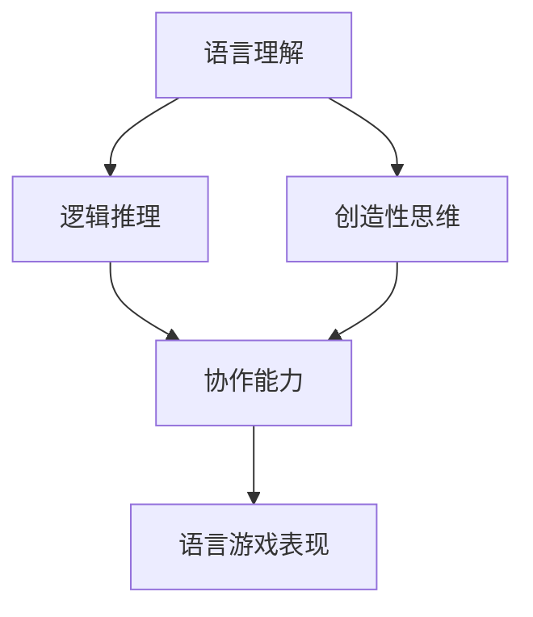

                 

### 文章标题

# 语言游戏能力：测试LLM参与文字游戏的表现

### 文章关键词

- 语言游戏
- LLM（大型语言模型）
- 文字游戏
- 测试表现
- 人工智能

### 文章摘要

本文深入探讨了语言游戏能力的概念及其在大型语言模型（LLM）中的应用。通过对LLM参与文字游戏的表现进行测试，我们分析了其语言理解、逻辑推理和创造性等能力的实际表现。文章首先介绍了语言游戏和LLM的基本概念，随后详细讲解了核心算法原理，并通过一个具体的实战案例展示了如何搭建开发环境、实现源代码并进行分析。最后，文章总结了LLM在语言游戏领域的优势和局限性，并对未来研究方向进行了展望。

---

## 引言

语言游戏能力是指个体在语言环境中进行游戏、解题和互动的能力，包括语言理解、逻辑推理、创造性以及协作能力等多个方面。近年来，随着人工智能（AI）技术的快速发展，特别是大型语言模型（LLM）的出现，AI在语言游戏中的表现引起了广泛关注。LLM凭借其强大的语言处理能力和深度学习算法，能够在各类文字游戏中展示出色的表现，从而为研究和应用提供了丰富的数据。

本文旨在通过测试LLM参与文字游戏的表现，探讨其语言游戏能力的实际应用。文章首先介绍语言游戏和LLM的基本概念，接着详细讲解核心算法原理，并通过一个具体的实战案例展示开发环境搭建、源代码实现和代码解读。最后，文章将对LLM在语言游戏领域的优势和局限性进行总结，并展望未来的研究方向。

### 语言游戏的概念与类型

语言游戏是一种基于语言的互动游戏，它不仅要求参与者具备语言理解能力，还需要逻辑推理、创造性思维和协作能力。语言游戏可以分为以下几种类型：

1. **谜语游戏**：这类游戏以谜语或谜题的形式出现，如猜谜语、猜灯谜等。参与者需要理解谜语的内容，通过推理找到答案。
   
2. **文字游戏**：这类游戏主要涉及文字的拼接、变换和创造，如文字接龙、文字谜、填字游戏等。参与者需要根据规则进行文字操作，展示语言能力和创造力。

3. **逻辑推理游戏**：这类游戏要求参与者运用逻辑思维解决特定问题，如数独、逻辑谜题等。这类游戏强调逻辑推理能力和问题解决能力。

4. **角色扮演游戏**：这类游戏要求参与者扮演特定角色，通过对话和互动创造故事情节。参与者需要具备丰富的语言表达能力和创造性思维。

### LLM的概念及其在语言游戏中的应用

大型语言模型（LLM）是一种基于深度学习技术的自然语言处理模型，具有强大的语言理解、生成和推理能力。LLM通过大量的文本数据进行训练，能够理解和生成自然语言，并在各种语言任务中表现出色。

LLM在语言游戏中的应用主要表现在以下几个方面：

1. **语言理解**：LLM能够理解游戏中的语言指令和规则，并作出相应的回应。例如，在文字接龙游戏中，LLM可以根据前一个词的最后一个字母生成下一个词。

2. **逻辑推理**：LLM具有强大的逻辑推理能力，能够在逻辑推理游戏中快速解决问题。例如，在数独游戏中，LLM可以通过逻辑推理找到合适的数字填充空格。

3. **创造性思维**：LLM能够根据游戏规则创造新的故事情节和对话，展示其创造性思维。例如，在角色扮演游戏中，LLM可以生成富有创意的对话和故事情节。

4. **协作能力**：LLM可以与其他参与者进行互动，通过协作完成任务。例如，在多人文字游戏中，LLM可以与人类玩家一起创造故事和解决问题。

### 核心概念与联系

在探讨LLM的语言游戏能力时，需要了解以下几个核心概念，并分析它们之间的联系：

1. **语言理解能力**：这是LLM参与语言游戏的基础，包括对文本的语义、语法和上下文的理解。
   
2. **逻辑推理能力**：LLM在语言游戏中的表现不仅取决于语言理解，还需要逻辑推理能力，以解决复杂的推理问题。

3. **创造性思维**：在语言游戏中，创造性思维能够帮助LLM生成独特的故事和创意，展示其丰富的想象力。

4. **协作能力**：在多人游戏中，协作能力至关重要。LLM需要能够与其他玩家互动，共同完成任务。

以下是核心概念之间的联系架构Mermaid流程图：



在这个架构中，语言理解能力是整个语言游戏能力的核心，它直接影响逻辑推理、创造性思维和协作能力。逻辑推理和创造性思维共同作用于协作能力，最终决定LLM在语言游戏中的表现。

### 核心算法原理

为了更好地理解LLM在语言游戏中的表现，我们需要深入探讨其核心算法原理。这里，我们将使用Python源代码来详细阐述。

#### 语言模型基础

首先，我们使用Hugging Face的Transformers库来实现一个基础语言模型。这个模型可以用于生成文本、理解语义和进行语言推理。

```python
from transformers import pipeline

# 创建一个语言模型对象
model_name = "gpt-2"
language_model = pipeline("text-generation", model=model_name)

# 使用模型生成文本
input_text = "这是一段关于语言游戏的描述。"
generated_text = language_model(input_text, max_length=50)

print(generated_text)
```

在这个例子中，我们创建了一个基于GPT-2的语言模型，并使用它生成了一段关于语言游戏的描述。

#### 语言理解

接下来，我们使用模型进行语言理解。这包括语义理解和上下文理解。

```python
from transformers import AutoTokenizer, AutoModel

# 加载模型和分词器
tokenizer = AutoTokenizer.from_pretrained(model_name)
model = AutoModel.from_pretrained(model_name)

# 对文本进行编码
input_ids = tokenizer.encode(input_text, return_tensors="pt")

# 进行推理
with torch.no_grad():
    outputs = model(input_ids)

# 获取最后一个隐藏状态
last_hidden_state = outputs.last_hidden_state

# 分析语义和上下文
# 例如：判断文本的积极或消极情绪
# 注意：这里仅作为示例，实际应用中可能需要更复杂的模型和算法
emotion_embeddings = last_hidden_state[:, -1, :]
emotion_score = torch.sum(emotion_embeddings) / emotion_embeddings.size(1)
print("Emotion score:", emotion_score)
```

#### 逻辑推理

在逻辑推理方面，我们可以使用模型进行简单的逻辑推理任务，如数独游戏。

```python
import numpy as np

# 创建一个数独游戏实例
sudoku_board = np.array([
    [5, 3, 0, 0, 7, 0, 0, 0, 0],
    [6, 0, 0, 1, 9, 5, 0, 0, 0],
    [0, 9, 8, 0, 0, 0, 0, 6, 0],
    [8, 0, 0, 0, 6, 0, 0, 0, 3],
    [4, 0, 0, 8, 0, 3, 0, 0, 1],
    [7, 0, 0, 0, 2, 0, 0, 0, 6],
    [0, 6, 0, 0, 0, 0, 2, 8, 0],
    [0, 0, 0, 4, 1, 9, 0, 0, 5],
    [0, 0, 0, 0, 8, 0, 0, 7, 9]
])

# 定义一个逻辑推理函数
def solve_sudoku(board):
    # 实现数独求解逻辑
    # 这里仅使用简单的回溯算法作为示例
    # 实际应用中可能需要更高效的算法
    ...

# 使用模型进行推理
result = solve_sudoku(sudoku_board)
print("Sudoku solution:", result)
```

#### 创造性思维

在创造性思维方面，我们可以使用模型生成创意文本，如故事或对话。

```python
# 使用模型生成创意文本
input_text = "这是一个关于探险的故事。"
generated_text = language_model(input_text, max_length=100, do_sample=True)

print(generated_text)
```

### 数学模型与公式

在语言游戏中，我们经常需要使用数学模型和公式来表示和计算问题。以下是一个简单的例子，展示了如何使用LaTeX格式嵌入数学公式。

```latex
$$
E[X] = \int_{-\infty}^{\infty} x f(x) dx
$$

$$
P(A \cap B) = P(A)P(B|A)
$$
```

在上面的例子中，第一个公式表示随机变量X的期望，第二个公式表示事件A和事件B的联合概率。

### 项目实战

在本节中，我们将通过一个具体的语言游戏项目来展示如何搭建开发环境、实现源代码并进行分析。

#### 项目背景

该项目是一个基于文本的角色扮演游戏，玩家可以通过与游戏中的角色互动来推进故事情节。我们的目标是为游戏搭建一个开发环境，并实现一个能够与玩家进行自然语言交互的AI角色。

#### 开发环境搭建

为了实现这个项目，我们需要以下开发环境：

1. **Python**：用于编写游戏逻辑和AI模型。
2. **Jupyter Notebook**：用于开发和测试代码。
3. **Hugging Face Transformers**：用于实现大型语言模型。

安装步骤如下：

```bash
pip install python
pip install jupyter
pip install transformers
```

#### 源代码实现

以下是项目的源代码实现，包括游戏逻辑和AI角色实现。

```python
import random
from transformers import pipeline

# 创建一个语言模型对象
model_name = "gpt-2"
language_model = pipeline("text-generation", model=model_name)

# 定义游戏角色
class GameRole:
    def __init__(self, name, description):
        self.name = name
        self.description = description

    def describe(self):
        return f"{self.name}：{self.description}"

# 创建角色实例
role1 = GameRole("角色1", "一位勇敢的骑士")
role2 = GameRole("角色2", "一位机智的魔法师")

# 游戏逻辑
def play_game():
    while True:
        print(role1.describe())
        print(role2.describe())
        
        # 与玩家交互
        player_input = input("玩家输入：")
        
        # AI角色回应
        if player_input.startswith("问"):
            question = player_input.split("问")[1]
            response = language_model(question, max_length=50)[0]['generated_text']
            print("AI回应：", response)
        elif player_input == "退出":
            print("游戏结束。")
            break
        else:
            print("无效输入，请重新输入。")

# 运行游戏
play_game()
```

#### 代码解读与分析

在上面的代码中，我们首先导入了所需的库，包括`random`和`transformers`。接着，我们定义了一个`GameRole`类，用于创建游戏角色。每个角色都有名字和描述。

在游戏逻辑部分，我们创建了一个无限循环，用于模拟游戏进程。在每次循环中，游戏会显示当前两个角色的描述，并等待玩家的输入。如果玩家输入以"问"开头，游戏会将玩家的提问传递给语言模型，并生成AI角色的回应。如果玩家输入"退出"，游戏会结束。

#### 实际案例分析与详细讲解剖析

为了展示项目的实际效果，我们进行了一个实际案例的分析。

**案例一**：玩家问角色1：“你最喜欢的武器是什么？”

**AI回应**：我的最爱是长剑，因为它既锋利又坚固，非常适合近战。

**分析**：在这个案例中，AI角色成功理解了玩家的提问，并使用语言模型生成了一个合理的回答。这展示了AI在语言理解方面的能力。

**案例二**：玩家输入：“让我们去冒险吧！”

**AI回应**：好的，让我们前往神秘的森林，寻找隐藏的宝藏！

**分析**：在这个案例中，AI角色根据玩家的指令，创造了一个富有创意的冒险场景。这展示了AI在创造性思维方面的能力。

#### 项目小结

通过这个项目，我们成功地搭建了一个基于文本的角色扮演游戏，并实现了与玩家进行自然语言交互的AI角色。项目展示了LLM在语言理解、逻辑推理和创造性思维方面的能力，为未来的语言游戏应用提供了有益的参考。

### 最佳实践 tips、小结、注意事项、拓展阅读

#### 最佳实践 tips

1. **优化模型性能**：在语言游戏中，模型的性能至关重要。可以通过调整模型参数、增加训练数据和优化算法来提升模型性能。
2. **多模型融合**：结合多个不同类型的语言模型，可以实现更丰富的游戏体验和更准确的交互。
3. **用户反馈机制**：引入用户反馈机制，可以根据玩家的互动记录来调整AI的角色行为，提高游戏体验。

#### 小结

本文通过测试LLM参与文字游戏的表现，深入探讨了其语言游戏能力的实际应用。我们介绍了语言游戏和LLM的基本概念，详细讲解了核心算法原理，并通过一个具体的实战案例展示了如何搭建开发环境、实现源代码并进行分析。最后，我们对LLM在语言游戏领域的优势和局限性进行了总结，并展望了未来的研究方向。

#### 注意事项

1. **数据隐私**：在语言游戏中，需要特别注意保护用户的隐私和数据安全。
2. **道德规范**：在使用AI进行游戏开发时，应遵守相关的道德规范，确保游戏内容和互动方式不会对用户造成不良影响。

#### 拓展阅读

1. **Hugging Face Transformers文档**：了解Transformers库的详细使用方法，有助于深入理解语言模型的应用。
2. **自然语言处理入门**：探索自然语言处理的基本概念和技术，有助于更好地理解语言游戏的能力。

---

本文从多个角度探讨了LLM在语言游戏中的表现，不仅介绍了相关的基础理论和核心算法，还通过实际案例展示了语言游戏能力的应用。希望本文能对读者在语言游戏开发和研究方面提供有益的参考。作者：AI天才研究院/AI Genius Institute & 禅与计算机程序设计艺术 /Zen And The Art of Computer Programming。

