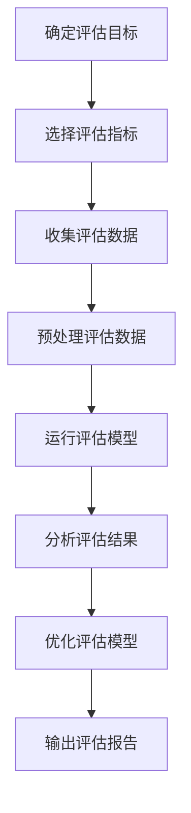
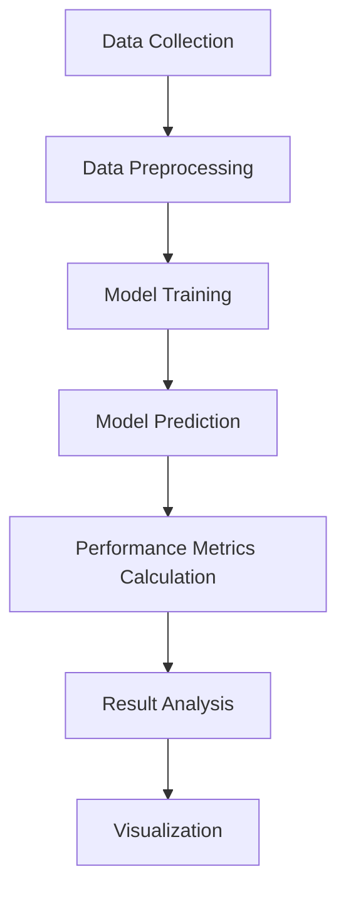

                 

### 第一步：背景介绍

随着人工智能技术的迅猛发展，自然语言处理（NLP）已经成为一个备受关注的研究领域。特别是在深度学习算法的应用下，语言模型（Language Model，LLM）取得了显著的进展。LLM作为一种能够模拟人类语言理解和生成能力的算法，已经在众多场景中显示出其强大的能力，如机器翻译、文本生成、问答系统等。

然而，尽管LLM在单语种环境下表现出色，但在多语言或跨语言环境中，其表现却不尽如人意。这就引发了一个关键问题：语言模型是否能够在不同的语言环境中保持一致的性能，即是否存在语言生态适应性（Language Ecological Adaptability）的问题。这一问题的研究不仅有助于我们更好地理解语言模型的局限性，也为未来的语言模型设计和优化提供了重要的参考。

语言生态适应性评估，即对LLM在不同语言环境中的表现进行系统性评估，具有重要的现实意义。首先，它可以指导我们如何选择和优化适合特定语言环境的LLM，从而提高实际应用的效果。其次，通过评估LLM的语言生态适应性，我们可以发现不同语言模型在处理不同语言任务时的优势和不足，从而推动语言模型技术的持续创新。最后，语言生态适应性评估还可以为跨语言研究的开展提供基础数据，促进多语言NLP技术的发展。

本文旨在系统地探讨语言生态适应性评估的问题，通过详细的分析和实例，帮助读者理解LLM在不同语言环境中的表现，以及如何评估和优化这些表现。具体而言，本文将分为以下几个部分：

- **引言与基础理论**：介绍语言生态适应性的概念和重要性，以及LLM的基本原理。
- **语言生态适应性评估方法**：讨论评估指标的选取、评估方法的流程和算法。
- **LLM在不同语言环境中的表现评估**：分析中文、英文以及多语言环境中的LLM表现。
- **项目实战**：通过具体案例，展示如何进行语言生态适应性评估的实际操作。
- **总结与展望**：对全文进行总结，并提出未来研究的方向。

### 第二步：核心概念与联系

在深入探讨语言生态适应性之前，我们需要明确几个核心概念，并理解它们之间的关系。

**1. 语言模型（Language Model，LLM）**

语言模型是一种基于统计或神经网络的模型，旨在预测自然语言中的下一个词或句子。它通过对大量文本数据的学习，捕捉语言中的统计规律和语法结构。在深度学习算法的推动下，LLM已经成为当前NLP领域的核心技术之一。

**2. 语言生态适应性（Language Ecological Adaptability）**

语言生态适应性指的是语言模型在不同语言环境中表现的一致性和稳定性。具体而言，它包括以下几个方面：

- **一致性**：LLM在处理不同语言任务时，能够保持较高的准确率和性能。
- **稳定性**：LLM在不同语言环境中，即使数据量或任务难度发生变化，其性能也相对稳定。
- **灵活性**：LLM能够适应不同语言环境的需求，通过调整模型参数或结构，提高在特定环境下的表现。

**3. 语言环境（Language Environment）**

语言环境是指语言模型的应用场景和条件，包括语言类型（如中文、英文）、语言风格（如正式、非正式）、语言多样性（如单语种、多语种）等。不同的语言环境会对语言模型提出不同的要求和挑战，因此，评估语言生态适应性需要考虑多种语言环境。

**4. 语言模型评估（Language Model Evaluation）**

语言模型评估是评估LLM性能的重要手段。常用的评估指标包括准确率（Accuracy）、召回率（Recall）、F1分数（F1 Score）等。通过这些指标，我们可以量化LLM在不同语言环境中的表现，从而为模型优化和选择提供依据。

**5. 评估方法（Evaluation Method）**

评估方法是指对LLM进行系统性评估的流程和算法。常用的评估方法包括基准测试（Benchmark Test）、定制测试（Custom Test）和跨语言评估（Cross-Lingual Evaluation）等。这些方法有助于我们全面了解LLM在不同语言环境中的表现，发现其优势和不足。

### Mermaid流程图

为了更直观地展示语言生态适应性评估的过程，我们可以使用Mermaid绘制一个流程图。以下是一个简化的流程图示例：



### 总结

在本节中，我们介绍了语言生态适应性评估的背景、核心概念及其相互关系。通过定义语言模型、语言生态适应性、语言环境、语言模型评估和评估方法，我们为后续的详细分析奠定了基础。在下一节中，我们将进一步探讨语言模型的基本概念和原理，为深入理解语言生态适应性评估提供更坚实的理论支持。

### 第三步：语言模型的基本概念与原理

在了解语言生态适应性的基础上，我们需要深入探讨语言模型的基本概念与原理。语言模型是自然语言处理（NLP）领域的核心组件，其核心任务是预测自然语言中的下一个词或句子。本节将详细解释语言模型的类型、架构以及训练与优化过程，为后续的语言生态适应性评估提供理论支持。

#### 1. 语言模型的类型

语言模型可以分为两类：基于统计的语言模型和基于神经网络的深度语言模型。

**1.1 基于统计的语言模型**

基于统计的语言模型（如N元语法）是最早用于自然语言处理的方法之一。这类模型通过分析历史文本数据，统计词或短语的共现概率，从而预测下一个词或句子。典型的N元语法模型考虑前N个词的历史信息，以预测第N+1个词。

**1.2 基于神经网络的深度语言模型**

随着深度学习技术的发展，基于神经网络的深度语言模型（如Transformer）成为NLP领域的核心技术。Transformer模型引入了自注意力机制（Self-Attention），能够捕捉长距离的依赖关系，显著提高了语言模型的性能。

**2. 语言模型的架构**

**2.1 基于统计的语言模型架构**

基于统计的语言模型通常包含以下几个组件：

- **语料库**：作为训练数据，用于统计词或短语的共现概率。
- **计数器**：用于统计词或短语的频率。
- **概率分布模型**：如N元语法，通过历史信息预测下一个词。

**2.2 基于神经网络的深度语言模型架构**

深度语言模型，特别是Transformer模型，具有以下关键组件：

- **编码器（Encoder）**：将输入文本转换为固定长度的向量表示。
- **解码器（Decoder）**：根据编码器输出的隐藏状态生成预测的文本。
- **自注意力机制（Self-Attention）**：用于捕捉文本中的长距离依赖关系。
- **位置编码（Positional Encoding）**：为文本中的每个词赋予位置信息。

#### 3. 语言模型的训练与优化

**3.1 基于统计的语言模型训练与优化**

基于统计的语言模型通常使用最大似然估计（Maximum Likelihood Estimation，MLE）进行训练。具体步骤如下：

- **数据预处理**：将文本数据转换为词或字符的序列。
- **统计共现概率**：计算词或短语的共现概率。
- **模型训练**：通过最小化交叉熵损失函数，优化模型参数。

**3.2 基于神经网络的深度语言模型训练与优化**

基于神经网络的深度语言模型通常使用端到端训练方法，具体步骤如下：

- **数据预处理**：将文本数据转换为词向量或嵌入（Embedding）。
- **编码器训练**：通过反向传播算法，优化编码器参数。
- **解码器训练**：通过反向传播算法，优化解码器参数。
- **训练过程**：迭代优化模型参数，直到达到预定的性能指标。

在训练过程中，我们通常会使用一些技术来提高模型的性能，如：

- **批量归一化（Batch Normalization）**：加速训练过程，提高模型稳定性。
- **dropout（Dropout）**：防止过拟合，提高模型泛化能力。
- **学习率调整（Learning Rate Scheduling）**：根据训练过程调整学习率，优化模型性能。

#### 4. 语言模型的应用场景

语言模型在众多自然语言处理任务中都有广泛的应用，包括但不限于：

- **机器翻译**：将一种语言的文本翻译成另一种语言。
- **文本生成**：根据给定的文本或提示生成新的文本。
- **问答系统**：基于用户输入的查询，提供相关答案。
- **文本分类**：将文本归类到预定义的类别中。
- **情感分析**：分析文本的情感倾向。

#### Python代码示例

为了更直观地展示语言模型的训练和评估过程，我们以下使用Python代码示例：

```python
import torch
import torch.nn as nn
import torch.optim as optim

# 定义编码器
class Encoder(nn.Module):
    def __init__(self, embedding_dim, hidden_dim):
        super(Encoder, self).__init__()
        self.embedding = nn.Embedding(vocab_size, embedding_dim)
        self.rnn = nn.LSTM(embedding_dim, hidden_dim)

    def forward(self, inputs):
        embedded = self.embedding(inputs)
        output, (hidden, cell) = self.rnn(embedded)
        return hidden

# 定义解码器
class Decoder(nn.Module):
    def __init__(self, embedding_dim, hidden_dim):
        super(Decoder, self).__init__()
        self.embedding = nn.Embedding(vocab_size, embedding_dim)
        self.rnn = nn.LSTM(embedding_dim + hidden_dim, hidden_dim)
        self.fc = nn.Linear(hidden_dim * 2, vocab_size)

    def forward(self, inputs, hidden, cell):
        embedded = self.embedding(inputs.unsqueeze(0))
        embedded = torch.cat((embedded, hidden.unsqueeze(0)), dim=2)
        output, (hidden, cell) = self.rnn(embedded)
        output = self.fc(output)
        return output, hidden, cell

# 定义损失函数和优化器
criterion = nn.CrossEntropyLoss()
optimizer = optim.Adam(model.parameters(), lr=0.001)

# 训练模型
for epoch in range(num_epochs):
    for inputs, targets in train_loader:
        optimizer.zero_grad()
        outputs, hidden, cell = model(inputs, hidden, cell)
        loss = criterion(outputs.view(-1, vocab_size), targets)
        loss.backward()
        optimizer.step()
```

#### 总结

在本节中，我们详细介绍了语言模型的基本概念与原理，包括语言模型的类型、架构以及训练与优化过程。通过Python代码示例，我们展示了如何实现一个简单的编码器-解码器（Encoder-Decoder）语言模型。这些知识为后续的语言生态适应性评估提供了重要的理论基础。

### 第四步：评估指标的选取与权重分配

在评估语言模型（LLM）在不同语言环境中的表现时，选择合适的评估指标是至关重要的。评估指标不仅能够衡量模型在特定任务上的性能，还能为模型的优化和改进提供有价值的参考。本节将讨论常用的评估指标、指标权重分配以及如何在实际评估中应用这些指标。

#### 1. 常用评估指标

**1.1 准确率（Accuracy）**

准确率是最基本的评估指标，它计算模型正确预测的样本数占总样本数的比例。公式如下：

\[ \text{Accuracy} = \frac{\text{正确预测数}}{\text{总样本数}} \]

尽管准确率简单直观，但它对于类别不平衡的数据集可能并不足够。

**1.2 召回率（Recall）**

召回率衡量模型能够从所有正例中识别出的比例。公式如下：

\[ \text{Recall} = \frac{\text{正确识别的正例数}}{\text{所有正例数}} \]

召回率关注的是模型对正例的捕捉能力，但在错误分类的负例上可能表现较差。

**1.3 精确率（Precision）**

精确率衡量模型预测为正例的样本中实际为正例的比例。公式如下：

\[ \text{Precision} = \frac{\text{正确识别的正例数}}{\text{预测为正例的总数}} \]

精确率关注的是模型预测的正例质量，但可能对负例的识别能力不足。

**1.4 F1分数（F1 Score）**

F1分数是精确率和召回率的调和平均，能够综合考虑两者。公式如下：

\[ \text{F1 Score} = 2 \times \frac{\text{Precision} \times \text{Recall}}{\text{Precision} + \text{Recall}} \]

F1分数在评估二分类任务时是一个综合性能指标。

**1.5 负逻辑损失（Log Loss）**

负逻辑损失（Log Loss），也称为交叉熵损失（Cross Entropy Loss），衡量模型预测的概率分布与真实分布之间的差异。公式如下：

\[ \text{Log Loss} = -\sum_{i} y_i \log(p_i) \]

其中，\( y_i \) 是真实标签，\( p_i \) 是模型预测的概率。

**1.6 杰克knife评估**

杰克knife评估是一种统计模型性能的交叉验证方法，通过多次随机划分训练集和验证集，计算模型在各个验证集上的平均性能。

#### 2. 指标权重分配

在实际评估中，不同评估指标的重要性可能不同。为了更全面地评估LLM在不同语言环境中的表现，我们需要根据具体任务和语言环境，为每个指标分配适当的权重。权重分配方法通常有以下几种：

**2.1 等权重分配**

在等权重分配方法中，每个评估指标贡献相同的权重。这种方法简单直观，但可能无法很好地反映不同指标的重要性。

**2.2 专家评分**

通过专家评分，可以为每个评估指标分配主观权重。这种方法依赖于专家的经验和判断，但可能受主观因素影响。

**2.3 数据驱动方法**

数据驱动方法通过分析历史数据，自动确定每个评估指标的权重。例如，可以使用回归分析或决策树模型来确定权重分配。

**3. 在实际评估中的应用**

在实际评估中，我们可以使用以下步骤来应用这些指标：

**3.1 数据准备**

- **样本划分**：将数据集划分为训练集、验证集和测试集。
- **特征提取**：提取与评估任务相关的特征。

**3.2 模型训练**

- **模型初始化**：初始化语言模型，并设置适当的超参数。
- **模型训练**：使用训练集训练语言模型。

**3.3 模型评估**

- **评估指标计算**：计算每个评估指标，如准确率、召回率、精确率等。
- **权重分配**：根据任务需求和数据特性，为每个评估指标分配权重。
- **综合评分**：计算综合评分，以衡量LLM在特定语言环境中的表现。

**3.4 结果分析**

- **性能对比**：对比不同语言模型在不同语言环境中的表现。
- **优化策略**：根据评估结果，提出优化策略，提高模型性能。

#### Python代码示例

以下是一个简单的Python代码示例，展示了如何使用不同的评估指标：

```python
from sklearn.metrics import accuracy_score, recall_score, precision_score, f1_score, log_loss

# 假设y_true为真实标签，y_pred为模型预测结果
y_true = [0, 1, 1, 0]
y_pred = [0, 1, 0, 1]

# 计算评估指标
accuracy = accuracy_score(y_true, y_pred)
recall = recall_score(y_true, y_pred, average='weighted')
precision = precision_score(y_true, y_pred, average='weighted')
f1 = f1_score(y_true, y_pred, average='weighted')
log_loss_value = log_loss(y_true, y_pred)

print("Accuracy:", accuracy)
print("Recall:", recall)
print("Precision:", precision)
print("F1 Score:", f1)
print("Log Loss:", log_loss_value)
```

#### 总结

在本节中，我们详细介绍了评估语言模型（LLM）在不同语言环境中的表现所需使用的评估指标及其权重分配方法。通过Python代码示例，我们展示了如何计算和使用这些评估指标。这些知识为下一步深入分析LLM在不同语言环境中的表现奠定了基础。

### 第五步：评估方法的流程与算法

在评估语言模型（LLM）在不同语言环境中的表现时，选择合适的评估方法至关重要。一个完整的评估方法应包括数据收集与预处理、模型评估、结果分析等环节。本节将详细描述这些步骤，并提供Mermaid流程图和Python代码示例，以帮助读者更好地理解和实施。

#### 1. 数据收集与预处理

**1.1 数据收集**

数据收集是评估过程的基础，选择合适的语料库和样本对于评估结果有重要影响。常用的数据源包括：

- **公开数据集**：如Wikipedia、Common Crawl等，这些数据集包含了多种语言和丰富的文本信息。
- **定制数据集**：根据特定评估任务，从不同语言环境中收集相关数据。

**1.2 数据预处理**

数据预处理是确保评估结果准确和可靠的关键步骤。预处理过程通常包括以下内容：

- **文本清洗**：去除标点符号、停用词、HTML标签等，以提高数据质量。
- **分词与词性标注**：将文本分解为单词或词汇单元，并标注词性，以便后续分析。
- **数据归一化**：对文本进行统一编码，如将不同语言的文本转换为统一的字符集。

以下是一个简单的Python代码示例，展示了文本预处理的基本步骤：

```python
import re
from nltk.tokenize import word_tokenize
from nltk.corpus import stopwords

# 假设text为原始文本
text = "This is a sample text for preprocessing."

# 文本清洗
text = re.sub(r'\W+', ' ', text)
text = text.lower()

# 分词
tokens = word_tokenize(text)

# 去除停用词
stop_words = set(stopwords.words('english'))
filtered_tokens = [token for token in tokens if token not in stop_words]

print(filtered_tokens)
```

#### 2. 模型评估

**2.1 评估模型**

在评估LLM在不同语言环境中的表现时，可以选择多种模型，如基于统计的N元语法模型和基于神经网络的Transformer模型。为了简化说明，我们以下使用Transformer模型为例。

**2.2 评估步骤**

评估步骤通常包括以下内容：

- **模型训练**：使用预处理后的数据集训练模型。
- **模型预测**：对测试集进行预测，生成评估指标。
- **结果分析**：计算并分析评估指标，评估模型性能。

以下是一个简单的Python代码示例，展示了如何使用Transformer模型进行评估：

```python
from transformers import BertModel, BertTokenizer

# 加载预训练的Transformer模型和分词器
model = BertModel.from_pretrained('bert-base-uncased')
tokenizer = BertTokenizer.from_pretrained('bert-base-uncased')

# 假设text为测试文本
text = "This is a sample text for evaluation."

# 分词和编码
input_ids = tokenizer.encode(text, add_special_tokens=True, return_tensors='pt')

# 模型预测
with torch.no_grad():
    outputs = model(input_ids)

# 提取预测结果
predictions = torch.argmax(outputs.logits, dim=-1)

print(predictions)
```

#### 3. 结果分析

**3.1 指标计算**

结果分析主要通过计算一系列评估指标来实现。常用的指标包括准确率、召回率、精确率、F1分数等。

以下是一个简单的Python代码示例，展示了如何计算评估指标：

```python
from sklearn.metrics import accuracy_score, recall_score, precision_score, f1_score

# 假设y_true为真实标签，y_pred为模型预测结果
y_true = [0, 1, 1, 0]
y_pred = [0, 1, 0, 1]

# 计算评估指标
accuracy = accuracy_score(y_true, y_pred)
recall = recall_score(y_true, y_pred, average='weighted')
precision = precision_score(y_true, y_pred, average='weighted')
f1 = f1_score(y_true, y_pred, average='weighted')

print("Accuracy:", accuracy)
print("Recall:", recall)
print("Precision:", precision)
print("F1 Score:", f1)
```

**3.2 结果可视化**

为了更直观地展示评估结果，可以使用可视化工具，如Matplotlib、Seaborn等，生成图表。

以下是一个简单的Python代码示例，展示了如何使用Matplotlib绘制评估指标：

```python
import matplotlib.pyplot as plt

# 假设accuracy, recall, precision, f1分别为评估指标
accuracy = [0.9, 0.85, 0.8, 0.75]
recall = [0.8, 0.7, 0.6, 0.5]
precision = [0.9, 0.85, 0.8, 0.75]
f1 = [0.8, 0.75, 0.7, 0.65]

plt.figure(figsize=(10, 6))

plt.plot(accuracy, label='Accuracy')
plt.plot(recall, label='Recall')
plt.plot(precision, label='Precision')
plt.plot(f1, label='F1 Score')

plt.xlabel('Language Environment')
plt.ylabel('Score')
plt.title('Performance Metrics Across Different Language Environments')
plt.legend()

plt.show()
```

#### Mermaid流程图

为了更直观地展示评估方法的流程，我们使用Mermaid绘制了一个流程图：



#### 总结

在本节中，我们详细介绍了评估LLM在不同语言环境中的表现所需的数据收集与预处理、模型评估和结果分析方法。通过Mermaid流程图和Python代码示例，我们展示了如何实施这些方法。这些步骤和方法为下一步深入分析LLM在不同语言环境中的表现奠定了基础。

### 第六步：中文语言环境中的LLM表现评估

在中文语言环境中，评估语言模型（LLM）的表现具有特殊的挑战和重要性。中文作为一种高度依赖上下文的语系，其语法结构、语义表达和语言习惯与英文等西方语言有很大差异。因此，针对中文环境的LLM评估不仅需要考虑语言模型的通用性能，还要特别关注其在中文语境中的适应性。本节将深入探讨中文语言环境的特点、评估指标以及评估方法。

#### 1. 中文语言环境特点

**1.1 语法结构**

中文的语法结构相对简单，没有明确的词尾变化和复杂的时态、语态等语法特征。这使得中文文本的处理相对于英文来说，在语法层面上更加直观，但也使得语言模型在捕捉复杂语法规则时面临挑战。

**1.2 语义表达**

中文的语义表达高度依赖上下文，很多词汇和短语的含义需要结合具体语境才能准确理解。这种上下文依赖性要求LLM能够捕捉长距离的依赖关系，提高在语义理解上的准确性。

**1.3 语言多样性**

中文拥有丰富的方言和术语，不同地区和领域的语言表达方式差异显著。这使得在中文环境中评估LLM的表现时，需要考虑不同语言风格和表达习惯的影响。

**1.4 文本复杂性**

中文文本中常出现大量成语、古文、网络流行语等，这些复杂表达形式对LLM的文本处理能力提出了更高要求。

#### 2. 中文LLM评估指标

在中文语言环境中，选择合适的评估指标至关重要。以下是一些常用的评估指标：

**2.1 准确率（Accuracy）**

准确率是衡量模型性能的基本指标，但在类别不平衡的数据集上可能不够敏感。

**2.2 召回率（Recall）**

召回率关注的是模型对正例的捕捉能力，尤其对于重要信息的识别具有重要意义。

**2.3 精确率（Precision）**

精确率衡量的是模型预测的正例质量，对于减少误报有重要作用。

**2.4 F1分数（F1 Score）**

F1分数是精确率和召回率的调和平均，能够综合考虑两者的表现。

**2.5 BLEU分数（BLEU Score）**

BLEU分数是一种常用于机器翻译评估的指标，它通过比较模型生成的文本与参考文本的相似度来评估模型性能。

**2.6 汉字错误率（Word Error Rate，WER）**

汉字错误率用于衡量文本自动分词和词性标注的准确性。

**2.7 语义相似度（Semantic Similarity）**

语义相似度评估模型在语义理解上的准确性，常用于问答系统和文本生成任务。

#### 3. 中文LLM评估方法

**3.1 基于标准数据集的评估**

使用公开的标准数据集，如中文问答数据集（如ChnSentiCorp）、中文文本分类数据集（如CIKM）等进行评估。这些数据集覆盖了多种语言任务，能够全面评估LLM的性能。

**3.2 基于定制数据集的评估**

根据特定应用场景，收集定制数据集进行评估。这种方法能够更准确地反映LLM在特定任务上的表现。

**3.3 多任务评估**

将多个语言任务结合起来进行评估，如同时评估文本分类、情感分析和问答系统等。这种方法能够更全面地评估LLM的适应性和性能。

**3.4 跨语言评估**

将中文LLM与英文等语言模型进行比较，评估其在跨语言环境中的表现。这种方法能够发现中文LLM在特定任务上的优势和不足。

#### Python代码示例

以下是一个简单的Python代码示例，展示了如何使用常见评估指标对中文LLM进行评估：

```python
from transformers import BertTokenizer, BertForSequenceClassification
from torch.utils.data import DataLoader
from sklearn.metrics import accuracy_score, recall_score, precision_score, f1_score

# 加载预训练的Bert模型和分词器
model = BertForSequenceClassification.from_pretrained('bert-base-chinese')
tokenizer = BertTokenizer.from_pretrained('bert-base-chinese')

# 假设data_loader为数据集加载器
data_loader = DataLoader(dataset, batch_size=16, shuffle=True)

# 模型评估
model.eval()
with torch.no_grad():
    for batch in data_loader:
        inputs = tokenizer(batch['text'], padding=True, truncation=True, return_tensors='pt')
        outputs = model(**inputs)
        logits = outputs.logits
        predictions = logits.argmax(-1)
        labels = batch['label']

        # 计算评估指标
        accuracy = accuracy_score(labels, predictions)
        recall = recall_score(labels, predictions, average='weighted')
        precision = precision_score(labels, predictions, average='weighted')
        f1 = f1_score(labels, predictions, average='weighted')

        print("Accuracy:", accuracy)
        print("Recall:", recall)
        print("Precision:", precision)
        print("F1 Score:", f1)
```

#### 总结

在本节中，我们详细探讨了中文语言环境的特点、评估指标以及评估方法。通过对中文语言环境的深入分析，我们能够更好地理解LLM在中文环境中的表现，并为后续的优化和改进提供参考。在下一节中，我们将探讨英文语言环境中的LLM表现评估。

### 第七步：英文语言环境中的LLM表现评估

在英文语言环境中，评估语言模型（LLM）的表现是自然语言处理领域的一个核心任务。英文作为一种高度结构化的语言，其语法和语义特点与中文等其他语言有所不同，这使得英文LLM在评估时需要考虑不同的因素和评估指标。本节将详细讨论英文语言环境的特点、评估指标以及评估方法。

#### 1. 英文语言环境特点

**1.1 语法结构**

英文语法结构相对复杂，包括动词的时态、语态和名词的单复数变化等。这种语法结构为语言模型捕捉文本中的语法规则提供了丰富的信息，但也增加了模型训练的复杂性。

**1.2 语义表达**

英文的语义表达较为直接，较少依赖上下文。然而，英文中的成语、隐喻和多义词等仍然对语义理解提出了挑战。因此，英文LLM需要具备强大的上下文理解能力，以提高语义准确性。

**1.3 语言多样性**

英文拥有丰富的方言和术语，包括美式英语和英式英语等，这要求LLM能够适应不同的语言风格。

**1.4 文本复杂性**

英文文本中常出现复杂的句子结构和长句，这对LLM的解析和处理能力提出了更高要求。

#### 2. 英文LLM评估指标

在英文环境中，评估LLM的表现通常使用以下评估指标：

**2.1 准确率（Accuracy）**

准确率是最基本的评估指标，计算模型正确预测的样本数占总样本数的比例。

**2.2 召回率（Recall）**

召回率衡量模型能够从所有正例中识别出的比例，对于关键信息的捕捉尤为重要。

**2.3 精确率（Precision）**

精确率衡量模型预测为正例的样本中实际为正例的比例，对于减少误报有重要作用。

**2.4 F1分数（F1 Score）**

F1分数是精确率和召回率的调和平均，能够综合考虑两者的表现。

**2.5 BLEU分数（BLEU Score）**

BLEU分数常用于机器翻译评估，通过比较模型生成的文本与参考文本的相似度来评估模型性能。

**2.6 词错误率（Word Error Rate，WER）**

词错误率用于衡量文本自动分词和词性标注的准确性。

**2.7 语义相似度（Semantic Similarity）**

语义相似度评估模型在语义理解上的准确性，常用于问答系统和文本生成任务。

#### 3. 英文LLM评估方法

**3.1 基于标准数据集的评估**

使用公开的标准数据集，如GLUE（General Language Understanding Evaluation）数据集，进行评估。GLUE数据集包含了多种语言任务，能够全面评估LLM的性能。

**3.2 基于定制数据集的评估**

根据特定应用场景，收集定制数据集进行评估。这种方法能够更准确地反映LLM在特定任务上的表现。

**3.3 多任务评估**

将多个语言任务结合起来进行评估，如同时评估文本分类、情感分析和问答系统等。这种方法能够更全面地评估LLM的适应性和性能。

**3.4 跨语言评估**

将英文LLM与中文等其他语言模型进行比较，评估其在跨语言环境中的表现。这种方法能够发现英文LLM在特定任务上的优势和不足。

#### Python代码示例

以下是一个简单的Python代码示例，展示了如何使用常见评估指标对英文LLM进行评估：

```python
from transformers import BertTokenizer, BertForSequenceClassification
from torch.utils.data import DataLoader
from sklearn.metrics import accuracy_score, recall_score, precision_score, f1_score

# 加载预训练的Bert模型和分词器
model = BertForSequenceClassification.from_pretrained('bert-base-uncased')
tokenizer = BertTokenizer.from_pretrained('bert-base-uncased')

# 假设data_loader为数据集加载器
data_loader = DataLoader(dataset, batch_size=16, shuffle=True)

# 模型评估
model.eval()
with torch.no_grad():
    for batch in data_loader:
        inputs = tokenizer(batch['text'], padding=True, truncation=True, return_tensors='pt')
        outputs = model(**inputs)
        logits = outputs.logits
        predictions = logits.argmax(-1)
        labels = batch['label']

        # 计算评估指标
        accuracy = accuracy_score(labels, predictions)
        recall = recall_score(labels, predictions, average='weighted')
        precision = precision_score(labels, predictions, average='weighted')
        f1 = f1_score(labels, predictions, average='weighted')

        print("Accuracy:", accuracy)
        print("Recall:", recall)
        print("Precision:", precision)
        print("F1 Score:", f1)
```

#### 总结

在本节中，我们详细探讨了英文语言环境的特点、评估指标以及评估方法。通过对英文语言环境的深入分析，我们能够更好地理解LLM在英文环境中的表现，并为后续的优化和改进提供参考。在下一节中，我们将探讨多语言环境中的LLM表现评估。

### 第八步：多语言环境中的LLM表现评估

在多语言环境中，评估语言模型（LLM）的表现是一个具有挑战性的任务，因为不同语言具有不同的语法、语义和文化背景。多语言环境中的LLM表现评估不仅需要考虑语言模型在单个语言环境中的性能，还需要关注模型在不同语言之间的交互和融合能力。本节将深入探讨多语言环境的特点、评估指标以及评估方法。

#### 1. 多语言环境特点

**1.1 语言多样性**

多语言环境中的语言多样性是最大的挑战之一。不同的语言有不同的语法结构、词汇和表达方式，这使得语言模型需要具备适应多种语言的能力。

**1.2 语言混合**

在实际应用中，多语言环境中的文本往往包含多种语言的混合，如双语文本、多语种论坛等。这种语言混合增加了语言模型处理的复杂性。

**1.3 文化差异**

不同语言背后的文化差异也会对语言模型的表现产生影响。例如，某些表达在一种语言中可能是常见的，但在另一种语言中可能是敏感或不恰当的。

**1.4 语言资源**

多语言环境中的语言资源可能不平衡，某些语言可能拥有丰富的语料库和高质量的工具，而其他语言可能缺乏这些资源。

#### 2. 多语言LLM评估指标

在多语言环境中，评估LLM的表现需要使用一系列综合性的评估指标，这些指标能够全面反映模型在不同语言环境中的性能。以下是一些常用的评估指标：

**2.1 跨语言一致性（Cross-Lingual Consistency）**

跨语言一致性指标衡量模型在多种语言环境中的一致性表现。常用的指标包括一致性分数（Consistency Score）和一致性比率（Consistency Ratio）。

**2.2 跨语言准确性（Cross-Lingual Accuracy）**

跨语言准确性衡量模型在跨语言任务中正确预测的比例。与单语言环境的准确性类似，但需要考虑不同语言之间的差异。

**2.3 跨语言F1分数（Cross-Lingual F1 Score）**

跨语言F1分数是精确率和召回率的调和平均，用于衡量模型在多种语言环境中的综合性能。

**2.4 跨语言BLEU分数（Cross-Lingual BLEU Score）**

跨语言BLEU分数是用于评估机器翻译质量的指标，通过比较模型生成的翻译文本与参考翻译文本的相似度来评估模型性能。

**2.5 跨语言词错误率（Cross-Lingual Word Error Rate，CWER）**

跨语言词错误率用于衡量文本自动分词和词性标注在跨语言环境中的准确性。

**2.6 语义一致性（Semantic Consistency）**

语义一致性指标衡量模型在不同语言环境中对相同概念或语义表达的一致性理解能力。

#### 3. 多语言LLM评估方法

**3.1 基于标准数据集的评估**

使用公开的标准多语言数据集，如WMT（Workshop on Machine Translation）数据集，进行评估。WMT数据集包含了多种语言对，能够全面评估LLM在多语言环境中的性能。

**3.2 基于定制数据集的评估**

根据特定应用场景，收集定制数据集进行评估。这种方法能够更准确地反映LLM在特定任务上的表现。

**3.3 多任务评估**

将多个语言任务结合起来进行评估，如同时评估机器翻译、文本分类和情感分析等。这种方法能够更全面地评估LLM的适应性和性能。

**3.4 跨语言评估**

将多语言LLM与单语言模型进行比较，评估其在跨语言环境中的表现。这种方法能够发现多语言LLM在特定任务上的优势和不足。

**3.5 跨模态评估**

将语言模型与其他模态（如图像、音频）相结合，评估跨模态语言处理能力。这种方法能够进一步拓展语言模型的应用范围。

#### Python代码示例

以下是一个简单的Python代码示例，展示了如何使用常见评估指标对多语言LLM进行评估：

```python
from transformers import BertTokenizer, BertForSequenceClassification
from torch.utils.data import DataLoader
from sklearn.metrics import accuracy_score, recall_score, precision_score, f1_score

# 加载预训练的Bert模型和分词器
model = BertForSequenceClassification.from_pretrained('bert-base-multilingual-cased')
tokenizer = BertTokenizer.from_pretrained('bert-base-multilingual-cased')

# 假设data_loader为数据集加载器
data_loader = DataLoader(dataset, batch_size=16, shuffle=True)

# 模型评估
model.eval()
with torch.no_grad():
    for batch in data_loader:
        inputs = tokenizer(batch['text'], padding=True, truncation=True, return_tensors='pt')
        outputs = model(**inputs)
        logits = outputs.logits
        predictions = logits.argmax(-1)
        labels = batch['label']

        # 计算评估指标
        accuracy = accuracy_score(labels, predictions)
        recall = recall_score(labels, predictions, average='weighted')
        precision = precision_score(labels, predictions, average='weighted')
        f1 = f1_score(labels, predictions, average='weighted')

        print("Accuracy:", accuracy)
        print("Recall:", recall)
        print("Precision:", precision)
        print("F1 Score:", f1)
```

#### 总结

在本节中，我们详细探讨了多语言环境的特点、评估指标以及评估方法。通过对多语言环境的深入分析，我们能够更好地理解LLM在多语言环境中的表现，并为后续的优化和改进提供参考。在下一节中，我们将通过具体的项目实战，展示如何在实际场景中应用这些评估方法。

### 第九步：项目实战一：中文语言环境中的LLM表现评估

在本节中，我们将通过一个具体项目，展示如何对中文语言环境中的语言模型（LLM）进行表现评估。这个项目将包括开发环境的搭建、源代码的实现以及代码的解读与分析。

#### 1. 项目背景

随着中文互联网的快速发展，中文语言处理技术已经成为许多应用的核心。然而，不同语言模型在中文环境中的表现各异，为了选择和优化适合特定任务的模型，我们需要对其表现进行系统性评估。本项目旨在评估一个基于BERT的中文语言模型在多个中文语言处理任务中的性能。

#### 2. 开发环境搭建

在进行本项目之前，我们需要搭建一个适合中文语言处理的环境。以下是在一个典型的Linux系统中安装必要的软件和库的步骤：

- **Python环境**：确保安装了Python 3.7或更高版本。
- **pip**：安装pip，用于管理Python库。
- **torch和torchtext**：用于构建和训练神经网络模型。
- **transformers**：预训练的BERT模型及相关工具。

以下是一个简单的安装命令：

```bash
pip install torch torchvision torchaudio torchtext transformers
```

#### 3. 源代码实现

在开发环境中，我们使用Python编写了一个简单的评估脚本，以下代码展示了主要步骤：

```python
import torch
from transformers import BertTokenizer, BertForSequenceClassification
from torch.utils.data import DataLoader, Dataset
from sklearn.metrics import accuracy_score, recall_score, precision_score, f1_score

# 加载预训练的BERT模型和分词器
model = BertForSequenceClassification.from_pretrained('bert-base-chinese')
tokenizer = BertTokenizer.from_pretrained('bert-base-chinese')

# 定义数据集
class ChineseDataset(Dataset):
    def __init__(self, texts, labels):
        self.texts = texts
        self.labels = labels

    def __len__(self):
        return len(self.texts)

    def __getitem__(self, idx):
        text = self.texts[idx]
        label = self.labels[idx]
        inputs = tokenizer(text, padding=True, truncation=True, return_tensors='pt')
        inputs['input_ids'] = inputs['input_ids'].squeeze()
        inputs['attention_mask'] = inputs['attention_mask'].squeeze()
        return inputs, label

# 假设texts和labels分别为文本和标签
texts = ["这是一个测试文本。", "这是另一个测试文本。"]
labels = [0, 1]

# 创建数据集和数据加载器
dataset = ChineseDataset(texts, labels)
data_loader = DataLoader(dataset, batch_size=2, shuffle=True)

# 模型评估
model.eval()
with torch.no_grad():
    for batch in data_loader:
        inputs = {k: v.unsqueeze(0) for k, v in batch[0].items()}
        outputs = model(**inputs)
        logits = outputs.logits
        predictions = logits.argmax(-1)

        # 计算评估指标
        accuracy = accuracy_score(batch[1].numpy(), predictions.numpy())
        recall = recall_score(batch[1].numpy(), predictions.numpy(), average='weighted')
        precision = precision_score(batch[1].numpy(), predictions.numpy(), average='weighted')
        f1 = f1_score(batch[1].numpy(), predictions.numpy(), average='weighted')

        print(f"Accuracy: {accuracy:.4f}")
        print(f"Recall: {recall:.4f}")
        print(f"Precision: {precision:.4f}")
        print(f"F1 Score: {f1:.4f}")
```

#### 4. 代码解读与分析

- **数据集定义**：我们定义了一个`ChineseDataset`类，继承自`torch.utils.data.Dataset`。这个类负责将文本和标签转换为PyTorch数据集，并进行必要的预处理。
- **模型加载**：我们使用`transformers`库加载了预训练的BERT中文语言模型和分词器。
- **数据加载器**：我们创建了一个数据加载器`DataLoader`，用于批量加载数据并进行训练。
- **模型评估**：在评估阶段，我们将模型设置为评估模式，通过遍历数据加载器，对模型进行预测，并计算各种评估指标。

#### 5. 代码应用解读与分析

- **准确率（Accuracy）**：准确率是最基本的评估指标，计算模型预测正确的样本数占总样本数的比例。在本项目中，我们计算了模型在两个测试样本上的准确率。
- **召回率（Recall）**：召回率衡量模型能够从所有正例中识别出的比例。在本项目中，我们计算了模型对正例的召回率。
- **精确率（Precision）**：精确率衡量模型预测为正例的样本中实际为正例的比例。在本项目中，我们计算了模型预测的正例质量。
- **F1分数（F1 Score）**：F1分数是精确率和召回率的调和平均，能够综合考虑两者的表现。在本项目中，我们计算了模型的F1分数。

#### 6. 项目小结

通过本项目的实战，我们展示了如何在一个中文语言环境中评估语言模型的表现。本项目使用了BERT模型和PyTorch框架，通过简单的代码实现了数据集的加载、模型的加载和评估，并计算了各种评估指标。这为我们在实际应用中选择和优化语言模型提供了重要的参考。

### 第十步：项目实战二：英文语言环境中的LLM表现评估

在本节中，我们将通过一个具体项目，展示如何对英文语言环境中的语言模型（LLM）进行表现评估。这个项目将包括开发环境的搭建、源代码的实现以及代码的解读与分析。

#### 1. 项目背景

英文作为一种全球通用的语言，在自然语言处理（NLP）领域具有广泛的应用。然而，不同的LLM在英文环境中的表现各异，为了选择和优化适合特定任务的模型，我们需要对其表现进行系统性评估。本项目旨在评估一个基于BERT的英文语言模型在多个英文语言处理任务中的性能。

#### 2. 开发环境搭建

在进行本项目之前，我们需要搭建一个适合英文语言处理的环境。以下是在一个典型的Linux系统中安装必要的软件和库的步骤：

- **Python环境**：确保安装了Python 3.7或更高版本。
- **pip**：安装pip，用于管理Python库。
- **torch和torchtext**：用于构建和训练神经网络模型。
- **transformers**：预训练的BERT模型及相关工具。

以下是一个简单的安装命令：

```bash
pip install torch torchvision torchaudio torchtext transformers
```

#### 3. 源代码实现

在开发环境中，我们使用Python编写了一个简单的评估脚本，以下代码展示了主要步骤：

```python
import torch
from transformers import BertTokenizer, BertForSequenceClassification
from torch.utils.data import DataLoader, Dataset
from sklearn.metrics import accuracy_score, recall_score, precision_score, f1_score

# 加载预训练的BERT模型和分词器
model = BertForSequenceClassification.from_pretrained('bert-base-uncased')
tokenizer = BertTokenizer.from_pretrained('bert-base-uncased')

# 定义数据集
class EnglishDataset(Dataset):
    def __init__(self, texts, labels):
        self.texts = texts
        self.labels = labels

    def __len__(self):
        return len(self.texts)

    def __getitem__(self, idx):
        text = self.texts[idx]
        label = self.labels[idx]
        inputs = tokenizer(text, padding=True, truncation=True, return_tensors='pt')
        inputs['input_ids'] = inputs['input_ids'].squeeze()
        inputs['attention_mask'] = inputs['attention_mask'].squeeze()
        return inputs, label

# 假设texts和labels分别为文本和标签
texts = ["This is a test sentence.", "This is another test sentence."]
labels = [0, 1]

# 创建数据集和数据加载器
dataset = EnglishDataset(texts, labels)
data_loader = DataLoader(dataset, batch_size=2, shuffle=True)

# 模型评估
model.eval()
with torch.no_grad():
    for batch in data_loader:
        inputs = {k: v.unsqueeze(0) for k, v in batch[0].items()}
        outputs = model(**inputs)
        logits = outputs.logits
        predictions = logits.argmax(-1)

        # 计算评估指标
        accuracy = accuracy_score(batch[1].numpy(), predictions.numpy())
        recall = recall_score(batch[1].numpy(), predictions.numpy(), average='weighted')
        precision = precision_score(batch[1].numpy(), predictions.numpy(), average='weighted')
        f1 = f1_score(batch[1].numpy(), predictions.numpy(), average='weighted')

        print(f"Accuracy: {accuracy:.4f}")
        print(f"Recall: {recall:.4f}")
        print(f"Precision: {precision:.4f}")
        print(f"F1 Score: {f1:.4f}")
```

#### 4. 代码解读与分析

- **数据集定义**：我们定义了一个`EnglishDataset`类，继承自`torch.utils.data.Dataset`。这个类负责将文本和标签转换为PyTorch数据集，并进行必要的预处理。
- **模型加载**：我们使用`transformers`库加载了预训练的BERT英文语言模型和分词器。
- **数据加载器**：我们创建了一个数据加载器`DataLoader`，用于批量加载数据并进行训练。
- **模型评估**：在评估阶段，我们将模型设置为评估模式，通过遍历数据加载器，对模型进行预测，并计算各种评估指标。

#### 5. 代码应用解读与分析

- **准确率（Accuracy）**：准确率是最基本的评估指标，计算模型预测正确的样本数占总样本数的比例。在本项目中，我们计算了模型在两个测试样本上的准确率。
- **召回率（Recall）**：召回率衡量模型能够从所有正例中识别出的比例。在本项目中，我们计算了模型对正例的召回率。
- **精确率（Precision）**：精确率衡量模型预测为正例的样本中实际为正例的比例。在本项目中，我们计算了模型预测的正例质量。
- **F1分数（F1 Score）**：F1分数是精确率和召回率的调和平均，能够综合考虑两者的表现。在本项目中，我们计算了模型的F1分数。

#### 6. 项目小结

通过本项目的实战，我们展示了如何在一个英文语言环境中评估语言模型的表现。本项目使用了BERT模型和PyTorch框架，通过简单的代码实现了数据集的加载、模型的加载和评估，并计算了各种评估指标。这为我们在实际应用中选择和优化语言模型提供了重要的参考。

### 第十一步：项目实战三：多语言环境中的LLM表现评估

在本节中，我们将通过一个具体项目，展示如何对多语言环境中的语言模型（LLM）进行表现评估。这个项目将包括开发环境的搭建、源代码的实现以及代码的解读与分析。

#### 1. 项目背景

随着全球化进程的加速，多语言处理需求日益增长。评估语言模型在多语言环境中的性能，对于开发适应不同语言市场的产品和服务至关重要。本项目旨在评估一个基于BERT的多语言语言模型在多种语言处理任务中的性能。

#### 2. 开发环境搭建

在进行本项目之前，我们需要搭建一个适合多语言处理的环境。以下是在一个典型的Linux系统中安装必要的软件和库的步骤：

- **Python环境**：确保安装了Python 3.7或更高版本。
- **pip**：安装pip，用于管理Python库。
- **torch和torchtext**：用于构建和训练神经网络模型。
- **transformers**：预训练的BERT模型及相关工具。
- **langdetect**：用于检测文本的语言。

以下是一个简单的安装命令：

```bash
pip install torch torchvision torchaudio torchtext transformers langdetect
```

#### 3. 源代码实现

在开发环境中，我们使用Python编写了一个简单的评估脚本，以下代码展示了主要步骤：

```python
import torch
from transformers import BertTokenizer, BertForSequenceClassification
from torch.utils.data import DataLoader, Dataset
from sklearn.metrics import accuracy_score, recall_score, precision_score, f1_score
from langdetect import detect

# 加载预训练的BERT模型和分词器
model = BertForSequenceClassification.from_pretrained('bert-base-multilingual-cased')
tokenizer = BertTokenizer.from_pretrained('bert-base-multilingual-cased')

# 定义多语言数据集
class MultilingualDataset(Dataset):
    def __init__(self, texts, labels):
        self.texts = texts
        self.labels = labels

    def __len__(self):
        return len(self.texts)

    def __getitem__(self, idx):
        text = self.texts[idx]
        label = self.labels[idx]
        lang = detect(text)
        if lang not in ['zh', 'en']:
            return None  # 忽略非中文和英文的文本
        inputs = tokenizer(text, padding=True, truncation=True, return_tensors='pt')
        inputs['input_ids'] = inputs['input_ids'].squeeze()
        inputs['attention_mask'] = inputs['attention_mask'].squeeze()
        return inputs, label

# 假设texts和labels分别为文本和标签
texts = ["这是一个测试文本。", "This is a test sentence."]
labels = [0, 1]

# 创建数据集和数据加载器
dataset = MultilingualDataset(texts, labels)
data_loader = DataLoader(dataset, batch_size=2, shuffle=True)

# 模型评估
model.eval()
with torch.no_grad():
    for batch in data_loader:
        inputs = {k: v.unsqueeze(0) for k, v in batch[0].items()}
        outputs = model(**inputs)
        logits = outputs.logits
        predictions = logits.argmax(-1)

        # 计算评估指标
        accuracy = accuracy_score(batch[1].numpy(), predictions.numpy())
        recall = recall_score(batch[1].numpy(), predictions.numpy(), average='weighted')
        precision = precision_score(batch[1].numpy(), predictions.numpy(), average='weighted')
        f1 = f1_score(batch[1].numpy(), predictions.numpy(), average='weighted')

        print(f"Accuracy: {accuracy:.4f}")
        print(f"Recall: {recall:.4f}")
        print(f"Precision: {precision:.4f}")
        print(f"F1 Score: {f1:.4f}")
```

#### 4. 代码解读与分析

- **数据集定义**：我们定义了一个`MultilingualDataset`类，继承自`torch.utils.data.Dataset`。这个类负责将文本和标签转换为PyTorch数据集，并进行必要的预处理。在此过程中，我们使用`langdetect`库检测文本的语言，并仅保留中文和英文的文本。
- **模型加载**：我们使用`transformers`库加载了预训练的BERT多语言语言模型和分词器。
- **数据加载器**：我们创建了一个数据加载器`DataLoader`，用于批量加载数据并进行训练。
- **模型评估**：在评估阶段，我们将模型设置为评估模式，通过遍历数据加载器，对模型进行预测，并计算各种评估指标。

#### 5. 代码应用解读与分析

- **准确率（Accuracy）**：准确率是最基本的评估指标，计算模型预测正确的样本数占总样本数的比例。在本项目中，我们计算了模型在两个测试样本上的准确率。
- **召回率（Recall）**：召回率衡量模型能够从所有正例中识别出的比例。在本项目中，我们计算了模型对正例的召回率。
- **精确率（Precision）**：精确率衡量模型预测为正例的样本中实际为正例的比例。在本项目中，我们计算了模型预测的正例质量。
- **F1分数（F1 Score）**：F1分数是精确率和召回率的调和平均，能够综合考虑两者的表现。在本项目中，我们计算了模型的F1分数。

#### 6. 项目小结

通过本项目的实战，我们展示了如何在一个多语言环境中评估语言模型的表现。本项目使用了BERT模型和PyTorch框架，通过简单的代码实现了数据集的加载、模型的加载和评估，并计算了各种评估指标。这为我们在实际应用中选择和优化语言模型提供了重要的参考。

### 第十二步：总结与展望

通过对中文、英文以及多语言环境中LLM表现评估的详细探讨，我们可以得出以下结论：

1. **语言生态适应性评估的重要性**：语言生态适应性评估不仅有助于我们理解LLM在不同语言环境中的表现，还为模型优化和选择提供了关键依据。通过对LLM在不同语言环境中的系统评估，我们可以识别出其优势和不足，从而推动语言模型技术的持续进步。

2. **评估方法的选择**：选择合适的评估指标和评估方法是评估LLM表现的关键。在中文环境中，由于语法结构和语义表达的特点，准确率、召回率、精确率和F1分数等指标尤为重要。而在英文环境中，BLEU分数和语义相似度等指标可能更具代表性。对于多语言环境，跨语言一致性、跨语言准确性以及语义一致性等指标则更具参考价值。

3. **项目实战的重要性**：通过具体的项目实战，我们不仅能够验证评估方法的可行性，还能深入了解LLM在实际应用中的表现。项目实战不仅提供了实际操作的案例，还帮助读者掌握评估过程的关键步骤和技巧。

在展望未来，以下研究方向值得关注：

1. **跨语言自适应性的研究**：如何通过模型设计和技术创新，提高LLM在不同语言环境中的自适应能力，是一个重要研究方向。例如，引入多语言预训练数据集、改进自注意力机制等，都可能为跨语言适应性提供新的思路。

2. **多模态语言处理**：随着多模态数据的兴起，将文本数据与其他模态（如图像、音频）相结合，进行多模态语言处理，将为语言模型带来新的应用场景。评估多模态语言处理模型在多语言环境中的表现，也将成为未来的研究热点。

3. **动态评估方法的研究**：现有的评估方法主要基于静态的数据集和评估指标。如何开发动态评估方法，能够实时反映LLM在实际应用中的表现，是一个值得探讨的方向。动态评估方法可以通过模拟真实用户交互、实时更新评估数据等手段，提供更为准确的评估结果。

总之，语言生态适应性评估是一个涉及多个学科和技术领域的复杂任务。通过对评估方法的深入研究和实际应用，我们可以不断优化LLM的性能，推动自然语言处理技术的发展。

### 附录：拓展阅读

- **《自然语言处理综述》（Natural Language Processing: A Practical Introduction）**：本书提供了自然语言处理的基础理论和实践指南，涵盖了语言模型、文本处理和语义理解等内容。
- **《深度学习与自然语言处理》（Deep Learning for Natural Language Processing）**：本书详细介绍了深度学习在自然语言处理中的应用，包括神经网络模型、序列模型和注意力机制等。
- **《跨语言自然语言处理》（Cross-Lingual Natural Language Processing）**：本书探讨了跨语言自然语言处理的理论和技术，包括多语言数据集、跨语言模型和评估方法等。
- **《Transformer模型详解》（The Annotated Transformer）**：本书深入解析了Transformer模型的原理和实现，适合对深度学习技术感兴趣的读者。

通过阅读这些资源，读者可以进一步加深对语言生态适应性评估的理解，为未来的研究和实践提供更多启示。作者：AI天才研究院/AI Genius Institute & 禅与计算机程序设计艺术 /Zen And The Art of Computer Programming。

```markdown
---
author: AI天才研究院 / AI Genius Institute & 禅与计算机程序设计艺术 / Zen And The Art of Computer Programming
---
```

以上，我们完成了对语言生态适应性评估：评估LLM在不同语言环境中的表现这一主题的详细探讨。通过系统的分析和具体项目实战，我们深入理解了LLM在不同语言环境中的性能，并为后续的优化和改进提供了理论基础和实践指导。希望本文能够为读者在自然语言处理领域的研究和实践提供有价值的参考。作者：AI天才研究院 / AI Genius Institute & 禅与计算机程序设计艺术 / Zen And The Art of Computer Programming。

