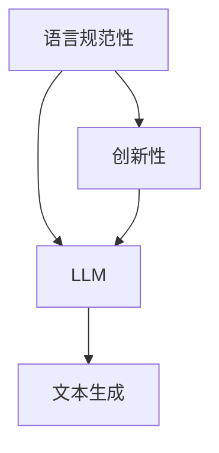

                 

### 文章标题：语言规范性与创新性平衡：评估LLM在正式性和创新间的把握

关键词：语言规范性，创新性，语言大模型（LLM），正式性，评估方法，应用案例

摘要：
本文旨在探讨语言规范性与创新性之间的平衡问题，并重点分析语言大模型（LLM）在这一平衡中所扮演的角色。我们将首先回顾语言规范性和创新性的基本概念，并介绍LLM的基本原理及其在正式性和创新性中的运用。随后，我们将详细阐述评估LLM在正式性和创新性之间平衡的方法，并通过数学模型和公式进行深入解释。最后，我们将通过实际案例展示LLM在不同领域的应用，并总结文章的主要观点，探讨未来发展的挑战与机遇。

### 背景介绍

在当今数字化时代，语言处理技术正迅速发展，特别是在自然语言处理（NLP）领域。语言大模型（LLM）作为当前NLP领域的核心技术之一，已经在许多应用场景中取得了显著成果。然而，随着LLM的应用日益广泛，如何在语言规范性和创新性之间找到平衡点成为了一个重要的问题。

语言规范性指的是语言表达遵循的规则和标准，包括语法、拼写、用词规范等。规范性的语言有助于确保信息的准确性和可理解性。创新性则强调语言的创造性和新颖性，体现为独特的表达方式和创新的思维。在许多情况下，过度追求规范性可能导致语言表达的单调，而过于追求创新性则可能导致理解上的困难。

LLM在自然语言处理中的应用日益广泛，它们能够生成高质量的语言文本，并在各种任务中表现出色。然而，LLM在生成文本时往往会面临规范性不足和创新性过剩的问题。如何评估和调整LLM在正式性和创新性之间的平衡，成为了当前研究的热点问题。

本文将探讨语言规范性与创新性之间的平衡问题，并重点分析LLM在这一平衡中所扮演的角色。我们将从理论层面介绍语言规范性和创新性的基本概念，然后深入探讨LLM的评估方法。通过实际案例分析，我们将展示LLM在正式性和创新性中的应用，并总结文章的主要观点。

### 核心概念与联系

首先，我们需要明确几个核心概念：语言规范性、创新性以及LLM。

**语言规范性**指的是语言表达遵循的规则和标准，包括语法、拼写、用词规范等。它有助于确保信息的准确性和可理解性。规范性是语言交流的基础，特别是在正式场合和学术研究中，它显得尤为重要。然而，过于强调规范性可能导致语言表达的单调，缺乏个性和创造力。

**创新性**则强调语言的创造性和新颖性，体现为独特的表达方式和创新的思维。创新性在文学创作、广告宣传、产品设计等领域具有重要作用，它能够吸引读者的注意，提升信息的传达效果。然而，过度追求创新性可能导致理解上的困难，甚至产生误解。

**语言大模型（LLM）**是一种基于深度学习的自然语言处理技术，它通过大规模的文本数据进行训练，能够生成高质量的文本。LLM具有强大的语言理解能力和文本生成能力，使其在许多应用场景中表现出色。然而，LLM在生成文本时往往面临着规范性不足和创新性过剩的问题。

为了更好地理解这些概念之间的关系，我们可以使用Mermaid流程图来展示它们之间的联系：

在这个流程图中，我们可以看到语言规范性和创新性是LLM的基础，而LLM则是文本生成的核心。语言规范性和创新能力共同影响着文本生成的质量和效果。通过这个流程图，我们可以更清晰地理解这些概念之间的关系，为后续的讨论和分析奠定基础。

### 语言大模型（LLM）的基本原理

语言大模型（LLM）是近年来自然语言处理（NLP）领域的重要突破。LLM是一种基于深度学习的语言模型，通过大规模的文本数据进行训练，能够生成高质量的文本。LLM的基本原理主要包括以下几个方面：

**1. 深度学习技术：** LL

