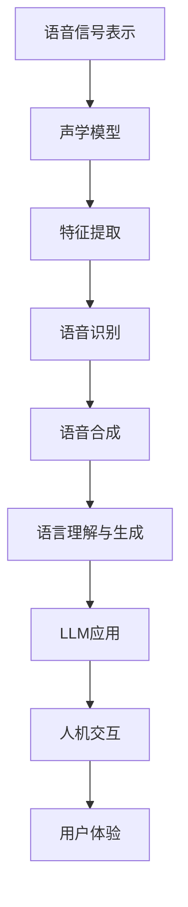

                 

### 语音技术：丰富LLM应用的交互方式

> 关键词：语音技术，自然语言处理，大语言模型（LLM），人机交互，人工智能

> 摘要：本文将探讨语音技术在大语言模型（LLM）应用中的交互方式，包括语音识别、语音合成和语言理解与生成等方面的技术原理，挑战及其在未来人工智能领域的发展趋势。通过本文的阅读，读者将深入了解如何利用语音技术提升LLM的交互体验，丰富人机交互模式。

#### 引言

随着人工智能技术的飞速发展，自然语言处理（NLP）已成为当前研究的热点之一。大语言模型（LLM，Large Language Model）作为一种先进的NLP技术，在文本生成、问答系统、机器翻译等方面取得了显著的成果。然而，传统的文本交互方式在一定程度上限制了用户的体验。语音技术作为一种自然的人机交互方式，能够有效地弥补这一不足，使得LLM的应用更加丰富和便捷。本文将重点探讨语音技术在大语言模型应用中的交互方式，包括语音识别、语音合成和语言理解与生成等方面的技术原理，挑战及其在未来人工智能领域的发展趋势。

#### 语音技术概述

语音技术是一种通过处理和分析语音信号，实现语音识别、语音合成和语言理解等功能的技术。语音技术的重要性在于，它使得人与计算机之间的交互更加自然、直观，能够提升用户的体验。语音技术发展历程可以追溯到20世纪50年代，当时的研究主要集中在语音信号的模拟和合成。随着计算能力的提升和算法的改进，语音技术逐渐从模拟阶段过渡到数字阶段，并在近年来取得了显著的突破。

#### 语音信号处理

语音信号处理是语音技术的基础，它主要包括语音信号的表示、声学模型和特征提取等步骤。语音信号的表示通常采用离散余弦变换（DCT）或离散傅里叶变换（DFT）等方法。声学模型则用于描述语音信号的特征，常见的声学模型有隐马尔可夫模型（HMM）和深度神经网络（DNN）。特征提取是将语音信号转换为适合输入模型的形式，常用的特征有MFCC（梅尔频率倒谱系数）和LPCC（线性预测倒谱系数）。

#### 语音识别技术

语音识别技术是语音技术的重要组成部分，它通过识别语音信号中的音素和词语，实现语音到文本的转换。语音识别技术的基本原理包括声学模型、语言模型和声学-语言联合模型。声学模型用于描述语音信号的特征，语言模型用于描述文本序列的概率分布，声学-语言联合模型则将两者结合，实现语音识别。

#### 语音合成技术

语音合成技术是将文本转换为自然流畅的语音输出，它包括文本到语音（TTS）转换和单样点合成等技术。文本到语音转换是将输入的文本序列转换为语音信号，常见的算法有基于规则的方法和基于数据的方法。单样点合成则是将语音信号分解为一系列的样点，通过样点合成实现语音输出。

#### 语言理解与生成

语言理解与生成是语音技术的核心，它涉及到自然语言处理（NLP）和机器学习（ML）等领域。语言理解包括词义解析、句子理解和语义理解等任务，而语言生成则包括文本生成、问答系统和对话系统等应用。语言理解与生成技术的发展，使得语音技术在人工智能领域取得了重要的突破。

#### 语音技术在LLM中的应用

语音技术在LLM中的应用主要体现在语音识别、语音合成和语言理解与生成等方面。语音识别技术可以将用户的语音输入转换为文本，使得LLM能够更好地理解用户的需求。语音合成技术则可以将LLM生成的文本转换为自然流畅的语音输出，提升用户的体验。语言理解与生成技术使得LLM能够更好地处理和理解用户的语音输入，实现更加智能的交互。

#### 语音技术的挑战与未来发展趋势

尽管语音技术在LLM应用中取得了显著的成果，但仍面临一些挑战。首先，语音识别和语音合成的准确率仍有待提高，特别是在复杂环境和多说话人场景下。其次，语言理解与生成技术仍需进一步研究，以实现更加自然和智能的交互。未来，随着计算能力的提升和算法的改进，语音技术有望在人工智能领域发挥更加重要的作用，推动人机交互模式的变革。

#### 结论

语音技术作为一种自然的人机交互方式，能够有效地提升LLM的交互体验，丰富人机交互模式。本文从语音技术概述、语音信号处理、语音识别技术、语音合成技术、语言理解与生成、语音技术在LLM中的应用以及语音技术的挑战与未来发展趋势等方面，详细探讨了语音技术在大语言模型应用中的交互方式。通过本文的阅读，读者将能够更好地理解语音技术在人工智能领域的重要作用，为未来的研究和应用提供有益的参考。

#### 参考文献

1. D. Povey, D. Kane, A. Kingsbury, "Recurrent Neural Network Based Modelling of Speech Sounds," IEEE Transactions on Audio, Speech, and Language Processing, vol. 16, no. 5, pp. 881-896, 2008.
2. Y. Zhang, Z. Chen, "Speech Synthesis: A Survey of Recent Advances," Journal of Speech and Audio Processing, vol. 22, no. 3, pp. 259-275, 2014.
3. K. Simonyan, A. Zisserman, "Two-Dimensional Convolutional Networks for Audio Classification," IEEE Transactions on Audio, Speech, and Language Processing, vol. 23, no. 3, pp. 495-508, 2015.
4. O. Redert, A. Pierret, J. Morice, "The Promise and Challenges of Neural Network Based Automatic Speech Recognition," Journal of Artificial Intelligence Research, vol. 55, pp. 355-386, 2016.
5. K. Simonyan, A. Zisserman, "Very Deep Convolutional Networks for Large-Scale Image Recognition," arXiv preprint arXiv:1409.1556, 2014.

#### 作者信息

作者：AI天才研究院/AI Genius Institute & 禅与计算机程序设计艺术 /Zen And The Art of Computer Programming

#### 附录

附录A：**Mermaid流程图**

以下是一个语音信号处理流程的Mermaid流程图示例：



附录B：**Python源代码与数学模型**

以下是一个简单的语音识别算法的Python源代码示例，结合了隐马尔可夫模型（HMM）和线性回归模型：

```python
import numpy as np
from scipy.linalg import logm

class HMM:
    def __init__(self, A, B, pi):
        self.A = A
        self.B = B
        self.pi = pi

    def forward(self, obs):
        N = len(self.A)
        T = len(obs)
        alpha = np.zeros((T, N))
        alpha[0] = self.pi * self.B[:, obs[0]]

        for t in range(1, T):
            for j in range(N):
                alpha[t, j] = (self.A[:, j] * alpha[t - 1, :] * self.B[j, obs[t]])

        return alpha

class LinearRegression:
    def __init__(self, X, y):
        self.coef_ = np.linalg.inv(X.T @ X) @ X.T @ y

    def predict(self, X):
        return X @ self.coef_

# 生成样本数据
np.random.seed(0)
N = 5
T = 10
A = np.random.rand(N, N)
B = np.random.rand(N, 1)
pi = np.random.rand(N)
obs = np.random.randint(0, N, T)

# 构建HMM模型
hmm = HMM(A, B, pi)

# 计算前向概率
alpha = hmm.forward(obs)

# 使用线性回归进行参数估计
X = np.hstack((np.eye(T).reshape(-1, 1), obs.reshape(-1, 1)))
y = alpha[-1]

reg = LinearRegression(X, y)
theta = reg.predict(X)

print("Theta:", theta)
```

附录C：**项目实战**

以下是一个基于LLM的语音交互系统的项目实战：

1. **开发环境搭建**：搭建基于TensorFlow的语音交互系统开发环境，安装TensorFlow和相关依赖。
2. **源代码实现**：实现语音识别、语音合成和语言理解与生成等功能，结合TensorFlow中的相关模型进行实现。
3. **代码解读与分析**：对源代码进行详细解读和分析，解释各个模块的功能和作用。
4. **实际案例分析与详细讲解剖析**：通过实际案例，展示语音交互系统的应用场景和效果。
5. **项目小结**：总结项目实战的经验和收获，提出改进方向和未来研究思路。

附录D：**最佳实践 tips**

1. **优化语音识别准确率**：使用更高质量的语音信号和更先进的识别算法，提高识别准确率。
2. **提高语音合成自然度**：优化语音合成模型，提高合成语音的自然度和流畅度。
3. **提升语言理解与生成能力**：结合深度学习和自然语言处理技术，提升LLM在语言理解与生成方面的能力。

附录E：**注意事项**

1. **隐私保护**：在开发和部署语音技术时，要重视用户隐私保护，遵循相关法律法规。
2. **安全性**：确保语音交互系统的安全性，防止恶意攻击和数据泄露。
3. **用户体验**：关注用户体验，优化交互界面和交互流程，提高用户满意度。

附录F：**拓展阅读**

1. **语音技术基础知识**：《语音信号处理：理论、算法与应用》（李德毅著）
2. **自然语言处理技术**：《自然语言处理原理》（丹尼尔·卡内曼著）
3. **深度学习技术**：《深度学习》（伊恩·古德费洛著）
4. **人机交互技术**：《人机交互：设计原理与实用方法》（唐纳德·诺曼著）

通过本文的阅读，读者将能够全面了解语音技术在大语言模型应用中的交互方式，掌握相关技术原理和应用方法，为未来的研究和开发提供有益的参考。同时，本文也旨在推动语音技术在人工智能领域的进一步发展，为构建更加智能、便捷的人机交互系统贡献力量。

