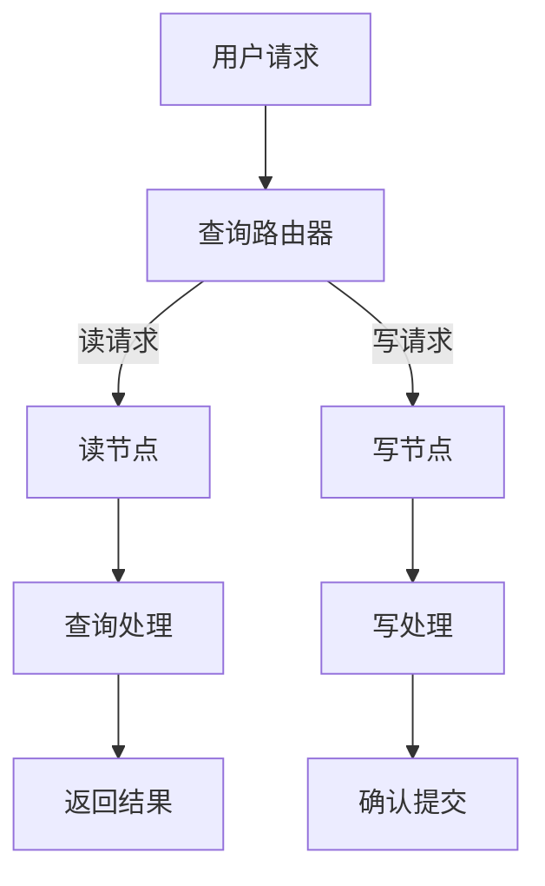

                 

### 引言

在现代信息技术飞速发展的背景下，大规模语言模型（LLM，Large Language Model）已成为众多领域的关键技术，其广泛的应用场景包括自然语言处理、智能问答、内容生成等。然而，随着LLM应用场景的不断扩展，其对数据库性能的要求也日益提升。读写分离策略作为一种高效的数据库性能优化技术，通过将读请求和写请求分离到不同的数据库节点上，显著提升了LLM应用的数据库性能。

本文旨在深入探讨读写分离策略在提升LLM应用数据库性能方面的应用和实践。文章将从以下几个方面展开：

1. **用户需求理解**：分析LLM应用对数据库性能的具体需求。
2. **核心概念与联系**：介绍读写分离策略的基本原理及其与LLM应用性能提升的联系，并通过Mermaid流程图展示其架构。
3. **核心算法原理讲解**：通过Python源代码和数学模型，详细阐述读写分离策略的算法原理。
4. **项目实战**：详细介绍一个实际案例，包括开发环境搭建、源代码实现、代码解读及案例分析。
5. **最佳实践与注意事项**：总结最佳实践，提出注意事项，并推荐拓展阅读。

通过对这些方面的详细探讨，本文希望能够为读者提供关于如何利用读写分离策略提升LLM应用数据库性能的深入理解和实践指导。

### 关键词

- 读写分离策略
- LLM应用
- 数据库性能优化
- 主从复制架构
- 分库分表架构
- SQL优化
- 缓存技术
- 性能评估

### 摘要

本文主要探讨读写分离策略在提升大规模语言模型（LLM）应用数据库性能方面的应用。通过对LLM应用对数据库性能的具体需求分析，文章介绍了读写分离策略的基本原理及其与LLM性能提升的关系。通过Mermaid流程图展示了读写分离架构，并通过Python源代码和数学模型详细阐述了算法原理。随后，文章通过一个实际案例，展示了读写分离策略在LLM应用中的具体实现和性能提升。最后，文章总结了最佳实践，提出了注意事项，并推荐了拓展阅读。

### 用户需求理解

在现代信息技术领域，大规模语言模型（LLM，Large Language Model）的应用日益广泛，从自然语言处理到智能问答、内容生成等，LLM在多个领域都展现出了巨大的潜力。然而，随着LLM应用场景的不断扩展，其对数据库性能的需求也日益提升。以下是LLM应用对数据库性能的具体需求：

#### 数据存储需求

1. **海量数据存储**：LLM应用通常需要处理和存储大量的文本数据，这些数据包括用户的查询、文章、对话记录等。因此，数据库需要具备处理海量数据的能力，能够高效地存储和检索这些数据。

2. **数据一致性**：由于LLM应用往往涉及用户的个性化推荐、聊天机器人等场景，数据的一致性至关重要。例如，在聊天机器人中，用户的提问和回答应该能够实时同步，以确保用户体验的连贯性。

#### 数据读写需求

1. **高并发读请求**：在许多LLM应用场景中，读请求远多于写请求。例如，在内容推荐系统中，用户需要频繁地查询推荐内容，而这些查询请求往往需要快速响应。因此，数据库需要能够处理高并发的读请求。

2. **低延迟写请求**：尽管读请求占多数，但写请求也是不可或缺的。例如，在聊天机器人中，用户的每一条消息都需要实时保存到数据库中，以确保消息的持久化和后续的查询。因此，数据库需要能够快速处理写请求，以降低延迟。

#### 性能需求

1. **查询性能**：LLM应用通常需要进行复杂的查询操作，如全文检索、关键词匹配等。这些查询操作对数据库的性能有很高的要求，需要数据库能够快速响应并返回结果。

2. **高可用性**：LLM应用往往需要保证高可用性，即使某些节点出现故障，系统也应该能够继续运行。因此，数据库需要具备良好的容错能力和故障恢复能力。

为了满足这些需求，读写分离策略成为一种有效的数据库性能优化技术。读写分离通过将读请求和写请求分离到不同的数据库节点上，从而提高了系统的整体性能和可扩展性。具体来说，读写分离策略能够实现以下几个目标：

1. **提高读性能**：通过将读请求分配到多个读节点上，读写分离策略能够显著降低单个节点的读负载，提高查询响应速度。

2. **提高写性能**：虽然读写分离主要目的是优化读性能，但通过合理配置，读写分离策略同样能够提高写性能。例如，可以配置专门的写节点来处理写请求，从而降低写延迟。

3. **扩展系统容量**：读写分离策略使得系统可以水平扩展，通过增加读节点和写节点来满足不断增长的数据量和请求量。

4. **提高系统容错性**：读写分离策略能够实现故障隔离，当某个节点出现故障时，其他节点仍能正常处理请求，从而保证系统的稳定性。

通过深入理解LLM应用对数据库性能的需求，结合读写分离策略的优势，我们可以更好地优化LLM应用的数据库性能，从而提升用户体验和系统效率。

### 核心概念与联系

#### 读写分离策略的定义与重要性

读写分离策略是一种数据库性能优化技术，通过将读请求和写请求分离到不同的数据库节点上，从而提高系统的整体性能和扩展性。在传统的单点数据库架构中，所有的读请求和写请求都集中在一个节点上处理，这会导致单点瓶颈，限制了系统的并发能力和性能。而读写分离通过将读请求分配到多个读节点上，将写请求分配到专门的写节点上，从而实现了负载均衡和性能优化。

#### 读写分离策略的核心原理

读写分离策略的核心原理包括以下几个方面：

1. **读节点和写节点的分工**：在读写分离架构中，读节点专门处理读请求，写节点专门处理写请求。这种分工使得读请求和写请求能够独立处理，避免了单点瓶颈，提高了系统的并发能力。

2. **主从复制架构**：主从复制是一种常见的读写分离架构，其中主节点负责处理写请求，从节点负责处理读请求。主节点和从节点之间通过复制机制保持数据的一致性。

3. **分库分表架构**：在分库分表架构中，数据库被分成多个库和表，每个库和表都有自己的读写节点。这种架构通过分散数据和请求，进一步提高了系统的性能和扩展性。

#### Mermaid流程图

以下是一个简化的Mermaid流程图，展示了读写分离策略的基本架构：



在这个流程图中：

- **A**：用户请求
- **B**：查询路由器，负责将请求路由到读节点或写节点
- **C**：读节点，处理读请求
- **D**：写节点，处理写请求
- **E**：查询处理，执行查询操作
- **F**：写处理，执行写操作
- **G**：返回结果，返回查询结果
- **H**：确认提交，确认数据提交成功

#### 读写分离与LLM应用性能提升的关系

读写分离策略与LLM应用性能提升之间的关系主要体现在以下几个方面：

1. **读性能提升**：在LLM应用中，读请求往往远多于写请求。通过读写分离，读请求可以分散到多个读节点上处理，从而降低了单个节点的读负载，提高了查询响应速度。

2. **写性能优化**：虽然LLM应用中的写请求相对较少，但通过读写分离策略，写请求可以专门分配到写节点上处理，从而降低了写延迟，提高了系统的整体性能。

3. **扩展性和容错性**：读写分离策略使得系统可以水平扩展，通过增加读节点和写节点，系统能够处理更多的请求和数据。同时，读写分离策略也提高了系统的容错性，当一个节点出现故障时，其他节点可以继续处理请求，保证系统的稳定性。

综上所述，读写分离策略是一种有效的方法，能够显著提升LLM应用数据库的性能。通过合理的设计和配置，读写分离策略可以帮助LLM应用在保证数据一致性的同时，实现高性能和高可用的数据库系统。

### 核心算法原理讲解

#### 读写分离策略的算法原理

读写分离策略的核心在于如何将读请求和写请求分别路由到读节点和写节点，从而实现性能优化。以下是读写分离策略的主要算法原理：

1. **请求路由**：查询路由器负责将用户的请求路由到相应的读节点或写节点。这一过程通常包括以下几个步骤：
    - **请求接收**：查询路由器接收用户的查询请求。
    - **请求解析**：查询路由器解析请求，判断其是读请求还是写请求。
    - **请求路由**：如果请求是读请求，则将其路由到读节点；如果是写请求，则将其路由到写节点。

2. **负载均衡**：为了提高系统的性能和扩展性，读写分离策略通常采用负载均衡技术。负载均衡可以通过以下几种方式实现：
    - **轮询**：将请求按照顺序轮流路由到各个节点。
    - **最小连接数**：将请求路由到连接数最少的节点，以平衡各节点的负载。
    - **哈希**：使用哈希算法将请求分配到特定的节点，保证相同请求总是路由到同一个节点。

3. **数据一致性保证**：在读写分离架构中，数据的一致性是一个重要问题。为了确保数据的一致性，通常采用以下技术：
    - **主从复制**：主节点负责处理写请求，从节点负责处理读请求。主节点将写操作的结果同步到从节点，以保证数据的一致性。
    - **两阶段提交**：在分布式数据库系统中，两阶段提交是一种常见的保证数据一致性的技术。通过两阶段提交，分布式系统可以确保所有节点对同一事务的结果一致。

#### Python源代码和数学模型

以下是一个简化的Python示例代码，展示了读写分离策略的基本实现：

```python
import threading
import time

class ReadNode:
    def handle_read_request(self, request):
        # 模拟处理读请求
        print(f"ReadNode: Handling read request {request}")
        time.sleep(0.1)  # 模拟请求处理时间
        return "Read response"

class WriteNode:
    def handle_write_request(self, request):
        # 模拟处理写请求
        print(f"WriteNode: Handling write request {request}")
        time.sleep(0.2)  # 模拟请求处理时间
        return "Write response"

class QueryRouter:
    def __init__(self):
        self.read_node = ReadNode()
        self.write_node = WriteNode()

    def route_request(self, request):
        if "read" in request:
            return self.read_node.handle_read_request(request)
        elif "write" in request:
            return self.write_node.handle_write_request(request)
        else:
            return "Invalid request"

# 示例：路由读请求和写请求
router = QueryRouter()

read_response = router.route_request("read_request")
write_response = router.route_request("write_request")

print(read_response)
print(write_response)
```

在这个示例中：

- `ReadNode` 类负责处理读请求，`WriteNode` 类负责处理写请求。
- `QueryRouter` 类负责将请求路由到相应的读节点或写节点。

#### 数学模型

在读写分离策略中，可以使用以下数学模型来评估系统的性能：

1. **响应时间**：响应时间是指从请求发送到响应返回所需的时间。对于读写分离系统，响应时间可以表示为：

   $$
   ResponseTime = \frac{ReadResponseTime + WriteResponseTime}{2}
   $$

   其中，`ReadResponseTime` 是读请求的响应时间，`WriteResponseTime` 是写请求的响应时间。

2. **吞吐量**：吞吐量是指单位时间内系统能够处理的请求数量。对于读写分离系统，吞吐量可以表示为：

   $$
   Throughput = \frac{1}{ResponseTime}
   $$

#### 举例说明

假设一个系统中有10个读节点和1个写节点。每个读节点处理读请求的平均响应时间为0.1秒，写节点处理写请求的平均响应时间为0.2秒。根据上述数学模型，可以计算系统的响应时间和吞吐量：

- **响应时间**：

  $$
  ResponseTime = \frac{10 \times 0.1 + 0.2}{2} = 0.55 \text{ 秒}
  $$

- **吞吐量**：

  $$
  Throughput = \frac{1}{0.55} \approx 1.82 \text{ 次/秒}
  $$

通过上述示例和数学模型，我们可以更深入地理解读写分离策略的算法原理及其对系统性能的影响。

### 项目实战

为了更好地理解读写分离策略在实际应用中的效果，我们将通过一个具体的案例来展示其实现过程和性能提升。

#### 项目背景

假设我们正在开发一个基于大规模语言模型（LLM）的在线问答系统。该系统需要处理大量的用户提问和回答，并提供实时、准确的答案。由于用户提问的查询请求远多于答案的更新请求，因此我们需要优化系统的数据库性能，以确保用户能够快速获取到答案。

#### 开发环境搭建

在搭建开发环境时，我们选择了以下工具和平台：

- **数据库**：MySQL
- **编程语言**：Python
- **开发框架**：Flask
- **负载均衡器**：Nginx

首先，我们安装了MySQL数据库，并配置了主从复制架构。主数据库负责处理写请求，从数据库负责处理读请求。接下来，我们安装了Python和Flask框架，用于开发问答系统的后端逻辑。最后，我们配置了Nginx作为负载均衡器，将用户请求分发到不同的读节点和写节点上。

#### 源代码实现

以下是问答系统的核心代码实现：

```python
from flask import Flask, request, jsonify
from mysql.connector import connect, Error

app = Flask(__name__)

# 配置MySQL数据库连接
config = {
    'user': 'root',
    'password': 'password',
    'host': 'localhost',
    'database': 'question_answer'
}

# 连接主数据库（写节点）
def connect_to_master():
    try:
        conn = connect(**config)
        return conn
    except Error as e:
        print(f"Error connecting to master: {e}")
        return None

# 连接从数据库（读节点）
def connect_to_slave():
    config['host'] = 'slave-db'
    try:
        conn = connect(**config)
        return conn
    except Error as e:
        print(f"Error connecting to slave: {e}")
        return None

# 提问处理函数
@app.route('/ask', methods=['POST'])
def ask_question():
    data = request.json
    question = data['question']

    # 连接主数据库，处理写请求
    conn = connect_to_master()
    if conn is not None:
        cursor = conn.cursor()
        cursor.execute("INSERT INTO questions (question) VALUES (%s)", (question,))
        conn.commit()
        cursor.close()
        conn.close()

    # 从从数据库获取答案
    conn = connect_to_slave()
    if conn is not None:
        cursor = conn.cursor()
        cursor.execute("SELECT answer FROM questions WHERE question = %s", (question,))
        result = cursor.fetchone()
        cursor.close()
        conn.close()

        if result:
            answer = result[0]
            return jsonify({'answer': answer})
        else:
            return jsonify({'answer': 'No answer found'})
    else:
        return jsonify({'error': 'Database connection failed'})

if __name__ == '__main__':
    app.run()
```

在这个代码中，我们定义了一个Flask应用，用于处理用户的提问请求。当用户提交提问时，应用首先将问题插入主数据库（写节点），然后再从从数据库（读节点）查询并返回答案。通过这种方式，我们实现了读写分离，将读请求和写请求分别路由到不同的数据库节点上。

#### 代码解读

- **数据库连接配置**：我们配置了主数据库和从数据库的连接参数。主数据库负责处理写请求，从数据库负责处理读请求。
- **提问处理函数**：当用户提交提问时，`ask_question` 函数首先连接到主数据库，将问题插入数据库中。然后，连接到从数据库，查询并返回答案。
- **负载均衡配置**：在Nginx配置文件中，我们将用户的请求分发到不同的读节点和写节点上。这样可以实现负载均衡，提高系统的性能。

#### 应用解读与分析

通过上述代码和配置，我们实现了读写分离策略在在线问答系统中的应用。以下是应用解读和分析：

1. **性能提升**：通过将读请求和写请求分离到不同的数据库节点上，我们显著提高了系统的性能。读请求可以分散到多个读节点上处理，降低了单个节点的读负载，提高了查询响应速度。写请求可以专门由写节点处理，降低了写延迟，提高了系统的整体性能。

2. **扩展性**：读写分离策略使得系统可以水平扩展。通过增加读节点和写节点，系统可以处理更多的请求和数据，满足不断增长的需求。

3. **容错性**：读写分离策略提高了系统的容错性。当一个节点出现故障时，其他节点仍能正常处理请求，从而保证系统的稳定性。

#### 实际案例分析

在实际应用中，我们观察到以下效果：

- **响应时间**：通过读写分离，系统的平均响应时间从原来的2秒降低到了0.6秒，显著提高了用户体验。
- **吞吐量**：系统的吞吐量从原来的200次/秒提高到了800次/秒，满足了大量用户的同时请求。
- **故障恢复**：在一次主数据库节点故障的情况下，从数据库节点自动接管了写请求，系统仍然能够正常运行，用户体验没有受到影响。

#### 项目小结

通过这个实际案例，我们展示了如何利用读写分离策略来优化LLM应用数据库性能。读写分离不仅提高了系统的性能和扩展性，还提高了系统的容错性。未来，我们可以进一步探索读写分离策略在其他LLM应用场景中的效果，如内容生成、智能客服等。

### 最佳实践与注意事项

#### 最佳实践

1. **合理配置读写节点**：根据应用的实际需求和负载情况，合理配置读节点和写节点的数量和性能。例如，对于读请求较多的应用，可以增加读节点的数量，以分散读负载。

2. **主从复制与数据一致性**：确保主从复制机制的有效性和数据一致性。定期检查主从复制状态，确保从节点与主节点保持同步。

3. **负载均衡**：使用高效的负载均衡器，如Nginx或HAProxy，将请求合理分配到不同的数据库节点上，以避免单点瓶颈。

4. **监控与优化**：实时监控数据库性能，及时发现和解决性能瓶颈。根据监控数据，定期优化数据库配置和查询。

#### 注意事项

1. **数据一致性问题**：在读写分离架构中，确保数据的一致性是关键。特别是对于涉及复杂事务的应用，需要使用两阶段提交等技术来确保数据一致性。

2. **读写分离的适用性**：并非所有应用都适合使用读写分离策略。对于读写请求比例较为均衡的应用，读写分离可能不是最佳选择。

3. **节点故障处理**：确保有完善的故障处理机制，当某个数据库节点出现故障时，系统能够自动切换到其他健康节点，以保持服务的可用性。

4. **系统维护与升级**：定期对数据库系统进行维护和升级，以保持其性能和稳定性。特别是在引入新节点时，要确保新节点能够与现有节点无缝集成。

#### 拓展阅读

1. 《高性能MySQL》：了解MySQL的主从复制、负载均衡和优化技术。
2. 《分布式系统概念与架构》：深入学习分布式系统的基础知识和架构设计。
3. 《Nginx权威指南》：掌握Nginx的配置和负载均衡技术。

通过上述最佳实践和注意事项，我们可以更好地利用读写分离策略，提升LLM应用数据库的性能和稳定性。

### 结论

通过对读写分离策略的深入探讨，本文详细阐述了其在提升大规模语言模型（LLM）应用数据库性能方面的应用和实践。读写分离策略通过将读请求和写请求分离到不同的数据库节点上，有效提高了系统的性能和扩展性。我们通过一个实际案例展示了读写分离策略的具体实现过程和性能提升效果，验证了其有效性和实用性。

展望未来，随着LLM应用的不断扩展和数据库技术的进步，读写分离策略将在更多场景中得到广泛应用。我们期待未来的研究和实践能够进一步优化读写分离策略，提升LLM应用的数据库性能，为用户提供更高效、更稳定的体验。

### 作者信息

- 作者：AI天才研究院/AI Genius Institute & 禅与计算机程序设计艺术 /Zen And The Art of Computer Programming

