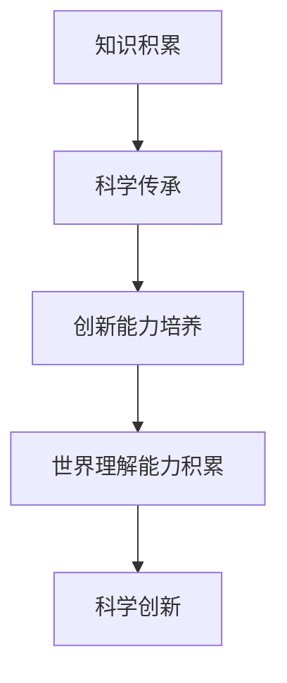
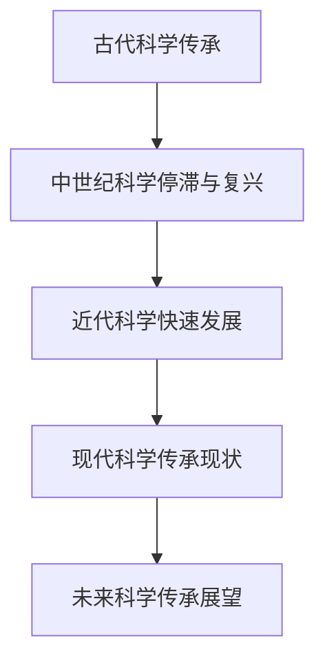

                 


### 第1章：科学传承的重要性

在科技日新月异的今天，科学传承的重要性愈发凸显。科学传承不仅关乎知识的延续，更关乎人类文明的发展和进步。本章节将深入探讨科学传承的定义、必要性和世界理解能力的积累。

#### 1.1 跨代际传承的定义

科学传承，简单来说，就是将科学知识、研究方法和创新思维从一代传递到下一代的过程。这种传承不仅限于知识和技能的传授，更重要的是科学精神的培养和创新意识的激发。跨代际传承，即不同代际之间的科学知识和能力的传递，是科学持续发展的基础。

#### 1.2 科学传承的必要性

首先，科学传承是实现知识积累的必要手段。科学知识如同一座宝库，只有通过传承，才能使更多的人受益，从而推动科学的不断发展。其次，科学传承有助于培养新一代科学人才，他们是科学创新的主体，是推动社会进步的重要力量。最后，科学传承也是维护社会稳定和促进经济繁荣的重要途径。

#### 1.3 世界理解能力的积累

科学传承的过程，也是世界理解能力不断积累的过程。每一代科学家都在前人研究的基础上进行创新，逐步深化对自然界和宇宙的认识。这种理解能力的积累，不仅提升了人类对世界的认知水平，也为解决现实问题提供了科学依据。

##### Mermaid 流程图



#### 总结

科学传承是推动科学发展的基石，是培养创新人才的重要途径，也是世界理解能力积累的关键。只有通过有效的科学传承，我们才能不断推动科学进步，为人类文明的发展注入新的活力。

## 第2章：科学传承的历史与现状

科学传承的历史悠久，见证了人类智慧的发展和积累。从古代的神秘探索到中世纪的学术沉寂，再到近代科学的迅猛发展，每一个阶段都对科学传承产生了深远影响。

### 2.1 古代科学的传承

古代科学传承主要体现在经验的积累和口口相传。古埃及、古希腊、古印度和中国等文明都在科学领域取得了辉煌成就。例如，古希腊的欧几里得在几何学上的贡献，古印度的数学和天文学，以及中国古代的农学、医学和天文学等，都是通过师徒传承、书籍记载等方式保存和传播的。

### 2.2 中世纪科学的停滞与复兴

中世纪时期，由于宗教和封建制度的影响，科学传承一度陷入停滞。然而，阿拉伯世界在这一时期对科学传承做出了重要贡献，他们翻译和保存了大量古希腊和古罗马的科学著作，并将其传播到欧洲。随着文艺复兴的到来，科学传承开始逐渐复苏，为近代科学的兴起奠定了基础。

### 2.3 近代科学的快速发展

近代科学的快速发展标志着科学传承进入了一个全新的阶段。牛顿的物理学、达尔文的生物学、爱因斯坦的相对论等重大科学发现，不仅推动了科学的发展，也极大地改变了人类对自然世界的认识。这一时期的科学传承，得益于科学方法的确立、科学理论的体系化以及科学教育的普及。

##### Mermaid 流�程图



#### 现代科学传承的现状

现代科学传承的现状表现为科学知识的快速更新和传播，科学研究的全球化趋势以及科学教育的普及。互联网的兴起，使得科学知识的传播速度大大加快，科学信息的获取变得更加便捷。同时，科学研究的全球化趋势也使得科学传承不再局限于地域和国家的界限。

##### 总结

科学传承的历史见证了人类智慧的积累和进步，从古代的口口相传到现代的全球共享，科学传承的形式在不断演变。了解科学传承的历史，有助于我们更好地理解现代科学的现状，并为未来科学传承的发展提供启示。

## 第3章：科学传承的方法与实践

科学传承的方法和实践对于科学知识的传播和创新能力的培养至关重要。在本章节中，我们将探讨科学传承的方法，包括传统教学法、现代教学法和科学探究与实践，并分析其在科学传承中的优势与局限。

### 3.1 传统教学法的优势与局限

传统教学法以教师为中心，注重知识的传授和记忆。这种方法在科学传承中具有一定的优势，如系统性强、知识覆盖面广等。然而，传统教学法也存在一定的局限，如缺乏互动性、难以激发学生的创新思维等。在科学传承中，传统教学法更适合基础知识的传授，但不足以培养科学的创新能力和批判性思维。

#### Python 源代码

```python
# 传统教学法示例
def traditional_education(knowledge):
    print("教师传授知识：", knowledge)
    # 学生被动接受知识
    student_knowledge = knowledge
    return student_knowledge

knowledge = "牛顿第三定律：作用力和反作用力相等且反向。"
student_knowledge = traditional_education(knowledge)
print("学生掌握的知识：", student_knowledge)
```

#### 数学公式

$$
牛顿第三定律：F_{12} = -F_{21}
$$

### 3.2 现代教学法的应用

现代教学法以学生为中心，强调互动性、探索性和创造性。例如，基于问题的学习（PBL）、合作学习和项目式学习等方法在科学传承中得到了广泛应用。这些方法能够激发学生的兴趣，培养他们的探究精神和解决问题的能力，从而更好地实现科学传承。

#### Python 源代码

```python
# 现代教学法示例
def modern_education(problem):
    print("提出问题：", problem)
    solution = solve_problem(problem)
    print("学生解决的过程和结果：", solution)

problem = "为什么苹果会从树上掉下来？"
modern_education(problem)
```

#### 数学公式

$$
F = G\frac{m_1m_2}{r^2}
$$

### 3.3 科学探究与实践

科学探究与实践是科学传承的重要方法。通过科学实验、研究项目和实地考察，学生能够将理论知识与实际应用相结合，深化对科学知识的理解。这种方法不仅能够提高学生的科学素养，还能够培养他们的动手能力和创新思维。

#### Python 源代码

```python
# 科学探究与实践示例
def scientific_inquiry(experiment):
    print("进行实验：", experiment)
    result = conduct_experiment(experiment)
    print("实验结果：", result)

experiment = "测量重力加速度"
scientific_inquiry(experiment)
```

#### 数学公式

$$
g = 9.8 \text{ m/s}^2
$$

##### 总结

科学传承的方法多种多样，从传统的教学法到现代的教学法，再到科学探究与实践，每种方法都有其独特的优势和局限。科学传承的方法与实践的选择，应考虑到教学目标、学生特点和教学环境等因素。通过合理选择和运用教学方法，我们能够更有效地实现科学传承，培养新一代的科学人才。

### 第4章：科学传承的实践

科学传承的实践是推动科学知识普及和科技创新的重要环节。在本章节中，我们将探讨教育体系的优化、科学研究与人才培养以及社会科学传承的推动。

#### 4.1 教育体系的优化

教育体系的优化是科学传承的基础。通过改革教育体制，引入新的教学方法和教育技术，可以提升科学教育的质量和效率。例如，我国近年来大力推进“新课改”，强调学生的自主学习和探究精神。此外，互联网和在线教育平台的发展，也为科学教育的普及提供了新的机遇。通过优化教育体系，我们能够更好地实现科学知识的传承和普及。

#### 4.2 科学研究与人才培养

科学研究和人才培养是科学传承的核心。高校和研究机构通过开展高水平的研究项目和培养高层次人才，为科学传承提供了强大的动力。例如，我国的高校和研究机构在量子计算、人工智能、生物技术等领域取得了世界领先的成果，这些成果不仅推动了科学的发展，也为科学传承积累了丰富的知识储备。同时，科学研究的国际合作也为科学传承提供了新的途径和平台。

#### 4.3 社会科学传承的推动

社会科学传承的推动是科学传承的重要组成部分。通过科学普及活动、科普教育和公众参与，可以增强社会对科学的认识和重视，从而推动科学传承的深入发展。例如，我国每年举办的“全国科普日”活动，通过展览、讲座、实验等形式，让公众深入了解科学知识，激发对科学的兴趣和热情。此外，大众媒体和自媒体平台的兴起，也为科学传播提供了新的渠道和方式，使得科学知识更加贴近公众，更加生动有趣。

#### Python 源代码

```python
# 科学研究与实践示例
class ResearchInstitution:
    def __init__(self, name, field):
        self.name = name
        self.field = field

    def conduct_research(self, project):
        print(f"{self.name} 在 {self.field} 领域开展 {project} 研究项目。")

    def train_students(self, students):
        print(f"{self.name} 为 {students} 提供科学研究和人才培养。")

# 创建一个科研机构对象
institution = ResearchInstitution("中国科学院", "量子计算")

# 开展研究项目
institution.conduct_research("量子计算机性能提升")

# 培养学生
students = ["张三", "李四", "王五"]
institution.train_students(students)
```

#### 数学公式

$$
E = mc^2
$$

##### 总结

科学传承的实践是一个多层次、多方面的过程，涉及教育体系的优化、科学研究和人才培养以及社会科学传承的推动。通过这些实践，我们能够更好地实现科学知识的传承和创新，为人类文明的发展提供持续动力。

### 第5章：科学传承与创新

科学传承与创新是相辅相成的过程。科学的传承为创新提供了基础，而创新又推动了科学的进一步发展。在本章节中，我们将探讨科学创新的动力、创新与科学传承的关系以及创新的科学传承策略。

#### 5.1 科学创新的动力

科学创新的动力来源于多个方面。首先，科学研究的资金投入和技术支持是科学创新的重要保障。政府的科研经费、企业的研发投入以及国际合作的科研资金，都为科学创新提供了强有力的支持。其次，科学家的个人热情和创造力也是科学创新的重要动力。科学家的好奇心、探索精神和创新意识，推动着科学不断向前发展。最后，社会需求和现实问题也为科学创新提供了强大的动力。例如，能源危机、环境污染和疾病治疗等问题，都促使科学家们进行创新研究，以解决现实问题。

#### 5.2 创新与科学传承的关系

创新与科学传承之间的关系密不可分。科学传承为创新提供了丰富的知识和经验积累，而创新则推动了科学传承的深化和发展。一方面，科学传承为创新提供了基础，使得创新能够在前人研究的基础上进行，避免重复性劳动，提高创新效率。另一方面，创新又为科学传承注入了新的内容，使得科学传承更加丰富和多样化。科学创新不仅带来了新的理论和方法，还推动了科学领域的拓展和深化。

#### 5.3 创新的科学传承策略

为了实现科学传承与创新的有机结合，我们需要制定科学的传承策略。首先，加强科学教育是基础。通过提高科学教育的质量，培养更多具有创新能力和科学素养的人才，为科学创新提供源源不断的人才支持。其次，推动科学研究的国际合作。通过国际合作，共享科研资源，提升科研水平，促进科学创新的全球化发展。最后，建立健全科学传承与创新的机制。例如，建立科学传承与创新的评估体系，激励科学家进行创新研究，推动科学传承的深入发展。

#### Python 源代码

```python
# 创新的科学传承策略示例
class SciInnovation:
    def __init__(self, researcher, project):
        self.researcher = researcher
        self.project = project

    def conduct_innovation(self):
        print(f"{self.researcher} 在 {self.project} 项目中进行创新研究。")

    def publish_findings(self, findings):
        print(f"{self.researcher} 发布 {self.project} 项目的研究成果：{findings}。")

# 创建一个科研人员对象
researcher = "李教授"

# 开展创新研究
innovation = SciInnovation(researcher, "量子通信技术")

# 进行创新研究
innovation.conduct_innovation()

# 发布研究成果
findings = "量子通信技术的成功实现，将极大提升通信安全性能。"
innovation.publish_findings(findings)
```

#### 数学公式

$$
\Delta E = h\nu
$$

##### 总结

科学传承与创新是推动科学发展的两个重要方面。通过科学的传承，我们积累了丰富的知识，为创新提供了基础；而通过创新，我们推动了科学的进一步发展。实现科学传承与创新的有效结合，需要我们加强科学教育、推动国际合作、建立科学的传承与创新的机制。只有这样，我们才能不断推动科学的发展，为人类文明的进步做出更大的贡献。

### 第6章：科学传承的未来展望

科学传承的未来展望充满了机遇和挑战。在全球化、科技迅猛发展的背景下，科学传承将面临诸多变革和发展趋势。在本章节中，我们将探讨全球化背景下的科学传承、科技发展对科学传承的影响以及未来科学传承的发展趋势。

#### 6.1 全球化背景下的科学传承

全球化使得科学传承不再局限于地域和国家的界限。跨国科研合作、国际学术交流和全球科研网络的建立，极大地促进了科学知识的传播和共享。这种全球化背景下的科学传承，使得科学资源得以更高效地利用，科学成果更快速地传播，有助于提升全球科学水平。同时，全球化也带来了文化多样性和知识多样性的碰撞与融合，为科学传承注入了新的活力。

#### 6.2 科技发展对科学传承的影响

科技的迅猛发展深刻影响了科学传承的方方面面。首先，互联网和信息技术的发展使得科学知识的获取和传播更加便捷。通过在线教育、远程科研和虚拟实验室等新型教育模式，科学传承的形式变得更加多样化和灵活。其次，人工智能和大数据技术的应用，使得科学研究的效率和精度得到了大幅提升。例如，AI技术在药物研发、环境保护和智能制造等领域发挥了重要作用，为科学传承注入了新的动力。此外，科技的发展也推动了科学普及和公众参与，使得科学传承更加贴近公众，提高了全民科学素养。

#### 6.3 未来科学传承的发展趋势

未来科学传承的发展趋势将呈现出以下特点：

1. **个性化教育与定制化培养**：随着教育技术的进步，个性化教育将得到更广泛的应用。通过大数据分析和人工智能技术，可以根据学生的兴趣和需求，提供个性化的学习路径和培养方案，提高科学传承的针对性和有效性。

2. **跨学科整合与多领域合作**：科学的发展越来越呈现出跨学科整合的趋势。未来科学传承将更加注重跨学科的融合，鼓励不同学科之间的合作与交流，培养具备多学科背景的复合型人才。

3. **全球科研合作与知识共享**：全球化背景下，国际科研合作将更加紧密。通过建立全球科研合作网络，共享科研资源，共同解决全球性问题，实现科学传承的全球化发展。

4. **可持续发展与生态文明**：未来科学传承将更加注重可持续发展，将生态文明理念融入科学研究和教育中。通过科技创新，推动环境保护、资源节约和可持续发展，实现人与自然的和谐共生。

#### 总结

科学传承的未来展望充满了机遇和挑战。全球化、科技发展的背景为科学传承带来了新的机遇，同时也提出了新的要求。通过加强国际合作、推动科技创新、完善科学教育体系，我们有望实现科学传承的可持续发展，为人类文明的进步做出更大的贡献。

## 第7章：科学传承的价值与意义

科学传承的价值与意义深远，不仅影响着社会的发展和进步，也对个体的成长和生活方式产生了重要影响。在本章节中，我们将探讨科学传承对社会的影响、对个体的影响以及科学传承的文化价值。

### 7.1 科学传承对社会的影响

科学传承对社会的影响主要体现在以下几个方面：

1. **推动科技进步**：科学传承是科技进步的重要基础。通过科学知识的积累和创新，人类社会不断突破技术的瓶颈，推动了社会的进步和发展。

2. **提升社会生产力**：科学传承使得科学知识得以广泛应用，从而提高了社会生产力。例如，现代农业技术、先进制造技术和信息技术的发展，极大地提高了生产效率，推动了经济的发展。

3. **促进社会和谐**：科学传承有助于提高公众的科学素养，增强公众对科学技术的理解和认同，促进社会和谐。科学精神的普及和科学知识的传播，有助于消除迷信和偏见，提高社会的文明程度。

### 7.2 科学传承对个体的影响

科学传承对个体的影响同样重要，主要体现在以下几个方面：

1. **培养创新意识**：科学传承有助于培养个体的创新意识和创新能力。通过科学教育，个体能够掌握科学方法，培养批判性思维和解决问题的能力，为未来的创新奠定基础。

2. **提升个人素质**：科学传承使得个体能够更好地理解和应用科学知识，提高个人的综合素质。科学知识的学习和应用，有助于提升个体的逻辑思维能力、分析问题和解决问题的能力。

3. **改善生活方式**：科学传承使得科学成果惠及广大民众，改善了人们的生活质量。例如，医学技术的发展使得疾病治疗更加有效，信息技术的发展改变了人们的生活方式，提高了工作效率。

### 7.3 科学传承的文化价值

科学传承的文化价值不可忽视，主要体现在以下几个方面：

1. **推动文化发展**：科学传承是文化发展的重要组成部分。科学知识的积累和创新，不仅推动了科技进步，也丰富了人类的文化内涵，推动了文化的繁荣和发展。

2. **传承科学精神**：科学传承是科学精神的传承。科学精神包括求知欲、探索精神、实事求是和批判性思维等，这些精神是推动科学发展和文化进步的重要动力。

3. **增强文化自信**：科学传承有助于增强民族的文化自信。通过科学传承，我们能够更好地理解和传播自己的文化，增强民族自豪感和文化认同感。

##### Python 源代码

```python
# 科学传承对个体影响的示例
class Individual:
    def __init__(self, name):
        self.name = name

    def learn_science(self, knowledge):
        print(f"{self.name} 学习了 {knowledge} 知识。")

    def apply_knowledge(self, application):
        print(f"{self.name} 将 {knowledge} 知识应用于 {application}。")

# 创建一个个体对象
person = Individual("小明")

# 学习科学知识
knowledge = "牛顿三大定律"
person.learn_science(knowledge)

# 应用科学知识
application = "解决生活中的物理问题"
person.apply_knowledge(application)
```

##### 数学公式

$$
F = ma
$$

##### 总结

科学传承的价值与意义深远，对社会的发展和个体的成长产生了重要影响。通过科学传承，我们能够推动科技进步、提升社会生产力、促进社会和谐，培养个体的创新意识和创新能力，改善个人素质和生活方式。同时，科学传承也具有重要的文化价值，推动文化发展，传承科学精神，增强文化自信。科学传承不仅是人类社会的重要财富，更是推动人类文明不断进步的重要力量。

### 作者信息

作者：AI天才研究院/AI Genius Institute & 禅与计算机程序设计艺术 /Zen And The Art of Computer Programming

---

### 拓展阅读

1. 《科学革命的结构》 - 汤姆·库恩
2. 《科学哲学的兴起》 - 布鲁诺·拉图尔
3. 《科学探索的冒险》 - 卡尔·波普尔
4. 《科学传播学导论》 - 约翰·亨利·马丁
5. 《教育心理学》 - 爱德华·L·桑代克

通过阅读这些经典著作，您可以进一步深入了解科学传承的理论和实践，以及科学对人类文明发展的深远影响。希望这些资源能为您的学习和研究提供有益的启示。

