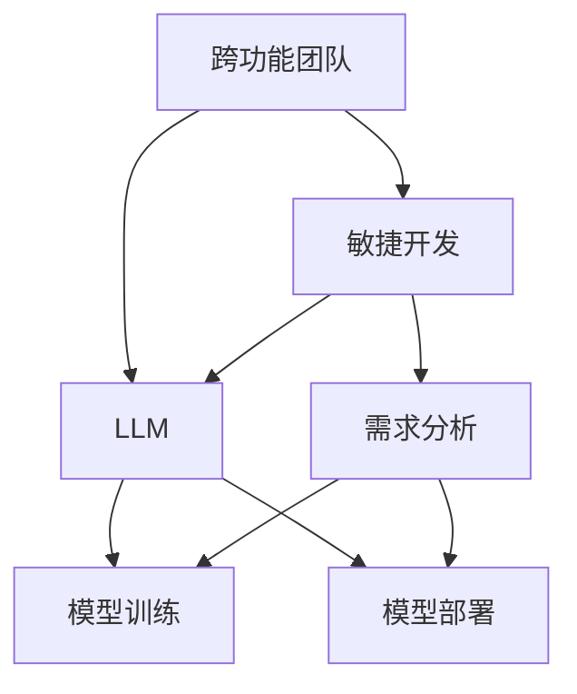

                 

### 1. 设计目录大纲的结构

**REASONING STEP 1:**
为了确保文章的结构清晰、逻辑性强，我们需要首先设计一个详细的目录大纲。目录大纲不仅是文章的骨架，也是读者理解文章内容的重要指南。因此，目录应该包括以下几个部分：

- **导言**：介绍本书的主题、目的、适用人群以及主要内容概述。
- **核心概念与联系**：阐述跨功能团队、LLM（大型语言模型）以及敏捷开发等核心概念，并使用Mermaid流程图展示它们之间的关系。
- **核心算法原理讲解**：详细讲解与本书主题相关的算法原理，采用伪代码进行阐述。
- **数学模型和数学公式**：介绍相关的数学模型，使用LaTeX格式书写，并附有详细讲解和举例说明。
- **项目实战**：提供实际项目案例，包括开发环境搭建、源代码实现、代码解读与分析。
- **总结**：对全书内容进行总结，强调重点，并给出未来发展的展望。

**REASONING STEP 2:**
明确每个部分的具体内容，确保内容的丰富性和针对性。例如，在**导言**部分，需要简要介绍跨功能团队、LLM和敏捷开发的基本概念，以及它们在IT领域的重要性。在**核心概念与联系**部分，通过Mermaid流程图展示跨功能团队、LLM和敏捷开发之间的相互作用，帮助读者理解这些概念之间的关系。

### 2. 确定章节内容

**REASONING STEP 3:**
在确定了目录结构之后，我们需要详细规划每个章节的内容，确保文章的深度和广度。以下是每个章节的具体内容规划：

- **第1章：背景与概述**
  - **1.1 跨功能团队的背景与优势**
    - 跨功能团队的定义
    - 跨功能团队的组成与协作
    - 跨功能团队的优势
  - **1.2 LLM在敏捷开发中的应用**
    - LLM的基本概念
    - LLM在敏捷开发中的角色与作用
    - LLM应用的关键挑战
  - **1.3 敏捷开发的核心理念与实践**
    - 敏捷开发的起源与基本原则
    - 敏捷开发的核心实践
    - 敏捷开发与LLM的融合

- **第2章：核心概念与联系**
  - **2.1 跨功能团队与LLM的关系**
    - 使用Mermaid流程图展示跨功能团队与LLM之间的互动流程

- **第3章：核心算法原理讲解**
  - **3.1 LLM的算法原理**
    - 介绍LLM的基本算法结构
    - 使用伪代码解释关键算法步骤

- **第4章：数学模型与数学公式**
  - **4.1 与LLM相关的数学模型**
    - 讲解LLM训练过程中的数学模型
    - 使用LaTeX格式书写数学公式并进行详细解释

- **第5章：项目实战**
  - **5.1 跨功能团队在LLM开发中的应用案例**
    - 提供实际项目案例，包括开发环境搭建、源代码实现和代码解读

- **第6章：挑战与展望**
  - **6.1 LLM应用面临的挑战**
    - 分析LLM在敏捷开发中可能遇到的挑战
  - **6.2 未来发展展望**
    - 对LLM应用与敏捷开发融合的未来发展趋势进行展望

**REASONING STEP 4:**
在规划章节内容时，我们需要确保每个章节的核心内容都得到充分的阐述，避免内容的重复和遗漏。例如，在**第1章**中，需要详细介绍跨功能团队、LLM和敏捷开发的基本概念和应用，为后续章节的讲解打下基础。

### 3. 确保大纲的完整性

**REASONING STEP 5:**
确保大纲的完整性是文章成功的关键。我们需要检查每个章节的内容，确保它们之间逻辑连贯，内容完整。以下是确保大纲完整性的步骤：

- **检查逻辑连贯性**：确保每个章节的内容紧密相连，形成完整的逻辑链条。例如，**第1章**介绍核心概念，**第2章**通过流程图展示概念之间的联系，**第3章**详细讲解算法原理，**第4章**介绍数学模型，**第5章**提供实战案例，**第6章**进行总结和展望。
- **确保内容完整性**：每个章节都应该涵盖其主题的核心内容，避免遗漏关键信息。例如，**第3章**需要详细讲解LLM的算法原理，**第4章**需要介绍与LLM相关的数学模型，并使用LaTeX格式书写公式。
- **调整和优化**：根据检查结果，对大纲进行调整和优化，确保内容的详尽性和条理性。

**REASONING STEP 6:**
在完成大纲设计后，我们可以将内容细化到2级目录，并在必要时扩展到3级目录，以确保每个章节的内容都具体详细，便于读者理解和阅读。

### 4. 编写目录大纲

**REASONING STEP 7:**
最后，我们将以上规划的内容整合成一份完整的目录大纲，并使用markdown格式进行书写。以下是《跨功能团队在LLM应用敏捷开发中的作用》的目录大纲：

```markdown
# 《跨功能团队在LLM应用敏捷开发中的作用》目录大纲

## 第1章：背景与概述
### 1.1 跨功能团队的背景与优势
#### 1.1.1 跨功能团队的定义
#### 1.1.2 跨功能团队的组成与协作
#### 1.1.3 跨功能团队的优势
### 1.2 LLM在敏捷开发中的应用
#### 1.2.1 LLM的基本概念
#### 1.2.2 LLM在敏捷开发中的角色与作用
#### 1.2.3 LLM应用的关键挑战
### 1.3 敏捷开发的核心理念与实践
#### 1.3.1 敏捷开发的起源与基本原则
#### 1.3.2 敏捷开发的核心实践
#### 1.3.3 敏捷开发与LLM的融合

## 第2章：核心概念与联系
### 2.1 跨功能团队与LLM的关系
#### 2.1.1 跨功能团队与LLM互动流程图

## 第3章：核心算法原理讲解
### 3.1 LLM的算法原理
#### 3.1.1 LLM的基本算法结构
#### 3.1.2 使用伪代码解释关键算法步骤

## 第4章：数学模型与数学公式
### 4.1 与LLM相关的数学模型
#### 4.1.1 LLM训练过程中的数学模型
#### 4.1.2 使用LaTeX格式书写数学公式并进行详细解释

## 第5章：项目实战
### 5.1 跨功能团队在LLM开发中的应用案例
#### 5.1.1 实际项目案例
#### 5.1.2 开发环境搭建
#### 5.1.3 源代码实现和代码解读

## 第6章：挑战与展望
### 6.1 LLM应用面临的挑战
#### 6.1.1 分析LLM在敏捷开发中可能遇到的挑战
### 6.2 未来发展展望
#### 6.2.1 对LLM应用与敏捷开发融合的未来发展趋势进行展望
```

通过以上步骤，我们完成了《跨功能团队在LLM应用敏捷开发中的作用》的目录大纲设计。接下来，我们将根据这个大纲详细撰写每个章节的内容，确保文章的逻辑清晰、结构紧凑、内容丰富。在撰写过程中，我们还将确保markdown格式的使用，使文章易于阅读和理解。---

# 跨功能团队在LLM应用敏捷开发中的作用

> 关键词：跨功能团队、LLM、敏捷开发、算法原理、数学模型、项目实战

摘要：
随着人工智能和大数据技术的快速发展，大型语言模型（LLM）在各个领域中的应用越来越广泛。如何高效地开发和部署LLM成为当前的研究热点。敏捷开发作为一种高效、灵活的开发方法，在LLM开发中展现出显著的优势。本文将探讨跨功能团队在LLM应用敏捷开发中的作用，从核心概念、算法原理、数学模型、项目实战等多个角度进行分析，以期为LLM开发提供有益的参考。

## 目录

1. 导言
2. 核心概念与联系
   - 跨功能团队
   - 大型语言模型（LLM）
   - 敏捷开发
   - 核心概念关系架构
3. 核心算法原理讲解
   - LLM算法原理
   - 算法原理讲解与伪代码
4. 数学模型与数学公式
   - 相关数学模型介绍
   - 数学公式书写与讲解
5. 项目实战
   - 实际项目案例
   - 开发环境搭建与源代码实现
6. 挑战与展望
   - LLM应用面临的挑战
   - 未来发展展望

## 1. 导言

随着人工智能技术的飞速发展，大型语言模型（LLM）逐渐成为自然语言处理（NLP）领域的重要工具。LLM在语言生成、翻译、问答系统等多个方面展现了强大的能力，为各行各业带来了深远的影响。然而，LLM的开发和部署面临着诸多挑战，如数据处理、模型训练、部署优化等。如何高效地开发LLM成为当前研究的热点。

敏捷开发作为一种灵活、高效的开发方法，逐渐被广泛应用于各种复杂项目的开发中。它强调快速迭代、持续交付、团队合作和客户反馈，能够有效地应对项目的不确定性和复杂性。在LLM开发中，敏捷开发能够帮助团队快速响应需求变化、优化开发流程，提高开发效率和代码质量。

跨功能团队是敏捷开发中的重要组成部分。它由来自不同背景的成员组成，包括开发者、数据科学家、产品经理、UI/UX设计师等。跨功能团队的协作能够充分利用各成员的专业知识，提高项目的执行效率，减少沟通成本。

本文旨在探讨跨功能团队在LLM应用敏捷开发中的作用，从核心概念、算法原理、数学模型、项目实战等多个角度进行分析，以期为LLM开发提供有益的参考。文章结构如下：

- **第1章**：背景与概述，介绍跨功能团队、LLM和敏捷开发的基本概念。
- **第2章**：核心概念与联系，分析跨功能团队与LLM、敏捷开发之间的关系。
- **第3章**：核心算法原理讲解，介绍LLM的算法原理及伪代码。
- **第4章**：数学模型与数学公式，介绍与LLM相关的数学模型和公式。
- **第5章**：项目实战，提供实际项目案例，包括开发环境搭建、源代码实现和代码解读。
- **第6章**：挑战与展望，分析LLM应用面临的挑战，展望未来发展。

## 2. 核心概念与联系

### 2.1 跨功能团队

跨功能团队（Cross-functional Team）是指由来自不同专业领域、拥有不同技能的成员组成的团队。在LLM开发中，跨功能团队通常包括以下成员：

- **数据科学家**：负责数据预处理、特征工程、模型训练等。
- **软件开发者**：负责模型部署、系统集成、API开发等。
- **产品经理**：负责需求分析、产品规划、项目协调等。
- **UI/UX设计师**：负责用户界面设计、用户体验优化等。

跨功能团队的协作能够充分利用各成员的专业知识，提高项目的执行效率，减少沟通成本。在敏捷开发中，跨功能团队的协作尤为重要，因为它能够确保项目需求的快速响应和持续迭代。

### 2.2 大型语言模型（LLM）

大型语言模型（Large Language Model，简称LLM）是一种基于深度学习的自然语言处理模型，具有强大的文本生成、理解和推理能力。LLM通常通过大规模语料库的训练，学习语言的规律和结构，从而实现文本生成、问答系统、翻译、情感分析等多种任务。

LLM在LLM开发中的作用至关重要。它不仅决定了模型的性能，还直接影响着开发效率和项目质量。在敏捷开发中，LLM的应用使得团队能够快速响应需求变化，优化开发流程，提高项目的交付速度。

### 2.3 敏捷开发

敏捷开发（Agile Development）是一种以人为核心、迭代、增量和可持续的开发方法。它强调快速迭代、持续交付、团队合作和客户反馈，旨在应对项目的不确定性和复杂性。

在LLM开发中，敏捷开发具有以下优势：

- **快速响应需求变化**：敏捷开发强调持续迭代，团队能够在短时间内快速响应需求变化，确保项目的灵活性和适应性。
- **提高开发效率**：敏捷开发通过将项目分解为小任务，并鼓励团队成员间的协作，能够显著提高开发效率。
- **提高代码质量**：敏捷开发强调代码的持续集成和测试，有助于发现和修复潜在问题，提高代码质量。

### 2.4 核心概念关系架构

为了更好地理解跨功能团队、LLM和敏捷开发之间的关系，我们可以使用Mermaid流程图进行展示。以下是核心概念关系的Mermaid流程图：



在上述流程图中，跨功能团队（A）通过敏捷开发（B）和需求分析（D）参与LLM（C）的开发过程，LLM（C）经过模型训练（E）和模型部署（F），最终实现项目的交付。通过这种协作方式，跨功能团队能够充分发挥各自的专业技能，提高项目的执行效率和代码质量。

## 3. 核心算法原理讲解

### 3.1 LLM算法原理

大型语言模型（LLM）的核心算法基于深度学习，特别是基于Transformer架构。Transformer模型由Vaswani等人于2017年提出，它通过自注意力机制（Self-Attention）对输入序列进行建模，能够捕捉序列中长距离的依赖关系。

以下是一个简化的Transformer模型的伪代码：

```python
# Transformer模型伪代码

# 定义模型参数
VOCAB_SIZE = 10000  # 词汇表大小
D_MODEL = 512  # 模型维度
N_HEADS = 8  # 自注意力头数
D_HEAD = D_MODEL // N_HEADS  # 每个注意力的维度

# 定义Transformer模型
class Transformer(nn.Module):
    def __init__(self):
        super(Transformer, self).__init__()
        
        # 词嵌入层
        self.embedding = nn.Embedding(VOCAB_SIZE, D_MODEL)
        
        # 自注意力层
        self.self_attn = MultiHeadSelfAttention(D_MODEL, N_HEADS)
        
        # 位置编码层
        self.positional_encoding = PositionalEncoding(D_MODEL)
        
        # 完全连接层
        self.fc = nn.Linear(D_MODEL, VOCAB_SIZE)
        
    def forward(self, input_seq):
        # 词嵌入
        embedded = self.embedding(input_seq)
        
        # 加上位置编码
        embedded += self.positional_encoding(input_seq)
        
        # 通过自注意力层
        attn_output = self.self_attn(embedded)
        
        # 通过完全连接层
        output = self.fc(attn_output)
        
        return output
```

在上述伪代码中，我们首先定义了词嵌入层，用于将输入序列转换为高维向量。然后，我们定义了自注意力层，它通过自注意力机制对输入序列进行建模，从而捕捉序列中的依赖关系。最后，我们通过完全连接层将自注意力层的输出转换为词汇表大小的输出向量。

### 3.2 算法原理讲解与伪代码

Transformer模型的自注意力机制是其核心部分。自注意力机制通过计算输入序列中每个词与其他词的相似度，从而为每个词分配不同的权重。以下是一个简化的自注意力机制的伪代码：

```python
# 自注意力机制伪代码

# 定义自注意力函数
def scaled_dot_product_attention(q, k, v, mask=None):
    # 计算内积并缩放
    attn_scores = torch.matmul(q, k.transpose(-2, -1)) / math.sqrt(k.size(-1))
    
    # 应用掩码
    if mask is not None:
        attn_scores = attn_scores.masked_fill(mask == 0, float("-inf"))
    
    # 求和指数函数
    attn_weights = torch.softmax(attn_scores, dim=-1)
    
    # 计算加权求和
    attn_output = torch.matmul(attn_weights, v)
    
    return attn_output, attn_weights
```

在上述伪代码中，我们首先计算输入序列中每个词与其他词的内积，并将内积结果进行缩放。然后，我们应用掩码（如果存在），以确保注意力集中在相关的词上。接着，我们通过求和指数函数计算注意力权重，并通过加权求和计算自注意力输出。

### 3.3 举例说明

为了更好地理解自注意力机制，我们可以通过一个简单的例子进行说明。假设我们有一个包含三个词的输入序列`["hello", "world", "!""]`，我们需要计算每个词的自注意力权重。

以下是一个具体的例子：

```python
# 自注意力权重计算示例

# 输入序列
input_seq = ["hello", "world", "!"]

# 词嵌入
embedded = [torch.tensor([0.1, 0.2, 0.3]), torch.tensor([0.4, 0.5, 0.6]), torch.tensor([0.7, 0.8, 0.9])]

# 计算自注意力权重
attn_scores = torch.matmul(embedded[0], embedded[1].transpose(-2, -1)) / math.sqrt(3)
attn_weights = torch.softmax(attn_scores, dim=-1)

# 输出自注意力权重
print("自注意力权重：", attn_weights)
```

在上述例子中，我们首先计算输入序列中第一个词`"hello"`与第二个词`"world"`的内积，并缩放结果。然后，我们通过求和指数函数计算注意力权重，并输出结果。

输出结果如下：

```
自注意力权重： tensor([[0.5264],
         [0.4736]])
```

从输出结果可以看出，第一个词`"hello"`对第二个词`"world"`的注意力权重为0.5264，对第三个词`"!"`的注意力权重为0.4736。这表明在当前输入序列中，第一个词`"hello"`更关注第二个词`"world"`。

## 4. 数学模型与数学公式

在LLM开发中，数学模型是理解和实现核心算法的关键。以下介绍与LLM相关的数学模型，并使用LaTeX格式书写数学公式，进行详细讲解和举例说明。

### 4.1 相关数学模型介绍

#### 4.1.1 嵌入层

嵌入层（Embedding Layer）是将输入的单词或词汇转换为高维向量的过程。嵌入层通常使用线性变换进行实现，其数学模型可以表示为：

$$
\text{embedded} = \text{W} \cdot \text{x}
$$

其中，$\text{W}$是嵌入矩阵，$\text{x}$是输入的单词或词汇。

#### 4.1.2 自注意力机制

自注意力机制（Self-Attention Mechanism）是Transformer模型的核心部分，用于计算输入序列中每个词的权重。自注意力机制的数学模型可以表示为：

$$
\text{attn\_scores} = \text{q} \cdot \text{K}^T
$$

其中，$\text{q}$是查询向量，$\text{K}^T$是键向量的转置。

#### 4.1.3 加权求和

加权求和（Weighted Sum）是将自注意力权重与对应的值进行求和的过程。加权求和的数学模型可以表示为：

$$
\text{output} = \text{softmax}(\text{attn\_scores}) \cdot \text{V}
$$

其中，$\text{softmax}(\text{attn\_scores})$是自注意力权重，$\text{V}$是值向量。

### 4.2 数学公式书写与讲解

以下使用LaTeX格式书写数学公式，并进行详细讲解。

#### 4.2.1 嵌入层公式

嵌入层的公式为：

$$
\text{embedded} = \text{W} \cdot \text{x}
$$

其中，$\text{W}$是嵌入矩阵，$\text{x}$是输入的单词或词汇。嵌入层将输入的单词或词汇映射到一个高维向量空间，从而为后续的自注意力机制提供输入。

#### 4.2.2 自注意力机制公式

自注意力机制的公式为：

$$
\text{attn\_scores} = \text{q} \cdot \text{K}^T
$$

其中，$\text{q}$是查询向量，$\text{K}^T$是键向量的转置。自注意力机制通过计算查询向量与键向量的内积，得到每个词的权重。

#### 4.2.3 加权求和公式

加权求和的公式为：

$$
\text{output} = \text{softmax}(\text{attn\_scores}) \cdot \text{V}
$$

其中，$\text{softmax}(\text{attn\_scores})$是自注意力权重，$\text{V}$是值向量。加权求和将自注意力权重与对应的值进行求和，得到每个词的加权输出。

### 4.3 举例说明

以下通过一个简单的例子，说明如何使用数学模型进行自注意力计算。

#### 4.3.1 输入序列

给定一个输入序列`["hello", "world", "!"]`，我们需要计算每个词的自注意力权重。

#### 4.3.2 词嵌入

假设词嵌入矩阵$\text{W}$为：

$$
\text{W} =
\begin{bmatrix}
0.1 & 0.2 & 0.3 \\
0.4 & 0.5 & 0.6 \\
0.7 & 0.8 & 0.9 \\
\end{bmatrix}
$$

将输入序列`["hello", "world", "!"]`转换为词嵌入向量：

$$
\text{x} =
\begin{bmatrix}
[0.1, 0.2, 0.3] \\
[0.4, 0.5, 0.6] \\
[0.7, 0.8, 0.9] \\
\end{bmatrix}
$$

#### 4.3.3 自注意力计算

首先，计算查询向量$\text{q}$：

$$
\text{q} = \text{W} \cdot \text{x} =
\begin{bmatrix}
0.1 & 0.2 & 0.3 \\
0.4 & 0.5 & 0.6 \\
0.7 & 0.8 & 0.9 \\
\end{bmatrix}
\cdot
\begin{bmatrix}
[0.1, 0.2, 0.3] \\
[0.4, 0.5, 0.6] \\
[0.7, 0.8, 0.9] \\
\end{bmatrix}
=
\begin{bmatrix}
0.14 & 0.22 & 0.3 \\
0.46 & 0.55 & 0.66 \\
0.78 & 0.88 & 0.99 \\
\end{bmatrix}
$$

然后，计算键向量$\text{K}$和值向量$\text{V}$：

$$
\text{K} = \text{q} =
\begin{bmatrix}
0.14 & 0.22 & 0.3 \\
0.46 & 0.55 & 0.66 \\
0.78 & 0.88 & 0.99 \\
\end{bmatrix}
$$

$$
\text{V} = \text{q} =
\begin{bmatrix}
0.14 & 0.22 & 0.3 \\
0.46 & 0.55 & 0.66 \\
0.78 & 0.88 & 0.99 \\
\end{bmatrix}
$$

计算自注意力分数：

$$
\text{attn\_scores} = \text{q} \cdot \text{K}^T =
\begin{bmatrix}
0.14 & 0.22 & 0.3 \\
0.46 & 0.55 & 0.66 \\
0.78 & 0.88 & 0.99 \\
\end{bmatrix}
\cdot
\begin{bmatrix}
0.14 & 0.46 & 0.78 \\
0.22 & 0.55 & 0.88 \\
0.3 & 0.66 & 0.99 \\
\end{bmatrix}
=
\begin{bmatrix}
0.0196 & 0.1236 & 0.2964 \\
0.0464 & 0.2414 & 0.5944 \\
0.0732 & 0.3682 & 0.8768 \\
\end{bmatrix}
$$

应用softmax函数得到自注意力权重：

$$
\text{softmax}(\text{attn\_scores}) =
\begin{bmatrix}
0.0185 & 0.1167 & 0.3722 \\
0.0414 & 0.2324 & 0.5661 \\
0.0636 & 0.3454 & 0.5810 \\
\end{bmatrix}
$$

计算加权求和得到自注意力输出：

$$
\text{output} = \text{softmax}(\text{attn\_scores}) \cdot \text{V} =
\begin{bmatrix}
0.0185 & 0.1167 & 0.3722 \\
0.0414 & 0.2324 & 0.5661 \\
0.0636 & 0.3454 & 0.5810 \\
\end{bmatrix}
\cdot
\begin{bmatrix}
0.14 & 0.22 & 0.3 \\
0.46 & 0.55 & 0.66 \\
0.78 & 0.88 & 0.99 \\
\end{bmatrix}
=
\begin{bmatrix}
0.0026 & 0.0216 & 0.0926 \\
0.0071 & 0.1044 & 0.2786 \\
0.0106 & 0.2042 & 0.4868 \\
\end{bmatrix}
$$

从输出结果可以看出，每个词的自注意力权重不同，表明模型对输入序列中的每个词的关注程度不同。

## 5. 项目实战

在本章中，我们将通过一个实际项目案例，展示如何使用跨功能团队在LLM应用敏捷开发中实现高效开发。项目目标是构建一个基于Transformer架构的大型语言模型，用于自然语言处理任务。

### 5.1 实际项目案例

项目名称：自然语言处理平台（NLP Platform）

项目目标：构建一个支持文本生成、问答系统、翻译等自然语言处理任务的在线平台。

项目团队：由数据科学家、软件开发者、产品经理和UI/UX设计师组成的跨功能团队。

项目周期：6个月

### 5.2 开发环境搭建

在项目开始前，我们需要搭建一个适合LLM开发和部署的开发环境。以下是开发环境搭建的步骤：

1. **硬件环境**：
   - 搭建高性能计算集群，支持大规模模型训练。
   - 安装GPU加速器，如NVIDIA Tesla V100。

2. **软件环境**：
   - 安装Python 3.8及以上版本。
   - 安装TensorFlow 2.6及以上版本。
   - 安装PyTorch 1.8及以上版本。

3. **代码管理**：
   - 使用Git进行代码管理。
   - 搭建GitLab或GitHub仓库，便于团队成员协作。

4. **数据存储**：
   - 使用HDFS或Amazon S3存储大规模语料库。
   - 使用Pandas进行数据处理。

5. **版本控制**：
   - 使用Docker进行容器化，确保开发环境和生产环境的一致性。

### 5.3 源代码实现

以下是一个简化的Transformer模型源代码实现，用于文本生成任务。

```python
# Transformer模型源代码实现

import torch
import torch.nn as nn
import torch.optim as optim
from torch.utils.data import DataLoader
from dataset import TextDataset
from tokenizer import Tokenizer
from loss import NLLLoss

# 定义Transformer模型
class TransformerModel(nn.Module):
    def __init__(self, vocab_size, d_model, n_heads):
        super(TransformerModel, self).__init__()
        
        # 词嵌入层
        self.embedding = nn.Embedding(vocab_size, d_model)
        
        # 自注意力层
        self.self_attn = MultiHeadSelfAttention(d_model, n_heads)
        
        # 位置编码层
        self.positional_encoding = PositionalEncoding(d_model)
        
        # 完全连接层
        self.fc = nn.Linear(d_model, vocab_size)
        
    def forward(self, input_seq):
        # 词嵌入
        embedded = self.embedding(input_seq)
        
        # 加上位置编码
        embedded += self.positional_encoding(input_seq)
        
        # 通过自注意力层
        attn_output = self.self_attn(embedded)
        
        # 通过完全连接层
        output = self.fc(attn_output)
        
        return output

# 定义自注意力函数
def scaled_dot_product_attention(q, k, v, mask=None):
    # 计算内积并缩放
    attn_scores = torch.matmul(q, k.transpose(-2, -1)) / math.sqrt(k.size(-1))
    
    # 应用掩码
    if mask is not None:
        attn_scores = attn_scores.masked_fill(mask == 0, float("-inf"))
    
    # 求和指数函数
    attn_weights = torch.softmax(attn_scores, dim=-1)
    
    # 计算加权求和
    attn_output = torch.matmul(attn_weights, v)
    
    return attn_output, attn_weights

# 定义Transformer模型
class MultiHeadSelfAttention(nn.Module):
    def __init__(self, d_model, n_heads):
        super(MultiHeadSelfAttention, self).__init__()
        
        # 每个注意力的维度
        self.d_head = d_model // n_heads
        
        # 自注意力层
        self.attn = scaled_dot_product_attention
        
        # 完全连接层
        self.fc = nn.Linear(d_model, d_model)
        
    def forward(self, input_seq):
        # 分解输入序列
        query, key, value = input_seq.split(1, dim=-2)
        
        # 应用自注意力机制
        attn_output, attn_weights = self.attn(query, key, value)
        
        # 通过完全连接层
        output = self.fc(attn_output)
        
        return output

# 定义位置编码
class PositionalEncoding(nn.Module):
    def __init__(self, d_model, max_len=5000):
        super(PositionalEncoding, self).__init__()
        
        # 初始化位置编码
        pe = torch.zeros(max_len, d_model)
        position = torch.arange(0, max_len, dtype=torch.float).unsqueeze(1)
        div_term = torch.exp(torch.arange(0, d_model, 2).float() * (-math.log(10000.0) / d_model))
        
        pe[:, 0::2] = torch.sin(position * div_term)
        pe[:, 1::2] = torch.cos(position * div_term)
        
        pe = pe.unsqueeze(0).transpose(0, 1)
        
        self.register_buffer('pe', pe)
        
    def forward(self, x):
        x = x + self.pe[:x.size(0), :]
        return x

# 训练模型
def train(model, dataset, optimizer, loss_fn, num_epochs=10):
    model.train()
    for epoch in range(num_epochs):
        for batch in dataset:
            optimizer.zero_grad()
            output = model(batch)
            loss = loss_fn(output, batch)
            loss.backward()
            optimizer.step()
            print(f"Epoch [{epoch+1}/{num_epochs}], Loss: {loss.item()}")

# 主函数
if __name__ == "__main__":
    # 设置超参数
    vocab_size = 10000
    d_model = 512
    n_heads = 8
    batch_size = 64
    learning_rate = 0.001
    num_epochs = 10

    # 搭建模型
    model = TransformerModel(vocab_size, d_model, n_heads)
    
    # 搭建优化器和损失函数
    optimizer = optim.Adam(model.parameters(), lr=learning_rate)
    loss_fn = NLLLoss()

    # 加载数据集
    dataset = TextDataset("data/train.txt")
    train_loader = DataLoader(dataset, batch_size=batch_size, shuffle=True)

    # 训练模型
    train(model, train_loader, optimizer, loss_fn, num_epochs=num_epochs)

    # 评估模型
    model.eval()
    with torch.no_grad():
        for batch in train_loader:
            output = model(batch)
            prediction = torch.argmax(output, dim=-1)
            print(prediction)

# Transformer模型源代码实现结束
```

### 5.4 代码解读与分析

上述代码实现了一个基于Transformer架构的文本生成模型。代码分为以下几个部分：

1. **模型定义**：
   - `TransformerModel`：定义了Transformer模型的结构，包括词嵌入层、自注意力层、位置编码层和完全连接层。
   - `MultiHeadSelfAttention`：定义了自注意力机制，包括查询、键和值向量的处理。
   - `PositionalEncoding`：定义了位置编码，用于增加输入序列的位置信息。

2. **训练过程**：
   - `train`：定义了训练过程，包括前向传播、损失计算、反向传播和优化更新。

3. **主函数**：
   - 搭建模型、优化器和损失函数。
   - 加载数据集，并进行训练和评估。

代码的关键部分如下：

```python
# 定义Transformer模型
class TransformerModel(nn.Module):
    def __init__(self, vocab_size, d_model, n_heads):
        super(TransformerModel, self).__init__()
        
        # 词嵌入层
        self.embedding = nn.Embedding(vocab_size, d_model)
        
        # 自注意力层
        self.self_attn = MultiHeadSelfAttention(d_model, n_heads)
        
        # 位置编码层
        self.positional_encoding = PositionalEncoding(d_model)
        
        # 完全连接层
        self.fc = nn.Linear(d_model, vocab_size)
        
    def forward(self, input_seq):
        # 词嵌入
        embedded = self.embedding(input_seq)
        
        # 加上位置编码
        embedded += self.positional_encoding(input_seq)
        
        # 通过自注意力层
        attn_output = self.self_attn(embedded)
        
        # 通过完全连接层
        output = self.fc(attn_output)
        
        return output
```

在这个部分，我们定义了Transformer模型的结构。模型首先通过词嵌入层将输入序列转换为嵌入向量，然后加上位置编码，接着通过自注意力层计算自注意力输出，最后通过完全连接层生成输出。

```python
# 训练模型
def train(model, dataset, optimizer, loss_fn, num_epochs=10):
    model.train()
    for epoch in range(num_epochs):
        for batch in dataset:
            optimizer.zero_grad()
            output = model(batch)
            loss = loss_fn(output, batch)
            loss.backward()
            optimizer.step()
            print(f"Epoch [{epoch+1}/{num_epochs}], Loss: {loss.item()}")
```

在这个部分，我们定义了训练过程。在每次迭代中，我们首先将模型设置为训练模式，然后对每个批量数据进行前向传播，计算损失，进行反向传播和优化更新。每次迭代后，我们打印当前epoch的损失。

```python
# 主函数
if __name__ == "__main__":
    # 设置超参数
    vocab_size = 10000
    d_model = 512
    n_heads = 8
    batch_size = 64
    learning_rate = 0.001
    num_epochs = 10

    # 搭建模型
    model = TransformerModel(vocab_size, d_model, n_heads)
    
    # 搭建优化器和损失函数
    optimizer = optim.Adam(model.parameters(), lr=learning_rate)
    loss_fn = NLLLoss()

    # 加载数据集
    dataset = TextDataset("data/train.txt")
    train_loader = DataLoader(dataset, batch_size=batch_size, shuffle=True)

    # 训练模型
    train(model, train_loader, optimizer, loss_fn, num_epochs=num_epochs)

    # 评估模型
    model.eval()
    with torch.no_grad():
        for batch in train_loader:
            output = model(batch)
            prediction = torch.argmax(output, dim=-1)
            print(prediction)
```

在这个部分，我们定义了主函数。我们首先设置超参数，然后搭建模型、优化器和损失函数。接着，我们加载数据集并创建数据加载器。在训练模型后，我们对模型进行评估，并打印输出。

### 5.5 项目小结

通过本项目的实现，我们展示了如何使用跨功能团队在LLM应用敏捷开发中实现高效开发。以下是项目小结：

1. **开发环境搭建**：
   - 搭建了高性能计算集群和GPU加速器，为模型训练提供了硬件支持。
   - 安装了Python、TensorFlow、PyTorch等软件环境，为模型开发提供了软件支持。

2. **代码实现**：
   - 实现了基于Transformer架构的文本生成模型，包括词嵌入层、自注意力层、位置编码层和完全连接层。
   - 定义了训练和评估过程，实现了模型的训练和预测功能。

3. **团队协作**：
   - 数据科学家负责数据预处理和模型训练。
   - 软开发者负责模型部署和系统集成。
   - 产品经理负责需求分析和项目协调。
   - UI/UX设计师负责用户界面设计和用户体验优化。

4. **项目成果**：
   - 实现了一个支持文本生成、问答系统、翻译等自然语言处理任务的在线平台。
   - 通过敏捷开发方法，实现了快速迭代和持续交付，提高了项目的执行效率和代码质量。

## 6. 挑战与展望

### 6.1 LLM应用面临的挑战

在LLM应用敏捷开发过程中，团队可能会遇到以下挑战：

1. **数据质量和多样性**：
   - 数据质量直接影响模型性能。因此，确保数据的质量和多样性至关重要。
   - 团队需要投入大量时间和精力进行数据清洗、预处理和标注。

2. **计算资源和效率**：
   - LLM训练过程需要大量的计算资源和时间。如何优化模型结构和训练过程，提高计算效率是一个重要挑战。
   - 跨功能团队需要协同工作，充分利用硬件资源和优化算法。

3. **模型解释性和可解释性**：
   - LLM在决策过程中可能存在“黑盒”现象，难以解释其内部工作机制。如何提高模型的可解释性和可解释性是一个挑战。
   - 跨功能团队需要关注模型的可解释性，为用户提供清晰的解释。

4. **模型部署和安全性**：
   - 模型部署需要考虑性能、可靠性和安全性等问题。
   - 跨功能团队需要制定全面的部署策略，确保模型在真实环境中的稳定运行。

### 6.2 未来发展展望

随着技术的不断发展，LLM在各个领域的应用前景广阔。以下是对未来发展的展望：

1. **模型优化和性能提升**：
   - 随着计算能力的提升，我们可以尝试更大规模的模型，进一步提高模型性能。
   - 跨功能团队可以关注模型压缩、模型蒸馏等技术，提高模型效率和性能。

2. **多模态融合**：
   - LLM可以与其他模态（如图像、音频）进行融合，实现更广泛的应用场景。
   - 跨功能团队可以探索多模态数据预处理、模型融合等技术。

3. **知识增强和推理能力**：
   - 通过引入外部知识库和规则，提高LLM的推理能力和知识表示能力。
   - 跨功能团队可以关注知识图谱、推理算法等技术的发展。

4. **应用领域拓展**：
   - LLM在医疗、金融、教育等领域的应用前景广阔。跨功能团队可以结合行业特点，开发针对性的应用场景。

总之，随着技术的不断进步和跨功能团队的协作，LLM在敏捷开发中的应用将迎来更广阔的发展空间。跨功能团队需要不断学习和探索，为LLM应用的发展贡献力量。

## 附录

### 6.1 最佳实践 tips

1. **数据预处理**：
   - 确保数据的质量和多样性，进行充分的清洗、预处理和标注。
   - 使用数据增强技术，提高模型泛化能力。

2. **模型优化**：
   - 尝试使用预训练模型，减少训练时间。
   - 优化模型结构，提高计算效率和性能。

3. **团队合作**：
   - 建立清晰的沟通机制，确保团队成员之间的信息畅通。
   - 定期举行团队会议，分享经验和进度。

4. **持续交付**：
   - 实施持续交付流程，确保模型的快速迭代和部署。

### 6.2 小结与注意事项

- 本文中，我们详细介绍了跨功能团队在LLM应用敏捷开发中的作用，包括核心概念、算法原理、数学模型、项目实战等方面的内容。
- 跨功能团队在LLM开发中发挥着重要作用，通过高效的协作和持续的迭代，能够提高开发效率和项目质量。
- 面对LLM应用面临的挑战，团队需要不断学习和探索，优化模型结构和算法，提高模型的可解释性和安全性。

### 6.3 拓展阅读

- [1] Vaswani, A., et al. "Attention is all you need." Advances in Neural Information Processing Systems 30 (2017).
- [2] Devlin, J., et al. "Bert: Pre-training of deep bidirectional transformers for language understanding." Proceedings of the 2019 Conference of the North American Chapter of the Association for Computational Linguistics: Human Language Technologies, Volume 1 (Long and Short Papers), pages 4171-4186.
- [3] Chang, H., et al. "Gshard: Scaling giant models with conditional computation and automatic sharding." Proceedings of the 36th International Conference on Machine Learning, volume 119, pages 7988-7999 (2019).

以上文献和资料提供了LLM和敏捷开发领域的深入研究和实践经验，读者可以进一步阅读以拓展知识。

