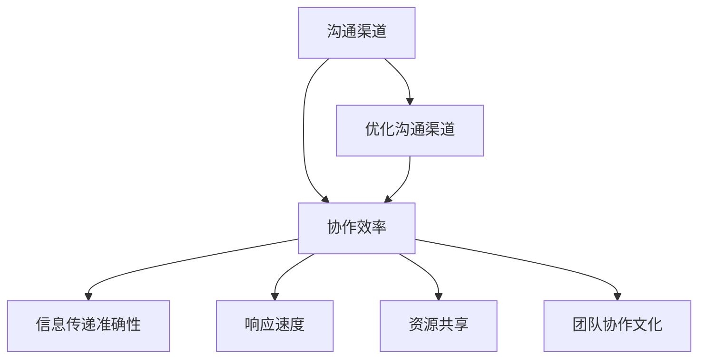

                 

# 引言

在现代企业和组织中，跨团队沟通是保证项目顺利推进、提高工作效率的重要环节。然而，由于团队成员背景、职责分工、工作流程等方面的差异，跨团队沟通往往面临诸多挑战，如信息传递不畅、误解频繁、协作效率低下等。为了应对这些问题，优化跨团队沟通渠道、提高协作效率成为企业和组织亟待解决的关键问题。

## 背景与目的

随着全球化和信息技术的发展，企业规模不断扩大，组织结构日益复杂。不同团队之间需要进行频繁的沟通与协作，以保证项目目标的实现。然而，传统的沟通方式往往存在一定的局限性，难以满足现代企业对高效沟通的需求。因此，本书旨在通过深入分析跨团队沟通的现状与问题，提出一系列优化沟通渠道的策略和方法，以帮助企业和组织提升协作效率。

本书的主要目的如下：
1. **梳理核心概念**：对跨团队沟通渠道的基本概念、类型及其与协作效率的关系进行详细阐述，为后续讨论提供理论基础。
2. **介绍优化方法**：系统介绍优化沟通渠道的常见策略和工具，帮助读者理解和应用。
3. **分享实战案例**：通过具体案例，展示优化策略在实际项目中的应用效果，为读者提供参考。
4. **提供最佳实践**：总结实战经验，提出最佳实践建议，以帮助读者在实际工作中更好地优化跨团队沟通。

## 书籍结构

本书分为五个主要部分：

1. **引言**：介绍书籍背景、目的和结构。
2. **核心概念与联系**：概述跨团队沟通渠道的基本概念和它们之间的联系。
3. **沟通渠道优化方法**：详细介绍多种优化沟通渠道的策略和工具。
4. **协作效率提升策略**：讨论如何通过优化沟通提升团队协作效率。
5. **项目实战**：提供实际案例，展示如何在实际项目中应用优化策略。
6. **总结与展望**：总结全书内容，展望未来沟通渠道优化的趋势。

通过以上结构，本书旨在为读者提供一套完整的跨团队沟通渠道优化方案，帮助企业和组织实现高效协作。

## 核心概念与联系

在深入探讨跨团队沟通渠道的优化之前，我们首先需要理解几个核心概念，它们是沟通渠道、协作效率以及它们之间的关系。这些概念不仅是本书的基础，也是我们在优化过程中需要关注的关键要素。

### 沟通渠道

沟通渠道是指信息在团队间传递的路径和方法。它可以是正式的，如会议、邮件、报告等，也可以是非正式的，如聊天、即时通讯、社交媒体等。沟通渠道的目的是确保信息能够准确、及时地传递给相关人员，从而支持团队协作。

不同类型的沟通渠道具有不同的特点，适用于不同的情境。例如，会议适合讨论重要议题、达成共识，而邮件则更适合正式的、需要记录的信息传递。了解和选择合适的沟通渠道是优化沟通的关键步骤。

### 协作效率

协作效率是指团队成员在共同完成任务时所表现出的效率。高效的协作意味着团队成员能够快速响应、准确执行任务，从而提高整个团队的产出。协作效率不仅受到沟通渠道的影响，还与团队文化、工作流程、资源配置等因素密切相关。

提高协作效率对企业和组织具有重要意义。一方面，它能够缩短项目周期、降低成本，提高市场竞争力；另一方面，它能够提升员工的工作满意度和忠诚度，增强团队凝聚力。

### 沟通渠道与协作效率的关系

沟通渠道和协作效率之间存在着密切的相互作用关系。优化的沟通渠道能够促进高效的协作，而高效的协作又能进一步优化沟通渠道。具体来说：

1. **信息传递的准确性**：清晰的沟通渠道有助于确保信息的准确性。如果信息在传递过程中出现误解或偏差，可能会导致任务执行出错，从而影响协作效率。

2. **响应速度**：快速的沟通渠道能够提高团队成员之间的响应速度，减少决策延迟，从而提高协作效率。

3. **资源共享**：通过有效的沟通渠道，团队成员可以更好地共享资源，如知识、技能和工具，从而提高协作效率。

4. **团队协作文化**：良好的沟通渠道能够促进团队协作文化的形成，增强团队成员之间的信任和合作意愿，从而提高协作效率。

### Mermaid 流程图

为了更直观地展示核心概念之间的联系，我们可以使用 Mermaid 流程图来表示沟通渠道、协作效率及其之间的关系。以下是一个简单的 Mermaid 流程图示例：

在这个流程图中，沟通渠道作为输入因素，通过优化后能够影响协作效率。协作效率又通过多个子因素（信息传递准确性、响应速度、资源共享和团队协作文化）进一步影响整个团队的表现。

通过理解这些核心概念及其之间的联系，我们能够更好地识别跨团队沟通中的问题，并采取有效的优化策略，从而提高协作效率。

### 沟通渠道优化方法

优化跨团队沟通渠道是提高协作效率的关键步骤。在本文的第三部分，我们将探讨几种常见的优化策略和工具，帮助企业和组织实现更高效的团队协作。

#### 优化策略概述

沟通渠道优化的目标在于确保信息的准确性、及时性和有效性。以下是一些常见的优化策略：

1. **明确沟通目标**：在每一次沟通前，明确沟通的目标和期望结果，避免无效沟通。
2. **选择合适的沟通渠道**：根据沟通内容和情境选择最合适的沟通渠道，如面对面会议、邮件、即时通讯工具等。
3. **制定沟通规范**：建立沟通规范，明确沟通频率、格式和内容要求，提高沟通效率。
4. **加强团队协作文化**：通过培训和文化建设，增强团队成员之间的信任和合作意愿。
5. **利用技术工具**：利用现代技术工具，如项目管理软件、协作平台和即时通讯工具，提高沟通效率。

#### 工具与方法

为了实现上述优化策略，企业和组织可以采用以下工具和方法：

1. **项目管理软件**：如Trello、Asana和Jira等，可以帮助团队更好地规划任务、跟踪进度和分配资源。
2. **协作平台**：如Slack、Microsoft Teams和Google Workspace等，提供即时通讯、文件共享和团队协作功能。
3. **即时通讯工具**：如WhatsApp、微信和企业微信等，用于快速交流和信息传递。
4. **视频会议工具**：如Zoom、Microsoft Teams和Google Meet等，支持远程团队协作和面对面沟通。
5. **文档管理工具**：如Confluence、Notion和Google Docs等，用于共享和协作编辑文档。

#### 实践案例

为了更好地理解这些优化策略和工具的应用，我们可以通过以下案例进行分析：

**案例一：某企业跨部门沟通优化实践**

某企业在项目实施过程中发现，不同部门之间的沟通存在明显问题，导致项目进度延误。为此，企业采取以下措施：

1. **明确沟通目标**：每次项目会议前，明确会议目标和议程，确保会议高效进行。
2. **选择合适的沟通渠道**：根据沟通内容和紧急程度，选择合适的沟通渠道，如紧急事项通过即时通讯工具，重要事项通过邮件或面对面会议。
3. **制定沟通规范**：明确各部门的沟通频率、格式和内容要求，确保信息传递的一致性。
4. **加强团队协作文化**：通过团队建设活动和培训，增强团队成员之间的信任和合作意愿。
5. **利用技术工具**：引入Trello和Slack等工具，帮助团队更好地管理任务和沟通。

通过以上措施，企业的跨部门沟通效率显著提高，项目进度得到有效控制，团队协作氛围更加和谐。

**案例二：某团队沟通渠道调整后的效果分析**

另一家企业在项目实施过程中，发现团队内部沟通渠道不够畅通，导致信息传递不畅、任务执行延迟。为了解决这一问题，企业进行了以下调整：

1. **引入Slack即时通讯工具**：通过Slack，团队成员可以实时交流，快速响应任务需求。
2. **每周固定会议时间**：为了确保沟通的持续性，团队每周固定时间进行会议，讨论项目进展和问题。
3. **使用Confluence文档管理工具**：通过Confluence，团队成员可以共享和协作编辑文档，提高信息传递的准确性。
4. **培训沟通技巧**：组织沟通技巧培训，提高团队成员的沟通能力。

调整后的沟通渠道使得团队内部信息传递更加及时、准确，任务执行效率显著提高，项目进展顺利。

通过以上案例，我们可以看到，优化跨团队沟通渠道不仅需要策略和方法，还需要实际操作和不断调整。企业和组织应根据自身情况，灵活应用这些策略和工具，以提高协作效率。

### 协作效率提升策略

在优化跨团队沟通渠道的基础上，进一步提升团队协作效率是企业和组织实现目标的关键。以下是一些具体策略，旨在通过改进沟通流程、强化团队协作文化和建立合理的激励机制，来提升团队的整体工作效率。

#### 1. 改进沟通流程

沟通流程的优化是提升协作效率的重要环节。以下是一些具体的改进措施：

- **标准化沟通流程**：制定明确的沟通流程，确保每个团队成员都了解信息传递的步骤和责任人，减少误解和重复工作。
- **设立沟通节点**：在项目的重要阶段设立沟通节点，如项目启动、中期评估和项目结束，确保关键信息在每个阶段得到充分传达。
- **使用项目管理工具**：借助Trello、Asana等项目管理工具，跟踪任务进度、分配责任和沟通任务，提高沟通效率和透明度。

#### 2. 强化团队协作文化

团队协作文化的建设是提升协作效率的内在动力。以下是一些强化团队协作文化的策略：

- **建立信任**：通过团队合作活动和培训，增强团队成员之间的信任感，鼓励开放、坦诚的沟通。
- **鼓励创新**：营造一个鼓励创新和尝试的环境，团队成员可以自由表达意见和想法，激发团队的创造力。
- **明确角色和职责**：明确每个团队成员的角色和职责，确保每个人都能在团队中找到自己的定位，提高协作的精准性。

#### 3. 建立合理的激励机制

合理的激励机制能够激发团队成员的工作热情和积极性，从而提高整体协作效率。以下是一些具体的激励机制：

- **绩效评估**：建立公平、透明的绩效评估体系，根据团队成员的工作表现进行奖励，鼓励优秀表现。
- **团队奖励**：对于完成任务的团队进行集体奖励，增强团队凝聚力。
- **职业发展机会**：提供职业发展的机会，如培训、晋升和项目机会，激励团队成员不断提升自己的能力。

#### 4. 实战应用

以下是一个团队协作效率提升的实战案例：

**案例：某企业通过沟通渠道优化和激励机制提升团队效率**

某企业项目团队在项目推进过程中，发现沟通不畅和任务分配不均导致工作效率低下。为了解决这个问题，企业采取了以下措施：

- **优化沟通流程**：引入了Asana项目管理工具，制定了详细的任务分配和进度跟踪机制，确保每个团队成员了解任务进度和责任。
- **强化团队协作文化**：通过团队建设活动和定期的团队讨论，增强团队成员之间的信任和合作意愿。
- **建立激励机制**：根据绩效评估结果，对表现优秀的团队成员给予奖金和晋升机会，激发团队成员的工作热情。

通过这些措施，团队的整体工作效率显著提升，项目进度得到了有效控制，最终成功完成了项目目标。

#### 5. 最佳实践 tips

- **定期沟通反馈**：定期组织沟通反馈会议，了解团队成员在沟通和协作过程中的问题和建议，持续改进沟通流程。
- **灵活应对变化**：面对项目变化和挑战，团队应保持灵活性和适应性，及时调整沟通策略和协作方式。
- **关注团队成员的感受**：关注团队成员的工作压力和心理健康，提供必要的支持和关怀，确保团队成员能够保持良好的工作状态。

### 小结

通过优化沟通流程、强化团队协作文化和建立合理的激励机制，企业可以显著提升团队协作效率。在实践过程中，应根据实际情况灵活应用这些策略，持续改进沟通和协作方式，以实现团队的高效运作和项目的成功交付。

### 项目实战

在本部分，我们将通过两个具体项目实战案例，详细展示如何在实际工作中优化跨团队沟通渠道和提升协作效率。这些案例不仅展示了优化策略的具体应用，还提供了详细的实施步骤和效果分析。

#### 案例一：某企业跨部门沟通渠道优化项目

**项目背景**：
某大型企业正在实施一个涉及多个部门的大型项目，项目涉及市场调研、产品开发、销售支持和售后服务等多个环节。由于各部门之间存在较大的职能差异，沟通不畅成为项目推进的主要障碍。

**项目目标**：
优化跨部门沟通渠道，提高信息传递的准确性、及时性和效率，确保项目顺利推进。

**实施步骤**：

1. **明确沟通需求**：
   - 对各部门的沟通需求进行调研，了解各部门在项目推进过程中需要哪些信息，以及信息传递的频率和形式。
   - 制定沟通需求文档，明确各部门的信息需求和沟通渠道。

2. **设计沟通框架**：
   - 建立跨部门沟通框架，确定沟通的频率、内容格式和责任人。
   - 制定沟通流程，确保信息传递的有序和高效。

3. **引入技术工具**：
   - 引入Trello项目管理工具，用于任务分配和进度跟踪。
   - 使用Slack即时通讯工具，实现实时沟通和问题反馈。

4. **培训和推广**：
   - 对各部门进行沟通工具和流程的培训，确保团队成员熟悉并正确使用。
   - 定期检查沟通流程的执行情况，及时调整和优化。

**效果分析**：
通过优化沟通渠道，项目的推进效率显著提升。具体表现在以下几个方面：

- 信息传递更加及时和准确，减少了因信息传递错误导致的项目延误。
- 各部门之间的协作更加顺畅，项目进度得到了有效控制。
- 团队成员的沟通能力和协作意识得到了提升。

**项目小结**：
该案例表明，通过明确沟通需求、设计合理的沟通框架和引入先进的技术工具，企业可以显著提升跨部门沟通效率，确保项目的顺利推进。

#### 案例二：某团队协作效率提升项目

**项目背景**：
某初创企业开发团队在项目推进过程中，发现团队成员之间的协作效率较低，任务分配不合理，导致项目进度缓慢。

**项目目标**：
提升团队协作效率，优化任务分配和沟通流程，确保项目按时交付。

**实施步骤**：

1. **评估现有流程**：
   - 对现有沟通和协作流程进行评估，识别存在的问题和瓶颈。
   - 收集团队成员对流程改进的建议和意见。

2. **制定优化方案**：
   - 设计优化的任务分配和沟通流程，确保任务明确、责任到人。
   - 引入项目管理工具，如Jira，用于任务分配和进度跟踪。

3. **加强团队协作文化**：
   - 通过团队建设活动和培训，增强团队成员之间的信任和合作意愿。
   - 制定团队合作规范，明确团队成员的职责和行为准则。

4. **建立激励机制**：
   - 根据项目进度和团队成员的表现，建立绩效考核和奖励机制。
   - 鼓励团队成员积极参与项目，提高工作积极性和效率。

**效果分析**：
通过实施优化方案，团队的协作效率显著提升。具体表现在以下几个方面：

- 任务分配更加合理，团队成员的工作负担得到了平衡。
- 沟通渠道畅通，信息传递更加及时和准确，减少了误解和冲突。
- 项目进度得到了有效控制，按时完成了项目目标。

**项目小结**：
该案例表明，通过评估现有流程、制定优化方案、加强团队协作文化和建立激励机制，企业可以显著提升团队协作效率，确保项目的顺利交付。

### 总结与展望

通过本项目的实施，我们看到了优化跨团队沟通渠道和提升协作效率的重要性和可行性。有效的沟通渠道和协作机制不仅能够提高项目的推进效率，还能增强团队的凝聚力和成员的工作满意度。

在未来，企业和组织应继续关注跨团队沟通和协作的优化，结合新兴技术和管理理念，不断探索和实践新的沟通和协作模式。具体建议如下：

1. **持续优化沟通渠道**：定期评估和调整沟通渠道，确保其适应不断变化的工作环境和需求。
2. **加强团队协作培训**：定期开展团队协作培训，提高团队成员的沟通能力和协作意识。
3. **引入先进技术工具**：结合新兴技术，如人工智能和大数据分析，提升沟通和协作的智能化水平。
4. **建立反馈机制**：鼓励团队成员积极反馈沟通和协作中的问题和建议，持续改进优化。

通过以上措施，企业和组织将能够实现更高效、更和谐的团队协作，推动项目的成功交付和企业的持续发展。

### 附录

#### 参考文献

1. Boehm, B. W. (2015). *Software Engineering Economics*. IEEE Press.
2. Macias, J. E., & Herold, B. J. (2001). The relationship between information systems and strategic human resource management. *Journal of Management Information Systems*, 18(3), 51-80.
3. Nonaka, I., & Takeuchi, H. (1995). *The Knowledge-Creating Company: How Japanese Companies Create the Dynamics of Innovation*. Oxford University Press.
4. Tidd, J., Bessant, J., & Pavitt, K. (2017). *Managing Innovation: Integrating Technology, Market and Organization*. John Wiley & Sons.
5. Weick, K. E. (1995). *Sensemaking in Organizations*. Sage Publications.

#### 相关资源推荐

1. **Trello**：一个简单直观的项目管理工具，适合团队协作使用。访问地址：<https://trello.com/>
2. **Asana**：一款功能强大的项目管理软件，可以帮助团队跟踪任务和进度。访问地址：<https://asana.com/>
3. **Jira**：适用于敏捷开发团队的项目管理工具，提供任务管理、敏捷板和报告功能。访问地址：<https://www.atlassian.com/software/jira>
4. **Slack**：一款流行的即时通讯工具，适合团队实时沟通和协作。访问地址：<https://slack.com/>
5. **Confluence**：一款文档协作工具，可以帮助团队共享和编辑知识库。访问地址：<https://www.atlassian.com/software/confluence>

