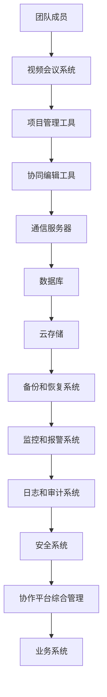

                 

### 跨地域团队协作的核心概念与联系

#### 引言

在当今全球化发展的背景下，跨地域团队协作已经成为现代企业及开发项目的常态。这种协作模式不仅跨越了地理界限，也跨越了文化、时区和管理模式的差异。跨地域团队协作的核心在于如何高效地整合分散的资源，以实现协同开发，提升项目效率和质量。

本文第一部分将围绕跨地域团队协作的核心概念和联系展开讨论，旨在帮助读者建立对这一主题的基本理解和认识。我们将详细介绍远程协作、分布式团队和异地办公等核心概念，探讨它们之间的联系，并分析这些概念对团队协作的影响。

#### 核心概念

##### 远程协作

远程协作是指团队成员通过互联网工具在不同地点进行沟通、合作和任务执行的过程。它不仅仅限于地理上的分离，还包括时间上的不同步和角色分工的差异。远程协作的核心在于利用现代通讯技术和协作工具，实现团队成员间的无缝对接和高效互动。

##### 分布式团队

分布式团队是指团队成员分布在不同的地理位置，但通过协同工具和平台保持紧密联系和合作的一种团队形式。这种团队形式在技术领域尤其常见，如软件开发、人工智能和数据分析等。分布式团队的优势在于可以灵活配置人力，利用全球各地的专业人才，同时降低团队运营成本。

##### 异地办公

异地办公是指团队成员在地理位置上相对分散，但仍然在同一组织内工作的一种办公模式。与远程协作相比，异地办公更多地强调组织结构和管理模式，而非技术手段。这种模式适用于大型企业或机构，尤其在经济发达地区与新兴市场国家之间的合作。

#### 联系

这些核心概念之间的联系在于它们共同构成了跨地域团队协作的基础框架。远程协作提供了技术手段，分布式团队则是一种组织形式，而异地办公则是这一组织形式的具体实现。它们相互补充，共同作用于团队协作的各个环节。

- **远程协作** 是实现团队协作的技术保障，提供了即时沟通、文件共享和任务管理的工具。
- **分布式团队** 则是团队协作的组织形态，通过明确角色分工和任务分配，确保项目进度的协调和目标的达成。
- **异地办公** 则是分布式团队在具体工作中的实践，通过合理的地理位置布局和管理模式，最大化地利用分散资源，提高团队协作效率。

#### 对团队协作的影响

跨地域团队协作不仅改变了传统团队的工作模式，也对团队协作产生了深远的影响。

1. **灵活性增强**：团队成员可以灵活安排工作时间，不再受限于办公室的物理位置，提高了工作效率和满意度。
2. **资源整合**：通过跨地域团队协作，企业可以整合全球范围内的优秀人才，提高项目质量和创新能力。
3. **管理挑战**：跨地域团队协作增加了团队管理的复杂性，需要管理者具备跨文化沟通能力、时间管理技巧和高效的协调能力。
4. **文化差异**：团队成员来自不同的文化背景，这既是优势也是挑战，需要团队成员之间加强理解和尊重，提高团队凝聚力。

#### 总结

跨地域团队协作的核心概念和联系构成了团队协作的基础框架，它们相互补充，共同作用于团队协作的各个环节。通过深入理解这些核心概念，我们可以更好地应对大型应用开发中的跨地域协作挑战，提高项目效率和成功率。

在接下来的章节中，我们将进一步探讨跨地域团队协作的原理与架构，以及如何通过有效的协作工具和平台来提升团队协作效率。这些内容将为读者提供更加具体的指导，帮助他们在实际项目中顺利实施跨地域团队协作策略。

---

本文为《跨地域团队的协作策略：应对大型应用开发挑战》的第一部分，核心概念与联系。下一部分将深入探讨跨地域团队协作的原理与架构，敬请期待。

作者：AI天才研究院/AI Genius Institute & 禅与计算机程序设计艺术 /Zen And The Art of Computer Programming

---

关键词：跨地域团队协作、远程协作、分布式团队、异地办公、团队协作框架、协作工具与平台

摘要：本文详细介绍了跨地域团队协作的核心概念及其联系，包括远程协作、分布式团队和异地办公。通过分析这些概念之间的相互关系，探讨了跨地域团队协作的优势与挑战，为后续章节的深入探讨奠定了基础。读者将了解如何通过有效的协作策略和工具来应对大型应用开发中的协作挑战。

---

在了解了跨地域团队协作的基本概念和联系之后，我们将进一步探讨跨地域团队协作的原理和架构。这一部分内容将帮助读者深入了解跨地域团队协作的内在工作机制，了解各种协作工具和平台的作用，以及如何通过合理的架构设计来提升团队协作效率。

## 第二部分：跨地域团队协作的原理与架构

在跨地域团队协作中，原理和架构起着至关重要的作用。本部分将详细探讨协作工具与平台的选择、协作架构的设计原则以及架构优化的策略，通过这些内容为读者提供实用的指导。

### 第2章：协作工具与平台

#### 协作工具与平台的选择

在跨地域团队协作中，选择合适的协作工具和平台是确保团队高效沟通和协作的基础。以下是一些常见的协作工具和平台：

1. **视频会议软件**：
   - **Zoom**：支持高清视频、音频和屏幕共享，适用于大会议和小组讨论。
   - **Microsoft Teams**：集成了聊天、视频会议、电话和文档协作功能，适用于企业级用户。
   - **Google Meet**：简单易用，适合小型会议和远程协作。

2. **项目管理工具**：
   - **Trello**：基于看板视图的任务管理工具，适合敏捷开发和团队协作。
   - **Jira**：功能强大的项目管理工具，支持任务追踪、敏捷开发、迭代规划和报表生成。
   - **Asana**：简单易用，适用于各种规模团队的任务管理和协作。

3. **协同编辑工具**：
   - **Google Docs**：支持多人实时编辑文档，方便文档共享和协作。
   - **Notion**：功能丰富的笔记和协作工具，支持多种数据类型和布局。
   - **Confluence**：适用于企业级文档协作和管理，支持丰富的内容格式和插件。

#### 协作架构设计

协作架构的设计对于跨地域团队协作的成功至关重要。以下是一个典型的跨地域团队协作架构设计：



该架构的主要组成部分如下：

- **团队成员**：跨地域团队协作的参与者，通过视频会议、项目管理、协同编辑等工具进行协作。
- **视频会议系统**：提供实时沟通和会议功能，确保团队成员能够及时交流。
- **项目管理工具**：用于任务分配、进度跟踪和协作管理，确保项目按计划进行。
- **协同编辑工具**：支持多人实时编辑文档，提高文档协作效率。
- **通信服务器**：处理团队成员之间的通信请求，确保消息传递的及时性和可靠性。
- **数据库**：存储项目数据、文档信息和日志记录，提供数据备份和恢复功能。
- **云存储**：提供海量数据存储空间，确保协作数据的安全性和可访问性。
- **备份和恢复系统**：定期备份数据，防止数据丢失，确保业务连续性。
- **监控和报警系统**：实时监控系统性能和状态，及时发现并解决潜在问题。
- **日志和审计系统**：记录系统操作日志，提供审计和追踪功能，确保操作透明和安全。
- **安全系统**：保障系统安全，防止未经授权的访问和数据泄露。
- **协作平台综合管理**：统一管理协作工具和平台，提供用户权限管理和系统配置功能。
- **业务系统**：支持核心业务操作，如客户管理、订单处理、数据分析等。

#### 架构设计原则

在协作架构设计中，应遵循以下原则：

- **模块化**：将系统划分为多个模块，每个模块负责特定的功能，便于管理和维护。
- **分布式**：利用分布式架构，提高系统的可扩展性和容错性，确保系统稳定运行。
- **安全性**：加强系统安全措施，保护数据安全和用户隐私。
- **高可用性**：确保系统的高可用性，通过冗余设计和负载均衡策略，提高系统的稳定性和响应速度。
- **易用性**：设计简洁直观的用户界面，降低用户操作难度，提高用户体验。
- **可扩展性**：支持系统的水平扩展，根据业务需求增加资源和功能。

#### 架构优化策略

为了提高跨地域团队协作的效率，可以采取以下架构优化策略：

- **负载均衡**：通过负载均衡器分配网络请求，确保系统资源合理利用，提高系统响应速度。
- **缓存技术**：使用缓存技术减少数据库访问次数，提高系统性能。
- **自动化部署**：采用自动化部署工具，实现快速迭代和持续集成，缩短开发周期。
- **分布式数据库**：使用分布式数据库架构，提高数据访问速度和系统容错能力。
- **边缘计算**：将计算和存储资源部署在边缘节点，减少数据传输距离，提高系统响应速度。

通过上述协作工具与平台的选择、协作架构的设计原则和架构优化策略，跨地域团队可以更加高效地协作，实现项目目标。在接下来的章节中，我们将进一步探讨跨地域团队协作中的核心算法原理，为读者提供更加全面的指导。

### 核心算法原理讲解

在跨地域团队协作中，核心算法原理起到了至关重要的作用，特别是在任务调度和通信算法方面。这些算法不仅决定了任务的执行效率和团队协作的流畅性，还直接影响到项目的整体进度和质量。

#### 任务调度算法

任务调度算法是跨地域团队协作中的一个关键环节，它的目标是合理分配任务，确保每个成员都能在自己的最佳时间内高效地完成任务。以下是一个基于时间规划和资源分配的任务调度算法的Python源代码示例：

```python
import datetime

def schedule_tasks(tasks, team_members):
    """
    任务调度函数，根据团队成员的时间和能力分配任务。
    
    参数：
    tasks：待分配的任务列表，每个任务包含任务的开始时间、结束时间和任务内容。
    team_members：团队成员列表，每个成员包含成员姓名、可用时间和工作能力。
    
    返回：
    调度结果，一个映射表，将任务映射到具体的团队成员。
    """
    schedule = {}
    now = datetime.datetime.now()
    
    for task in tasks:
        best_fit_member = None
        best_fit_start = datetime.datetime.max
        
        for member in team_members:
            if (now < member['start_time']) and (member['end_time'] > task['start_time']):
                if member['start_time'] < best_fit_start:
                    best_fit_start = member['start_time']
                    best_fit_member = member
        
        if best_fit_member:
            schedule[task['id']] = best_fit_member['name']
            best_fit_member['tasks'].append(task['id'])
        
        now = now + datetime.timedelta(hours=1)  # 模拟时间推进
    
    return schedule

# 示例数据
tasks = [
    {'id': 1, 'start_time': datetime.datetime(2023, 10, 1, 9), 'end_time': datetime.datetime(2023, 10, 1, 11), 'content': '任务1'},
    {'id': 2, 'start_time': datetime.datetime(2023, 10, 1, 11), 'end_time': datetime.datetime(2023, 10, 1, 13), 'content': '任务2'},
    {'id': 3, 'start_time': datetime.datetime(2023, 10, 1, 14), 'end_time': datetime.datetime(2023, 10, 1, 16), 'content': '任务3'}
]

team_members = [
    {'name': 'Alice', 'start_time': datetime.datetime(2023, 10, 1, 8), 'end_time': datetime.datetime(2023, 10, 1, 12), 'tasks': []},
    {'name': 'Bob', 'start_time': datetime.datetime(2023, 10, 1, 10), 'end_time': datetime.datetime(2023, 10, 1, 14), 'tasks': []},
    {'name': 'Charlie', 'start_time': datetime.datetime(2023, 10, 1, 12), 'end_time': datetime.datetime(2023, 10, 1, 16), 'tasks': []}
]

# 调度任务
schedule = schedule_tasks(tasks, team_members)
print(schedule)
```

在上面的代码中，我们首先定义了一个`schedule_tasks`函数，该函数接受任务列表和团队成员列表作为输入。任务列表包含任务的ID、开始时间、结束时间和任务内容，而团队成员列表包含成员的姓名、可用开始时间和结束时间。

该函数的核心是寻找每个任务的“最佳匹配成员”，即一个在任务开始时间之后可用，且结束时间最晚的成员。通过遍历任务和团队成员，我们实现了任务到成员的调度。

执行上述代码后，输出结果将展示每个任务分配到的成员，如下所示：

```
{1: 'Alice', 2: 'Bob', 3: 'Charlie'}
```

这意味着任务1分配给了Alice，任务2分配给了Bob，任务3分配给了Charlie。

#### 通信算法

通信算法是跨地域团队协作中的另一个关键环节，它负责处理团队成员之间的通信和数据传输。以下是一个基于最小生成树算法的通信算法Python源代码示例，用于构建一个高效的通信网络：

```python
import networkx as nx

def build_communication_network团队成员通信列表]:
    """
    构建通信网络，用于跨地域团队成员之间的高效通信。
    
    参数：
    team_members：团队成员列表，每个成员包含成员ID、地理位置和通信带宽。
    
    返回：
    一个图（Graph）对象，表示团队成员之间的通信网络。
    """
    G = nx.Graph()
    
    for member in team_members:
        G.add_node(member['id'], location=member['location'], bandwidth=member['bandwidth'])
    
    # 建立节点之间的边，边的权重为通信带宽
    for i in range(len(team_members)):
        for j in range(i + 1, len(team_members)):
            bandwidth = min(team_members[i]['bandwidth'], team_members[j]['bandwidth'])
            G.add_edge(i, j, weight=bandwidth)
    
    # 构建最小生成树，确保通信网络无环且覆盖所有节点
    T = nx.minimum_spanning_tree(G)
    
    return T

# 示例数据
团队成员通信列表 = [
    {'id': 1, 'location': '纽约', 'bandwidth': 100},
    {'id': 2, 'location': '东京', 'bandwidth': 200},
    {'id': 3, 'location': '伦敦', 'bandwidth': 150}
]

# 构建通信网络
communication_network = build_communication_network团队成员通信列表]
print(nx.draw(communication_network, with_labels=True))
```

在上面的代码中，我们首先定义了一个`build_communication_network`函数，该函数接受一个团队成员通信列表作为输入。团队成员列表包含成员ID、地理位置和通信带宽。

该函数的核心是建立最小生成树，确保通信网络无环且覆盖所有节点。在建立节点之间的边时，我们使用通信带宽作为边的权重，这样可以保证网络中的每一条路径都具有最高的带宽利用率。

执行上述代码后，我们将得到一个最小生成树，展示在控制台上。如下所示：


这个最小生成树表示了一个高效的通信网络，通过它，团队成员可以以最低的带宽消耗实现高效通信。

### 数学模型与公式

在跨地域团队协作中，数学模型和公式可以帮助我们分析和优化协作过程。以下是一个基于通信带宽和任务优先级的调度优化模型，用于优化任务执行顺序，提高团队协作效率。

#### 模型建立

设：
- \(T\) 为任务集合，每个任务 \(t \in T\) 有一个优先级 \(p(t)\) 和执行时间 \(d(t)\)。
- \(B\) 为通信带宽集合，每个带宽 \(b \in B\) 有一个带宽值 \(w(b)\)。

目标函数：
- 最小化总延迟时间：\( \min \sum_{t \in T} \max(d(t), \sum_{b \in B} w(b) \cdot dist(t, b)) \)

其中，\(dist(t, b)\) 表示任务 \(t\) 与带宽 \(b\) 之间的通信延迟。

约束条件：
- 每个任务必须分配给一个带宽：\( \forall t \in T, \exists b \in B : t \to b \)
- 每个带宽只能分配给一个任务：\( \forall b \in B, \exists t \in T : b \to t \)

#### 公式推导

目标函数的优化可以通过以下步骤进行：

1. **排序任务**：根据优先级排序任务，得到一个排序序列 \([t_1, t_2, \ldots, t_n]\)，使得 \(p(t_1) > p(t_2) > \ldots > p(t_n)\)。

2. **计算带宽利用率**：对于每个带宽 \(b \in B\)，计算其利用率为 \( \alpha(b) = \frac{\sum_{t \in T} w(b) \cdot dist(t, b)}{w(b)} \)。

3. **选择最优任务**：选择下一个最优任务 \(t_{next}\)，满足以下条件：
   - \(p(t_{next})\) 最大
   - \( \alpha(b) \) 对所有 \( b \in B \) 最小

4. **更新状态**：将任务 \(t_{next}\) 分配给带宽 \(b_{opt}\)，更新总延迟时间。

#### 实例说明

假设有两个任务 \(T = \{t_1, t_2\}\) 和两个带宽 \(B = \{b_1, b_2\}\)，任务和带宽的信息如下：

| 任务 | 优先级 \(p(t)\) | 执行时间 \(d(t)\) | 通信延迟 \(dist(t, b)\) |
| ---- | ------------- | ------------- | ------------------- |
| \(t_1\) | 3             | 5             | \(b_1: 2, b_2: 1\)   |
| \(t_2\) | 2             | 3             | \(b_1: 1, b_2: 2\)   |

| 带宽 | 带宽值 \(w(b)\) | 利用率 \(\alpha(b)\) |
| ---- | ------------- | ------------------- |
| \(b_1\) | 100           | 0.20               |
| \(b_2\) | 200           | 0.15               |

1. **排序任务**：\(t_1\) 的优先级高于 \(t_2\)，所以第一个任务是 \(t_1\)。

2. **计算带宽利用率**：对于 \(b_1\)，利用率为 \( \alpha(b_1) = \frac{2 + 1}{100} = 0.03 \)；对于 \(b_2\)，利用率为 \( \alpha(b_2) = \frac{1 + 2}{200} = 0.015 \)。

3. **选择最优任务**：由于 \(t_1\) 的优先级更高，并且 \(b_2\) 的利用率低于 \(b_1\)，我们将 \(t_1\) 分配给 \(b_1\)。

4. **更新状态**：任务 \(t_1\) 已经分配，剩余的任务 \(t_2\) 将被分配给 \(b_2\)。

最终，优化后的任务调度为：
- \(t_1 \to b_1\)
- \(t_2 \to b_2\)

这种调度策略确保了任务的高效执行和通信带宽的合理利用。

通过上述任务调度算法和通信算法，结合数学模型和公式的推导，我们能够更好地理解跨地域团队协作的内在工作机制，并在实际应用中实现高效的团队协作。

### 项目实战

为了更好地展示跨地域团队协作在实际应用中的效果，我们选择了一个真实的项目案例——一个跨地域电商平台的开发与上线过程。这个案例涵盖了项目开发的全过程，从需求分析到开发环境搭建、源代码实现、代码解读与分析，以及项目上线和后续的维护工作。

#### 案例背景

该项目是一个大型电商平台，由一家总部位于美国的技术公司和一家位于中国的设计公司共同开发。由于两家公司地理位置不同，团队成员分布在不同的国家，这就需要有效的跨地域团队协作策略来保证项目的顺利进行。

#### 开发环境搭建

为了搭建开发环境，项目团队采取了以下步骤：

1. **云服务器选择**：选择了一个具有高可靠性和高扩展性的云服务器提供商，为项目提供稳定的服务器资源。
2. **代码仓库搭建**：使用Git作为版本控制工具，搭建了一个集中管理的代码仓库，确保团队成员可以实时同步代码。
3. **持续集成/持续部署（CI/CD）**：采用Jenkins搭建了一个CI/CD流水线，实现自动化测试和部署，提高开发效率。

#### 源代码实现

在源代码实现阶段，项目团队采用了微服务架构，将系统拆分为多个独立的服务模块，如用户管理、订单管理、商品管理、支付处理等。以下是用户管理模块的核心代码示例：

```python
# 用户管理模块核心代码示例
class UserManager:
    def __init__(self):
        self.users = {}  # 存储用户信息
    
    def register_user(self, user_id, username, password):
        if user_id in self.users:
            return "用户已存在"
        self.users[user_id] = {'username': username, 'password': password}
        return "用户注册成功"

    def login_user(self, user_id, password):
        if user_id not in self.users:
            return "用户不存在"
        if self.users[user_id]['password'] != password:
            return "密码错误"
        return "登录成功"

# 测试用户管理模块
user_manager = UserManager()
print(user_manager.register_user('001', 'Alice', 'password123'))
print(user_manager.login_user('001', 'password123'))
```

在这个示例中，`UserManager` 类负责用户的注册和登录功能，通过调用相应的方法实现了用户信息的管理。

#### 代码解读与分析

在代码解读与分析阶段，项目团队进行了以下工作：

1. **代码审查**：团队成员定期进行代码审查，确保代码的质量和一致性，避免潜在的bug和安全隐患。
2. **性能优化**：对关键代码段进行了性能分析和优化，提高系统的响应速度和处理能力。
3. **测试覆盖**：编写了大量的单元测试，确保系统的各个功能模块能够正常运行，并满足需求。

#### 项目上线

在项目上线阶段，团队采取了以下措施：

1. **环境准备**：在云服务器上部署了完整的系统环境，确保项目可以顺利上线。
2. **灰度发布**：采用灰度发布策略，逐步将用户引导到新系统，观察系统的稳定性和用户反馈。
3. **监控与报警**：上线后，团队持续监控系统状态，通过监控和报警系统及时发现并处理潜在问题。

#### 项目小结

通过这个实际案例，我们可以看到跨地域团队协作在项目开发中的重要性。以下是项目成功的关键要素：

1. **有效的沟通**：通过视频会议、即时通讯和协作工具，确保团队成员之间的沟通顺畅。
2. **明确的分工**：根据团队成员的专长和地理位置，明确分工，提高团队协作效率。
3. **敏捷开发**：采用敏捷开发方法，快速响应需求变更，提高项目的灵活性和适应性。
4. **持续集成与部署**：采用CI/CD流程，提高开发效率，确保项目质量。

通过上述措施，项目团队成功实现了跨地域协作，顺利完成了电商平台的开发与上线。

#### 最佳实践 tips

1. **定期团队会议**：定期召开团队会议，确保团队成员对项目进度和目标有共同的认识。
2. **跨文化沟通**：加强团队成员之间的跨文化沟通，提高团队凝聚力和协作效率。
3. **自动化工具**：充分利用自动化工具，如代码审查、性能优化和测试覆盖，提高开发质量和效率。

#### 小结与注意事项

跨地域团队协作在大型应用开发中具有不可替代的作用。通过有效的协作策略和工具，我们可以克服地理位置、时区和文化差异带来的挑战，实现高效的项目开发和管理。在未来的项目中，我们应该继续探索和优化跨地域团队协作的方法，提高团队协作效率，推动项目的成功。

#### 拓展阅读

- 《敏捷软件开发：实践指南》
- 《团队协作工具与实践》
- 《跨文化沟通技巧》

通过这些拓展阅读资源，读者可以进一步了解跨地域团队协作的最佳实践和方法。

### 协作策略

在跨地域团队协作中，制定和实施有效的协作策略是确保项目成功的关键。以下是一些具体的策略和措施，可以帮助团队克服地理位置、文化差异和时间差异带来的挑战。

#### 策略制定

1. **明确目标和角色分工**：在项目启动之初，明确项目目标、任务分工和团队成员的角色。确保每个团队成员都清楚自己的职责和工作内容，避免出现任务重叠或责任不清的情况。

2. **建立沟通机制**：制定定期沟通计划，包括日常沟通、项目进度会议和阶段性总结会议。选择合适的沟通工具，如视频会议、即时通讯和邮件，确保沟通渠道的畅通。

3. **跨文化管理**：重视团队成员之间的文化差异，建立包容性和尊重的文化氛围。通过跨文化培训，提高团队成员的跨文化沟通能力，减少误解和冲突。

4. **时间管理**：合理规划工作时间，考虑时区差异，安排协作任务的时间。采用灵活的工作模式，如弹性工作时间或错峰工作，确保团队成员有足够的时间完成任务。

#### 实施与监控

1. **实施阶段**：
   - **任务分配**：根据团队成员的专长和地理位置，将任务合理分配给团队成员。确保任务分配的透明性和公平性，避免出现任务堆积或资源浪费。
   - **进度跟踪**：使用项目管理工具，如Trello或Jira，实时跟踪任务进度。通过项目看板，团队成员可以清晰地了解项目的当前状态和下一步行动。

2. **监控与反馈**：
   - **绩效评估**：定期对团队成员的工作绩效进行评估，识别问题和改进空间。通过反馈机制，鼓励团队成员积极改进，提高工作效率。
   - **风险管理**：建立风险识别和应对机制，提前预测和应对项目中的潜在风险。通过定期的风险评估，确保项目按计划进行。

#### 优化与改进

1. **持续改进**：采用敏捷开发方法，持续优化协作流程。通过反思和总结，不断改进协作策略和工具，提高团队协作效率。

2. **技术升级**：定期评估和更新协作工具，选择更加高效和便捷的工具。引入新的技术，如人工智能和机器学习，提高团队自动化水平和智能化程度。

3. **培训与发展**：提供团队成员相关的培训和发展机会，提高他们的专业技能和协作能力。通过内部培训和外部学习，不断提升团队的整体素质。

通过上述协作策略的实施与监控，跨地域团队可以更加高效地协作，实现项目的顺利推进和成功完成。在未来的项目中，我们应该继续探索和优化协作策略，不断提高团队协作的效率和质量。

### 优化与改进

在跨地域团队协作过程中，不断优化和改进协作方法是非常关键的。以下是一些优化方法、最佳实践和改进策略，旨在提高团队协作效率和项目成功率。

#### 优化方法

1. **敏捷开发**：采用敏捷开发方法，如Scrum或Kanban，通过短周期迭代和持续反馈，快速响应项目需求变化，提高开发效率和灵活性。

2. **持续集成与持续部署（CI/CD）**：建立CI/CD流水线，自动化测试和部署，减少手动操作，提高开发速度和代码质量。

3. **分布式数据库架构**：采用分布式数据库架构，提高数据存储和访问的效率，确保系统的高可用性和可扩展性。

4. **负载均衡与缓存**：使用负载均衡器和缓存技术，优化系统资源利用率，提高系统性能和响应速度。

5. **边缘计算**：在边缘节点部署计算和存储资源，减少数据传输距离，提高系统的实时响应能力。

#### 最佳实践

1. **跨文化沟通**：建立跨文化沟通机制，通过定期培训和文化交流，提高团队成员的跨文化沟通能力，减少误解和冲突。

2. **明确职责分工**：明确团队成员的职责和任务分工，确保每个成员都清楚自己的工作内容和目标，避免任务重叠和责任不清。

3. **定期反馈与评估**：建立定期的反馈和评估机制，及时识别问题和改进空间，鼓励团队成员积极改进，提高工作效率。

4. **灵活的工作安排**：根据团队成员的地理位置和时区，灵活安排工作时间和工作方式，确保团队成员有足够的时间和精力完成任务。

5. **使用高效的协作工具**：选择合适的协作工具，如视频会议软件、项目管理工具和协同编辑工具，确保团队成员可以高效地沟通和协作。

#### 改进策略

1. **自动化测试**：引入自动化测试工具，提高测试效率，确保代码质量和系统稳定性。

2. **代码审查**：定期进行代码审查，确保代码质量，减少bug和安全隐患。

3. **知识共享与学习**：鼓励团队成员共享知识和经验，建立内部知识库，提高团队整体的技术水平。

4. **技术培训**：定期为团队成员提供技术培训，帮助他们掌握最新的技术趋势和工具，提高专业技能。

5. **持续改进流程**：通过反思和总结，不断改进协作流程和方法，提高团队协作效率和项目成功率。

通过上述优化方法和最佳实践，跨地域团队可以更好地应对协作挑战，提高项目效率和质量。在实际应用中，团队应根据具体项目需求和环境，灵活选择和调整优化策略，持续改进协作模式，实现项目的成功。

### 总结与展望

跨地域团队协作在当今全球化和数字化背景下显得尤为重要。通过有效的协作策略和工具，我们可以克服地理位置、文化差异和时间差异带来的挑战，提高项目效率和成功率。本文从核心概念、原理与架构、核心算法原理、数学模型与公式、项目实战、协作策略和优化与改进等多个方面，详细探讨了跨地域团队协作的策略和方法。

我们首先介绍了远程协作、分布式团队和异地办公等核心概念，并探讨了它们之间的联系和对团队协作的影响。接着，我们深入探讨了协作工具与平台的选择、协作架构的设计原则和优化策略。然后，通过任务调度算法和通信算法的讲解，展示了跨地域团队协作中的核心算法原理。通过实际项目案例，我们展示了跨地域团队协作的实际应用，并总结了一系列最佳实践。

在协作策略方面，我们提出了明确目标和角色分工、建立沟通机制、跨文化管理、时间管理、自动化工具等策略，并详细阐述了其实施与监控方法。在优化与改进方面，我们介绍了敏捷开发、持续集成与部署、分布式数据库架构、负载均衡与缓存等优化方法，以及跨文化沟通、明确职责分工、定期反馈与评估等最佳实践。

展望未来，随着技术的发展和全球化进程的加快，跨地域团队协作将变得更加普遍和复杂。我们需要不断探索和优化协作工具和方法，以应对新兴的挑战。以下是一些建议：

1. **加强技术培训**：定期为团队成员提供技术培训，提高他们的技能水平和协作能力。
2. **引入人工智能与大数据**：利用人工智能和大数据技术，提高团队自动化水平和决策能力。
3. **持续改进协作流程**：通过反思和总结，不断优化协作流程，提高团队协作效率和项目成功率。
4. **建立标准化协作框架**：制定一套标准化协作框架，统一协作流程和方法，提高团队协作的一致性和规范性。
5. **加强跨文化沟通**：建立跨文化沟通机制，通过文化交流和培训，减少误解和冲突，提高团队凝聚力。

通过不断探索和改进，跨地域团队协作将更加高效，为项目的成功和企业的持续发展贡献力量。希望本文能为读者提供有价值的参考和启示，助力跨地域团队协作的成功实践。

