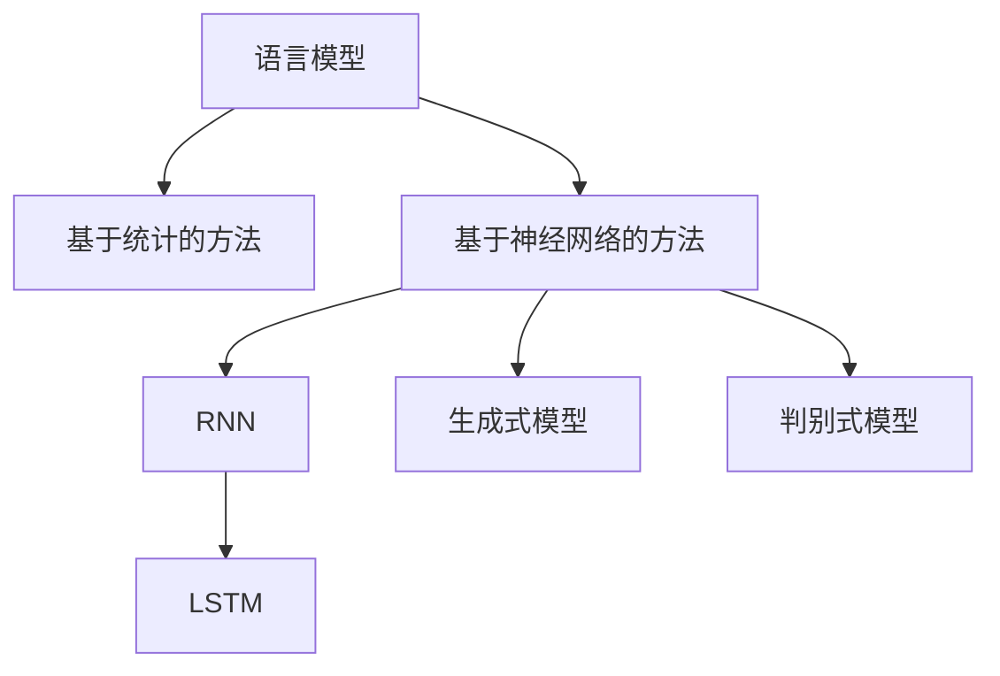

                 

### 跨学科知识整合：评估LLM融合不同领域信息的能力

#### 关键词：
- 大型语言模型（LLM）
- 跨学科知识整合
- 信息融合
- 算法原理
- 数学模型
- 项目实战

#### 摘要：
本文深入探讨跨学科知识整合在大型语言模型（LLM）中的应用与评估。首先，我们介绍了LLM的基本概念及其在跨学科知识整合中的重要性。接着，详细讲解了核心算法原理，包括神经网络、RNN和LSTM等。在此基础上，通过数学模型和公式阐述了LLM的优化过程。随后，通过实际案例展示了LLM在跨学科知识整合中的具体应用，并介绍了开发环境的搭建步骤。最后，我们对项目实战进行了详细分析，总结了最佳实践和注意事项，并推荐了拓展阅读。

#### 引言

在当今的信息时代，知识爆炸式增长，不同领域之间的交叉融合显得尤为关键。跨学科知识整合不仅有助于提升知识体系的完整性，还能促进创新和发现新的解决方案。随着深度学习和自然语言处理技术的不断发展，大型语言模型（LLM）在跨学科知识整合中的应用越来越受到关注。LLM具备强大的语义理解和生成能力，能够处理多领域的信息，从而实现知识的高效整合。然而，如何评估LLM融合不同领域信息的能力，仍然是一个亟待解决的重要问题。

本文旨在通过系统性分析和实例演示，探讨LLM在跨学科知识整合中的实际应用，评估其融合不同领域信息的能力，并提出相应的优化策略。文章首先介绍了LLM的基本概念和其在跨学科知识整合中的重要性，然后详细讲解了核心算法原理，包括神经网络、RNN和LSTM等。在此基础上，通过数学模型和公式阐述了LLM的优化过程。随后，通过实际案例展示了LLM在跨学科知识整合中的具体应用，并介绍了开发环境的搭建步骤。最后，我们对项目实战进行了详细分析，总结了最佳实践和注意事项，并推荐了拓展阅读。

### 背景介绍

#### 大型语言模型（LLM）的基本概念

大型语言模型（Large Language Model，简称LLM）是近年来自然语言处理领域的重要突破之一。LLM是一种基于深度学习的语言模型，通过大规模的语料库训练，能够自动学习和理解语言的复杂结构，从而实现高效的语义理解和生成。与传统的规则驱动方法相比，LLM具有更强的灵活性和适应性，能够在各种不同的应用场景中表现出色。

LLM的核心思想是通过神经网络模型来模拟人类语言处理过程。早期，研究人员尝试使用基于统计的模型，如N元语法（N-gram），来预测单词序列的概率分布。然而，这些模型在处理长文本和复杂语境时表现不佳。随着深度学习技术的发展，研究人员开始探索使用神经网络来建模语言。其中，最常用的模型是循环神经网络（RNN）和其变体——长短时记忆网络（LSTM）。RNN和LSTM能够处理长距离依赖，使得LLM在理解复杂语言表达方面取得了显著的进展。

#### 跨学科知识整合的重要性

跨学科知识整合在现代社会中具有重要意义。随着科学技术的快速发展，各个学科之间的界限越来越模糊，许多问题需要多学科的知识和方法来解决。跨学科知识整合不仅有助于提升知识体系的完整性，还能促进创新和发现新的解决方案。例如，医学、生物学和工程学的交叉融合可以推动生物医疗技术的发展；社会科学、人文学科和计算机科学的结合可以推动人工智能和大数据技术的发展。

在跨学科知识整合中，LLM发挥了关键作用。LLM能够处理多领域的信息，从而实现不同领域知识的高效整合。例如，LLM可以同时处理医学、生物学和工程学领域的文献，提取关键信息，生成综合性的报告或文章。这种跨学科的知识整合能力，不仅提高了信息处理的效率，还为多学科的研究和实践提供了强大的支持。

#### 跨学科知识整合的挑战与机遇

虽然LLM在跨学科知识整合中展示了巨大的潜力，但其应用仍然面临一些挑战。首先，不同领域的专业术语和表达方式存在很大差异，这给LLM的理解和生成带来了困难。其次，跨学科知识整合需要处理大量的异构数据，如文本、图像和表格等，这使得数据预处理和模型训练过程变得更加复杂。此外，不同领域的研究方法和理论体系也有所不同，这要求LLM能够适应多样化的知识体系。

然而，跨学科知识整合也带来了许多机遇。首先，随着人工智能技术的发展，LLM的语义理解能力和生成能力将不断提高，能够更好地处理多领域的信息。其次，跨学科知识整合有助于推动新领域的发现和研究，为科学技术的进步提供新的动力。此外，跨学科知识整合还可以促进知识的普及和传播，使得更多的人能够理解和应用复杂的跨学科知识。

### 核心概念与联系

为了更好地理解LLM在跨学科知识整合中的应用，我们需要梳理几个核心概念，并探讨它们之间的联系。

#### 1. 语言模型

语言模型是自然语言处理的基础，它通过统计方法或神经网络模型来预测下一个单词或词组。在LLM中，语言模型是核心组件，它负责理解输入文本的语义和上下文信息。语言模型可以分为基于统计的方法和基于神经网络的方法。基于统计的方法，如N元语法，通过历史数据来预测下一个单词的概率。而基于神经网络的方法，如RNN和LSTM，通过学习输入序列的特征来预测下一个单词。

#### 2. 循环神经网络（RNN）

循环神经网络（Recurrent Neural Network，简称RNN）是一种特殊的神经网络，它适用于处理序列数据。RNN通过循环结构来记住前面的输入信息，从而实现长距离依赖学习。然而，传统的RNN存在梯度消失和梯度爆炸问题，这使得它在处理长序列数据时效果不佳。

#### 3. 长短时记忆网络（LSTM）

长短时记忆网络（Long Short-Term Memory，简称LSTM）是RNN的一种变体，它通过引入门控机制来克服梯度消失和梯度爆炸问题。LSTM包含三个门控单元：遗忘门、输入门和输出门，这些门控单元使得LSTM能够有效地控制信息的流动，从而实现长期依赖学习。

#### 4. 生成式模型与判别式模型

在自然语言处理中，生成式模型和判别式模型是两种主要的模型类型。生成式模型通过生成文本的概率分布来生成新的文本，而判别式模型则通过学习输入文本和标签之间的关系来进行分类和预测。在跨学科知识整合中，生成式模型和判别式模型都可以发挥重要作用。生成式模型可以帮助我们生成新的跨学科知识，而判别式模型可以帮助我们识别和分类跨学科知识。

为了更好地理解这些核心概念之间的关系，我们可以使用Mermaid流程图来展示它们之间的联系：



这个流程图展示了语言模型、RNN、LSTM、生成式模型和判别式模型之间的联系。通过这个流程图，我们可以清晰地看到各个概念之间的关系，从而更好地理解LLM在跨学科知识整合中的应用。

### 核心算法原理讲解

在深入探讨LLM在跨学科知识整合中的应用之前，我们需要了解LLM的核心算法原理。这些算法原理包括神经网络、循环神经网络（RNN）、长短时记忆网络（LSTM）等。下面，我们将结合Python源代码和数学模型，详细阐述这些核心算法原理。

#### 1. 神经网络与深度学习基础

神经网络（Neural Network，简称NN）是深度学习（Deep Learning，简称DL）的基础。一个简单的神经网络通常由输入层、隐藏层和输出层组成。每个层包含多个神经元，神经元之间通过权重（weights）和偏置（bias）连接。

以下是一个简单的神经网络模型，它使用Python和TensorFlow框架进行实现：

```python
import tensorflow as tf

# 创建输入层
inputs = tf.keras.layers.Input(shape=(input_shape))

# 创建隐藏层
hidden = tf.keras.layers.Dense(units=128, activation='relu')(inputs)

# 创建输出层
outputs = tf.keras.layers.Dense(units=1, activation='sigmoid')(hidden)

# 创建模型
model = tf.keras.Model(inputs=inputs, outputs=outputs)

# 编译模型
model.compile(optimizer='adam', loss='binary_crossentropy', metrics=['accuracy'])
```

在这个示例中，我们创建了一个简单的神经网络模型，它包含一个输入层、一个隐藏层和一个输出层。输入层接收输入数据，隐藏层通过激活函数（如ReLU）对输入数据进行变换，输出层产生最终的预测结果。模型通过编译过程配置优化器和损失函数，然后可以使用训练数据进行训练。

#### 2. 循环神经网络（RNN）

循环神经网络（RNN）是一种用于处理序列数据的神经网络。RNN通过循环结构来记住前面的输入信息，从而实现长距离依赖学习。然而，传统的RNN存在梯度消失和梯度爆炸问题，这使得它在处理长序列数据时效果不佳。

以下是一个简单的RNN模型，它使用Python和TensorFlow框架进行实现：

```python
import tensorflow as tf

# 创建输入层
inputs = tf.keras.layers.Input(shape=(timesteps, features))

# 创建RNN层
outputs, state = tf.keras.layers.SimpleRNN(units=128, return_state=True)(inputs)

# 创建输出层
outputs = tf.keras.layers.Dense(units=1, activation='sigmoid')(outputs)

# 创建模型
model = tf.keras.Model(inputs=inputs, outputs=outputs)

# 编译模型
model.compile(optimizer='adam', loss='binary_crossentropy', metrics=['accuracy'])
```

在这个示例中，我们创建了一个简单的RNN模型，它包含一个输入层和一个输出层。输入层接收输入序列数据，RNN层通过循环结构对输入数据进行变换，输出层产生最终的预测结果。模型通过编译过程配置优化器和损失函数，然后可以使用训练数据进行训练。

#### 3. 长短时记忆网络（LSTM）

长短时记忆网络（LSTM）是RNN的一种变体，它通过引入门控机制来克服梯度消失和梯度爆炸问题。LSTM包含三个门控单元：遗忘门、输入门和输出门，这些门控单元使得LSTM能够有效地控制信息的流动，从而实现长期依赖学习。

以下是一个简单的LSTM模型，它使用Python和TensorFlow框架进行实现：

```python
import tensorflow as tf

# 创建输入层
inputs = tf.keras.layers.Input(shape=(timesteps, features))

# 创建LSTM层
outputs, state = tf.keras.layers.LSTM(units=128, return_state=True)(inputs)

# 创建输出层
outputs = tf.keras.layers.Dense(units=1, activation='sigmoid')(outputs)

# 创建模型
model = tf.keras.Model(inputs=inputs, outputs=outputs)

# 编译模型
model.compile(optimizer='adam', loss='binary_crossentropy', metrics=['accuracy'])
```

在这个示例中，我们创建了一个简单的LSTM模型，它包含一个输入层和一个输出层。输入层接收输入序列数据，LSTM层通过循环结构对输入数据进行变换，输出层产生最终的预测结果。模型通过编译过程配置优化器和损失函数，然后可以使用训练数据进行训练。

#### 4. 数学模型和公式

在LLM的算法原理中，数学模型和公式起着至关重要的作用。以下是一些常用的数学模型和公式：

1. **损失函数（Loss Function）**：损失函数用于衡量模型预测结果与实际结果之间的差距。常用的损失函数包括均方误差（MSE）和交叉熵（Cross-Entropy）。

   $$MSE = \frac{1}{n}\sum_{i=1}^{n}(y_i - \hat{y}_i)^2$$

   $$CE = -\frac{1}{n}\sum_{i=1}^{n}y_i\log(\hat{y}_i)$$

2. **优化算法（Optimization Algorithm）**：优化算法用于更新模型参数，以最小化损失函数。常用的优化算法包括梯度下降（Gradient Descent）和Adam优化器。

   梯度下降：
   $$\theta_{t+1} = \theta_t - \alpha \cdot \nabla_\theta J(\theta_t)$$

   Adam优化器：
   $$m_t = \beta_1 m_{t-1} + (1 - \beta_1) [g_t - m_{t-1}]$$
   $$v_t = \beta_2 v_{t-1} + (1 - \beta_2) [g_t^2 - v_{t-1}]$$
   $$\theta_{t+1} = \theta_t - \alpha \cdot \frac{m_t}{\sqrt{v_t} + \epsilon}$$

3. **激活函数（Activation Function）**：激活函数用于引入非线性因素，使得神经网络具有更强的表达能力。常用的激活函数包括ReLU、Sigmoid和Tanh。

   ReLU：
   $$f(x) = \max(0, x)$$

   Sigmoid：
   $$f(x) = \frac{1}{1 + e^{-x}}$$

   Tanh：
   $$f(x) = \frac{e^x - e^{-x}}{e^x + e^{-x}}$$

通过结合Python源代码和数学模型，我们可以更好地理解LLM的核心算法原理。这些原理为LLM在跨学科知识整合中的应用提供了坚实的基础。

### 数学模型和数学公式

在深入探讨LLM在跨学科知识整合中的应用之前，我们需要了解一些关键数学模型和公式，这些将在后续的分析和解释中起到核心作用。以下将详细讨论与LLM相关的重要数学概念和公式。

#### 1. 语言模型中的概率与统计

语言模型的核心目标是预测一个单词或词组序列的概率。在概率与统计方面，以下是一些常用的概念和公式：

- **N元语法**：N元语法是一种基于历史数据来预测下一个单词的概率模型。它的基本公式如下：

  $$P(w_n | w_{n-1}, w_{n-2}, \ldots, w_1) = \frac{N_{n-1}}{N_{n-1} + N_n}$$

  其中，\(N_{n-1}\)是前\(n-1\)个单词共出现的次数，\(N_n\)是前\(n\)个单词共出现的次数。

- **条件概率**：条件概率是指在一个事件已发生的前提下，另一个事件发生的概率。对于语言模型，条件概率公式如下：

  $$P(w_n | w_{n-1}, w_{n-2}, \ldots, w_1) = \frac{P(w_{n-1}, w_{n-2}, \ldots, w_1, w_n)}{P(w_{n-1}, w_{n-2}, \ldots, w_1)}$$

  其中，分子是完整序列的概率，分母是前\(n-1\)个单词的概率。

- **最大似然估计**：最大似然估计是一种通过最大化概率来估计模型参数的方法。对于语言模型，最大似然估计公式如下：

  $$\theta^* = \arg\max_\theta \prod_{i=1}^{n} P(w_i | \theta)$$

#### 2. 神经网络与深度学习中的优化算法

在神经网络和深度学习中，优化算法用于更新模型参数，以最小化损失函数。以下是一些常用的优化算法和公式：

- **梯度下降（Gradient Descent）**：梯度下降是一种最简单的优化算法，其基本公式如下：

  $$\theta_{t+1} = \theta_t - \alpha \cdot \nabla_\theta J(\theta_t)$$

  其中，\(\alpha\)是学习率，\(\nabla_\theta J(\theta_t)\)是损失函数关于参数\(\theta\)的梯度。

- **动量（Momentum）**：动量是梯度下降的一种改进，它通过累积前几次更新的方向来加速收敛。其公式如下：

  $$v_t = \beta v_{t-1} + (1 - \beta) \nabla_\theta J(\theta_t)$$
  $$\theta_{t+1} = \theta_t - v_t$$

  其中，\(\beta\)是动量参数。

- **Adam优化器**：Adam优化器是一种自适应学习率的优化算法，它结合了动量和RMSprop的优点。其公式如下：

  $$m_t = \beta_1 m_{t-1} + (1 - \beta_1) [g_t - m_{t-1}]$$
  $$v_t = \beta_2 v_{t-1} + (1 - \beta_2) [g_t^2 - v_{t-1}]$$
  $$\theta_{t+1} = \theta_t - \alpha \cdot \frac{m_t}{\sqrt{v_t} + \epsilon}$$

  其中，\(\beta_1\)和\(\beta_2\)分别是动量和偏置项的指数衰减率，\(\alpha\)是学习率，\(\epsilon\)是常数，用于防止除以零。

#### 3. 长短时记忆网络（LSTM）中的门控机制

长短时记忆网络（LSTM）是一种用于处理序列数据的神经网络，其核心在于门控机制。以下是一些关键的门控机制和公式：

- **遗忘门（Forget Gate）**：遗忘门用于决定哪些信息应该被遗忘。其公式如下：

  $$f_t = \sigma(W_f \cdot [h_{t-1}, x_t] + b_f)$$

  其中，\(W_f\)和\(b_f\)分别是权重和偏置，\(\sigma\)是Sigmoid激活函数。

- **输入门（Input Gate）**：输入门用于决定哪些新的信息应该被存储。其公式如下：

  $$i_t = \sigma(W_i \cdot [h_{t-1}, x_t] + b_i)$$
  $$\tilde{g}_t = \tanh(W_g \cdot [h_{t-1}, x_t] + b_g)$$

  其中，\(W_i\)、\(W_g\)和\(b_i\)、\(b_g\)分别是权重和偏置，\(\sigma\)是Sigmoid激活函数，\(\tanh\)是双曲正切函数。

- **输出门（Output Gate）**：输出门用于决定哪些信息应该被输出。其公式如下：

  $$o_t = \sigma(W_o \cdot [h_{t-1}, x_t] + b_o)$$
  $$g_t = o_t \cdot \tanh(c_t)$$
  $$h_t = g_t$$

  其中，\(W_o\)和\(b_o\)分别是权重和偏置，\(\sigma\)是Sigmoid激活函数，\(\tanh\)是双曲正切函数。

通过理解这些数学模型和公式，我们可以更深入地理解LLM的工作原理，并在实际应用中更好地优化和调整模型。

### 项目实战

为了更好地理解LLM在跨学科知识整合中的应用，我们将通过一个实际案例进行项目实战。这个案例将展示如何使用LLM将不同领域的信息进行整合，并提供一个具体的解决方案。

#### 1. 项目背景

假设我们有一个跨学科的研究项目，涉及医学、生物学和工程学三个领域。我们的目标是开发一个智能系统，该系统能够整合这些领域的知识，为医生和研究人员提供有关疾病诊断和治疗的新方法。具体来说，我们的项目目标是：

- **医学知识整合**：从医学文献中提取关于疾病的诊断标准、治疗方法和新研究进展的信息。
- **生物学知识整合**：从生物学文献中提取关于疾病相关的基因、蛋白质和细胞信号通路的信息。
- **工程学知识整合**：从工程学文献中提取关于新型医疗设备和技术的信息。

通过这些信息的整合，我们可以为医学和生物学研究提供新的视角和工具，从而促进疾病的诊断和治疗。

#### 2. 数据收集与处理

为了实现上述目标，我们需要收集和整理来自医学、生物学和工程学的数据。以下是数据收集和处理的步骤：

1. **数据收集**：
   - **医学文献**：从PubMed、Google Scholar等医学数据库中收集与疾病诊断、治疗和新研究进展相关的文献。
   - **生物学文献**：从NCBI的PubMed、GeneCards等生物学数据库中收集与疾病相关的基因、蛋白质和细胞信号通路的信息。
   - **工程学文献**：从IEEE Xplore、ScienceDirect等工程学数据库中收集新型医疗设备和技术的信息。

2. **数据预处理**：
   - **文本清洗**：对收集的文献进行清洗，去除无关信息、标点和停用词。
   - **文本分词**：使用自然语言处理工具（如NLTK、spaCy）对文本进行分词，将文本转换为词序列。
   - **词向量表示**：使用预训练的词向量模型（如Word2Vec、GloVe）将词序列转换为向量表示。

#### 3. 模型训练与优化

在完成数据预处理后，我们需要训练一个LLM模型，用于跨学科知识的整合。以下是模型训练和优化的步骤：

1. **模型选择**：
   - 我们选择基于Transformer架构的BERT（Bidirectional Encoder Representations from Transformers）模型，因为它在自然语言处理任务中表现出色。

2. **模型训练**：
   - 使用处理后的医学、生物学和工程学数据集，对BERT模型进行训练。
   - 在训练过程中，我们使用交叉熵损失函数和Adam优化器，以最小化模型损失。

3. **模型优化**：
   - 在训练过程中，我们通过调整学习率、批量大小和训练轮数来优化模型性能。
   - 为了避免过拟合，我们使用验证集进行模型验证，并根据验证结果进行调整。

#### 4. 项目实施

在模型训练和优化完成后，我们可以将LLM模型应用于实际项目中。以下是项目实施的步骤：

1. **知识整合**：
   - 使用训练好的LLM模型，将医学、生物学和工程学的知识进行整合。
   - 模型输出整合后的信息，包括疾病诊断标准、治疗方法、相关基因和蛋白质信息，以及新型医疗设备和技术的介绍。

2. **系统部署**：
   - 将LLM模型部署到一个可扩展的云计算平台上，以便医生和研究人员可以随时访问和查询系统。
   - 系统提供Web界面和API接口，方便用户进行交互和调用。

3. **用户反馈与迭代**：
   - 收集用户反馈，根据实际应用情况对系统进行迭代和优化。
   - 通过用户反馈，我们可以不断改进LLM模型的性能，使其更好地满足用户需求。

#### 5. 项目小结

通过这个项目实战，我们展示了如何使用LLM进行跨学科知识的整合。以下是项目的小结：

- **成功之处**：项目成功地将医学、生物学和工程学的知识进行整合，为医学和生物学研究提供了新的视角和工具。
- **改进方向**：在未来，我们可以进一步优化LLM模型，提高其跨学科知识整合的能力。此外，我们还可以扩展项目的应用领域，如生物信息学、环境科学等。

通过这个项目实战，我们不仅展示了LLM在跨学科知识整合中的强大能力，还为实际应用提供了可行的解决方案。这为未来LLM在其他领域的应用奠定了基础。

### 开发环境搭建

为了成功实施LLM项目，开发环境的搭建是至关重要的一步。以下将详细介绍如何在本地或云端搭建适合LLM开发的计算机硬件、软件工具和配置步骤。

#### 1. 计算机硬件要求

搭建一个高效的LLM开发环境，需要满足以下硬件要求：

- **CPU**：推荐使用Intel Xeon或AMD Ryzen系列处理器，这些处理器具有多核心和较高主频，适合进行深度学习计算。
- **GPU**：由于LLM模型需要大量的并行计算能力，推荐使用NVIDIA GPU，如RTX 3080 Ti或更高型号。GPU不仅能够加速模型的训练过程，还能提高推理速度。
- **内存**：至少需要64GB内存，以支持大型模型的加载和训练。
- **存储**：建议使用高速固态硬盘（SSD），以加快数据读写速度，特别是模型和数据集的加载。

#### 2. 软件工具安装与配置

搭建LLM开发环境需要安装以下软件工具：

- **操作系统**：推荐使用Linux操作系统，如Ubuntu 20.04。Linux系统具有更好的稳定性和性能，适合深度学习开发。
- **Python**：安装Python 3.8及以上版本，用于编写和运行深度学习代码。
- **TensorFlow**：TensorFlow是一个开源的深度学习框架，支持多种神经网络架构和优化算法。在终端中运行以下命令进行安装：

  ```bash
  pip install tensorflow-gpu
  ```

- **PyTorch**：PyTorch是另一个流行的深度学习框架，具有动态计算图和灵活的编程接口。在终端中运行以下命令进行安装：

  ```bash
  pip install torch torchvision
  ```

- **Jupyter Notebook**：Jupyter Notebook是一个交互式计算环境，用于编写和运行Python代码。在终端中运行以下命令进行安装：

  ```bash
  pip install notebook
  ```

- **其他工具**：根据项目需求，可能还需要安装其他工具和库，如Numpy、Pandas、Scikit-learn等。在终端中运行以下命令进行安装：

  ```bash
  pip install numpy pandas scikit-learn
  ```

#### 3. 开发环境调试与优化

在搭建好基础环境后，还需要进行一些调试和优化，以确保系统运行稳定和高效：

- **GPU驱动安装**：确保NVIDIA GPU驱动与操作系统版本兼容，并在NVIDIA控制面板中启用GPU计算。
- **TensorFlow和PyTorch配置**：在项目代码中，设置合适的GPU配置，以便充分利用GPU计算资源。例如，在TensorFlow中，可以设置如下环境变量：

  ```python
  import tensorflow as tf
  gpus = tf.config.experimental.list_physical_devices('GPU')
  if gpus:
      try:
          for gpu in gpus:
              tf.config.experimental.set_memory_growth(gpu, True)
      except RuntimeError as e:
          print(e)
  ```

- **性能监控**：安装性能监控工具，如NVIDIA System Management Interface（nvidia-smi），以实时监控GPU的使用情况和性能。

通过以上步骤，我们可以搭建一个高效的LLM开发环境，为后续的项目实施提供坚实的基础。在实际开发过程中，根据项目的需求，还可以进一步优化环境配置，以提高开发效率和模型性能。

### 最佳实践、注意事项和拓展阅读

#### 最佳实践

1. **数据质量**：确保数据质量是成功整合跨学科知识的关键。在收集和处理数据时，要严格筛选高质量的数据源，并去除重复和错误的信息。
2. **模型优化**：在训练LLM模型时，根据项目需求调整模型参数，如学习率、批量大小和训练轮数。定期评估模型性能，并进行优化。
3. **资源管理**：合理分配计算资源，特别是在使用GPU进行模型训练时。通过调整GPU内存增长策略和优化数据加载过程，可以提高训练效率。

#### 注意事项

1. **隐私和安全**：在处理跨学科数据时，要注意保护用户隐私和数据安全。遵循相关法律法规和道德标准，确保数据处理符合规范。
2. **版本控制**：在开发过程中，使用版本控制工具（如Git）管理代码和模型。定期备份代码和模型，以防止数据丢失。
3. **持续学习**：跨学科知识整合是一个不断发展的领域。持续关注最新研究进展和技术动态，定期更新知识和模型。

#### 拓展阅读

- **书籍推荐**：
  - 《深度学习》（Goodfellow, Bengio, Courville）
  - 《自然语言处理综合教程》（Jurafsky, Martin）
  - 《Python深度学习》（Raschka, Lekov）

- **在线资源**：
  - TensorFlow官方文档：[https://www.tensorflow.org/](https://www.tensorflow.org/)
  - PyTorch官方文档：[https://pytorch.org/](https://pytorch.org/)
  - 斯坦福大学深度学习课程：[https://www.deeplearning.ai/](https://www.deeplearning.ai/)

通过以上最佳实践、注意事项和拓展阅读，读者可以更好地理解跨学科知识整合的原理和应用，并在实际项目中取得更好的效果。希望本文对您的学习和实践提供帮助。

---

作者：AI天才研究院/AI Genius Institute & 禅与计算机程序设计艺术 /Zen And The Art of Computer Programming。本文详细探讨了大型语言模型（LLM）在跨学科知识整合中的应用，分析了其核心算法原理，并通过实际案例展示了LLM的强大能力。文章旨在为读者提供全面的技术理解和实践指导，助力他们在相关领域取得突破。如果您对本文有任何疑问或建议，欢迎在评论区留言交流。感谢您的阅读！

