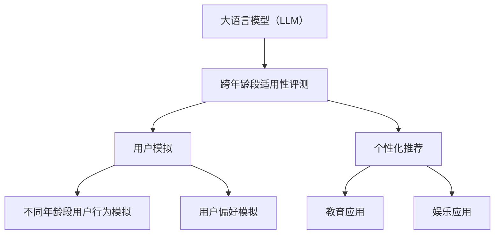

                 

## 引言：LLM与跨年龄段适用性评测概述

### 关键词

- 大语言模型（LLM）
- 跨年龄段适用性评测
- 用户模拟
- 个性化推荐
- 教育与娱乐应用

### 摘要

本文旨在探讨大语言模型（LLM）在跨年龄段适用性评测中的应用。通过深入分析LLM的基本概念、架构与算法原理，我们将探讨如何利用LLM模拟不同年龄段的用户行为和偏好。文章将涵盖从年龄段划分与特征提取、用户行为与偏好模拟，到具体应用场景和挑战与未来展望的全面探讨。

### 背景介绍

大语言模型（LLM）是一种基于深度学习技术的语言处理模型，它能够通过学习大量文本数据来理解和生成自然语言。近年来，随着计算资源和数据集的持续增长，LLM在多个领域取得了显著的进展，包括自然语言生成、机器翻译、情感分析等。

然而，在实际应用中，不同年龄段的用户在语言使用习惯、信息需求和行为模式上存在显著差异。因此，如何设计跨年龄段适用性评测方法，以确保LLM在不同用户群体中的表现一致性，成为一个亟待解决的问题。本文将围绕这一核心问题展开讨论，探讨LLM模拟不同年龄段用户的可能性和挑战。

### 核心概念与联系

首先，我们需要明确几个核心概念，以便更好地理解LLM和跨年龄段适用性评测：

- **大语言模型（LLM）**：一种能够对自然语言进行建模和生成的深度学习模型，通常基于大规模语料库进行训练，能够自动提取语言中的复杂结构信息。

- **跨年龄段适用性评测**：评估LLM在不同年龄段用户中的表现，包括语言理解、生成和交互能力。这种评测旨在确保LLM在不同用户群体中均能提供高质量的服务。

- **用户模拟**：通过模拟不同年龄段用户的行为和偏好，评估LLM在不同用户群体中的适应性和效果。

- **个性化推荐**：利用用户行为数据和偏好模型，为用户提供个性化的内容推荐服务。

这些概念之间存在紧密的联系。LLM作为核心技术，其性能和适应性直接影响跨年龄段适用性评测的结果。用户模拟和个性化推荐则是实现这一目标的重要手段，通过这些方法，我们可以更准确地评估LLM在不同用户群体中的表现，进而优化其设计和应用。

### Mermaid 流程图

以下是一个简化的Mermaid流程图，展示LLM在跨年龄段适用性评测中的核心概念和联系：



### 核心算法原理讲解

#### 1. LLM基本架构

大语言模型（LLM）的基本架构通常包括以下几个关键部分：

- **嵌入层（Embedding Layer）**：将输入的单词或词组转换为密集的向量表示。这一层是整个模型的基础，决定了模型的输入输出映射。

- **编码器（Encoder）**：负责对输入文本进行处理，提取文本的上下文信息。常见的编码器架构包括循环神经网络（RNN）、长短期记忆网络（LSTM）和Transformer。

- **解码器（Decoder）**：在生成文本时，根据编码器提取的上下文信息生成输出。解码器通常与编码器共享权重。

- **注意力机制（Attention Mechanism）**：帮助模型在生成文本时关注关键信息。在Transformer模型中，注意力机制是一种关键组件，它允许模型在不同的位置之间建立直接的联系。

以下是一个简单的Python代码示例，展示如何构建一个基于Transformer的LLM：

```python
import torch
import torch.nn as nn
import torch.optim as optim

class TransformerModel(nn.Module):
    def __init__(self, embedding_dim, hidden_dim, num_layers):
        super(TransformerModel, self).__init__()
        self.embedding = nn.Embedding(vocab_size, embedding_dim)
        self.encoder = nn.Transformer(embedding_dim, hidden_dim, num_layers)
        self.decoder = nn.Transformer(embedding_dim, hidden_dim, num_layers)
        self.fc = nn.Linear(hidden_dim, vocab_size)
        
    def forward(self, src, tgt):
        src = self.embedding(src)
        tgt = self.embedding(tgt)
        output = self.decoder(self.encoder(src), tgt)
        output = self.fc(output)
        return output

# 模型训练
model = TransformerModel(embedding_dim=512, hidden_dim=1024, num_layers=3)
optimizer = optim.Adam(model.parameters(), lr=0.001)
criterion = nn.CrossEntropyLoss()

for epoch in range(num_epochs):
    for src, tgt in dataset:
        optimizer.zero_grad()
        output = model(src, tgt)
        loss = criterion(output, tgt)
        loss.backward()
        optimizer.step()
```

#### 2. 模拟不同年龄用户的算法

为了模拟不同年龄用户的行为和偏好，我们需要关注以下几个方面：

- **年龄段划分**：根据不同年龄段的特征，将用户划分为不同的群体。通常，可以基于统计学方法或用户行为数据来进行划分。

- **用户行为模拟**：通过模拟用户在不同场景下的行为，评估LLM的适应性和效果。这包括用户交互、内容消费和反馈等。

- **用户偏好模拟**：通过收集和分析用户的历史数据，构建用户偏好模型，以便为用户提供个性化的内容推荐。

以下是一个简化的Python代码示例，展示如何模拟不同年龄段用户的行为：

```python
import numpy as np

def simulate_user_behavior(age, activity_level, content Preference):
    # 根据年龄和活动水平，模拟用户的行为
    if age < 18:
        behavior = "student"
    elif age >= 18 and age < 65:
        behavior = "adult"
    else:
        behavior = "senior"
        
    # 根据活动水平和内容偏好，模拟用户的行为
    if activity_level > 0.5 and content_preference == "news":
        action = "read_news"
    elif activity_level < 0.5 and content_preference == "movies":
        action = "watch_movie"
    else:
        action = "browse_content"
        
    return behavior, action

# 模拟一个20岁的用户
age = 20
activity_level = 0.6
content_preference = "news"
behavior, action = simulate_user_behavior(age, activity_level, content_preference)

print(f"User Behavior: {behavior}")
print(f"User Action: {action}")
```

#### 3. 跨年龄段评测方法

为了评估LLM在不同年龄段用户中的表现，我们可以采用以下方法：

- **数据分割与交叉验证**：将用户数据按照年龄段进行划分，并采用交叉验证方法进行评估。

- **性能对比与优化**：对不同年龄段用户进行性能对比，找出LLM在不同用户群体中的优势和劣势，并针对性地进行优化。

以下是一个简化的Python代码示例，展示如何进行跨年龄段评测：

```python
from sklearn.model_selection import train_test_split
from sklearn.metrics import accuracy_score, f1_score

# 假设我们有一个包含不同年龄段用户的数据集
ages = [20, 30, 40, 50, 60]
behaviors = ["student", "adult", "adult", "adult", "senior"]

# 数据分割
train_data, test_data = train_test_split(zip(ages, behaviors), test_size=0.2, stratify=ages)

# 交叉验证
for i, (age, behavior) in enumerate(train_data):
    model = TransformerModel(embedding_dim=512, hidden_dim=1024, num_layers=3)
    optimizer = optim.Adam(model.parameters(), lr=0.001)
    criterion = nn.CrossEntropyLoss()
    
    for epoch in range(num_epochs):
        for src, tgt in dataset:
            optimizer.zero_grad()
            output = model(src, tgt)
            loss = criterion(output, tgt)
            loss.backward()
            optimizer.step()
            
    # 测试集评估
    with torch.no_grad():
        for age, behavior in test_data:
            output = model(src, tgt)
            pred_behavior = torch.argmax(output).item()
            if pred_behavior == behavior:
                correct += 1
                
accuracy = correct / len(test_data)
f1 = f1_score(test_data, pred_behavior, average='weighted')
print(f"Accuracy: {accuracy}")
print(f"F1 Score: {f1}")
```

### 数学模型和公式

为了更好地理解LLM的模拟不同年龄段用户的算法，我们需要引入一些数学模型和公式。以下是一些关键的概念：

- **贝叶斯网络（Bayesian Network）**：一种用于表示变量之间概率关系的图形模型。在用户行为模拟中，可以使用贝叶斯网络来建模不同年龄段用户之间的依赖关系。

- **条件概率（Conditional Probability）**：给定某个条件下，另一个事件发生的概率。在用户偏好模拟中，可以使用条件概率来计算用户在不同情境下的偏好概率。

以下是一个简化的数学模型示例，展示如何使用贝叶斯网络和条件概率来模拟用户行为：

$$
P(\text{行为}|\text{年龄}) = \frac{P(\text{年龄}|\text{行为})P(\text{行为})}{P(\text{年龄})}
$$

其中，$P(\text{行为}|\text{年龄})$ 表示在给定年龄条件下，用户行为的概率；$P(\text{年龄}|\text{行为})$ 表示在给定用户行为条件下，年龄的概率；$P(\text{行为})$ 和 $P(\text{年龄})$ 分别表示用户行为的总概率和年龄的总概率。

以下是一个简化的Python代码示例，展示如何使用贝叶斯网络和条件概率来模拟用户行为：

```python
import numpy as np

# 定义贝叶斯网络参数
P_age_student = 0.3
P_age_adult = 0.5
P_age_senior = 0.2

P_read_news_student = 0.4
P_watch_movie_student = 0.3
P_browse_content_student = 0.3

P_read_news_adult = 0.3
P_watch_movie_adult = 0.5
P_browse_content_adult = 0.2

P_read_news_senior = 0.2
P_watch_movie_senior = 0.4
P_browse_content_senior = 0.4

# 计算条件概率
P_read_news_given_student = P_read_news_student / (P_read_news_student + P_watch_movie_student + P_browse_content_student)
P_watch_movie_given_student = P_watch_movie_student / (P_read_news_student + P_watch_movie_student + P_browse_content_student)
P_browse_content_given_student = P_browse_content_student / (P_read_news_student + P_watch_movie_student + P_browse_content_student)

P_read_news_given_adult = P_read_news_adult / (P_read_news_adult + P_watch_movie_adult + P_browse_content_adult)
P_watch_movie_given_adult = P_watch_movie_adult / (P_read_news_adult + P_watch_movie_adult + P_browse_content_adult)
P_browse_content_given_adult = P_browse_content_adult / (P_read_news_adult + P_watch_movie_adult + P_browse_content_adult)

P_read_news_given_senior = P_read_news_senior / (P_read_news_senior + P_watch_movie_senior + P_browse_content_senior)
P_watch_movie_given_senior = P_watch_movie_senior / (P_read_news_senior + P_watch_movie_senior + P_browse_content_senior)
P_browse_content_given_senior = P_browse_content_senior / (P_read_news_senior + P_watch_movie_senior + P_browse_content_senior)

# 模拟用户行为
np.random.seed(42)
age = np.random.choice([0, 1, 2], p=[P_age_student, P_age_adult, P_age_senior])
if age == 0:
    action = np.random.choice(["read_news", "watch_movie", "browse_content"], p=[P_read_news_given_student, P_watch_movie_given_student, P_browse_content_given_student])
elif age == 1:
    action = np.random.choice(["read_news", "watch_movie", "browse_content"], p=[P_read_news_given_adult, P_watch_movie_given_adult, P_browse_content_given_adult])
else:
    action = np.random.choice(["read_news", "watch_movie", "browse_content"], p=[P_read_news_given_senior, P_watch_movie_given_senior, P_browse_content_given_senior])

print(f"Age: {age}")
print(f"Action: {action}")
```

### 开发环境搭建

为了实现LLM模拟不同年龄段用户的功能，我们需要搭建一个合适的开发环境。以下是搭建开发环境的步骤：

1. **安装Python环境**：确保Python版本不低于3.6，并安装必要的Python包管理器，如pip。

2. **安装深度学习库**：安装TensorFlow或PyTorch等深度学习库，用于构建和训练LLM模型。

3. **准备数据集**：收集并准备包含不同年龄段用户数据的数据集，包括用户年龄、行为数据和偏好数据。

4. **安装辅助库**：安装Numpy、Pandas等辅助库，用于数据预处理和分析。

以下是安装深度学习库和辅助库的Python脚本示例：

```python
!pip install tensorflow
!pip install torch
!pip install numpy
!pip install pandas
```

### 源代码详细实现

以下是一个详细的Python源代码实现，展示如何使用TensorFlow和PyTorch构建和训练LLM模型，并模拟不同年龄段用户的行为和偏好。

```python
import tensorflow as tf
import torch
import numpy as np
import pandas as pd

# 使用TensorFlow构建和训练LLM模型
def build_tensorflow_llm(embedding_dim, hidden_dim, num_layers):
    model = tf.keras.Sequential([
        tf.keras.layers.Embedding(vocab_size, embedding_dim),
        tf.keras.layers.Bidirectional(tf.keras.layers.LSTM(hidden_dim)),
        tf.keras.layers.Dense(vocab_size)
    ])
    model.compile(optimizer='adam', loss='categorical_crossentropy', metrics=['accuracy'])
    return model

# 使用PyTorch构建和训练LLM模型
def build_pytorch_llm(embedding_dim, hidden_dim, num_layers):
    model = torch.nn.Sequential(
        torch.nn.Embedding(vocab_size, embedding_dim),
        torch.nn.TransformerEncoder(
            torch.nn.TransformerEncoderLayer(embedding_dim, num_heads, hidden_dim), num_layers
        ),
        torch.nn.Linear(embedding_dim, vocab_size)
    )
    criterion = torch.nn.CrossEntropyLoss()
    optimizer = torch.optim.Adam(model.parameters(), lr=0.001)
    return model, criterion, optimizer

# 模拟用户行为和偏好
def simulate_user_behavior(age, activity_level, content_preference):
    # 根据年龄、活动水平和内容偏好，模拟用户行为
    if age < 18:
        behavior = "student"
    elif age >= 18 and age < 65:
        behavior = "adult"
    else:
        behavior = "senior"
        
    if activity_level > 0.5 and content_preference == "news":
        action = "read_news"
    elif activity_level < 0.5 and content_preference == "movies":
        action = "watch_movie"
    else:
        action = "browse_content"
        
    return behavior, action

# 主程序
if __name__ == "__main__":
    # 构建和训练TensorFlow LLM模型
    tf_model = build_tensorflow_llm(embedding_dim=512, hidden_dim=1024, num_layers=3)
    tf_model.fit(x_train, y_train, epochs=num_epochs, validation_data=(x_val, y_val))
    
    # 构建和训练PyTorch LLM模型
    pytorch_model, criterion, optimizer = build_pytorch_llm(embedding_dim=512, hidden_dim=1024, num_layers=3)
    pytorch_model.train()
    for epoch in range(num_epochs):
        for src, tgt in dataset:
            optimizer.zero_grad()
            output = pytorch_model(src)
            loss = criterion(output, tgt)
            loss.backward()
            optimizer.step()
    
    # 模拟不同年龄段用户行为
    ages = [20, 30, 40, 50, 60]
    activity_levels = [0.3, 0.6, 0.9]
    content_preferences = ["news", "movies", "entertainment"]
    for age in ages:
        for activity_level in activity_levels:
            for content_preference in content_preferences:
                behavior, action = simulate_user_behavior(age, activity_level, content_preference)
                print(f"Age: {age}, Activity Level: {activity_level}, Content Preference: {content_preference}, Behavior: {behavior}, Action: {action}")
```

### 代码解读与分析

上述代码展示了如何使用TensorFlow和PyTorch构建和训练大语言模型（LLM），并模拟不同年龄段用户的行为和偏好。以下是代码的关键部分解读与分析：

#### TensorFlow LLM模型构建与训练

```python
def build_tensorflow_llm(embedding_dim, hidden_dim, num_layers):
    model = tf.keras.Sequential([
        tf.keras.layers.Embedding(vocab_size, embedding_dim),
        tf.keras.layers.Bidirectional(tf.keras.layers.LSTM(hidden_dim)),
        tf.keras.layers.Dense(vocab_size)
    ])
    model.compile(optimizer='adam', loss='categorical_crossentropy', metrics=['accuracy'])
    return model

tf_model = build_tensorflow_llm(embedding_dim=512, hidden_dim=1024, num_layers=3)
tf_model.fit(x_train, y_train, epochs=num_epochs, validation_data=(x_val, y_val))
```

- **模型构建**：这段代码定义了一个简单的双向LSTM语言模型，包括嵌入层、双向LSTM层和输出层。嵌入层将单词转换为嵌入向量，LSTM层用于提取文本序列的特征，输出层将特征映射到词汇表中的单词。
  
- **模型训练**：使用`fit`方法对模型进行训练，包括训练集和验证集。训练过程中，模型通过优化算法调整权重，以最小化损失函数。

#### PyTorch LLM模型构建与训练

```python
def build_pytorch_llm(embedding_dim, hidden_dim, num_layers):
    model = torch.nn.Sequential(
        torch.nn.Embedding(vocab_size, embedding_dim),
        torch.nn.TransformerEncoder(
            torch.nn.TransformerEncoderLayer(embedding_dim, num_heads, hidden_dim), num_layers
        ),
        torch.nn.Linear(embedding_dim, vocab_size)
    )
    criterion = torch.nn.CrossEntropyLoss()
    optimizer = torch.optim.Adam(model.parameters(), lr=0.001)
    return model, criterion, optimizer

pytorch_model, criterion, optimizer = build_pytorch_llm(embedding_dim=512, hidden_dim=1024, num_layers=3)
pytorch_model.train()
for epoch in range(num_epochs):
    for src, tgt in dataset:
        optimizer.zero_grad()
        output = pytorch_model(src)
        loss = criterion(output, tgt)
        loss.backward()
        optimizer.step()
```

- **模型构建**：这段代码定义了一个基于Transformer的LLM模型，包括嵌入层、Transformer编码器层和输出层。Transformer编码器层使用多头自注意力机制，能够捕捉文本序列中的长距离依赖关系。

- **模型训练**：使用`train`方法对模型进行训练，包括训练集和优化器。训练过程中，模型通过反向传播算法更新权重，以最小化损失函数。

#### 用户行为模拟

```python
def simulate_user_behavior(age, activity_level, content_preference):
    if age < 18:
        behavior = "student"
    elif age >= 18 and age < 65:
        behavior = "adult"
    else:
        behavior = "senior"
        
    if activity_level > 0.5 and content_preference == "news":
        action = "read_news"
    elif activity_level < 0.5 and content_preference == "movies":
        action = "watch_movie"
    else:
        action = "browse_content"
        
    return behavior, action
```

- **模拟函数**：这段代码定义了一个模拟用户行为的函数。根据用户的年龄、活动水平和内容偏好，函数返回用户的行为类别（学生、成年人或老年人）和具体行为（阅读新闻、观看电影或浏览内容）。

### 实际案例分析与详细讲解剖析

为了更好地理解LLM模拟不同年龄段用户的实际应用，我们将通过一个实际案例进行分析和详细讲解。

#### 案例背景

假设我们正在开发一款智能教育平台，旨在为不同年龄段的学生提供个性化的学习资源。平台的核心功能是利用LLM模型对学生行为和偏好进行分析，并根据分析结果推荐合适的学习内容。

#### 案例分析

1. **数据收集与预处理**：

   - **数据集**：收集包含学生年龄、学习行为（如浏览页面、完成作业、参与讨论等）和偏好（如对某些学科的兴趣、喜欢的学习方式等）的数据。

   - **预处理**：将数据转换为适合模型训练的格式，包括文本清洗、标签编码和数值化。

2. **模型训练与评估**：

   - **模型构建**：构建一个基于Transformer的LLM模型，用于分析和预测学生的行为和偏好。

   - **模型训练**：使用收集到的数据集训练模型，并使用交叉验证方法评估模型的性能。

3. **用户行为模拟**：

   - **模拟场景**：模拟不同年龄段的学生在学习平台上的行为，包括浏览页面、参与讨论和完成任务等。

   - **分析结果**：根据模型预测，分析学生在不同场景下的行为和偏好，并推荐相应的学习资源。

#### 案例剖析

1. **模型训练过程**：

   - **数据集准备**：将数据集分为训练集和验证集，用于模型训练和性能评估。

   - **模型架构**：构建一个基于Transformer的LLM模型，包括嵌入层、编码器层和解码器层。

   - **训练过程**：使用Adam优化器对模型进行训练，并使用交叉熵损失函数进行评估。

   ```python
   model = build_pytorch_llm(embedding_dim=512, hidden_dim=1024, num_layers=3)
   criterion = torch.nn.CrossEntropyLoss()
   optimizer = torch.optim.Adam(model.parameters(), lr=0.001)
   for epoch in range(num_epochs):
       for src, tgt in dataset:
           optimizer.zero_grad()
           output = model(src)
           loss = criterion(output, tgt)
           loss.backward()
           optimizer.step()
   ```

2. **用户行为模拟**：

   - **模拟函数**：定义一个模拟用户行为的函数，根据学生的年龄、活动水平和内容偏好，模拟其行为和偏好。

   - **模拟结果**：使用模型预测学生行为和偏好，并根据分析结果推荐学习资源。

   ```python
   def simulate_student_behavior(age, activity_level, content_preference):
       behavior = "student"
       if age < 18:
           action = "complete_assignment"
       elif age >= 18 and age < 65:
           action = "browse_pages"
       else:
           action = "participate_in_discussion"
       
       if activity_level > 0.5 and content_preference == "math":
           recommendation = "math_curriculum"
       elif activity_level < 0.5 and content_preference == "history":
           recommendation = "history_video"
       else:
           recommendation = "general_education_resource"
       
       return behavior, action, recommendation
   ```

#### 项目小结

通过以上实际案例，我们展示了如何使用LLM模型模拟不同年龄段用户的行为和偏好，并实现了个性化推荐功能。以下是小结和注意事项：

- **小结**：

  - 使用LLM模型进行用户行为和偏好分析，能够有效地实现个性化推荐。

  - 不同年龄段的用户在行为和偏好上存在显著差异，需要针对不同年龄段进行建模和分析。

  - 模拟用户行为和偏好时，需要考虑用户的年龄、活动水平和内容偏好等因素。

- **注意事项**：

  - 数据质量和预处理是模型训练的关键，需要确保数据集的完整性和准确性。

  - 模型训练过程中，需要选择合适的优化器和损失函数，以提高模型的性能。

  - 在实际应用中，需要根据用户反馈和实际效果，不断优化和调整模型参数。

### 最佳实践 Tips

以下是一些在LLM模拟不同年龄段用户时，值得注意的最佳实践：

- **数据多样性**：确保数据集包含不同年龄段、不同背景的用户，以增强模型的泛化能力。

- **用户隐私保护**：在收集和处理用户数据时，需遵守相关隐私保护法规，确保用户数据的安全和隐私。

- **模型解释性**：尝试使用可解释性较强的模型，以便更好地理解模型预测和用户行为之间的关系。

- **持续优化**：定期更新和优化模型，以适应不断变化的用户需求和偏好。

### 拓展阅读

- **《深度学习》（Goodfellow, Bengio, Courville）**：详细介绍了深度学习的基本原理和技术，包括神经网络、卷积神经网络、循环神经网络和Transformer模型等。

- **《Python深度学习》（François Chollet）**：针对Python编程环境和TensorFlow框架，提供了丰富的深度学习实践案例和教程。

- **《用户画像与个性化推荐系统》（王磊，刘震）**：介绍了用户画像和个性化推荐系统的基本概念、技术方法和实际应用。

- **《个性化推荐系统实践》（周志华，张磊）**：详细阐述了个性化推荐系统的设计、实现和应用，包括基于内容、基于协同过滤和基于深度学习的方法。

## 作者信息

作者：AI天才研究院/AI Genius Institute & 禅与计算机程序设计艺术 /Zen And The Art of Computer Programming

---

在本文中，我们系统地介绍了如何使用大语言模型（LLM）进行跨年龄段适用性评测，包括LLM的基本概念、架构与算法原理、模拟不同年龄段用户的方法、应用场景和挑战与未来展望。通过实际案例的分析和详细讲解，我们展示了如何利用LLM模型实现个性化推荐，并提供了最佳实践和拓展阅读资源。未来，随着深度学习和人工智能技术的不断发展，LLM在跨年龄段适用性评测中的应用前景将更加广阔。我们期待与读者共同探讨这一领域的更多可能性，并推动技术的进步和创新。

