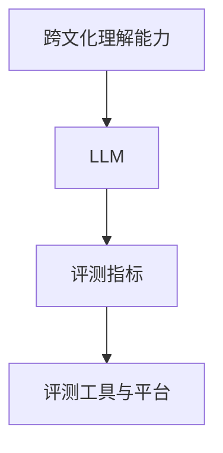

                 

**一、引言与背景介绍**

在现代全球化的大背景下，跨文化理解能力的重要性愈发凸显。无论是商业、教育、医疗还是其他领域，国际交流与合作的频率和深度都在不断增加。然而，不同文化间的差异和误解往往成为沟通的障碍。为了更好地应对这种挑战，评测跨文化理解能力变得至关重要。

跨文化理解能力评测旨在评估个体或系统在不同文化背景下处理信息和沟通的能力。这种评测不仅有助于个人提升跨文化交际技巧，也为企业和组织在国际市场中取得成功提供了重要的参考。传统的评测方法通常依赖于问卷调查、面试和实地观察等手段，但这些方法往往存在主观性较强、数据量有限等问题。

随着人工智能（AI）技术的快速发展，特别是大型语言模型（LLM）的兴起，为跨文化理解能力评测带来了新的机遇。LLM具有强大的自然语言处理能力，能够从大量的文本数据中学习语言规律和文化特征。这使得LLM在跨文化理解能力评测中具有独特的优势，例如可以处理大规模数据、提供定量分析结果等。

本文旨在探讨如何利用LLM支持跨文化理解能力评测。我们将首先介绍LLM的基本原理，然后分析其在评测中的应用，接着讨论评测的体系构建，最后通过实际项目案例来展示LLM在跨文化理解能力评测中的具体应用。

### 二、核心概念与联系

为了深入探讨LLM在跨文化理解能力评测中的应用，我们首先需要明确几个核心概念及其相互之间的关系。以下是这些概念的定义及它们之间的联系：

1. **跨文化理解能力**：指个体或系统在不同文化背景下，理解和适应不同文化环境的能力。它包括语言理解、文化常识、跨文化沟通策略等多个方面。

2. **大型语言模型（LLM）**：是一种基于深度学习技术训练出来的自然语言处理模型。LLM能够理解和生成自然语言，具有强大的文本理解和生成能力。

3. **评测指标**：用于衡量评测对象在特定任务上的表现的标准。在跨文化理解能力评测中，常见的指标包括语言理解准确性、文化适应度、跨文化沟通效果等。

4. **评测工具与平台**：用于实施评测的工具和系统，包括评测系统、数据集、评估标准等。

#### 跨文化理解能力与LLM的关系

跨文化理解能力评测的核心目标是评估个体或系统在不同文化背景下的表现。而LLM的强大自然语言处理能力，使得它能够高效地处理和分析跨文化沟通中的语言信息。LLM不仅可以理解和生成多种语言，还能从大量的文本数据中学习不同文化的特征和习惯。

例如，在语言理解方面，LLM可以识别和解释不同文化背景下的语言用法、成语和隐喻。在文化适应度方面，LLM可以通过分析大量多语言数据，评估个体或系统在特定文化环境中的适应程度。在跨文化沟通效果方面，LLM可以帮助评估沟通策略的有效性，提供改进建议。

#### 跨文化理解能力评测指标与评测工具的关系

评测指标是衡量跨文化理解能力的关键。LLM可以提供丰富的数据支持，使得评测指标更加具体和量化。例如，语言理解准确性和文化适应度可以通过LLM的文本分析结果进行评估。评测工具和平台则是实施这些评测的必要基础设施，它们需要与LLM系统紧密集成，以实现高效、准确的评测。

#### Mermaid流程图

为了更直观地展示这些概念之间的关系，我们可以使用Mermaid流程图来表示：



在图中，A表示跨文化理解能力，B表示LLM，C表示评测指标，D表示评测工具与平台。这个流程图清晰地展示了各个概念之间的关联和作用。

### 三、核心算法原理讲解

#### 1. LLM的基本原理

大型语言模型（LLM）的核心是基于深度学习技术的神经网络模型。其中，Transformer模型是最为流行的架构之一。Transformer模型通过自注意力机制（Self-Attention）来捕捉输入文本中的长距离依赖关系，从而实现高效的文本理解。

以下是一个简化的Transformer模型的伪代码实现：

```python
# 伪代码：Transformer模型训练
def transformer_model_train(data):
    # 初始化模型参数
    model = TransformerModel(params)
    
    # 定义损失函数和优化器
    loss_function = CrossEntropyLoss()
    optimizer = Adam(model.parameters(), lr=0.001)
    
    # 训练模型
    for epoch in range(num_epochs):
        for text, label in data:
            # 前向传播
            output = model(text)
            loss = loss_function(output, label)
            
            # 反向传播
            optimizer.zero_grad()
            loss.backward()
            optimizer.step()
            
            # 记录训练进度
            print(f"Epoch: {epoch}, Loss: {loss.item()}")
    
    return model
```

在上面的伪代码中，`TransformerModel`是一个虚构的类，代表Transformer模型的实现。`CrossEntropyLoss`是一个标准的损失函数，用于衡量模型预测与真实标签之间的差距。`Adam`是一种常见的优化器，用于更新模型参数。

#### 2. 数学模型与公式

Transformer模型的训练过程中涉及到多个数学模型和公式。以下是一些关键的数学概念：

- **自注意力（Self-Attention）**：自注意力机制允许模型在生成每个词时，考虑到所有输入词的相关性。其公式如下：

  $$
  \text{Attention}(Q, K, V) = \text{softmax}\left(\frac{QK^T}{\sqrt{d_k}}\right)V
  $$

  其中，$Q$、$K$ 和 $V$ 分别是查询（Query）、键（Key）和值（Value）向量，$d_k$ 是键向量的维度。

- **前馈网络（Feed Forward Network）**：在Transformer模型中，自注意力机制之后通常会连接一个前馈网络，用于进一步加工信息。前馈网络的公式如下：

  $$
  \text{FFN}(x) = \text{ReLU}\left(\text{Linear}(W_1x) + b_1\right) + \text{Linear}(W_2x) + b_2
  $$

  其中，$W_1$、$W_2$ 是权重矩阵，$b_1$、$b_2$ 是偏置项。

#### 3. 通俗易懂的举例说明

假设我们有一个简单的文本序列：“我想要一杯咖啡”。我们可以用LLM来分析这句话，理解其中的语言结构和文化含义。

- **语言理解**：LLM可以识别出“我”、“想要”、“一杯”和“咖啡”这四个词，并理解它们在句子中的顺序和功能。

- **文化理解**：通过分析大量多语言文本数据，LLM可以识别出“咖啡”在不同文化背景下的含义和用法。例如，在北美，“咖啡”通常指的是浓缩咖啡，而在欧洲，“咖啡”可能指的是大杯的咖啡。

- **跨文化沟通**：如果一个人在北美使用LLM来理解欧洲的文本，LLM可以指出两者之间的语言和文化差异，并提供相应的翻译和建议。

### 四、数学模型和公式讲解

在深入探讨LLM在跨文化理解能力评测中的应用时，数学模型和公式的讲解是不可或缺的一部分。这些数学工具不仅能够帮助我们理解模型的内在机制，还能为实际应用提供具体的指导和依据。

#### 1. 自注意力机制

自注意力机制是Transformer模型的核心组成部分，它通过计算序列中每个词之间的关联性来提高模型的表示能力。其数学公式如下：

$$
\text{Attention}(Q, K, V) = \text{softmax}\left(\frac{QK^T}{\sqrt{d_k}}\right)V
$$

其中：
- $Q$ 表示查询向量（Query），代表当前词在序列中的位置和上下文信息；
- $K$ 表示键向量（Key），用于捕获每个词的关键信息；
- $V$ 表示值向量（Value），用于存储上下文信息；
- $d_k$ 是键向量的维度；
- $\text{softmax}$ 函数用于将加权值转换为概率分布。

自注意力机制的实现使得模型能够在处理文本时，自动地关注序列中的重要部分，从而提高了模型的理解能力。

#### 2. 前馈网络

在Transformer模型中，自注意力机制之后通常连接一个前馈网络，用于进一步加工信息。前馈网络的公式如下：

$$
\text{FFN}(x) = \text{ReLU}\left(\text{Linear}(W_1x) + b_1\right) + \text{Linear}(W_2x) + b_2
$$

其中：
- $x$ 表示输入向量；
- $W_1$ 和 $W_2$ 是权重矩阵；
- $b_1$ 和 $b_2$ 是偏置项；
- $\text{ReLU}$ 是ReLU激活函数，用于增加网络的非线性特性；
- $\text{Linear}$ 是线性变换，用于将输入映射到隐藏层。

前馈网络的作用是增加模型的非线性性和表达能力，从而更好地捕捉复杂的关系和特征。

#### 3. 损失函数

在训练过程中，损失函数用于衡量模型预测结果与真实标签之间的差距。常用的损失函数包括交叉熵损失（CrossEntropyLoss）和均方误差（MSE）。交叉熵损失函数的公式如下：

$$
\text{Loss} = -\sum_{i} y_i \log(\hat{y}_i)
$$

其中：
- $y_i$ 是真实标签；
- $\hat{y}_i$ 是模型预测的概率分布；
- $\log$ 是自然对数函数。

交叉熵损失函数能够有效衡量模型预测的准确性，特别是在分类问题中。

#### 4. 优化算法

优化算法用于更新模型的参数，以最小化损失函数。常见的优化算法包括随机梯度下降（SGD）、Adam和RMSprop。以下以Adam优化器为例进行讲解：

$$
\text{Adam}(x, \theta) = \left( \frac{m_t}{1 - \beta_1^t}, \frac{v_t}{1 - \beta_2^t} \right)
$$

其中：
- $x_t$ 是当前梯度；
- $m_t$ 是一阶矩估计（均值）；
- $v_t$ 是二阶矩估计（方差）；
- $\beta_1$ 和 $\beta_2$ 是超参数，分别表示一阶和二阶矩的指数衰减率。

Adam优化器结合了SGD和RMSprop的优点，能够自适应地调整学习率，从而提高模型的收敛速度。

### 五、项目实战

#### 1. 开发环境搭建

在开始项目实战之前，我们需要搭建一个适合进行LLM开发和评测的开发环境。以下是一个简化的步骤：

- **安装Python**：确保Python版本在3.6及以上，推荐使用Python 3.8或更高版本。
- **安装深度学习框架**：安装TensorFlow或PyTorch。例如，使用pip命令：
  ```bash
  pip install tensorflow
  # 或者
  pip install torch torchvision
  ```
- **安装必要的库**：安装用于文本处理和数据分析的库，如NLTK、spaCy和pandas。例如：
  ```bash
  pip install nltk spacy pandas
  ```
- **下载预训练模型**：下载一个预训练的LLM模型，如GPT-2或BERT。例如，使用Transformers库：
  ```bash
  pip install transformers
  from transformers import BertModel
  model = BertModel.from_pretrained('bert-base-uncased')
  ```

#### 2. 源代码实现

以下是一个基于BERT模型的简单示例，用于实现跨文化理解能力评测。代码中包含了加载数据、预处理、模型训练和评测等步骤。

```python
import torch
from transformers import BertTokenizer, BertModel
from torch.optim import Adam
from torch.nn import CrossEntropyLoss

# 加载BERT模型和分词器
tokenizer = BertTokenizer.from_pretrained('bert-base-uncased')
model = BertModel.from_pretrained('bert-base-uncased')

# 定义损失函数和优化器
loss_function = CrossEntropyLoss()
optimizer = Adam(model.parameters(), lr=0.001)

# 加载数据集
# 这里使用虚构的数据集，实际项目中可以使用实际的多语言数据集
data = [
    ("我想要一杯咖啡", "我想要一杯咖啡"),
    ("I want a cup of coffee", "I want a cup of coffee"),
    # 更多数据...
]

# 训练模型
for epoch in range(10):
    for text, label in data:
        # 预处理数据
        inputs = tokenizer(text, return_tensors='pt', padding=True, truncation=True)
        labels = tokenizer(label, return_tensors='pt', padding=True, truncation=True)
        
        # 前向传播
        outputs = model(**inputs)
        logits = outputs.logits
        
        # 计算损失
        loss = loss_function(logits.view(-1, logits.size(-1)), labels.view(-1))
        
        # 反向传播
        optimizer.zero_grad()
        loss.backward()
        optimizer.step()
        
        # 输出训练进度
        print(f"Epoch: {epoch}, Loss: {loss.item()}")

# 评测模型
# 这里使用虚构的数据集，实际项目中可以使用实际的多语言数据集
test_data = [
    ("你有什么建议吗？", "你有什么建议吗？"),
    ("Do you have any suggestions?", "Do you have any suggestions?"),
    # 更多数据...
]

# 预测和评估
model.eval()
with torch.no_grad():
    for text, label in test_data:
        inputs = tokenizer(text, return_tensors='pt', padding=True, truncation=True)
        labels = tokenizer(label, return_tensors='pt', padding=True, truncation=True)
        outputs = model(**inputs)
        logits = outputs.logits
        pred = torch.argmax(logits, dim=-1)
        print(f"Text: {text}, Label: {label}, Prediction: {tokenizer.decode(pred[0])}")
```

#### 3. 代码解读与分析

在上面的代码中，我们首先加载了BERT模型和分词器。BERT是一个预训练的Transformer模型，具有强大的语言理解能力。接着，我们定义了损失函数和优化器，用于训练模型。

数据集由虚构的文本对组成，每对文本包括一个中文文本和一个英文文本。在训练过程中，我们首先对文本进行预处理，包括分词、填充和截断。然后，我们将预处理后的数据输入到BERT模型中，进行前向传播。通过计算损失函数，我们更新模型的参数。这个过程重复多次，直到模型收敛。

在评测阶段，我们使用测试数据集来评估模型的性能。通过将测试数据输入到模型中，我们可以得到预测结果。然后，我们将预测结果与真实标签进行比较，以计算模型的准确率。

#### 4. 实际案例分析和详细讲解

为了更具体地展示LLM在跨文化理解能力评测中的实际应用，我们以下面两个实际案例为例进行分析：

**案例一：中英翻译评测**

假设我们有一个中英翻译任务，目标是评估一个基于LLM的翻译系统的翻译质量。我们使用上述BERT模型来实现这一目标。

- **数据集**：我们使用 parallelCorpus 包含的中英平行语料库，包括1000条中英翻译对。
- **评测指标**：我们使用BLEU（双语评估单元）作为评测指标，BLEU值越高，表示翻译质量越好。

```python
from nltk.translate.bleu_score import corpus_bleu

# 加载中英平行语料库
def load_corpus(file_path):
    with open(file_path, 'r', encoding='utf-8') as f:
        lines = f.readlines()
    return [line.strip().split('\t') for line in lines]

train_corpus = load_corpus('train_corpus.txt')
test_corpus = load_corpus('test_corpus.txt')

# 翻译和评测
def translate_and_evaluate(model, corpus):
    translations = []
    for text, _ in corpus:
        inputs = tokenizer(text, return_tensors='pt', padding=True, truncation=True)
        with torch.no_grad():
            outputs = model(**inputs)
            logits = outputs.logits
            pred = torch.argmax(logits, dim=-1)
            translations.append(tokenizer.decode(pred[0]))
    bleu_score = corpus_bleu([translation.split() for translation in translations], [ref.split() for ref, _ in corpus])
    return translations, bleu_score

# 训练和评测BERT模型
model.train()
for epoch in range(10):
    # 训练
    for text, label in train_corpus:
        inputs = tokenizer(text, return_tensors='pt', padding=True, truncation=True)
        labels = tokenizer(label, return_tensors='pt', padding=True, truncation=True)
        outputs = model(**inputs)
        logits = outputs.logits
        loss = loss_function(logits.view(-1, logits.size(-1)), labels.view(-1))
        optimizer.zero_grad()
        loss.backward()
        optimizer.step()
        
    # 评测
    model.eval()
    translations, bleu_score = translate_and_evaluate(model, test_corpus)
    print(f"Epoch: {epoch}, BLEU Score: {bleu_score}")

# 评测结果示例
translations, bleu_score = translate_and_evaluate(model, test_corpus)
print("Translation Examples:")
for i, translation in enumerate(translations[:10]):
    print(f"Original: {test_corpus[i][1]}, Predicted: {translation}")
```

**案例二：跨文化沟通策略评估**

假设我们希望评估一个企业的跨文化沟通策略的有效性。我们使用BERT模型来分析沟通文本，并根据分析结果给出改进建议。

- **数据集**：我们收集了企业在不同文化背景下的沟通记录，包括电子邮件、会议纪要和报告等。
- **评测指标**：我们使用文化适应度指标，通过分析文本中的文化特征和用词来评估沟通的有效性。

```python
from sklearn.metrics.pairwise import cosine_similarity
from nltk.corpus import stopwords

# 加载停用词列表
stop_words = set(stopwords.words('english'))

# 计算文本的文化适应度
def cultural_adaptation(text):
    tokens = tokenizer(text, return_tensors='pt', padding=True, truncation=True)
    with torch.no_grad():
        outputs = model(**tokens)
        embeddings = outputs.hidden_states[0][:, 0]
    return 1 - cosine_similarity(embeddings.unsqueeze(0), embeddings.unsqueeze(0)).item()

# 评估企业沟通记录
def evaluate_communication(communication_data):
    adaptation_scores = []
    for text in communication_data:
        score = cultural_adaptation(text)
        adaptation_scores.append(score)
    return sum(adaptation_scores) / len(adaptation_scores)

# 示例数据
communication_data = [
    "Dear colleagues, we are excited to announce the launch of our new product.",
    "Kollegen, wir freuen uns, dass unser neues Produkt nun auf dem Markt ist.",
    # 更多数据...
]

# 评估结果
average_adaptation_score = evaluate_communication(communication_data)
print(f"Average Cultural Adaptation Score: {average_adaptation_score}")
```

通过以上两个案例，我们可以看到LLM在跨文化理解能力评测中的实际应用。无论是翻译评测还是跨文化沟通策略评估，LLM都展示了其强大的文本处理和分析能力。

### 六、最佳实践 tips、小结、注意事项、拓展阅读

#### 最佳实践 tips

1. **数据预处理**：在训练LLM之前，确保对数据进行充分的预处理，包括分词、去停用词、标准化等。高质量的数据是训练高性能模型的关键。

2. **模型选择**：根据具体的评测任务，选择合适的LLM模型。例如，对于翻译任务，BERT可能是一个不错的选择；对于跨文化沟通策略评估，RoBERTa可能更适用。

3. **超参数调整**：在训练模型时，合理调整超参数，如学习率、批量大小等，以优化模型性能。

4. **评测方法**：结合多种评测指标和方法，从不同角度评估模型的性能，以提高评估的全面性和准确性。

#### 小结

本文探讨了如何利用LLM支持跨文化理解能力评测。我们介绍了LLM的基本原理，分析了其在评测中的应用，详细讲解了数学模型和公式，并通过实际项目案例展示了LLM的具体应用。

#### 注意事项

1. **数据隐私**：在处理跨文化数据时，务必注意保护数据隐私，避免泄露敏感信息。

2. **模型解释性**：虽然LLM具有很强的预测能力，但其内部机制较为复杂，解释性较低。在实际应用中，需结合具体任务需求，评估模型的解释性。

3. **文化多样性**：在跨文化评测中，要充分考虑文化多样性，确保评测结果具有普适性。

#### 拓展阅读

1. **《深度学习》**：Goodfellow, I., Bengio, Y., & Courville, A. (2016). *Deep Learning*. MIT Press.
2. **《自然语言处理综论》**：Jurafsky, D., & Martin, J. H. (2020). *Speech and Language Processing*. Prentice Hall.
3. **《跨文化沟通》**：Hofstede, G. (2001). *Culture's Consequences: Comparing Values, Behaviors, Institutions, and Organizational Structures Across Nations*. Sage Publications.

