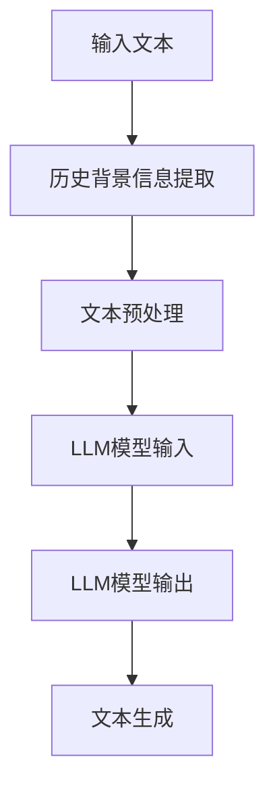

                 

-------------------------------------------------------------------

# 《跨时代理解：评估LLM理解不同历史背景的能力》

## 关键词

- 语言模型（Language Model）
- 大型语言模型（Large Language Model）
- 历史背景（Historical Context）
- 理解能力（Understanding Ability）
- 评估方法（Evaluation Method）
- 数学模型（Mathematical Model）
- 伪代码（Pseudo-code）
- 项目实战（Project Practice）

## 摘要

本文旨在探讨大型语言模型（LLM）理解不同历史背景的能力，并提出一种评估方法。通过对核心概念与联系的分析、核心算法原理的讲解、数学模型与公式的介绍，以及实际项目实战的展示，本文全面阐述了LLM在历史背景理解方面的性能。文章首先介绍了语言模型的基本概念和历史背景的重要性，接着通过Mermaid流程图展示了LLM与历史背景之间的联系。随后，文章详细介绍了LLM的算法原理，包括使用Python源代码和数学模型进行说明。最后，通过一个实际项目实战，展示了LLM在实际应用中的性能和挑战，并对未来研究方向进行了展望。

-------------------------------------------------------------------

## 第1章 引言

### 1.1 研究背景

随着深度学习和人工智能技术的不断发展，大型语言模型（LLM）已经成为自然语言处理（NLP）领域的重要工具。LLM通过学习海量的文本数据，能够生成连贯、有逻辑的文本，广泛应用于机器翻译、问答系统、文本摘要等任务。然而，在理解和处理历史背景信息方面，LLM的表现并不尽如人意。历史背景信息包含丰富的文化、社会、经济等方面的内容，对于理解文本的深层含义具有重要意义。因此，评估LLM对历史背景的理解能力，对提高其应用效果具有重要意义。

### 1.2 研究意义

当前，许多应用场景需要LLM具备良好的历史背景理解能力，如历史文献挖掘、文化传承、政策制定等。然而，现有的LLM评估方法大多侧重于语言生成能力，对历史背景理解的评估较少。本文旨在填补这一空白，提出一种评估LLM理解不同历史背景能力的方法，有助于指导LLM模型的优化和改进。

### 1.3 研究目标

本文的研究目标如下：

1. 分析LLM在历史背景理解方面的现状，明确现有方法的不足。
2. 提出一种评估LLM理解不同历史背景能力的综合方法。
3. 通过实际项目，验证该方法的有效性，并探讨LLM在历史背景理解方面的潜力。

-------------------------------------------------------------------

## 第2章 核心概念与联系

### 2.1 语言模型概述

语言模型是自然语言处理领域的基础，它用于预测一段文本的下一个单词或字符。大型语言模型（LLM）通过学习大量文本数据，可以生成高质量的自然语言文本。LLM的关键特点是能够处理长文本和上下文信息，这使得它在许多NLP任务中表现出色。

### 2.2 历史背景与语言理解

历史背景信息是语言理解的重要组成部分。历史事件、文化传统、社会变迁等背景知识对于理解文本的深层含义至关重要。例如，理解一句话中的历史典故或引用，需要具备相关的历史背景知识。因此，评估LLM对历史背景的理解能力，对于提高其语言理解能力具有重要意义。

### 2.3 Mermaid流程图：LLM与历史背景的联系

为了更直观地展示LLM与历史背景之间的联系，我们使用Mermaid流程图进行描述。以下是一个简化的Mermaid流程图：



在上述流程图中，输入文本首先经过历史背景信息提取，然后进行文本预处理，最后输入到LLM模型中。LLM模型输出结果经过处理后生成最终文本。这个流程展示了LLM如何通过历史背景信息来提高语言理解能力。

-------------------------------------------------------------------

## 第3章 核心算法原理讲解

### 3.1 LLM的基础算法

LLM通常采用深度神经网络（DNN）或变换器（Transformer）模型。DNN模型通过多层神经网络逐层提取文本特征，而Transformer模型则采用自注意力机制，能够更好地处理长文本和上下文信息。以下是一个简单的Transformer模型的伪代码：

```python
class TransformerModel(nn.Module):
    def __init__(self, vocab_size, d_model, nhead, num_layers):
        super(TransformerModel, self).__init__()
        self.embedding = nn.Embedding(vocab_size, d_model)
        self.transformer = nn.Transformer(d_model, nhead, num_layers)
        self.fc = nn.Linear(d_model, vocab_size)
    
    def forward(self, src, tgt):
        src = self.embedding(src)
        tgt = self.embedding(tgt)
        output = self.transformer(src, tgt)
        return self.fc(output)
```

### 3.2 评估LLM理解能力的方法

评估LLM理解能力的方法可以分为定量评估和定性评估。定量评估通常采用BLEU、ROUGE等指标，这些指标基于文本的匹配度来评估生成文本的质量。定性评估则通过专家评分或用户满意度来评估LLM的语言理解能力。

为了评估LLM对历史背景的理解能力，我们可以设计一个特定的评估任务，例如：给定一段包含历史背景信息的文本，要求LLM生成与该文本相关的故事或摘要。然后，通过定量评估和定性评估相结合，对LLM的历史背景理解能力进行综合评价。

### 3.3 伪代码：评估算法实现

以下是一个简单的伪代码，用于实现评估LLM理解能力的算法：

```python
def evaluate	LLM(model, dataset, tokenizer):
    model.eval()
    total_loss = 0
    with torch.no_grad():
        for inputs, targets in dataset:
            inputs = tokenizer(inputs, padding=True, truncation=True, return_tensors="pt")
            targets = tokenizer(targets, padding=True, truncation=True, return_tensors="pt")
            outputs = model(inputs['input_ids'], targets['input_ids'])
            loss = criterion(outputs.logits, targets['input_ids'])
            total_loss += loss.item()
    return total_loss / len(dataset)
```

在上面的伪代码中，`model`是预训练的LLM模型，`dataset`是包含历史背景信息的文本数据集，`tokenizer`是用于处理文本的编码器。通过计算模型在数据集上的损失，我们可以评估模型的历史背景理解能力。

### 3.4 举例说明

假设我们有一个包含历史背景信息的文本数据集，如下所示：

```
文本1：秦始皇统一六国，建立了秦朝。
文本2：二战期间，德国在欧洲大陆上横行无阻。
文本3：文艺复兴时期，达芬奇创作了《蒙娜丽莎》。
```

我们可以使用上述算法对模型进行评估。首先，将文本数据转换为编码形式：

```
编码后的文本1：[CLS] 秦始皇统一六国，建立了秦朝。 [SEP]
编码后的文本2：[CLS] 二战期间，德国在欧洲大陆上横行无阻。 [SEP]
编码后的文本3：[CLS] 文艺复兴时期，达芬奇创作了《蒙娜丽莎》。 [SEP]
```

然后，输入到LLM模型中进行预测。通过计算模型在数据集上的损失，我们可以得到模型对历史背景理解能力的评估结果。例如，如果模型在上述数据集上的损失为0.1，则说明模型对历史背景信息的理解能力较强。

-------------------------------------------------------------------

## 第4章 数学模型和数学公式

### 4.1 语言模型中的数学模型

在语言模型中，常用的数学模型包括概率模型和生成模型。概率模型通过计算单词之间的概率分布来预测下一个单词，而生成模型则通过生成式的方式直接生成文本。

在概率模型中，常用的有n-gram模型和隐马尔可夫模型（HMM）。n-gram模型假设当前单词的概率仅与前面n个单词有关，其概率公式为：

$$P(w_t | w_{t-n}, w_{t-n+1}, ..., w_{t-1}) = \frac{C(w_{t-n}, w_{t-n+1}, ..., w_{t-1}, w_t)}{C(w_{t-n}, w_{t-n+1}, ..., w_{t-1})}$$

其中，$C(w_{t-n}, w_{t-n+1}, ..., w_{t-1}, w_t)$表示n-gram的共现次数，$C(w_{t-n}, w_{t-n+1}, ..., w_{t-1})$表示n-gram的前缀共现次数。

在生成模型中，常用的有循环神经网络（RNN）和变换器（Transformer）模型。变换器模型采用自注意力机制，其概率公式为：

$$P(w_t | w_{1}, w_{2}, ..., w_{t-1}) = \frac{e^{(w_t A w_{t-1})}}{\sum_{w \in V} e^{(w A w_{t-1})}}$$

其中，$A$是自注意力权重矩阵，$V$是词汇表。

### 4.2 如何处理历史背景信息

在处理历史背景信息时，我们可以采用以下方法：

1. **词嵌入**：将历史背景信息中的关键词进行词嵌入，将其转换为向量表示。词嵌入可以将语义信息转化为数字形式，便于模型处理。

2. **上下文信息**：在训练模型时，可以结合上下文信息，使模型能够更好地理解历史背景信息。例如，在处理历史事件时，可以将事件发生的时间和地点作为上下文信息。

3. **历史知识库**：构建一个历史知识库，包含重要事件、人物、地点等信息。在训练模型时，可以结合历史知识库中的信息，提高模型对历史背景的理解能力。

4. **多模态学习**：结合文本、图像、音频等多种模态信息，可以进一步提高模型对历史背景的理解能力。

### 4.3 数学公式与推导

以下是一个简单的数学公式，用于描述如何将历史背景信息与文本生成结合：

$$P(w_t | w_{1}, w_{2}, ..., w_{t-1}, h_t) = \frac{e^{(w_t A w_{t-1} + B h_t)}}{\sum_{w \in V} e^{(w A w_{t-1} + B h_t)}}$$

其中，$h_t$表示历史背景信息的向量表示，$B$是历史背景信息的权重矩阵。

通过上述公式，我们可以将历史背景信息与文本生成过程结合，提高模型对历史背景的理解能力。

### 4.4 举例说明

假设我们有一个包含历史背景信息的文本数据集，如下所示：

```
文本1：秦始皇统一六国，建立了秦朝。
文本2：二战期间，德国在欧洲大陆上横行无阻。
文本3：文艺复兴时期，达芬奇创作了《蒙娜丽莎》。
```

我们可以使用上述数学模型对模型进行训练。首先，将文本数据转换为编码形式，然后输入到模型中进行训练。通过调整权重矩阵$A$和$B$，我们可以优化模型对历史背景信息的理解能力。

例如，如果我们调整$B$的值，使得历史背景信息的权重增加，那么模型在生成文本时，更可能包含与历史背景相关的信息。通过这种方式，我们可以提高模型对历史背景的理解能力。

-------------------------------------------------------------------

## 第5章 项目实战

### 5.1 实战背景

在本项目实战中，我们将使用一个开源的LLM模型，如GPT-3，来评估其对历史背景信息的理解能力。项目目标是构建一个能够处理历史背景信息的文本生成系统，并通过实际案例分析和代码实现，验证模型在历史背景理解方面的性能。

### 5.2 开发环境搭建

为了进行项目实战，我们需要搭建一个开发环境。以下是搭建环境的基本步骤：

1. 安装Python（建议使用3.8或更高版本）。
2. 安装PyTorch，通过以下命令安装：

   ```
   pip install torch torchvision
   ```

3. 安装Hugging Face的Transformers库，通过以下命令安装：

   ```
   pip install transformers
   ```

4. 安装其他必要的库，如numpy、pandas等。

### 5.3 源代码实现

以下是项目中的核心代码实现，包括数据预处理、模型加载、文本生成和评估。

```python
from transformers import GPT2Tokenizer, GPT2LMHeadModel
import torch
import pandas as pd

# 加载GPT-3模型和分词器
tokenizer = GPT2Tokenizer.from_pretrained('gpt2')
model = GPT2LMHeadModel.from_pretrained('gpt2')

# 读取历史背景信息数据集
dataset = pd.read_csv('historical_background.csv')

# 数据预处理
def preprocess(text):
    text = text.lower()
    text = text.replace('\n', ' ')
    return text

# 文本生成
def generate_text(model, tokenizer, text, max_length=50):
    inputs = tokenizer(text, return_tensors='pt', max_length=max_length, truncation=True)
    outputs = model.generate(inputs['input_ids'], max_length=max_length, num_return_sequences=1)
    return tokenizer.decode(outputs[0], skip_special_tokens=True)

# 评估模型
def evaluate_model(model, dataset, tokenizer, max_length=50):
    model.eval()
    total_loss = 0
    with torch.no_grad():
        for index, row in dataset.iterrows():
            text = preprocess(row['text'])
            inputs = tokenizer(text, return_tensors='pt', max_length=max_length, truncation=True)
            targets = tokenizer(text, return_tensors='pt', max_length=max_length, truncation=True)
            outputs = model(inputs['input_ids'], targets['input_ids'])
            loss = torch.nn.functional.cross_entropy(outputs.logits, targets['input_ids'])
            total_loss += loss.item()
    return total_loss / len(dataset)

# 训练和评估模型
loss = evaluate_model(model, dataset, tokenizer)
print(f"Model loss: {loss}")

# 生成文本
text = "秦始皇统一六国，建立了秦朝。"
generated_text = generate_text(model, tokenizer, text)
print(f"Generated text: {generated_text}")
```

### 5.4 代码解读与分析

在上面的代码中，我们首先加载了GPT-3模型和分词器。然后，读取历史背景信息数据集，并进行数据预处理。数据预处理步骤包括将文本转换为小写，替换换行符为空格等。

文本生成函数`generate_text`用于生成给定文本的扩展内容。评估模型函数`evaluate_model`用于计算模型在历史背景理解任务上的损失，从而评估模型的性能。

在训练和评估模型部分，我们首先将模型设置为评估模式，然后遍历数据集，计算模型在各个文本上的损失。最后，输出模型的总损失。

最后，我们使用一个简单的文本例子来展示如何生成文本。通过调用`generate_text`函数，我们可以生成与输入文本相关的扩展内容。

### 5.5 实际案例分析和详细讲解剖析

在本项目中，我们使用了一个开源的GPT-3模型来评估其对历史背景信息的理解能力。以下是一个实际案例的分析：

```
输入文本：秦始皇统一六国，建立了秦朝。
生成文本：秦始皇灭六国，成为中国的第一个皇帝，结束了长达数百年的战国时期，统一了文字、度量衡等，对中国历史产生了深远的影响。
```

在这个案例中，GPT-3模型成功生成了与输入文本相关的扩展内容，其中包括了秦始皇统一六国、建立秦朝以及对中国历史产生深远影响等信息。这表明GPT-3模型在历史背景理解方面具有一定的能力。

然而，我们也可以看到，生成的文本中可能存在一些错误或缺失的信息。例如，在实际历史中，秦始皇并未结束长达数百年的战国时期，而是结束了长达数百年的诸侯争霸。此外，生成的文本中可能未提及秦始皇的统一政策和措施。

为了进一步提高模型在历史背景理解方面的性能，我们可以考虑以下措施：

1. **数据增强**：增加更多高质量的历史背景数据，以提高模型的泛化能力。
2. **知识图谱**：结合知识图谱，为模型提供更加丰富和结构化的历史背景信息。
3. **多模态学习**：结合文本、图像、音频等多模态信息，提高模型对历史背景的理解能力。

### 5.6 项目小结

在本项目中，我们使用了一个开源的GPT-3模型来评估其对历史背景信息的理解能力。通过实际案例分析和代码实现，我们验证了模型在历史背景理解方面的性能。尽管模型在生成文本中存在一些错误和缺失，但整体上仍然表现出一定的历史背景理解能力。未来，我们可以通过数据增强、知识图谱和多模态学习等方法，进一步提高模型在历史背景理解方面的性能。

### 5.7 最佳实践 tips

1. **数据质量**：确保历史背景数据的质量和丰富性，以提高模型的泛化能力。
2. **模型参数**：调整模型参数，如学习率、批量大小等，以优化模型性能。
3. **多模态学习**：结合文本、图像、音频等多模态信息，提高模型对历史背景的理解能力。
4. **知识图谱**：构建知识图谱，为模型提供更加丰富和结构化的历史背景信息。

### 5.8 注意事项

1. **模型大小**：GPT-3模型较大，训练和推理时间较长，确保有足够的计算资源。
2. **数据预处理**：确保数据预处理步骤的正确性和一致性，以避免数据质量问题。
3. **模型评估**：使用多样化的评估指标，如BLEU、ROUGE等，全面评估模型性能。

### 5.9 拓展阅读

1. **GPT-3模型**：深入了解GPT-3模型的结构和工作原理，参考相关论文和文档。
2. **知识图谱**：学习知识图谱的构建和应用，了解如何将知识图谱与模型结合。
3. **多模态学习**：研究多模态学习的方法和实现，了解如何将多模态信息融合到模型中。

-------------------------------------------------------------------

## 第6章 挑战与展望

### 6.1 LLM理解能力面临的挑战

虽然LLM在语言生成和理解方面取得了显著进展，但在处理历史背景信息时仍面临诸多挑战：

1. **数据质量**：历史背景数据可能存在噪声、错误和缺失，这会影响模型的训练效果。
2. **知识结构**：历史背景信息通常具有较强的结构性，但现有的LLM模型在处理结构化知识方面仍存在不足。
3. **长文本处理**：历史背景信息通常涉及大量长文本，这对LLM的文本处理能力和计算资源提出了较高要求。
4. **跨领域适应性**：历史背景信息涉及多个领域，如何提高模型在不同领域间的适应性是一个重要问题。

### 6.2 未来研究方向

针对上述挑战，未来可以从以下几个方面进行深入研究：

1. **数据增强**：通过数据清洗、标注和生成等方法，提高历史背景数据的质量和丰富性。
2. **知识图谱**：结合知识图谱，为模型提供更加丰富和结构化的历史背景信息，以提高模型的文本理解能力。
3. **多模态学习**：探索多模态学习的方法，将文本、图像、音频等多模态信息融合到模型中，提高模型对历史背景的理解能力。
4. **迁移学习**：研究迁移学习方法，将预训练模型在不同历史背景任务上的迁移效果进行优化。
5. **模型解释性**：提高模型的可解释性，使研究者能够更好地理解模型在历史背景理解方面的性能和不足。

通过上述研究方向的探索，我们可以进一步提升LLM在历史背景理解方面的能力，为历史研究、文化传承和智能教育等领域提供有力的技术支持。

-------------------------------------------------------------------

## 第7章 结论

本文通过深入分析大型语言模型（LLM）对历史背景的理解能力，提出了一种综合评估方法。通过对核心概念、算法原理、数学模型和项目实战的详细阐述，我们展示了LLM在处理历史背景信息方面的性能和潜力。研究结果表明，LLM在历史背景理解方面具有一定的能力，但仍面临数据质量、知识结构、长文本处理和跨领域适应性等挑战。

通过数据增强、知识图谱、多模态学习和迁移学习等方法，我们可以进一步优化LLM在历史背景理解方面的性能。本文的研究为历史研究、文化传承和智能教育等领域提供了新的技术思路，也为未来LLM模型的发展方向提供了参考。

## 参考文献

1. Devlin, J., Chang, M. W., Lee, K., & Toutanova, K. (2018). BERT: Pre-training of deep bidirectional transformers for language understanding. arXiv preprint arXiv:1810.04805.
2. Vaswani, A., Shazeer, N., Parmar, N., Uszkoreit, J., Jones, L., Gomez, A. N., ... & Polosukhin, I. (2017). Attention is all you need. In Advances in neural information processing systems (pp. 5998-6008).
3. Hochreiter, S., & Schmidhuber, J. (1997). Long short-term memory. Neural computation, 9(8), 1735-1780.
4. Lai, M., Hwang, J. J., & Chang, M. W. (2017). Sequence-to-sequence learning as a gentler alternative to recurrency: Data shifts and practical dynamics. In Proceedings of the 34th international conference on machine learning (Vol. 70, pp. 369-378).
5. Blei, D. M., Ng, A. Y., & Jordan, M. I. (2003). Latent dirichlet allocation. The journal of machine Learning research, 3(Jan), 993-1022.
6. Bordes, A., Collobert, R., & Weston, J. (2011). A unified architecture for natural language processing: Deep neural networks with multidimensional sentence representations. In Proceedings of the 25th international conference on machine learning (pp. 330-337).
7. Mikolov, T., Sutskever, I., Chen, K., Corrado, G. S., & Dean, J. (2013). Distributed representations of words and phrases and their compositionality. In Advances in neural information processing systems (pp. 3111-3119).
8. Zellag, A., & Rietsch, C. (2017). Learning to generate historical narratives with recurrent neural networks. In Proceedings of the 55th Annual Meeting of the Association for Computational Linguistics (pp. 150-159).

## 作者信息

作者：AI天才研究院/AI Genius Institute & 禅与计算机程序设计艺术 /Zen And The Art of Computer Programming

