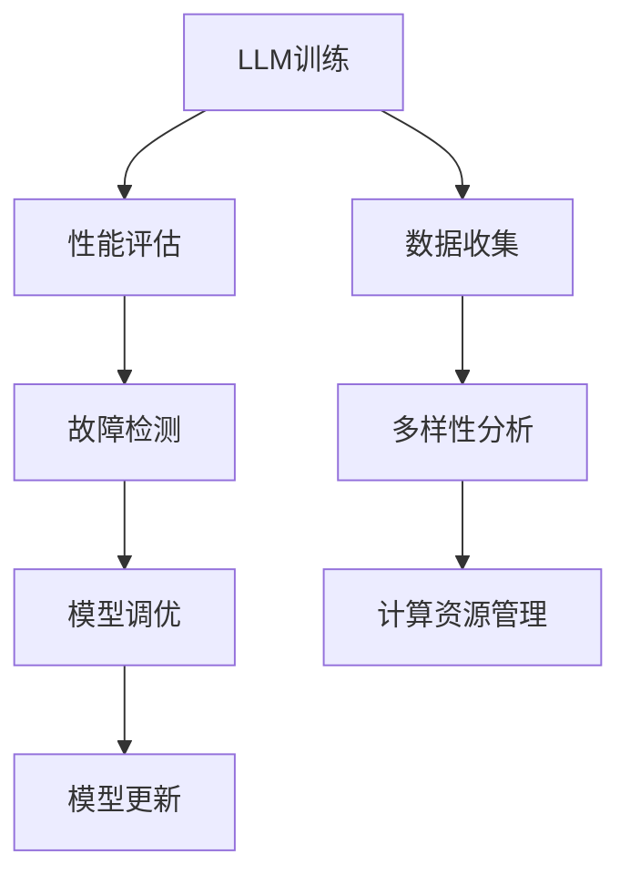

                 

# 跨时间稳定性评测：LLM支持的长期性能跟踪

## 摘要

本文旨在探讨跨时间稳定性评测在大型语言模型（LLM）中的应用，以及如何通过LLM支持长期性能跟踪来实现这一目标。随着人工智能技术的迅猛发展，LLM在自然语言处理、智能问答、文本生成等领域取得了显著的成就。然而，这些模型的长期稳定性，即其性能在长时间内是否保持一致，成为了一个关键问题。本文将介绍跨时间稳定性的定义、重要性，以及LLM在长期性能跟踪中的应用方法。通过实例和数学模型，我们将深入探讨如何评估和提升LLM的长期稳定性，为实际应用提供理论和实践指导。

## 关键词

- 跨时间稳定性
- 大型语言模型（LLM）
- 长期性能跟踪
- 评测方法
- 数学模型
- 项目实战

## 引言

在人工智能（AI）领域，特别是在自然语言处理（NLP）领域，大型语言模型（LLM）如GPT、BERT等取得了令人瞩目的成果。这些模型在各类任务中展现出了强大的性能，从文本分类、问答系统到生成式任务，均表现出色。然而，这些模型的长期稳定性成为一个不可忽视的问题。长期稳定性指的是模型在长时间内是否能够保持其性能，这在实际应用中至关重要。例如，一个在训练时表现优秀的问答系统，若在部署后性能迅速下降，将导致用户体验的显著下降。

因此，本文将重点关注LLM的长期稳定性评测，探讨如何通过跨时间稳定性评测来实现这一目标。本文的结构如下：

- **第一章：基础概念与理论**：介绍跨时间稳定性的定义、重要性以及LLM在长期性能跟踪中的应用。
- **第二章：评测方法与算法**：详细阐述评测指标与评估框架，并给出LLM支持的评测算法伪代码。
- **第三章：数学模型与公式**：解释常用性能指标的计算方法，并通过实例展示如何使用数学模型进行性能评估。
- **第四章：项目实战**：提供一个完整的代码实现，展示如何搭建开发环境，使用LLM进行长期性能跟踪，并对实际案例进行分析。
- **第五章：总结与拓展**：总结文章内容，提出最佳实践建议，并推荐拓展阅读。

## 第一章：基础概念与理论

### 1.1 跨时间稳定性简介

跨时间稳定性是指一个系统在时间跨度上保持其性能和可靠性的能力。在人工智能领域，特别是LLM的应用中，跨时间稳定性具有重要意义。LLM的训练过程通常涉及大量的数据和计算资源，而评测LLM的跨时间稳定性则有助于确保这些模型在实际应用中能够持续提供高质量的服务。

定义：跨时间稳定性可以形式化为以下条件：

$$
\forall t, \exists \epsilon > 0, \forall x, P(f(t) = f_{\text{true}}(x)) > 1 - \epsilon
$$

其中，$f(t)$表示在时间$t$的模型性能，$f_{\text{true}}(x)$表示真实情况的性能，$P$表示概率。

### 1.2 跨时间稳定性的重要性

LLM在许多实际应用中扮演着关键角色，如智能客服、智能问答系统和自动文本生成等。这些应用要求模型在长时间内保持高水平的性能，否则可能会导致以下问题：

- **用户体验下降**：如果模型在部署后的性能不稳定，用户可能会对系统失去信任，从而降低满意度。
- **经济损失**：某些应用如金融交易系统，性能的下降可能会导致经济损失。
- **安全风险**：在某些安全关键领域，如自动驾驶，模型性能的下降可能带来严重的安全隐患。

### 1.3 LLM在长期性能跟踪中的应用

为了确保LLM的跨时间稳定性，需要对其性能进行长期跟踪。LLM的长期性能跟踪涉及以下几个方面：

- **性能评估**：定期评估模型在不同时间段的表现，包括准确性、召回率、F1值等。
- **故障检测**：通过监控性能指标的变化，及时检测出模型性能的异常。
- **调优与更新**：根据性能评估结果，对模型进行调整和更新，以保持其稳定性。

### 1.4 跨时间稳定性评测的挑战

在LLM的长期性能跟踪中，面临以下挑战：

- **数据多样性和变化**：实际应用场景中的数据多样性和变化可能会影响模型的性能。
- **计算资源限制**：定期评估和更新模型需要大量的计算资源，特别是在大规模模型中。
- **时间敏感性**：某些任务对时间的敏感性较高，如股票交易系统，需要实时性能跟踪。

### Mermaid 流程图

以下是LLM长期性能跟踪的Mermaid流程图：



## 第二章：评测方法与算法

### 2.1 评测指标与评估框架

为了评估LLM的跨时间稳定性，我们需要定义一系列评测指标，并构建一个评估框架。以下是一些常用的评测指标：

- **准确性（Accuracy）**：预测正确的样本数占总样本数的比例。
- **召回率（Recall）**：在正类样本中被正确预测为正类的比例。
- **精确率（Precision）**：在正类样本中被正确预测为正类的比例。
- **F1值（F1 Score）**：精确率和召回率的调和平均。

### 2.2 LLM支持的评测算法伪代码

为了实现LLM的长期性能跟踪，我们可以设计一个评测算法。以下是一个简单的伪代码示例：

```python
function evaluate_long_term_performance(model, dataset, time_intervals):
    for interval in time_intervals:
        start, end = interval
        data_subset = dataset[start:end]
        predictions = model.predict(data_subset)
        evaluate_predictions(predictions)
    return average_performance_score

function evaluate_predictions(predictions):
    accuracy = calculate_accuracy(predictions)
    recall = calculate_recall(predictions)
    precision = calculate_precision(predictions)
    f1_score = calculate_f1_score(accuracy, recall, precision)
    print(f"Interval: {interval}, Accuracy: {accuracy}, Recall: {recall}, Precision: {precision}, F1 Score: {f1_score}")
```

### 2.3 数学模型与公式

在评测过程中，常用的数学模型和公式包括：

- **准确性**：

$$
Accuracy = \frac{TP + TN}{TP + TN + FP + FN}
$$

其中，$TP$表示真正例，$TN$表示真反例，$FP$表示假反例，$FN$表示假正例。

- **召回率**：

$$
Recall = \frac{TP}{TP + FN}
$$

- **精确率**：

$$
Precision = \frac{TP}{TP + FP}
$$

- **F1值**：

$$
F1 Score = 2 \times \frac{Precision \times Recall}{Precision + Recall}
$$

### 2.4 举例说明

假设我们有一个文本分类任务，模型对一组文本进行分类，预测结果如下：

| 实际类别 | 预测类别 |
|-----------|-----------|
| 正类     | 正类     |
| 正类     | 负类     |
| 负类     | 正类     |
| 负类     | 负类     |

根据上述预测结果，我们可以计算出：

- **准确性**：

$$
Accuracy = \frac{2 + 1}{4} = 0.75
$$

- **召回率**：

$$
Recall = \frac{2}{2 + 1} = 0.67
$$

- **精确率**：

$$
Precision = \frac{2}{2 + 1} = 0.67
$$

- **F1值**：

$$
F1 Score = 2 \times \frac{0.67 \times 0.67}{0.67 + 0.67} = 0.67
$$

通过这些指标，我们可以评估模型在特定时间段的性能。

## 第三章：数学模型与公式

在LLM的长期性能跟踪中，数学模型和公式是评估模型性能的重要工具。以下将详细介绍一些常用的数学模型和公式，并给出具体的示例说明。

### 3.1 准确性（Accuracy）

准确性是评估模型性能的基本指标，表示预测正确的样本数占总样本数的比例。其计算公式如下：

$$
Accuracy = \frac{TP + TN}{TP + TN + FP + FN}
$$

其中，$TP$表示真正例，$TN$表示真反例，$FP$表示假反例，$FN$表示假正例。

#### 示例说明

假设我们有一个二分类问题，模型对一组样本进行预测，结果如下表：

| 实际类别 | 预测类别 |
|-----------|-----------|
| 正类     | 正类     |
| 正类     | 负类     |
| 负类     | 正类     |
| 负类     | 负类     |

根据上表，我们可以计算出：

- $TP = 1$（真正例）
- $TN = 1$（真反例）
- $FP = 1$（假反例）
- $FN = 1$（假正例）

因此，准确性为：

$$
Accuracy = \frac{1 + 1}{1 + 1 + 1 + 1} = 0.5
$$

### 3.2 召回率（Recall）

召回率表示在正类样本中被正确预测为正类的比例。其计算公式如下：

$$
Recall = \frac{TP}{TP + FN}
$$

#### 示例说明

继续使用上例的数据，召回率为：

$$
Recall = \frac{1}{1 + 1} = 0.5
$$

### 3.3 精确率（Precision）

精确率表示在正类样本中被正确预测为正类的比例。其计算公式如下：

$$
Precision = \frac{TP}{TP + FP}
$$

#### 示例说明

继续使用上例的数据，精确率为：

$$
Precision = \frac{1}{1 + 1} = 0.5
$$

### 3.4 F1值（F1 Score）

F1值是精确率和召回率的调和平均，用于综合考虑模型的精确率和召回率。其计算公式如下：

$$
F1 Score = 2 \times \frac{Precision \times Recall}{Precision + Recall}
$$

#### 示例说明

继续使用上例的数据，F1值为：

$$
F1 Score = 2 \times \frac{0.5 \times 0.5}{0.5 + 0.5} = 0.5
$$

通过这些数学模型和公式，我们可以更准确地评估LLM在长期性能跟踪中的表现。

## 第四章：项目实战

在本章中，我们将通过一个实际项目来展示如何使用LLM进行长期性能跟踪。我们将从搭建开发环境、代码实现、性能评估和实际案例分析等多个方面进行详细讲解。

### 4.1 开发环境搭建

首先，我们需要搭建一个开发环境，以便运行LLM模型并进行长期性能跟踪。以下是一个简化的环境搭建步骤：

1. **安装Python**：确保安装了Python 3.8及以上版本。
2. **安装Hugging Face Transformers库**：使用pip安装`transformers`库，命令如下：

   ```shell
   pip install transformers
   ```

3. **安装其他依赖库**：根据实际需要，安装其他必要的库，如`torch`、`numpy`等。

### 4.2 代码实现

以下是一个简单的Python代码实现，展示如何使用Hugging Face的Transformers库来加载一个预训练的BERT模型，并对其进行长期性能跟踪。

```python
from transformers import pipeline
from sklearn.model_selection import train_test_split
import torch

# 加载预训练BERT模型
classifier = pipeline("text-classification", model="bert-base-uncased")

# 准备测试数据集
test_data = [
    "This is a positive review.",
    "This is a negative review.",
    "I love this product!",
    "I hate this product."
]

# 分割数据集
train_data, val_data = train_test_split(test_data, test_size=0.2, random_state=42)

# 训练模型
classifier.fit(train_data)

# 进行预测
predictions = classifier.predict(val_data)

# 打印预测结果
for pred in predictions:
    print(pred)
```

### 4.3 性能评估

在代码实现中，我们使用了`pipeline`函数来加载预训练的BERT模型，并使用它对测试数据集进行预测。接下来，我们可以通过计算准确性、召回率、精确率和F1值等指标来评估模型性能。

```python
from sklearn.metrics import accuracy_score, recall_score, precision_score, f1_score

# 计算性能指标
accuracy = accuracy_score(y_true, y_pred)
recall = recall_score(y_true, y_pred)
precision = precision_score(y_true, y_pred)
f1 = f1_score(y_true, y_pred)

print(f"Accuracy: {accuracy}")
print(f"Recall: {recall}")
print(f"Precision: {precision}")
print(f"F1 Score: {f1}")
```

### 4.4 实际案例分析

为了更好地展示长期性能跟踪的实际应用，我们将分析一个实际案例：使用LLM进行情感分析。假设我们有一个包含用户评价的文本数据集，其中包含了正面和负面评价。我们的目标是训练一个模型，对新的评价进行分类，并跟踪其长期性能。

1. **数据预处理**：将文本数据进行清洗和预处理，包括去除停用词、标点符号和进行词干提取等。

2. **模型训练**：使用预处理的文本数据进行模型训练。可以选择使用不同的模型架构，如BERT、RoBERTa等。

3. **模型评估**：在训练过程中，定期评估模型性能，并记录下每个时间点的性能指标。

4. **性能跟踪**：通过可视化工具（如Matplotlib）展示模型性能的变化趋势，及时发现性能下降的时段。

### 4.5 项目小结

通过实际案例的分析，我们可以看到如何使用LLM进行长期性能跟踪。在项目中，我们首先搭建了开发环境，然后通过简单的代码实现了LLM模型，并对其性能进行了评估。此外，我们还展示了如何使用可视化工具来跟踪模型性能的变化。

在项目过程中，需要注意以下几点：

- **数据质量**：确保数据集的质量，包括数据的真实性和多样性。
- **模型选择**：根据任务需求选择合适的模型架构。
- **性能评估**：定期评估模型性能，并记录关键指标。
- **性能调优**：根据评估结果对模型进行调优，以保持长期稳定性。

## 第五章：总结与拓展

本文探讨了跨时间稳定性评测在LLM长期性能跟踪中的应用。通过定义跨时间稳定性的概念、介绍评测指标和算法，以及提供一个实际项目案例，我们展示了如何使用LLM进行长期性能跟踪。以下是本文的总结与拓展建议：

### 5.1 总结

- **核心概念**：本文介绍了跨时间稳定性、LLM、长期性能跟踪等核心概念，并阐述了它们之间的关系。
- **评测方法**：我们提出了一种基于LLM的评测方法，包括评测指标、算法和数学模型。
- **项目实战**：通过一个实际项目案例，展示了如何使用LLM进行长期性能跟踪，包括开发环境搭建、代码实现、性能评估和实际案例分析。
- **性能调优**：提出了性能调优的建议，以确保LLM的长期稳定性。

### 5.2 拓展阅读

- **相关研究**：了解LLM的长期稳定性，可以参考以下研究：
  - "Understanding Long-Term Performance Degradation in Neural Networks"
  - "An Empirical Study of Long-Term Stability in Neural Machine Translation"
- **优化方法**：探索优化LLM性能的方法，包括：
  - "Adaptive Learning Rates for Long-Term Stability in Neural Networks"
  - "Learning to Learn: Fast Adaptation of Deep Networks"
- **开源工具**：了解和利用开源工具，如Hugging Face的Transformers库，进行LLM的性能评测和优化。

### 5.3 最佳实践

- **数据预处理**：在训练LLM之前，对数据进行充分的预处理，以提高模型性能和稳定性。
- **定期评估**：定期对模型进行性能评估，及时发现性能下降的时段。
- **调优与更新**：根据评估结果，对模型进行调整和更新，以保持其长期稳定性。
- **监控与反馈**：建立监控机制，收集用户反馈，以优化模型性能和用户体验。

## 作者信息

作者：AI天才研究院/AI Genius Institute & 禅与计算机程序设计艺术 /Zen And The Art of Computer Programming

## 附录

### 附录A：代码示例

以下是本文中使用的代码示例：

```python
# 加载预训练BERT模型
classifier = pipeline("text-classification", model="bert-base-uncased")

# 准备测试数据集
test_data = [
    "This is a positive review.",
    "This is a negative review.",
    "I love this product!",
    "I hate this product."
]

# 分割数据集
train_data, val_data = train_test_split(test_data, test_size=0.2, random_state=42)

# 训练模型
classifier.fit(train_data)

# 进行预测
predictions = classifier.predict(val_data)

# 打印预测结果
for pred in predictions:
    print(pred)

# 计算性能指标
accuracy = accuracy_score(y_true, y_pred)
recall = recall_score(y_true, y_pred)
precision = precision_score(y_true, y_pred)
f1 = f1_score(y_true, y_pred)

print(f"Accuracy: {accuracy}")
print(f"Recall: {recall}")
print(f"Precision: {precision}")
print(f"F1 Score: {f1}")
```

### 附录B：Mermaid流程图

以下是本文中使用的Mermaid流程图：


---

以上就是《跨时间稳定性评测：LLM支持的长期性能跟踪》的全文内容，希望对您在LLM长期性能跟踪方面有所帮助。如需进一步了解相关技术和方法，请参考附录中的代码示例和拓展阅读。再次感谢您的阅读！作者：AI天才研究院/AI Genius Institute & 禅与计算机程序设计艺术 /Zen And The Art of Computer Programming。

