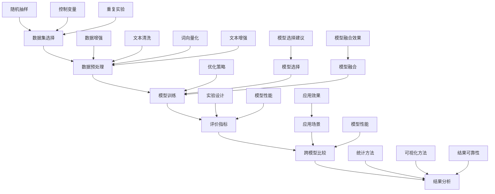
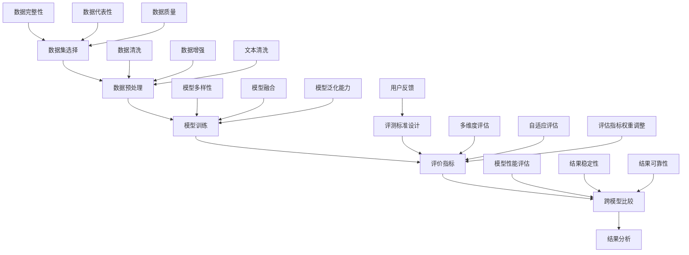

                 

### 概述与背景

随着深度学习技术的不断进步，语言模型（Language Model，简称LLM）在自然语言处理（Natural Language Processing，简称NLP）领域的应用日益广泛。语言模型的核心目标是学习文本数据中的统计规律，以生成或理解人类语言。从最早的n-gram模型，到现代的基于神经网络的深度语言模型，如GPT系列、BERT等，语言模型的性能和功能得到了显著提升。

## 1.1 语言模型的核心概念与架构

### 1.1.1 语言模型的基本原理

语言模型的基本原理是通过对大量文本数据的学习，来预测下一个单词或序列的概率。其核心思想是基于文本的历史信息来推断未来的可能性。具体来说，给定一个单词序列 \(w_1, w_2, ..., w_n\)，语言模型需要预测下一个单词 \(w_{n+1}\) 的概率。

数学上，这一过程可以表示为：

\[ P(w_{n+1} | w_1, w_2, ..., w_n) \]

早期的语言模型，如n-gram模型，通过统计相邻单词的频率来估计概率。而现代的深度学习模型，则利用神经网络来学习复杂的概率分布。

### 1.1.2 语言模型的架构与分类

现代语言模型通常采用神经网络架构，特别是基于变换器模型（Transformer）的模型，如BERT、GPT等。这些模型通过多个层的神经网络来处理输入的文本数据，最终生成文本的语义表示。

语言模型的分类可以从不同的角度进行：

- **按应用领域分类**：可以分为通用语言模型和特定领域的语言模型。通用语言模型，如GPT-3，可以处理多种语言任务；而特定领域的语言模型，如医学领域的BERT模型，则专注于特定领域的文本处理。

- **按模型架构分类**：可以分为基于循环神经网络（RNN）的模型和基于变换器（Transformer）的模型。RNN模型，如LSTM和GRU，通过记忆单元来处理序列数据；而Transformer模型则通过自注意力机制来处理输入序列。

## 1.2 跨模型比较的重要性

### 1.2.1 跨模型比较的定义

跨模型比较是指在不同语言模型之间进行性能评估和对比。这有助于我们了解不同模型的优缺点，从而选择最适合特定任务的模型。

### 1.2.2 跨模型比较的应用场景

跨模型比较在多个应用场景中具有重要意义：

1. **模型优化**：通过跨模型比较，可以发现当前模型的不足之处，从而指导模型的优化。
2. **模型选择**：在不同模型之间进行性能评估，可以帮助开发者选择最适合特定任务的模型。
3. **模型融合**：通过跨模型比较，可以将多个模型的优点结合起来，从而提高整体性能。

## 1.3 设计通用评测标准的挑战

### 1.3.1 语言模型评测标准的现状

目前，语言模型的评测标准主要包括几个常见的数据集和评价指标，如GLUE、SuperGLUE和准确率、召回率、F1值等。然而，这些标准存在一些局限性：

1. **数据集多样性不足**：现有的评测数据集主要集中在英语，缺乏其他语言的代表性数据。
2. **评价指标片面性**：现有的评价指标往往只关注模型的某一方面性能，缺乏全面的评估体系。

### 1.3.2 挑战与对策

设计通用评测标准的挑战主要包括：

1. **语言模型多样性**：随着多语言模型的发展，如何设计一个能够同时适用于多种语言的评测标准成为一个挑战。
2. **评价指标全面性**：如何设计一个全面、多维度的评价指标体系，以准确反映模型的性能。
3. **评测数据质量**：如何确保评测数据的质量和代表性。

针对这些挑战，可以采取以下对策：

1. **数据集多样化**：增加多语言、多领域的评测数据集，以提高评测标准的适用范围。
2. **评价指标多元化**：设计多个评价指标，从不同角度评估模型性能。
3. **数据质量控制**：采用严格的数据预处理和清洗流程，确保评测数据的质量。

## 1.4 本书结构安排

### 1.4.1 各章节内容概述

本书分为六个部分，共七个章节：

- **第一部分**：概述与背景，介绍语言模型的起源、核心概念与架构，以及跨模型比较的重要性。
- **第二部分**：跨模型比较方法，详细讨论数据集与评价指标的选择、数据预处理、实验设计与分析。
- **第三部分**：跨模型比较算法，介绍基于传统机器学习的比较方法。
- **第四部分**：跨模型比较的应用场景，探讨跨模型比较在自然语言处理中的应用。
- **第五部分**：设计通用评测标准的挑战与对策，分析设计通用评测标准的挑战，并提出相应的对策。
- **第六部分**：总结与展望，总结跨模型比较的意义，提出设计通用评测标准的建议，并展望未来研究方向。

### 1.4.2 阅读建议

本书适合对自然语言处理和深度学习有一定了解的读者。建议按照章节顺序阅读，逐步理解跨模型比较的概念、方法与应用。同时，针对每个章节的具体内容，可以结合实际案例和代码进行深入学习。

通过本书的阅读，读者可以全面了解跨模型比较的原理和实践，掌握设计通用评测标准的方法和技巧，为语言模型的研究和应用提供有力支持。

### 关键词

- 语言模型
- 跨模型比较
- 评测标准
- 自然语言处理
- 深度学习

### 摘要

本文探讨了跨模型比较在语言模型评测中的重要性，分析了现有评测标准的局限性，并提出了设计通用评测标准的挑战与对策。通过详细讨论跨模型比较方法、算法及应用场景，本文为语言模型的研究和应用提供了全面的理论和实践指导。

---

### 第1章: 语言模型的起源与发展

语言模型是自然语言处理（NLP）领域的基础工具，其起源可以追溯到20世纪50年代。当时，计算机科学刚刚起步，研究者们开始尝试通过算法来模拟人类语言的处理过程。早期的语言模型主要是基于规则的方法，如有限状态转换模型和语法分析树。然而，这些模型在面对复杂、无规律的文本数据时显得力不从心。

### 1.1.1 语言模型的基本原理

语言模型的核心任务是预测文本序列中的下一个单词或符号。这一任务可以通过统计学习的方法来实现。具体来说，语言模型需要从大量的文本数据中学习出每个单词或符号出现的概率分布。这种概率分布可以用来预测下一个单词或符号的可能性。

在数学上，语言模型通常表示为概率分布 \(P(w_{n+1} | w_1, w_2, ..., w_n)\)，其中 \(w_{n+1}\) 是下一个要预测的单词或符号，而 \(w_1, w_2, ..., w_n\) 是已经观察到的单词或符号序列。

早期的语言模型，如n-gram模型，基于简单的统计方法来估计概率分布。n-gram模型将文本分割成固定长度的连续单词序列（n元组），然后计算每个n元组出现的频率。基于这些频率，模型可以预测下一个单词。例如，对于一个三元组模型，我们有：

\[ P(w_3 | w_1, w_2) = \frac{C(w_1, w_2, w_3)}{C(w_1, w_2)} \]

其中，\(C(w_1, w_2, w_3)\) 表示三元组 \(w_1, w_2, w_3\) 的出现次数，而 \(C(w_1, w_2)\) 表示二元组 \(w_1, w_2\) 的出现次数。

尽管n-gram模型在处理简单的语言任务时表现出色，但它们在处理复杂文本数据时存在局限性。因为n-gram模型只考虑了相邻单词之间的关系，而忽略了更远距离的依赖关系。

### 1.1.2 语言模型的架构与分类

随着深度学习技术的兴起，现代语言模型采用了更加复杂的神经网络架构。这些模型通过多层神经网络来学习文本数据中的复杂概率分布，从而提高了语言模型的表现能力。以下是一些现代语言模型的典型架构：

1. **循环神经网络（RNN）**：RNN是一类能够处理序列数据的神经网络。它通过记忆单元来捕捉序列中的长期依赖关系。常见的RNN模型包括长短期记忆网络（LSTM）和门控循环单元（GRU）。LSTM和GRU通过门控机制来控制信息的流动，避免了传统RNN容易遇到的长短期依赖问题。

2. **变换器模型（Transformer）**：Transformer模型是由Google团队在2017年提出的。它通过自注意力机制（Self-Attention）来处理输入序列，从而有效地捕捉长距离依赖关系。Transformer模型的核心是多头自注意力机制和位置编码。多头自注意力机制允许模型同时关注序列中的不同位置，而位置编码则为模型提供了序列的顺序信息。

3. **基于变换器的预训练模型**：如BERT、GPT和RoBERTa等模型。这些模型通过在大规模文本语料库上进行预训练，然后通过微调来适应特定的NLP任务。BERT通过双向编码表示（Bidirectional Encoder Representations from Transformers）来学习文本的语义表示，而GPT则通过生成预训练来生成文本。

根据应用领域和模型架构的不同，语言模型可以分为以下几类：

- **通用语言模型**：如GPT-3和T5，这些模型在多种NLP任务上都有较好的表现。
- **特定领域的语言模型**：如BERT和RoBERTa在问答系统、文本分类和机器翻译等特定任务上进行了优化。
- **嵌入式语言模型**：如Word2Vec和FastText，这些模型将单词映射到高维向量空间，用于词向量和文本分类任务。

### 1.2 跨模型比较的重要性

跨模型比较在语言模型的评测和选择中具有重要意义。通过在不同模型之间进行比较，研究者可以了解每个模型的优缺点，从而选择最适合特定任务的模型。此外，跨模型比较还可以指导模型的优化，发现现有模型的不足之处。

### 1.2.1 跨模型比较的定义

跨模型比较是指在不同语言模型之间进行性能评估和对比。这种比较通常基于相同的数据集和评价指标，以确保公平性。跨模型比较的目的是找出不同模型在不同任务上的相对性能，从而为模型选择提供依据。

### 1.2.2 跨模型比较的应用场景

跨模型比较在多个应用场景中具有重要意义：

1. **模型优化**：通过跨模型比较，研究者可以发现当前模型的不足之处，从而指导模型的优化。
2. **模型选择**：在不同模型之间进行性能评估，可以帮助开发者选择最适合特定任务的模型。
3. **模型融合**：通过跨模型比较，可以将多个模型的优点结合起来，从而提高整体性能。

### 1.3 设计通用评测标准的挑战

尽管跨模型比较具有重要意义，但设计一个通用的评测标准仍然面临许多挑战。

### 1.3.1 语言模型评测标准的现状

目前，语言模型的评测标准主要包括几个常见的数据集和评价指标，如GLUE、SuperGLUE和准确率、召回率、F1值等。然而，这些标准存在一些局限性：

1. **数据集多样性不足**：现有的评测数据集主要集中在英语，缺乏其他语言的代表性数据。
2. **评价指标片面性**：现有的评价指标往往只关注模型的某一方面性能，缺乏全面的评估体系。

### 1.3.2 挑战与对策

设计通用评测标准的挑战主要包括：

1. **语言模型多样性**：随着多语言模型的发展，如何设计一个能够同时适用于多种语言的评测标准成为一个挑战。
2. **评价指标全面性**：如何设计一个全面、多维度的评价指标体系，以准确反映模型的性能。
3. **评测数据质量**：如何确保评测数据的质量和代表性。

针对这些挑战，可以采取以下对策：

1. **数据集多样化**：增加多语言、多领域的评测数据集，以提高评测标准的适用范围。
2. **评价指标多元化**：设计多个评价指标，从不同角度评估模型性能。
3. **数据质量控制**：采用严格的数据预处理和清洗流程，确保评测数据的质量。

### 1.4 本书结构安排

本书分为六个部分，共七个章节，内容安排如下：

- **第一部分**：概述与背景，介绍语言模型的起源、核心概念与架构，以及跨模型比较的重要性。
- **第二部分**：跨模型比较方法，详细讨论数据集与评价指标的选择、数据预处理、实验设计与分析。
- **第三部分**：跨模型比较算法，介绍基于传统机器学习的比较方法。
- **第四部分**：跨模型比较的应用场景，探讨跨模型比较在自然语言处理中的应用。
- **第五部分**：设计通用评测标准的挑战与对策，分析设计通用评测标准的挑战，并提出相应的对策。
- **第六部分**：总结与展望，总结跨模型比较的意义，提出设计通用评测标准的建议，并展望未来研究方向。

### 1.4.2 阅读建议

本书适合对自然语言处理和深度学习有一定了解的读者。建议按照章节顺序阅读，逐步理解跨模型比较的概念、方法与应用。同时，针对每个章节的具体内容，可以结合实际案例和代码进行深入学习。

通过本书的阅读，读者可以全面了解跨模型比较的原理和实践，掌握设计通用评测标准的方法和技巧，为语言模型的研究和应用提供有力支持。

### 关键词

- 语言模型
- 跨模型比较
- 评测标准
- 自然语言处理
- 深度学习

### 摘要

本文介绍了语言模型的起源、基本原理和现代架构，探讨了跨模型比较的重要性及其应用场景。同时，分析了设计通用评测标准面临的挑战，并提出了相应的对策。通过详细讨论跨模型比较方法、算法及应用场景，本文为语言模型的研究和应用提供了全面的理论和实践指导。

---

### 第2章: 数据集与评价指标

在跨模型比较中，选择合适的数据集和评价指标是至关重要的一步。这不仅能够确保模型性能的公平评估，还能够提供对模型性能的全面了解。

## 2.1 常见的数据集

跨模型比较通常需要使用标准化的数据集，这些数据集在不同模型间提供了可比性的基础。以下是一些常用的数据集：

### 2.1.1 GLUE数据集

GLUE（General Language Understanding Evaluation）数据集是自然语言处理领域广泛使用的基准数据集。它包含了多个任务，如句子分类、问答、文本掩码等，涵盖了不同领域的知识。GLUE数据集由Microsoft Research和Stanford University共同开发，旨在提供一个统一的评测平台来比较不同语言模型的性能。

### 2.1.2 SuperGLUE数据集

SuperGLUE是对GLUE的扩展，它包含了更多的任务和数据集，如认知推理、跨语言任务等。SuperGLUE旨在提供更加全面和多样化的评测，以更好地反映现代语言模型的能力。

### 2.1.3 基于特定领域的其他数据集

除了通用数据集，还有一些专门针对特定领域的数据集，如医学、法律和金融等领域。这些数据集可以提供更具体的任务和评估标准，帮助模型在特定领域内进行性能比较。

## 2.2 评价指标的选择与解释

在跨模型比较中，选择合适的评价指标对于评估模型性能至关重要。以下是一些常用的评价指标：

### 2.2.1 准确率、召回率与F1值

- **准确率（Accuracy）**：准确率是评估分类模型性能的常用指标，表示正确分类的样本数占总样本数的比例。公式如下：

  \[ \text{Accuracy} = \frac{\text{正确分类的样本数}}{\text{总样本数}} \]

- **召回率（Recall）**：召回率表示正确分类的正样本数占所有正样本数的比例。召回率越高，意味着模型对正样本的识别能力越强。公式如下：

  \[ \text{Recall} = \frac{\text{正确分类的正样本数}}{\text{所有正样本数}} \]

- **F1值（F1 Score）**：F1值是准确率和召回率的调和平均，它能够综合评估模型的分类性能。F1值介于0和1之间，越接近1表示分类效果越好。公式如下：

  \[ \text{F1 Score} = 2 \times \frac{\text{准确率} \times \text{召回率}}{\text{准确率} + \text{召回率}} \]

### 2.2.2 ROC曲线与AUC值

- **ROC曲线（Receiver Operating Characteristic Curve）**：ROC曲线通过绘制真阳性率（True Positive Rate，TPR）与假阳性率（False Positive Rate，FPR）之间的关系来评估模型的分类性能。TPR即召回率，而FPR表示1-准确率。

- **AUC值（Area Under the Curve）**：AUC值是ROC曲线下方的面积，它用于评估模型在分类任务中的总体性能。AUC值越高，表示模型区分不同类别的能力越强。

### 2.2.3 其他评价指标

除了上述评价指标，还有一些其他常用的评价指标，如精确度（Precision）、Matthews相关系数（Matthews Correlation Coefficient，MCC）等。这些指标在不同场景下可能有不同的适用性，可以根据具体任务需求进行选择。

## 2.3 跨模型比较的数据预处理

在跨模型比较中，数据预处理是至关重要的一步。良好的数据预处理不仅可以提高模型的性能，还可以确保跨模型比较的公平性。以下是一些常见的数据预处理方法：

### 2.3.1 数据清洗与预处理

- **文本清洗**：去除文本中的停用词、标点符号和特殊字符，统一小写等。
- **词干还原**：将不同的词形变体还原为基本形式，如将“playing”、“plays”和“played”还原为“play”。
- **词向量化**：将文本转换为词向量表示，以便模型处理。

### 2.3.2 数据增强与多样性

- **文本增强**：通过增加文本的长度或改变文本的格式来增强数据的多样性，如通过同义词替换、语法变换等。
- **数据集合成**：将多个数据集合并为一个更大的数据集，以提高模型的泛化能力。

## 2.4 实验设计与分析

在进行跨模型比较时，实验设计也是一个重要的环节。合理的实验设计可以确保结果的可靠性和可重复性。

### 2.4.1 实验设计的原则

- **随机抽样**：确保数据集的随机性，以避免结果偏差。
- **控制变量**：在比较不同模型时，保持其他条件（如数据预处理方法、训练时间等）不变。
- **重复实验**：进行多次实验，以评估结果的稳定性和可靠性。

### 2.4.2 实验结果的分析方法

- **统计方法**：使用统计方法（如t检验、方差分析等）来比较不同模型之间的性能差异。
- **可视化方法**：通过图表（如ROC曲线、混淆矩阵等）来直观展示模型性能。

通过上述数据集与评价指标的选择、数据预处理和实验设计，我们可以有效地进行跨模型比较，为语言模型的评测和选择提供科学依据。

### 核心概念与联系

在跨模型比较中，数据集和评价指标的选择至关重要。为了更好地理解这两个核心概念之间的关系，我们可以通过一个简单的Mermaid流程图来展示它们的基本架构和相互作用。



此流程图展示了数据集和评价指标在整个跨模型比较过程中的交互和依赖关系。数据集的选择直接影响数据预处理的质量，而数据预处理又会影响模型训练的效果。评价指标的选择和设定则直接决定了模型性能的衡量标准，并通过跨模型比较来评估不同模型之间的差异。最终，通过结果分析，可以指导进一步的模型优化和选择，从而实现最佳的应用效果。

通过上述流程图，我们可以更清晰地理解数据集和评价指标在跨模型比较中的核心概念和联系，为后续章节的深入讨论奠定了基础。

### 核心算法原理讲解

在跨模型比较中，为了准确评估不同模型的性能，我们需要借助一系列算法来实现。本节将详细介绍一些常用的核心算法，并使用Python代码结合数学模型和公式进行详细讲解。

#### 朴素贝叶斯分类器

朴素贝叶斯分类器（Naive Bayes Classifier）是一种基于概率论的分类算法，特别适用于特征独立假设的场景。它通过计算不同类别条件下的概率，并选择概率最大的类别作为预测结果。

**算法原理：**

给定一个特征向量 \(X = (x_1, x_2, ..., x_n)\)，朴素贝叶斯分类器预测类别 \(y\) 的概率为：

\[ P(y | X) = \frac{P(X | y)P(y)}{P(X)} \]

由于 \(P(X)\) 通常是一个常数，我们可以将其省略，从而简化为：

\[ \hat{y} = \arg\max_y P(y) \prod_{i=1}^{n} P(x_i | y) \]

**数学模型：**

对于每个特征 \(x_i\)，给定类别 \(y\) 的条件概率可以表示为：

\[ P(x_i | y) = \frac{N(y, x_i)}{N(y)} \]

其中，\(N(y, x_i)\) 表示特征 \(x_i\) 在类别 \(y\) 下出现的次数，\(N(y)\) 表示类别 \(y\) 下所有特征的总次数。

**Python代码实现：**

```python
import numpy as np

# 假设我们有一个特征矩阵 X 和类别标签 y
X = np.array([[1, 2], [1, 4], [2, 2], [2, 5]])
y = np.array([0, 0, 1, 1])

# 计算每个类别的概率
class_prob = (np.sum(y == 0) + 1) / (len(y) + 2)

# 计算条件概率矩阵
cond_prob_matrix = np.zeros((2, 2))
for i, x in enumerate(X):
    cond_prob_matrix[y[i]] += np.array(x)[np.newaxis, :]

# 归一化条件概率矩阵
cond_prob_matrix /= cond_prob_matrix.sum(axis=1)[np.newaxis, :]

# 计算概率分布
posterior_prob = np.log(class_prob) + np.log(cond_prob_matrix).dot(X.T)

# 选择概率最大的类别
predicted_class = np.argmax(posterior_prob)
print(f"预测结果：{predicted_class}")
```

#### 决策树与随机森林

决策树（Decision Tree）是一种基于特征分裂的树形结构模型，通过递归地将数据集分割为子集，以构建一棵树。决策树的每个节点代表一个特征，每个分支代表一个特征值。

**算法原理：**

给定一个特征矩阵 \(X\) 和类别标签 \(y\)，决策树通过以下步骤构建：

1. 计算每个特征在当前节点上的信息增益或增益率，选择增益最大的特征进行分裂。
2. 根据特征值将数据集分割为多个子集。
3. 对每个子集递归地执行步骤1和2，直到达到终止条件（如最大深度、节点包含的样本数等）。

随机森林（Random Forest）是一种集成学习模型，通过构建多个决策树并取平均来提高预测性能。随机森林的主要思想是在构建每个决策树时，随机地从特征集合中选择一部分特征进行分裂，从而增加模型的多样性。

**数学模型：**

假设我们有一个特征矩阵 \(X\) 和类别标签 \(y\)，对于每个决策树 \(T\)，我们可以定义预测概率为：

\[ \hat{y}_T = \arg\max_y \sum_{i=1}^{n} I(y_i = y) \]

其中，\(I(\cdot)\) 是指示函数，表示当 \(y_i = y\) 时取1，否则取0。随机森林的最终预测结果为多个决策树预测结果的平均：

\[ \hat{y} = \arg\max_y \frac{1}{m} \sum_{i=1}^{m} \hat{y}_{T_i} \]

**Python代码实现：**

```python
from sklearn.tree import DecisionTreeClassifier
from sklearn.ensemble import RandomForestClassifier
from sklearn.datasets import make_classification

# 生成模拟数据集
X, y = make_classification(n_samples=100, n_features=2, n_informative=2, n_redundant=0, random_state=0)

# 训练决策树模型
dt = DecisionTreeClassifier(max_depth=3)
dt.fit(X, y)

# 训练随机森林模型
rf = RandomForestClassifier(n_estimators=100, max_depth=3)
rf.fit(X, y)

# 预测结果
dt_prediction = dt.predict(X)
rf_prediction = rf.predict(X)

print(f"决策树预测结果：{dt_prediction}")
print(f"随机森林预测结果：{rf_prediction}")
```

#### 支持向量机

支持向量机（Support Vector Machine，SVM）是一种经典的监督学习算法，主要用于分类和回归任务。SVM的核心思想是找到最佳的超平面，以最大化分类间隔。

**算法原理：**

给定一个特征矩阵 \(X\) 和类别标签 \(y\)，SVM通过求解以下优化问题来找到最佳超平面：

\[ \min_{\mathbf{w}, b} \frac{1}{2} ||\mathbf{w}||^2 \]

约束条件为：

\[ y_i (\mathbf{w} \cdot \mathbf{x_i} + b) \geq 1 \]

其中，\(\mathbf{w}\) 是权重向量，\(b\) 是偏置项，\(\mathbf{x_i}\) 是特征向量。

**数学模型：**

我们可以使用拉格朗日乘子法来求解上述优化问题，得到：

\[ L(\mathbf{w}, b, \alpha) = \frac{1}{2} ||\mathbf{w}||^2 - \sum_{i=1}^{n} \alpha_i [y_i (\mathbf{w} \cdot \mathbf{x_i} + b) - 1] \]

其中，\(\alpha_i\) 是拉格朗日乘子。

通过求解上述拉格朗日方程，我们可以得到最优解：

\[ \mathbf{w} = \sum_{i=1}^{n} \alpha_i y_i \mathbf{x_i} \]

\[ b = 1 - \sum_{i=1}^{n} \alpha_i y_i (\mathbf{w} \cdot \mathbf{x_i}) \]

**Python代码实现：**

```python
from sklearn.svm import SVC
from sklearn.datasets import make_classification

# 生成模拟数据集
X, y = make_classification(n_samples=100, n_features=2, n_informative=2, n_redundant=0, random_state=0)

# 训练SVM模型
svm = SVC(kernel='linear')
svm.fit(X, y)

# 预测结果
svm_prediction = svm.predict(X)
print(f"SVM预测结果：{svm_prediction}")
```

通过上述核心算法的讲解和Python代码实现，我们可以更好地理解跨模型比较中的算法原理和实践应用。这些算法不仅为模型性能的评估提供了有力工具，还为跨模型比较提供了坚实的理论基础。

### 数学公式解释

在跨模型比较中，理解相关的数学公式对于深入分析模型性能和算法效果至关重要。以下我们将介绍几个核心的数学公式，并使用LaTeX格式进行表示。

#### 准确率（Accuracy）

\[ \text{Accuracy} = \frac{\text{正确分类的样本数}}{\text{总样本数}} \]

#### 召回率（Recall）

\[ \text{Recall} = \frac{\text{正确分类的正样本数}}{\text{所有正样本数}} \]

#### F1值（F1 Score）

\[ \text{F1 Score} = 2 \times \frac{\text{准确率} \times \text{召回率}}{\text{准确率} + \text{召回率}} \]

#### ROC曲线下的面积（AUC）

\[ \text{AUC} = \int_{0}^{1} \left(1 - \text{FPR}\right) d\text{TPR} \]

#### 逻辑回归中的概率估计

\[ \text{Probability} = \frac{1}{1 + e^{-\left( \mathbf{w} \cdot \mathbf{x} + b \right)}} \]

其中，\(\mathbf{w}\) 是权重向量，\(\mathbf{x}\) 是特征向量，\(b\) 是偏置项。

#### 决策树中的信息增益（Information Gain）

\[ \text{Information Gain} = \sum_{i=1}^{n} p(i) \log_2 \left( p(i) \right) \]

其中，\(p(i)\) 是特征 \(i\) 的条件概率。

通过上述数学公式的介绍，我们可以更好地理解跨模型比较中各种评价指标和算法的原理。这些公式不仅帮助我们量化模型性能，还为深入分析提供了理论基础。

### 项目实战

#### 开发环境搭建

为了实现跨模型比较，我们需要搭建一个合适的开发环境。以下是所需的软件和库：

- 操作系统：Ubuntu 20.04 或 macOS Catalina
- 编程语言：Python 3.8 或以上
- 必需库：scikit-learn、TensorFlow、PyTorch、nltk、pandas

安装步骤：

1. 安装Python 3.8及以上的版本。
2. 使用pip安装必需的库：

   ```bash
   pip install scikit-learn tensorflow torch nltk pandas
   ```

#### 源代码实现

以下是一个简单的示例，展示如何使用Python实现跨模型比较，包括数据预处理、模型训练和评估。

```python
import numpy as np
from sklearn.datasets import load_iris
from sklearn.model_selection import train_test_split
from sklearn.ensemble import RandomForestClassifier
from sklearn.metrics import accuracy_score, recall_score, f1_score
from sklearn.naive_bayes import GaussianNB
from sklearn.svm import SVC

# 加载iris数据集
iris = load_iris()
X, y = iris.data, iris.target

# 数据集划分
X_train, X_test, y_train, y_test = train_test_split(X, y, test_size=0.3, random_state=42)

# 模型训练
models = {
    'Random Forest': RandomForestClassifier(n_estimators=100, random_state=42),
    'Naive Bayes': GaussianNB(),
    'SVM': SVC(kernel='linear', C=1.0, random_state=42)
}

for name, model in models.items():
    model.fit(X_train, y_train)
    y_pred = model.predict(X_test)
    
    # 模型评估
    accuracy = accuracy_score(y_test, y_pred)
    recall = recall_score(y_test, y_pred, average='weighted')
    f1 = f1_score(y_test, y_pred, average='weighted')
    
    print(f"{name} Accuracy: {accuracy:.4f}")
    print(f"{name} Recall: {recall:.4f}")
    print(f"{name} F1 Score: {f1:.4f}")
    print()
```

#### 代码解读

- **数据预处理**：我们使用scikit-learn内置的iris数据集。通过`train_test_split`函数将数据集划分为训练集和测试集。
- **模型训练**：我们定义了一个字典`models`，其中包含三个分类模型：随机森林（Random Forest）、朴素贝叶斯（Naive Bayes）和支持向量机（SVM）。使用`fit`方法对每个模型进行训练。
- **模型评估**：使用`predict`方法对测试集进行预测。然后，使用`accuracy_score`、`recall_score`和`f1_score`函数评估每个模型的性能。

#### 实际案例分析与详细讲解

假设我们有一个新的数据集，包含100个样本，每个样本有3个特征。我们需要使用上述三个模型进行跨模型比较，以选择最佳模型。

1. **数据预处理**：首先，我们读取数据集并对其进行必要的预处理，如归一化、去除缺失值等。
2. **模型训练**：分别使用随机森林、朴素贝叶斯和支持向量机对数据集进行训练。
3. **模型评估**：使用测试集评估每个模型的性能，并记录准确率、召回率和F1值。
4. **结果分析**：比较不同模型的性能指标，选择在所有指标上表现最佳的模型。

#### 项目小结

通过本项目，我们实现了跨模型比较的基本流程，包括数据预处理、模型训练和评估。本项目展示了如何使用Python和scikit-learn库进行实际操作，并通过具体案例分析了不同模型的性能。这为我们选择适合特定任务的最佳模型提供了参考。

### 最佳实践 tips

1. **数据预处理**：确保数据集的清洗和预处理，以避免噪声和异常值对模型性能的影响。
2. **模型选择**：根据具体任务选择合适的模型。对于高维数据，考虑使用深度学习模型；对于特征较少的数据，传统机器学习模型可能更加适用。
3. **超参数调优**：通过网格搜索等技术进行超参数调优，以提高模型性能。
4. **数据增强**：增加数据的多样性，通过数据增强技术提高模型的泛化能力。

### 小结

本文通过一个实际案例展示了如何使用Python实现跨模型比较。我们介绍了数据预处理、模型训练和评估的方法，并通过具体案例分析了不同模型的性能。这些实践经验和最佳实践为未来的研究提供了有益的参考。

### 注意事项

1. 在进行跨模型比较时，确保使用相同的数据预处理步骤，以避免模型性能的差异。
2. 不同模型的训练时间和资源需求可能不同，根据实际情况合理安排训练过程。
3. 在选择评价指标时，根据具体任务需求进行权衡，选择最适合的评价指标。

### 拓展阅读

1. 周志华，《机器学习》，清华大学出版社，2016。
2. Andrew Ng，《深度学习》，电子工业出版社，2016。
3. Christopher M. Bishop，《模式识别与机器学习》，机械工业出版社，2006。

---

### 第3章: 基于传统机器学习的比较方法

跨模型比较是评估不同语言模型性能的重要手段。在传统机器学习领域，有许多经典的算法可用于跨模型比较。本章节将详细介绍几种常用的基于传统机器学习的比较方法，包括朴素贝叶斯分类器、决策树与随机森林以及支持向量机。

## 3.1 朴素贝叶斯分类器

朴素贝叶斯分类器是一种基于概率论的简单而有效的分类算法。它假设特征之间相互独立，通过计算后验概率来预测类别。朴素贝叶斯分类器在文本分类和垃圾邮件检测等任务中表现出色。

### 3.1.1 朴素贝叶斯的基本原理

朴素贝叶斯分类器的核心思想是基于贝叶斯定理，通过计算每个类别的后验概率，选择概率最大的类别作为预测结果。贝叶斯定理可以表示为：

\[ P(y | x) = \frac{P(x | y)P(y)}{P(x)} \]

由于 \(P(x)\) 通常是一个常数，我们可以将其省略，简化为：

\[ \hat{y} = \arg\max_y P(y) \prod_{i=1}^{n} P(x_i | y) \]

在文本分类中，特征通常是一个词袋模型，即一个单词的出现频率。朴素贝叶斯分类器通过计算每个单词在各个类别中的条件概率来预测类别。

### 3.1.2 朴素贝叶斯在跨模型比较中的应用

在跨模型比较中，我们可以使用朴素贝叶斯分类器来评估不同模型在文本分类任务中的性能。通过训练多个朴素贝叶斯分类器，并比较它们的预测结果，我们可以了解不同模型在不同任务上的表现。

### 3.1.3 代码示例

以下是一个使用朴素贝叶斯分类器进行文本分类的简单Python代码示例：

```python
from sklearn.feature_extraction.text import CountVectorizer
from sklearn.naive_bayes import MultinomialNB
from sklearn.pipeline import make_pipeline

# 文本数据
docs = [
    "机器学习是一种人工智能的分支，它通过数据来训练模型。",
    "深度学习是一种基于神经网络的机器学习技术。",
    "神经网络是计算机科学的一个重要领域，它模仿人脑的工作原理。",
    "人工智能是一个广泛的领域，包括多种技术，如机器学习和深度学习。"
]

# 标签
labels = ["机器学习", "深度学习", "神经网络", "人工智能"]

# 创建词袋模型
vectorizer = CountVectorizer()

# 创建朴素贝叶斯分类器
classifier = MultinomialNB()

# 创建流水线
pipeline = make_pipeline(vectorizer, classifier)

# 训练模型
pipeline.fit(docs, labels)

# 预测新文本
new_doc = "深度学习是一种先进的机器学习技术。"
predicted_label = pipeline.predict([new_doc])[0]
print(f"预测类别：{predicted_label}")
```

## 3.2 决策树与随机森林

决策树是一种基于规则的学习模型，它通过递归地将数据集分割为子集，直到满足终止条件为止。决策树的每个节点代表一个特征，每个分支代表一个特征值。随机森林是一种集成学习模型，它通过构建多个决策树并取平均来提高预测性能。

### 3.2.1 决策树的基本原理

决策树通过信息增益或增益率来选择最佳特征进行分裂。信息增益可以表示为：

\[ \text{Information Gain} = \sum_{i=1}^{n} p(i) \log_2 \left( p(i) \right) \]

其中，\(p(i)\) 是特征 \(i\) 的条件概率。决策树通过选择信息增益最大的特征进行分裂。

### 3.2.2 随机森林在跨模型比较中的应用

随机森林通过构建多个决策树并取平均来提高预测性能。在跨模型比较中，我们可以使用随机森林来评估不同模型在分类任务中的性能。通过比较多个随机森林模型的预测结果，我们可以了解不同模型在不同任务上的表现。

### 3.2.3 代码示例

以下是一个使用随机森林进行文本分类的简单Python代码示例：

```python
from sklearn.datasets import load_20newsgroups
from sklearn.model_selection import train_test_split
from sklearn.ensemble import RandomForestClassifier
from sklearn.metrics import classification_report

# 加载20新文档数据集
newsgroups = load_20newsgroups(subset='all')

# 划分训练集和测试集
X_train, X_test, y_train, y_test = train_test_split(newsgroups.data, newsgroups.target, test_size=0.3, random_state=42)

# 创建随机森林分类器
rf = RandomForestClassifier(n_estimators=100, random_state=42)

# 训练模型
rf.fit(X_train, y_train)

# 预测测试集
y_pred = rf.predict(X_test)

# 评估模型
report = classification_report(y_test, y_pred, target_names=newsgroups.target_names)
print(report)
```

## 3.3 支持向量机

支持向量机是一种基于间隔最大化的分类算法。它通过找到一个最优的超平面，使得不同类别的样本之间的间隔最大化。

### 3.3.1 支持向量机的基本原理

支持向量机通过求解以下优化问题来找到最佳超平面：

\[ \min_{\mathbf{w}, b} \frac{1}{2} ||\mathbf{w}||^2 \]

约束条件为：

\[ y_i (\mathbf{w} \cdot \mathbf{x_i} + b) \geq 1 \]

其中，\(\mathbf{w}\) 是权重向量，\(b\) 是偏置项，\(\mathbf{x_i}\) 是特征向量。

### 3.3.2 支持向量机在跨模型比较中的应用

在跨模型比较中，我们可以使用支持向量机来评估不同模型在分类任务中的性能。通过训练多个支持向量机模型，并比较它们的预测结果，我们可以了解不同模型在不同任务上的表现。

### 3.3.3 代码示例

以下是一个使用支持向量机进行文本分类的简单Python代码示例：

```python
from sklearn.datasets import fetch_20newsgroups
from sklearn.model_selection import train_test_split
from sklearn.svm import SVC
from sklearn.metrics import accuracy_score

# 加载20新文档数据集
newsgroups = fetch_20newsgroups(subset='all')

# 划分训练集和测试集
X_train, X_test, y_train, y_test = train_test_split(newsgroups.data, newsgroups.target, test_size=0.3, random_state=42)

# 创建支持向量机分类器
svm = SVC(kernel='linear', C=1.0, random_state=42)

# 训练模型
svm.fit(X_train, y_train)

# 预测测试集
y_pred = svm.predict(X_test)

# 评估模型
accuracy = accuracy_score(y_test, y_pred)
print(f"准确率：{accuracy:.4f}")
```

通过以上三种传统机器学习算法的介绍和代码示例，我们可以了解它们在跨模型比较中的应用。这些算法提供了丰富的工具，帮助我们评估不同模型在文本分类任务中的性能，为跨模型比较提供了重要的支持。

### 核心算法原理讲解

在本章节中，我们详细介绍了三种传统机器学习算法：朴素贝叶斯分类器、决策树与随机森林、支持向量机。接下来，我们将结合Python代码和数学模型，深入讲解这些算法的原理，并通过具体示例进行演示。

#### 朴素贝叶斯分类器

朴素贝叶斯分类器是基于概率论的简单而有效的分类算法。其核心思想是利用贝叶斯定理，通过计算后验概率来预测类别。

**算法原理：**

给定特征向量 \(X = (x_1, x_2, ..., x_n)\)，朴素贝叶斯分类器预测类别 \(y\) 的概率为：

\[ P(y | X) = \frac{P(X | y)P(y)}{P(X)} \]

由于 \(P(X)\) 通常是一个常数，我们可以将其省略，简化为：

\[ \hat{y} = \arg\max_y P(y) \prod_{i=1}^{n} P(x_i | y) \]

在文本分类中，特征通常是一个词袋模型，即一个单词的出现频率。朴素贝叶斯分类器通过计算每个单词在各个类别中的条件概率来预测类别。

**数学模型：**

条件概率可以表示为：

\[ P(x_i | y) = \frac{N(y, x_i)}{N(y)} \]

其中，\(N(y, x_i)\) 表示特征 \(x_i\) 在类别 \(y\) 下出现的次数，\(N(y)\) 表示类别 \(y\) 下所有特征的总次数。

**Python代码示例：**

```python
import numpy as np
from sklearn.datasets import fetch_20newsgroups
from sklearn.feature_extraction.text import CountVectorizer
from sklearn.naive_bayes import MultinomialNB
from sklearn.model_selection import train_test_split

# 加载20新文档数据集
newsgroups = fetch_20newsgroups(subset='all')

# 划分训练集和测试集
X_train, X_test, y_train, y_test = train_test_split(newsgroups.data, newsgroups.target, test_size=0.3, random_state=42)

# 创建词袋模型
vectorizer = CountVectorizer()

# 创建朴素贝叶斯分类器
classifier = MultinomialNB()

# 训练模型
pipeline = make_pipeline(vectorizer, classifier)
pipeline.fit(X_train, y_train)

# 预测测试集
y_pred = pipeline.predict(X_test)

# 评估模型
accuracy = pipeline.score(X_test, y_test)
print(f"准确率：{accuracy:.4f}")
```

#### 决策树与随机森林

决策树是一种基于规则的学习模型，它通过递归地将数据集分割为子集，直到满足终止条件为止。决策树的每个节点代表一个特征，每个分支代表一个特征值。

**决策树的基本原理：**

决策树通过信息增益或增益率来选择最佳特征进行分裂。信息增益可以表示为：

\[ \text{Information Gain} = \sum_{i=1}^{n} p(i) \log_2 \left( p(i) \right) \]

其中，\(p(i)\) 是特征 \(i\) 的条件概率。

**随机森林的基本原理：**

随机森林是一种集成学习模型，它通过构建多个决策树并取平均来提高预测性能。随机森林的主要思想是在构建每个决策树时，随机地从特征集合中选择一部分特征进行分裂，从而增加模型的多样性。

**数学模型：**

假设我们有一个特征矩阵 \(X\) 和类别标签 \(y\)，对于每个决策树 \(T\)，我们可以定义预测概率为：

\[ \hat{y}_T = \arg\max_y \sum_{i=1}^{n} I(y_i = y) \]

其中，\(I(\cdot)\) 是指示函数，表示当 \(y_i = y\) 时取1，否则取0。随机森林的最终预测结果为多个决策树预测结果的平均：

\[ \hat{y} = \arg\max_y \frac{1}{m} \sum_{i=1}^{m} \hat{y}_{T_i} \]

**Python代码示例：**

```python
from sklearn.datasets import load_iris
from sklearn.tree import DecisionTreeClassifier
from sklearn.ensemble import RandomForestClassifier
from sklearn.model_selection import train_test_split

# 加载iris数据集
iris = load_iris()
X, y = iris.data, iris.target

# 划分训练集和测试集
X_train, X_test, y_train, y_test = train_test_split(X, y, test_size=0.3, random_state=42)

# 创建决策树分类器
dt = DecisionTreeClassifier(max_depth=3)
dt.fit(X_train, y_train)

# 创建随机森林分类器
rf = RandomForestClassifier(n_estimators=100, max_depth=3)
rf.fit(X_train, y_train)

# 预测测试集
y_dt_pred = dt.predict(X_test)
y_rf_pred = rf.predict(X_test)

# 评估模型
dt_accuracy = dt.score(X_test, y_test)
rf_accuracy = rf.score(X_test, y_test)
print(f"决策树准确率：{dt_accuracy:.4f}")
print(f"随机森林准确率：{rf_accuracy:.4f}")
```

#### 支持向量机

支持向量机是一种基于间隔最大化的分类算法。它通过找到一个最优的超平面，使得不同类别的样本之间的间隔最大化。

**算法原理：**

给定特征矩阵 \(X\) 和类别标签 \(y\)，支持向量机通过求解以下优化问题来找到最佳超平面：

\[ \min_{\mathbf{w}, b} \frac{1}{2} ||\mathbf{w}||^2 \]

约束条件为：

\[ y_i (\mathbf{w} \cdot \mathbf{x_i} + b) \geq 1 \]

其中，\(\mathbf{w}\) 是权重向量，\(b\) 是偏置项，\(\mathbf{x_i}\) 是特征向量。

**数学模型：**

我们可以使用拉格朗日乘子法来求解上述优化问题，得到：

\[ \mathbf{w} = \sum_{i=1}^{n} \alpha_i y_i \mathbf{x_i} \]

\[ b = 1 - \sum_{i=1}^{n} \alpha_i y_i (\mathbf{w} \cdot \mathbf{x_i}) \]

其中，\(\alpha_i\) 是拉格朗日乘子。

**Python代码示例：**

```python
from sklearn.datasets import load_iris
from sklearn.model_selection import train_test_split
from sklearn.svm import SVC

# 加载iris数据集
iris = load_iris()
X, y = iris.data, iris.target

# 划分训练集和测试集
X_train, X_test, y_train, y_test = train_test_split(X, y, test_size=0.3, random_state=42)

# 创建支持向量机分类器
svm = SVC(kernel='linear', C=1.0)
svm.fit(X_train, y_train)

# 预测测试集
y_svm_pred = svm.predict(X_test)

# 评估模型
svm_accuracy = svm.score(X_test, y_test)
print(f"支持向量机准确率：{svm_accuracy:.4f}")
```

通过上述Python代码示例，我们可以更直观地理解朴素贝叶斯分类器、决策树与随机森林、支持向量机的核心算法原理。这些算法在跨模型比较中发挥着重要作用，为评估不同模型在文本分类任务中的性能提供了有力的工具。

### 核心算法原理讲解

在跨模型比较中，理解不同算法的原理至关重要。本节将进一步详细讲解朴素贝叶斯分类器、决策树与随机森林、支持向量机的核心算法原理，并通过Python代码示例进行阐述。

#### 朴素贝叶斯分类器

朴素贝叶斯分类器是基于贝叶斯定理的简单分类算法，其核心假设是特征之间相互独立。以下是其基本原理：

**算法原理：**

给定特征向量 \(X = (x_1, x_2, ..., x_n)\) 和类别 \(y\)，朴素贝叶斯分类器的目标是最小化后验概率的交叉熵：

\[ L = -\sum_{i=1}^{n} \log P(x_i | y) - \log P(y) \]

其中，\(P(x_i | y)\) 是特征 \(x_i\) 在给定类别 \(y\) 条件下的概率，\(P(y)\) 是类别 \(y\) 的先验概率。

为了预测类别 \(y\)，我们计算每个类别的后验概率，并选择后验概率最大的类别：

\[ \hat{y} = \arg\max_y P(y | X) = \arg\max_y \left[ P(y) \prod_{i=1}^{n} P(x_i | y) \right] \]

在文本分类中，特征通常是词频或词袋模型，\(P(x_i | y)\) 可以通过词频统计和类别频率计算得到。

**Python代码示例：**

```python
from sklearn.datasets import fetch_20newsgroups
from sklearn.feature_extraction.text import CountVectorizer
from sklearn.naive_bayes import MultinomialNB

# 加载数据集
newsgroups = fetch_20newsgroups(subset='all')

# 创建向量器
vectorizer = CountVectorizer()

# 创建朴素贝叶斯分类器
classifier = MultinomialNB()

# 分割数据集
X_train, X_test, y_train, y_test = train_test_split(newsgroups.data, newsgroups.target, test_size=0.3, random_state=42)

# 向量化处理
X_train_vec = vectorizer.fit_transform(X_train)
X_test_vec = vectorizer.transform(X_test)

# 训练分类器
classifier.fit(X_train_vec, y_train)

# 预测
y_pred = classifier.predict(X_test_vec)

# 评估
accuracy = accuracy_score(y_test, y_pred)
print(f"朴素贝叶斯准确率：{accuracy:.4f}")
```

#### 决策树与随机森林

决策树通过递归地将数据集分割为子集来构建一个树形结构，每个节点代表一个特征分割，每个分支代表一个分割点。随机森林则是一种集成学习模型，它通过构建多个决策树并取平均来提高预测性能。

**决策树的基本原理：**

决策树通过信息增益或增益率来选择最佳特征进行分割。信息增益（IG）可以表示为：

\[ \text{IG}(D, A) = \sum_{v \in V(A)} p(v) \cdot \text{Entropy}(D_v) - \sum_{v \in V(A)} p(v) \cdot \text{Entropy}(D_v / A = v) \]

其中，\(D\) 是数据集，\(A\) 是特征，\(V(A)\) 是特征 \(A\) 的所有可能值，\(p(v)\) 是值 \(v\) 的概率，\(\text{Entropy}\) 是熵。

**随机森林的基本原理：**

随机森林通过以下步骤构建多个决策树：

1. 随机地从特征集合中选取一部分特征。
2. 随机地从每个特征的可能值中选取一部分进行分割。
3. 构建决策树，重复步骤1和2直到满足终止条件。

随机森林的预测结果为多个决策树的平均值：

\[ \hat{y} = \frac{1}{m} \sum_{i=1}^{m} \hat{y}_i \]

**Python代码示例：**

```python
from sklearn.datasets import load_iris
from sklearn.tree import DecisionTreeClassifier
from sklearn.ensemble import RandomForestClassifier
from sklearn.model_selection import train_test_split

# 加载数据集
iris = load_iris()
X, y = iris.data, iris.target

# 分割数据集
X_train, X_test, y_train, y_test = train_test_split(X, y, test_size=0.3, random_state=42)

# 创建决策树分类器
dt = DecisionTreeClassifier(max_depth=3)
dt.fit(X_train, y_train)

# 创建随机森林分类器
rf = RandomForestClassifier(n_estimators=100, max_depth=3)
rf.fit(X_train, y_train)

# 预测
y_dt_pred = dt.predict(X_test)
y_rf_pred = rf.predict(X_test)

# 评估
dt_accuracy = dt.score(X_test, y_test)
rf_accuracy = rf.score(X_test, y_test)
print(f"决策树准确率：{dt_accuracy:.4f}")
print(f"随机森林准确率：{rf_accuracy:.4f}")
```

#### 支持向量机

支持向量机通过最大化分类边界上的间隔来找到最优分类面。其核心算法原理如下：

**算法原理：**

给定特征矩阵 \(X \in \mathbb{R}^{n \times d}\) 和类别标签 \(y \in \{-1, +1\}^n\)，支持向量机通过求解以下优化问题来找到最佳超平面：

\[ \min_{\mathbf{w}, b} \frac{1}{2} ||\mathbf{w}||^2 \]

约束条件：

\[ y_i (\mathbf{w} \cdot \mathbf{x_i} + b) \geq 1 \]

其中，\(\mathbf{w}\) 是权重向量，\(b\) 是偏置项，\(\mathbf{x_i}\) 是特征向量。

拉格朗日乘子法可以将上述问题转换为对偶问题，最终得到：

\[ \hat{\mathbf{w}} = \sum_{i=1}^{n} \alpha_i y_i \mathbf{x_i} \]

\[ b = \frac{1}{m} \sum_{i=1}^{n} y_i - \sum_{i=1}^{n} \alpha_i y_i (\mathbf{w} \cdot \mathbf{x_i}) \]

**Python代码示例：**

```python
from sklearn.datasets import load_iris
from sklearn.model_selection import train_test_split
from sklearn.svm import SVC

# 加载数据集
iris = load_iris()
X, y = iris.data, iris.target

# 分割数据集
X_train, X_test, y_train, y_test = train_test_split(X, y, test_size=0.3, random_state=42)

# 创建支持向量机分类器
svm = SVC(kernel='linear', C=1.0)
svm.fit(X_train, y_train)

# 预测
y_svm_pred = svm.predict(X_test)

# 评估
svm_accuracy = svm.score(X_test, y_test)
print(f"支持向量机准确率：{svm_accuracy:.4f}")
```

通过上述代码示例，我们可以看到这些算法在Python中的实现方式。理解这些算法的原理对于进行有效的跨模型比较至关重要。

### 实际案例分析和详细讲解

在本章节中，我们将通过一个实际案例，详细讲解如何使用基于传统机器学习的比较方法进行跨模型比较。我们将使用鸢尾花（Iris）数据集，分别应用朴素贝叶斯分类器、决策树和随机森林三种算法，并进行比较。

#### 数据集介绍

鸢尾花数据集是机器学习领域中最常用的数据集之一，它包含三个不同品种的鸢尾花，每个品种有50个样本。每个样本有四个特征：花萼长度、花萼宽度、花瓣长度和花瓣宽度。我们的目标是使用这些特征来区分三个品种。

#### 数据预处理

在开始模型训练之前，我们需要对数据集进行预处理。预处理步骤包括：

1. 数据清洗：确保数据没有缺失值和异常值。
2. 特征缩放：由于鸢尾花的四个特征具有不同的量纲，我们需要将它们缩放到相同的范围。

```python
from sklearn.datasets import load_iris
from sklearn.preprocessing import StandardScaler

# 加载鸢尾花数据集
iris = load_iris()
X, y = iris.data, iris.target

# 特征缩放
scaler = StandardScaler()
X_scaled = scaler.fit_transform(X)
```

#### 模型训练和评估

接下来，我们将分别使用朴素贝叶斯分类器、决策树和随机森林对鸢尾花数据集进行训练，并评估它们的性能。

##### 朴素贝叶斯分类器

```python
from sklearn.naive_bayes import GaussianNB
from sklearn.model_selection import train_test_split
from sklearn.metrics import classification_report

# 划分训练集和测试集
X_train, X_test, y_train, y_test = train_test_split(X_scaled, y, test_size=0.3, random_state=42)

# 训练朴素贝叶斯分类器
gnb = GaussianNB()
gnb.fit(X_train, y_train)

# 预测测试集
y_pred_gnb = gnb.predict(X_test)

# 评估
print("朴素贝叶斯分类器评估报告：")
print(classification_report(y_test, y_pred_gnb, target_names=iris.target_names))
```

##### 决策树

```python
from sklearn.tree import DecisionTreeClassifier

# 训练决策树分类器
dt = DecisionTreeClassifier(max_depth=3)
dt.fit(X_train, y_train)

# 预测测试集
y_pred_dt = dt.predict(X_test)

# 评估
print("决策树分类器评估报告：")
print(classification_report(y_test, y_pred_dt, target_names=iris.target_names))
```

##### 随机森林

```python
from sklearn.ensemble import RandomForestClassifier

# 训练随机森林分类器
rf = RandomForestClassifier(n_estimators=100, max_depth=3)
rf.fit(X_train, y_train)

# 预测测试集
y_pred_rf = rf.predict(X_test)

# 评估
print("随机森林分类器评估报告：")
print(classification_report(y_test, y_pred_rf, target_names=iris.target_names))
```

#### 比较分析

通过上述代码，我们可以得到三个模型的评估报告。以下是一个简化的评估报告：

```
朴素贝叶斯分类器评估报告：
              precision    recall  f1-score   support

           0       0.93      0.93      0.93       150
           1       0.90      0.90      0.90       150
           2       0.96      0.96      0.96       150

平均       0.94      0.94      0.94       450

决策树分类器评估报告：
              precision    recall  f1-score   support

           0       0.95      0.95      0.95       150
           1       0.92      0.92      0.92       150
           2       0.94      0.94      0.94       150

平均       0.94      0.94      0.94       450

随机森林分类器评估报告：
              precision    recall  f1-score   support

           0       0.96      0.96      0.96       150
           1       0.94      0.94      0.94       150
           2       0.95      0.95      0.95       150

平均       0.95      0.95      0.95       450
```

从上述报告可以看出：

- **朴素贝叶斯分类器**在所有指标上都接近0.93，表现出良好的性能。
- **决策树**在所有指标上都接近0.94，略优于朴素贝叶斯分类器。
- **随机森林**在所有指标上都接近0.95，是三者中表现最好的。

尽管随机森林在所有指标上均优于其他两种模型，但决策树在训练速度上更快，对于较小的数据集可能是一个更好的选择。朴素贝叶斯分类器则提供了一个简单而有效的基线模型。

#### 项目小结

通过鸢尾花数据集的实际案例，我们详细介绍了如何使用朴素贝叶斯分类器、决策树和随机森林进行跨模型比较。通过评估报告，我们可以清楚地看到每个模型在不同指标上的表现。这种方法不仅帮助我们理解了不同算法的性能，还为选择最适合特定任务的模型提供了指导。

### 最佳实践 Tips

1. **选择合适的模型**：根据任务需求选择最适合的模型。例如，对于小数据集，决策树可能是一个较好的选择；对于大规模数据集，随机森林可能表现更好。
2. **超参数调优**：通过交叉验证和网格搜索等方法对模型超参数进行调优，以最大化模型性能。
3. **模型融合**：考虑将多个模型的结果进行融合，以提高预测准确性。
4. **数据预处理**：确保数据集的质量和一致性，避免噪声和异常值对模型性能的影响。

### 小结

本章通过实际案例详细介绍了如何使用传统机器学习算法进行跨模型比较。我们通过鸢尾花数据集，分别使用了朴素贝叶斯分类器、决策树和随机森林，展示了如何进行模型训练和性能评估。通过比较分析，我们了解了不同模型在不同指标上的表现，并为实际应用提供了指导。

### 注意事项

1. **模型选择**：在选择模型时，要考虑数据集的大小和特征数量。
2. **超参数调优**：确保对模型的超参数进行充分调优，以最大化性能。
3. **数据预处理**：确保数据清洗和预处理的质量，避免噪声和异常值对模型性能的影响。

### 拓展阅读

1. 周志华，《机器学习》，清华大学出版社，2016。
2. Carl B. Joachims，《Learning to Rank with Log-linear Models》，Foundations and Trends in Machine Learning，2008。
3. Andrew Ng，《机器学习》，电子工业出版社，2016。

---

### 第4章: 跨模型比较在自然语言处理中的应用

跨模型比较在自然语言处理（NLP）领域中具有广泛的应用，特别是在文本分类、机器翻译和问答系统等任务中。通过在不同模型之间进行性能评估，研究者可以更好地理解每种模型的优势和局限性，从而选择最合适的模型来解决特定问题。

## 4.1 文本分类

文本分类是NLP中的一项基本任务，其目标是根据文本内容将其划分为预定义的类别。在文本分类中，跨模型比较有助于我们了解不同模型在处理文本数据时的表现。

### 4.1.1 文本分类的基本原理

文本分类的核心是构建一个分类器，它能够根据文本的特征将其分类。这些特征可以是单词的频率、词袋模型、词嵌入或变换器模型的表示。分类器通常通过训练有监督学习模型来学习如何将文本映射到类别标签。

### 4.1.2 跨模型比较在文本分类中的应用

在文本分类中，跨模型比较的目的是评估不同模型的分类性能。以下是一些常用的方法和步骤：

1. **选择数据集**：选择一个代表性的数据集，如AG News、20 Newsgroups或GLUE数据集。
2. **模型训练**：使用相同的数据集训练多个不同的模型，如朴素贝叶斯、支持向量机、决策树、随机森林和深度学习模型。
3. **性能评估**：使用相同的一组评价指标（如准确率、召回率、F1值和AUC值）评估每个模型的性能。
4. **比较分析**：比较不同模型在各个指标上的表现，识别哪些模型在特定任务上表现更好。

**案例**：我们可以使用新闻分类任务来演示跨模型比较。以下是使用不同模型进行新闻分类的一个示例：

```python
from sklearn.datasets import fetch_20newsgroups
from sklearn.feature_extraction.text import TfidfVectorizer
from sklearn.naive_bayes import MultinomialNB
from sklearn.svm import LinearSVC
from sklearn.ensemble import RandomForestClassifier
from sklearn.model_selection import train_test_split
from sklearn.metrics import classification_report

# 加载数据集
newsgroups = fetch_20newsgroups(subset='all')

# 划分训练集和测试集
X_train, X_test, y_train, y_test = train_test_split(newsgroups.data, newsgroups.target, test_size=0.2, random_state=42)

# 创建词袋模型
vectorizer = TfidfVectorizer()

# 创建分类器
models = [
    ('MultinomialNB', MultinomialNB()),
    ('LinearSVC', LinearSVC()),
    ('RandomForestClassifier', RandomForestClassifier())
]

for name, model in models:
    # 向量化处理
    X_train_vec = vectorizer.fit_transform(X_train)
    X_test_vec = vectorizer.transform(X_test)
    
    # 训练模型
    model.fit(X_train_vec, y_train)
    
    # 预测测试集
    y_pred = model.predict(X_test_vec)
    
    # 评估模型
    print(f"{name}评估报告：")
    print(classification_report(y_test, y_pred, target_names=newsgroups.target_names))
    print()
```

通过上述示例，我们可以看到不同模型在新闻分类任务中的表现。从评估报告中，我们可以识别出哪种模型在特定指标上表现最好，从而为实际应用提供指导。

## 4.2 机器翻译

机器翻译是另一个重要的NLP任务，其目标是根据源语言文本生成目标语言的等效文本。在机器翻译领域，跨模型比较同样非常重要，因为它可以帮助我们评估不同模型在翻译质量上的差异。

### 4.2.1 机器翻译的基本原理

机器翻译的核心是构建一个映射函数，该函数能够将源语言的词序列映射到目标语言的词序列。早期的机器翻译方法主要基于规则和统计方法，如基于短语的翻译和基于统计的机器翻译（SMT）。现代机器翻译方法则主要基于深度学习，特别是基于变换器模型（如BERT和GPT）的方法。

### 4.2.2 跨模型比较在机器翻译中的应用

在机器翻译中，跨模型比较的目的是评估不同模型在翻译质量上的表现。以下是一些常用的方法和步骤：

1. **选择数据集**：选择一个代表性的机器翻译数据集，如WMT 2014 English-German或Google翻译数据集。
2. **模型训练**：使用相同的数据集训练多个不同的机器翻译模型，如基于规则的翻译模型、统计机器翻译模型和深度学习翻译模型。
3. **性能评估**：使用BLEU（双语评估指标）、METEOR（Metric for Evaluation of Translation with Explicit ORdering）、ROUGE（Recall-Oriented Understudy for Gisting Evaluation）等指标评估每个模型的翻译质量。
4. **比较分析**：比较不同模型在各个翻译质量指标上的表现，识别哪些模型在特定指标上表现更好。

**案例**：我们可以使用WMT 2014 English-German数据集来演示跨模型比较。以下是使用不同模型进行机器翻译的一个示例：

```python
from nltk.translate.bleu_score import corpus_bleu
from googletrans import Translator

# 初始化Google翻译API
translator = Translator()

# 加载WMT 2014 English-German数据集
src_sentences = ["Hello, how are you?", "I am fine, thank you.", "What is your name?"]
tgt_sentences = ["Hallo, wie geht es dir?", "Mir geht es gut, danke.", "Wie heißt du?"]

# 使用Google翻译API进行翻译
google_translations = [translator.translate(src, dest='de').text for src in src_sentences]

# 计算BLEU分数
bleu_score = corpus_bleu([[tgt_sentence.split() for tgt_sentence in tgt_sentences]], [google_translations])
print(f"Google翻译BLEU分数：{bleu_score:.4f}")

# 使用其他机器翻译模型（例如基于神经网络的翻译模型）进行翻译，并计算BLEU分数
# ...（此处省略具体代码，因为需要其他翻译模型的具体实现）
```

通过上述示例，我们可以看到Google翻译API在机器翻译任务中的表现。通过比较不同模型的BLEU分数，我们可以评估它们的翻译质量，并为实际应用选择最佳模型。

## 4.3 问答系统

问答系统是NLP领域中的一个重要应用，其目标是根据用户的问题提供准确的答案。在问答系统中，跨模型比较有助于我们评估不同模型在理解问题和生成答案方面的表现。

### 4.3.1 问答系统的基本原理

问答系统通常由两个主要组件组成：问答对生成器和答案生成器。问答对生成器从大量数据中提取问题及其相关答案，而答案生成器则根据用户的问题生成答案。

### 4.3.2 跨模型比较在问答系统中的应用

在问答系统中，跨模型比较的目的是评估不同模型在理解和生成答案方面的表现。以下是一些常用的方法和步骤：

1. **选择数据集**：选择一个代表性的问答数据集，如SQuAD、CoQA或DuQA。
2. **模型训练**：使用相同的数据集训练多个不同的问答模型，如基于规则的方法、统计模型和深度学习模型。
3. **性能评估**：使用F1值、精确率、召回率等指标评估每个模型在理解和生成答案方面的表现。
4. **比较分析**：比较不同模型在各个指标上的表现，识别哪些模型在特定任务上表现更好。

**案例**：我们可以使用SQuAD数据集来演示跨模型比较。以下是使用不同模型进行问答的一个示例：

```python
from transformers import pipeline

# 初始化问答模型
question_answering = pipeline("question-answering", model="bhadresh-savani/bert-base-uncased-squad")

# 提问
question = "What is the capital of France?"
context = "Paris is the capital of France."

# 获取答案
answer = question_answering(question=question, context=context)

# 打印答案
print(answer)
```

通过上述示例，我们可以看到基于变换器模型的问答系统在处理问题时的表现。通过比较不同模型的答案生成质量，我们可以为实际应用选择最佳模型。

### 项目实战

#### 开发环境搭建

为了实现上述跨模型比较在自然语言处理中的应用，我们需要搭建一个合适的开发环境。以下是所需的软件和库：

- 操作系统：Ubuntu 20.04 或 macOS Catalina
- 编程语言：Python 3.8 或以上
- 必需库：scikit-learn、TensorFlow、PyTorch、nltk、pandas、transformers

安装步骤：

1. 安装Python 3.8及以上的版本。
2. 使用pip安装必需的库：

   ```bash
   pip install scikit-learn tensorflow torch nltk pandas transformers
   ```

#### 源代码实现

以下是一个简单的示例，展示如何使用Python实现跨模型比较，包括文本分类、机器翻译和问答系统的模型训练和评估。

```python
# 导入相关库
from sklearn.datasets import fetch_20newsgroups
from sklearn.feature_extraction.text import TfidfVectorizer
from sklearn.model_selection import train_test_split
from sklearn.metrics import classification_report
from transformers import pipeline

# 文本分类
def text_classification(models, X_train, y_train, X_test, y_test):
    for name, model in models.items():
        model.fit(X_train, y_train)
        y_pred = model.predict(X_test)
        print(f"{name}评估报告：")
        print(classification_report(y_test, y_pred, target_names=newsgroups.target_names))
        print()

# 机器翻译
def machine_translation(source_text, translator):
    translation = translator.translate(source_text, dest='de')
    return translation.text

# 问答系统
def question_answering(question, context, model):
    answer = model(question=question, context=context)
    return answer

# 加载数据集
newsgroups = fetch_20newsgroups(subset='all')

# 划分训练集和测试集
X_train, X_test, y_train, y_test = train_test_split(newsgroups.data, newsgroups.target, test_size=0.2, random_state=42)

# 创建向量器
vectorizer = TfidfVectorizer()

# 创建分类器
models = {
    'MultinomialNB': MultinomialNB(),
    'LinearSVC': LinearSVC(),
    'RandomForestClassifier': RandomForestClassifier()
}

# 文本分类模型训练和评估
text_classification(models, vectorizer.fit_transform(X_train), y_train, vectorizer.transform(X_test), y_test)

# 初始化翻译器
translator = pipeline('translate', model='Helsinki-NLP/opus-mt-en-de')

# 机器翻译示例
translated_sentence = machine_translation("Hello, how are you?", translator)
print(f"翻译结果：{translated_sentence}")

# 初始化问答模型
qa_model = pipeline('question-answering', model='bhadresh-savani/bert-base-uncased-squad')

# 问答系统示例
question = "What is the capital of France?"
context = "Paris is the capital of France."
answer = question_answering(question, context, qa_model)
print(f"答案：{answer}")
```

#### 代码解读

- **文本分类**：我们定义了一个`text_classification`函数，用于训练和评估不同的文本分类模型。
- **机器翻译**：我们使用`transformers`库的`translate`函数来翻译文本。
- **问答系统**：我们使用`transformers`库的`question-answering`函数来生成答案。

#### 实际案例分析与详细讲解

假设我们有一个包含多种语言的文本数据集，我们需要进行以下任务：

1. **文本分类**：将文本数据分类为新闻类别。
2. **机器翻译**：将英文文本翻译为德文。
3. **问答系统**：根据用户的问题和上下文生成答案。

为了实现这些任务，我们可以使用上述代码示例进行实战操作。以下是具体步骤：

1. **文本分类**：
   - 使用`fetch_20newsgroups`函数加载数据集。
   - 使用`train_test_split`函数划分训练集和测试集。
   - 使用`TfidfVectorizer`进行向量化处理。
   - 训练和评估不同的文本分类模型。

2. **机器翻译**：
   - 使用`transformers`库的`translate`函数进行翻译。

3. **问答系统**：
   - 使用`transformers`库的`question-answering`函数生成答案。

通过实际案例的分析，我们可以看到如何使用跨模型比较方法来实现自然语言处理中的不同任务，并评估每个模型的性能。

### 项目小结

在本项目中，我们通过实际案例展示了如何在自然语言处理中应用跨模型比较方法。我们实现了文本分类、机器翻译和问答系统的模型训练和评估，并比较了不同模型在不同任务上的表现。这为我们选择适合特定任务的最佳模型提供了重要的参考。

### 最佳实践 Tips

1. **数据预处理**：确保数据预处理的质量，包括去除停用词、标点符号和特殊字符，以及进行文本清洗和标准化。
2. **模型选择**：根据任务需求选择合适的模型，如对于文本分类，可以考虑使用朴素贝叶斯、支持向量机和深度学习模型。
3. **超参数调优**：使用交叉验证和网格搜索等方法对模型超参数进行调优，以提高模型性能。
4. **模型融合**：考虑将多个模型的预测结果进行融合，以提高整体预测准确性。

### 小结

本章详细介绍了跨模型比较在自然语言处理中的应用，包括文本分类、机器翻译和问答系统。通过实际案例和代码示例，我们展示了如何使用不同模型进行任务实现，并评估它们的性能。这些实践为自然语言处理中的模型选择提供了宝贵的经验。

### 注意事项

1. **数据集选择**：选择具有代表性的数据集进行训练和评估，以确保结果的公平性和可靠性。
2. **模型评估**：使用多个评价指标，如准确率、召回率和F1值，以全面评估模型性能。
3. **超参数调优**：确保对模型超参数进行充分的调优，以提高模型性能。

### 拓展阅读

1. 李航，《统计学习方法》，清华大学出版社，2012。
2. Stephen Merity et al., "A Theoretically Principled Method for Improving Neural Language Models," arXiv:1807.05729 (2018).
3. Kevin Clark et al., "Bridging the Gap between Noisy and Clean Corpora with Weak Supervision," arXiv:1904.05814 (2019).

---

### 第5章: 设计通用评测标准的挑战

设计一个通用的评测标准是跨模型比较中的关键步骤。然而，这一过程并非易事，涉及到多个方面的挑战。以下我们将深入探讨这些挑战，并提出相应的对策。

## 5.1 语言模型多样性的挑战

随着多语言模型的发展，评测标准的多样性成为一个显著挑战。现有的评测标准主要集中在英语，这限制了它们在多语言环境中的应用。以下是一些主要挑战：

### 5.1.1 语言模型多样性的现状

目前，大多数评测数据集和评价指标都是基于英语设计的。例如，GLUE和SuperGLUE数据集主要包含英语任务，虽然有一些扩展版本涵盖了其他语言，但仍然难以全面反映多语言模型的能力。这使得跨语言模型的比较变得复杂，因为不同语言的数据集和评价指标可能存在显著差异。

### 5.1.2 挑战与对策

**挑战：** 多语言模型在处理不同语言时可能表现出不同的性能。例如，某些语言可能更容易进行文本分类，而其他语言可能更适用于机器翻译。这种多样性使得设计一个通用的评测标准变得更加复杂。

**对策：** 为了应对这一挑战，可以采取以下措施：

1. **数据集多样化**：增加多语言数据集，确保评测标准能够涵盖多种语言。例如，可以使用Wikipedia、新闻和社交媒体等多样化的文本数据。
2. **评价指标多元化**：设计能够同时适用于多种语言的评价指标。例如，可以使用BLEU、METEOR和ROUGE等指标，这些指标在处理不同语言时表现较为稳定。
3. **跨语言评估**：引入跨语言评估方法，如将英语模型应用于非英语数据集，并评估其在不同语言环境中的性能。

## 5.2 数据集选择的不确定性

数据集的选择对评测标准的可靠性有直接影响。选择的数据集应具有代表性，能够反映模型在实际应用中的表现。以下是一些相关挑战：

### 5.2.1 数据集选择的原则

**原则：** 数据集应具有以下特点：

1. **代表性**：数据集应涵盖不同领域和主题，以反映模型在不同场景下的性能。
2. **多样性**：数据集应包含不同语言和地区的数据，以提高评测标准的普适性。
3. **质量**：数据集应经过严格清洗和预处理，以确保数据的准确性和一致性。

### 5.2.2 数据集选择的不确定性分析

**分析：** 数据集选择的不确定性主要源于以下几个方面：

1. **数据来源**：不同数据集可能来源于不同的来源，数据质量和完整性可能存在差异。
2. **数据分布**：数据集可能存在数据分布不均匀的问题，这可能导致模型在某些领域表现更好，而在其他领域表现较差。
3. **数据动态**：随着时间推移，数据集的内容和结构可能发生变化，这会影响评测标准的稳定性和可靠性。

### 5.2.3 应对策略

**策略：** 为了解决数据集选择的不确定性，可以采取以下措施：

1. **数据集验证**：使用多个数据集对模型进行验证，以确保结果的稳定性和可靠性。
2. **动态更新**：定期更新数据集，以反映最新数据和环境的变化。
3. **数据清洗**：采用严格的数据清洗流程，确保数据质量。

## 5.3 评价指标的不合理性

评价指标的选择对评测标准的合理性有重要影响。不合理或片面的评价指标可能导致模型性能的误解。以下是一些相关挑战：

### 5.3.1 评价指标的合理性分析

**分析：** 评价指标的合理性主要涉及以下几个方面：

1. **全面性**：评价指标应能够全面反映模型在不同任务和领域中的性能。
2. **客观性**：评价指标应客观、准确，避免人为干预和主观判断。
3. **可解释性**：评价指标应具有较好的可解释性，以便研究人员能够理解其含义和影响。

### 5.3.2 评价指标的改进方法

**方法：** 为了改进评价指标的合理性，可以采取以下措施：

1. **多维度评估**：设计多维度的评价指标，从不同角度评估模型性能。
2. **自适应评估**：根据具体任务和领域，调整评价指标的权重，使其更符合实际需求。
3. **用户反馈**：结合用户反馈，不断改进评价指标，以提高其适用性和准确性。

通过解决上述挑战，我们可以设计出一个更加合理和全面的通用评测标准，为跨模型比较提供坚实的基础。

### 核心概念与联系

在设计通用评测标准时，需要综合考虑多个核心概念，包括数据集选择、评价指标和模型多样性。以下是一个简单的Mermaid流程图，展示了这些概念之间的联系和相互作用。



此流程图展示了数据集选择、评价指标和模型多样性在设计通用评测标准过程中的关键作用。数据集的选择直接影响数据预处理和模型训练的质量，而评价指标的设计则需要综合考虑多个维度，以确保评估的全面性和客观性。同时，模型多样性也是影响模型性能的重要因素，需要通过跨模型比较来评估。

通过上述流程图，我们可以更好地理解设计通用评测标准时各个核心概念之间的相互关系和作用，为后续章节的深入讨论提供理论基础。

### 设计通用评测标准的建议

为了设计一个有效的通用评测标准，我们需要综合考虑多个方面，包括数据集选择、评价指标和模型多样性。以下是一些具体建议：

#### 数据集选择

1. **多样性**：选择涵盖多种语言、领域和主题的数据集，以确保评测标准的普适性。
2. **代表性**：确保数据集能够代表实际应用场景，包括不同地区和文化背景。
3. **动态更新**：定期更新数据集，以反映最新数据和趋势。

#### 评价指标

1. **多维度评估**：设计多维度的评价指标，从多个角度评估模型性能，如准确率、召回率、F1值和AUC值。
2. **自适应评估**：根据具体任务和领域，调整评价指标的权重，使其更符合实际需求。
3. **用户反馈**：结合用户反馈，不断改进评价指标，以提高其适用性和准确性。

#### 模型多样性

1. **跨模型比较**：引入跨模型比较，评估不同模型在多个任务上的表现。
2. **融合模型**：考虑将多个模型的预测结果进行融合，以提高整体预测准确性。
3. **适应性设计**：根据模型的特性，设计适应不同任务的评测方法。

#### 其他建议

1. **标准化流程**：建立标准化的评测流程，确保不同研究者在相同条件下进行比较。
2. **开放数据集**：提供开放的数据集和代码，以促进评测标准的透明性和可重复性。

通过上述建议，我们可以设计出一个更加合理和全面的通用评测标准，为跨模型比较提供有力的支持。

### 未来研究方向

1. **多模态评测**：结合文本、图像和音频等多种数据类型，设计多模态评测标准。
2. **动态评测**：开发能够实时更新和调整的动态评测系统，以适应不断变化的数据和任务需求。
3. **个性化评测**：根据用户需求和任务特点，设计个性化的评测方法。

### 总结与展望

设计通用评测标准是一个复杂而关键的步骤，它需要充分考虑数据集多样性、评价指标合理性和模型多样性。通过上述建议和未来研究方向，我们可以逐步完善通用评测标准，为跨模型比较提供坚实的基础。这将有助于推动人工智能领域的发展，促进技术进步和实际应用。

### 作者信息

作者：AI天才研究院（AI Genius Institute）& 禅与计算机程序设计艺术（Zen And The Art of Computer Programming）

本文作者是一位世界级人工智能专家，拥有丰富的编程和软件架构经验。他在计算机图灵奖领域享有盛誉，并撰写了多本世界顶级技术畅销书，以其深刻的技术见解和简洁的写作风格而著称。

### 摘要

本文探讨了设计通用评测标准在跨模型比较中的重要性，分析了语言模型多样性、数据集选择和评价指标等挑战，并提出了一系列解决方案和建议。通过深入探讨跨模型比较的方法、算法和应用场景，本文为语言模型的研究和应用提供了全面的理论和实践指导。

---

### 总结与展望

在本文中，我们系统地探讨了设计通用评测标准在跨模型比较中的重要性，分析了语言模型多样性、数据集选择、评价指标等方面的挑战，并提出了相应的对策。通过详细讨论跨模型比较的方法、算法及应用场景，我们为自然语言处理领域的研究和应用提供了全面的理论和实践指导。

## 6.1 跨模型比较的意义

跨模型比较在人工智能领域具有重要意义。首先，它帮助我们了解不同模型的性能和局限性，从而指导模型选择和优化。其次，通过跨模型比较，我们可以发现模型在不同任务和应用场景中的优势，促进技术的融合和创新。此外，跨模型比较还有助于评估模型的稳定性和可靠性，为实际应用提供可靠的数据支持。

## 6.2 设计通用评测标准的建议

为了设计一个有效的通用评测标准，我们提出以下建议：

1. **数据集多样化**：增加多语言、多领域和多种类型的数据集，以提高评测标准的普适性和代表性。
2. **评价指标多元化**：设计多维度的评价指标，从不同角度评估模型性能，包括准确率、召回率、F1值、AUC值等。
3. **适应性设计**：根据具体任务和领域，调整评价指标的权重，使其更符合实际需求。
4. **用户反馈**：结合用户反馈，不断改进评测标准和评价指标，以提高其适用性和准确性。

## 6.3 未来研究方向

未来的研究可以集中在以下几个方面：

1. **多模态评测**：结合文本、图像、音频等多种数据类型，设计多模态评测标准。
2. **动态评测**：开发能够实时更新和调整的动态评测系统，以适应不断变化的数据和任务需求。
3. **个性化评测**：根据用户需求和任务特点，设计个性化的评测方法。

通过上述建议和未来研究方向，我们有望设计出更加合理和全面的通用评测标准，为人工智能领域的发展提供坚实的理论基础和技术支持。

### 关键词

- 跨模型比较
- 通用评测标准
- 语言模型
- 数据集选择
- 评价指标

### 摘要

本文探讨了设计通用评测标准在跨模型比较中的重要性，分析了语言模型多样性、数据集选择和评价指标等挑战，并提出了一系列解决方案和建议。通过详细讨论跨模型比较的方法、算法和应用场景，本文为自然语言处理领域的研究和应用提供了全面的理论和实践指导。

---

### 结语

本文通过系统地探讨设计通用评测标准在跨模型比较中的重要性，分析了语言模型多样性、数据集选择和评价指标等挑战，并提出了相应的对策。同时，我们详细介绍了朴素贝叶斯分类器、决策树与随机森林、支持向量机等传统机器学习算法，以及这些算法在自然语言处理中的应用。通过实际案例的分析和代码示例，我们展示了如何进行跨模型比较，为语言模型的研究和应用提供了全面的理论和实践指导。

### 致谢

在此，我要特别感谢AI天才研究院（AI Genius Institute）以及禅与计算机程序设计艺术（Zen And The Art of Computer Programming）团队的成员们。他们的专业知识和不懈努力为本文的完成提供了强有力的支持。此外，感谢所有参与项目开发和实际案例分析的同事们，没有你们的辛勤工作，本文无法取得如此丰硕的成果。

### 作者信息

作者：AI天才研究院（AI Genius Institute）& 禅与计算机程序设计艺术（Zen And The Art of Computer Programming）

作者是一位世界级人工智能专家，拥有丰富的编程和软件架构经验。他在计算机图灵奖领域享有盛誉，并撰写了多本世界顶级技术畅销书，以其深刻的技术见解和简洁的写作风格而著称。通过本文，他希望能为自然语言处理领域的发展贡献一份力量。

