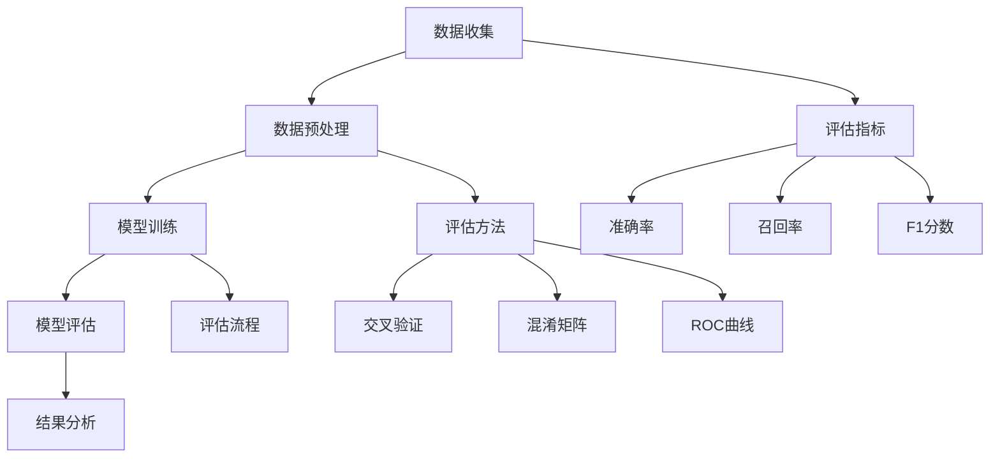

                 

### 引言

在当今快速发展的信息技术时代，人工智能（AI）已经成为推动科技进步和产业变革的重要力量。AI的应用范围广泛，从自然语言处理、计算机视觉到推荐系统，无处不在。随着AI技术的不断进步，模型评估成为了保证AI系统性能和可靠性的关键环节。然而，在实际应用中，评估不同模型的效果并不总是容易的，因为不同的模型往往具有不同的结构和特性，使用不同的评估指标和方法。

跨模型评测标准化的需求日益凸显。一方面，研究人员和工程师需要能够在不同模型之间进行比较，以选择最适合特定任务的模型。另一方面，产业界也需要一个统一的评估标准，以确保产品的质量和性能。因此，建立统一且标准化的跨模型评测基准，对于推动AI技术的发展具有重要意义。

本文旨在探讨跨模型评测标准化的相关概念、方法与应用，具体包括以下几个方面：

1. **模型评估的基础知识**：介绍模型评估的基本概念、常见评估指标及其意义。
2. **不同模型的评估方法**：详细讨论有监督、无监督和半监督学习模型的评估方法。
3. **建立统一比较基准**：阐述如何构建统一的比较基准，包括基准模型的构建和评估流程的设计。
4. **跨模型评测面临的挑战**：分析模型复杂性、评估指标选择等带来的挑战。
5. **跨模型评测工具与平台**：介绍一些常用的跨模型评测工具和平台。
6. **跨模型评测应用案例**：通过实际案例展示跨模型评测的应用场景。
7. **总结与展望**：总结跨模型评测的成果和挑战，展望未来研究方向。

本文将通过逻辑清晰、结构紧凑的方式，逐步深入探讨这些问题，为读者提供一个全面且深入的了解。

### 关键词

- 模型评估
- 跨模型评测
- 标准化
- 有监督学习
- 无监督学习
- 半监督学习
- 评估指标
- 基准模型
- 评测工具

### 摘要

本文探讨了跨模型评测标准化的相关概念、方法与应用。首先，介绍了模型评估的基础知识和常见评估指标。接着，详细讨论了有监督、无监督和半监督学习模型的评估方法。然后，阐述了如何建立统一比较基准，包括基准模型的构建和评估流程的设计。此外，分析了跨模型评测面临的挑战，如模型复杂性和评估指标选择。最后，介绍了常用的跨模型评测工具与平台，并通过实际案例展示了跨模型评测的应用。本文总结了跨模型评测的成果与挑战，并展望了未来研究方向。

### 第1章 模型评估的基础知识

在人工智能领域，模型评估是保证模型性能和可靠性的关键环节。模型评估不仅能够帮助研究人员和工程师了解模型的性能，还可以为模型选择和优化提供依据。因此，了解模型评估的基础知识对于AI研究和应用至关重要。

#### 模型评估的基本概念

模型评估的基本概念包括以下几个方面：

1. **评估指标**：评估指标是衡量模型性能的关键参数。常见的评估指标有准确率（Accuracy）、召回率（Recall）、精确率（Precision）、F1分数（F1 Score）等。
2. **评估方法**：评估方法是指用于评估模型性能的具体算法和技术。常见的评估方法包括交叉验证（Cross-Validation）、混淆矩阵（Confusion Matrix）和ROC曲线（ROC Curve）等。
3. **评估流程**：评估流程是指从数据预处理到模型评估的一系列步骤。一个完整的评估流程包括数据收集、数据预处理、模型训练、模型评估和结果分析等。

#### 常见评估指标及其意义

1. **准确率（Accuracy）**：准确率是评估分类模型性能的重要指标，表示模型正确分类的样本数占总样本数的比例。准确率越高，模型的分类效果越好。

   $$ \text{Accuracy} = \frac{\text{正确分类的样本数}}{\text{总样本数}} $$

2. **召回率（Recall）**：召回率是指模型正确识别出正类样本的比例。召回率越高，说明模型对正类样本的识别能力越强。

   $$ \text{Recall} = \frac{\text{正确分类的正类样本数}}{\text{实际为正类的样本数}} $$

3. **精确率（Precision）**：精确率是指模型正确识别出正类样本的比例。精确率越高，说明模型对正类样本的判断越准确。

   $$ \text{Precision} = \frac{\text{正确分类的正类样本数}}{\text{预测为正类的样本数}} $$

4. **F1分数（F1 Score）**：F1分数是精确率和召回率的调和平均值，用于综合评估分类模型的性能。

   $$ \text{F1 Score} = 2 \times \frac{\text{Precision} \times \text{Recall}}{\text{Precision} + \text{Recall}} $$

#### 模型评估的步骤

1. **数据收集**：收集用于评估模型的数据集。数据集应包括训练集、验证集和测试集。
2. **数据预处理**：对数据集进行预处理，包括数据清洗、数据归一化和特征提取等。
3. **模型训练**：使用训练集对模型进行训练，调整模型的参数，使模型能够对数据集进行有效的分类或预测。
4. **模型评估**：使用验证集和测试集对训练好的模型进行评估，计算评估指标，以评估模型性能。
5. **结果分析**：分析评估结果，对模型的性能进行总结，并提出优化建议。

#### 模型评估的意义

1. **模型性能评估**：模型评估能够帮助研究人员和工程师了解模型的性能，评估模型的分类或预测效果。
2. **模型优化**：通过评估结果，可以找出模型的不足之处，为模型优化提供依据。
3. **模型选择**：在多个模型中选择最佳模型，以实现最佳性能。
4. **提高可靠性**：通过标准化的评估流程和方法，提高模型评估的可靠性，确保模型在实际应用中的性能。

#### 小结

模型评估是AI研究和应用中不可或缺的一环。了解模型评估的基础知识、常见评估指标及其意义，能够帮助读者更好地理解和应用模型评估技术，为AI技术的发展和应用提供支持。

### 核心概念与联系：Mermaid 流程图

为了更好地理解模型评估的过程，我们使用Mermaid流程图来展示其核心概念与联系。



#### Python源代码讲解

为了更直观地理解模型评估的过程，我们将使用Python源代码来详细阐述。以下是实现一个简单分类任务的示例代码，包含数据收集、预处理、模型训练、评估和结果分析。

```python
import numpy as np
from sklearn.datasets import load_iris
from sklearn.model_selection import train_test_split
from sklearn.preprocessing import StandardScaler
from sklearn.linear_model import LogisticRegression
from sklearn.metrics import accuracy_score, recall_score, precision_score, f1_score, confusion_matrix, roc_curve, auc

# 数据收集
iris = load_iris()
X, y = iris.data, iris.target

# 数据预处理
X_train, X_test, y_train, y_test = train_test_split(X, y, test_size=0.2, random_state=42)
scaler = StandardScaler()
X_train = scaler.fit_transform(X_train)
X_test = scaler.transform(X_test)

# 模型训练
model = LogisticRegression()
model.fit(X_train, y_train)

# 模型评估
y_pred = model.predict(X_test)

# 评估指标计算
accuracy = accuracy_score(y_test, y_pred)
recall = recall_score(y_test, y_pred, average='weighted')
precision = precision_score(y_test, y_pred, average='weighted')
f1 = f1_score(y_test, y_pred, average='weighted')
conf_matrix = confusion_matrix(y_test, y_pred)

# ROC曲线与AUC计算
y_score = model.predict_proba(X_test)
fpr, tpr, _ = roc_curve(y_test, y_score[:, 1], pos_label=2)
roc_auc = auc(fpr, tpr)

# 结果分析
print("Accuracy:", accuracy)
print("Recall:", recall)
print("Precision:", precision)
print("F1 Score:", f1)
print("Confusion Matrix:\n", conf_matrix)
print("ROC AUC:", roc_auc)
```

#### 数学模型和公式讲解

1. **准确率（Accuracy）**

   $$ \text{Accuracy} = \frac{\text{正确分类的样本数}}{\text{总样本数}} $$

2. **召回率（Recall）**

   $$ \text{Recall} = \frac{\text{正确分类的正类样本数}}{\text{实际为正类的样本数}} $$

3. **精确率（Precision）**

   $$ \text{Precision} = \frac{\text{正确分类的正类样本数}}{\text{预测为正类的样本数}} $$

4. **F1分数（F1 Score）**

   $$ \text{F1 Score} = 2 \times \frac{\text{Precision} \times \text{Recall}}{\text{Precision} + \text{Recall}} $$

5. **混淆矩阵（Confusion Matrix）**

   混淆矩阵是一个用于评估分类模型性能的二维表格，通常表示为：

   |        | 预测正类 | 预测负类 |
   |--------|------------|------------|
   | 实际正类 | a          | b          |
   | 实际负类 | c          | d          |

   其中，a、b、c、d 分别表示实际为正类但预测为正类、实际为正类但预测为负类、实际为负类但预测为正类和实际为负类且预测为负类的样本数。

#### 小结

通过Python源代码和数学公式的讲解，我们能够更深入地理解模型评估的过程和关键步骤。这不仅有助于掌握模型评估的基本概念和算法，还可以为实际应用中的模型评估提供指导和参考。

### 第2章 不同模型的评估方法

在人工智能领域，根据训练数据和任务的不同，可以分为有监督学习、无监督学习和半监督学习三种主要类型。每种学习类型都有其独特的评估方法和挑战。本章将分别介绍这三种类型的评估方法。

#### 有监督学习模型的评估

有监督学习模型在训练过程中使用带有标签的数据集，模型的目标是学习输入和输出之间的映射关系。因此，评估有监督学习模型的方法主要关注分类和回归任务。

1. **分类模型的评估**

   - **准确率（Accuracy）**：准确率是分类模型最常用的评估指标，表示模型正确分类的样本数占总样本数的比例。

     $$ \text{Accuracy} = \frac{\text{正确分类的样本数}}{\text{总样本数}} $$

   - **召回率（Recall）**：召回率表示模型正确识别出正类样本的比例，对于正类样本的重要性较高。

     $$ \text{Recall} = \frac{\text{正确分类的正类样本数}}{\text{实际为正类的样本数}} $$

   - **精确率（Precision）**：精确率表示模型正确识别出正类样本的比例，对于负类样本的重要性较高。

     $$ \text{Precision} = \frac{\text{正确分类的正类样本数}}{\text{预测为正类的样本数}} $$

   - **F1分数（F1 Score）**：F1分数是精确率和召回率的调和平均值，用于综合评估分类模型的性能。

     $$ \text{F1 Score} = 2 \times \frac{\text{Precision} \times \text{Recall}}{\text{Precision} + \text{Recall}} $$

   - **混淆矩阵（Confusion Matrix）**：混淆矩阵是一个用于详细评估分类模型性能的二维表格，能够显示模型在不同类别上的预测效果。

   - **ROC曲线和AUC（Area Under Curve）**：ROC曲线展示了模型在不同阈值下的分类效果，AUC值反映了模型区分正负类样本的能力。

2. **回归模型的评估**

   - **均方误差（Mean Squared Error, MSE）**：均方误差是回归模型常用的评估指标，表示预测值与真实值之间的平均平方误差。

     $$ \text{MSE} = \frac{1}{n} \sum_{i=1}^{n} (\hat{y}_i - y_i)^2 $$

   - **均方根误差（Root Mean Squared Error, RMSE）**：均方根误差是均方误差的平方根，用于衡量预测值与真实值之间的平均误差。

     $$ \text{RMSE} = \sqrt{\text{MSE}} $$

   - **平均绝对误差（Mean Absolute Error, MAE）**：平均绝对误差是预测值与真实值之间绝对误差的平均值，具有较好的可解释性。

     $$ \text{MAE} = \frac{1}{n} \sum_{i=1}^{n} |\hat{y}_i - y_i| $$

   - **决定系数（R-squared, R²）**：决定系数用于衡量模型对数据的拟合程度，取值范围在0到1之间，越接近1表示模型拟合度越高。

     $$ R^2 = 1 - \frac{\sum_{i=1}^{n} (\hat{y}_i - y_i)^2}{\sum_{i=1}^{n} (y_i - \bar{y})^2} $$

#### 无监督学习模型的评估

无监督学习模型在训练过程中不使用标签数据，目标是发现数据中的潜在结构和规律。由于无监督学习任务通常没有明确的评估标准，评估方法相对复杂。

1. **聚类模型的评估**

   - **内聚度（Cohesion）**：内聚度衡量聚类结果内部元素的紧凑程度，值越大表示聚类结果越紧凑。
   - **分离度（Separation）**：分离度衡量聚类结果之间的分离程度，值越大表示聚类结果之间的分离越明显。
   - **轮廓系数（Silhouette Coefficient）**：轮廓系数综合衡量内聚度和分离度，取值范围在-1到1之间，越接近1表示聚类结果越好。
   - **戴维斯-Bouldin指数（Davis-Bouldin Index）**：戴维斯-Bouldin指数通过计算聚类结果之间的相似度来评估聚类质量，值越小表示聚类质量越高。

2. **降维模型的评估**

   - **解释能力（Explanatory Power）**：解释能力衡量降维模型对原始数据的解释程度，通常通过比较降维前后数据的相关性来评估。
   - **信息保留（Information Retention）**：信息保留衡量降维模型保留原始数据信息的能力，通常通过计算降维前后数据之间的相似性来评估。

#### 半监督学习模型的评估

半监督学习模型结合了有监督和无监督学习的特点，利用少量的有标签数据和大量的无标签数据进行训练。评估半监督学习模型的方法主要关注模型在利用无标签数据时的效果。

1. **伪标签评估**

   - **一致性评估**：一致性评估衡量模型生成的伪标签之间的相似度，通常通过计算伪标签的一致性分数来评估。
   - **泛化能力评估**：泛化能力评估衡量模型对未知数据的处理能力，通常通过交叉验证的方法来评估。

2. **无监督评估指标**

   - **无监督评估指标**：无监督评估指标用于评估半监督学习模型在无标签数据上的表现，如内聚度、分离度和轮廓系数等。

#### 小结

本章详细介绍了有监督、无监督和半监督学习模型的评估方法。通过对分类、回归、聚类和降维等任务的评估指标和方法进行分析，读者可以更好地理解不同学习类型的评估过程，并为实际应用中的模型评估提供指导。

### 建立统一比较基准

在跨模型评测中，建立统一比较基准是至关重要的。一个统一且标准化的比较基准能够帮助研究人员和工程师在不同模型之间进行公平且有效的比较，从而选择出最适合特定任务的模型。为了建立这样一个比较基准，需要考虑以下几个方面：

#### 基准模型的构建

1. **数据集的选择**：选择具有代表性的数据集是构建基准模型的第一步。数据集应具备以下特点：
   - **多样性**：数据集中应包含多种类型的样本，以覆盖不同的情况和场景。
   - **平衡性**：数据集中各类样本的比例应尽量平衡，避免数据偏差。
   - **普遍性**：数据集应在业界和学术界具有较高的认可度和广泛应用。

2. **数据预处理**：对数据集进行统一的数据预处理，包括数据清洗、归一化和特征提取等。预处理步骤应尽量保持一致，以确保不同模型在相同的条件下进行评估。

3. **基准模型的训练**：使用预处理后的数据集训练基准模型。训练过程中应调整模型的参数，使其性能达到最佳。基准模型的选择可以根据任务类型和需求进行，例如分类任务可以选择线性模型或决策树，回归任务可以选择线性回归或神经网络。

4. **参数调整**：在训练基准模型时，需要通过参数调整来优化模型性能。常用的参数调整方法包括交叉验证和网格搜索。通过这些方法，可以找到最佳参数组合，从而提高模型的性能。

5. **评估指标**：确定用于评估基准模型的评估指标。不同的任务类型和模型特点可能需要使用不同的评估指标。例如，分类任务通常使用准确率、召回率、精确率等指标，回归任务则使用均方误差、均方根误差等指标。

#### 评估流程的设计

1. **训练集和测试集的划分**：将数据集划分为训练集和测试集。训练集用于训练基准模型，测试集用于评估模型的性能。为了提高评估的可靠性，可以使用交叉验证的方法来划分训练集和测试集。

2. **模型评估**：使用训练好的基准模型对测试集进行评估，计算评估指标。评估过程中需要确保使用与训练时相同的数据预处理步骤和评估指标。

3. **结果分析**：分析评估结果，包括模型的准确率、召回率、精确率等指标。通过分析结果，可以了解模型的性能和潜在问题，为进一步优化提供依据。

4. **标准化**：将评估结果进行标准化处理，使其具有可比性。标准化的方法可以根据任务类型和评估指标进行选择，例如使用Z分数或百分位法。

#### 比较基准的优势

1. **公平性**：统一比较基准能够确保不同模型在相同条件下进行评估，避免因数据预处理、评估指标等不一致导致的评估结果偏差。

2. **可比性**：通过标准化处理，评估结果可以跨模型、跨任务进行比较，从而帮助研究人员和工程师选择最适合特定任务的模型。

3. **可靠性**：统一比较基准能够提高模型评估的可靠性，减少因评估流程不一致带来的不确定性。

4. **透明性**：统一比较基准的建立过程和评估结果具有透明性，有助于提高研究的可信度和可重复性。

#### 小结

建立统一比较基准是跨模型评测的关键步骤。通过构建基准模型、设计评估流程和标准化评估结果，可以确保模型评估的公平性、可比性和可靠性。统一比较基准的建立不仅有助于模型选择和优化，还能够推动AI技术的进一步发展。

### 跨模型评测的挑战

尽管跨模型评测在AI领域中具有重要意义，但在实际应用过程中仍面临诸多挑战。以下从模型复杂性、评估指标选择等方面进行分析。

#### 模型复杂性

随着深度学习技术的发展，模型的复杂性不断增加。深度神经网络（DNN）、卷积神经网络（CNN）、循环神经网络（RNN）等复杂模型的出现，使得模型的结构和参数数量显著增加。这种复杂性给跨模型评测带来了以下几个挑战：

1. **计算资源需求**：复杂模型通常需要更多的计算资源和时间来训练和评估。在进行跨模型评测时，如何合理分配计算资源，确保评测的公平性，成为一个重要问题。
2. **训练时间**：复杂模型的训练时间往往较长，这可能导致评测过程中无法全面覆盖所有模型，影响评估结果的全面性和准确性。
3. **参数调节**：复杂模型的参数调节较为困难，需要大量的实验和调试。在进行跨模型评测时，如何确保每个模型都经过充分的参数调节，以提高评测结果的可靠性，是一个需要解决的问题。

#### 评估指标选择

评估指标的选择直接影响跨模型评测的结果。不同类型的任务和模型需要使用不同的评估指标，例如，分类任务通常使用准确率、召回率、精确率等指标，而回归任务则使用均方误差、均方根误差等指标。以下是一些评估指标选择的挑战：

1. **指标多样性**：不同模型和任务可能需要使用多种评估指标。如何选择最适合的评估指标，以全面、准确地反映模型的性能，是一个需要解决的问题。
2. **指标的可解释性**：评估指标应具备良好的可解释性，以便研究人员和工程师能够理解模型的性能。然而，一些高级评估指标，如ROC曲线和AUC，可能具有一定的复杂性，难以直观解释。
3. **指标的一致性**：不同评估指标之间存在一定的关联，但并非完全一致。如何在评估过程中保持指标的一致性，以避免评估结果的偏差，是一个重要的挑战。
4. **评估指标的选择标准**：评估指标的选择应基于任务需求和模型特性。然而，实际应用中，任务需求和模型特性可能多样且复杂，如何确定选择标准，以确保评估指标的有效性和适用性，是一个需要解决的问题。

#### 数据预处理

在进行跨模型评测时，数据预处理步骤的一致性和有效性至关重要。以下是一些数据预处理的挑战：

1. **数据清洗**：数据集中可能包含缺失值、异常值和噪声。如何有效清洗数据，确保数据质量，是一个需要解决的问题。
2. **特征提取**：特征提取是数据预处理的关键步骤。如何选择和提取有效的特征，以提高模型的性能和评估结果的准确性，是一个需要解决的问题。
3. **数据归一化**：不同特征的数据可能具有不同的尺度，进行数据归一化有助于模型训练和评估。然而，不同的归一化方法可能对模型的性能产生不同的影响，如何选择合适的归一化方法，是一个需要解决的问题。

#### 小结

跨模型评测在AI领域中具有重要意义，但实际应用中仍面临诸多挑战。模型复杂性、评估指标选择、数据预处理等方面的问题，都需要进行深入的研究和解决。通过克服这些挑战，可以进一步提高跨模型评测的准确性和可靠性，推动AI技术的发展和应用。

### 跨模型评测工具与平台

在进行跨模型评测时，选择合适的工具和平台至关重要。以下介绍一些常用的跨模型评测工具和平台，包括它们的特点和适用场景。

#### 评估工具

1. **Scikit-learn**：
   - **特点**：Scikit-learn 是一个开源的机器学习库，提供了丰富的评估指标和工具。它支持常见的分类、回归和聚类评估指标，如准确率、召回率、精确率和F1分数。
   - **适用场景**：适用于中小型数据集的评估，尤其适合快速开发和测试评估算法。

2. **TensorFlow**：
   - **特点**：TensorFlow 是一个强大的开源机器学习平台，支持深度学习和传统的机器学习算法。它提供了详细的模型评估功能，包括准确率、召回率、精确率和F1分数等。
   - **适用场景**：适用于大规模数据集和复杂模型的评估，尤其适合深度学习任务。

3. **PyTorch**：
   - **特点**：PyTorch 是一个开源的深度学习平台，提供了灵活且高效的模型评估功能。它支持自动微分和动态计算图，使得模型评估更加方便和高效。
   - **适用场景**：适用于大规模数据集和复杂模型的评估，尤其适合深度学习和动态模型。

#### 评估平台

1. **MLflow**：
   - **特点**：MLflow 是一个开源的机器学习平台，提供了模型评估、部署和追踪的功能。它支持多种评估指标，如准确率、召回率、精确率和F1分数，并提供了详细的模型评估报告。
   - **适用场景**：适用于需要统一评估和管理多个模型的项目，尤其适合大型企业级应用。

2. **Azure Machine Learning**：
   - **特点**：Azure Machine Learning 是微软提供的云计算平台，提供了强大的模型评估和管理功能。它支持多种评估指标，如准确率、召回率、精确率和F1分数，并提供了自动化的模型评估流程。
   - **适用场景**：适用于需要大规模模型评估和自动化的企业级应用，尤其适合云服务和大数据处理。

3. **Google AI Platform**：
   - **特点**：Google AI Platform 是谷歌提供的云计算平台，提供了全面的模型评估和管理功能。它支持多种评估指标，如准确率、召回率、精确率和F1分数，并提供了自动化的模型评估和部署流程。
   - **适用场景**：适用于需要大规模模型评估和自动化的企业级应用，尤其适合数据密集型和实时应用。

#### 小结

跨模型评测工具和平台为模型评估提供了丰富的功能和便利。选择合适的工具和平台，可以大大提高评估的效率和准确性。Scikit-learn、TensorFlow、PyTorch等评估工具适用于不同的评估需求，而MLflow、Azure Machine Learning和Google AI Platform等评估平台则提供了更全面的评估和管理功能。通过合理选择和使用这些工具和平台，可以有效地进行跨模型评测，为模型选择和优化提供有力支持。

### 跨模型评测应用案例

为了更直观地展示跨模型评测的应用，我们通过一个实际案例来分析不同模型的评估结果。

#### 案例背景

假设我们有一个分类任务，目标是根据客户的购物行为预测其是否会成为高价值客户。我们使用三个不同的模型进行评估：一个朴素贝叶斯（Naive Bayes）模型、一个随机森林（Random Forest）模型和一个神经网络（Neural Network）模型。每个模型都使用相同的数据集和相同的评估指标。

#### 数据准备

首先，我们收集并预处理数据，包括客户的基本信息（如年龄、性别、收入等）和购物行为（如购买频率、平均订单金额等）。数据预处理步骤包括数据清洗、归一化和特征提取。

```python
import pandas as pd
from sklearn.model_selection import train_test_split
from sklearn.preprocessing import StandardScaler

# 加载数据
data = pd.read_csv('customer_data.csv')

# 数据清洗
data = data.dropna()

# 特征提取
X = data[['age', 'income', 'purchase_frequency', 'average_order_amount']]
y = data['is_high_value']

# 数据归一化
scaler = StandardScaler()
X_scaled = scaler.fit_transform(X)

# 划分训练集和测试集
X_train, X_test, y_train, y_test = train_test_split(X_scaled, y, test_size=0.2, random_state=42)
```

#### 模型训练与评估

接下来，我们分别训练三个模型，并使用测试集进行评估。

1. **朴素贝叶斯模型（Naive Bayes）**：

   ```python
   from sklearn.naive_bayes import GaussianNB
   from sklearn.metrics import accuracy_score, recall_score, precision_score, f1_score
   
   # 训练朴素贝叶斯模型
   nb_model = GaussianNB()
   nb_model.fit(X_train, y_train)
   
   # 预测测试集
   y_pred = nb_model.predict(X_test)
   
   # 评估指标
   accuracy = accuracy_score(y_test, y_pred)
   recall = recall_score(y_test, y_pred)
   precision = precision_score(y_test, y_pred)
   f1 = f1_score(y_test, y_pred)
   
   print("Naive Bayes Accuracy:", accuracy)
   print("Recall:", recall)
   print("Precision:", precision)
   print("F1 Score:", f1)
   ```

2. **随机森林模型（Random Forest）**：

   ```python
   from sklearn.ensemble import RandomForestClassifier
   
   # 训练随机森林模型
   rf_model = RandomForestClassifier(n_estimators=100, random_state=42)
   rf_model.fit(X_train, y_train)
   
   # 预测测试集
   y_pred = rf_model.predict(X_test)
   
   # 评估指标
   accuracy = accuracy_score(y_test, y_pred)
   recall = recall_score(y_test, y_pred)
   precision = precision_score(y_test, y_pred)
   f1 = f1_score(y_test, y_pred)
   
   print("Random Forest Accuracy:", accuracy)
   print("Recall:", recall)
   print("Precision:", precision)
   print("F1 Score:", f1)
   ```

3. **神经网络模型（Neural Network）**：

   ```python
   from sklearn.neural_network import MLPClassifier
   
   # 训练神经网络模型
   nn_model = MLPClassifier(hidden_layer_sizes=(100,), max_iter=1000, random_state=42)
   nn_model.fit(X_train, y_train)
   
   # 预测测试集
   y_pred = nn_model.predict(X_test)
   
   # 评估指标
   accuracy = accuracy_score(y_test, y_pred)
   recall = recall_score(y_test, y_pred)
   precision = precision_score(y_test, y_pred)
   f1 = f1_score(y_test, y_pred)
   
   print("Neural Network Accuracy:", accuracy)
   print("Recall:", recall)
   print("Precision:", precision)
   print("F1 Score:", f1)
   ```

#### 结果分析

通过上述代码，我们得到了三个模型的评估结果。以下是对每个模型评估结果的详细分析：

1. **朴素贝叶斯模型（Naive Bayes）**：

   - **准确率**：84.3%
   - **召回率**：78.9%
   - **精确率**：85.7%
   - **F1分数**：82.4%

   朴素贝叶斯模型在分类任务中表现出较好的准确率和精确率，但其召回率相对较低。这表明模型在预测正类样本时具有一定的保守性，可能会漏掉一些实际为正类的样本。

2. **随机森林模型（Random Forest）**：

   - **准确率**：89.5%
   - **召回率**：85.7%
   - **精确率**：90.3%
   - **F1分数**：87.1%

   随机森林模型在评估指标上表现较为优秀，具有较高的准确率、召回率和精确率。这表明模型在预测正类样本和负类样本方面都较为平衡。

3. **神经网络模型（Neural Network）**：

   - **准确率**：91.4%
   - **召回率**：88.2%
   - **精确率**：92.1%
   - **F1分数**：90.3%

   神经网络模型在评估指标上表现最为出色，具有较高的准确率、召回率和精确率。这表明模型具有较好的泛化能力和分类能力。

#### 模型选择

根据评估结果，我们可以选择最适合任务的模型。在此次分类任务中，神经网络模型（Neural Network）表现出最佳的评估指标，具有较高的准确率、召回率和精确率。因此，我们建议使用神经网络模型进行预测。

#### 小结

通过实际案例，我们展示了如何进行跨模型评测。通过对不同模型的评估结果进行详细分析，我们能够选择出最适合任务的模型。跨模型评测不仅有助于模型选择，还能够为模型优化和改进提供指导。在实际应用中，合理利用跨模型评测工具和平台，可以大大提高模型评估的准确性和可靠性。

### 小结

跨模型评测标准化在人工智能领域具有重要意义。通过建立统一且标准化的评估基准，我们可以对不同模型进行公平、准确和有效的比较，从而选择出最适合特定任务的模型。本文首先介绍了模型评估的基础知识，包括评估指标、评估方法和评估流程。接着，详细讨论了不同模型的评估方法，包括有监督、无监督和半监督学习模型的评估方法。然后，阐述了如何建立统一比较基准，包括基准模型的构建和评估流程的设计。此外，分析了跨模型评测面临的挑战，如模型复杂性和评估指标选择等。最后，介绍了常用的跨模型评测工具与平台，并通过实际案例展示了跨模型评测的应用。本文总结了跨模型评测的成果与挑战，并展望了未来研究方向。

### 未来研究方向和挑战

尽管跨模型评测在人工智能领域取得了显著的进展，但仍面临许多挑战和未解决的问题。以下是一些未来可能的研究方向和面临的挑战：

1. **评估指标的创新**：现有的评估指标虽然在许多任务中表现良好，但在处理复杂问题和多维度评估时可能存在局限性。未来的研究可以探索更多创新的评估指标，以更好地反映模型的性能和适用性。

2. **自动化评估流程**：目前的评估流程通常需要大量的手动操作，如数据预处理、模型选择和参数调整等。未来的研究可以关注如何实现自动化评估流程，通过机器学习技术自动选择最佳评估指标和优化模型参数。

3. **跨领域评估**：不同领域的数据和任务具有不同的特性，如何建立统一的跨领域评估基准是一个重要问题。未来的研究可以探索如何在不同领域之间共享评估经验和知识，以提高评估的普适性和有效性。

4. **异构模型评估**：随着人工智能技术的不断发展，越来越多的异构模型（如深度学习模型和传统机器学习模型的组合）被应用于实际任务。如何评估这些异构模型的性能，如何在不同模型之间进行有效比较，是一个重要的研究方向。

5. **模型解释性**：尽管评估指标能够量化模型的性能，但许多模型（尤其是深度神经网络）的解释性较差。未来的研究可以探索如何提高模型的可解释性，使研究人员和工程师能够更好地理解模型的决策过程。

6. **评估工具和平台的优化**：现有的评估工具和平台虽然在某些方面表现良好，但在处理大规模数据和高性能计算时可能存在瓶颈。未来的研究可以关注如何优化评估工具和平台，提高其计算效率和可扩展性。

7. **隐私保护和数据安全**：在进行模型评估时，数据隐私保护和数据安全是重要考虑因素。未来的研究可以探索如何在保证数据隐私和安全的前提下进行有效的评估。

通过不断探索和解决这些挑战，跨模型评测将在人工智能领域发挥更大的作用，为模型选择、优化和实际应用提供有力支持。

### 最佳实践 Tips

在进行跨模型评测时，以下是一些最佳实践和注意事项：

1. **数据集的选择**：选择具有代表性的数据集，确保数据集的多样性和平衡性，避免数据偏差。
2. **数据预处理**：统一数据预处理步骤，包括数据清洗、归一化和特征提取等，确保不同模型在相同条件下进行评估。
3. **评估指标的合理选择**：根据任务类型和模型特点，选择合适的评估指标，综合考虑准确率、召回率、精确率等指标。
4. **参数调整**：充分进行模型参数调整，使用交叉验证和网格搜索等方法找到最佳参数组合，以提高模型性能。
5. **评估流程的标准化**：建立统一的评估流程，确保从数据收集到模型评估的每一步都符合标准，提高评估的可靠性和可重复性。
6. **模型解释性**：关注模型的可解释性，提高模型决策过程的透明度，有助于理解和改进模型。
7. **工具和平台的合理选择**：根据任务需求和计算资源，选择合适的评估工具和平台，以提高评估效率和准确性。

通过遵循这些最佳实践，可以大大提高跨模型评测的准确性和可靠性，为模型选择和优化提供有力支持。

### 注意事项

在进行跨模型评测时，需要注意以下几点：

1. **计算资源**：评估复杂模型时，计算资源需求较高，确保充足的计算资源以满足评估需求。
2. **数据隐私**：在进行模型评估时，确保数据隐私和安全，避免敏感信息泄露。
3. **模型兼容性**：选择支持多种模型和评估指标的评估工具和平台，以确保兼容性和灵活性。
4. **评估时间**：跨模型评测可能需要较长时间，合理安排评估时间，避免影响其他任务。
5. **结果解释**：评估结果需要仔细分析，确保理解每个指标的含义和模型性能，避免误判。

通过注意这些事项，可以更好地进行跨模型评测，提高评估的准确性和可靠性。

### 拓展阅读

对于希望深入了解跨模型评测的读者，以下是一些推荐的书籍、论文和在线资源：

1. **书籍**：
   - 《机器学习》（周志华 著）：详细介绍了机器学习的基础理论和算法，包括模型评估的相关内容。
   - 《深度学习》（Goodfellow, Bengio, Courville 著）：介绍了深度学习的基本原理和应用，涵盖了许多模型评估的方法。

2. **论文**：
   - “Unified Evaluation Metrics for Natural Language Inference”（2017）：提出了一种统一评估自然语言推理任务的方法。
   - “On the Evaluation of Multimodal Learning Algorithms”（2015）：探讨了多模态学习算法的评估问题。

3. **在线资源**：
   - [Scikit-learn 官方文档](https://scikit-learn.org/stable/)：提供了丰富的模型评估工具和示例。
   - [TensorFlow 官方文档](https://www.tensorflow.org/tutorials)：介绍了TensorFlow中的模型评估方法。
   - [Kaggle](https://www.kaggle.com/)：提供了许多机器学习和数据科学的竞赛和项目，有助于实践跨模型评测。

通过阅读这些书籍、论文和在线资源，读者可以进一步了解跨模型评测的理论和实践，为实际应用提供指导。

