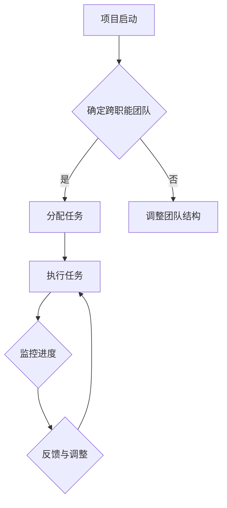

                 

# 跨职能协作：打破AI开发中的部门壁垒

## 关键词

- 跨职能协作
- AI开发
- 部门壁垒
- 团队合作
- 领导力
- 组织文化

## 摘要

本文旨在探讨跨职能协作在AI开发中的重要性，分析部门壁垒的存在及其对项目进展的阻碍，并提出有效的跨职能协作策略。文章将详细阐述跨职能协作的核心概念、模型、工具和技术，结合实际案例研究，提供实用的方法和最佳实践，以帮助AI开发团队打破部门壁垒，实现高效协作。

## 引言

### 背景介绍

随着人工智能（AI）技术的迅速发展，其应用范围不断扩展，从自动化到自动化决策支持系统，AI正在成为现代企业创新和增长的重要驱动力。在这种背景下，AI开发项目往往需要跨部门、跨领域的协作，以确保项目能够顺利推进并实现预期目标。然而，传统的组织结构往往存在部门壁垒，这些壁垒可能来自不同的职能划分、沟通不畅、资源分配不均等问题，从而阻碍了跨职能协作的有效性。

### 部门壁垒问题

部门壁垒是指由于组织内部的职能分工和资源分配导致的沟通障碍和协作难题。在AI开发项目中，部门壁垒可能导致以下问题：

1. **信息孤岛**：不同部门之间的信息不能及时共享，导致项目进展受阻。
2. **职责不清**：跨部门项目中的职责分工不明确，导致责任归属问题。
3. **资源浪费**：由于沟通不畅和协调不力，可能导致资源的重复投入和浪费。
4. **效率低下**：跨部门协作的低效率导致项目延期和成本增加。

### 本文目的

本文的目的在于通过分析跨职能协作在AI开发中的重要性，提出有效的策略和方法，帮助团队打破部门壁垒，实现高效协作。本文将涵盖以下内容：

1. **跨职能协作的核心概念和模型**：介绍跨职能团队的概念、特点和协作模型。
2. **跨职能协作工具与技术**：探讨常用的团队协作工具和技术，以及AI技术在跨职能协作中的应用。
3. **领导力与组织文化**：分析领导力在跨职能协作中的作用，以及如何通过组织文化变革促进跨职能协作。
4. **实际案例研究**：结合实际案例，分析跨职能协作的成功经验和挑战。
5. **未来展望**：讨论跨职能协作在AI开发中的发展趋势和未来方向。

## 跨职能协作的核心概念与联系

### 跨职能团队的概念

跨职能团队（Cross-functional Team）是指由来自不同部门、拥有不同专业技能和背景的成员组成，共同完成特定任务的团队。在AI开发项目中，跨职能团队通常包括数据科学家、软件工程师、产品经理、业务分析师等多个职能角色。

### 跨职能团队的特点

跨职能团队具有以下特点：

1. **多样性**：团队成员来自不同的职能背景，拥有不同的技能和知识。
2. **协作性**：团队成员需要密切合作，共同完成任务。
3. **灵活性**：能够快速响应变化，适应不同的项目需求。
4. **资源共享**：团队内部共享资源，如技术工具、数据等。

### 跨职能团队的优势

跨职能团队在AI开发中的优势包括：

1. **协同创新**：不同职能背景的成员能够带来不同的视角和创意，促进创新。
2. **高效决策**：团队成员可以快速讨论和决策，减少信息传递的层级和延迟。
3. **资源共享**：团队成员可以共享资源，提高工作效率。
4. **全面理解**：团队成员对项目的各个方面都有深入了解，能够更好地协调和合作。

### 跨职能团队面临的挑战

跨职能团队在AI开发中也可能面临以下挑战：

1. **沟通障碍**：不同职能背景的成员可能存在沟通障碍，导致信息传递不畅。
2. **责任归属**：跨部门项目中的职责分工可能不明确，导致责任归属问题。
3. **资源冲突**：不同部门之间可能存在资源争夺，影响项目进展。
4. **文化差异**：不同部门之间的文化差异可能导致协作不畅。

### 跨职能协作模型

为了克服跨职能团队面临的挑战，可以采用以下几种跨职能协作模型：

1. **矩阵式组织结构**：在传统的职能组织结构基础上，增加跨职能团队，使团队成员同时属于职能部门和跨职能团队，实现双重职责。
2. **跨职能项目团队**：专门为特定项目组建的跨职能团队，团队成员专注于项目任务，不受职能部门的限制。
3. **混合式组织结构**：结合矩阵式和跨职能项目团队的特点，根据项目需求灵活调整组织结构。

### Mermaid流程图示例

以下是一个简单的Mermaid流程图示例，展示跨职能团队的工作流程：



通过这个流程图，我们可以清晰地看到跨职能团队在项目启动、任务分配、执行、监控和反馈调整等方面的协作流程。

## 核心算法原理讲解

### 跨职能协作中的算法原理

在跨职能协作中，算法的原理主要用于以下几个方面：

1. **任务分配算法**：通过算法为团队成员分配任务，确保每个成员都能发挥其特长。
2. **资源调度算法**：优化资源分配，确保项目资源的最大化利用。
3. **进度监控算法**：实时监控项目进度，及时发现和解决问题。
4. **沟通协调算法**：通过算法优化沟通流程，提高团队协作效率。

### Python源代码示例

以下是一个简单的Python源代码示例，用于任务分配算法的实现：

```python
import random

def assign_tasks(employees, tasks):
    """
    任务分配算法，将任务随机分配给员工。

    :param employees: 员工列表，每个员工为一个字典，包含员工姓名和技能
    :param tasks: 任务列表，每个任务为一个字典，包含任务名称和所需技能
    :return: 分配后的任务列表
    """
    assigned_tasks = {task: [] for task in tasks}
    for task in tasks:
        required_skills = tasks[task]['required_skills']
        suitable_employees = [emp for emp in employees if emp['skills'].intersection(required_skills)]
        assigned_tasks[task].append(random.choice(suitable_employees))
    return assigned_tasks

# 员工列表
employees = [
    {'name': 'Alice', 'skills': {'Python', 'Data Analysis'}},
    {'name': 'Bob', 'skills': {'Java', 'Machine Learning'}},
    {'name': 'Charlie', 'skills': {'C++', 'System Architecture'}},
]

# 任务列表
tasks = {
    'Task1': {'required_skills': {'Python', 'Data Analysis'}},
    'Task2': {'required_skills': {'Java', 'Machine Learning'}},
    'Task3': {'required_skills': {'C++', 'System Architecture'}},
}

# 分配任务
assigned_tasks = assign_tasks(employees, tasks)

# 打印结果
for task, employees in assigned_tasks.items():
    print(f"{task}: {', '.join([emp['name'] for emp in employees])}")
```

在这个示例中，`assign_tasks`函数通过随机分配任务给员工，确保任务所需的技能与员工的技能匹配。这只是一个简单的任务分配算法，实际应用中可能需要更复杂的算法，如基于技能匹配度和任务紧急程度的优化分配算法。

### 数学模型和公式

在跨职能协作中，常用的数学模型和公式包括：

1. **任务完成时间预测模型**：用于预测任务完成所需的时间，通常采用线性回归、决策树等方法。
2. **资源优化模型**：用于优化资源分配，通常采用线性规划、整数规划等方法。
3. **风险评估模型**：用于评估项目风险，通常采用蒙特卡洛模拟、贝叶斯网络等方法。

以下是一个简单的线性回归模型示例，用于预测任务完成时间：

$$
\hat{y} = \beta_0 + \beta_1 \cdot x
$$

其中，$y$ 表示任务完成时间，$x$ 表示任务所需资源量，$\beta_0$ 和 $\beta_1$ 为模型的参数。

在实际应用中，可能需要更复杂的模型，如多元线性回归、神经网络等，以更准确地预测任务完成时间和优化资源分配。

### 举例说明

假设有一个AI开发项目，需要完成三个任务：数据清洗、模型训练和系统部署。现有三名员工：Alice、Bob 和 Charlie，他们的技能分别为Python、Java和C++。任务所需的技能和要求如下：

- **数据清洗**：需要Python和Data Analysis技能
- **模型训练**：需要Java和Machine Learning技能
- **系统部署**：需要C++和System Architecture技能

通过任务分配算法，可以将任务分配给合适的员工，确保任务顺利完成。假设分配结果如下：

- **数据清洗**：Alice
- **模型训练**：Bob
- **系统部署**：Charlie

通过预测任务完成时间和优化资源分配，可以确保项目按期完成，并最大化资源利用率。

### 项目实战

以下是一个简单的项目实战，用于搭建一个跨职能协作的AI开发项目。

#### 开发环境搭建

1. 安装Python环境：在本地计算机上安装Python，配置环境变量。
2. 安装必要的库：使用pip命令安装必要的库，如numpy、pandas、scikit-learn等。

#### 源代码实现

以下是一个简单的AI开发项目，用于实现数据清洗、模型训练和系统部署。

```python
import pandas as pd
from sklearn.model_selection import train_test_split
from sklearn.ensemble import RandomForestClassifier
from sklearn.metrics import accuracy_score

# 数据清洗
def data_cleaning(data):
    # 实现数据清洗逻辑
    pass

# 模型训练
def model_training(X_train, y_train):
    # 实现模型训练逻辑
    model = RandomForestClassifier()
    model.fit(X_train, y_train)
    return model

# 系统部署
def system_deployment(model, X_test):
    # 实现系统部署逻辑
    y_pred = model.predict(X_test)
    accuracy = accuracy_score(y_test, y_pred)
    print(f"Test Accuracy: {accuracy}")

# 主函数
def main():
    # 读取数据
    data = pd.read_csv("data.csv")
    
    # 数据清洗
    cleaned_data = data_cleaning(data)
    
    # 分割数据集
    X = cleaned_data.drop("target", axis=1)
    y = cleaned_data["target"]
    X_train, X_test, y_train, y_test = train_test_split(X, y, test_size=0.2, random_state=42)
    
    # 模型训练
    model = model_training(X_train, y_train)
    
    # 系统部署
    system_deployment(model, X_test)

# 运行主函数
if __name__ == "__main__":
    main()
```

#### 代码解读与分析

1. **数据清洗**：实现数据清洗逻辑，如缺失值处理、异常值检测等。
2. **模型训练**：使用随机森林分类器进行模型训练，并返回训练好的模型。
3. **系统部署**：使用训练好的模型对测试数据进行预测，并计算准确率。

#### 实际案例分析和详细讲解剖析

以下是一个实际的AI开发项目案例，该项目旨在利用机器学习技术预测客户流失。

1. **项目背景**：某电信公司希望通过分析客户数据，预测哪些客户可能会流失，以便采取相应的挽留措施。
2. **数据来源**：从公司数据库中提取客户数据，包括基本信息、消费记录等。
3. **数据处理**：对数据进行清洗和处理，如缺失值处理、数据类型转换等。
4. **特征工程**：提取有用的特征，如消费频率、消费金额、用户活跃度等。
5. **模型训练**：使用随机森林分类器进行模型训练，并调整模型参数以优化性能。
6. **模型评估**：使用测试数据对模型进行评估，计算准确率、召回率等指标。
7. **系统部署**：将模型部署到生产环境，对实时数据进行预测，并生成流失预警报告。

通过这个案例，我们可以看到跨职能协作在AI开发项目中的实际应用，包括数据科学家、软件工程师、产品经理等不同角色的协同工作。在实际操作中，需要充分考虑部门壁垒的存在，并通过有效的跨职能协作策略，实现高效的项目推进。

### 最佳实践 Tips、小结、注意事项、拓展阅读

#### 最佳实践 Tips

1. **建立明确的沟通机制**：确保团队成员之间的信息畅通，减少误解和冲突。
2. **明确职责分工**：确保每个团队成员都清楚自己的职责，避免职责重叠和责任不清。
3. **定期团队会议**：定期召开团队会议，讨论项目进展、解决问题、分享经验。
4. **利用工具提高协作效率**：使用合适的团队协作工具，如Slack、Trello、Asana等，提高团队协作效率。

#### 小结

跨职能协作在AI开发中具有重要意义，可以有效打破部门壁垒，提高项目效率。通过合理的团队结构、明确的职责分工和有效的沟通机制，可以实现高效协作，推动项目顺利进展。

#### 注意事项

1. **避免过度分工**：过度分工可能导致团队协作效率降低，影响项目进展。
2. **尊重团队文化**：尊重团队成员的文化差异，促进团队合作。
3. **持续培训与学习**：为团队成员提供培训和学习机会，提高团队整体能力。

#### 拓展阅读

1. 《敏捷开发：拥抱变化的开发实践》
2. 《人月神话：软件开发的科学和艺术》
3. 《团队协作的法则：如何打造高效团队》

## 总结与展望

本文系统地探讨了跨职能协作在AI开发中的重要性，分析了部门壁垒的存在及其对项目进展的阻碍，并提出了有效的跨职能协作策略。通过核心概念、模型、工具和技术的讲解，以及实际案例的研究，本文提供了实用的方法和最佳实践，以帮助AI开发团队打破部门壁垒，实现高效协作。

在未来的发展中，跨职能协作将继续在AI开发中发挥重要作用。随着人工智能技术的不断进步和应用的深入，跨职能协作将变得更加复杂和多样化。为此，团队需要不断适应变化，提高协作效率，以应对未来挑战。

作者：AI天才研究院/AI Genius Institute & 禅与计算机程序设计艺术 /Zen And The Art of Computer Programming

