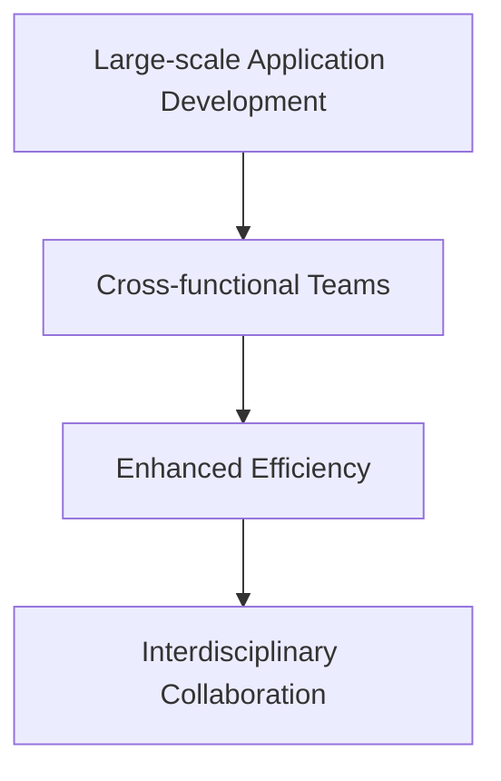
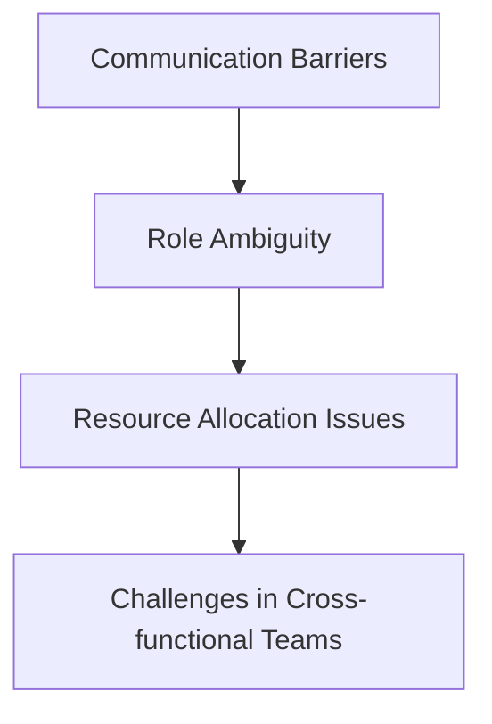
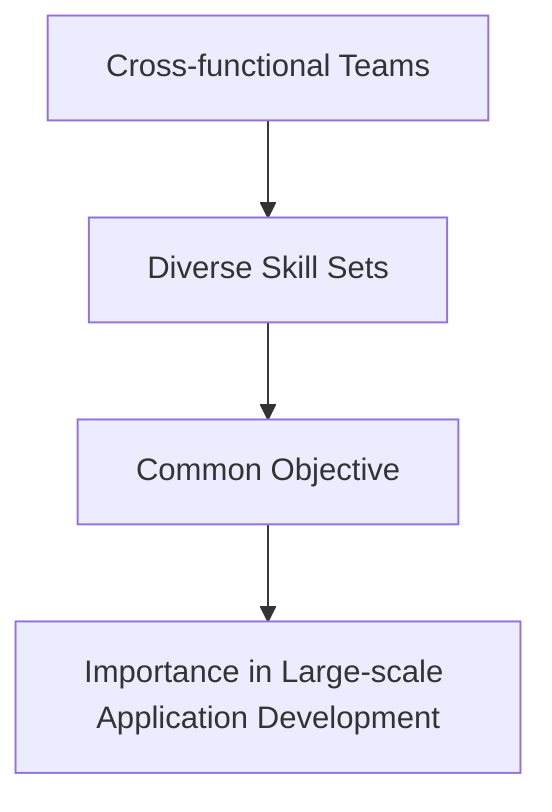
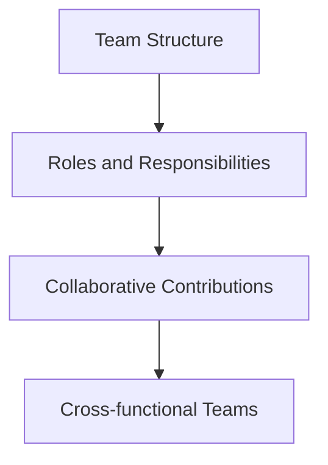
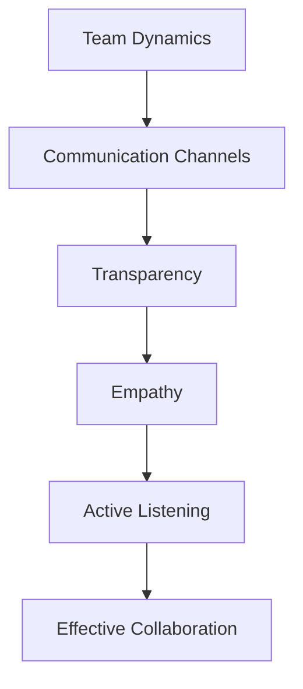
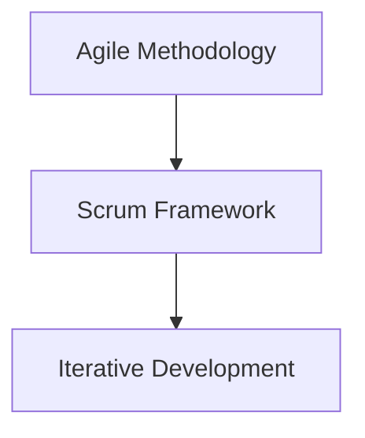
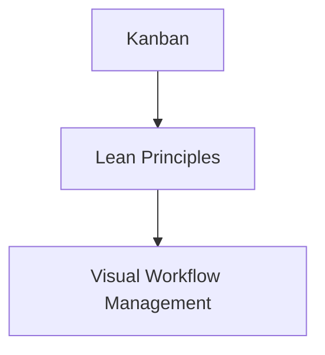
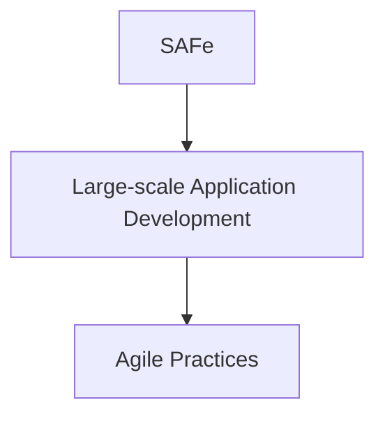
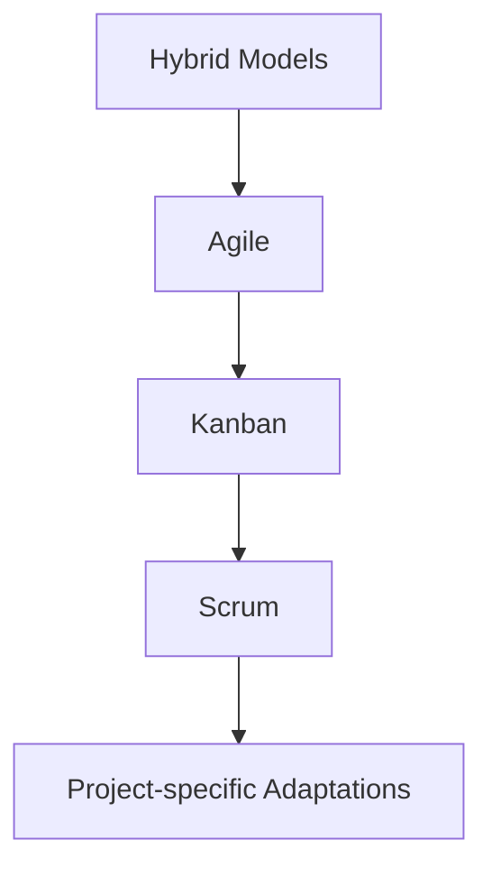

                 

Sure! Let's break down the task and outline the article step by step. 

## Step 1: Introduction to the Article

**Title:** Cross-Functional Team Collaboration Models: Enhancing Efficiency in Large-scale Application Development

**Keywords:** Cross-functional teams, collaboration models, large-scale application development, efficiency, agile methodology, Kanban, Scrum, Scaled Agile Framework (SAFe)

**Abstract:**
This article explores the concept of cross-functional teams and their role in enhancing efficiency in large-scale application development. It discusses various collaboration models, principles of collaboration, and provides insights from real-world case studies.

## Step 2: Background Introduction

### 2.1 The Importance of Cross-functional Teams in Large-scale Application Development

**Context:** 
Large-scale application development often involves complex projects with multiple stakeholders, diverse skill sets, and interdependent tasks. Cross-functional teams are essential in such environments as they bring together individuals from different disciplines to work collaboratively towards a common goal.

**Concepts and Relationships:**
* Cross-functional teams
* Large-scale application development
* Interdisciplinary collaboration

**Mermaid Diagram:**

### 2.2 Challenges in Cross-functional Team Collaboration

**Context:**
While cross-functional teams offer numerous benefits, they also come with challenges such as communication barriers, role ambiguity, and resource allocation issues.

**Concepts and Relationships:**
* Communication barriers
* Role ambiguity
* Resource allocation issues

**Mermaid Diagram:**

## Step 3: Core Concepts and Principles

### 3.1 Definition and Importance of Cross-functional Teams

**Context:**
A cross-functional team is a group of individuals with diverse skills and expertise, working together to achieve a common objective. This section will define cross-functional teams and explore their importance in large-scale application development.

**Concepts and Relationships:**
* Cross-functional teams
* Diverse skill sets
* Common objective

**Mermaid Diagram:**

### 3.2 Team Structure and Roles

**Context:**
This section will discuss the structure of cross-functional teams and the roles of various team members, highlighting their contributions to collaboration.

**Concepts and Relationships:**
* Team structure
* Roles and responsibilities
* Collaborative contributions

**Mermaid Diagram:**

### 3.3 Team Dynamics and Communication

**Context:**
Effective communication is crucial for the success of cross-functional teams. This section will explore the dynamics of team communication, highlighting the importance of transparency, empathy, and active listening.

**Concepts and Relationships:**
* Team dynamics
* Communication channels
* Transparency, empathy, active listening

**Mermaid Diagram:**

## Step 4: Collaboration Models

### 4.1 Agile Methodology and Scrum

**Context:**
Agile methodology is a popular framework for managing software development projects. This section will discuss the Agile methodology, focusing on Scrum, a specific Agile framework.

**Concepts and Relationships:**
* Agile methodology
* Scrum framework
* Iterative development

**Mermaid Diagram:**

### 4.2 Kanban and Lean Principles

**Context:**
Kanban is another popular collaboration model based on Lean principles. This section will explore the Kanban approach and its applications in large-scale application development.

**Concepts and Relationships:**
* Kanban
* Lean principles
* Visual workflow management

**Mermaid Diagram:**

### 4.3 Scaled Agile Framework (SAFe)

**Context:**
Scaled Agile Framework (SAFe) is a framework designed for scaling Agile practices across large organizations. This section will discuss the key components of SAFe and their role in cross-functional team collaboration.

**Concepts and Relationships:**
* Scaled Agile Framework (SAFe)
* Large-scale application development
* Agile practices

**Mermaid Diagram:**

### 4.4 Hybrid Models

**Context:**
Hybrid models combine elements from different collaboration models to suit the specific needs of a project. This section will discuss popular hybrid models and their advantages.

**Concepts and Relationships:**
* Hybrid models
* Agile, Kanban, and Scrum elements
* Project-specific adaptations

**Mermaid Diagram:**

## Step 5: Case Studies and Best Practices

### 5.1 Case Study 1: Company A

**Context:**
This section will present a case study of Company A, highlighting their approach to cross-functional team collaboration and the results they achieved.

**Case Study Details:**
* Company overview
* Collaboration model adopted
* Challenges faced and solutions implemented
* Key learnings and best practices

### 5.2 Case Study 2: Company B

**Context:**
This section will present another case study of Company B, focusing on their unique approach to cross-functional team collaboration.

**Case Study Details:**
* Company overview
* Collaboration model adopted
* Challenges faced and solutions implemented
* Key learnings and best practices

### 5.3 Case Study 3: Company C

**Context:**
This section will present a case study of Company C, illustrating the benefits of cross-functional team collaboration in large-scale application development.

**Case Study Details:**
* Company overview
* Collaboration model adopted
* Challenges faced and solutions implemented
* Key learnings and best practices

### 5.4 Lessons Learned and Best Practices

**Context:**
This section will summarize the key lessons learned from the case studies and provide best practices for effective cross-functional team collaboration in large-scale application development.

**Best Practices:**
* Foster open communication
* Define clear roles and responsibilities
* Encourage a culture of collaboration
* Invest in collaboration tools and technologies
* Continuously improve and adapt collaboration models

## Step 6: Conclusion

**Summary:**
This article has explored the concept of cross-functional teams and their role in enhancing efficiency in large-scale application development. It has discussed various collaboration models, principles of collaboration, and provided insights from real-world case studies.

**Future Directions:**
* The potential for further research in the area of cross-functional team collaboration
* The impact of emerging technologies on cross-functional team collaboration
* Strategies for overcoming common challenges in cross-functional team collaboration

## Step 7: Author Information

**Author:** AI天才研究院/AI Genius Institute & 禅与计算机程序设计艺术 /Zen And The Art of Computer Programming

This outline should provide a solid foundation for the article, ensuring a logical flow of information and in-depth analysis of the topic. The next steps would involve filling in the details for each section, incorporating Python code examples, mathematical models, and formulas, and ensuring the article meets the specified word count. 

Please let me know if you have any questions or need further clarification on any aspect of the outline.

