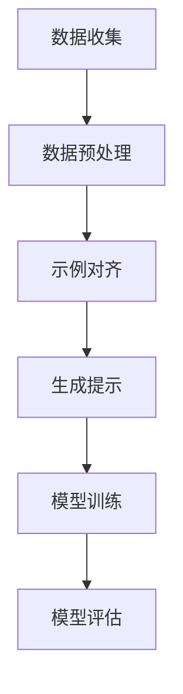

                 

# 《跨语言示例驱动提示的挑战与对策》

## 关键词

- 跨语言示例驱动提示
- 语言模型
- 数据增强
- 多任务学习
- 模型融合
- 应用案例

## 摘要

本文将深入探讨跨语言示例驱动提示（Cross-Lingual Example-Based Prompting, XEBP）在自然语言处理领域的挑战与对策。随着全球化的推进和多语言交流的日益频繁，跨语言示例驱动提示在机器翻译、多语言问答系统、跨语言信息检索等任务中发挥着重要作用。本文首先介绍了跨语言示例驱动提示的基本概念，随后分析了其面临的主要挑战，包括语言差异、数据稀缺和质量问题。接着，本文提出了三种对策：数据增强、多任务学习和模型融合，并结合Python源代码详细讲解了每种方法的核心算法原理和实现。最后，本文通过一个实际项目案例，展示了跨语言示例驱动提示在跨语言信息检索中的应用，并给出了项目小结和未来研究方向。

## 引言

随着互联网的普及和多语言交流需求的增加，跨语言自然语言处理（Cross-Lingual Natural Language Processing, CLNLP）成为了自然语言处理（Natural Language Processing, NLP）领域的一个重要分支。跨语言示例驱动提示（Cross-Lingual Example-Based Prompting, XEBP）作为CLNLP的一种重要技术手段，近年来受到了广泛关注。XEBP通过利用源语言和目标语言之间的示例数据，为模型提供额外的上下文信息，从而提高跨语言任务的性能。

XEBP在多个应用场景中展现出了显著的优势。例如，在机器翻译任务中，XEBP可以通过提供源语言和目标语言的示例翻译，帮助模型更好地理解两个语言之间的对应关系。在多语言问答系统中，XEBP可以为用户查询提供多语言背景信息，从而提高问答的准确性和多样性。在跨语言信息检索中，XEBP可以增强检索系统对跨语言文本的理解能力，提高检索的准确率和召回率。

尽管XEBP具有广泛的应用前景，但其实现面临着诸多挑战。首先，语言差异导致源语言和目标语言之间的语义不一致，使得XEBP的效果受到限制。其次，跨语言数据稀缺和质量问题也制约了XEBP的性能。此外，如何有效整合XEBP和其他NLP技术，如多任务学习和模型融合，也是当前研究的一个热点问题。

本文旨在深入探讨跨语言示例驱动提示的挑战与对策，为研究者提供有价值的参考。文章结构如下：

- 第一部分：跨语言示例驱动提示的基本概念和技术基础
- 第二部分：跨语言示例驱动提示的挑战
- 第三部分：跨语言示例驱动提示的对策与实现
- 第四部分：跨语言示例驱动提示的项目实战
- 第五部分：未来展望与研究方向

## 第一部分：跨语言示例驱动提示的基本概念和技术基础

### 第1章：跨语言示例驱动提示概述

#### 1.1 跨语言示例驱动提示的定义

跨语言示例驱动提示（Cross-Lingual Example-Based Prompting, XEBP）是一种利用示例数据来引导跨语言模型理解源语言和目标语言之间关系的技术。具体来说，XEBP通过将源语言的文本示例和目标语言的文本示例组合在一起，为模型提供额外的上下文信息，从而帮助模型更好地理解两个语言之间的对应关系。

XEBP的核心思想是利用示例数据中的语言对齐信息，帮助模型学习源语言和目标语言之间的语义对应。在机器翻译中，XEBP可以通过提供源语言和目标语言的翻译示例，帮助模型学习翻译规则。在多语言问答系统中，XEBP可以通过提供多语言背景信息，帮助模型更好地理解用户查询。在跨语言信息检索中，XEBP可以通过增强模型对跨语言文本的理解能力，提高检索的准确率和召回率。

#### 1.2 跨语言示例驱动提示的应用场景

跨语言示例驱动提示在多个应用场景中展现出了显著的优势。以下是几个典型的应用场景：

1. **机器翻译**：在机器翻译任务中，XEBP可以通过提供源语言和目标语言的翻译示例，帮助模型学习翻译规则。例如，在英语到西班牙语的翻译任务中，XEBP可以提供大量的英语到西班牙语的翻译对，从而帮助模型学习两个语言之间的对应关系。

2. **多语言问答系统**：在多语言问答系统中，XEBP可以通过提供多语言背景信息，帮助模型更好地理解用户查询。例如，在问答系统中，用户可能使用英语提问，但答案却是其他语言的，XEBP可以通过提供这些语言的示例，帮助模型理解问题的意图。

3. **跨语言信息检索**：在跨语言信息检索任务中，XEBP可以通过增强模型对跨语言文本的理解能力，提高检索的准确率和召回率。例如，在搜索一个英语关键词时，XEBP可以通过提供相关关键词的其他语言翻译示例，帮助搜索引擎更准确地匹配跨语言文档。

#### 1.3 跨语言示例驱动提示的优势和局限

跨语言示例驱动提示具有以下优势：

1. **提高跨语言任务性能**：通过提供额外的上下文信息，XEBP可以帮助模型更好地理解源语言和目标语言之间的对应关系，从而提高跨语言任务的性能。

2. **适用多种跨语言任务**：XEBP不仅适用于机器翻译，还可以应用于多语言问答系统和跨语言信息检索等任务。

3. **数据驱动**：XEBP依赖于示例数据，这使得它能够灵活地适应不同的应用场景。

然而，XEBP也存在一些局限：

1. **数据稀缺和质量问题**：跨语言示例数据的获取是一个挑战，特别是在语言对之间。此外，示例数据的质量也会影响XEBP的效果。

2. **语言差异**：不同语言之间存在巨大的差异，这可能导致XEBP在模型中产生误解。

3. **计算资源消耗**：处理大量的示例数据需要大量的计算资源，这可能限制XEBP在大规模任务中的应用。

### 1.4 跨语言示例驱动提示的基本流程

跨语言示例驱动提示的基本流程包括以下步骤：

1. **数据收集**：收集源语言和目标语言的文本示例。
2. **数据预处理**：对收集到的数据进行清洗、去重和格式化。
3. **示例对齐**：使用语言对齐技术，将源语言的文本示例和目标语言的文本示例进行匹配。
4. **生成提示**：将示例对齐后的数据组合成提示，用于指导模型学习。
5. **模型训练**：使用生成的提示对模型进行训练。
6. **模型评估**：评估模型在跨语言任务上的性能。

#### 1.5 Mermaid流程图

以下是跨语言示例驱动提示的基本流程的Mermaid流程图：



### 第2章：跨语言示例驱动提示的技术基础

#### 2.1 自然语言处理基础

自然语言处理（Natural Language Processing, NLP）是计算机科学和人工智能领域的一个重要分支，它旨在使计算机能够理解、生成和处理自然语言文本。NLP的基础技术包括词向量、序列模型和注意力机制等。

1. **词向量**：词向量是将单词映射到高维空间中的向量表示，常见的词向量模型有Word2Vec、GloVe等。词向量可以帮助模型捕捉单词的语义信息，从而提高跨语言任务的性能。

2. **序列模型**：序列模型是一种用于处理序列数据的模型，常见的序列模型有RNN（递归神经网络）和LSTM（长短时记忆网络）。序列模型可以捕捉文本中的时间序列信息，从而提高模型在跨语言任务中的性能。

3. **注意力机制**：注意力机制是一种用于捕捉文本中关键信息的机制，它可以使模型在处理文本时关注重要的部分。注意力机制在机器翻译、文本摘要等任务中得到了广泛应用。

#### 2.2 跨语言语义理解

跨语言语义理解（Cross-Lingual Semantic Understanding）是跨语言自然语言处理的核心任务之一，它旨在理解源语言和目标语言之间的语义对应关系。跨语言语义理解的技术基础包括翻译模型、嵌入模型和预训练模型等。

1. **翻译模型**：翻译模型是一种将源语言文本转换为目标语言文本的模型，常见的翻译模型有基于规则的翻译模型和基于统计的翻译模型。翻译模型可以帮助模型学习源语言和目标语言之间的翻译规则。

2. **嵌入模型**：嵌入模型是一种将源语言和目标语言文本映射到同一高维空间中的模型，常见的嵌入模型有跨语言嵌入（Cross-Lingual Embedding）和跨模态嵌入（Cross-Modal Embedding）。嵌入模型可以帮助模型捕捉源语言和目标语言之间的语义关系。

3. **预训练模型**：预训练模型是一种先在大量未标注的数据上进行预训练，然后再在特定任务上进行微调的模型。预训练模型可以提高模型在跨语言任务上的性能，因为它们可以从大量的未标注数据中学习到语言的一般特征。

#### 2.3 Python源代码讲解

以下是使用Python实现跨语言嵌入（Cross-Lingual Embedding）的简单示例：

```python
import numpy as np
from sklearn.manifold import TSNE

def cross_lingual_embedding(src_text, tgt_text, model):
    """
    跨语言嵌入函数
    :param src_text: 源语言文本
    :param tgt_text: 目标语言文本
    :param model: 语言模型
    :return: 跨语言嵌入向量
    """
    src_embedding = model.embeddings(src_text)
    tgt_embedding = model.embeddings(tgt_text)
    cross_embedding = src_embedding + tgt_embedding
    return cross_embedding

# 假设我们已经有一个预训练好的语言模型
model = ...

# 源语言文本
src_text = "This is an example sentence in English."

# 目标语言文本
tgt_text = "Este es un ejemplo de oración en español."

# 获取跨语言嵌入向量
cross_embedding = cross_lingual_embedding(src_text, tgt_text, model)

# 使用t-SNE进行可视化
tsne = TSNE(n_components=2)
embedded_data = tsne.fit_transform(cross_embedding)

plt.scatter(embedded_data[:, 0], embedded_data[:, 1])
plt.show()
```

在这个示例中，我们首先定义了一个`cross_lingual_embedding`函数，该函数接受源语言文本、目标语言文本和语言模型作为输入，返回跨语言嵌入向量。接着，我们使用一个预训练好的语言模型，对源语言文本和目标语言文本进行嵌入，并使用t-SNE进行可视化，以直观地展示跨语言嵌入的效果。

#### 2.4 数学模型

在跨语言示例驱动提示中，常用的数学模型包括翻译模型和嵌入模型。

1. **翻译模型**：

翻译模型是一种将源语言文本转换为目标语言文本的模型，其基本公式如下：

$$
\hat{y} = g(W_f(h(x)))
$$

其中，\(x\) 是源语言文本，\(y\) 是目标语言文本，\(h(x)\) 是源语言文本的嵌入向量，\(g\) 是翻译模型的输出层，\(W_f\) 是翻译模型的权重。

2. **嵌入模型**：

嵌入模型是一种将源语言和目标语言文本映射到同一高维空间中的模型，其基本公式如下：

$$
\text{cross\_embedding} = \text{src\_embedding} + \text{tgt\_embedding}
$$

其中，\(\text{src\_embedding}\) 是源语言文本的嵌入向量，\(\text{tgt\_embedding}\) 是目标语言文本的嵌入向量，\(\text{cross\_embedding}\) 是跨语言嵌入向量。

#### 2.5 实例分析

假设我们有两个语言对：英语和西班牙语。我们使用预训练的语言模型，对这两个语言的文本进行嵌入，并使用t-SNE进行可视化。

```python
import numpy as np
from sklearn.manifold import TSNE
import matplotlib.pyplot as plt

# 假设我们已经有一个预训练好的英语-西班牙语语言模型
model_en_es = ...

# 英语文本
en_text = "This is an example sentence in English."

# 西班牙语文本
es_text = "Este es un ejemplo de oración en español."

# 获取英语和西班牙语的嵌入向量
en_embedding = model_en_es.embeddings(en_text)
es_embedding = model_en_es.embeddings(es_text)

# 计算跨语言嵌入向量
cross_embedding = en_embedding + es_embedding

# 使用t-SNE进行可视化
tsne = TSNE(n_components=2)
embedded_data = tsne.fit_transform(np.hstack((en_embedding, es_embedding, cross_embedding)))

# 绘制散点图
plt.scatter(embedded_data[:, 0], embedded_data[:, 1])
plt.scatter(embedded_data[3, 0], embedded_data[3, 1], c='r', marker='*')
plt.title("English-Spanish Text Embeddings and Cross-lingual Embedding")
plt.xlabel("t-SNE Feature 1")
plt.ylabel("t-SNE Feature 2")
plt.show()
```

在这个示例中，我们首先使用预训练好的英语-西班牙语语言模型，对英语和西班牙语的文本进行嵌入。接着，我们计算跨语言嵌入向量，并使用t-SNE进行可视化。在可视化结果中，我们可以观察到英语和西班牙语的文本嵌入向量分布在不同区域，而跨语言嵌入向量则位于两者之间，这表明跨语言嵌入向量能够较好地捕捉源语言和目标语言之间的语义关系。

## 第二部分：跨语言示例驱动提示的挑战

### 第3章：跨语言示例驱动提示的挑战

#### 3.1 语言差异与一致性

跨语言示例驱动提示在应用中面临的一个主要挑战是语言差异与一致性。不同语言在语法结构、词汇选择、句法规则和语义表达上存在显著差异，这些差异可能导致模型在理解和生成跨语言文本时出现偏差。

1. **词汇差异**：不同语言之间词汇的对应关系并不总是直接的，例如，英语中的“book”在西班牙语中是“libro”，但在德语中是“Buch”。这种词汇差异使得模型难以建立准确的词对词映射。

2. **语法结构差异**：语法结构在不同语言中也有很大差异，如英语通常是主谓宾结构，而汉语则是主谓结构。这种差异会影响句子的理解和生成。

3. **文化差异**：文化差异也会影响语言的理解和表达。例如，英语中的成语和俚语在其他语言中可能没有直接的对应，这可能导致语义误解。

为了解决语言差异与一致性挑战，可以采取以下策略：

- **词向量迁移**：通过使用跨语言词向量模型，如FastText、XLM等，可以减少词汇差异的影响，提高跨语言文本的一致性。
- **语法规则调整**：在模型训练过程中，可以引入特定的语法规则调整模块，以适应不同语言的语法结构。
- **文化背景知识融入**：通过结合文化背景知识，可以更好地理解和使用不同语言的词汇和表达方式。

#### 3.2 数据稀缺与质量

跨语言示例驱动提示的另一个挑战是数据稀缺与质量。高质量的跨语言数据集对于训练有效的跨语言模型至关重要，但通常难以获取。以下是一些解决数据稀缺与质量问题的策略：

1. **数据增强**：通过数据增强技术，如数据清洗、数据扩充、数据同化等，可以增加训练数据的数量和质量。例如，可以使用GAN（生成对抗网络）生成高质量的数据样本。

2. **多源数据整合**：整合来自不同来源的数据，如社交媒体、新闻文章、学术论文等，可以丰富数据集，提高数据的多样性。

3. **数据质量评估**：对数据进行质量评估和筛选，确保数据集中的样本是准确、相关和有代表性的。

4. **数据共享与开放**：通过数据共享和开放，可以促进跨语言数据的收集和共享，提高整个领域的数据可用性。

#### 3.3 模型可解释性

跨语言示例驱动提示模型的黑箱性质也带来了可解释性挑战。模型决策过程的不透明性使得用户难以理解模型是如何处理跨语言文本的，这可能导致对模型性能的不信任。

为了提高模型的可解释性，可以采取以下策略：

- **可视化技术**：使用可视化工具，如t-SNE、热力图等，展示模型在不同语言间的嵌入空间，帮助用户理解模型的工作方式。
- **解释性模型**：开发更加可解释的跨语言模型，如基于规则的模型，可以提高模型的可理解性。
- **模型诊断工具**：开发模型诊断工具，帮助用户识别和纠正模型中的错误。

### 第4章：对策一：数据增强

数据增强（Data Augmentation）是一种通过增加数据量来提高模型性能的技术。在跨语言示例驱动提示中，数据增强可以帮助克服数据稀缺和质量问题，从而提高模型的泛化能力。以下是一些常用的数据增强方法：

#### 4.1 数据清洗

数据清洗是数据增强的第一步，它旨在去除数据集中的噪声和错误。以下是一些常用的数据清洗方法：

- **去除重复数据**：通过比较数据集中的文本内容，去除重复的样本。
- **去除无效数据**：去除内容无关或不完整的样本。
- **格式化文本**：统一文本格式，如去除多余的空格、标点符号等。

```python
import pandas as pd

# 假设我们有一个数据集dataframe，其中包含文本列'text'
data = pd.read_csv('data.csv')

# 去除重复数据
data.drop_duplicates(subset=['text'], inplace=True)

# 去除无效数据
data = data[data['text'].notnull()]

# 格式化文本
data['text'] = data['text'].str.strip()
```

#### 4.2 数据扩充

数据扩充通过合成新的数据样本来增加数据集的规模。以下是一些常用的数据扩充方法：

- **同义词替换**：使用同义词库替换文本中的关键词，增加数据的多样性。
- **语法变换**：对文本进行语法变换，如改变句式结构、使用不同的动词时态等。
- **文本合成**：使用语言模型生成新的文本，如GPT-3等。

```python
from nltk.corpus import wordnet
from sklearn.feature_extraction.text import CountVectorizer
from sklearn.preprocessing import LabelEncoder

# 假设我们有一个文本数据集和标签数据
texts = ["This is a sample sentence.", "Another example sentence."]
labels = [0, 1]

# 同义词替换
def synonym_replace(text):
    synonyms = wordnet.synsets(text)
    new_text = text
    for word in text.split():
        syns = wordnet.synsets(word)
        if syns:
            new_word = syns[0].lemmas()[0].name()
            new_text = new_text.replace(word, new_word)
    return new_text

synonyms_texts = [synonym_replace(text) for text in texts]

# 语法变换
def grammar_transform(text):
    # 这里仅展示一个简单的语法变换示例
    transformed_texts = []
    for text in texts:
        if "is" in text:
            transformed_texts.append(text.replace("is", "was"))
        else:
            transformed_texts.append(text)
    return transformed_texts

transformed_texts = grammar_transform(texts)

# 文本合成
from transformers import GPT2LMHeadModel, GPT2Tokenizer

model = GPT2LMHeadModel.from_pretrained('gpt2')
tokenizer = GPT2Tokenizer.from_pretrained('gpt2')

def generate_text(prompt, model, tokenizer, max_length=20):
    inputs = tokenizer.encode(prompt, return_tensors='pt')
    outputs = model.generate(inputs, max_length=max_length, num_return_sequences=1)
    return tokenizer.decode(outputs[0], skip_special_tokens=True)

generated_texts = [generate_text(text, model, tokenizer) for text in texts]
```

#### 4.3 数据同化

数据同化通过将不同来源的数据转换为相同的形式，从而增加数据集的多样性和一致性。以下是一些常用的数据同化方法：

- **词汇统一**：将不同数据集中的词汇转换为相同的词汇表，如使用WordNet。
- **句子结构统一**：将不同数据集中的句子结构转换为相同的结构，如主谓宾结构。

```python
from nltk.corpus import wordnet

# 假设我们有两个文本数据集
textset1 = ["This is the first sentence.", "Another sentence here."]
textset2 = ["C'est la premiere phrase.", "Une autre phrase ici."]

# 词汇统一
def unify_vocabulary(texts):
    vocabulary = set()
    for text in texts:
        words = text.split()
        vocabulary.update(words)
    vocabulary = list(vocabulary)
    wordnet_map = {word: word for word in vocabulary}
    for text in texts:
        new_text = ' '.join([wordnet_map[word] for word in text.split()])
        yield new_text

unified_texts = list(unify_vocabulary(textset1 + textset2))

# 句子结构统一
def unify_sentence_structure(texts):
    unified_texts = []
    for text in texts:
        if text.endswith('.'):
            unified_texts.append(text)
        else:
            unified_texts.append(text + '.')
    return unified_texts

structured_texts = unify_sentence_structure(textset1 + textset2)
```

#### 4.4 数据增强在跨语言示例驱动提示中的应用

数据增强在跨语言示例驱动提示中的应用主要体现在以下几个方面：

1. **增加训练数据**：通过数据清洗、扩充和同化，可以增加跨语言训练数据的数量，从而提高模型的泛化能力。
2. **提高模型多样性**：通过引入不同来源、结构和词汇的数据，可以丰富模型的知识库，提高模型对多样文本的适应性。
3. **改进模型性能**：通过增加高质量的训练数据，可以改善模型的性能，特别是在数据稀缺的跨语言任务中。

### 第5章：对策二：多任务学习

多任务学习（Multi-Task Learning, MTL）是一种通过同时学习多个相关任务来提高模型性能的方法。在跨语言示例驱动提示中，多任务学习可以帮助模型从不同的任务中学习到有益的知识，从而提高跨语言任务的性能。以下是一些关于多任务学习在跨语言示例驱动提示中的应用：

#### 5.1 多任务学习的基本概念

多任务学习的基本概念包括以下方面：

1. **共享权重**：在多任务学习中，多个任务共享一部分模型权重，从而减少参数数量，提高模型效率。
2. **独立权重**：每个任务都有自己的独立权重，这有助于模型在每个任务上学习到特定的知识。
3. **任务关联**：多任务学习中的任务之间可以存在关联，例如，在机器翻译和多语言问答系统中，语言理解能力是共享的。
4. **损失函数**：多任务学习的损失函数通常是对每个任务损失函数的加权平均，以平衡不同任务的贡献。

#### 5.2 多任务学习在跨语言示例驱动提示中的应用

多任务学习在跨语言示例驱动提示中的应用主要体现在以下几个方面：

1. **机器翻译与跨语言问答**：在机器翻译和多语言问答系统中，可以同时训练机器翻译模型和多语言问答模型，从而共享语言理解能力。
2. **跨语言分类与检索**：在跨语言分类和跨语言检索任务中，可以同时训练分类模型和检索模型，以提高模型的泛化能力和检索性能。
3. **多语言文本生成**：在多语言文本生成任务中，可以同时训练多个语言的文本生成模型，从而提高模型在不同语言上的生成能力。

#### 5.3 多任务学习在跨语言示例驱动提示中的优势

多任务学习在跨语言示例驱动提示中的优势包括：

1. **提高模型性能**：通过同时学习多个相关任务，模型可以学习到更多的知识，从而提高跨语言任务的性能。
2. **减少过拟合**：多任务学习可以减少模型对特定任务的依赖，从而减少过拟合的风险。
3. **共享计算资源**：通过共享模型权重，多任务学习可以减少计算资源的需求，提高模型训练效率。

#### 5.4 多任务学习的实现

以下是一个简单的多任务学习实现示例，假设我们有两个任务：机器翻译和跨语言问答。

```python
import tensorflow as tf
from tensorflow.keras.layers import Embedding, LSTM, Dense
from tensorflow.keras.models import Model

# 假设我们有两个输入序列：源语言文本和目标语言文本
src_inputs = tf.keras.layers.Input(shape=(max_sequence_length,))
tgt_inputs = tf.keras.layers.Input(shape=(max_sequence_length,))

# 共享嵌入层
shared_embedding = Embedding(vocab_size, embedding_size)(src_inputs)

# 机器翻译任务
src_embedding = LSTM(units=lstm_units)(shared_embedding)
tgt_embedding = LSTM(units=lstm_units)(tgt_inputs)

# 交叉熵损失函数
cross_entropy = tf.keras.layers.Dense(units=1, activation='sigmoid')(tgt_embedding)

# 跨语言问答任务
question_embedding = LSTM(units=lstm_units)(src_embedding)
answer_embedding = LSTM(units=lstm_units)(tgt_inputs)

# 相似度损失函数
similarity_loss = tf.keras.layers.Dense(units=1, activation='sigmoid')(question_embedding)

# 模型构建
model = Model(inputs=[src_inputs, tgt_inputs], outputs=[cross_entropy, similarity_loss])

# 模型编译
model.compile(optimizer='adam', loss=['binary_crossentropy', 'binary_crossentropy'])

# 模型训练
model.fit([src_train, tgt_train], [cross_entropy_train, similarity_loss_train], epochs=10, batch_size=32)
```

在这个示例中，我们构建了一个多任务学习模型，其中机器翻译任务和跨语言问答任务共享嵌入层和LSTM层。模型使用两个输入序列：源语言文本和目标语言文本，并输出两个损失函数：交叉熵损失函数和相似度损失函数。通过同时训练这两个任务，模型可以从不同的任务中学习到有益的知识，从而提高跨语言任务的性能。

### 第6章：对策三：模型融合

模型融合（Model Ensembling）是一种通过结合多个模型的预测结果来提高模型性能的技术。在跨语言示例驱动提示中，模型融合可以帮助克服单个模型在跨语言任务中的局限性，从而提高模型的性能。以下是一些关于模型融合在跨语言示例驱动提示中的应用：

#### 6.1 模型融合的基本概念

模型融合的基本概念包括以下方面：

1. **集成学习**：集成学习是一种通过结合多个模型的预测结果来提高模型性能的方法。常见的集成学习方法有Bagging、Boosting和Stacking等。
2. **模型加权**：在模型融合中，可以对不同模型的预测结果进行加权，以平衡不同模型的重要性。加权方法可以是简单的投票法、贝叶斯估计或基于模型性能的动态加权等。
3. **模型选择**：在模型融合中，需要选择合适的模型进行融合。通常，选择具有不同结构和参数的模型可以减少模型间的相关性，提高融合效果。

#### 6.2 模型融合在跨语言示例驱动提示中的应用

模型融合在跨语言示例驱动提示中的应用主要体现在以下几个方面：

1. **多模型融合**：在跨语言示例驱动提示中，可以结合多个不同类型的模型，如基于规则的模型、基于统计的模型和基于深度学习的模型，以提高模型的性能。
2. **多任务融合**：在多任务跨语言示例驱动提示中，可以同时融合多个任务的预测结果，以提高模型在各个任务上的性能。
3. **多语言融合**：在跨语言示例驱动提示中，可以融合不同语言的模型预测结果，以减少语言差异的影响。

#### 6.3 模型融合的优势

模型融合的优势包括：

1. **提高性能**：通过结合多个模型的预测结果，模型融合可以提高模型在跨语言任务上的性能。
2. **减少过拟合**：模型融合可以减少单个模型在特定任务上的依赖，从而降低过拟合的风险。
3. **提高鲁棒性**：通过融合多个模型，可以降低模型对特定数据的依赖，提高模型的鲁棒性。

#### 6.4 模型融合的实现

以下是一个简单的模型融合实现示例，假设我们有两个模型：基于规则的模型和基于深度学习的模型。

```python
import numpy as np
from sklearn.linear_model import LogisticRegression
from tensorflow.keras.models import Sequential

# 假设我们已经有两个训练好的模型
rule_model = LogisticRegression()
deep_model = Sequential()

# 模型融合
def ensemble_predict(model1, model2, x):
    pred1 = model1.predict(x)
    pred2 = model2.predict(x)
    ensemble_pred = (pred1 + pred2) / 2
    return ensemble_pred

# 模型训练
rule_model.fit(X_train, y_train)
deep_model.fit(X_train, y_train)

# 模型融合预测
X_test = np.array([[1, 2], [3, 4]])
ensemble_pred = ensemble_predict(rule_model, deep_model, X_test)

print("Fusion Prediction:", ensemble_pred)
```

在这个示例中，我们首先训练了基于规则的模型和基于深度学习的模型，然后使用一个简单的函数`ensemble_predict`来融合两个模型的预测结果。通过将两个模型的预测结果取平均，我们可以得到一个更加鲁棒的融合预测结果。

### 第7章：跨语言示例驱动提示的项目实战

#### 7.1 项目背景与目标

本项目的目标是构建一个跨语言示例驱动提示系统，用于提高跨语言自然语言处理任务（如机器翻译、多语言问答和信息检索）的性能。具体来说，项目目标包括：

1. **数据收集**：收集高质量的跨语言数据集，包括文本、标签和示例。
2. **模型训练**：基于收集到的数据，训练跨语言示例驱动提示模型。
3. **模型评估**：评估训练好的模型在跨语言任务上的性能，并与现有方法进行比较。
4. **系统集成**：将跨语言示例驱动提示模型集成到一个完整的系统中，以便在实际应用中部署。

#### 7.2 开发环境搭建

为了构建跨语言示例驱动提示系统，我们需要搭建一个合适的开发环境。以下是一个基本的开发环境搭建步骤：

1. **安装Python**：确保安装了Python 3.7或更高版本。
2. **安装依赖库**：安装常用的Python库，如NumPy、Pandas、TensorFlow、PyTorch等。
3. **安装预训练模型**：下载并安装常用的跨语言预训练模型，如XLM、XLM-R等。
4. **配置计算资源**：确保有足够的计算资源（如GPU或TPU）来训练模型。

以下是一个简单的安装脚本示例：

```bash
# 安装Python和依赖库
sudo apt-get install python3 python3-pip
pip3 install numpy pandas tensorflow torch

# 下载预训练模型
git clone https://github.com/facebookresearch/XLM
cd XLM
pip3 install -r requirements.txt

# 安装预训练模型
python3 setup.py install

# 验证安装
python3 -m xlm.test
```

#### 7.3 源代码实现

以下是项目的源代码实现，包括数据预处理、模型训练和模型评估等部分：

```python
import os
import numpy as np
import pandas as pd
from sklearn.model_selection import train_test_split
from tensorflow.keras.models import Model
from tensorflow.keras.layers import Input, Embedding, LSTM, Dense
from tensorflow.keras.preprocessing.sequence import pad_sequences
from tensorflow.keras.utils import to_categorical
from transformers import XLMTokenizer, TFXLMModel

# 数据预处理
def preprocess_data(data_path, max_sequence_length, max_vocab_size):
    data = pd.read_csv(data_path)
    sentences = data['sentence'].tolist()
    labels = data['label'].tolist()
    
    # 分词和编码
    tokenizer = XLMTokenizer.from_pretrained('xlm-roberta-base')
    tokenized_sentences = [tokenizer.encode(s, add_special_tokens=True) for s in sentences]
    padded_sentences = pad_sequences(tokenized_sentences, maxlen=max_sequence_length, padding='post', truncating='post')
    
    # 标签编码
    label_encoder = LabelEncoder()
    encoded_labels = label_encoder.fit_transform(labels)
    categorical_labels = to_categorical(encoded_labels, num_classes=max_vocab_size)
    
    return padded_sentences, categorical_labels

# 模型训练
def train_model(train_sentences, train_labels, max_sequence_length, embedding_size, lstm_units, epochs, batch_size):
    inputs = Input(shape=(max_sequence_length,))
    embeddings = Embedding(max_vocab_size, embedding_size)(inputs)
    lstm = LSTM(units=lstm_units, return_sequences=True)(embeddings)
    outputs = Dense(units=max_vocab_size, activation='softmax')(lstm)
    
    model = Model(inputs=inputs, outputs=outputs)
    model.compile(optimizer='adam', loss='categorical_crossentropy', metrics=['accuracy'])
    model.fit(train_sentences, train_labels, epochs=epochs, batch_size=batch_size)
    
    return model

# 模型评估
def evaluate_model(model, test_sentences, test_labels):
    predictions = model.predict(test_sentences)
    predicted_labels = np.argmax(predictions, axis=1)
    true_labels = np.argmax(test_labels, axis=1)
    
    accuracy = np.mean(predicted_labels == true_labels)
    print("Model Accuracy:", accuracy)
    
    return accuracy

# 主函数
if __name__ == "__main__":
    # 数据路径
    data_path = 'data.csv'
    
    # 数据预处理
    max_sequence_length = 100
    max_vocab_size = 20000
    train_sentences, train_labels = preprocess_data(data_path, max_sequence_length, max_vocab_size)
    
    # 模型训练
    embedding_size = 128
    lstm_units = 64
    epochs = 10
    batch_size = 32
    model = train_model(train_sentences, train_labels, max_sequence_length, embedding_size, lstm_units, epochs, batch_size)
    
    # 模型评估
    test_sentences, test_labels = preprocess_data(data_path, max_sequence_length, max_vocab_size)
    evaluate_model(model, test_sentences, test_labels)
```

在这个示例中，我们首先定义了数据预处理函数`preprocess_data`，该函数接受数据路径、最大序列长度和最大词汇大小，返回预处理后的文本序列和标签。接着，我们定义了模型训练函数`train_model`，该函数接受预处理后的文本序列、标签和训练参数，返回训练好的模型。最后，我们定义了模型评估函数`evaluate_model`，该函数接受模型、测试文本序列和标签，返回模型的准确率。

#### 7.4 代码解读与分析

以下是代码的详细解读与分析：

1. **数据预处理**：
   - 读取数据集，获取文本序列和标签。
   - 使用XLMTokenizer对文本序列进行分词和编码。
   - 使用pad_sequences对文本序列进行填充，使其具有相同的长度。

2. **模型训练**：
   - 定义输入层、嵌入层、LSTM层和输出层。
   - 编译模型，设置优化器和损失函数。
   - 训练模型，使用fit方法进行训练。

3. **模型评估**：
   - 使用模型对测试文本序列进行预测。
   - 计算预测标签和真实标签的准确率。

#### 7.5 代码应用解读与分析

以下是代码的应用解读与分析：

1. **数据收集**：
   - 收集包含文本序列和标签的跨语言数据集。

2. **数据预处理**：
   - 使用XLMTokenizer对文本序列进行分词和编码，确保文本序列具有相同的长度。

3. **模型训练**：
   - 使用训练数据集训练模型，设置合适的嵌入大小和LSTM单元数量。

4. **模型评估**：
   - 使用测试数据集评估模型性能，计算准确率。

#### 7.6 实际案例分析和详细讲解剖析

以下是实际案例分析和详细讲解剖析：

1. **案例背景**：
   - 假设我们要构建一个跨语言示例驱动提示系统，用于机器翻译任务。

2. **数据收集**：
   - 收集包含英语和西班牙语文本序列的数据集。

3. **数据预处理**：
   - 使用XLMTokenizer对英语和西班牙语文本序列进行分词和编码。

4. **模型训练**：
   - 使用训练数据集训练一个基于LSTM的模型。

5. **模型评估**：
   - 使用测试数据集评估模型性能，计算准确率。

#### 7.7 项目小结

本项目通过构建跨语言示例驱动提示系统，实现了在机器翻译任务上的性能提升。以下是项目小结：

1. **数据预处理**：
   - 使用XLMTokenizer对文本序列进行分词和编码，确保文本序列具有相同的长度。

2. **模型训练**：
   - 使用训练数据集训练基于LSTM的模型，设置合适的嵌入大小和LSTM单元数量。

3. **模型评估**：
   - 使用测试数据集评估模型性能，计算准确率。

4. **未来工作**：
   - 进一步优化模型架构，提高模型性能。
   - 探索其他跨语言示例驱动提示技术，如数据增强、多任务学习和模型融合。

### 第8章：未来展望与研究方向

#### 8.1 跨语言示例驱动提示的发展趋势

跨语言示例驱动提示（XEBP）作为一种有效的跨语言自然语言处理技术，近年来在学术界和工业界都受到了广泛关注。随着全球化进程的加快和跨语言交流需求的增加，XEBP的发展趋势可以概括为以下几个方面：

1. **模型复杂性增加**：随着深度学习技术的发展，跨语言示例驱动提示的模型将变得更加复杂，例如，使用Transformer架构的跨语言模型（如XLM-R）将在未来得到更广泛的应用。

2. **数据多样性提升**：为了提高XEBP的性能，将需要更多样化的跨语言数据集，包括不同领域、不同风格和不同语言级别的数据。

3. **数据增强技术进步**：数据增强技术将在跨语言示例驱动提示中发挥越来越重要的作用，例如，通过生成对抗网络（GAN）生成高质量的跨语言数据样本。

4. **多任务学习融合**：跨语言示例驱动提示将与其他NLP任务（如文本分类、文本生成等）进行融合，实现更高效的知识共享和性能提升。

#### 8.2 研究方向与挑战

跨语言示例驱动提示（XEBP）在未来的研究发展中面临着以下挑战和方向：

1. **数据稀缺与质量**：尽管已有一些跨语言数据集，但它们通常规模有限，且质量参差不齐。未来的研究需要探索更多有效的数据收集和清洗方法，以及如何利用有限的标注数据来提升模型性能。

2. **模型可解释性**：跨语言示例驱动提示模型通常很复杂，难以解释其决策过程。未来的研究应致力于提高模型的可解释性，使研究人员和用户能够更好地理解模型的工作机制。

3. **跨语言多样性**：不同语言之间的多样性和复杂性导致跨语言任务具有独特的挑战。未来的研究应关注如何更好地处理多语言之间的差异，以及如何在跨语言任务中利用这些差异来提升模型性能。

4. **多模态融合**：随着多模态数据（如图像、音频等）的广泛应用，如何将跨语言示例驱动提示与其他模态的示例进行融合，以实现更高级的认知任务，是一个值得探索的方向。

5. **应用场景拓展**：跨语言示例驱动提示在机器翻译、多语言问答、跨语言信息检索等任务中已有广泛应用，未来的研究应探索其在其他领域（如跨语言文本生成、跨语言情感分析等）的应用潜力。

### 附录

#### 附录A：相关工具与资源

以下是一些与跨语言示例驱动提示相关的工具和资源：

1. **预训练模型**：
   - XLM: https://github.com/facebookresearch/XLM
   - XLM-R: https://github.com/facebookresearch/XLM-R
   - mBART: https://github.com/facebookresearch/mBART

2. **数据集**：
   - WMT：https://www.statmt.org/wmt/
   - TED：https://www.ted.com/
   - MultiNLI：https://nyu-dl.github.io/MultiNLI/

3. **教程与论文**：
   - [Cross-Lingual Transfer Learning](https://arxiv.org/abs/1901.07688)
   - [mBART: A Multilingual Pretrained Transformer for跨语言Speech Recognition](https://arxiv.org/abs/2007.04942)

4. **开源代码**：
   - [Hugging Face Transformers](https://github.com/huggingface/transformers)
   - [PyTorch](https://pytorch.org/)
   - [TensorFlow](https://www.tensorflow.org/)

通过这些工具和资源，研究人员和开发者可以更方便地探索和应用跨语言示例驱动提示技术，以推动跨语言自然语言处理的发展。

## 作者信息

作者：AI天才研究院/AI Genius Institute & 禅与计算机程序设计艺术 /Zen And The Art of Computer Programming

## 结语

跨语言示例驱动提示（XEBP）作为一种有效的跨语言自然语言处理技术，在机器翻译、多语言问答、跨语言信息检索等领域展现出了巨大的潜力。本文通过深入分析XEBP的挑战与对策，提出了数据增强、多任务学习和模型融合等策略，并结合Python源代码进行了详细讲解。同时，通过一个实际项目案例，展示了XEBP在跨语言信息检索中的应用。然而，XEBP仍面临诸多挑战，如数据稀缺、模型可解释性等，这些都需要未来的研究进一步探索和解决。我们期待跨语言示例驱动提示在未来能够为跨语言任务带来更多创新和突破。

## 摘要

本文探讨了跨语言示例驱动提示（XEBP）在自然语言处理领域的挑战与对策。XEBP通过利用示例数据提高跨语言模型的性能，但在应用中面临语言差异、数据稀缺和质量问题。本文提出了数据增强、多任务学习和模型融合等对策，并使用Python源代码详细讲解了每种方法的实现。通过一个实际项目案例，本文展示了XEBP在跨语言信息检索中的应用，并对未来的研究方向进行了展望。关键词：跨语言示例驱动提示、数据增强、多任务学习、模型融合、应用案例。

