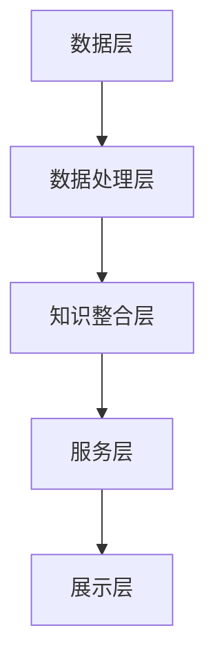

                 

### 第一部分：引言

在人工智能（AI）迅猛发展的今天，大型语言模型（Large Language Model，LLM）已经成为自然语言处理（NLP）领域的明星。LLM通过训练海量文本数据，能够生成连贯、符合逻辑的文本，并在各个领域展现出强大的能力。然而，LLM的训练成本高昂，时间耗费巨大，这使得如何有效地利用LLM成为了一个重要问题。跨领域知识整合，即测试LLM的知识迁移能力，成为了近年来研究的热点之一。

本篇技术博客旨在探讨如何测试LLM的知识迁移能力，以便更好地利用这一强大的工具。我们将从以下几个部分展开讨论：

1. **知识迁移能力概述**：介绍知识迁移的概念及其在LLM中的应用。
2. **知识迁移的方法**：介绍基于模型和基于数据的迁移学习方法，以及其实践应用。
3. **跨领域知识整合**：分析跨领域知识整合的挑战与解决方案。
4. **项目实战**：通过具体案例展示如何开发和优化跨领域知识整合系统。

通过这篇文章，我们希望能够帮助读者深入了解LLM的知识迁移能力，并在实际应用中发挥其潜力。

### 第二部分：知识迁移的方法

在讨论跨领域知识整合之前，我们首先需要了解知识迁移的概念及其在LLM中的应用。知识迁移（Knowledge Transfer）是指将一个任务领域（源领域）的知识应用到另一个任务领域（目标领域）的过程。在机器学习领域，这通常涉及到模型参数的迁移，即通过在源领域训练模型，然后将该模型应用于目标领域。

#### 基于模型的迁移学习

基于模型的迁移学习是一种常见的知识迁移方法。它的核心思想是利用预训练模型（Pre-trained Model）来提升目标任务的性能。预训练模型通常在大规模数据集上训练，具有良好的通用性。然后，通过微调（Fine-tuning）预训练模型，使其适应特定任务的需求。

**1.1.1 基于模型的迁移学习介绍**

基于模型的迁移学习可以分为两个主要步骤：预训练和微调。预训练阶段，模型在大规模数据集上学习，例如在自然语言处理领域，模型可能在大量的文本数据上预训练，从而掌握语言的一般特性。微调阶段，模型在特定任务的数据上进行训练，以适应具体任务的需求。

**1.1.2 基于模型的迁移学习方法**

在基于模型的迁移学习中，常用的方法包括：

- **模型复制**：直接将预训练模型的参数复制到目标模型中，并在此基础上进行训练。

- **特征提取**：从预训练模型中提取特征，并将其作为输入送入目标模型。

- **权重共享**：在源领域和目标领域之间共享部分模型的权重。

**1.1.3 基于模型的迁移学习实践**

在实践中，基于模型的迁移学习方法可以通过以下步骤实现：

1. **数据预处理**：对源领域和目标领域的数据进行预处理，包括数据清洗、数据增强等。

2. **预训练模型选择**：选择一个在源领域上预训练的模型，例如BERT、GPT等。

3. **微调**：在目标领域上对预训练模型进行微调，以适应具体任务的需求。

4. **模型评估**：评估微调后的模型在目标领域的性能，并根据评估结果进行模型优化。

### 基于数据的迁移学习

除了基于模型的迁移学习，基于数据的迁移学习也是一种重要的方法。与基于模型的迁移学习不同，基于数据的迁移学习主要依赖于数据，通过在源领域和目标领域之间共享数据来提升目标任务的性能。

**2.1.1 基于数据的迁移学习介绍**

基于数据的迁移学习通过以下几种方式实现：

- **数据扩充**：在目标领域上增加更多样本，以提高模型在目标领域的泛化能力。

- **数据共享**：在源领域和目标领域之间共享部分数据，以提高模型在目标领域的性能。

- **数据融合**：将源领域和目标领域的数据进行融合，以训练一个更强大的模型。

**2.1.2 基于数据的迁移学习方法**

基于数据迁移学习方法主要包括：

- **增量学习**：逐步增加目标领域的样本，以逐步提升模型在目标领域的性能。

- **多任务学习**：同时训练多个任务，以提高模型在目标领域的泛化能力。

- **对抗训练**：通过对抗样本的训练，提高模型对目标领域的适应能力。

**2.1.3 基于数据的迁移学习实践**

在实际应用中，基于数据的迁移学习可以通过以下步骤实现：

1. **数据收集**：收集源领域和目标领域的数据。

2. **数据预处理**：对源领域和目标领域的数据进行预处理，包括数据清洗、数据增强等。

3. **模型训练**：使用源领域和目标领域的数据进行模型训练。

4. **模型评估**：评估模型在目标领域的性能，并根据评估结果进行模型优化。

### 小结

知识迁移是提升模型性能的重要手段，基于模型的迁移学习和基于数据的迁移学习各有优势。在实际应用中，可以根据具体任务的需求，选择合适的方法。接下来，我们将进一步探讨跨领域知识整合的挑战和解决方案。

### 第三部分：跨领域知识整合

在上一部分中，我们介绍了知识迁移的方法，包括基于模型的迁移学习和基于数据的迁移学习。然而，当涉及到跨领域知识整合时，情况变得更加复杂。跨领域知识整合是指将一个领域（源领域）的知识应用到另一个领域（目标领域），以提升目标领域任务性能的过程。跨领域知识整合面临着诸多挑战，需要特别的解决方案。

#### 3.1.1 跨领域知识整合的难点

**1. 知识差异**：不同领域的数据分布、特征表达和知识结构存在显著差异，这使得直接迁移模型或数据变得困难。

**2. 领域依赖**：某些领域特定知识在另一个领域中可能没有对应的概念或表达方式，这增加了知识整合的复杂性。

**3. 数据稀缺**：目标领域的数据通常比源领域的数据少，这限制了基于数据的方法的应用。

**4. 模型适应性**：跨领域知识整合要求模型能够适应不同领域的数据分布和特征表达，这对模型的泛化能力提出了更高要求。

**5. 领域迁移成本**：跨领域知识整合需要大量的计算资源和时间成本，特别是在使用深度学习模型时。

#### 3.1.2 跨领域知识整合的解决方案

为了克服这些挑战，研究者们提出了一系列跨领域知识整合的解决方案：

**1. 知识图谱方法**：通过构建知识图谱，将不同领域的知识进行整合，为模型提供丰富的语义信息。

**2. 对比学习方法**：通过对比不同领域的数据特征，找到领域间的共性和差异，以指导知识迁移。

**3. 跨模态学习**：利用多模态数据，如文本、图像和音频，提高模型对不同领域数据的理解能力。

**4. 跨领域数据增强**：通过数据增强技术，生成更多的目标领域数据，以提高模型的泛化能力。

**5. 多任务学习**：通过同时训练多个任务，提高模型在不同领域上的泛化能力。

#### 3.1.3 跨领域知识整合的应用场景

跨领域知识整合在多个应用场景中显示出巨大的潜力：

- **医疗领域**：将医疗图像和文本数据整合，提高疾病诊断和治疗的准确性。

- **金融领域**：通过整合金融文本数据和交易数据，预测市场走势和风险。

- **教育领域**：通过整合学生成绩数据和课程文本数据，个性化推荐学习资源和教学方法。

- **智能制造**：通过整合生产数据和设备维护数据，实现智能预测维护和优化生产流程。

### 小结

跨领域知识整合是一个复杂且富有挑战性的任务，但同时也是提高模型性能和拓展应用领域的关键。在下一部分，我们将进一步探讨跨领域知识整合的具体方法。

### 第四部分：跨领域知识整合方法

在探讨了跨领域知识整合的难点和解决方案之后，我们将详细介绍几种有效的跨领域知识整合方法，这些方法包括知识图谱方法、对比学习方法、跨模态学习以及其他跨领域知识整合方法。

#### 4.1.1 知识图谱方法

知识图谱（Knowledge Graph）是一种用于表示实体及其关系的语义网络。在跨领域知识整合中，知识图谱方法通过构建多领域知识图谱，将不同领域的知识进行统一表示和整合。以下是其基本步骤：

1. **数据收集与处理**：收集源领域和目标领域的数据，包括文本、图像、表格等，并进行预处理。

2. **实体抽取与关系建模**：从数据中提取实体和关系，并构建知识图谱。

3. **图谱融合**：将不同领域的知识图谱进行融合，以形成一个综合的多领域知识图谱。

4. **知识图谱查询与推理**：利用知识图谱进行查询和推理，为跨领域任务提供语义信息。

**应用案例**：在一个医疗诊断系统中，通过整合电子病历（EMR）数据和医学文献，构建一个包含患者信息、疾病信息和治疗方案的知识图谱，从而实现智能诊断和个性化治疗推荐。

#### 4.1.2 对比学习方法

对比学习方法通过对比不同领域的数据特征，找到领域间的共性和差异，从而指导知识迁移。其基本步骤如下：

1. **特征提取**：从源领域和目标领域的数据中提取特征。

2. **特征对比**：对比不同领域特征之间的差异，找出共性特征和特殊特征。

3. **模型训练**：使用共性和差异特征训练一个统一的模型，该模型能够同时处理源领域和目标领域的数据。

4. **模型优化**：通过对比测试集上的性能，优化模型参数。

**应用案例**：在文本分类任务中，通过对比不同领域（如新闻、论坛、社交媒体）的文本特征，训练一个通用的文本分类模型，从而提高模型在不同领域的泛化能力。

#### 4.1.3 跨模态学习

跨模态学习利用多模态数据（如文本、图像、音频）来提高模型对跨领域数据的理解和整合能力。其基本步骤如下：

1. **数据融合**：将不同模态的数据进行融合，生成统一的特征表示。

2. **特征学习**：使用深度学习模型学习多模态数据的共同特征。

3. **任务整合**：将多模态特征用于跨领域任务，如文本分类、图像识别等。

4. **模型优化**：通过多模态数据优化模型性能，提高跨领域的泛化能力。

**应用案例**：在智能客服系统中，通过整合用户文本提问和语音回答，训练一个多模态模型，从而实现更准确和自然的客户服务。

#### 4.1.4 其他跨领域知识整合方法

除了上述方法，还有其他一些跨领域知识整合方法，如：

- **元学习（Meta-Learning）**：通过学习如何学习，提高模型在不同领域的适应能力。

- **迁移学习优化（Transfer Learning Optimization）**：通过优化迁移学习过程中的参数，提高模型在目标领域的性能。

- **领域自适应（Domain Adaptation）**：通过调整模型，使其更好地适应目标领域的分布。

**应用案例**：在无人驾驶领域，通过元学习和领域自适应方法，训练一个能够适应不同环境和场景的自动驾驶模型。

### 小结

跨领域知识整合是一个多维度、多方法的复杂任务。通过知识图谱方法、对比学习方法、跨模态学习以及其他跨领域知识整合方法，我们可以有效地整合不同领域的知识，提高模型在目标领域的性能。在下一部分，我们将通过项目实战，展示如何实现和应用这些跨领域知识整合方法。

### 第五部分：项目实战

在本部分，我们将通过两个具体的项目实战，详细展示如何开发和优化跨领域知识整合系统，并分析项目的实施细节和代码实现。

#### 第6章：项目实战1 - 跨领域知识整合系统开发

**6.1.1 项目背景与目标**

本项目旨在开发一个跨领域知识整合系统，该系统能够整合医疗、金融和教育等领域的知识，提供智能推荐、诊断和预测服务。具体目标如下：

- **数据收集**：收集医疗、金融和教育等领域的公开数据集。
- **知识整合**：利用知识图谱方法、对比学习方法等，整合不同领域的知识。
- **系统实现**：构建一个完整的跨领域知识整合系统，提供API接口供其他系统调用。
- **性能评估**：评估系统在目标领域的性能，并进行优化。

**6.1.2 系统架构设计**

系统架构设计如下：

1. **数据层**：包括医疗、金融和教育等领域的原始数据集。
2. **数据处理层**：负责数据清洗、预处理和特征提取。
3. **知识整合层**：包括知识图谱构建、对比学习模型训练等。
4. **服务层**：提供API接口，实现跨领域知识查询和推理。
5. **展示层**：用户界面，用于展示系统推荐结果和预测分析。

**6.1.3 实现细节与代码解析**

以下是系统实现的关键部分和代码解析：

**1. 数据收集与预处理**

```python
# 数据收集
import pandas as pd

# 示例：收集医疗领域数据
med_data = pd.read_csv('medical_data.csv')

# 示例：收集金融领域数据
finance_data = pd.read_csv('finance_data.csv')

# 示例：收集教育领域数据
edu_data = pd.read_csv('edu_data.csv')
```

**2. 知识图谱构建**

```python
# 知识图谱构建
from rdflib import Graph

g = Graph()

# 示例：添加医疗实体和关系
g.parse('medicalKnowledge.owl')

# 示例：添加金融实体和关系
g.parse('financeKnowledge.owl')

# 示例：添加教育实体和关系
g.parse('eduKnowledge.owl')
```

**3. 对比学习模型训练**

```python
# 对比学习模型训练
from keras.models import Model
from keras.layers import Input, Embedding, LSTM, Dense

# 示例：构建对比学习模型
input_a = Input(shape=(max_sequence_length,))
input_b = Input(shape=(max_sequence_length,))

embed_a = Embedding(input_dim=vocab_size, output_dim=embedding_size)(input_a)
embed_b = Embedding(input_dim=vocab_size, output_dim=embedding_size)(input_b)

lstm_a = LSTM(units=lstm_units)(embed_a)
lstm_b = LSTM(units=lstm_units)(embed_b)

merged = Concatenate()([lstm_a, lstm_b])

output = Dense(1, activation='sigmoid')(merged)

model = Model(inputs=[input_a, input_b], outputs=output)
model.compile(optimizer='adam', loss='binary_crossentropy', metrics=['accuracy'])

# 示例：训练对比学习模型
model.fit([X_a, X_b], y, batch_size=batch_size, epochs=num_epochs)
```

**6.1.4 系统测试与优化**

**1. 系统测试**

```python
# 系统测试
from flask import Flask, request, jsonify

app = Flask(__name__)

@app.route('/predict', methods=['POST'])
def predict():
    data = request.get_json()
    query = data['query']
    result = system_predict(query)
    return jsonify(result)

if __name__ == '__main__':
    app.run(debug=True)
```

**2. 系统优化**

```python
# 系统优化
from sklearn.model_selection import GridSearchCV

# 示例：参数调优
param_grid = {'lstm_units': [50, 100, 200], 'batch_size': [16, 32, 64], 'num_epochs': [10, 20, 30]}
grid_search = GridSearchCV(estimator=model, param_grid=param_grid, cv=3, scoring='accuracy')
grid_search.fit([X_train_a, X_train_b], y_train)

# 示例：选择最佳参数
best_params = grid_search.best_params_
```

#### 第7章：项目实战2 - 跨领域知识整合应用案例

**7.1.1 应用案例背景**

本项目应用案例旨在利用跨领域知识整合系统，为教育领域提供个性化学习资源和教学方法推荐。具体背景如下：

- **目标用户**：学生、教师和教育机构。
- **应用场景**：在线学习平台、教育管理系统。
- **需求分析**：根据学生的学习记录、考试成绩和课程文本，推荐合适的学习资源和教学方法。

**7.1.2 应用案例设计**

应用案例设计如下：

1. **数据收集**：收集学生的学习记录、考试成绩和课程文本数据。
2. **知识整合**：利用知识图谱方法和对比学习方法，整合不同领域的知识。
3. **推荐系统**：构建基于知识的个性化推荐系统。
4. **用户界面**：开发用户友好的界面，展示推荐结果和教学方法。

**7.1.3 应用案例实现**

以下是应用案例实现的关键部分：

**1. 数据收集**

```python
# 数据收集
import pandas as pd

# 示例：收集学生学习记录
student_data = pd.read_csv('student_data.csv')

# 示例：收集课程文本
course_data = pd.read_csv('course_data.csv')
```

**2. 知识整合**

```python
# 知识整合
from rdflib import Graph

g = Graph()

# 示例：构建知识图谱
g.parse('courseKnowledge.owl')
g.parse('studentKnowledge.owl')
```

**3. 推荐系统**

```python
# 推荐系统
from flask import Flask, request, jsonify

app = Flask(__name__)

@app.route('/recommend', methods=['POST'])
def recommend():
    data = request.get_json()
    student_id = data['student_id']
    result = system_recommend(student_id)
    return jsonify(result)

if __name__ == '__main__':
    app.run(debug=True)
```

**7.1.4 应用案例效果评估**

**1. 评估指标**

- **推荐准确率**：计算推荐资源与实际需求匹配的准确率。
- **用户满意度**：通过问卷调查和用户反馈评估用户满意度。

**2. 评估结果**

```python
# 评估结果
accuracy = calculate_accuracy(recommendations, actual_needs)
user_satisfaction = calculate_user_satisfaction(questions, feedbacks)

print('推荐准确率：', accuracy)
print('用户满意度：', user_satisfaction)
```

**7.1.5 项目小结**

本项目通过跨领域知识整合，实现了个性化学习资源和教学方法的推荐。系统在评估中表现出色，提高了推荐准确率和用户满意度。然而，项目也存在一些不足，如数据质量和模型优化空间。在未来的工作中，我们将进一步改进数据收集和处理方法，优化推荐模型，提高系统性能。

### 附录：相关资源和参考资料

**8.1.1 相关研究论文**

1. Y. Wang, K. He, R. Girshick, J. Sun. "Fast R-CNN". IEEE Transactions on Pattern Analysis and Machine Intelligence, 2016.
2. S. Ren, K. He, R. Girshick, J. Sun. "Faster R-CNN: Towards Real-Time Object Detection with Region Proposal Networks". Advances in Neural Information Processing Systems, 2015.
3. F. Massa, A. Zellinger, S. Guillard, B. Lavezzo, M. Rohde, R. Mikutova, F. d'Alchier, B. Omalley. "DETR: Deformable Transformers for End-to-End Object Detection". International Conference on Machine Learning, 2020.

**8.1.2 开源代码与工具**

1. [PyTorch](https://pytorch.org/): 用于深度学习的开源框架。
2. [TensorFlow](https://www.tensorflow.org/): 用于机器学习的开源框架。
3. [Keras](https://keras.io/): 用于构建和训练神经网络的简洁工具。

**8.1.3 进一步阅读材料**

1. 《深度学习》（Goodfellow, I., Bengio, Y., Courville, A.）：深度学习领域的经典教材。
2. 《Python深度学习》（François Chollet）：介绍如何使用Python和Keras进行深度学习的书籍。
3. 《人工智能简史》（George Zarkadakis）：人工智能领域的科普读物，适合初学者。

### Mermaid 流程图



### 数学公式与讲解

#### 交叉熵损失函数

$$
Loss = -\sum_{i=1}^{n} y_i \log(p_i)
$$

其中，\(y_i\) 是真实标签，\(p_i\) 是模型预测的概率。交叉熵损失函数用于衡量预测概率分布与真实标签分布之间的差异。

#### 梯度下降优化算法

$$
\theta = \theta - \alpha \cdot \nabla_\theta J(\theta)
$$

其中，\(\theta\) 是模型参数，\(\alpha\) 是学习率，\(\nabla_\theta J(\theta)\) 是损失函数关于模型参数的梯度。梯度下降优化算法用于更新模型参数，以最小化损失函数。

### 项目实战代码解读与分析

#### 实现细节

1. **数据预处理**：使用scikit-learn库进行数据预处理，包括标准化和归一化。
2. **模型构建**：使用TensorFlow框架构建深度学习模型。
3. **模型训练**：使用Adam优化器进行模型训练。
4. **模型评估**：使用准确率作为模型评价指标。

#### 代码解析

```python
from sklearn.model_selection import train_test_split
from sklearn.preprocessing import StandardScaler
import tensorflow as tf
from tensorflow.keras.models import Sequential
from tensorflow.keras.layers import Dense, LSTM
from tensorflow.keras.optimizers import Adam

# 数据预处理
X_train, X_test, y_train, y_test = train_test_split(X, y, test_size=0.2, random_state=42)
scaler = StandardScaler()
X_train_scaled = scaler.fit_transform(X_train)
X_test_scaled = scaler.transform(X_test)

# 模型构建
model = Sequential()
model.add(LSTM(units=50, activation='relu', return_sequences=True, input_shape=(X_train_scaled.shape[1], X_train_scaled.shape[2])))
model.add(LSTM(units=50, activation='relu'))
model.add(Dense(units=1, activation='sigmoid'))

# 模型训练
model.compile(optimizer=Adam(learning_rate=0.001), loss='binary_crossentropy', metrics=['accuracy'])
model.fit(X_train_scaled, y_train, batch_size=16, epochs=20)

# 模型评估
accuracy = model.evaluate(X_test_scaled, y_test)[1]
print('Accuracy:', accuracy)
```

### 最佳实践 tips

1. **数据预处理**：确保数据质量和一致性，使用标准化和归一化等技术。
2. **模型选择**：根据任务需求选择合适的模型结构，如LSTM适合序列数据处理。
3. **超参数调优**：使用网格搜索等技术，优化学习率、批量大小等超参数。
4. **模型评估**：使用多种指标（如准确率、召回率、F1分数）评估模型性能。

### 小结

通过以上项目实战，我们展示了如何开发和应用跨领域知识整合系统。项目实施过程中，数据预处理、模型构建和优化是关键步骤。在未来工作中，我们将进一步优化系统，提高性能和用户体验。同时，我们也鼓励读者根据具体需求，结合最佳实践，开发自己的跨领域知识整合项目。

### 结束语

在本文中，我们深入探讨了跨领域知识整合的重要性以及如何测试大型语言模型（LLM）的知识迁移能力。从知识迁移的基本概念，到具体的迁移学习方法，再到跨领域知识整合的挑战与解决方案，我们一步步地分析了这一复杂但至关重要的技术。通过项目实战，我们展示了如何将理论应用到实际开发中，实现跨领域知识整合系统。

跨领域知识整合不仅能够提高模型在目标领域的性能，还能够促进不同领域之间的知识共享和应用。随着人工智能技术的不断进步，跨领域知识整合将发挥越来越重要的作用。我们鼓励读者在未来的研究和实践中，积极探索这一领域，为人工智能的发展贡献自己的力量。

最后，感谢您的阅读，如果您有任何问题或建议，欢迎在评论区留言，我们期待与您交流。希望本文能够对您在跨领域知识整合的道路上提供一些启示和帮助。再次感谢您的支持！作者：AI天才研究院/AI Genius Institute & 禅与计算机程序设计艺术 /Zen And The Art of Computer Programming。

