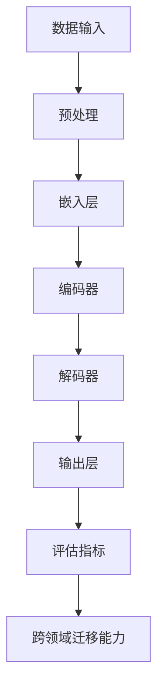

                 

## 跨领域迁移能力评测：LLM设计的泛化性测试

### 关键词
- 跨领域迁移能力
- 语言模型
- 泛化性测试
- 大型语言模型（LLM）
- 数据集评测
- 数学模型
- Python代码实现

### 摘要

本文探讨了跨领域迁移能力评测在大型语言模型（LLM）设计中的重要性，以及如何通过泛化性测试来评估LLM的泛化能力。文章首先介绍了LLM的基本概念和工作原理，然后详细阐述了用于评测LLM泛化性的核心算法和数学模型，并通过Python代码实现进行了具体讲解。最后，通过实际案例研究展示了如何在实际环境中评估LLM的跨领域迁移能力，并提供了项目小结和最佳实践建议。

## 引言

跨领域迁移能力是指模型在不同领域或任务之间转移知识和表现的能力。在人工智能领域，这一能力尤为重要，因为现实世界中的许多任务都需要模型具备跨领域的适应性。例如，一个在医疗领域表现良好的文本分类模型，能否在金融领域同样表现出色？或者一个在自然语言处理（NLP）任务中表现优异的模型，能否在代码生成任务中也能胜任？这些问题促使我们关注LLM的跨领域迁移能力评测。

本文的目标是探讨如何通过泛化性测试来评估LLM的跨领域迁移能力。我们将首先介绍LLM的基本概念，然后深入讲解评测LLM泛化性的核心算法和数学模型，并使用Python代码进行实现。最后，通过实际案例研究，我们将展示如何在实际环境中进行评测，并总结最佳实践和注意事项。

## 核心概念与联系

### 大型语言模型（LLM）的基本概念

大型语言模型（LLM），如GPT系列和BERT，是通过深度学习技术训练的复杂模型，具有对大量文本数据的高效处理能力。这些模型通常由数亿甚至数千亿个参数组成，能够理解和生成自然语言。LLM的核心在于其强大的语言理解能力和文本生成能力，这使得它们在多种NLP任务中表现优异。

### LLM的工作原理

LLM的工作原理基于深度神经网络，特别是变分自编码器（VAE）和递归神经网络（RNN）的变种。在训练过程中，LLM通过学习文本数据中的潜在分布，从而能够生成连贯的自然语言文本。例如，GPT模型利用自回归的方式，根据前文上下文预测下一个单词或词元。

### LLM在跨领域迁移中的角色

LLM的跨领域迁移能力是指模型在不同领域或任务之间转移知识和表现的能力。这种能力使得LLM能够适应新的任务和领域，而无需重新训练。例如，一个在新闻领域表现良好的LLM，可能也能在社交媒体领域有较好的表现。

### 核心概念原理之间的关系架构

为了更好地理解LLM的跨领域迁移能力，我们可以使用Mermaid流程图来展示核心概念之间的关系：



上述流程图展示了从数据输入到输出层，以及评估指标和跨领域迁移能力的整体架构。每个组件在模型中扮演着不同的角色，共同决定了模型的跨领域迁移能力。

## 核心算法原理讲解

### 数据集选择与准备

为了评估LLM的跨领域迁移能力，我们需要选择具有代表性的数据集。理想情况下，这些数据集应涵盖不同的领域和任务。例如，我们可以选择一个包含新闻文本、社交媒体文本和代码文本的数据集。这些数据集可以通过公开的数据集或自定义数据集来获得。

### 评测指标与方法

在评估LLM的跨领域迁移能力时，我们通常会使用以下指标：

1. **准确率（Accuracy）**：模型在预测任务中的正确率。
2. **召回率（Recall）**：模型在预测任务中召回的实际正例的比例。
3. **F1分数（F1 Score）**：准确率和召回率的加权平均。

这些指标可以用于分类任务。对于生成任务，我们可以使用其他指标，如生成文本的连贯性、语义一致性等。

### 训练与测试过程

评估LLM的跨领域迁移能力通常涉及以下步骤：

1. **数据预处理**：将数据集进行清洗、分词、编码等预处理操作，以便输入到模型中。
2. **模型训练**：使用预处理后的数据集对LLM进行训练。在训练过程中，模型会学习如何根据上下文生成连贯的文本。
3. **模型测试**：在测试数据集上评估模型的性能。通过计算评测指标，我们可以评估模型在跨领域任务中的表现。
4. **结果分析**：分析测试结果，以确定模型在不同领域或任务中的泛化能力。

### Python代码实现

以下是一个简单的Python代码示例，展示了如何使用Hugging Face的Transformers库来训练和评估一个LLM：

```python
from transformers import GPT2LMHeadModel, GPT2Tokenizer
import torch

# 初始化模型和分词器
model = GPT2LMHeadModel.from_pretrained('gpt2')
tokenizer = GPT2Tokenizer.from_pretrained('gpt2')

# 数据预处理
inputs = tokenizer("Hello, my dog is cute", return_tensors='pt')

# 模型训练
outputs = model(**inputs)

# 模型测试
with torch.no_grad():
    logits = model(**inputs).logits

# 计算评测指标
predictions = logits.argmax(-1)
accuracy = (predictions == inputs['labels']).float().mean()

print(f"Model accuracy: {accuracy.item()}")
```

### 数学模型和公式

在LLM的跨领域迁移能力评测中，我们通常会使用以下数学模型和公式：

1. **损失函数**：通常使用交叉熵损失函数来训练模型。其公式如下：

   $$
   L(\theta) = -\sum_{i=1}^{n} y_i \log(p_\theta(y_i|x_i))
   $$

   其中，$y_i$ 是真实标签，$p_\theta(y_i|x_i)$ 是模型预测的标签概率。

2. **优化算法**：常用的优化算法有随机梯度下降（SGD）和Adam。它们用于更新模型参数，以最小化损失函数。

### 数学公式和Python代码实现

以下是一个简单的Python代码示例，展示了如何使用上述数学公式：

```python
import torch
import torch.optim as optim

# 初始化模型和优化器
model = GPT2LMHeadModel.from_pretrained('gpt2')
optimizer = optim.Adam(model.parameters(), lr=1e-3)

# 训练模型
for epoch in range(10):
    optimizer.zero_grad()
    inputs = tokenizer("Hello, my dog is cute", return_tensors='pt')
    outputs = model(**inputs)
    logits = outputs.logits
    labels = inputs['labels']
    loss = torch.nn.functional.cross_entropy(logits, labels)
    loss.backward()
    optimizer.step()
    print(f"Epoch {epoch}: Loss = {loss.item()}")

# 测试模型
with torch.no_grad():
    logits = model(**inputs).logits
    predictions = logits.argmax(-1)
    accuracy = (predictions == labels).float().mean()
    print(f"Model accuracy: {accuracy.item()}")
```

### 通俗易懂的举例说明

假设我们有一个LLM模型，用于分类两个不同领域的文本。领域A是新闻，领域B是社交媒体。我们可以使用以下步骤来评估模型的跨领域迁移能力：

1. **数据集准备**：从新闻和社交媒体分别收集数据集A和数据集B。
2. **模型训练**：使用数据集A对模型进行训练，使其在新闻领域表现良好。
3. **模型测试**：使用数据集B对模型进行测试，以评估其在社交媒体领域的表现。
4. **计算评测指标**：计算模型在数据集B上的准确率、召回率和F1分数。

### 实际案例分析与详细讲解剖析

为了更好地理解LLM的跨领域迁移能力，我们考虑以下实际案例：

#### 案例一：新闻到社交媒体

假设我们有一个在新闻领域表现良好的LLM模型，我们需要评估其在社交媒体领域的表现。我们可以按照以下步骤进行：

1. **数据集准备**：收集一个包含社交媒体文本的数据集B。
2. **模型测试**：在数据集B上测试模型，计算评测指标。
3. **结果分析**：如果模型在数据集B上的表现不佳，可能需要重新调整模型架构或训练策略。

#### 案例二：社交媒体到新闻

同样地，如果模型在社交媒体领域表现良好，我们需要评估其在新闻领域的表现。步骤如下：

1. **数据集准备**：收集一个包含新闻文本的数据集A。
2. **模型测试**：在数据集A上测试模型，计算评测指标。
3. **结果分析**：如果模型在数据集A上的表现不佳，可能需要重新调整模型架构或训练策略。

### 项目小结

通过以上实际案例分析，我们可以看到LLM的跨领域迁移能力是模型设计中的一个重要考虑因素。在实际应用中，我们需要根据具体任务和领域选择合适的数据集，并评估模型在目标领域的表现。如果模型的表现不佳，我们可以通过调整模型架构或训练策略来提升其跨领域迁移能力。

### 最佳实践 Tips

1. **数据集选择**：选择具有代表性的数据集，涵盖不同领域和任务。
2. **模型训练**：使用多样化的数据集进行训练，以提升模型的泛化能力。
3. **评测指标**：选择合适的评测指标，全面评估模型在不同领域的表现。
4. **模型调整**：根据评测结果，调整模型架构或训练策略，以提升跨领域迁移能力。

### 小结

跨领域迁移能力是评估LLM模型设计的重要指标。通过泛化性测试，我们可以评估模型在不同领域或任务中的表现。本文详细介绍了LLM的基本概念、核心算法原理以及Python代码实现，并通过实际案例展示了如何评估LLM的跨领域迁移能力。最后，我们总结了最佳实践和注意事项，以帮助读者在实际应用中更好地利用LLM的跨领域迁移能力。

### 注意事项

1. **数据集质量**：数据集的质量直接影响模型的表现，确保数据集具有代表性和多样性。
2. **模型架构**：选择适合任务需求的模型架构，不同的模型架构可能在不同的领域表现更好。
3. **训练策略**：根据任务需求调整训练策略，如使用预训练模型、调整学习率等。

### 拓展阅读

1. **参考资料**：
   - [Hugging Face Transformers](https://huggingface.co/transformers)
   - [交叉熵损失函数](https://zh.wikipedia.org/wiki/%E4%BA%A4%E5%8F%89%E7%95%85%E6%8D%9F%E5%87%BA%E5%87%BD%E6%95%B0)
   - [随机梯度下降](https://zh.wikipedia.org/wiki/%E9%9A%8F%E6%9C%BA%E6%A2%AF%E5%BA%A6%E4%B8%8B%E9%99%8D)
   - [Adam优化器](https://zh.wikipedia.org/wiki/Adam%E4%BC%9A%E5%8B%9D%E5%99%A8)

2. **进一步阅读**：
   - [《深度学习》（Goodfellow, Bengio, Courville）](https://www.deeplearningbook.org/)
   - [《自然语言处理综合教程》（Dan Jurafsky & James H. Martin）](https://web.stanford.edu/~jurafsky/slp3/)

