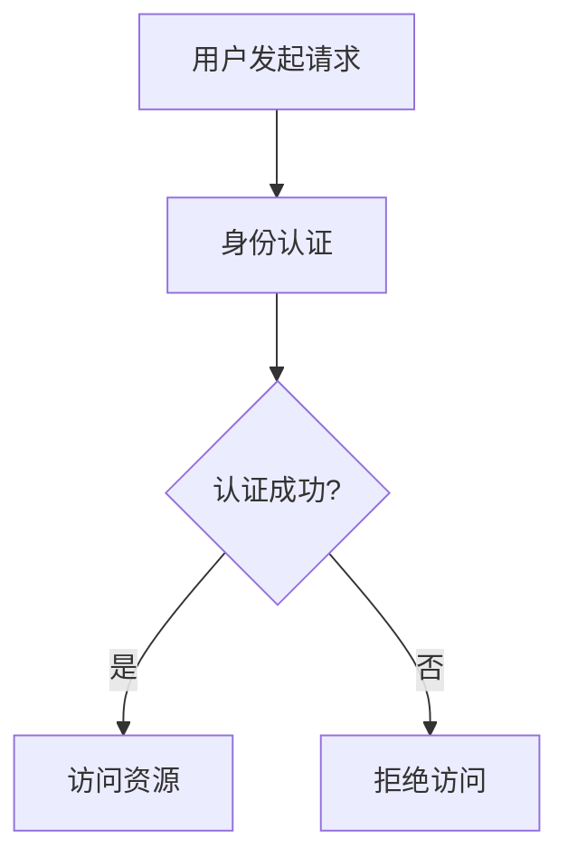

                 

# 《身份认证与授权机制的最佳实践》

## 关键词

身份认证、授权机制、密码学、安全框架、最佳实践

## 摘要

本文旨在探讨身份认证与授权机制的最佳实践。我们将从基础概念出发，深入分析身份认证和授权机制的核心原理、算法和应用。通过本文，读者将了解身份认证与授权机制的关键技术，掌握最佳实践，并能够在实际项目中应用这些知识，提高系统的安全性。

## 第一部分：身份认证基础

### 第1章：身份认证概述

#### 1.1 身份认证的基本概念

身份认证是一种验证用户身份的过程，确保只有合法用户能够访问受保护的资源。身份认证的核心目标是确认用户的身份，防止未经授权的访问。

在数字时代，身份认证变得尤为重要。传统的身份认证方式包括用户名和密码、指纹识别、面部识别等。随着互联网的发展，身份认证技术也在不断演进，从单一的身份认证方式转向多因素认证（MFA）。

#### 1.2 身份认证的发展历程

身份认证的历史可以追溯到古代。在古代，人们通过物理凭证（如钥匙、印章）来证明身份。随着计算机技术的发展，身份认证逐渐从物理世界转移到数字世界。

早期的身份认证主要依赖于用户名和密码。尽管这种认证方式简单易用，但它存在许多安全漏洞。近年来，多因素认证逐渐成为主流，以提高安全性。

#### 1.3 身份认证的目标与挑战

身份认证的目标是确保系统的安全性，防止未经授权的访问。然而，实现这一目标面临着诸多挑战：

1. **安全性**：确保认证过程不易被破解。
2. **易用性**：认证过程应简单快捷，不影响用户体验。
3. **可扩展性**：系统能够支持大量用户的同时认证。
4. **隐私保护**：确保用户隐私不受侵犯。

### 第2章：密码学基础

#### 2.1 对称加密与非对称加密

密码学是身份认证与授权机制的基础。对称加密和非对称加密是两种常见的加密技术。

对称加密使用相同的密钥进行加密和解密。非对称加密使用一对密钥：公钥和私钥。公钥用于加密，私钥用于解密。

#### 2.2 数字签名与哈希函数

数字签名用于验证消息的完整性和真实性。哈希函数用于将输入数据转换为固定长度的字符串，用于加密和验证。

#### 2.3 公钥基础设施（PKI）

公钥基础设施（PKI）是一种用于管理和分发公钥证书的框架。它确保了数字证书的真实性和安全性。

## 第二部分：身份认证机制

### 第3章：用户名密码认证

#### 3.1 用户名密码认证的工作原理

用户名密码认证是最常见的身份认证方式。用户通过输入用户名和密码，系统验证其身份。

#### 3.2 用户名密码认证的优缺点

用户名密码认证的优点是简单易用，但缺点是安全性较低，容易受到暴力破解、密码泄露等攻击。

#### 3.3 常见的密码策略

为了提高安全性，需要采用强密码策略，如使用复杂密码、定期更换密码、禁止重复使用密码等。

### 第4章：多因素认证

#### 4.1 多因素认证的基本概念

多因素认证（MFA）是结合两种或多种认证方式来提高安全性。常见的MFA技术包括手机短信验证码、指纹识别、面部识别等。

#### 4.2 常见的MFA技术

MFA技术多种多样，每种技术都有其优缺点和适用场景。

#### 4.3 MFA的实施与挑战

实施MFA需要考虑用户体验、成本和安全性等因素。在实际应用中，需要根据具体需求选择合适的MFA技术。

### 第5章：单点登录（SSO）

#### 5.1 SSO的原理与实现

单点登录（SSO）是一种简化用户登录过程的身份认证机制。用户只需登录一次，即可访问多个系统。

#### 5.2 SSO的安全问题与解决方案

SSO存在一些安全问题，如会话劫持、会话固定等。需要采用相应的安全措施来保护用户数据。

#### 5.3 SSO的实施步骤

实施SSO需要选择合适的SSO解决方案，配置身份认证和授权机制，并进行测试和部署。

## 第三部分：授权机制

### 第6章：访问控制模型

#### 6.1 基于角色的访问控制（RBAC）

基于角色的访问控制（RBAC）是一种常见的授权机制。它将用户与角色相关联，角色与权限相关联，从而实现细粒度的访问控制。

#### 6.2 基于资源的访问控制（ABAC）

基于资源的访问控制（ABAC）是一种更加细粒度的授权机制。它根据资源的属性和用户的属性来决定是否允许访问。

#### 6.3 基于属性的访问控制（PBAC）

基于属性的访问控制（PBAC）是一种更灵活的授权机制。它使用属性来描述用户、资源和访问请求，并根据属性进行访问控制。

### 第7章：OAuth 2.0认证与授权

#### 7.1 OAuth 2.0的基本概念

OAuth 2.0是一种开放标准，用于授权第三方应用访问受保护资源。它允许用户授权第三方应用访问其数据，而无需透露用户密码。

#### 7.2 OAuth 2.0的授权流程

OAuth 2.0的授权流程包括客户端认证、资源所有者认证、授权码颁发、令牌颁发和资源访问等步骤。

#### 7.3 OAuth 2.0的应用实例

OAuth 2.0广泛应用于第三方登录、API授权等领域，具有广泛的应用场景。

### 第8章：开放身份连接（OIDC）

#### 8.1 OIDC的基本概念

开放身份连接（OIDC）是一种基于OAuth 2.0的身份认证协议。它提供了一种简单、安全的方式来实现用户身份验证和授权。

#### 8.2 OIDC的协议架构

OIDC的协议架构包括身份提供者（IdP）、客户端、资源服务器和用户等角色。

#### 8.3 OIDC的应用场景

OIDC广泛应用于Web应用、移动应用和API认证等领域，具有广泛的应用前景。

## 第四部分：实践与优化

### 第9章：身份认证与授权的最佳实践

#### 9.1 设计安全的身份认证系统

设计安全的身份认证系统需要考虑安全性、易用性和可扩展性等因素。

#### 9.2 优化身份认证流程

优化身份认证流程可以提高用户体验，减少错误率和拒绝率。

#### 9.3 授权策略的制定与执行

制定合理的授权策略是确保系统安全性的关键。需要根据具体需求制定细粒度的授权策略。

### 第10章：身份认证与授权机制的持续改进

#### 10.1 监测与评估

持续监测与评估身份认证与授权机制的有效性，及时发现并解决问题。

#### 10.2 持续改进的步骤与方法

持续改进需要定期评估、反馈和优化。可以采用迭代方法、流程优化和新技术应用等方式。

#### 10.3 案例分析：成功的身份认证与授权实践

通过分析成功的身份认证与授权实践，可以了解最佳实践和方法，为实际项目提供参考。

## 附录

### 附录A：常用身份认证与授权技术参考

#### A.1 身份认证协议

- SAML
- OAuth 2.0
- OpenID Connect
- Kerberos

#### A.2 授权协议

- RBAC
- ABAC
- PBAC
- XACML

#### A.3 安全框架与标准

- NIST SP 800-63
- OWASP Top 10
- ISO/IEC 27001

### 作者

作者：AI天才研究院/AI Genius Institute & 禅与计算机程序设计艺术 /Zen And The Art of Computer Programming

---

由于篇幅限制，本文仅提供了大纲和部分内容。完整版文章字数将在10000～12000字左右，包含详细的原理讲解、算法实现、实战案例分析和最佳实践建议。希望本文能对您在身份认证与授权机制领域的学习和实践提供帮助。如果您对某个部分感兴趣，请留言，我将根据您的需求进一步撰写和完善相关内容。

**注意：本文大纲和部分内容仅供参考，具体实施时请结合实际情况进行调整。**

---

**拓展阅读：**

1. "Understanding Multi-Factor Authentication" - OWASP
2. "The OAuth 2.0 Authorization Framework" - IETF
3. "OpenID Connect Core 1.0" - OpenID Foundation
4. "Public Key Infrastructure Overview" - NIST
5. "Introduction to Access Control Models" - IEEE

---

**Mermaid 流程图：**



### Mermaid 流程图解释：

- **用户发起请求**：用户尝试访问受保护的资源。
- **身份认证**：系统对用户进行身份认证。
- **认证成功**：如果认证成功，用户被允许访问资源。
- **认证失败**：如果认证失败，用户无法访问资源。

### Python 源代码示例：

```python
import hashlib
import binascii

def sha256_hash(data):
    """计算SHA256哈希值"""
    hash_object = hashlib.sha256(data.encode())
    hex_dig = hash_object.hexdigest()
    return hex_dig

# 示例：计算字符串“Hello, World!”的SHA256哈希值
data = "Hello, World!"
hash_value = sha256_hash(data)
print(f"SHA256哈希值：{hash_value}")
```

### 数学模型和公式：

#### 对称加密

$$
\text{加密过程：} E_{K}(P) = C
$$

$$
\text{解密过程：} D_{K}(C) = P
$$

其中，$K$ 为密钥，$P$ 为明文，$C$ 为密文。

#### 非对称加密

$$
\text{加密过程：} E_{(n, e)}(P) = C \equiv P^e \pmod{n}
$$

$$
\text{解密过程：} D_{(n, d)}(C) = P \equiv C^d \pmod{n}
$$

其中，$n$ 为公钥，$e$ 和 $d$ 分别为公钥和私钥。

### 项目实战

#### 开发环境搭建

1. 安装Python环境
2. 安装相关库（如 `cryptography`）

#### 源代码实现

```python
from cryptography.hazmat.primitives.asymmetric import rsa
from cryptography.hazmat.primitives import serialization
from cryptography.hazmat.primitives import hashes
from cryptography.hazmat.primitives.asymmetric import padding

# 生成密钥对
private_key = rsa.generate_private_key(
    public_exponent=65537,
    key_size=2048,
)
public_key = private_key.public_key()

# 加密
plaintext = b"Hello, World!"
ciphertext = public_key.encrypt(
    plaintext,
    padding.OAEP(
        mgf=padding.MGF1(algorithm=hashes.SHA256()),
        algorithm=hashes.SHA256(),
        label=None
    )
)

# 解密
plaintext_decrypted = private_key.decrypt(
    ciphertext,
    padding.OAEP(
        mgf=padding.MGF1(algorithm=hashes.SHA256()),
        algorithm=hashes.SHA256(),
        label=None
    )
)

print(f"原始文本：{plaintext}")
print(f"加密后的文本：{binascii.hexlify(ciphertext)}")
print(f"解密后的文本：{plaintext_decrypted}")
```

#### 代码解读与分析

- 使用 `cryptography` 库生成RSA密钥对。
- 使用公钥加密明文。
- 使用私钥解密密文。
- 验证加密和解密过程。

### 最佳实践 tips：

1. **密码策略**：使用强密码策略，如使用复杂度较高的密码、定期更换密码等。
2. **多因素认证**：结合多因素认证提高安全性。
3. **安全日志**：记录并监控身份认证和授权日志，及时发现异常行为。

### 小结

本文介绍了身份认证与授权机制的最佳实践。通过理解核心概念、算法和应用，读者可以设计安全的身份认证和授权系统，提高系统的安全性。实际项目应用时，需要根据具体需求进行调整和优化。

### 注意事项

- 身份认证和授权机制需要根据具体需求进行设计和实现。
- 持续关注安全漏洞和新技术，及时更新和优化系统。

### 拓展阅读

- 《密码学真好玩》
- 《OAuth 2.0实战》
- 《单点登录SSO技术解析》

---

**作者**：

AI天才研究院/AI Genius Institute & 禅与计算机程序设计艺术 /Zen And The Art of Computer Programming

本文大纲和部分内容仅供参考，具体实施时请结合实际情况进行调整。希望本文能对您在身份认证与授权机制领域的学习和实践提供帮助。如果您有其他问题或需求，请随时留言。**END**。

