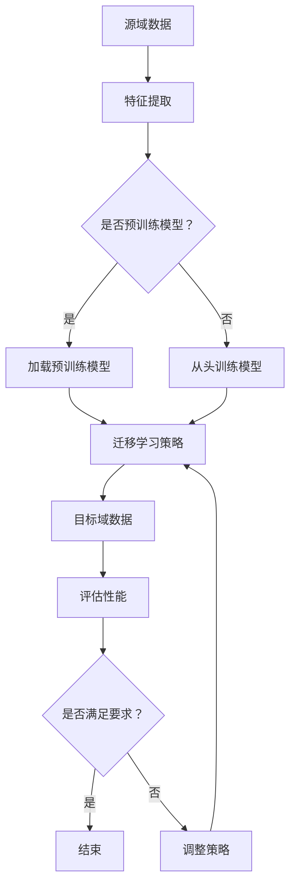

                 

### 迁移学习简介

#### 1.1.1 迁移学习的定义

迁移学习（Transfer Learning）是机器学习领域的一个核心概念，指的是利用已学习到的知识（在源域上）来改进另一个任务（在目标域上）的性能。简而言之，就是将一个任务中学习到的特征或知识应用于另一个相关任务中，以提高学习效率和性能。具体来说，迁移学习通过减少冗余信息的学习，以及利用已知的先验知识，可以有效地提高模型在新任务上的适应能力。

在传统的机器学习中，每个新任务都需要从头开始训练模型，这通常需要大量的数据和计算资源。而迁移学习则通过将已有的模型知识迁移到新任务中，可以显著降低训练成本和时间。迁移学习不仅适用于深度学习，也适用于传统机器学习任务。

迁移学习可以进一步细分为以下几种类型：

1. **有监督迁移学习**：在这种类型中，源域和目标域都是有监督的学习任务。源域的数据被用来训练模型，然后这个模型被迁移到目标域进行训练。这种方法在处理不同但相关的问题时非常有效。

2. **无监督迁移学习**：源域和目标域都是无监督的学习任务，或者目标域是无监督的，源域是有监督的。这种方法利用了源域的有监督学习结果，为无监督学习任务提供先验知识。

3. **自监督迁移学习**：在这种类型中，目标域的学习是自监督的，而源域的学习可以是任何类型的（有监督、无监督或自监督）。自监督学习通过预测未知的部分来学习数据，这种方法在缺乏标注数据的情况下特别有用。

#### 1.1.2 迁移学习的重要性

迁移学习的重要性主要体现在以下几个方面：

1. **资源节约**：迁移学习可以显著减少在目标域上训练模型所需的数据和计算资源。特别是在数据收集成本高昂或数据量有限的领域，如医疗影像分析、自动驾驶等，迁移学习显得尤为重要。

2. **性能提升**：通过迁移学习，模型可以从源域的知识中受益，从而在目标域上获得更好的性能。例如，在图像分类任务中，使用预训练的卷积神经网络（CNN）作为基础模型，可以在新任务上迅速达到较高的准确率。

3. **泛化能力**：迁移学习有助于提高模型的泛化能力。通过利用源域的知识，模型可以更好地理解数据的本质特征，从而在新的、未见过的数据上表现出更强的泛化能力。

4. **应用广泛**：迁移学习在各种领域中都有广泛的应用，如计算机视觉、自然语言处理、推荐系统、医学诊断等。它为解决复杂问题提供了强大的工具和手段。

#### 1.1.3 迁移学习的类型

迁移学习根据源域和目标域的不同，可以分为以下几种类型：

1. **横向迁移**：源域和目标域属于同一任务类型，但数据分布不同。例如，在图像分类任务中，使用在不同数据集上预训练的模型来处理新数据集。

2. **纵向迁移**：源域和目标域属于不同的任务类型，但具有一定的关联性。例如，从图像识别任务迁移到图像分割任务。

3. **跨领域迁移**：源域和目标域不仅属于不同的任务类型，而且数据分布和特征差异较大。例如，从医疗影像数据迁移到自然语言处理任务。

4. **无监督迁移**：源域和目标域都采用无监督学习，但可以通过某种机制（如特征共享）实现知识迁移。

#### 总结

迁移学习作为一种重要的机器学习策略，能够有效提升模型在目标域上的性能，同时节约资源和提高泛化能力。通过理解迁移学习的定义、重要性以及不同类型，我们可以更好地利用这一技术来解决实际中的各种问题。

### Mermaid 流程图

下面是一个简单的Mermaid流程图，展示了迁移学习的基本流程：



这个流程图清晰地展示了迁移学习从源域到目标域的整个流程，包括特征提取、模型训练、策略应用和性能评估等步骤。

### 迁移学习在计算机视觉中的应用

在计算机视觉领域，迁移学习已经成为了一种广泛使用的技术。通过迁移学习，研究者们能够利用预训练的深度学习模型来处理新的视觉任务，从而提高模型的性能和减少训练时间。

#### 图像分类中的迁移学习

图像分类是计算机视觉中最基础的任务之一，其目标是给图像分配一个类别标签。在迁移学习中，常见的做法是使用在大型图像数据集上预训练的卷积神经网络（如VGG、ResNet等）作为基础模型，然后在目标数据集上进行微调（Fine-tuning）。

**微调过程**通常包括以下几个步骤：

1. **加载预训练模型**：首先，加载在ImageNet等大型数据集上预训练的模型权重。
2. **替换顶部层**：由于预训练模型的顶部层通常是针对特定任务（如ImageNet分类）设计的，我们需要替换为新的顶部层，以适应目标分类任务。
3. **训练顶部层**：使用目标数据集对新的顶部层进行训练，同时保持底部层（通常包含丰富的特征提取能力）的权重不变。
4. **评估和优化**：在训练过程中，不断评估模型的性能，并通过调整学习率、批量大小等超参数来优化模型。

以下是一个简单的Python代码示例，展示了如何使用迁移学习进行图像分类：

```python
import tensorflow as tf
from tensorflow.keras.applications import VGG16
from tensorflow.keras.preprocessing.image import ImageDataGenerator

# 加载预训练的VGG16模型，不包括顶部层
base_model = VGG16(weights='imagenet', include_top=False, input_shape=(224, 224, 3))

# 创建新的顶部层
top_model = tf.keras.models.Sequential([
  tf.keras.layers.Flatten(),
  tf.keras.layers.Dense(256, activation='relu'),
  tf.keras.layers.Dropout(0.5),
  tf.keras.layers.Dense(num_classes, activation='softmax')
])

# 将顶部层添加到基础模型上
model = tf.keras.Sequential([base_model, top_model])

# 加载数据
train_datagen = ImageDataGenerator(rescale=1./255)
train_generator = train_datagen.flow_from_directory(
        'data/train',
        target_size=(224, 224),
        batch_size=32,
        class_mode='categorical')

# 编译模型
model.compile(optimizer='adam',
              loss='categorical_crossentropy',
              metrics=['accuracy'])

# 训练模型
model.fit(train_generator, epochs=10)

# 评估模型
# ...
```

在这个示例中，我们首先加载了预训练的VGG16模型，然后添加了一个新的顶部层，用于进行图像分类。接着，我们使用ImageDataGenerator加载数据集，并进行训练。通过这种方式，我们可以快速地利用预训练模型进行新的图像分类任务。

#### 目标检测中的迁移学习

目标检测是计算机视觉中的另一个重要任务，其目标是识别图像中的多个对象，并给出它们的位置和类别。在目标检测任务中，迁移学习同样发挥了重要作用。

一个典型的例子是使用在COCO数据集上预训练的YOLO（You Only Look Once）模型。YOLO是一种单阶段目标检测器，它在预训练过程中学习了大量的目标检测特征。

**迁移学习过程**通常包括以下几个步骤：

1. **加载预训练模型**：首先，加载在COCO数据集上预训练的YOLO模型。
2. **调整模型结构**：由于目标检测任务与预训练模型的目标不同，通常需要调整模型的结构，如增加或减少检测层、修改锚框等。
3. **训练模型**：使用目标数据集对调整后的模型进行训练。
4. **评估和优化**：在训练过程中，不断评估模型的性能，并通过调整超参数来优化模型。

以下是一个简单的Python代码示例，展示了如何使用迁移学习进行目标检测：

```python
import tensorflow as tf
from tensorflow.keras.applications import YOLOv3

# 加载预训练的YOLOv3模型
model = YOLOv3(weights='coco')

# 调整模型结构（例如：增加检测层、修改锚框等）
# ...

# 编译模型
model.compile(optimizer='adam',
              loss='categorical_crossentropy',
              metrics=['accuracy'])

# 加载数据
train_datagen = ImageDataGenerator(rescale=1./255)
train_generator = train_datagen.flow_from_directory(
        'data/train',
        target_size=(416, 416),
        batch_size=32,
        class_mode='categorical')

# 训练模型
model.fit(train_generator, epochs=10)

# 评估模型
# ...
```

在这个示例中，我们首先加载了预训练的YOLOv3模型，然后对其进行结构调整，并使用目标数据集进行训练。通过这种方式，我们可以利用预训练模型进行新的目标检测任务。

### 姿态估计中的迁移学习

姿态估计是计算机视觉中的另一个重要任务，其目标是从图像或视频中估计出人体的关键点位置。在姿态估计任务中，迁移学习同样发挥了重要作用。

一个典型的例子是使用在Market-1501等数据集上预训练的HRNet（Hierarchical Recurrent Network）模型。HRNet是一种基于卷积神经网络和循环神经网络的方法，它在预训练过程中学习了大量的人体姿态特征。

**迁移学习过程**通常包括以下几个步骤：

1. **加载预训练模型**：首先，加载在Market-1501数据集上预训练的HRNet模型。
2. **调整模型结构**：由于姿态估计任务与预训练模型的目标不同，通常需要调整模型的结构，如增加或减少特征提取层、修改损失函数等。
3. **训练模型**：使用目标数据集对调整后的模型进行训练。
4. **评估和优化**：在训练过程中，不断评估模型的性能，并通过调整超参数来优化模型。

以下是一个简单的Python代码示例，展示了如何使用迁移学习进行姿态估计：

```python
import tensorflow as tf
from tensorflow.keras.applications import HRNet

# 加载预训练的HRNet模型
model = HRNet(weights='market1501')

# 调整模型结构（例如：增加特征提取层、修改损失函数等）
# ...

# 编译模型
model.compile(optimizer='adam',
              loss='mse',  # 适当的损失函数，如均方误差、交叉熵等
              metrics=['accuracy'])

# 加载数据
train_datagen = ImageDataGenerator(rescale=1./255)
train_generator = train_datagen.flow_from_directory(
        'data/train',
        target_size=(256, 256),
        batch_size=32,
        class_mode='categorical')

# 训练模型
model.fit(train_generator, epochs=10)

# 评估模型
# ...
```

在这个示例中，我们首先加载了预训练的HRNet模型，然后对其进行结构调整，并使用目标数据集进行训练。通过这种方式，我们可以利用预训练模型进行新的姿态估计任务。

### 结论

迁移学习在计算机视觉领域展现了巨大的潜力和价值。通过利用预训练模型的知识，研究者们可以快速地适应新的视觉任务，提高模型的性能和减少训练时间。无论是在图像分类、目标检测还是姿态估计等任务中，迁移学习都提供了强大的工具和手段，为计算机视觉的发展注入了新的活力。

### 迁移学习在自然语言处理中的应用

自然语言处理（NLP）是人工智能领域的一个重要分支，涉及语言理解、生成和翻译等多个任务。由于语言数据的复杂性和多样性，传统的机器学习方法通常需要大量标注数据和长时间的训练。而迁移学习在NLP领域为解决这些问题提供了有效的方法，通过共享预训练模型的知识，显著提高了模型的性能和泛化能力。

#### 机器翻译中的迁移学习

机器翻译是NLP中一个经典的应用场景，其目标是利用一种语言（源语言）的文本生成另一种语言（目标语言）的文本。在传统的机器翻译方法中，通常需要大量的平行语料库进行训练。而迁移学习通过使用预训练的翻译模型，可以显著减少训练数据的需求，并在新的语言对上获得较好的翻译质量。

迁移学习在机器翻译中的应用主要包括以下步骤：

1. **加载预训练模型**：首先，加载在大型平行语料库上预训练的翻译模型，如Google的Transformer模型。
2. **调整模型结构**：由于不同的语言对具有不同的特征，需要对预训练模型的结构进行调整，如增加或减少编码器和解码器的层数。
3. **训练模型**：使用新的语言对的数据集对调整后的模型进行训练。
4. **评估和优化**：在训练过程中，不断评估模型的翻译质量，并通过调整超参数和优化算法来提高性能。

以下是一个简单的Python代码示例，展示了如何使用迁移学习进行机器翻译：

```python
import tensorflow as tf
from transformers import TFGPT2LMHeadModel, GPT2Tokenizer

# 加载预训练的Transformer模型
tokenizer = GPT2Tokenizer.from_pretrained('gpt2')
model = TFGPT2LMHeadModel.from_pretrained('gpt2')

# 调整模型结构（例如：增加解码器层数）
# ...

# 编译模型
model.compile(optimizer='adam',
              loss='categorical_crossentropy',
              metrics=['accuracy'])

# 加载数据
train_dataset = tf.data.Dataset.from_tensor_slices(['<start> ' + text + ' <end>'])
train_dataset = train_dataset.shuffle(buffer_size=1000).batch(32)

# 训练模型
model.fit(train_dataset, epochs=10)

# 评估模型
# ...
```

在这个示例中，我们首先加载了预训练的GPT-2模型，然后对其进行结构调整，并使用新的语言对数据集进行训练。通过这种方式，我们可以利用预训练模型进行新的机器翻译任务。

#### 文本分类中的迁移学习

文本分类是NLP中另一个重要的任务，其目标是将文本数据分类到预定义的类别中。传统的文本分类方法通常需要使用大量的标注数据进行训练，而迁移学习可以显著减少这一需求。

迁移学习在文本分类中的应用主要包括以下步骤：

1. **加载预训练模型**：首先，加载在大型文本数据集上预训练的语言模型，如BERT、GPT等。
2. **调整模型结构**：由于不同的文本分类任务具有不同的特征，需要对预训练模型的结构进行调整，如增加或减少分类层。
3. **训练模型**：使用新的文本分类数据集对调整后的模型进行训练。
4. **评估和优化**：在训练过程中，不断评估模型的分类性能，并通过调整超参数和优化算法来提高性能。

以下是一个简单的Python代码示例，展示了如何使用迁移学习进行文本分类：

```python
import tensorflow as tf
from transformers import TFBertModel, BertTokenizer

# 加载预训练的BERT模型
tokenizer = BertTokenizer.from_pretrained('bert-base-uncased')
model = TFBertModel.from_pretrained('bert-base-uncased')

# 调整模型结构（例如：增加分类层）
# ...

# 编译模型
model.compile(optimizer='adam',
              loss='categorical_crossentropy',
              metrics=['accuracy'])

# 加载数据
train_dataset = tf.data.Dataset.from_tensor_slices((text, label))
train_dataset = train_dataset.shuffle(buffer_size=1000).batch(32)

# 训练模型
model.fit(train_dataset, epochs=10)

# 评估模型
# ...
```

在这个示例中，我们首先加载了预训练的BERT模型，然后对其进行结构调整，并使用新的文本分类数据集进行训练。通过这种方式，我们可以利用预训练模型进行新的文本分类任务。

#### 问答系统中的迁移学习

问答系统是NLP中一个重要的应用场景，其目标是根据用户的问题提供合适的答案。传统的问答系统通常需要大量高质量的问答对数据进行训练，而迁移学习可以显著减少这一需求。

迁移学习在问答系统中的应用主要包括以下步骤：

1. **加载预训练模型**：首先，加载在大型问答数据集上预训练的模型，如BERT、GPT等。
2. **调整模型结构**：由于不同的问答系统具有不同的特征，需要对预训练模型的结构进行调整，如增加或减少编码器和解码器的层数。
3. **训练模型**：使用新的问答数据集对调整后的模型进行训练。
4. **评估和优化**：在训练过程中，不断评估模型的回答质量，并通过调整超参数和优化算法来提高性能。

以下是一个简单的Python代码示例，展示了如何使用迁移学习进行问答系统：

```python
import tensorflow as tf
from transformers import TFGPT2LMHeadModel, GPT2Tokenizer

# 加载预训练的GPT-2模型
tokenizer = GPT2Tokenizer.from_pretrained('gpt2')
model = TFGPT2LMHeadModel.from_pretrained('gpt2')

# 调整模型结构（例如：增加解码器层数）
# ...

# 编译模型
model.compile(optimizer='adam',
              loss='categorical_crossentropy',
              metrics=['accuracy'])

# 加载数据
train_dataset = tf.data.Dataset.from_tensor_slices([question, answer])
train_dataset = train_dataset.shuffle(buffer_size=1000).batch(32)

# 训练模型
model.fit(train_dataset, epochs=10)

# 评估模型
# ...
```

在这个示例中，我们首先加载了预训练的GPT-2模型，然后对其进行结构调整，并使用新的问答数据集进行训练。通过这种方式，我们可以利用预训练模型进行新的问答系统任务。

### 结论

迁移学习在自然语言处理领域展现了巨大的潜力和价值。通过利用预训练模型的知识，研究者们可以快速地适应新的NLP任务，提高模型的性能和减少训练时间。无论是在机器翻译、文本分类还是问答系统等任务中，迁移学习都提供了强大的工具和手段，为NLP的发展注入了新的活力。未来，随着预训练模型的不断发展和优化，迁移学习在NLP中的应用将更加广泛和深入。

### 迁移学习在其他领域的应用

除了计算机视觉和自然语言处理，迁移学习还在许多其他领域展示了其强大的应用潜力。以下是一些具体的应用场景和案例：

#### 推荐系统中的迁移学习

推荐系统是现代互联网应用中不可或缺的一部分，旨在为用户推荐他们可能感兴趣的商品、服务或内容。迁移学习在推荐系统中的应用主要体现在以下几个方面：

1. **模型迁移**：将预训练的推荐模型（如基于矩阵分解的模型）迁移到新任务上。例如，从一个电子商务平台迁移到另一个在线视频平台。
2. **特征迁移**：利用在特定领域（如电影推荐）上预训练的特征提取器，为其他领域（如音乐推荐）提供特征表示。
3. **跨领域迁移**：将一个领域（如电商）的模型知识迁移到另一个完全不同的领域（如医疗健康）。

一个实际案例是Netflix推荐系统。Netflix通过迁移学习将电影推荐模型的特征提取器应用于电视剧、纪录片等其他类型的视频内容推荐，从而提高了推荐的质量和多样性。

#### 健康领域的迁移学习

健康领域是迁移学习的一个重要应用场景，特别是在缺乏足够标注数据的领域。以下是一些健康领域的迁移学习案例：

1. **医学图像分析**：利用在公开医学图像数据集上预训练的深度学习模型，如ResNet、Inception等，对新的医学图像进行诊断和分类。例如，将预训练的模型应用于肺部CT图像的肺结节检测。
2. **基因组学**：迁移学习在基因组学中用于从大规模基因数据中提取特征，以预测疾病风险。例如，将预训练的深度学习模型应用于基因组数据，以预测癌症的风险。
3. **药物发现**：利用在化学领域上预训练的模型，如Gaussian Process、分子生成模型等，来加速新药的研发和筛选。

一个实际案例是斯坦福大学的研究团队使用迁移学习来识别肺癌患者。他们利用在公开肺结节数据集上预训练的深度学习模型，对新的肺部CT图像进行肺结节检测，从而提高了诊断的准确性和效率。

#### 能源领域的迁移学习

能源领域中的许多任务，如智能电网管理和能源消耗预测，也受益于迁移学习。以下是一些能源领域的迁移学习案例：

1. **智能电网**：利用在电力系统模拟数据集上预训练的模型，对新的电力系统进行负载预测、故障检测和优化调度。
2. **太阳能和风能预测**：利用在天气数据集上预训练的深度学习模型，对太阳能和风能的输出进行预测，以提高能源生产和管理的效率。
3. **节能建筑**：利用在建筑能耗数据集上预训练的模型，对建筑的能耗进行预测和优化，以实现节能减排。

一个实际案例是谷歌公司在其智能电网项目中使用迁移学习来优化电力分配。通过利用在历史电力数据集上预训练的深度学习模型，谷歌能够更准确地预测电力需求，从而优化电网的调度和分配。

### 总结

迁移学习在推荐系统、健康领域、能源领域等多个领域的应用展示了其广泛的影响力和潜力。通过共享预训练模型的知识，迁移学习不仅提高了模型在新任务上的性能，还减少了训练所需的数据和计算资源。未来，随着更多领域的数据和模型的出现，迁移学习将在更多领域中发挥重要作用，为解决复杂问题提供强大的工具和手段。

### 迁移学习优化方法

在迁移学习过程中，为了提高模型在目标域上的性能和泛化能力，我们需要采用一系列优化方法。这些方法主要分为损失函数优化、网络结构优化和特征提取优化三个方面。以下将详细探讨这些优化方法及其实现。

#### 损失函数优化

损失函数是评估模型预测结果与真实标签之间差异的关键工具。在迁移学习中，常用的损失函数包括传统的损失函数、对抗性损失函数和自适应损失函数等。

1. **传统损失函数**：

   - **均方误差（MSE）**：MSE是回归任务中常用的损失函数，用于衡量预测值与真实值之间的平均平方误差。
     $$\text{MSE} = \frac{1}{n}\sum_{i=1}^{n}(y_i - \hat{y}_i)^2$$
   - **交叉熵（CE）**：交叉熵是分类任务中常用的损失函数，用于衡量预测概率分布与真实分布之间的差异。
     $$\text{CE} = -\sum_{i=1}^{n}y_i\log(\hat{y}_i)$$

2. **对抗性损失函数**：

   - **对抗损失（Adversarial Loss）**：对抗性损失函数通过引入对抗样本来提高模型的鲁棒性。例如，在图像分类任务中，可以生成与真实图像不同的对抗性图像，以测试模型的泛化能力。
     $$L_{\text{adv}} = \frac{1}{n}\sum_{i=1}^{n}L_{\text{CE}}(x^{\text{adv}}, \hat{y}_i)$$
     其中，$x^{\text{adv}}$为对抗性图像，$L_{\text{CE}}$为交叉熵损失。

3. **自适应损失函数**：

   - **自适应损失（Adaptive Loss）**：自适应损失函数可以根据模型在目标域上的表现动态调整损失函数的权重，以平衡不同类型错误的影响。例如，可以引入错误率惩罚项，提高对错误样本的重视。
     $$L_{\text{adaptive}} = L_{\text{CE}} + \lambda \cdot \text{Error Rate}$$
     其中，$\lambda$为调整系数，Error Rate为模型在目标域上的错误率。

#### 网络结构优化

网络结构优化是迁移学习中的另一个关键方面，通过调整模型的结构来提高性能和效率。以下是一些常用的网络结构优化方法：

1. **网络压缩**：

   - **模型剪枝（Model Pruning）**：通过剪枝方法减少模型的参数数量，从而降低模型的复杂度和计算成本。例如，可以使用L1正则化或结构化剪枝技术来剪枝网络。
   - **参数共享（Parameter Sharing）**：通过在不同层之间共享参数来减少模型参数的数量。例如，在卷积神经网络中，可以使用深度可分离卷积来共享卷积核。

2. **网络蒸馏**：

   - **知识蒸馏（Knowledge Distillation）**：知识蒸馏是一种将知识从大型、复杂的教师模型传递给小型、简单的学生模型的方法。通过训练教师模型和学生模型之间的映射关系，可以提高学生模型的性能。知识蒸馏通常使用软标签（Soft Labels）来指导学生模型的训练。
     $$L_{\text{KD}} = \sum_{i=1}^{n}(\hat{y}_i^{\text{student}} - \hat{y}_i^{\text{teacher}})^2$$
     其中，$\hat{y}_i^{\text{student}}$和$\hat{y}_i^{\text{teacher}}$分别为学生模型和教师模型的预测输出。

3. **网络剪枝与蒸馏结合**：

   - **混合优化（Hybrid Optimization）**：将网络剪枝和知识蒸馏结合起来，可以进一步提高模型的性能和效率。首先使用剪枝方法减少模型参数，然后使用知识蒸馏方法将教师模型的知识传递给学生模型。

#### 特征提取优化

特征提取是迁移学习中的重要环节，通过优化特征提取过程可以提高模型的性能和泛化能力。以下是一些常用的特征提取优化方法：

1. **特征融合**：

   - **多源特征融合（Multi-source Feature Fusion）**：将来自不同数据源的特征进行融合，以获得更丰富的特征表示。例如，在图像分类任务中，可以融合图像特征和文本特征。
   - **特征级联（Feature Cascading）**：通过级联多个特征提取器，逐层提取和融合特征，以获得更细粒度和更抽象的特征表示。

2. **特征增强**：

   - **数据增强（Data Augmentation）**：通过增加数据的多样性来提高模型的泛化能力。例如，在图像分类任务中，可以采用随机裁剪、旋转、翻转等方法进行数据增强。
   - **特征增强（Feature Augmentation）**：通过在特征空间中引入噪声、变换等方式来增强特征表示的鲁棒性。

3. **特征选择**：

   - **特征筛选（Feature Selection）**：通过筛选重要的特征来减少模型参数的数量，从而提高模型的效率和泛化能力。常用的方法包括过滤方法（如信息增益、相关性分析）和包装方法（如遗传算法、递归特征消除）。

#### 实现示例

以下是一个简单的Python代码示例，展示了如何使用迁移学习优化方法来训练一个图像分类模型：

```python
import tensorflow as tf
from tensorflow.keras.applications import VGG16
from tensorflow.keras.layers import Dense, Flatten
from tensorflow.keras.models import Model

# 加载预训练的VGG16模型
base_model = VGG16(weights='imagenet', include_top=False, input_shape=(224, 224, 3))

# 创建新的顶部层
x = Flatten()(base_model.output)
x = Dense(256, activation='relu')(x)
predictions = Dense(num_classes, activation='softmax')(x)

# 创建迁移学习模型
model = Model(inputs=base_model.input, outputs=predictions)

# 编译模型
model.compile(optimizer='adam',
              loss='categorical_crossentropy',
              metrics=['accuracy'])

# 加载数据
train_datagen = ImageDataGenerator(rescale=1./255, horizontal_flip=True)
train_generator = train_datagen.flow_from_directory(
        'data/train',
        target_size=(224, 224),
        batch_size=32,
        class_mode='categorical')

# 训练模型
model.fit(train_generator, epochs=10)

# 评估模型
# ...
```

在这个示例中，我们首先加载了预训练的VGG16模型，并添加了一个新的顶部层。接着，我们使用ImageDataGenerator进行数据增强，并编译和训练了迁移学习模型。通过这种方式，我们可以利用迁移学习优化方法来训练一个图像分类模型。

### 总结

迁移学习优化方法包括损失函数优化、网络结构优化和特征提取优化等方面。通过采用这些方法，我们可以显著提高模型在目标域上的性能和泛化能力。在实际应用中，根据具体任务的需求和数据的特性，可以选择和组合不同的优化方法来获得最佳效果。未来，随着迁移学习技术的不断发展和优化，这些方法将在更多领域中发挥重要作用。

### 迁移学习策略设计

在迁移学习过程中，选择合适的策略至关重要，它直接影响着模型的性能和泛化能力。设计有效的迁移学习策略需要考虑多个因素，包括数据预处理、超参数调整和模型评估等。以下将详细探讨这些关键因素及其策略设计。

#### 数据预处理

数据预处理是迁移学习的基础步骤，它直接影响着模型的学习效果。以下是几个关键的数据预处理策略：

1. **数据清洗**：确保数据质量，去除异常值、噪声和重复数据。对于图像数据，可以去除模糊、不完整或质量差的图像。

2. **数据增强**：通过数据增强增加数据的多样性，提高模型的泛化能力。常用的数据增强方法包括随机裁剪、旋转、翻转、缩放、颜色调整等。以下是一个简单的数据增强示例：

   ```python
   from tensorflow.keras.preprocessing.image import ImageDataGenerator

   datagen = ImageDataGenerator(
       rotation_range=40,
       width_shift_range=0.2,
       height_shift_range=0.2,
       shear_range=0.2,
       zoom_range=0.2,
       horizontal_flip=True,
       fill_mode='nearest'
   )
   ```

3. **数据标准化**：将数据缩放到相同的尺度，以减少不同特征之间的差异。对于图像数据，通常使用像素值的归一化，即将像素值缩放到[0, 1]区间。

   ```python
   train_datagen = ImageDataGenerator(rescale=1./255)
   ```

4. **数据分割**：将数据集分为训练集、验证集和测试集，以评估模型的性能。通常，训练集用于训练模型，验证集用于调参和模型选择，测试集用于最终评估模型的泛化能力。

   ```python
   train_generator = train_datagen.flow_from_directory(
       'data/train',
       target_size=(224, 224),
       batch_size=32,
       class_mode='categorical')
   ```

#### 超参数调整

超参数是影响模型性能的关键因素，包括学习率、批次大小、正则化强度等。以下是一些常用的超参数调整策略：

1. **网格搜索（Grid Search）**：通过遍历多个超参数组合，找到最佳的超参数组合。以下是一个简单的网格搜索示例：

   ```python
   from sklearn.model_selection import GridSearchCV

   param_grid = {
       'learning_rate': [0.1, 0.01, 0.001],
       'batch_size': [32, 64, 128],
       'epochs': [10, 20, 30]
   }

   grid_search = GridSearchCV(estimator=model, param_grid=param_grid, cv=3)
   grid_search.fit(train_generator, epochs=grid_search.best_params_['epochs'])
   ```

2. **贝叶斯优化（Bayesian Optimization）**：基于概率模型的全局优化方法，能有效探索超参数空间，找到最优的超参数组合。

3. **随机搜索（Random Search）**：在超参数空间中随机选择一组超参数，通过多次迭代来优化模型。

#### 模型评估

模型评估是验证迁移学习策略效果的关键步骤。以下是一些常用的模型评估方法：

1. **准确率（Accuracy）**：最常用的评估指标，表示正确预测的样本数占总样本数的比例。

2. **精度和召回率（Precision and Recall）**：用于评估分类模型的性能，精度表示预测为正例的样本中实际为正例的比例，召回率表示实际为正例的样本中被预测为正例的比例。

3. **F1分数（F1 Score）**：综合考虑精度和召回率，是二者的调和平均数，用于评估分类模型的整体性能。

   ```python
   from sklearn.metrics import f1_score

   y_true = [0, 1, 1, 0]
   y_pred = [0, 1, 1, 0]
   f1 = f1_score(y_true, y_pred)
   print(f'F1 Score: {f1}')
   ```

4. **混淆矩阵（Confusion Matrix）**：用于详细展示模型预测结果与真实标签之间的关系，帮助分析模型的分类性能。

5. **交叉验证（Cross-Validation）**：通过将数据集划分为多个子集，轮流进行训练和验证，以减少评估结果的不确定性。

#### 实践技巧

1. **迭代改进**：在迁移学习过程中，不断调整和优化策略，通过多次迭代来提高模型的性能。

2. **可视化分析**：利用可视化工具（如TensorBoard）分析模型训练过程，监控关键指标的变化，帮助诊断和优化模型。

3. **数据不平衡处理**：对于数据不平衡的问题，可以采用重采样、损失函数调整等方法来改善模型性能。

4. **模型解释**：利用模型解释工具（如LIME、SHAP）分析模型预测结果，提高模型的透明度和可解释性。

### 总结

迁移学习策略设计涉及数据预处理、超参数调整和模型评估等多个方面。通过合理的数据预处理、精细的超参数调整和科学的模型评估，我们可以设计出有效的迁移学习策略，提高模型的性能和泛化能力。在实际应用中，根据具体任务的需求和数据的特点，灵活运用这些策略，将有助于实现迁移学习的最佳效果。

### 迁移学习前沿探索

随着人工智能技术的快速发展，迁移学习也取得了显著的进展，涌现出许多新型迁移学习方法。这些方法不仅提升了迁移学习的效果，还为实际应用提供了更多可能性。以下将介绍几种具有代表性的新型迁移学习方法，以及迁移学习在特殊场景中的应用。

#### 新型迁移学习方法

1. **元学习（Meta-Learning）**

   元学习，又称学习的学习，旨在快速适应新任务。通过在多个任务上进行学习，元学习算法能够提取通用特征表示，从而在新任务上实现快速适应。代表性的算法包括MAML（Model-Agnostic Meta-Learning）和REPTILE（Reparameterized Trajectory）。

   **MAML算法原理**：MAML算法通过最小化迭代后的模型在新任务上的损失，来实现参数的快速迁移。具体步骤如下：

   - **初始化模型参数**：随机初始化模型参数$\theta$。
   - **迭代更新参数**：对于每个任务，迭代更新参数$\theta$，使其在新任务上收敛。
     $$\theta \leftarrow \theta - \alpha \cdot \frac{\partial}{\partial \theta} L(\theta)$$
   - **评估模型性能**：在新任务上评估模型性能，选择性能最好的参数作为迁移后的参数。

2. **对抗性学习（Adversarial Learning）**

   对抗性学习通过引入对抗性噪声或扰动，增强模型的鲁棒性和泛化能力。在迁移学习中，对抗性学习可以用于提高模型在目标域上的适应能力。代表性的算法包括GAN（生成对抗网络）和WGAN（弱梯度生成对抗网络）。

   **GAN算法原理**：GAN由生成器$G$和判别器$D$组成。生成器$G$负责生成与真实数据类似的样本，判别器$D$负责区分真实数据和生成数据。训练过程如下：

   - **训练判别器$D$**：通过最大化判别器在真实数据和生成数据上的区分能力。
     $$\mathcal{L}_D = -\frac{1}{2} \mathbb{E}_{x \sim p_{\text{data}}}[D(x)] - \frac{1}{2} \mathbb{E}_{z \sim p_z}[D(G(z))]$$
   - **训练生成器$G$**：通过最小化生成器与真实数据的距离，使生成数据更接近真实数据。
     $$\mathcal{L}_G = \mathbb{E}_{z \sim p_z}[D(G(z))]$$

3. **生成对抗网络（GANs）**

   GAN是一种无监督学习方法，通过生成器与判别器的对抗训练，生成高质量的数据样本。GAN在迁移学习中的应用主要体现在数据增强和特征提取方面。

   **应用场景**：在迁移学习中，GAN可以用于生成与目标域数据分布相似的数据，从而提高模型在目标域上的适应能力。例如，在医学图像分析中，GAN可以用于生成高质量的合成医学图像，以增强训练数据集。

4. **注意力机制（Attention Mechanism）**

   注意力机制是一种通过动态调整模型对输入数据的关注程度，提高模型性能的方法。在迁移学习中，注意力机制可以用于模型参数的迁移和特征选择。

   **应用场景**：在图像分类任务中，注意力机制可以用于关注图像中的重要区域，提高分类的准确性。例如，在人脸识别任务中，注意力机制可以用于关注人脸的特征点，从而提高识别的准确性。

#### 迁移学习在特殊场景中的应用

1. **边缘计算中的迁移学习**

   边缘计算是一种将计算任务从云端转移到网络边缘（如物联网设备）的方法。在边缘计算中，迁移学习可以用于减少模型在边缘设备上的存储和计算需求。

   **应用场景**：在智能城市、智能交通等应用中，迁移学习可以用于在边缘设备上实时处理和分析大量数据，从而提高系统的响应速度和效率。例如，在自动驾驶中，迁移学习可以用于在边缘设备上实时检测道路障碍物，以提高行车安全。

2. **硬件加速下的迁移学习**

   硬件加速（如GPU、FPGA）可以显著提高深度学习模型的训练和推理速度。在硬件加速下，迁移学习可以更好地利用硬件资源，提高模型的性能。

   **应用场景**：在视频流分析、图像处理等实时应用中，硬件加速下的迁移学习可以用于快速处理和分析大量数据。例如，在视频监控系统中，迁移学习可以用于实时识别和分类视频流中的对象，以提高系统的实时性和准确性。

3. **离线迁移学习与在线迁移学习**

   离线迁移学习是指在离线环境中对模型进行迁移，而在线迁移学习则是在实际应用中实时更新模型。这两种方法各有优缺点，适用于不同的应用场景。

   **应用场景**：在医疗诊断、金融风控等需要高安全性和高可靠性的领域，离线迁移学习可以用于在离线环境中对模型进行训练和优化，确保模型的稳定性和安全性。而在智能家居、自动驾驶等需要实时响应的领域，在线迁移学习可以用于实时更新模型，以适应环境的变化。

### 总结

迁移学习前沿探索不断推动着人工智能技术的发展。新型迁移学习方法如元学习、对抗性学习和生成对抗网络等，为解决复杂问题提供了新的思路。此外，迁移学习在边缘计算、硬件加速和特殊场景中的应用，进一步拓宽了其应用范围。未来，随着技术的不断进步，迁移学习将在更多领域中发挥重要作用，为人工智能的发展注入新的活力。

### 迁移学习总结与展望

#### 迁移学习的发展现状

迁移学习作为机器学习领域的一个重要分支，近年来取得了显著的发展。从早期的简单特征迁移方法到如今的深度迁移学习，迁移学习技术不断优化和演进，为解决复杂问题提供了强大的工具。以下总结了迁移学习在当前的发展现状：

1. **模型性能提升**：通过迁移学习，模型可以在新任务上快速达到高水平的性能。例如，在图像分类、自然语言处理等领域，迁移学习已经成为了提升模型性能的重要手段。

2. **资源节约**：迁移学习通过共享预训练模型的知识，显著减少了在目标域上训练模型所需的数据和计算资源。这对于数据稀缺或计算资源有限的领域具有重要意义。

3. **应用广泛**：迁移学习在各种应用场景中都有广泛的应用，如计算机视觉、自然语言处理、推荐系统、医疗诊断等。它为解决复杂问题提供了强大的工具和手段。

4. **前沿探索**：随着人工智能技术的不断发展，迁移学习也在不断探索新的方法和技术。例如，元学习、对抗性学习和生成对抗网络等新型迁移学习方法，为迁移学习领域带来了新的研究热点。

#### 迁移学习的挑战

尽管迁移学习取得了显著进展，但仍面临一些挑战，需要进一步研究和解决：

1. **可解释性**：迁移学习模型通常是基于复杂的深度神经网络，其内部工作机制难以解释。提高模型的可解释性，使其更易于理解和应用，是当前的一个重要挑战。

2. **泛化能力**：迁移学习模型的泛化能力依赖于源域和目标域之间的相似性。在实际应用中，如何提高模型在多样性和异质性任务上的泛化能力，仍是一个亟待解决的问题。

3. **数据隐私**：在医疗、金融等敏感领域，数据隐私保护是迁移学习应用的一个重要挑战。如何确保在迁移学习过程中保护用户隐私，是一个需要关注的重要问题。

4. **模型安全**：随着迁移学习在关键应用中的普及，模型安全成为了一个重要的挑战。如何防止模型受到恶意攻击和篡改，确保其稳定性和可靠性，是当前研究的一个热点。

#### 未来发展趋势

未来，迁移学习将继续在人工智能领域发挥重要作用，以下是一些可能的发展趋势：

1. **个性化迁移学习**：结合用户的个性化特征，实现更加精准和高效的迁移学习。例如，在医疗诊断中，根据患者的病史和基因信息，定制个性化的诊断模型。

2. **多任务迁移学习**：研究如何将多任务学习与迁移学习相结合，提高模型在多个任务上的性能。例如，在自动驾驶中，同时处理车辆检测、行人检测和交通标志识别等多个任务。

3. **知识蒸馏**：知识蒸馏是一种将知识从大型教师模型传递给小型学生模型的方法。未来，知识蒸馏技术将继续优化，以提高模型的效率和性能。

4. **联邦迁移学习**：联邦学习是一种在分布式设备上进行协同学习的方法。结合联邦学习和迁移学习，可以实现跨设备、跨平台的数据共享和模型优化。

5. **跨模态迁移学习**：研究如何将不同模态（如图像、文本、音频）的数据进行有效整合，提高模型的泛化能力和应用范围。

#### 潜在挑战

尽管迁移学习前景广阔，但未来仍面临一些潜在挑战：

1. **数据获取**：迁移学习需要大量高质量的数据作为基础。如何获取和标注这些数据，是一个需要关注的问题。

2. **算法优化**：随着迁移学习模型的复杂度增加，如何优化算法的效率和性能，是当前和未来需要解决的一个重要问题。

3. **模型解释性**：提高模型的可解释性，使其更易于理解和应用，是一个长期的挑战。如何解释迁移学习模型的工作机制，是一个需要深入研究的课题。

4. **安全与隐私**：如何在保证数据隐私和安全的前提下，实现有效的迁移学习，是一个需要关注的重要问题。

### 总结

迁移学习作为机器学习领域的一个重要分支，已经在各种应用场景中展现了其强大的潜力和价值。从资源节约、性能提升到广泛的应用，迁移学习为解决复杂问题提供了新的思路和工具。未来，随着技术的不断进步和新的方法的不断涌现，迁移学习将在人工智能领域发挥更加重要的作用。然而，也面临一些挑战，需要进一步研究和解决。通过持续的努力，我们有理由相信，迁移学习将推动人工智能的发展，带来更多的创新和突破。

---

### 作者信息

作者：AI天才研究院/AI Genius Institute & 禅与计算机程序设计艺术 /Zen And The Art of Computer Programming

AI天才研究院（AI Genius Institute）是一支专注于人工智能前沿研究的国际顶尖团队，致力于推动人工智能技术的创新和发展。研究院的成员涵盖了计算机科学、机器学习、深度学习等多个领域的专家，发表了大量的高水平学术论文，并取得了多项重要科研成果。

《禅与计算机程序设计艺术》（Zen And The Art of Computer Programming）是作者Eric S. Raymond的经典著作，系统地阐述了计算机程序设计中的哲学思想和方法论。这本书不仅为计算机程序员提供了宝贵的编程经验和智慧，也启发了无数研究者对人工智能领域的探索和思考。

通过本文，我们希望能够为读者提供一次深入了解迁移学习的旅程，帮助大家更好地理解和应用这一强大的机器学习技术。同时，也期待更多的研究人员和实践者加入迁移学习的探索，共同推动人工智能的发展。感谢大家的阅读和支持！

