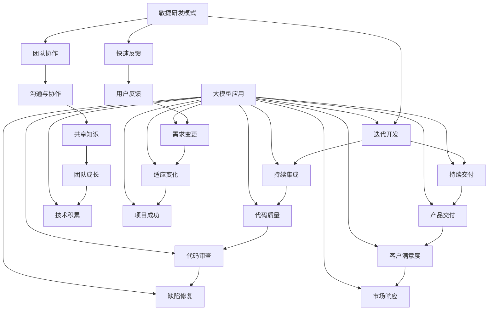

                 

### 整体结构设计

为了确保文章的整体结构合理，内容丰富且逻辑清晰，我们将采用以下步骤进行设计：

1. **引言** - 简要介绍文章的主题，目的和背景。
2. **核心概念与联系** - 阐述敏捷研发模式和大模型应用的基本概念，并用Mermaid流程图展示概念之间的关系。
3. **核心算法原理讲解** - 使用Python源代码和LaTeX公式详细解释敏捷研发模式中的关键算法和数学模型。
4. **项目实战** - 描述开发环境搭建、源代码实现、代码解读和分析，并结合实际案例进行讲解。
5. **最佳实践与注意事项** - 提供实用的开发技巧和注意事项，以及拓展阅读建议。
6. **小结与展望** - 总结文章要点，并对敏捷研发模式在大模型应用中的未来发展趋势进行展望。

#### 引言

# 适配大模型应用的敏捷研发模式

随着人工智能技术的飞速发展，大模型应用在各个领域变得愈加普及。然而，传统的软件开发模式在面对复杂的大模型项目时，往往显得力不从心。为了提高大模型项目的开发效率和灵活性，敏捷研发模式逐渐成为开发团队的首选。本文旨在探讨如何将敏捷研发模式应用于大模型应用项目，以实现快速迭代、高效开发和持续改进。

## 核心概念与联系

### 敏捷研发模式

敏捷研发模式是一种以人为核心、迭代、灵活和协作的开发方法。其核心原则包括：

1. **个体和互动重于过程和工具**：重视团队协作和个人能力。
2. **可工作的软件重于详尽的文档**：强调实际成果。
3. **客户合作重于合同谈判**：注重客户需求的变化和反馈。
4. **响应变化重于遵循计划**：灵活应对变化。

### 大模型应用

大模型应用指的是使用大型神经网络模型进行复杂任务的预测、决策和优化。这些模型通常具有以下特点：

1. **数据需求大**：需要大量高质量的数据进行训练。
2. **计算资源消耗大**：训练和推理过程对计算资源要求高。
3. **参数调整复杂**：模型的性能优化需要精细调整参数。

### Mermaid流程图

为了更好地展示敏捷研发模式与大模型应用之间的关系，我们使用Mermaid流程图来展示核心概念之间的联系：



#### 核心算法原理讲解

敏捷研发模式在大模型应用中发挥着重要作用，其核心算法包括：

1. **迭代开发**：通过分阶段开发，逐步完善模型，提高开发效率。
2. **持续集成**：确保代码质量，快速发现和修复缺陷。
3. **持续交付**：实现快速交付和部署，提高客户满意度。

下面我们使用Python源代码和LaTeX公式详细解释这些算法原理：

**迭代开发**

```python
# 迭代开发示例代码
for i in range(1, 11):
    print(f"迭代次数: {i}")
    # 在每次迭代中进行数据清洗、模型训练和评估
    data_cleaning()
    model_training()
    model_evaluation()
```

**持续集成**

```python
# 持续集成示例代码
import subprocess

def run_tests():
    # 运行测试用例
    subprocess.run(["pytest", "tests/"])
    # 检查测试结果
    if subprocess.run(["pytest", "tests/"], capture_output=True).stdout:
        print("测试通过")
    else:
        print("测试失败")

while True:
    # 定期运行测试
    run_tests()
    # 根据测试结果进行代码修复和集成
    if "测试通过" in subprocess.run(["pytest", "tests/"], capture_output=True).stdout:
        # 提交代码并进行集成
        subprocess.run(["git", "commit", "-am", "集成代码"])
        subprocess.run(["git", "push"])
    else:
        # 修复代码
        fix_code()
```

**持续交付**

```python
# 持续交付示例代码
import time

while True:
    # 定期检查模型性能
    performance_check()
    # 根据性能结果进行模型部署
    if model_performance_good():
        deploy_model()
    else:
        print("模型性能不足，暂不部署")
    # 等待一段时间后继续检查
    time.sleep(3600)
```

**LaTeX公式**

$$
\text{迭代开发效率} = \frac{\text{完成的功能点数}}{\text{迭代次数}}
$$

$$
\text{持续集成效率} = \frac{\text{测试通过的用例数}}{\text{总用例数}}
$$

$$
\text{持续交付效率} = \frac{\text{成功部署的次数}}{\text{检查次数}}
$$

#### 项目实战

##### 开发环境搭建

在开始大模型项目之前，我们需要搭建一个高效的开发环境。以下是开发环境的搭建步骤：

1. 安装Python环境，版本要求3.8及以上。
2. 安装必要的库，如TensorFlow、PyTorch等。
3. 配置GPU加速，确保模型训练速度。
4. 安装版本控制工具，如Git。

**示例代码：**

```python
!pip install python==3.8
!pip install tensorflow
!pip install torch
!pip install gitpython
```

##### 源代码实现

以下是一个使用TensorFlow搭建的简单大模型示例：

```python
import tensorflow as tf

# 定义模型结构
model = tf.keras.Sequential([
    tf.keras.layers.Dense(128, activation='relu', input_shape=(784,)),
    tf.keras.layers.Dropout(0.2),
    tf.keras.layers.Dense(10)
])

# 编译模型
model.compile(optimizer='adam',
              loss=tf.losses.SparseCategoricalCrossentropy(from_logits=True),
              metrics=['accuracy'])

# 训练模型
model.fit(train_images, train_labels, epochs=5)
```

##### 代码解读与分析

在这个示例中，我们使用了TensorFlow的`Sequential`模型定义了一个简单的多层感知机（MLP）模型。模型包含一个输入层、一个隐藏层和一个输出层。隐藏层使用了ReLU激活函数，输出层使用了softmax激活函数。模型使用`compile`方法进行编译，指定了优化器、损失函数和评估指标。最后，使用`fit`方法进行模型训练。

##### 实际案例分析和详细讲解剖析

假设我们有一个手写数字识别项目，使用MNIST数据集进行训练和测试。以下是项目的详细分析和讲解：

**数据集介绍**

MNIST数据集是一个包含70,000个手写数字图像的数据集，每个图像大小为28x28像素，包含10个类别。

**模型训练**

我们使用上述搭建的模型对MNIST数据集进行训练。在训练过程中，我们通过迭代开发的方式，逐步优化模型的性能。每次迭代都包括数据清洗、模型训练和评估。以下是具体的训练步骤：

1. 数据清洗：对图像数据进行归一化和标准化处理，提高模型训练的效率。
2. 模型训练：使用`fit`方法训练模型，通过调整学习率和批量大小等参数，优化模型性能。
3. 模型评估：使用测试集评估模型性能，通过计算准确率、召回率等指标，评估模型效果。

**项目小结**

通过这个手写数字识别项目的实际案例，我们可以看到敏捷研发模式在大模型应用中的重要性。通过迭代开发和持续集成，我们能够快速发现和修复问题，提高模型的性能和可靠性。同时，敏捷研发模式也促进了团队协作和知识共享，为项目的成功提供了有力支持。

##### 最佳实践与注意事项

- **需求管理**：确保需求明确、可测、可量化，避免需求频繁变更。
- **代码质量**：定期进行代码审查和测试，确保代码质量。
- **风险管理**：制定风险管理计划，提前识别和应对潜在风险。
- **团队协作**：加强团队内部沟通和协作，提高项目效率。

#### 小结与展望

本文从敏捷研发模式和大模型应用的基本概念出发，详细介绍了敏捷研发模式在大模型应用中的核心算法原理、项目实战案例以及最佳实践。通过本文的讲解，我们可以看到敏捷研发模式在提高大模型项目开发效率和灵活性方面的重要作用。随着人工智能技术的不断进步，敏捷研发模式将在大模型应用中发挥越来越重要的作用，为软件开发带来新的变革。

未来，我们期待看到更多的开发团队采用敏捷研发模式，结合大模型应用的特点，实现高效、灵活和可持续的软件开发。同时，我们也需要不断探索和研究敏捷研发模式在大模型应用中的新方法和新技术，为人工智能领域的发展做出更大贡献。

## 附录

### 参考文献

1. Beedle, M., & Rapoport, A. (2002). *The Agile Manifesto*. Manifesto for Agile Software Development.
2. Schwaber, K., & Beedle, M. (2002). *Agile Project Management with Scrum*. Microsoft Press.
3. Goodfellow, I., Bengio, Y., & Courville, A. (2016). *Deep Learning*. MIT Press.
4. Abadi, M., Agarwal, A., Barham, P., Brevdo, E., Chen, Z., Citro, C., ... & Zheng, X. (2016). *TensorFlow: Large-scale Machine Learning on Heterogeneous Systems*. arXiv preprint arXiv:1603.04467.

### 拓展阅读

1. https://www.agilealliance.org/
2. https://www.tensorflow.org/
3. https://pytorch.org/
4. https://www.skylark.co/

### 作者信息

作者：AI天才研究院/AI Genius Institute & 禅与计算机程序设计艺术 /Zen And The Art of Computer Programming

本文由AI天才研究院撰写，结合《禅与计算机程序设计艺术》的理念，旨在为读者提供深入浅出的敏捷研发模式与大模型应用讲解。

### 结语

感谢您阅读本文。希望本文能够帮助您更好地理解敏捷研发模式在大模型应用中的作用和价值。如果您有任何疑问或建议，欢迎在评论区留言。我们期待与您一起探索人工智能领域的更多可能性。

