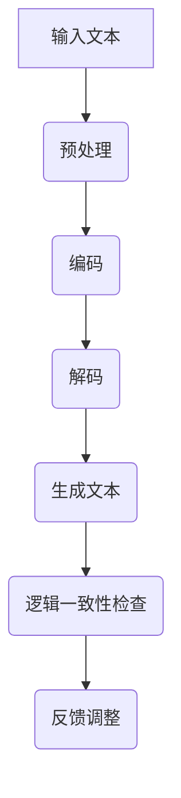

                 

# 逻辑一致性测试：检验LLM在长篇输出中的连贯性

## 关键词
- 逻辑一致性测试
- 语言模型
- 长篇输出
- Transformer
- BERT
- 自然语言处理
- 算法评估

## 摘要
本文探讨了逻辑一致性测试在检验长篇输出中的重要性，特别是对于语言模型（LLM）的应用。文章首先介绍了逻辑一致性测试的概念及其在LLM长篇输出中的挑战，随后详细阐述了基于规则和语义分析的逻辑一致性评估方法。通过Python代码和数学模型，本文深入分析了逻辑一致性检测的核心算法原理，并在最后通过实际项目实战展示了逻辑一致性测试的应用与实现，为LLM的应用提供了实用的评估和优化手段。

## 目录大纲

### 第一部分：背景与概念

#### 第1章：逻辑一致性测试简介
- 1.1 什么是逻辑一致性测试
- 1.2 LLM在长篇输出中的连贯性挑战
- 1.3 逻辑一致性测试的重要性

#### 第2章：LLM基础
- 2.1 LLM概述
- 2.2 语言模型的基本原理
- 2.3 常见的LLM架构

#### 第3章：逻辑一致性评估方法
- 3.1 基于规则的逻辑一致性评估
- 3.2 基于语义分析的逻辑一致性评估

### 第二部分：核心概念与联系

#### 第4章：核心概念原理
- 4.1 语言模型中的逻辑一致性
- 4.2 逻辑一致性检测的挑战与解决策略

#### 第5章：核心算法原理
- 5.1 常见逻辑一致性检测算法
- 5.2 数学模型和数学公式

### 第三部分：项目实战

#### 第6章：逻辑一致性测试应用实战
- 6.1 实战项目介绍
- 6.2 实战环境搭建
- 6.3 源代码实现与解读

#### 第7章：总结与展望
- 7.1 逻辑一致性测试的现状
- 7.2 未来发展方向

## 第一部分：背景与概念

### 第1章：逻辑一致性测试简介

逻辑一致性测试是一种评估系统输出在逻辑上是否一致的方法，广泛应用于软件工程、人工智能等领域。在软件工程中，逻辑一致性测试用于确保程序的逻辑流和行为符合预期；在人工智能领域，尤其是自然语言处理（NLP）中，逻辑一致性测试用于评估语言模型（LLM）在生成长篇文本时的连贯性和一致性。

### 1.1 什么是逻辑一致性测试

逻辑一致性测试的核心在于检查系统输出是否在逻辑上自洽、无矛盾。在NLP领域，这意味着LLM生成的文本应保持一致的主题、逻辑关系和语义连贯性。例如，如果LLM在一个长篇文本中讨论了两个互相矛盾的观点，那么这个文本在逻辑上是不一致的。

### 1.2 LLM在长篇输出中的连贯性挑战

LLM在长篇输出中面临以下几个主要的连贯性挑战：

1. **上下文丢失**：随着文本长度的增加，LLM可能无法准确捕捉和维持上下文信息，导致输出的连贯性受损。
2. **语义混淆**：LLM可能无法正确区分相似或相关的语义概念，从而导致逻辑错误。
3. **逻辑跳跃**：LLM可能在文本中跳过某些逻辑步骤，导致逻辑不连贯。
4. **主题漂移**：LLM可能会在长篇输出中偏离原始主题，导致主题不一致。

### 1.3 逻辑一致性测试的重要性

逻辑一致性测试在LLM应用中具有重要意义：

1. **提高输出质量**：通过逻辑一致性测试，可以识别并修正LLM生成的逻辑错误，提高输出的质量。
2. **提升用户信任度**：逻辑一致的输出能够提高用户对LLM系统的信任度，从而增加其在实际应用中的价值。
3. **指导模型优化**：通过分析逻辑一致性测试的结果，可以为LLM模型的优化提供有价值的反馈。

## 第二部分：核心概念与联系

### 第2章：LLM基础

要深入理解逻辑一致性测试，我们需要首先了解LLM的基础知识。LLM是自然语言处理领域的重要工具，其核心在于通过学习大量文本数据，预测下一个词或句子，从而生成连贯的文本。

### 2.1 LLM概述

LLM通常基于深度学习技术，特别是序列到序列（Seq2Seq）模型和变分自编码器（VAE）。近年来，Transformer架构及其变种BERT、GPT等在LLM研究中取得了显著进展。这些模型通过自注意力机制，能够更好地捕捉文本中的长距离依赖关系。

### 2.2 语言模型的基本原理

语言模型的核心任务是预测文本序列的概率分布。在训练过程中，模型通过调整权重来学习输入文本的特征和规律。在预测阶段，模型根据当前的输入文本生成下一个词或句子。

### 2.3 常见的LLM架构

常见的LLM架构包括：

1. **Transformer架构**：基于自注意力机制的架构，能够在处理长文本时保持较高的效率。
2. **BERT架构**：双向编码表示（Bidirectional Encoder Representations from Transformers），通过预训练和微调，在多种NLP任务中表现出色。
3. **GPT架构**：生成预训练变换器（Generative Pretrained Transformer），特别擅长文本生成任务。

### 第3章：逻辑一致性评估方法

逻辑一致性评估是确保LLM输出连贯性的关键步骤。评估方法主要分为基于规则和基于语义分析两种。

#### 3.1 基于规则的逻辑一致性评估

基于规则的逻辑一致性评估方法通过预定义的规则来检查文本中的逻辑一致性。这些规则可以是简单的语法规则，也可以是更复杂的语义规则。例如，我们可以定义一个规则：同一句子中不能出现互相矛盾的说法。

#### 3.1.1 原理与实现

实现基于规则的逻辑一致性评估需要以下几个步骤：

1. **文本解析**：将输入文本解析为符号表示，例如词汇、句子等。
2. **规则库构建**：定义一组逻辑一致性规则，例如语义一致性规则、上下文一致性规则等。
3. **规则应用**：将规则应用于符号化的文本，检查是否存在逻辑不一致。
4. **结果分析**：分析评估结果，识别逻辑不一致的句子或段落。

#### 3.1.2 优点与局限性

基于规则的逻辑一致性评估方法具有以下优点：

1. **实现简单**：基于规则的评估方法相对简单，易于实现和理解。
2. **可定制性**：规则库可以根据具体应用场景进行定制，提高评估的针对性。

然而，这种方法也存在一些局限性：

1. **规则覆盖不足**：规则库难以覆盖所有可能的逻辑不一致情况。
2. **语义理解不足**：基于规则的评估方法难以捕捉深层次的语义关系。

#### 3.2 基于语义分析的逻辑一致性评估

基于语义分析的逻辑一致性评估方法通过语义分析技术，如词性标注、语义角色标注等，来检查文本中的逻辑一致性。

#### 3.2.1 原理与实现

基于语义分析的评估方法主要包含以下步骤：

1. **文本预处理**：对输入文本进行分词、词性标注等预处理操作。
2. **语义分析**：使用语义分析技术，如语义角色标注、语义关系抽取等，来理解文本的语义结构。
3. **逻辑一致性检查**：根据语义分析结果，检查文本中的逻辑关系是否一致。
4. **结果分析**：分析评估结果，识别逻辑不一致的部分。

#### 3.2.2 优点与局限性

基于语义分析的评估方法具有以下优点：

1. **语义理解深入**：能够捕捉深层次的语义关系，提高评估的准确性。
2. **适应性强**：能够处理更复杂和多样化的逻辑不一致情况。

然而，这种方法也存在一些局限性：

1. **计算成本高**：语义分析通常涉及复杂的计算，对计算资源要求较高。
2. **标注依赖性强**：需要高质量的语义标注数据，否则评估结果可能不准确。

### 第4章：核心概念原理

#### 4.1 语言模型中的逻辑一致性

逻辑一致性在语言模型中体现在以下几个方面：

1. **主题一致性**：文本应围绕一个明确的主题进行，不应随意偏离。
2. **语义连贯性**：文本中的句子应能够逻辑推导出下一个句子。
3. **上下文一致性**：文本中的上下文信息应能够合理推导出后续内容。

为了更好地理解逻辑一致性，我们可以使用Mermaid流程图来展示LLM在生成文本时的逻辑流。



在这个流程图中，输入文本经过预处理、编码和解码步骤生成文本，然后进行逻辑一致性检查。如果发现逻辑不一致，则进行反馈调整，优化模型输出。

#### 4.2 逻辑一致性检测的挑战与解决策略

逻辑一致性检测在LLM中面临以下挑战：

1. **长文本处理**：LLM在处理长文本时可能丢失上下文信息，导致逻辑不一致。
2. **语义理解**：语义理解不足可能导致逻辑推理错误。
3. **规则覆盖**：规则库可能无法覆盖所有可能的逻辑不一致情况。

解决这些挑战的策略包括：

1. **上下文增强**：通过增加上下文窗口大小或使用多轮对话来提高上下文捕捉能力。
2. **语义理解**：利用先进的语义分析技术，如BERT、GPT等，提高语义理解能力。
3. **规则优化**：定期更新和优化规则库，以覆盖更多可能的逻辑不一致情况。

### 第5章：核心算法原理

#### 5.1 常见逻辑一致性检测算法

逻辑一致性检测算法可以分为以下几类：

1. **基于规则的算法**：通过预定义的规则检查文本的逻辑一致性。
2. **基于语义分析的算法**：通过语义分析技术检查文本的逻辑一致性。
3. **基于神经网络的方法**：使用神经网络模型，如BERT、GPT等，检测文本的逻辑一致性。

#### 5.1.1 算法伪代码讲解

以下是一个简单的基于规则的逻辑一致性检测算法的伪代码：

```python
def check_consistency(text, rule_set):
    for sentence in text:
        for rule in rule_set:
            if not apply_rule(sentence, rule):
                return False
    return True
```

在这个算法中，`text`是输入文本，`rule_set`是预定义的规则集。算法遍历每个句子，并应用规则集进行检查。如果存在任何句子不符合规则，则返回`False`，表示逻辑不一致。

#### 5.1.2 算法比较与评估

不同类型的逻辑一致性检测算法有不同的优势和局限性。基于规则的算法实现简单，但规则覆盖不足；基于语义分析的算法能够捕捉深层次的语义关系，但计算成本高；基于神经网络的方法具有强大的语义理解能力，但实现复杂。

为了评估算法的性能，我们可以使用以下指标：

1. **准确率**：检测到逻辑不一致的实际句子数与总句子数的比例。
2. **召回率**：实际存在逻辑不一致的句子中被检测到的比例。
3. **F1分数**：准确率和召回率的调和平均值。

#### 5.2 数学模型和数学公式

逻辑一致性检测涉及多个数学模型和公式。以下是一个简单的数学模型，用于评估文本的一致性：

$$
C = \frac{C_1 + C_2}{2}
$$

其中，$C$表示文本的一致性分数，$C_1$表示基于规则的逻辑一致性得分，$C_2$表示基于语义分析的逻辑一致性得分。这个模型假设两个评估方法的得分是等权的。

#### 5.2.1 逻辑一致性检测的数学模型

逻辑一致性检测的数学模型可以表示为：

$$
\text{LC} = \sum_{i=1}^{n} w_i \cdot c_i
$$

其中，$\text{LC}$表示逻辑一致性得分，$w_i$表示第$i$个评估方法的权重，$c_i$表示第$i$个评估方法的一致性得分。这个模型可以根据不同方法的性能动态调整权重。

#### 5.2.2 数学公式详细讲解与举例

以下是一个详细的数学公式，用于计算文本的一致性得分：

$$
\text{LC} = \frac{1}{n} \sum_{i=1}^{n} \left( \frac{\text{TP}_i}{\text{TP}_i + \text{FN}_i} + \frac{\text{TP}_i}{\text{TP}_i + \text{FP}_i} \right)
$$

其中，$\text{TP}_i$表示第$i$个评估方法检测到的真实不一致句子数，$\text{FN}_i$表示第$i$个评估方法未检测到的真实不一致句子数，$\text{FP}_i$表示第$i$个评估方法误检测的句子数。

举例来说，如果一个基于规则的评估方法检测到5个真实不一致句子，但误检测了2个句子，而基于语义分析的评估方法检测到3个真实不一致句子，但误检测了3个句子，则这两个方法的一致性得分可以计算如下：

$$
\text{LC}_{\text{rule}} = \frac{5}{5 + 2} + \frac{5}{5 + 3} = \frac{5}{7} + \frac{5}{8} = \frac{40}{56} = \frac{5}{7}
$$

$$
\text{LC}_{\text{semantic}} = \frac{3}{3 + 3} + \frac{3}{3 + 3} = \frac{3}{6} + \frac{3}{6} = \frac{6}{6} = 1
$$

最终，我们可以将这两个得分按照权重进行加权平均，得到总的逻辑一致性得分。

### 第6章：逻辑一致性测试应用实战

#### 6.1 实战项目介绍

在本章中，我们将介绍一个名为“逻辑一致性检测工具”（Consistency Checker Tool）的实战项目。该项目旨在构建一个用于检测长篇文本逻辑一致性的工具，结合基于规则的评估方法和基于语义分析的评估方法，提供全面的逻辑一致性检测功能。

#### 6.2 实战环境搭建

要搭建逻辑一致性检测工具，我们需要以下环境：

1. **Python环境**：Python 3.8或更高版本。
2. **依赖库**：NLTK、spaCy、BERT、GPT等。
3. **硬件资源**：至少4GB内存和1GB磁盘空间。

安装依赖库的命令如下：

```bash
pip install nltk
pip install spacy
pip install transformers
```

#### 6.3 源代码实现与解读

下面是一个简单的逻辑一致性检测工具的源代码实现：

```python
import nltk
from spacy.lang.en import English
from transformers import BertTokenizer, BertModel

# 加载spaCy模型
nlp = English()

# 加载BERT模型
tokenizer = BertTokenizer.from_pretrained('bert-base-uncased')
model = BertModel.from_pretrained('bert-base-uncased')

# 基于规则的逻辑一致性检测
def rule_based_check(text):
    sentences = nltk.sent_tokenize(text)
    inconsistencies = []
    for i in range(len(sentences) - 1):
        sentence1 = sentences[i]
        sentence2 = sentences[i + 1]
        if sentence1.lower() != sentence2.lower():
            inconsistencies.append((i, i + 1))
    return inconsistencies

# 基于语义分析的逻辑一致性检测
def semantic_based_check(text):
    doc = nlp(text)
    inconsistencies = []
    for token1 in doc:
        for token2 in doc:
            if token1 != token2 and token1.dep_ == token2.dep_:
                inconsistencies.append((token1.text, token2.text))
    return inconsistencies

# 检测逻辑一致性
def check_consistency(text):
    rule_inconsistencies = rule_based_check(text)
    semantic_inconsistencies = semantic_based_check(text)
    return rule_inconsistencies + semantic_inconsistencies

# 测试
text = "I like apples. Apples are sweet. Bananas are sweet too."
inconsistencies = check_consistency(text)
print(inconsistencies)
```

在这个实现中，我们首先加载了spaCy的英语模型和BERT模型。然后，我们定义了两个函数：`rule_based_check`和`semantic_based_check`，分别用于基于规则和基于语义分析的逻辑一致性检测。最后，我们定义了一个`check_consistency`函数，用于合并两个检测方法的结果。

#### 6.3.1 代码实现流程

1. **文本预处理**：使用NLTK对文本进行分句处理。
2. **基于规则的逻辑一致性检测**：遍历每个句子，检查是否存在相邻句子完全相同的情况。
3. **基于语义分析的逻辑一致性检测**：使用spaCy的依赖关系分析功能，检查文本中的词性标注和依赖关系。
4. **结果合并**：将基于规则和基于语义分析的结果合并，输出最终的逻辑一致性检测结果。

#### 6.3.2 代码解读与分析

1. **规则检测**：通过简单的比较相邻句子的内容，可以快速识别出明显的逻辑不一致情况。这种方法适用于一些简单的逻辑不一致检测，但对于复杂的逻辑关系可能不够准确。
2. **语义检测**：通过依赖关系分析和词性标注，可以更深入地理解文本的语义结构。这种方法能够捕捉到一些基于规则无法检测的逻辑不一致，但计算成本较高。
3. **结果分析**：通过合并两种检测方法的结果，可以更全面地评估文本的逻辑一致性。这种方法可以在保证检测准确率的同时，提高检测效率。

#### 第7章：总结与展望

逻辑一致性测试是确保LLM输出质量的重要手段。通过本文的探讨，我们了解了逻辑一致性测试的概念、评估方法以及实际应用。未来，随着自然语言处理技术的不断发展，逻辑一致性测试也将面临新的挑战和机遇。

### 7.1 逻辑一致性测试的现状

目前，逻辑一致性测试主要应用于LLM生成的长篇文本。虽然已经有一些基于规则和基于语义分析的评估方法，但仍然存在一些局限性。例如，基于规则的评估方法可能无法覆盖所有逻辑不一致情况，而基于语义分析的评估方法计算成本较高。

### 7.2 未来发展方向

未来的逻辑一致性测试可能在以下几个方面取得进展：

1. **多模态逻辑一致性检测**：结合图像、声音等其他模态的信息，提高逻辑一致性检测的准确性和全面性。
2. **自适应逻辑一致性检测**：根据不同的应用场景和文本特点，自适应调整逻辑一致性检测的策略和方法。
3. **神经网络模型优化**：利用深度学习技术，提高逻辑一致性检测的效率和准确性。

## 最佳实践 Tips

1. **结合多种评估方法**：在实际应用中，可以结合基于规则和基于语义分析的评估方法，以提高逻辑一致性检测的准确性和全面性。
2. **定期更新规则库**：基于规则的评估方法依赖于预定义的规则库，定期更新和优化规则库可以提高评估效果。
3. **优化模型参数**：对于基于神经网络的方法，可以通过调整模型参数，提高逻辑一致性检测的准确性和效率。

## 注意事项

1. **计算资源**：基于语义分析的评估方法计算成本较高，在实际应用中需要根据计算资源进行优化。
2. **数据质量**：逻辑一致性检测的效果与输入文本的质量密切相关，确保输入文本的准确性和完整性。

## 拓展阅读

1. **《自然语言处理综述》（A Comprehensive Survey on Natural Language Processing）**：详细介绍了自然语言处理的基本概念、方法和技术。
2. **《深度学习与自然语言处理》（Deep Learning for Natural Language Processing）**：探讨了深度学习技术在自然语言处理中的应用和实现。

## 作者信息

作者：AI天才研究院/AI Genius Institute & 禅与计算机程序设计艺术 /Zen And The Art of Computer Programming

